# F01 - Authentication & Account Management

## Overview

This feature encompasses the full lifecycle of a photographer's identity on the Anansi platform: creating an account, authenticating, recovering access, managing sessions, maintaining account settings, and ultimately deleting an account when desired. It is the security gateway through which every other feature is accessed.

Registration collects email, password, and basic business information, creating both an ASP.NET Core Identity user and a `Photographer` domain entity. Authentication issues JWT access tokens and opaque refresh tokens, with a configurable session timeout enforced by middleware. Password recovery follows the standard email-reset-link flow. Account settings provide a single surface for personal info, business details, notification preferences, connected integrations, billing overview, and password changes.

Storage monitoring is also housed here because it is tied to the photographer's account limits. The system tracks `StorageUsedBytes` on the `Photographer` entity and raises domain-level warnings at 80%, 90%, and 95% of the plan's storage allocation. Account deletion performs a soft-delete with an optional data-export step that packages the photographer's galleries, documents, and financial records before marking the account as deleted.

**L2 Requirements:** SEC-11.2.1 (Authentication), SEC-11.2.2 (Account Settings), SEC-11.2.3 (Storage Monitoring)

---

## Components

### Domain Layer

| Component | Type | Description |
|-----------|------|-------------|
| `Photographer` | Entity | Core identity entity storing personal/business info, integration credentials, storage usage, and branding references. Implements `IAuditableEntity` and `ISoftDeletable`. |
| `BaseEntity` | Abstract | Provides `Id` (Guid), `CreatedAt`, `UpdatedAt` for all entities. |
| `IAuditableEntity` | Interface | Adds `CreatedBy` / `UpdatedBy` tracking. |
| `ISoftDeletable` | Interface | Adds `IsDeleted` / `DeletedAt` for logical deletion. |
| `StorageWarningLevel` | Enum | Values: `None`, `Warning80`, `Warning90`, `Critical95`. |

### Application Layer

| Component | Type | Description |
|-----------|------|-------------|
| `RegisterCommand` | Command | Creates Identity user + `Photographer` entity. Accepts email, password, first/last name, business name. Returns user ID, photographer ID, and JWT. |
| `LoginCommand` | Command | Validates credentials, returns access token, refresh token, and expiration. |
| `ForgotPasswordCommand` | Command | Generates a time-limited reset token and sends an email via `IEmailService`. |
| `ResetPasswordCommand` | Command | Validates the reset token and sets the new password. |
| `ChangePasswordCommand` | Command | Authenticated password change requiring current password verification. |
| `LogoutCommand` | Command | Invalidates the current session/refresh token. |
| `GetAccountSettingsQuery` | Query | Returns the authenticated photographer's full profile. |
| `UpdateAccountSettingsCommand` | Command | Updates personal info, business info, notification preferences, integrations, and password. |
| `DeleteAccountCommand` | Command | Accepts `exportFirst` flag. When true, generates a data export before soft-deleting the account. |
| `GetStorageUsageQuery` | Query | Returns current storage used, plan limit, per-collection breakdown, and warning level. |
| `ICurrentUserService` | Interface | Provides `UserId`, `PhotographerId`, `IsAuthenticated` from the HTTP context. |
| `ITokenService` | Interface | Generates JWT access tokens and opaque refresh tokens. |
| `IEmailService` | Interface | Sends plain and templated emails for password reset and notifications. |
| `IStorageService` | Interface | File upload/download/delete operations and pre-signed URL generation. |

### Infrastructure Layer

| Component | Type | Description |
|-----------|------|-------------|
| `RegisterCommandHandler` | Handler | Coordinates Identity `UserManager` to create the user, then creates the `Photographer` entity and issues a token. |
| `LoginCommandHandler` | Handler | Uses `SignInManager` for credential validation, then calls `TokenService`. |
| `ForgotPasswordCommandHandler` | Handler | Generates Identity reset token, constructs reset URL, sends email. |
| `ResetPasswordCommandHandler` | Handler | Validates Identity reset token, calls `ResetPasswordAsync`. |
| `ChangePasswordCommandHandler` | Handler | Calls Identity `ChangePasswordAsync` with old/new passwords. |
| `LogoutCommandHandler` | Handler | Clears session state and optionally revokes refresh tokens. |
| `TokenService` | Service | Implements `ITokenService`. Creates HS256-signed JWTs with claims for user ID, email, photographer ID, and roles. Generates cryptographically random refresh tokens. |
| `CurrentUserService` | Service | Implements `ICurrentUserService`. Extracts claims from `HttpContext.User`. |
| `ApplicationDbContext` | DbContext | EF Core context with `DbSet<Photographer>`. Applies tenant filtering and soft-delete query filters. |

### API Layer

| Component | Type | Description |
|-----------|------|-------------|
| `AuthController` | Controller | Endpoints: `POST register`, `POST login`, `POST forgot-password`, `POST reset-password`, `POST change-password`, `POST logout`. Anonymous endpoints for register/login/forgot/reset. |
| `AccountController` | Controller | Endpoints: `GET settings`, `PUT settings`, `DELETE` (account deletion), `GET storage`. All require `[Authorize]`. |
| `SessionTimeoutMiddleware` | Middleware | Checks elapsed time since last activity. If exceeds configurable timeout (default 30 min), clears session and returns 401. Updates `LastActivity` timestamp on each request. |

---

## Class Diagrams

### Domain Layer -- Identity & Account Entities

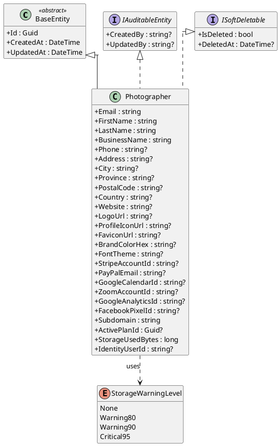

### Application Layer -- Auth Commands & Interfaces

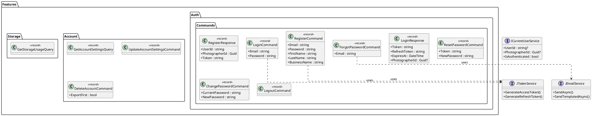

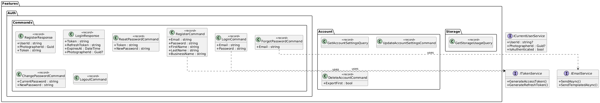

### Infrastructure Layer -- Identity Services

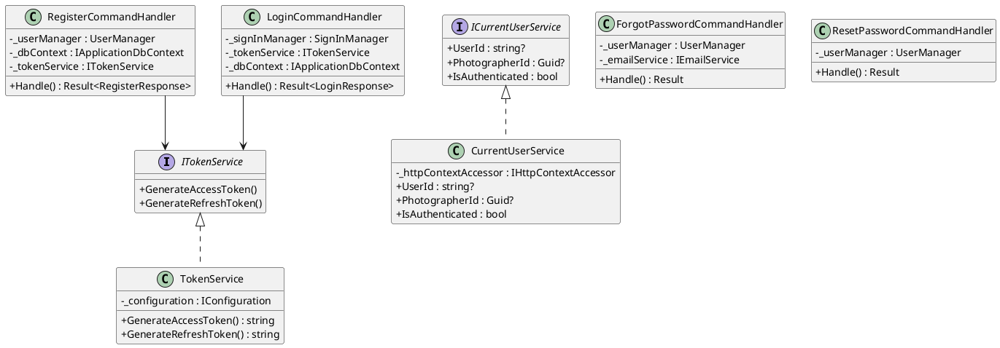

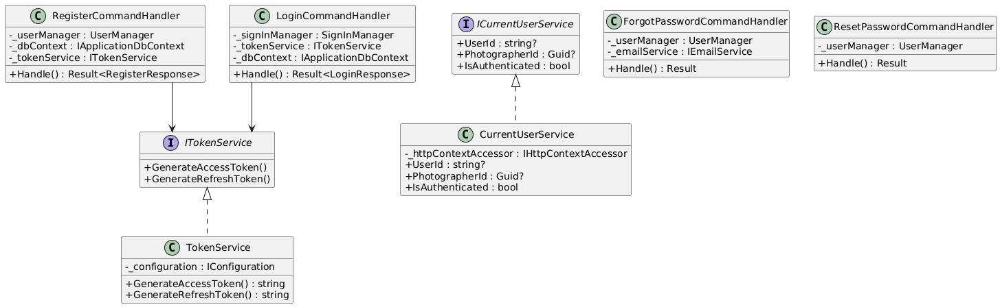

### API Layer -- Controllers & Middleware

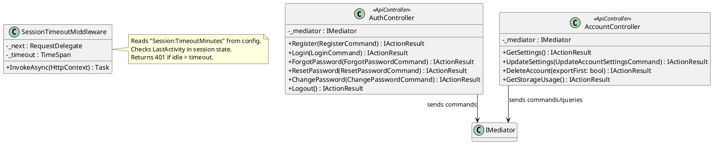

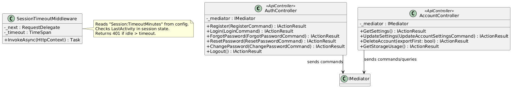

---

## Sequence Diagrams

### User Registration

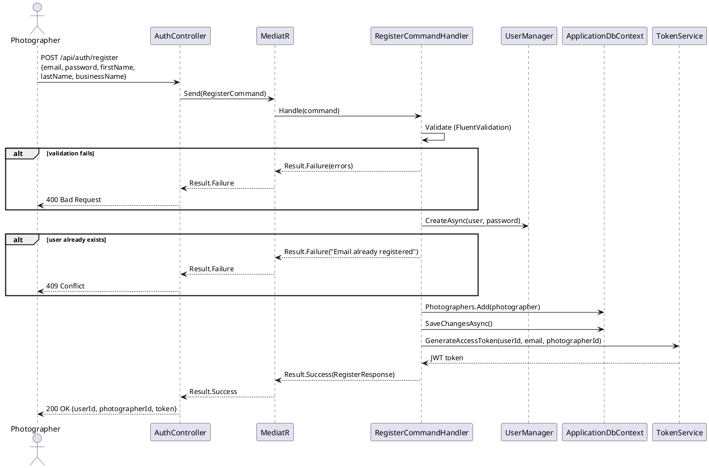

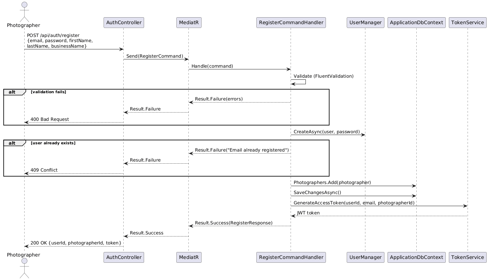

### User Login

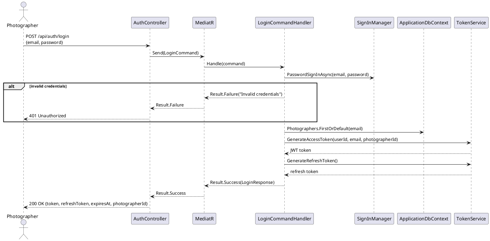

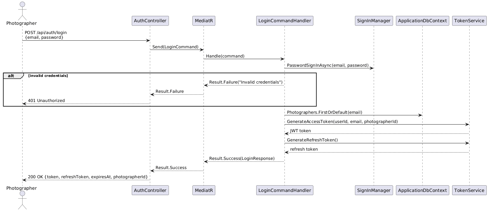

### Password Recovery Flow

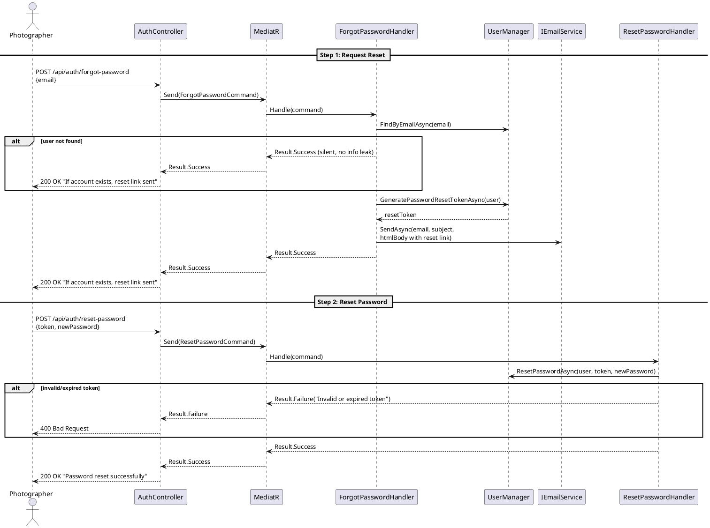

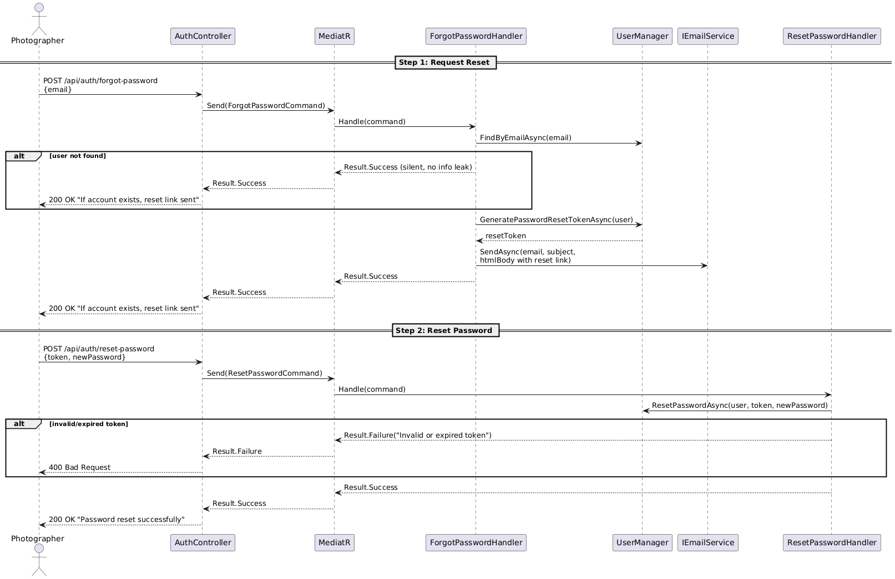

### Session Timeout Enforcement

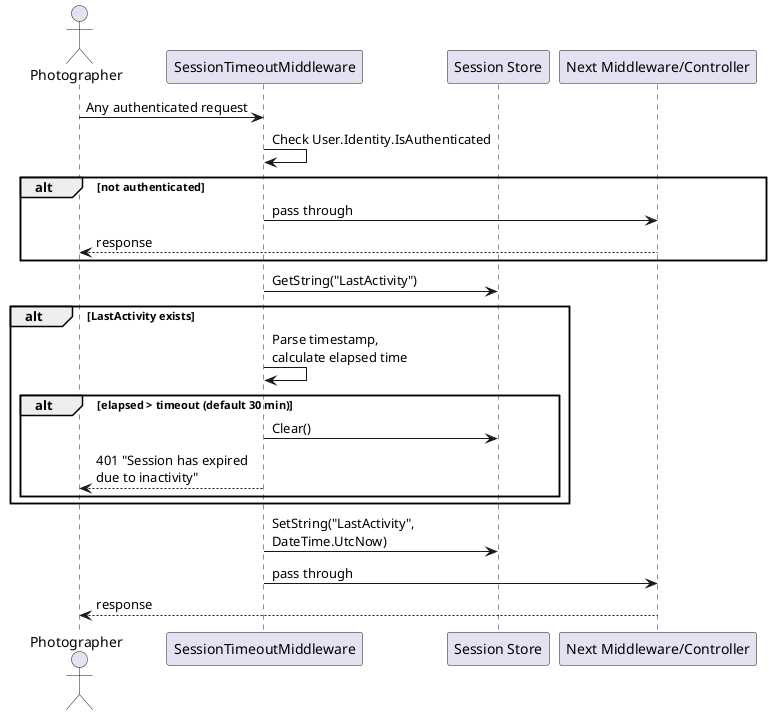

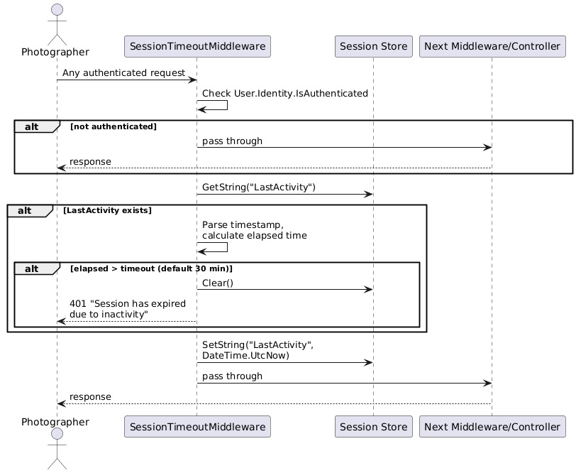

### Account Deletion with Data Export

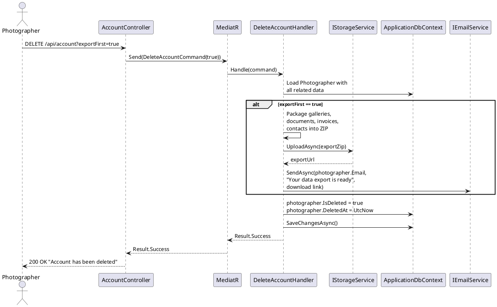

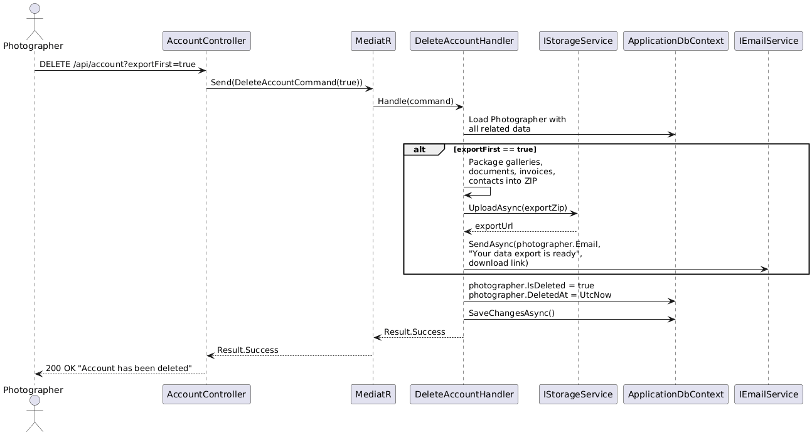

### Storage Usage Monitoring

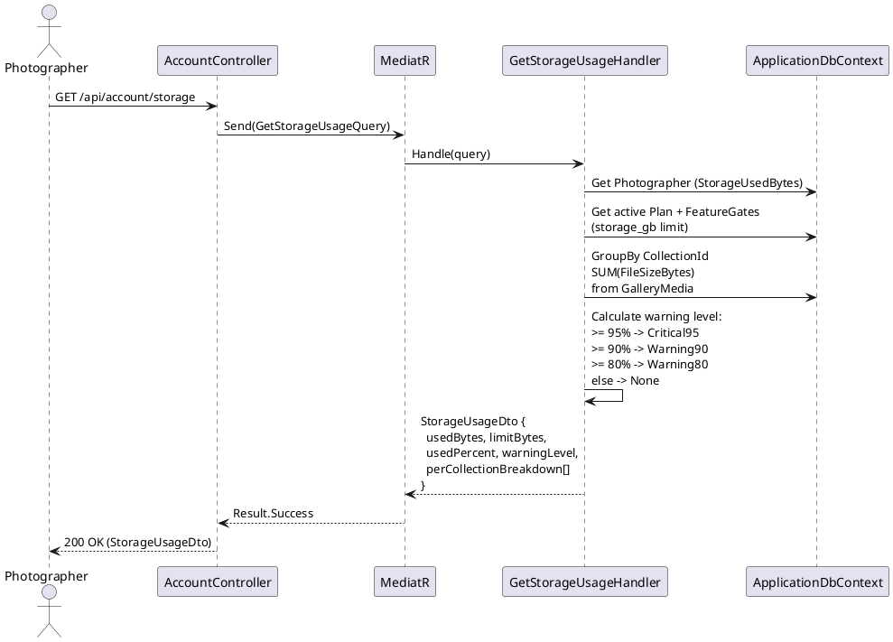

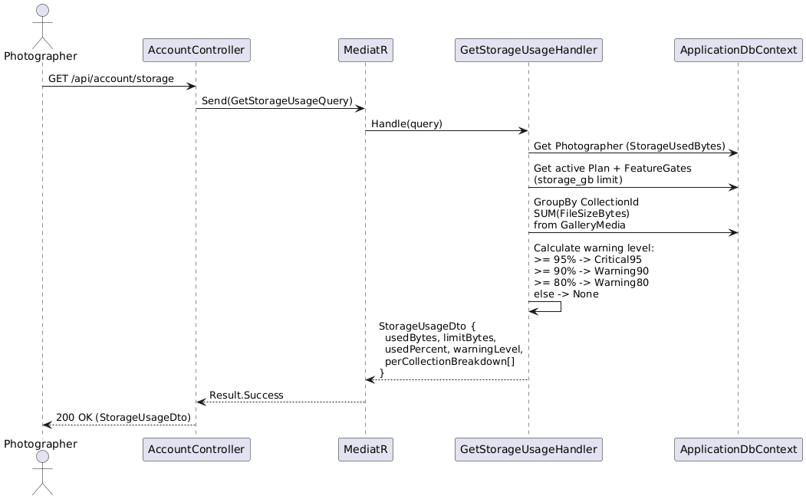
