# F02 - Subscription & Plan Management

## Overview

This feature implements the tiered pricing architecture that governs every capability in Anansi. Four product areas each offer free and paid tiers: Client Gallery (Free/Basic/Plus/Pro/Ultimate), Website Builder (Free/Plus/Pro), Studio Manager (Free/Plus/Pro), and Suite bundles (Starter/Pro/Ultimate) that combine all three at a discount. The `Plan` entity defines each tier with monthly and annual pricing, while `PlanFeatureGate` entries encode the specific limits and toggles that each tier unlocks.

Subscription management allows photographers to subscribe, upgrade, downgrade, and cancel at any time. Plan changes apply proration -- unused time on the current plan is credited toward the new plan -- orchestrated through the Stripe Billing API. Annual billing offers a minimum 15% discount over monthly rates, and Suite bundles offer at least 25% savings versus purchasing products individually. Free tiers never require a credit card.

Feature gating is the runtime enforcement layer. Before any gated operation (e.g., uploading a RAW file, enabling auto-fulfillment, or creating a fourth session type), the system checks the photographer's active plan against the relevant `PlanFeatureGate` entry. This is exposed as a reusable query (`CheckFeatureAccessQuery`) and can be called from any feature's handler to enforce plan limits consistently.

**L2 Requirements:** PLN-10.1.1 (Free Tiers), PLN-10.1.2 (Paid Tiers), PLN-10.1.3 (Suite Bundle), PLN-10.2.1 (Gallery Gates), PLN-10.2.2 (Website Gates), PLN-10.2.3 (Studio Manager Gates), PLN-10.2.4 (Suite Gates)

---

## Components

### Domain Layer

| Component | Type | Description |
|-----------|------|-------------|
| `Plan` | Entity | Defines a pricing tier for a product area. Stores monthly/annual price in cents, suite bundle flag, and active status. Has a collection of `PlanFeatureGate` entries. Implements `ISoftDeletable`. |
| `PlanFeatureGate` | Entity | Key-value pair encoding a single feature limit or toggle for a plan (e.g., `storage_gb` = `"3"`, `raw_upload` = `"false"`, `video_hours` = `"unlimited"`). |
| `Subscription` | Entity | Links a `Photographer` to a `Plan` with billing interval, Stripe subscription ID, current period dates, price, proration credit, and cancellation state. Implements `ITenantEntity` and `ISoftDeletable`. |
| `PlanProduct` | Enum | `Gallery`, `Website`, `StudioManager`, `Suite` |
| `PlanTier` | Enum | `Free`, `Basic`, `Plus`, `Pro`, `Ultimate` |
| `BillingInterval` | Enum | `Monthly`, `Annual` |
| `SubscriptionStatus` | Enum | `Active`, `PastDue`, `Cancelled`, `Trialing` |

### Application Layer

| Component | Type | Description |
|-----------|------|-------------|
| `GetPlansQuery` | Query | Lists all available plans, optionally filtered by `PlanProduct`. Returns plan details with feature gates and pricing. Public (no auth required). |
| `CreatePlanCommand` | Command | Admin operation to define a new plan with pricing and feature gates. |
| `UpdatePlanCommand` | Command | Admin operation to modify an existing plan's pricing or feature gates. |
| `GetCurrentSubscriptionQuery` | Query | Returns the authenticated photographer's active subscription with plan details. |
| `CreateSubscriptionCommand` | Command | Subscribes a photographer to a plan. For free tiers, no Stripe interaction. For paid tiers, creates a Stripe subscription and stores the subscription ID. |
| `ChangeSubscriptionCommand` | Command | Upgrade or downgrade. Calculates proration credit, updates Stripe subscription, and swaps the local plan reference. |
| `CancelSubscriptionCommand` | Command | Cancels at period end (default) or immediately. Updates Stripe and sets local cancellation state. |
| `CheckFeatureAccessQuery` | Query | Given a `featureKey`, checks the photographer's active plan for the corresponding gate value. Returns allowed/denied with the current value and limit. |
| `IPaymentService` | Interface | Stripe integration for creating payment intents, checkout sessions, connected accounts, and refunds. |

### Infrastructure Layer

| Component | Type | Description |
|-----------|------|-------------|
| `PlanConfiguration` | EF Config | Maps `Plan` entity with product/tier composite indexing and price constraints. |
| `PlanFeatureGateConfiguration` | EF Config | Maps feature gates with foreign key to `Plan` and unique index on `(PlanId, FeatureKey)`. |
| `SubscriptionConfiguration` | EF Config | Maps subscription with foreign key to `Plan` and `Photographer`, with unique index on active subscriptions per photographer. |

### API Layer

| Component | Type | Description |
|-----------|------|-------------|
| `PlansController` | Controller | Endpoints: `GET /api/plans` (public), `POST /api/plans` (admin), `PUT /api/plans/{id}` (admin), `GET /api/plans/subscription`, `POST /api/plans/subscription`, `PUT /api/plans/subscription`, `DELETE /api/plans/subscription`, `GET /api/plans/features/{featureKey}`. |

---

## Class Diagrams

### Domain Layer -- Plan & Subscription Entities

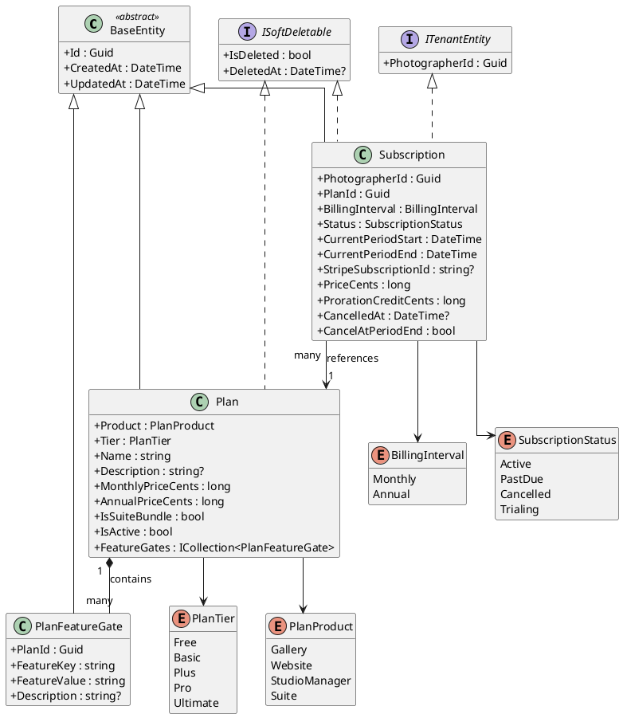

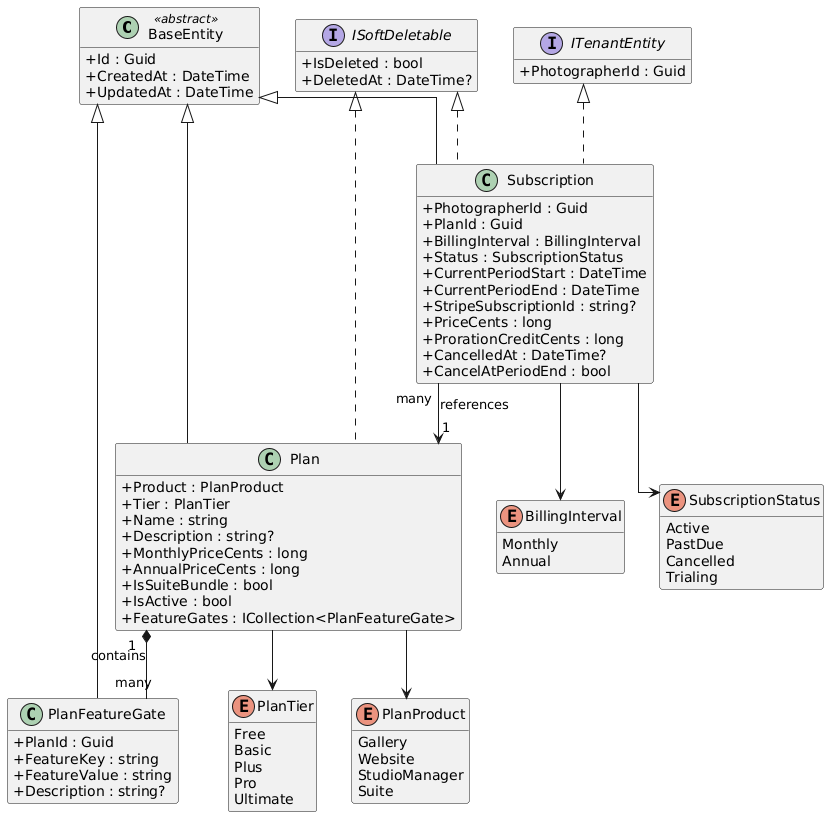

### Application Layer -- Subscription Commands & Queries

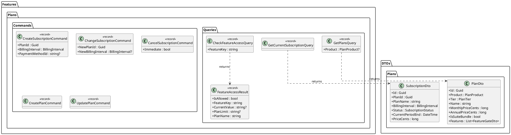

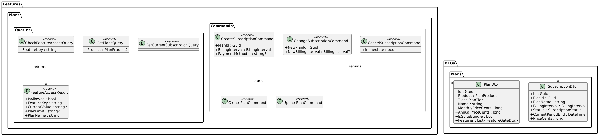

### API Layer -- Plans Controller

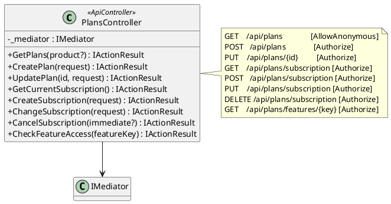

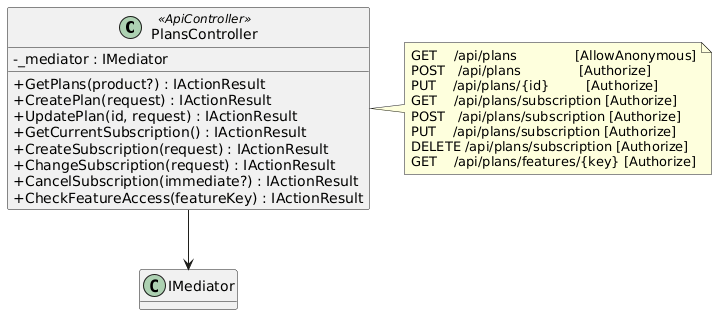

---

## Sequence Diagrams

### Browse Available Plans (Public)

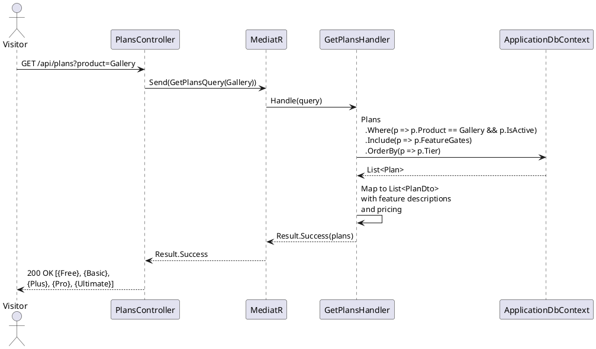

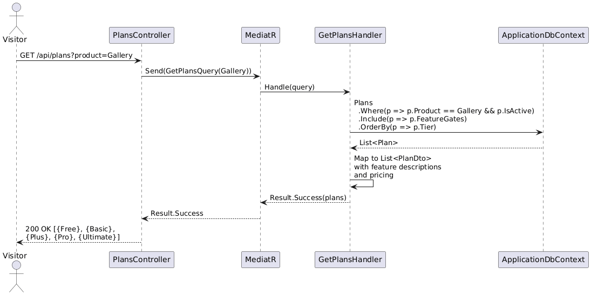

### Subscribe to a Paid Plan

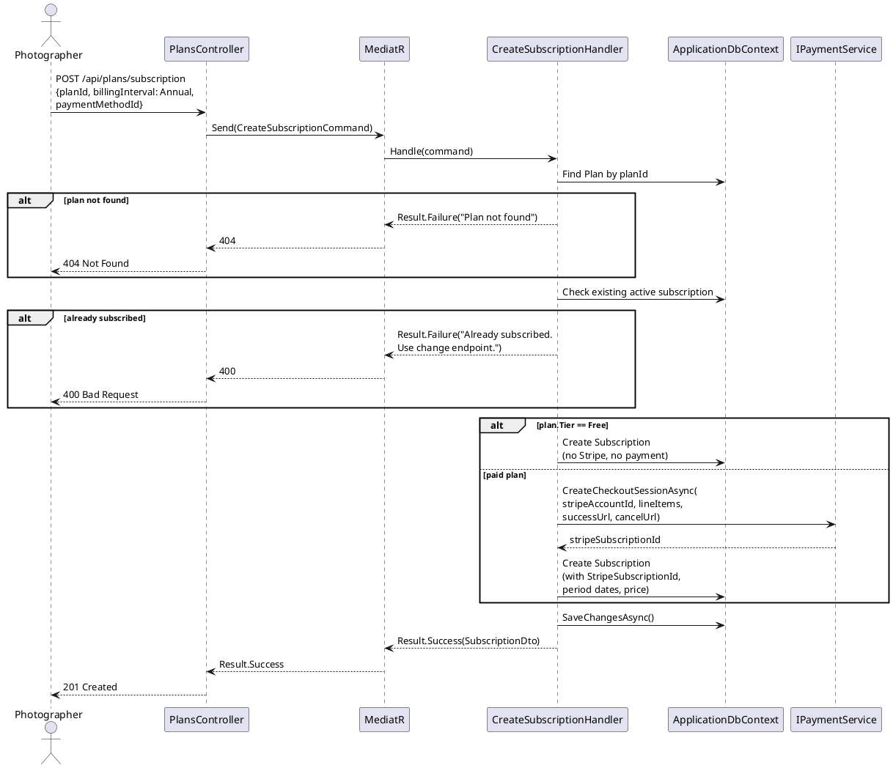

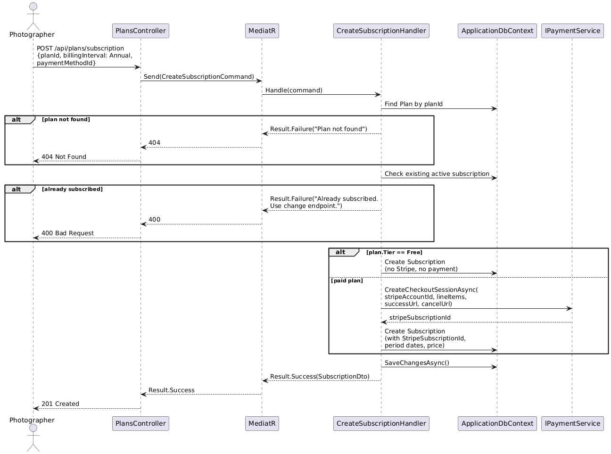

### Upgrade/Downgrade Plan with Proration

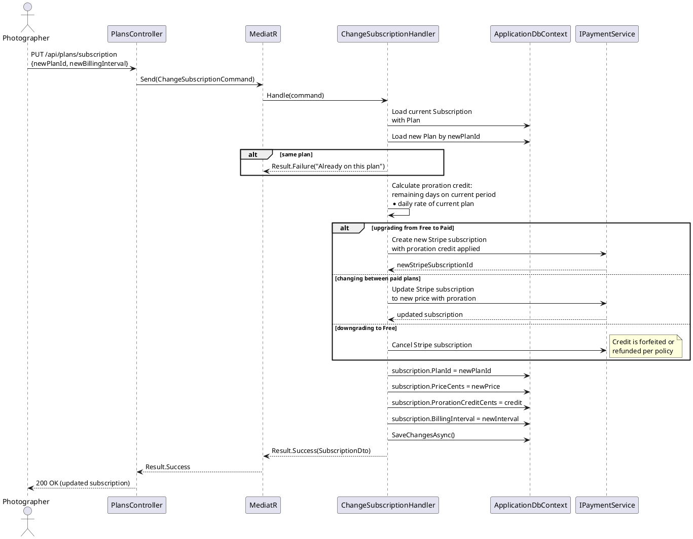

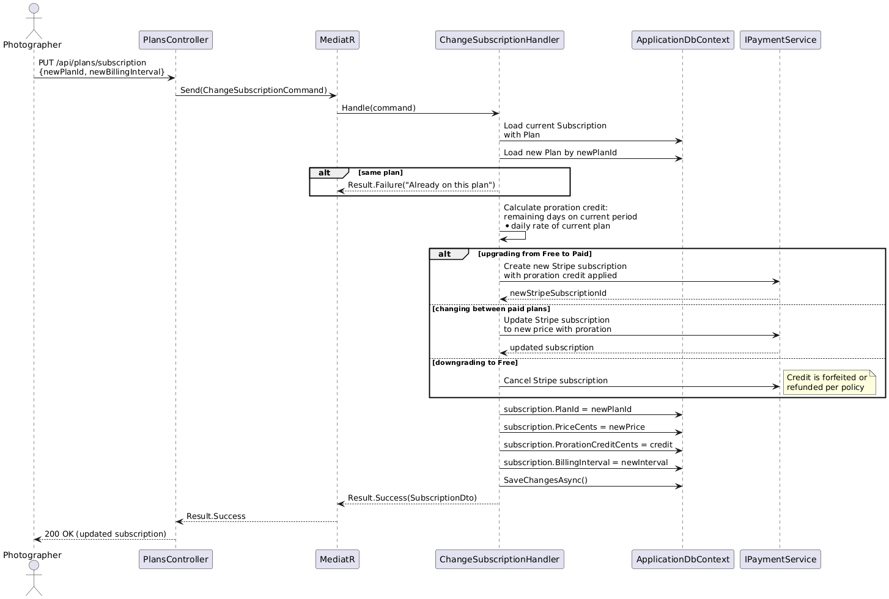

### Cancel Subscription

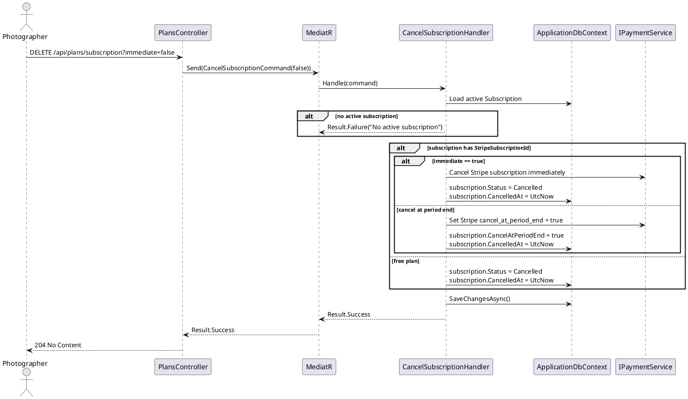

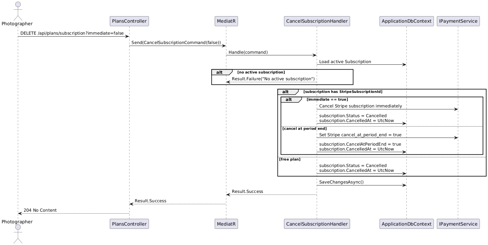

### Check Feature Access (Runtime Gating)

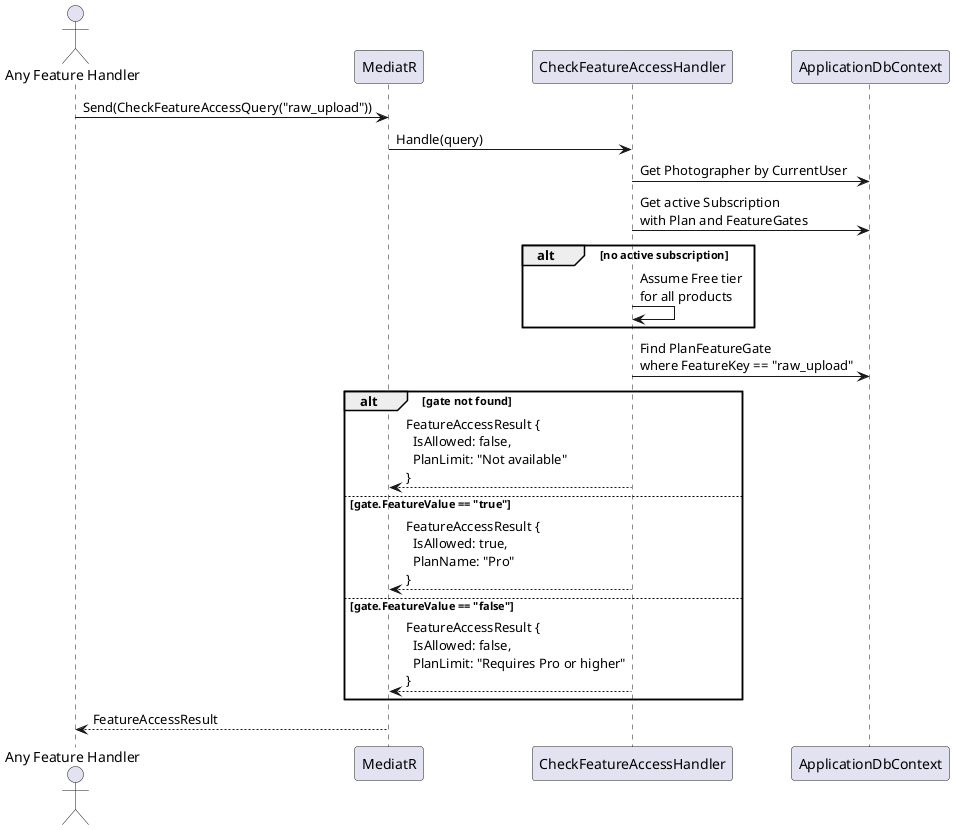

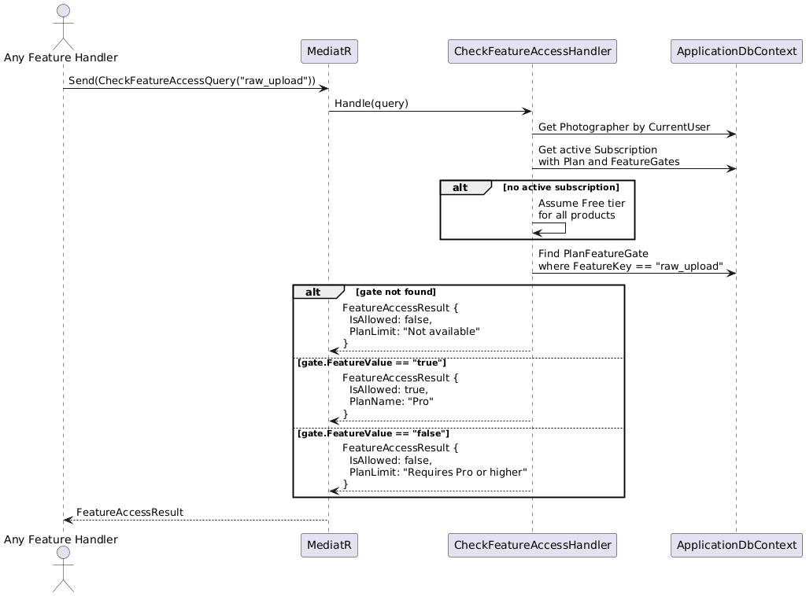

### Feature Gate Reference Table

The following table shows the key feature gates used across all plan tiers. Each gate is stored as a `PlanFeatureGate` record with a string key and string value.

| Feature Key | Free | Basic | Plus | Pro | Ultimate |
|---|---|---|---|---|---|
| `storage_gb` | 3 | 10 | 100 | 1000 | unlimited |
| `video_minutes_hd` | 0 | 30 | 60 | 120 | 300 |
| `video_4k` | false | false | false | true | true |
| `custom_domain` | false | true | true | true | true |
| `store_commission_pct` | 15 | 0 | 0 | 0 | 0 |
| `branding_removal` | false | true | true | true | true |
| `raw_upload` | false | false | false | true | true |
| `auto_fulfillment` | false | false | false | true | true |
| `coupons` | false | false | false | true | true |
| `website_pages` | 15 | - | unlimited | unlimited | unlimited |
| `blog_posts` | 5 | - | unlimited | unlimited | unlimited |
| `session_types` | 1 | - | 3 | unlimited | unlimited |
| `contracts` | 3 | - | unlimited | unlimited | unlimited |
| `custom_code_injection` | false | - | false | true | true |
| `document_reminders` | false | - | true | true | true |
| `annual_discount_pct` | - | 15 | 15 | 15 | 15 |
