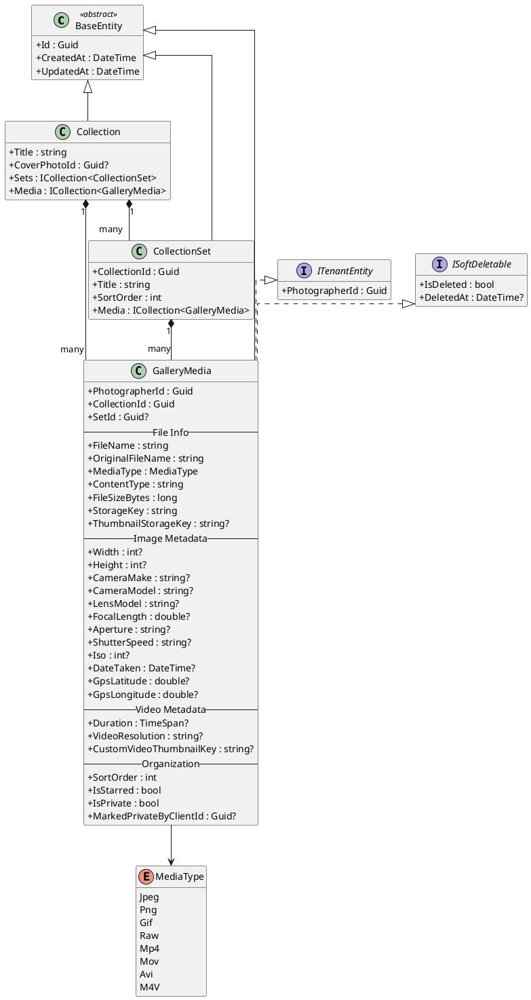
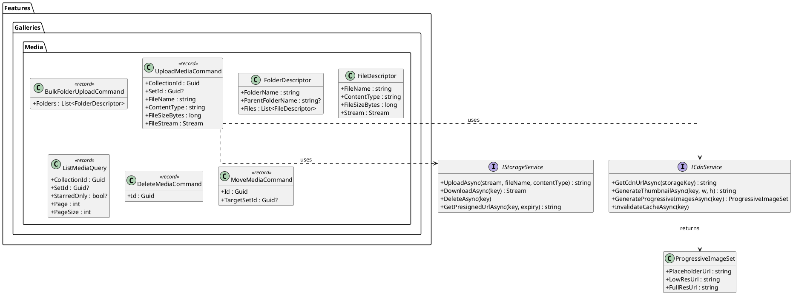
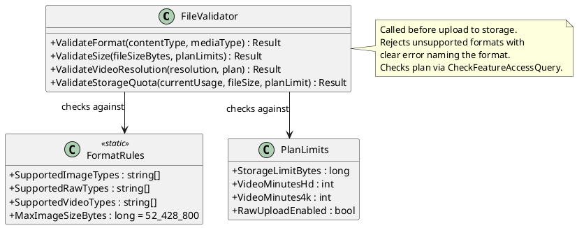
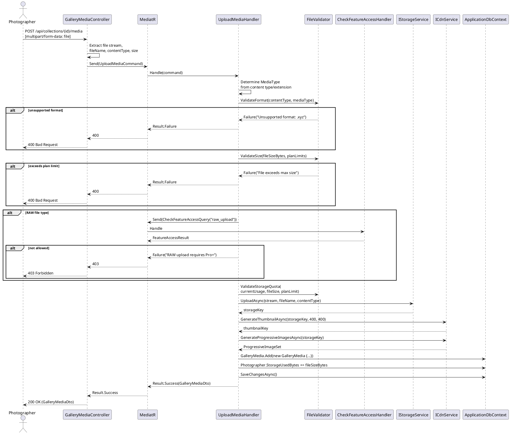
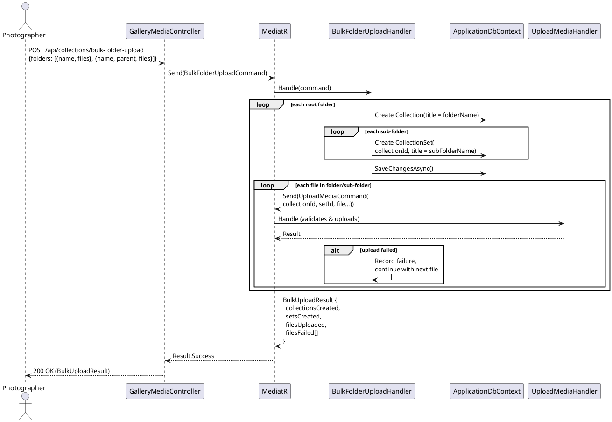
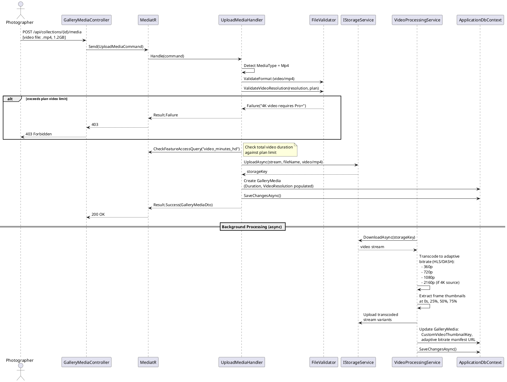
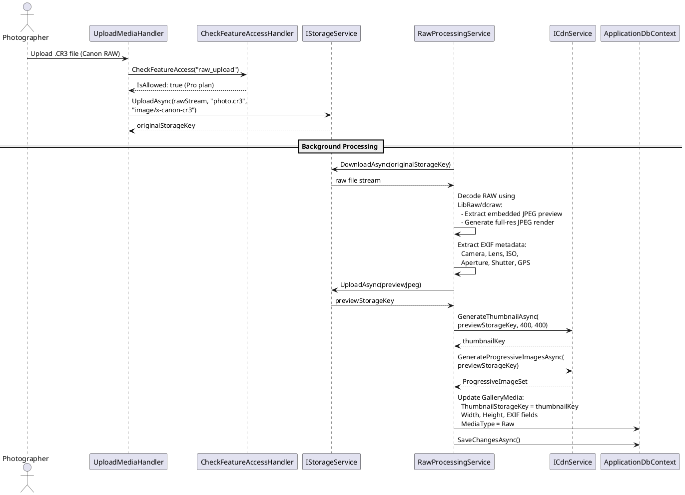
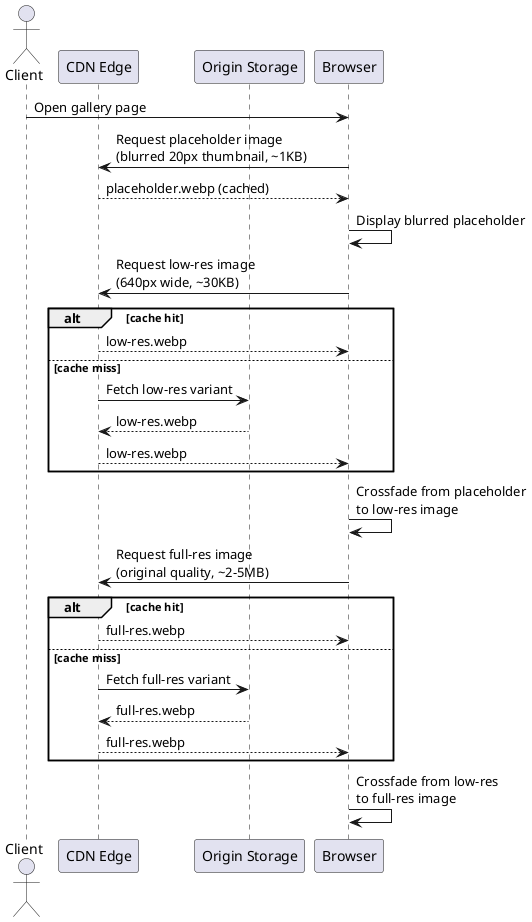
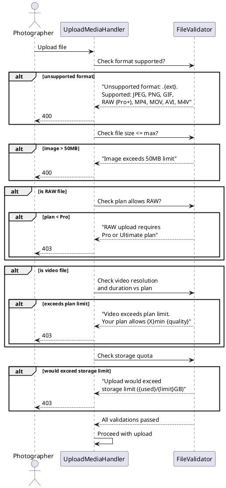

# F03 - Media Upload & Processing

## Overview

This feature handles the entire lifecycle of media assets entering the Anansi platform: upload, validation, processing, storage, and delivery. Photographers upload photos and videos through a browser-based drag-and-drop interface that supports parallel uploads with per-file progress tracking and automatic retry on failure. Bulk folder upload preserves folder structure, automatically creating collections and sets from the directory hierarchy.

The system supports standard image formats (JPEG, PNG, GIF), RAW camera formats (CR2, CR3, NEF, ARW, DNG, RAF, ORF, RW2) on Pro/Ultimate plans, and video formats (MP4, MOV, AVI, M4V) up to 4K resolution with plan-dependent duration limits. Every upload passes through a validation pipeline that checks file format, file size (up to 50MB for images), video resolution limits, and plan-level storage quotas before accepting the file. RAW files are processed server-side to generate preview thumbnails while preserving the original for download.

After successful upload, server-side processing generates thumbnails at multiple resolutions, produces progressive-loading image sets (placeholder, low-res, full-res), and for videos, generates adaptive bitrate streaming manifests and allows custom thumbnail selection from extracted frames. All processed media is distributed through a CDN for fast global delivery. Storage usage is tracked on the `Photographer` entity and triggers warnings at configurable thresholds.

**L2 Requirements:** GAL-1.1.1 (Browser Drag-and-Drop Upload), GAL-1.1.2 (Bulk Folder Upload), GAL-1.1.4 (RAW File Support), GAL-1.1.5 (Video Upload), GAL-1.1.6 (File Validation), UX-11.3.3 (Content Delivery)

---

## Components

### Domain Layer

| Component | Type | Description |
|-----------|------|-------------|
| `GalleryMedia` | Entity | Core media entity storing file metadata, storage keys, image EXIF data, video metadata, organization state (sort order, starred, private), and thumbnail references. Implements `ITenantEntity` and `ISoftDeletable`. |
| `Collection` | Entity | Parent container for media. Tracks cover photo, design settings, and aggregate state. |
| `CollectionSet` | Entity | Optional sub-group within a collection. Media can reference a set via `SetId`. |
| `MediaType` | Enum | `Jpeg`, `Png`, `Gif`, `Raw`, `Mp4`, `Mov`, `Avi`, `M4V` |
| `StorageWarningLevel` | Enum | `None`, `Warning80`, `Warning90`, `Critical95` |

### Application Layer

| Component | Type | Description |
|-----------|------|-------------|
| `UploadMediaCommand` | Command | Accepts collection ID, optional set ID, file name, content type, file size, stream, and optional EXIF metadata. Returns the created `GalleryMediaDto`. |
| `BulkFolderUploadCommand` | Command | Accepts a folder structure descriptor (folder names with file lists). Creates collections and sets from folder hierarchy, then uploads each file. |
| `DeleteMediaCommand` | Command | Soft-deletes a media item and updates storage usage. |
| `MoveMediaCommand` | Command | Moves a media item to a different set within the same collection. |
| `ToggleStarMediaCommand` | Command | Toggles the `IsStarred` flag on a media item. |
| `BulkStarMediaCommand` | Command | Sets the `IsStarred` flag on multiple media items at once. |
| `ListMediaQuery` | Query | Paginated listing of media in a collection, filterable by set and starred status. |
| `IStorageService` | Interface | `UploadAsync`, `DownloadAsync`, `DeleteAsync`, `GetPresignedUrlAsync` for blob storage operations. |
| `ICdnService` | Interface | `GetCdnUrlAsync`, `GenerateThumbnailAsync`, `GenerateProgressiveImagesAsync`, `InvalidateCacheAsync` for CDN delivery and thumbnail generation. |
| `CheckFeatureAccessQuery` | Query | Reused from F02 to validate plan-level gates (RAW upload, video limits, storage). |

### Infrastructure Layer

| Component | Type | Description |
|-----------|------|-------------|
| `GalleryMediaConfiguration` | EF Config | Maps `GalleryMedia` with indexes on `(CollectionId, SortOrder)`, `(PhotographerId, IsStarred)`, and `(SetId)`. |
| `StorageService` (impl) | Service | Implements `IStorageService` against Azure Blob Storage or S3-compatible storage. Handles multipart uploads for large files. |
| `CdnService` (impl) | Service | Implements `ICdnService`. Generates thumbnail variants via image processing library (e.g., ImageSharp). Produces progressive image sets. |
| `VideoProcessingService` (impl) | Service | Background service that transcodes uploaded videos to adaptive bitrate formats (HLS/DASH), extracts frame thumbnails, and validates resolution limits. |

### API Layer

| Component | Type | Description |
|-----------|------|-------------|
| `GalleryMediaController` | Controller | Endpoints: `POST /api/collections/{id}/media` (upload), `GET /api/collections/{id}/media` (list), `DELETE /api/collections/{id}/media/{mediaId}`, `POST .../move`, `POST .../star`, `POST /bulk-star`, `POST .../private`. |

---

## Class Diagrams

### Domain Layer -- Media Entities

### Application Layer -- Upload Commands & Services

### Validation Pipeline

---

## Sequence Diagrams

### Single File Upload

### Bulk Folder Upload

### Video Upload & Processing

### RAW File Processing

### Progressive Image Loading (CDN Delivery)

### File Validation Decision Flow

