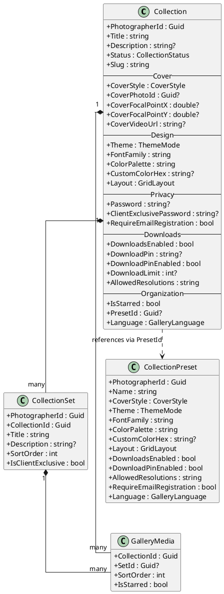
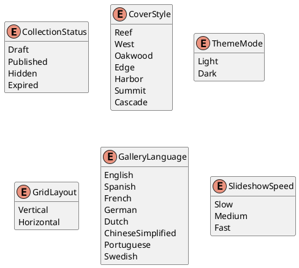
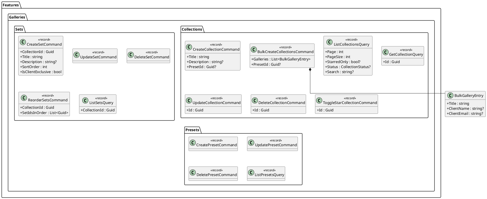
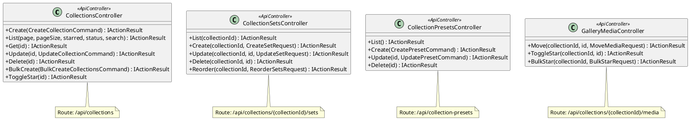
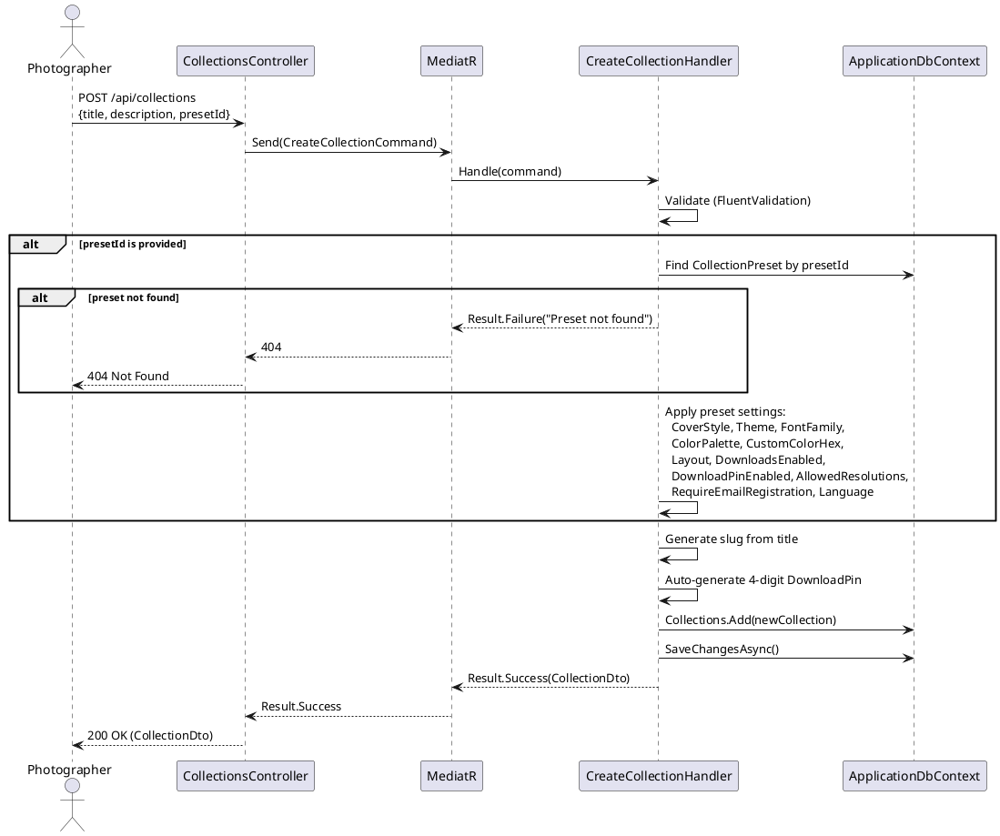
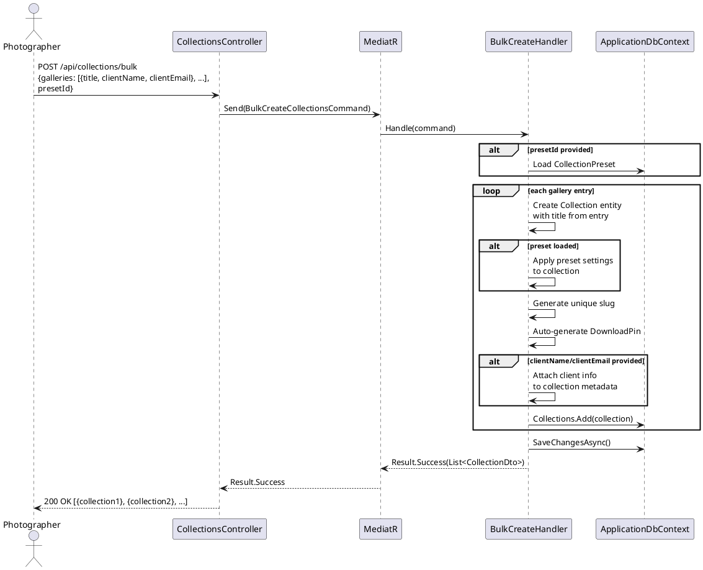
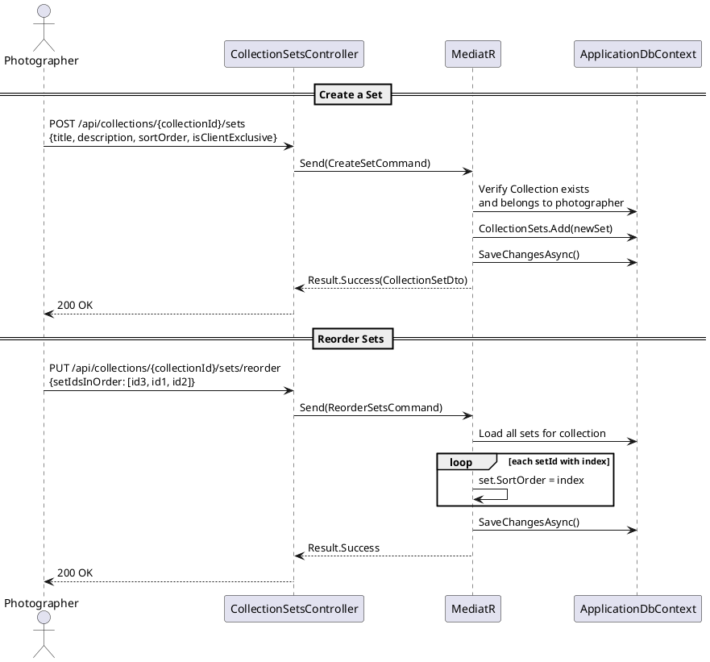
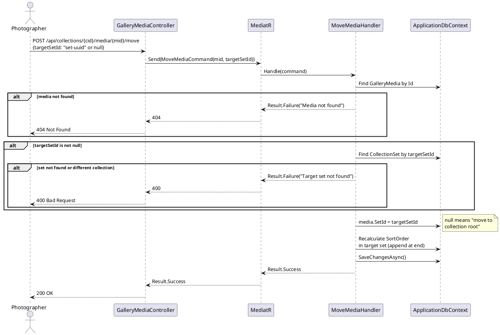
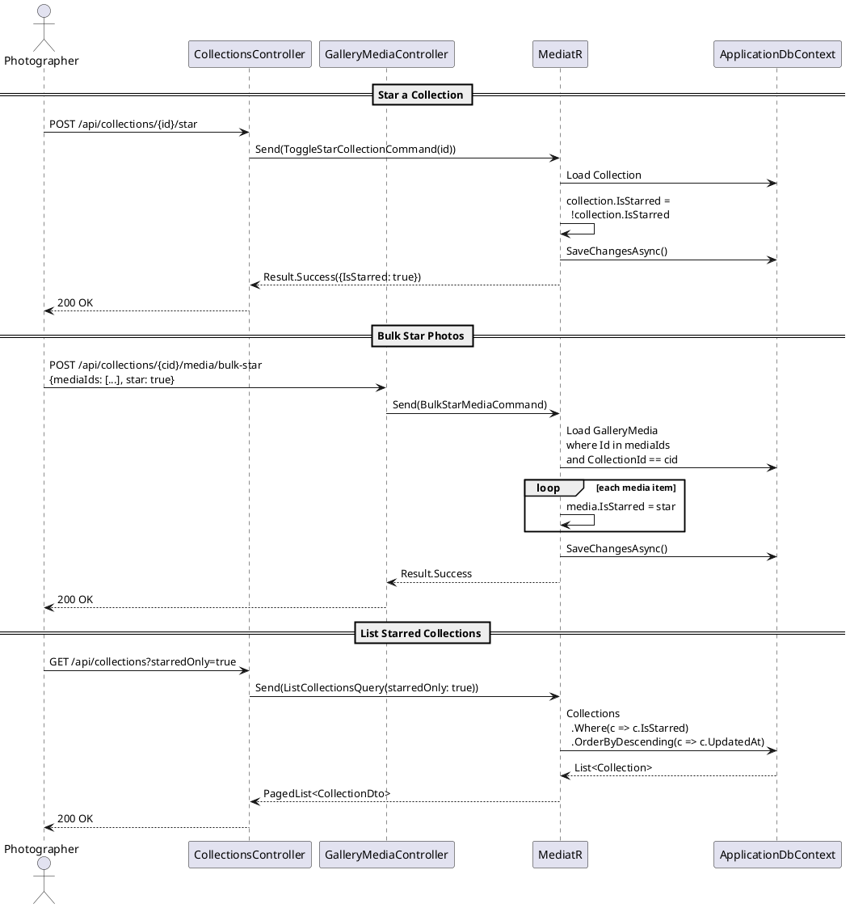
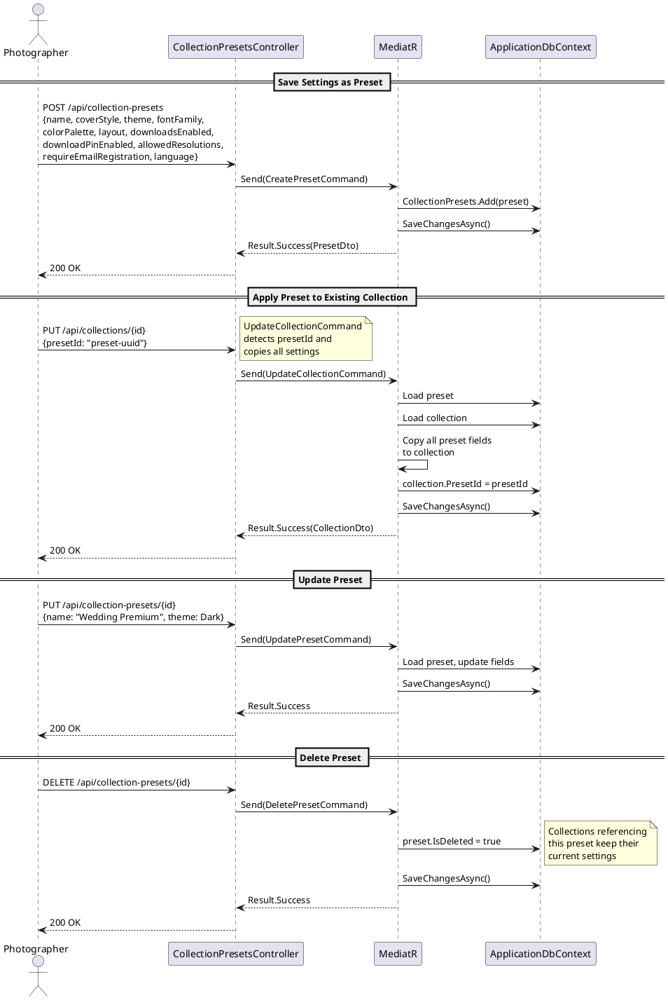

# F04 - Gallery Organization

## Overview

This feature provides the structural framework for how photographers organize their work within the Anansi platform. The primary organizational unit is the `Collection`, which represents a client gallery containing photos and videos. Within each collection, photographers can create `CollectionSet` entities -- named sub-groups that segment content logically (e.g., "Ceremony", "Reception", "Portraits" for a wedding). Photos can be dragged between sets, and sets are manually sortable within their parent collection.

Bulk gallery creation addresses high-volume workflows like mini sessions, school portrait days, and events where a photographer needs to create dozens of galleries simultaneously with identical settings. The photographer specifies multiple gallery names, optional client info (name, email), and selects a preset to apply. All galleries are created in a single operation. Star/bookmark functionality lets photographers mark their most important collections and individual photos for quick access via a dedicated "Starred" tab, with bulk starring supported.

Collection presets capture the full spectrum of gallery settings -- cover style, theme, fonts, colors, layout, download configuration, store settings, privacy, and language -- as reusable templates. A photographer can save a preset, name it, and apply it to any new or existing collection with one click. Multiple presets are manageable (create, rename, update, delete), enabling photographers to maintain distinct configurations for different client types or event categories.

**L2 Requirements:** GAL-1.2.1 (Collections and Sets), GAL-1.2.2 (Bulk Gallery Creation), GAL-1.2.3 (Star/Bookmark), GAL-1.2.4 (Collection Presets)

---

## Components

### Domain Layer

| Component | Type | Description |
|-----------|------|-------------|
| `Collection` | Entity | Top-level gallery container. Stores title, description, slug, status, cover settings, design settings (theme, font, color, layout), privacy settings, download settings, slideshow settings, expiry settings, language, embedding config, analytics, star flag, and preset reference. Implements `ITenantEntity`, `IAuditableEntity`, `ISoftDeletable`. |
| `CollectionSet` | Entity | Named sub-group within a collection. Has title, description, sort order, and client-exclusive visibility flag. Implements `ITenantEntity`, `ISoftDeletable`. |
| `CollectionPreset` | Entity | Reusable settings template storing cover style, theme, font, color palette, custom color hex, layout, download settings, email registration flag, and language. Implements `ITenantEntity`, `ISoftDeletable`. |
| `GalleryMedia` | Entity | Individual media items that belong to a collection and optionally a set. |
| `CollectionStatus` | Enum | `Draft`, `Published`, `Hidden`, `Expired` |
| `CoverStyle` | Enum | `Reef`, `West`, `Oakwood`, `Edge`, `Harbor`, `Summit`, `Cascade` |
| `ThemeMode` | Enum | `Light`, `Dark` |
| `GridLayout` | Enum | `Vertical`, `Horizontal` |
| `GalleryLanguage` | Enum | `English`, `Spanish`, `French`, `German`, `Dutch`, `ChineseSimplified`, `Portuguese`, `Swedish` |

### Application Layer

| Component | Type | Description |
|-----------|------|-------------|
| `CreateCollectionCommand` | Command | Creates a new collection with title, description, and optional preset application. |
| `ListCollectionsQuery` | Query | Paginated listing with filters for starred, status, and search text. |
| `GetCollectionQuery` | Query | Returns a single collection by ID with full settings. |
| `UpdateCollectionCommand` | Command | Updates any collection field (title, description, design, privacy, downloads, etc.). |
| `DeleteCollectionCommand` | Command | Soft-deletes a collection and all its sets and media. |
| `BulkCreateCollectionsCommand` | Command | Creates multiple collections at once with shared settings and per-gallery client info. |
| `ToggleStarCollectionCommand` | Command | Toggles the `IsStarred` flag on a collection. |
| `CreateSetCommand` | Command | Creates a new set within a collection with title, description, sort order, and client-exclusive flag. |
| `UpdateSetCommand` | Command | Updates set properties. |
| `DeleteSetCommand` | Command | Soft-deletes a set. Media in the set becomes unassigned (moves to collection root). |
| `ReorderSetsCommand` | Command | Accepts an ordered list of set IDs and updates sort orders accordingly. |
| `ListSetsQuery` | Query | Returns all sets for a collection ordered by sort order. |
| `ListPresetsQuery` | Query | Returns all presets for the authenticated photographer. |
| `CreatePresetCommand` | Command | Saves current settings as a named preset. |
| `UpdatePresetCommand` | Command | Updates an existing preset's settings or name. |
| `DeletePresetCommand` | Command | Soft-deletes a preset. |
| `MoveMediaCommand` | Command | Moves a media item to a different set (or to collection root by setting `SetId = null`). |
| `BulkStarMediaCommand` | Command | Stars or unstars multiple media items at once. |

### API Layer

| Component | Type | Description |
|-----------|------|-------------|
| `CollectionsController` | Controller | Collection CRUD, bulk create, star toggle, download settings, sharing, and activity endpoints. |
| `CollectionSetsController` | Controller | Nested under `/api/collections/{collectionId}/sets`. Set CRUD and reorder. |
| `CollectionPresetsController` | Controller | `/api/collection-presets`. Preset CRUD. |
| `GalleryMediaController` | Controller | Nested under `/api/collections/{collectionId}/media`. Move, star, and bulk-star operations. |

---

## Class Diagrams

### Domain Layer -- Collection, Set, and Preset Entities

### Domain Layer -- Enums

### Application Layer -- Collection Commands & Queries

### API Layer -- Controllers

---

## Sequence Diagrams

### Create a Collection with Preset

### Bulk Create Galleries

### Create and Manage Sets

### Move Media Between Sets

### Star/Bookmark Collections and Photos

### Preset Management Lifecycle

