# F05 - Gallery Design & Customization

## Overview

This feature gives photographers full creative control over the visual presentation of their client galleries. Every collection can be independently styled with a combination of cover design, theme, typography, color palette, layout, set descriptions, slideshow behavior, and language -- producing a branded, polished experience for each client. Design changes are per-collection, allowing a photographer to maintain different aesthetics for weddings versus portraits versus events.

Cover design is the first visual impression. Photographers choose from seven or more cover styles (Reef, West, Oakwood, Edge, Harbor, Summit, Cascade), each offering a distinct layout for the cover photo. The cover photo is selectable from the collection's uploaded images with an adjustable focal point for precise cropping. Video and GIF covers are also supported: a YouTube or Vimeo URL can be provided, and the video plays as a looping, muted background behind the cover overlay. Below the cover, the gallery body offers a light or dark theme toggle (both WCAG AA compliant), a selection of six or more curated font families with real-time preview, nine or more color palettes with custom hex entry on paid plans, and vertical or horizontal grid layouts. Set titles and descriptions support basic formatting (bold, italic, line breaks).

Slideshow mode provides an immersive viewing experience where images display full-screen in sequence with smooth transitions, adjustable speed (slow/medium/fast), auto-loop toggle, and manual next/previous navigation. Multi-language support allows the photographer to set a language per collection from eight or more options, translating all client-facing UI text and automated emails into the selected language.

**L2 Requirements:** GAL-1.3.1 (Cover Styles), GAL-1.3.2 (Video/GIF Covers), GAL-1.3.3 (Theme Toggle), GAL-1.3.4 (Typography), GAL-1.3.5 (Color Palettes), GAL-1.3.6 (Grid Layouts), GAL-1.3.7 (Set Titles & Descriptions), GAL-1.3.8 (Slideshow Mode), GAL-1.8.1 (Language Selection)

---

## Components

### Domain Layer

| Component | Type | Description |
|-----------|------|-------------|
| `Collection` | Entity | Stores all design settings as properties: `CoverStyle`, `CoverPhotoId`, `CoverFocalPointX/Y`, `CoverVideoUrl`, `CoverVideoAutoplay`, `Theme`, `FontFamily`, `ColorPalette`, `CustomColorHex`, `Layout`, `SlideshowSpeed`, `SlideshowAutoLoop`, `Language`. |
| `CollectionSet` | Entity | Stores `Title` and `Description` (supporting basic formatting) for display above the set's photos. |
| `CoverStyle` | Enum | `Reef`, `West`, `Oakwood`, `Edge`, `Harbor`, `Summit`, `Cascade` |
| `ThemeMode` | Enum | `Light`, `Dark` |
| `GridLayout` | Enum | `Vertical`, `Horizontal` |
| `SlideshowSpeed` | Enum | `Slow`, `Medium`, `Fast` |
| `GalleryLanguage` | Enum | `English`, `Spanish`, `French`, `German`, `Dutch`, `ChineseSimplified`, `Portuguese`, `Swedish` |

### Application Layer

| Component | Type | Description |
|-----------|------|-------------|
| `UpdateCollectionCommand` | Command | General-purpose collection update that includes all design fields. The handler applies only the fields that are provided (partial update). |
| `UpdateSetCommand` | Command | Updates set title and description with basic formatting support. |
| `GetCollectionQuery` | Query | Returns the full collection including all design settings for rendering. |
| `GetPublicCollectionQuery` | Query | Client-facing query that returns design settings needed to render the gallery (cover, theme, fonts, colors, layout, language, slideshow config). |
| `CheckFeatureAccessQuery` | Query | Reused from F02 to enforce custom hex color restriction to paid plans. |
| `GalleryMediaDto` | DTO | Includes CDN URLs for cover photo rendering. |
| `CollectionDto` | DTO | Full collection representation including all design fields. |

### Infrastructure Layer

| Component | Type | Description |
|-----------|------|-------------|
| `CollectionConfiguration` | EF Config | Maps all design fields on the `Collection` entity. Enum conversions for `CoverStyle`, `ThemeMode`, `GridLayout`, `SlideshowSpeed`, `GalleryLanguage`. |
| `CollectionSetConfiguration` | EF Config | Maps `Title` (required, max length) and `Description` (optional, max length for formatted text). |
| `GalleryLocalizationService` | Service | Provides translated strings for client-facing UI text in the selected `GalleryLanguage`. |

### API Layer

| Component | Type | Description |
|-----------|------|-------------|
| `CollectionsController` | Controller | The `PUT /api/collections/{id}` endpoint handles all design updates through `UpdateCollectionCommand`. |
| `CollectionSetsController` | Controller | The `PUT /api/collections/{collectionId}/sets/{id}` endpoint handles set title/description updates. |

---

## Class Diagrams

### Domain Layer -- Design Properties on Collection

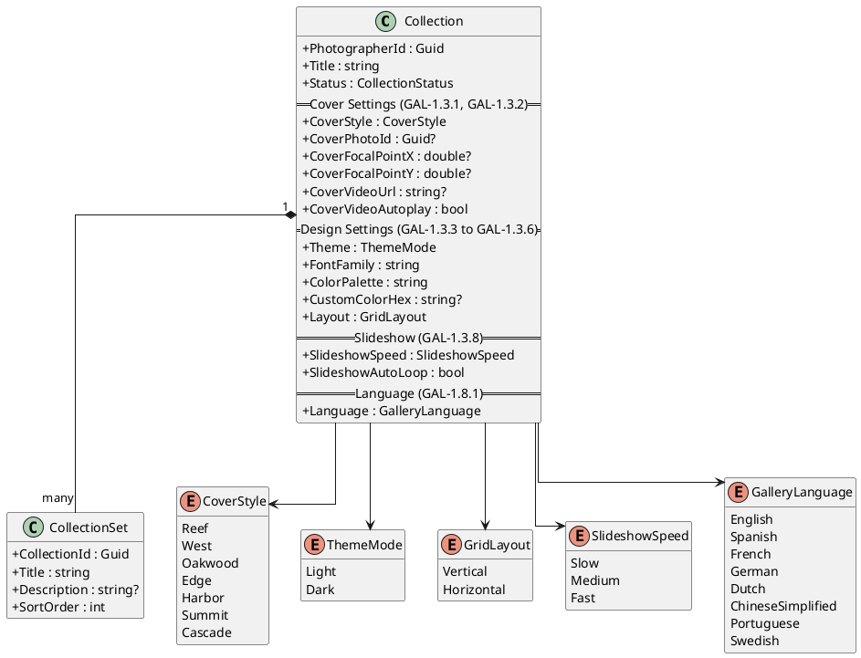
```plantuml
@startuml
skinparam classAttributeIconSize 0
skinparam linetype ortho
hide empty methods

class Collection {
  +PhotographerId : Guid
  +Title : string
  +Status : CollectionStatus
  ==Cover Settings (GAL-1.3.1, GAL-1.3.2)==
  +CoverStyle : CoverStyle
  +CoverPhotoId : Guid?
  +CoverFocalPointX : double?
  +CoverFocalPointY : double?
  +CoverVideoUrl : string?
  +CoverVideoAutoplay : bool
  ==Design Settings (GAL-1.3.3 to GAL-1.3.6)==
  +Theme : ThemeMode
  +FontFamily : string
  +ColorPalette : string
  +CustomColorHex : string?
  +Layout : GridLayout
  ==Slideshow (GAL-1.3.8)==
  +SlideshowSpeed : SlideshowSpeed
  +SlideshowAutoLoop : bool
  ==Language (GAL-1.8.1)==
  +Language : GalleryLanguage
}

class CollectionSet {
  +CollectionId : Guid
  +Title : string
  +Description : string?
  +SortOrder : int
}

enum CoverStyle {
  Reef
  West
  Oakwood
  Edge
  Harbor
  Summit
  Cascade
}

enum ThemeMode {
  Light
  Dark
}

enum GridLayout {
  Vertical
  Horizontal
}

enum SlideshowSpeed {
  Slow
  Medium
  Fast
}

enum GalleryLanguage {
  English
  Spanish
  French
  German
  Dutch
  ChineseSimplified
  Portuguese
  Swedish
}

Collection --> CoverStyle
Collection --> ThemeMode
Collection --> GridLayout
Collection --> SlideshowSpeed
Collection --> GalleryLanguage
Collection "1" *-- "many" CollectionSet
@enduml
```

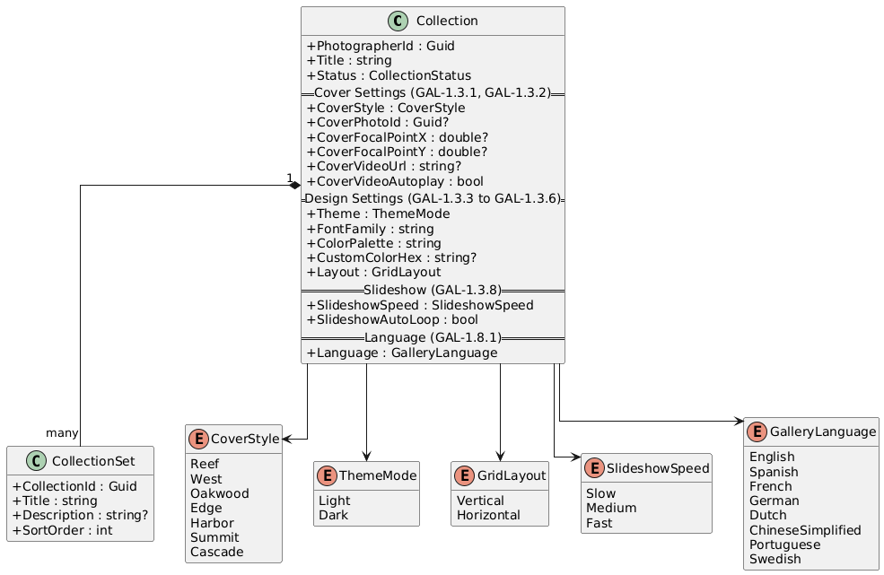

### Application Layer -- Design-Related DTOs

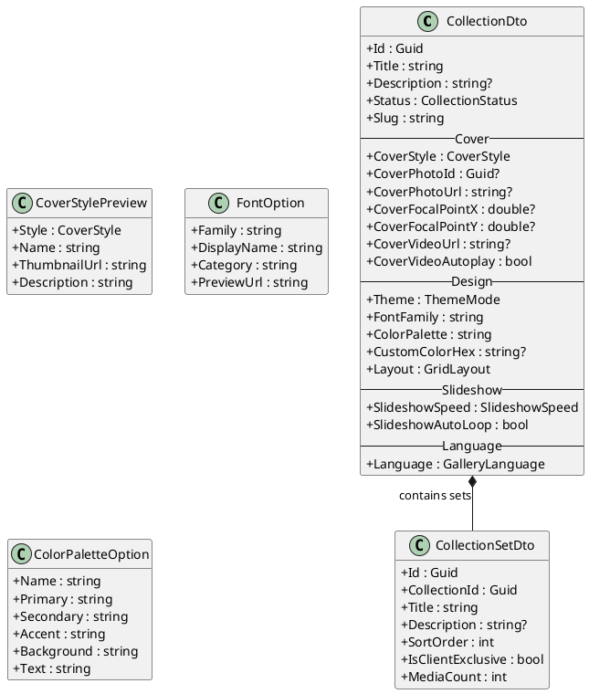
```plantuml
@startuml
skinparam classAttributeIconSize 0
skinparam linetype ortho
hide empty methods

class CollectionDto {
  +Id : Guid
  +Title : string
  +Description : string?
  +Status : CollectionStatus
  +Slug : string
  --Cover--
  +CoverStyle : CoverStyle
  +CoverPhotoId : Guid?
  +CoverPhotoUrl : string?
  +CoverFocalPointX : double?
  +CoverFocalPointY : double?
  +CoverVideoUrl : string?
  +CoverVideoAutoplay : bool
  --Design--
  +Theme : ThemeMode
  +FontFamily : string
  +ColorPalette : string
  +CustomColorHex : string?
  +Layout : GridLayout
  --Slideshow--
  +SlideshowSpeed : SlideshowSpeed
  +SlideshowAutoLoop : bool
  --Language--
  +Language : GalleryLanguage
}

class CollectionSetDto {
  +Id : Guid
  +CollectionId : Guid
  +Title : string
  +Description : string?
  +SortOrder : int
  +IsClientExclusive : bool
  +MediaCount : int
}

class CoverStylePreview {
  +Style : CoverStyle
  +Name : string
  +ThumbnailUrl : string
  +Description : string
}

class FontOption {
  +Family : string
  +DisplayName : string
  +Category : string
  +PreviewUrl : string
}

class ColorPaletteOption {
  +Name : string
  +Primary : string
  +Secondary : string
  +Accent : string
  +Background : string
  +Text : string
}

CollectionDto *-- CollectionSetDto : contains sets
@enduml
```

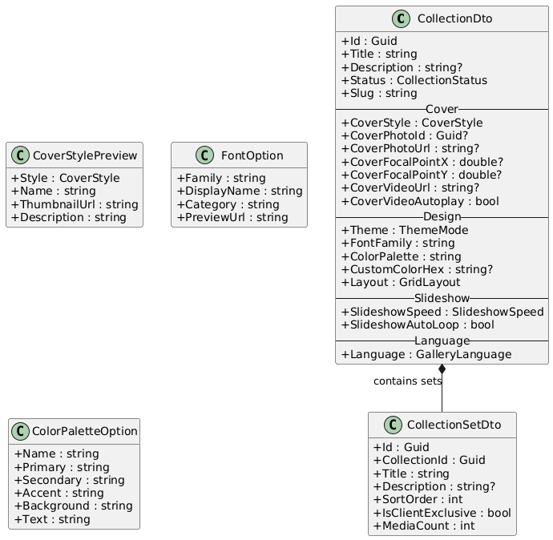

### Design Configuration -- Fonts and Palettes

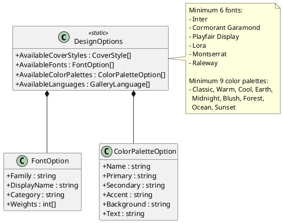
```plantuml
@startuml
skinparam classAttributeIconSize 0
skinparam linetype ortho
hide empty methods

class DesignOptions <<static>> {
  +AvailableCoverStyles : CoverStyle[]
  +AvailableFonts : FontOption[]
  +AvailableColorPalettes : ColorPaletteOption[]
  +AvailableLanguages : GalleryLanguage[]
}

class FontOption {
  +Family : string
  +DisplayName : string
  +Category : string
  +Weights : int[]
}

class ColorPaletteOption {
  +Name : string
  +Primary : string
  +Secondary : string
  +Accent : string
  +Background : string
  +Text : string
}

note right of DesignOptions
  Minimum 6 fonts:
  - Inter
  - Cormorant Garamond
  - Playfair Display
  - Lora
  - Montserrat
  - Raleway

  Minimum 9 color palettes:
  - Classic, Warm, Cool, Earth,
    Midnight, Blush, Forest,
    Ocean, Sunset
end note

DesignOptions *-- FontOption
DesignOptions *-- ColorPaletteOption
@enduml
```

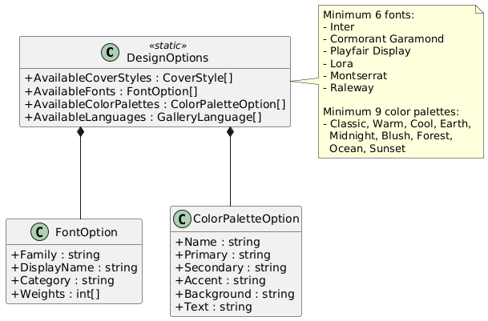

---

## Sequence Diagrams

### Update Cover Style and Photo

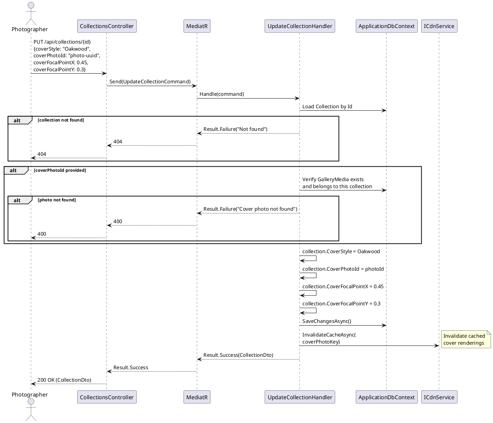
```plantuml
@startuml
actor Photographer as P
participant "CollectionsController" as CC
participant "MediatR" as M
participant "UpdateCollectionHandler" as UCH
participant "ApplicationDbContext" as DB
participant "ICdnService" as CDN

P -> CC : PUT /api/collections/{id}\n{coverStyle: "Oakwood",\ncoverPhotoId: "photo-uuid",\ncoverFocalPointX: 0.45,\ncoverFocalPointY: 0.3}
CC -> M : Send(UpdateCollectionCommand)
M -> UCH : Handle(command)

UCH -> DB : Load Collection by Id
alt collection not found
  UCH --> M : Result.Failure("Not found")
  M --> CC : 404
  CC --> P : 404
end

alt coverPhotoId provided
  UCH -> DB : Verify GalleryMedia exists\nand belongs to this collection
  alt photo not found
    UCH --> M : Result.Failure("Cover photo not found")
    M --> CC : 400
    CC --> P : 400
  end
end

UCH -> UCH : collection.CoverStyle = Oakwood
UCH -> UCH : collection.CoverPhotoId = photoId
UCH -> UCH : collection.CoverFocalPointX = 0.45
UCH -> UCH : collection.CoverFocalPointY = 0.3
UCH -> DB : SaveChangesAsync()

UCH -> CDN : InvalidateCacheAsync(\ncoverPhotoKey)
note right: Invalidate cached\ncover renderings

UCH --> M : Result.Success(CollectionDto)
M --> CC : Result.Success
CC --> P : 200 OK (CollectionDto)
@enduml
```

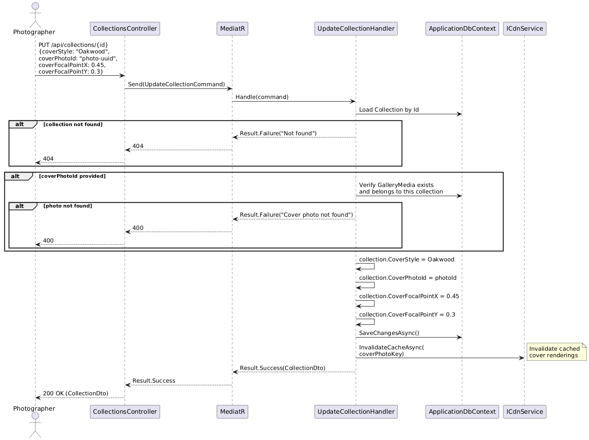

### Set Video/GIF Cover

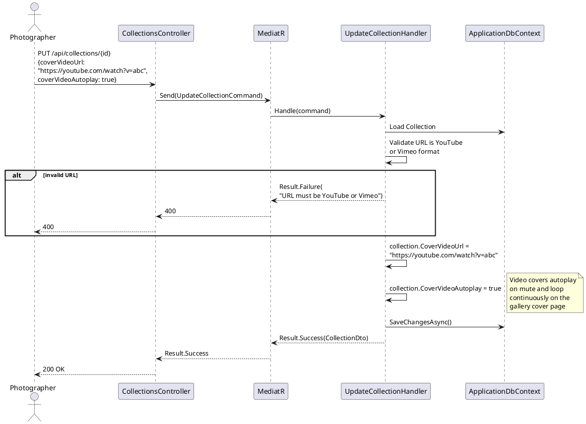
```plantuml
@startuml
actor Photographer as P
participant "CollectionsController" as CC
participant "MediatR" as M
participant "UpdateCollectionHandler" as UCH
participant "ApplicationDbContext" as DB

P -> CC : PUT /api/collections/{id}\n{coverVideoUrl:\n"https://youtube.com/watch?v=abc",\ncoverVideoAutoplay: true}
CC -> M : Send(UpdateCollectionCommand)
M -> UCH : Handle(command)

UCH -> DB : Load Collection
UCH -> UCH : Validate URL is YouTube\nor Vimeo format
alt invalid URL
  UCH --> M : Result.Failure(\n"URL must be YouTube or Vimeo")
  M --> CC : 400
  CC --> P : 400
end

UCH -> UCH : collection.CoverVideoUrl =\n"https://youtube.com/watch?v=abc"
UCH -> UCH : collection.CoverVideoAutoplay = true
note right
  Video covers autoplay
  on mute and loop
  continuously on the
  gallery cover page
end note

UCH -> DB : SaveChangesAsync()
UCH --> M : Result.Success(CollectionDto)
M --> CC : Result.Success
CC --> P : 200 OK
@enduml
```

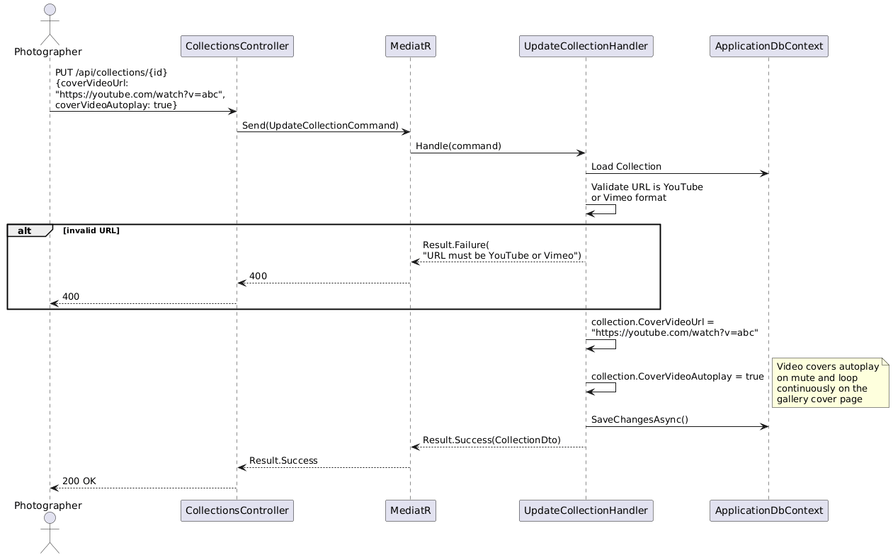

### Toggle Theme and Set Typography

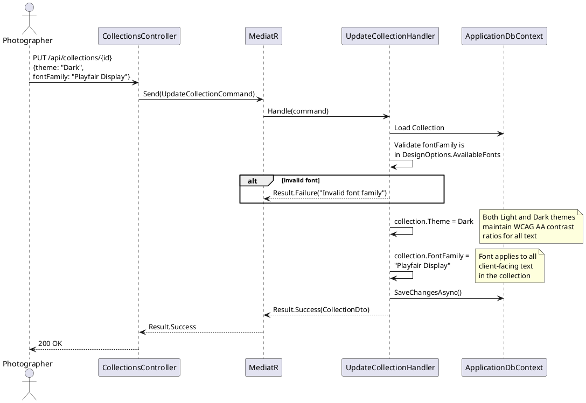
```plantuml
@startuml
actor Photographer as P
participant "CollectionsController" as CC
participant "MediatR" as M
participant "UpdateCollectionHandler" as UCH
participant "ApplicationDbContext" as DB

P -> CC : PUT /api/collections/{id}\n{theme: "Dark",\nfontFamily: "Playfair Display"}
CC -> M : Send(UpdateCollectionCommand)
M -> UCH : Handle(command)

UCH -> DB : Load Collection

UCH -> UCH : Validate fontFamily is\nin DesignOptions.AvailableFonts
alt invalid font
  UCH --> M : Result.Failure("Invalid font family")
end

UCH -> UCH : collection.Theme = Dark
note right
  Both Light and Dark themes
  maintain WCAG AA contrast
  ratios for all text
end note

UCH -> UCH : collection.FontFamily =\n"Playfair Display"
note right
  Font applies to all
  client-facing text
  in the collection
end note

UCH -> DB : SaveChangesAsync()
UCH --> M : Result.Success(CollectionDto)
M --> CC : Result.Success
CC --> P : 200 OK
@enduml
```

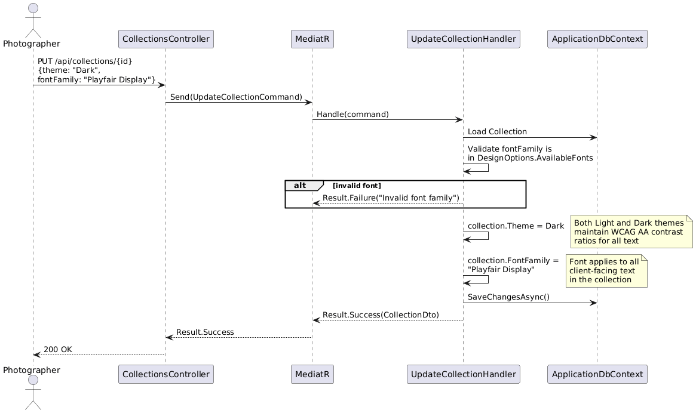

### Apply Color Palette with Custom Hex

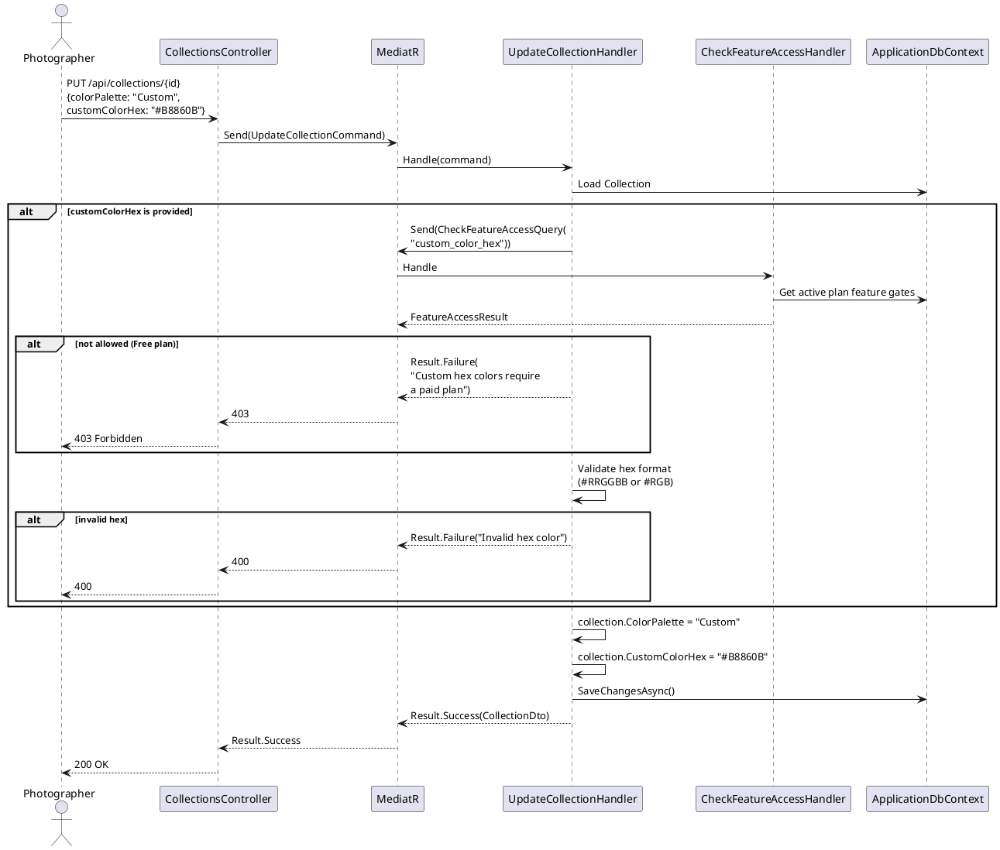
```plantuml
@startuml
actor Photographer as P
participant "CollectionsController" as CC
participant "MediatR" as M
participant "UpdateCollectionHandler" as UCH
participant "CheckFeatureAccessHandler" as CFA
participant "ApplicationDbContext" as DB

P -> CC : PUT /api/collections/{id}\n{colorPalette: "Custom",\ncustomColorHex: "#B8860B"}
CC -> M : Send(UpdateCollectionCommand)
M -> UCH : Handle(command)

UCH -> DB : Load Collection

alt customColorHex is provided
  UCH -> M : Send(CheckFeatureAccessQuery(\n"custom_color_hex"))
  M -> CFA : Handle
  CFA -> DB : Get active plan feature gates
  CFA --> M : FeatureAccessResult

  alt not allowed (Free plan)
    UCH --> M : Result.Failure(\n"Custom hex colors require\na paid plan")
    M --> CC : 403
    CC --> P : 403 Forbidden
  end

  UCH -> UCH : Validate hex format\n(#RRGGBB or #RGB)
  alt invalid hex
    UCH --> M : Result.Failure("Invalid hex color")
    M --> CC : 400
    CC --> P : 400
  end
end

UCH -> UCH : collection.ColorPalette = "Custom"
UCH -> UCH : collection.CustomColorHex = "#B8860B"
UCH -> DB : SaveChangesAsync()
UCH --> M : Result.Success(CollectionDto)
M --> CC : Result.Success
CC --> P : 200 OK
@enduml
```

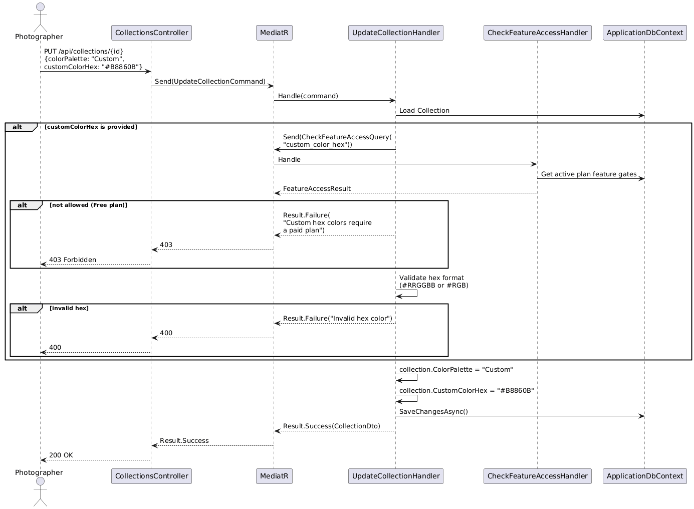

### Update Set Title and Description

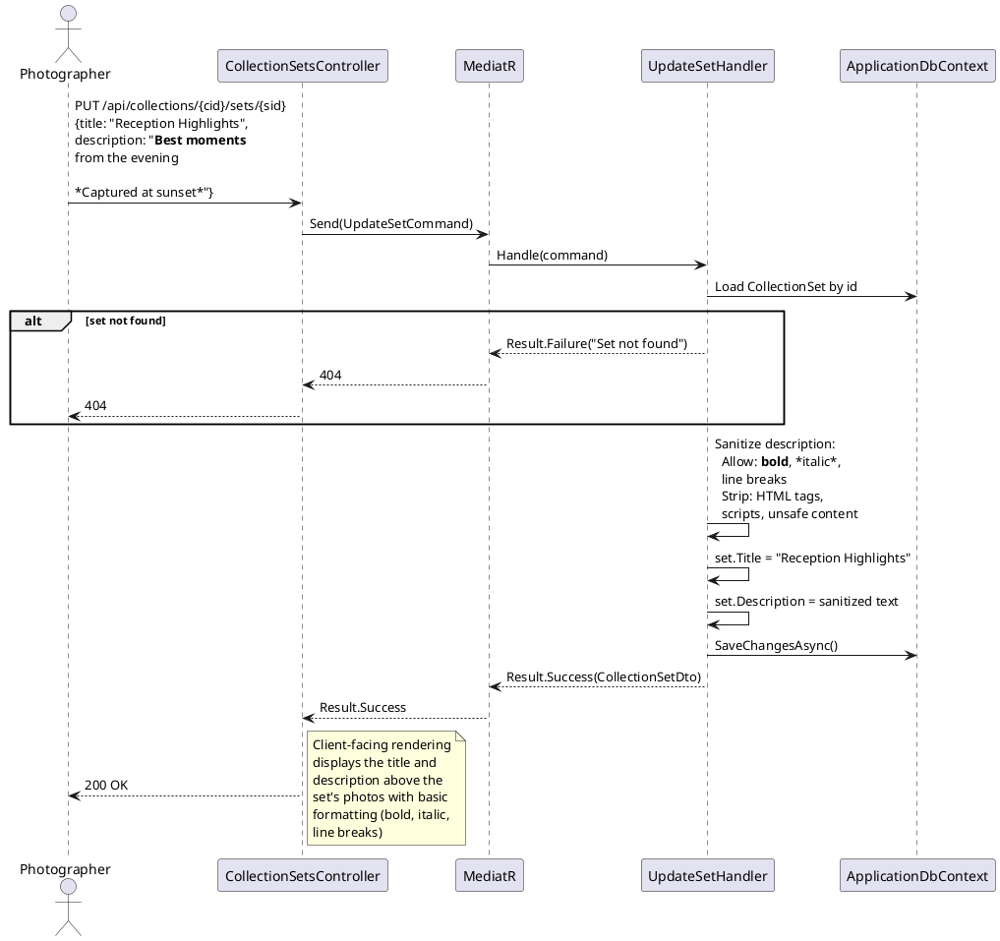
```plantuml
@startuml
actor Photographer as P
participant "CollectionSetsController" as CSC
participant "MediatR" as M
participant "UpdateSetHandler" as USH
participant "ApplicationDbContext" as DB

P -> CSC : PUT /api/collections/{cid}/sets/{sid}\n{title: "Reception Highlights",\ndescription: "**Best moments**\nfrom the evening\n\n*Captured at sunset*"}
CSC -> M : Send(UpdateSetCommand)
M -> USH : Handle(command)

USH -> DB : Load CollectionSet by id
alt set not found
  USH --> M : Result.Failure("Set not found")
  M --> CSC : 404
  CSC --> P : 404
end

USH -> USH : Sanitize description:\n  Allow: **bold**, *italic*,\n  line breaks\n  Strip: HTML tags,\n  scripts, unsafe content

USH -> USH : set.Title = "Reception Highlights"
USH -> USH : set.Description = sanitized text

USH -> DB : SaveChangesAsync()
USH --> M : Result.Success(CollectionSetDto)
M --> CSC : Result.Success
CSC --> P : 200 OK

note right
  Client-facing rendering
  displays the title and
  description above the
  set's photos with basic
  formatting (bold, italic,
  line breaks)
end note
@enduml
```

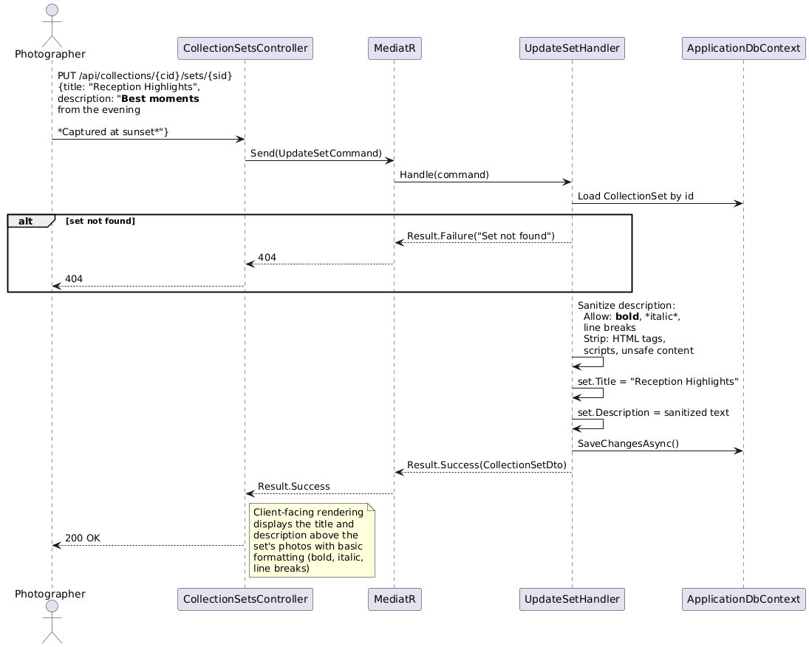

### Configure Slideshow Mode

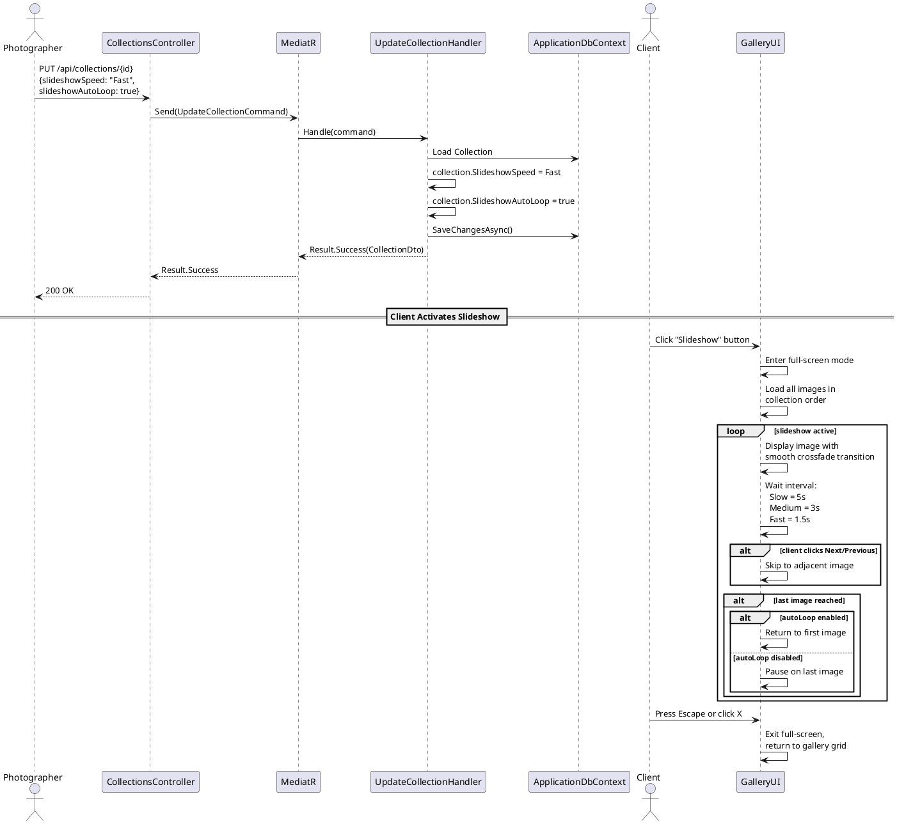
```plantuml
@startuml
actor Photographer as P
participant "CollectionsController" as CC
participant "MediatR" as M
participant "UpdateCollectionHandler" as UCH
participant "ApplicationDbContext" as DB

P -> CC : PUT /api/collections/{id}\n{slideshowSpeed: "Fast",\nslideshowAutoLoop: true}
CC -> M : Send(UpdateCollectionCommand)
M -> UCH : Handle(command)

UCH -> DB : Load Collection
UCH -> UCH : collection.SlideshowSpeed = Fast
UCH -> UCH : collection.SlideshowAutoLoop = true
UCH -> DB : SaveChangesAsync()
UCH --> M : Result.Success(CollectionDto)
M --> CC : Result.Success
CC --> P : 200 OK

== Client Activates Slideshow ==

actor Client as C
participant "GalleryUI" as GUI

C -> GUI : Click "Slideshow" button
GUI -> GUI : Enter full-screen mode
GUI -> GUI : Load all images in\ncollection order

loop slideshow active
  GUI -> GUI : Display image with\nsmooth crossfade transition
  GUI -> GUI : Wait interval:\n  Slow = 5s\n  Medium = 3s\n  Fast = 1.5s

  alt client clicks Next/Previous
    GUI -> GUI : Skip to adjacent image
  end

  alt last image reached
    alt autoLoop enabled
      GUI -> GUI : Return to first image
    else autoLoop disabled
      GUI -> GUI : Pause on last image
    end
  end
end

C -> GUI : Press Escape or click X
GUI -> GUI : Exit full-screen,\nreturn to gallery grid
@enduml
```

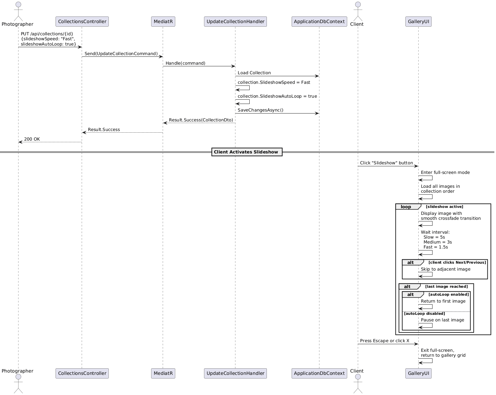

### Set Collection Language

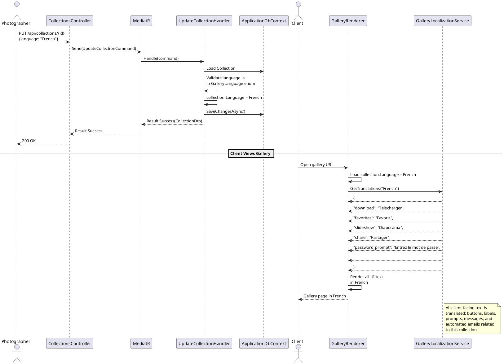
```plantuml
@startuml
actor Photographer as P
participant "CollectionsController" as CC
participant "MediatR" as M
participant "UpdateCollectionHandler" as UCH
participant "ApplicationDbContext" as DB

P -> CC : PUT /api/collections/{id}\n{language: "French"}
CC -> M : Send(UpdateCollectionCommand)
M -> UCH : Handle(command)

UCH -> DB : Load Collection
UCH -> UCH : Validate language is\nin GalleryLanguage enum
UCH -> UCH : collection.Language = French
UCH -> DB : SaveChangesAsync()
UCH --> M : Result.Success(CollectionDto)
M --> CC : Result.Success
CC --> P : 200 OK

== Client Views Gallery ==

actor Client as C
participant "GalleryRenderer" as GR
participant "GalleryLocalizationService" as GLS

C -> GR : Open gallery URL
GR -> GR : Load collection.Language = French
GR -> GLS : GetTranslations("French")
GLS --> GR : {
GLS --> GR :   "download": "Telecharger",
GLS --> GR :   "favorites": "Favoris",
GLS --> GR :   "slideshow": "Diaporama",
GLS --> GR :   "share": "Partager",
GLS --> GR :   "password_prompt": "Entrez le mot de passe",
GLS --> GR :   ...
GLS --> GR : }
GR -> GR : Render all UI text\nin French
GR --> C : Gallery page in French

note right of GLS
  All client-facing text is
  translated: buttons, labels,
  prompts, messages, and
  automated emails related
  to this collection
end note
@enduml
```

### Gallery Layout Selection

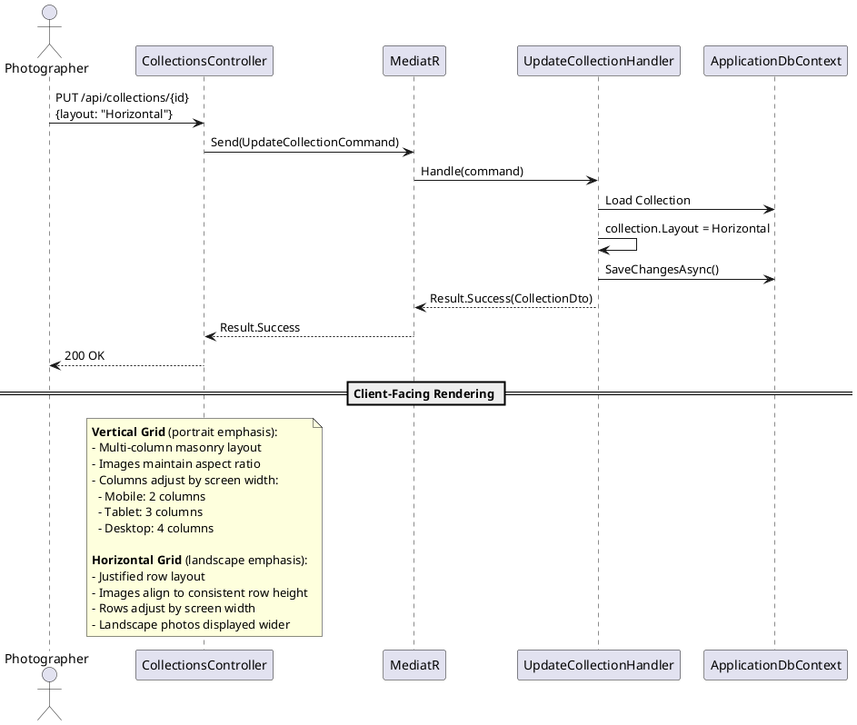
```plantuml
@startuml
actor Photographer as P
participant "CollectionsController" as CC
participant "MediatR" as M
participant "UpdateCollectionHandler" as UCH
participant "ApplicationDbContext" as DB

P -> CC : PUT /api/collections/{id}\n{layout: "Horizontal"}
CC -> M : Send(UpdateCollectionCommand)
M -> UCH : Handle(command)

UCH -> DB : Load Collection
UCH -> UCH : collection.Layout = Horizontal
UCH -> DB : SaveChangesAsync()
UCH --> M : Result.Success(CollectionDto)
M --> CC : Result.Success
CC --> P : 200 OK

== Client-Facing Rendering ==

note over CC
  **Vertical Grid** (portrait emphasis):
  - Multi-column masonry layout
  - Images maintain aspect ratio
  - Columns adjust by screen width:
    - Mobile: 2 columns
    - Tablet: 3 columns
    - Desktop: 4 columns

  **Horizontal Grid** (landscape emphasis):
  - Justified row layout
  - Images align to consistent row height
  - Rows adjust by screen width
  - Landscape photos displayed wider
end note
@enduml
```

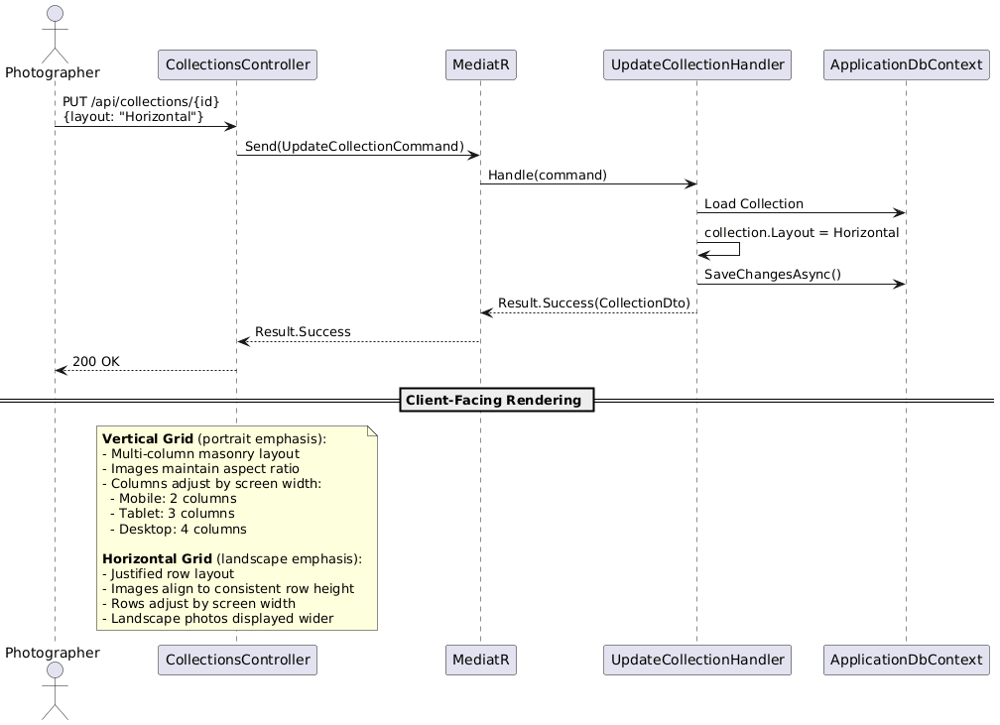
