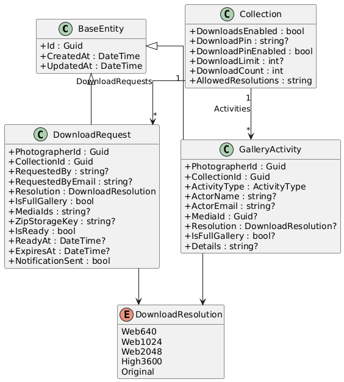
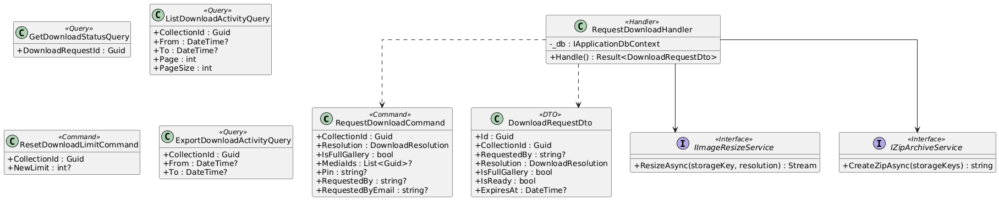
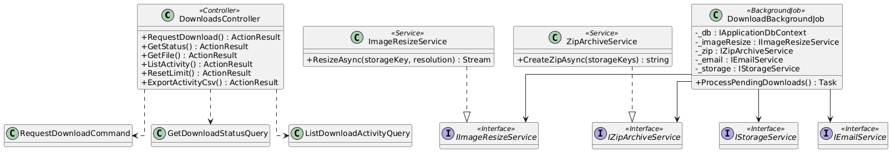
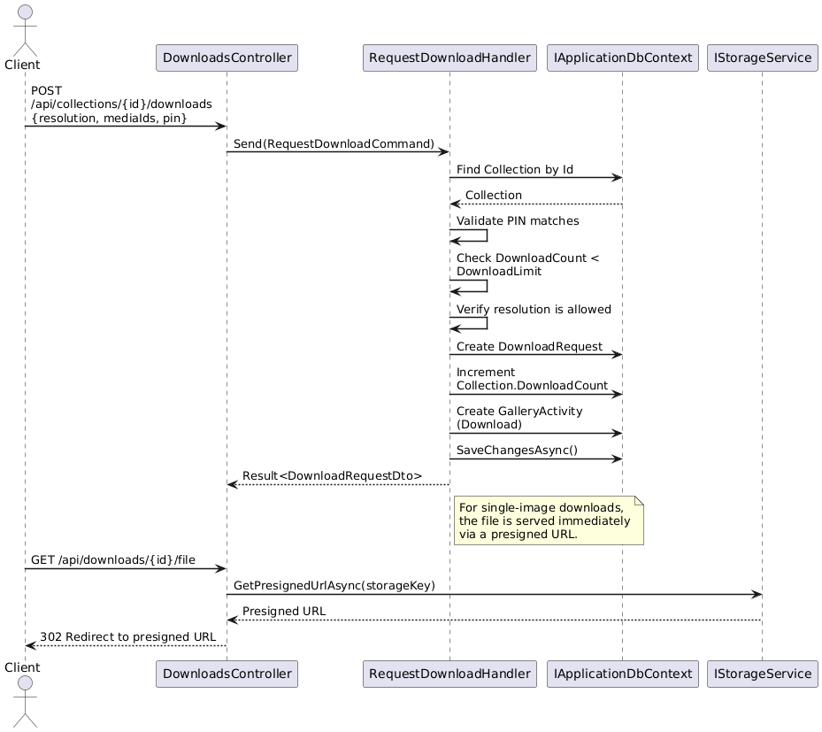
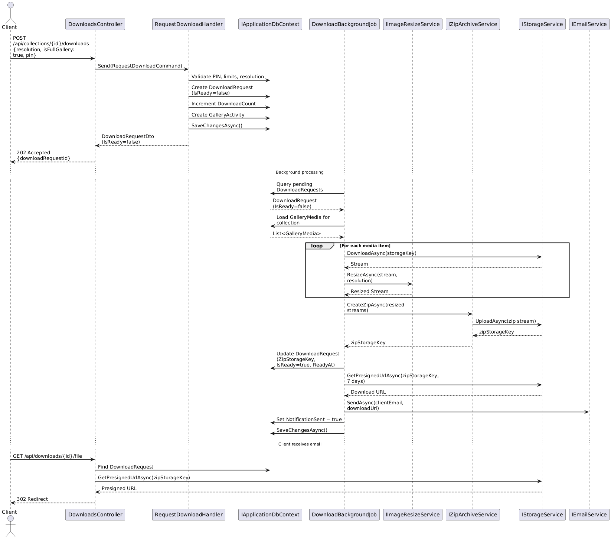
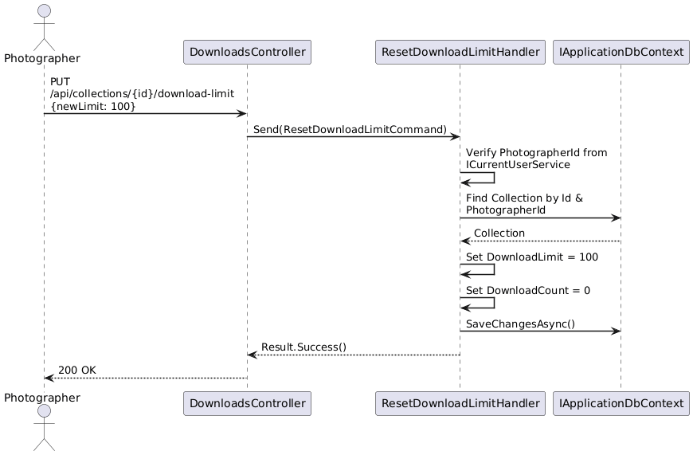
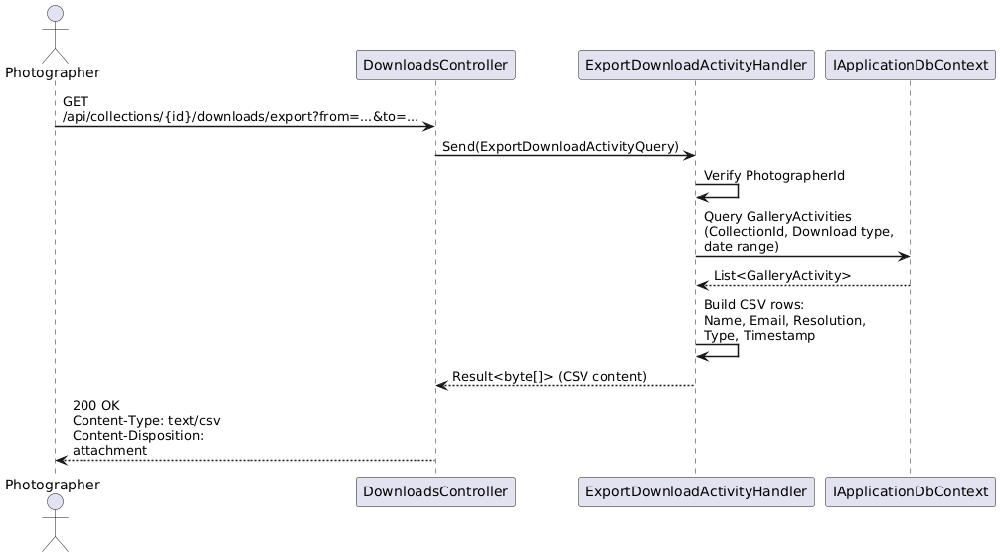

# F06 - Photo Delivery & Downloads

## Overview

Photo Delivery & Downloads enables clients to download individual photos or entire galleries from a photographer's collection. The system supports multiple resolution tiers: web sizes (640px, 1024px, 2048px long edge) available to all plans, and high-resolution options (3600px and original) gated by plan tier (Pro/Ultimate). When multiple images are requested, the system packages them into a ZIP archive for a single download.

Security and control are central to this feature. Photographers can protect downloads with a 4-digit PIN that is auto-generated per collection but remains editable and optionally disableable. Per-collection download limits allow photographers to cap the total number of photos downloaded, with the ability to reset or modify the limit at any time. These controls operate independently of gallery password protection.

For large galleries, the system processes downloads asynchronously. When a ZIP file requires extended preparation time, the client can leave the browser and later receives an email notification containing a time-limited download link (7-day expiry). All download activity is tracked with full attribution (who, when, what resolution, individual vs. full gallery), filterable by date range and action type, and exportable as CSV for the photographer's records.

## Requirements Traceability

| Requirement | Description |
|---|---|
| GAL-1.4.1 | Download Options (individual/full, multiple resolutions, ZIP packaging) |
| GAL-1.4.2 | Download PIN (4-digit, auto-generated, editable, optional) |
| GAL-1.4.3 | Download Limits (configurable per-collection, resettable) |
| GAL-1.4.4 | Async Download with Notification (background ZIP, email link, 7-day expiry) |
| GAL-1.4.5 | Download Activity Tracking (who/when/what, filtering, CSV export) |

## Components

### Domain Layer

**DownloadRequest** (Entity) — Represents a single download request from a client. Tracks the collection, who requested it, the chosen resolution, whether it is a full-gallery or individual-photo download, the list of selected media IDs, the ZIP storage key once built, readiness status, expiry date, and whether the notification email has been sent. Implements `ITenantEntity` for multi-tenant scoping via `PhotographerId`.

**Collection** (Entity, existing) — Extended with download-related properties: `DownloadsEnabled`, `DownloadPin`, `DownloadPinEnabled`, `DownloadLimit`, `DownloadCount`, and `AllowedResolutions` (comma-separated string of permitted `DownloadResolution` values).

**GalleryActivity** (Entity, existing) — Records download events with `ActivityType.Download`. Captures actor name/email, resolution, full-gallery flag, and descriptive details text.

**DownloadResolution** (Enum) — `Web640`, `Web1024`, `Web2048`, `High3600`, `Original`.

### Application Layer

**RequestDownloadCommand** — CQRS command that validates the PIN, checks download limits, verifies the requested resolution is allowed, creates a `DownloadRequest`, increments `DownloadCount`, logs a `GalleryActivity`, and enqueues background ZIP generation for multi-image downloads.

**GetDownloadStatusQuery** — Returns the current state of a `DownloadRequest` so the client can poll or check readiness.

**ListDownloadActivityQuery** — Paginated query over `GalleryActivities` filtered to `ActivityType.Download`, with optional date range filters. Photographer-only (requires `ICurrentUserService` authentication).

**ResetDownloadLimitCommand** — Allows the photographer to reset the download counter to zero and optionally set a new limit.

**ExportDownloadActivityQuery** — Generates a CSV byte stream of download activity records for a given collection and date range.

**IImageResizeService** (Interface) — Abstracts image resizing to the requested long-edge dimension. Implemented in Infrastructure.

**IZipArchiveService** (Interface) — Abstracts ZIP file creation from a list of storage keys. Implemented in Infrastructure.

**DownloadRequestDto** — Read model returned to the API layer.

**GalleryActivityDto** — Read model for activity records (shared across features).

### Infrastructure Layer

**ImageResizeService** — Uses a library such as ImageSharp to resize images to the target long-edge resolution, preserving aspect ratio and EXIF orientation.

**ZipArchiveService** — Streams images from blob storage into a ZIP archive and uploads the result back to storage, returning the storage key.

**DownloadBackgroundJob** — A background worker (Hangfire or .NET `BackgroundService`) that picks up pending `DownloadRequest` records, invokes `IImageResizeService` and `IZipArchiveService`, marks the request as ready, and triggers notification via `IEmailService`.

### API Layer

**DownloadsController** — Exposes endpoints for requesting a download, polling status, retrieving the file (presigned URL redirect), listing activity, resetting limits, and exporting activity as CSV.

## Class Diagrams

### Domain Layer - Download Entities

### Application Layer - Commands, Queries, and Services

### Infrastructure & API Layer

## Sequence Diagrams

### Request Individual Photo Download

### Async Full Gallery Download with Email Notification

### Reset Download Limit

### Export Download Activity as CSV

