# F07 - Proofing & Favorites

## Overview

Proofing & Favorites gives clients a structured way to curate selections from a photographer's collection. Clients can click a heart icon on any photo to add it to an active favorite list, create multiple named lists, and add or remove photos at any time with a live count per list. The feature supports both client-initiated lists and photographer-preset categories (e.g., "Album Picks", "Social Media", "Retouching") that appear pre-created when the client opens the gallery.

Each favorited photo supports a free-text comment field (minimum 500 characters allowed) where clients can leave editing notes or selection rationale. When a comment is added, the photographer is notified via in-app notification and optionally by email. Photographers can set a configurable per-collection favorite limit that caps the total number of photos a client can select, with a clear message shown when the limit is reached.

Favorite lists are actionable: clients can share a list via a unique link, download all images from a list (subject to download PIN and limits), or digitally deliver the list to any email address. Photographers can export lists as Lightroom-compatible copy lists or CSV files with filenames. A cross-collection favorites activity dashboard gives photographers visibility into all active lists, showing client name, collection, photo count, comments, and last-modified date, with notifications when a client marks a list as complete.

## Requirements Traceability

| Requirement | Description |
|---|---|
| GAL-1.5.1 | Favorite Lists (heart icon, multiple named lists, add/remove, count per list) |
| GAL-1.5.2 | Comments on Favorites (free text, photographer notified) |
| GAL-1.5.3 | Preset Favorite Lists (photographer-configured categories) |
| GAL-1.5.4 | Favorite Limits (configurable per collection) |
| GAL-1.5.5 | Favorite List Actions (share link, download, digital delivery, Lightroom export, CSV) |
| GAL-1.5.6 | Favorite Activity Dashboard (cross-collection view, notifications on completion) |

## Components

### Domain Layer

**FavoriteList** (Entity) — Represents a named favorite list scoped to a collection. Tracks the owning photographer, collection, client name/email, whether the list is a photographer-preset category, completion status, and a unique share token for link-based sharing. Implements `ITenantEntity`.

**FavoriteItem** (Entity) — A join between `FavoriteList` and `GalleryMedia`. Each item can carry an optional comment (free text, no character limit below 500 chars). Extends `BaseEntity`.

**Collection** (Entity, existing) — Extended with `FavoriteLimit` (nullable int) that caps total favorites per collection.

**GalleryActivity** (Entity, existing) — Records `ActivityType.Favorite` and `ActivityType.Comment` events, linking to the relevant `FavoriteListId` and optionally `MediaId`.

### Application Layer

**CreateFavoriteListCommand** — Creates a new favorite list (client-initiated or photographer preset). Validates collection existence and generates a unique share token.

**AddFavoriteItemCommand** — Adds a photo to a favorite list. Checks the collection-level favorite limit before permitting the addition. Logs a `GalleryActivity` with `ActivityType.Favorite`.

**RemoveFavoriteItemCommand** — Removes a photo from a favorite list. Frees capacity against the favorite limit.

**UpdateFavoriteCommentCommand** — Sets or updates the comment on a `FavoriteItem`. Triggers a notification to the photographer. Logs a `GalleryActivity` with `ActivityType.Comment`.

**ListFavoriteListsQuery** — Returns all favorite lists for a given collection, including item counts.

**GetFavoriteListItemsQuery** — Returns all items in a specific favorite list with media file names and comments.

**CompleteFavoriteListCommand** — Marks a favorite list as complete and notifies the photographer.

**ShareFavoriteListQuery** — Returns the share URL for a favorite list using its share token.

**DownloadFavoriteListCommand** — Creates a `DownloadRequest` containing only the media IDs from the favorite list, subject to PIN validation and download limits (delegates to download flow from F06).

**DeliverFavoriteListCommand** — Sends the favorite list images as a digital download link to a specified email address.

**ExportFavoriteListQuery** — Generates a Lightroom-compatible copy list or CSV file containing the filenames in the favorite list.

**ListFavoriteActivityQuery** — Cross-collection dashboard query returning all active favorite lists for the authenticated photographer with client name, collection, photo count, comment count, and last-modified date.

**FavoriteListDto / FavoriteItemDto** — Read models returned to the API.

### Infrastructure Layer

**NotificationDispatcher** — Sends in-app and optional email notifications to the photographer when a comment is added or a list is completed. Uses the existing `IEmailService` and notification entity infrastructure.

### API Layer

**FavoritesController** — Exposes endpoints for creating lists, adding/removing items, commenting, completing lists, sharing, downloading, delivering via email, exporting, and viewing the activity dashboard.

## Class Diagrams

### Domain Layer - Favorite Entities

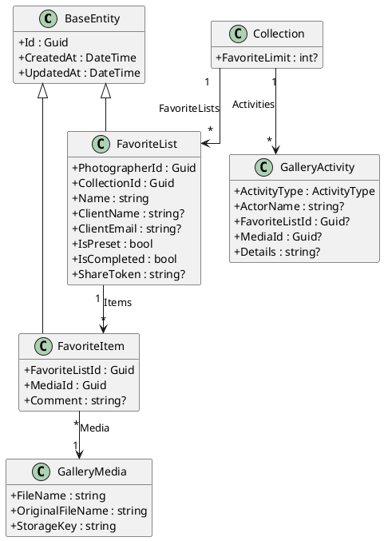

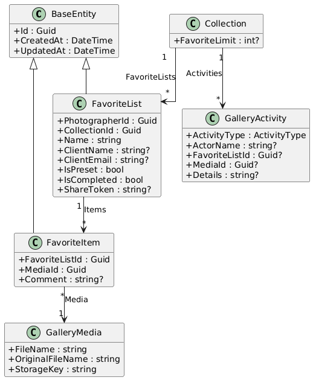

### Application Layer - Commands and Queries

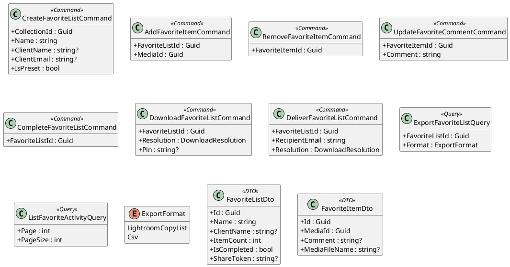

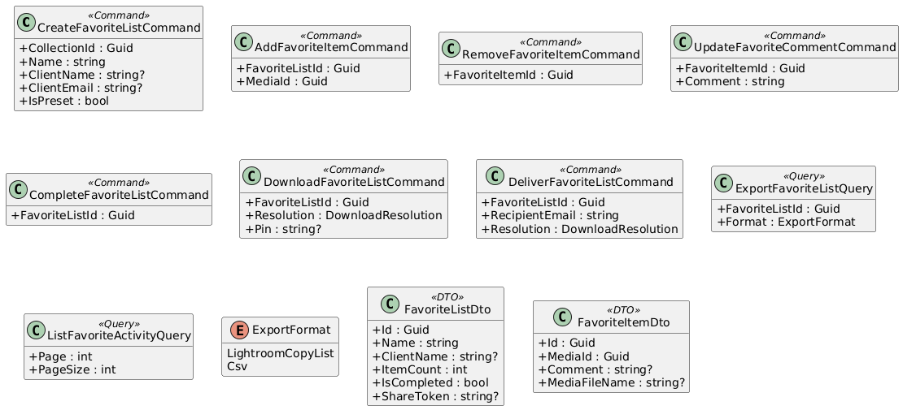

### API Layer

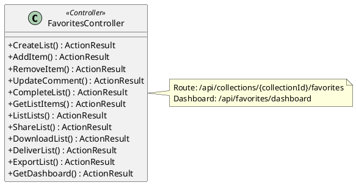

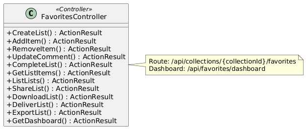

## Sequence Diagrams

### Add Photo to Favorite List

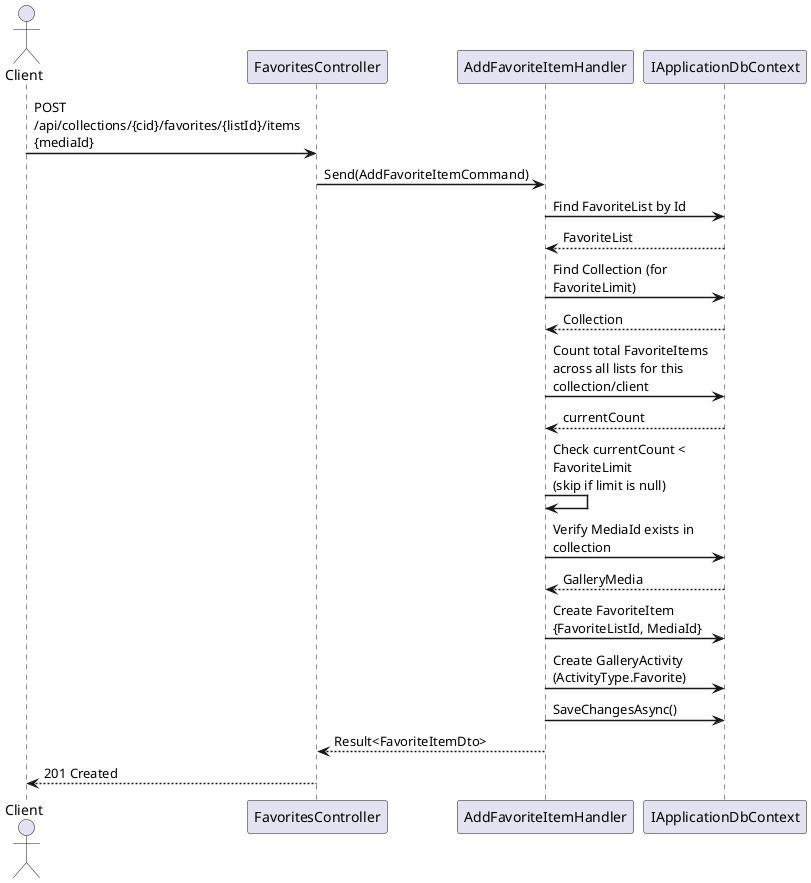

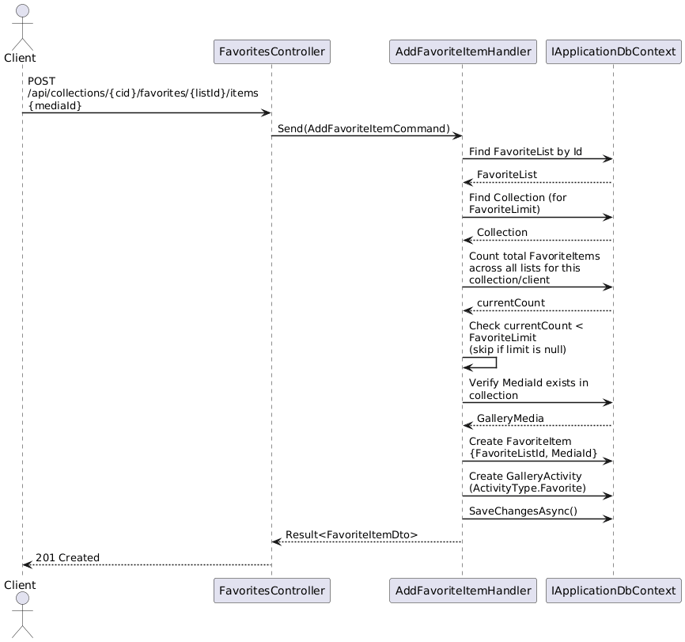

### Add Comment to Favorited Photo

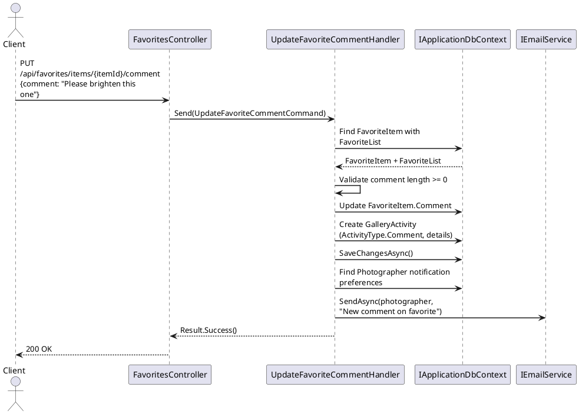

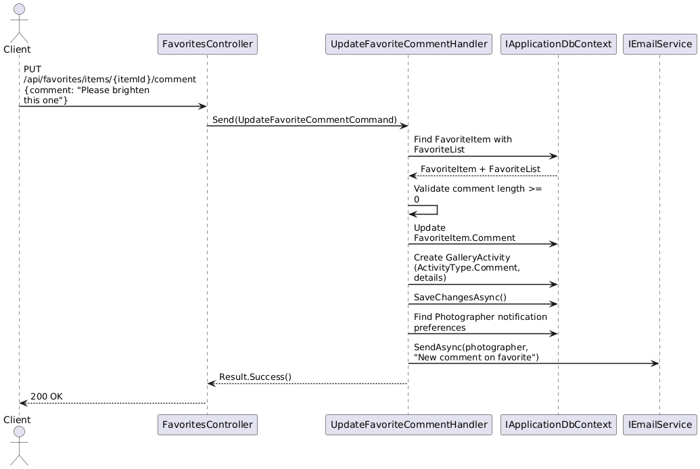

### Complete Favorite List with Photographer Notification

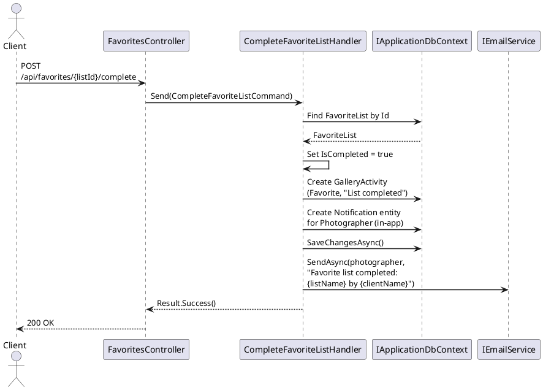

### Export Favorite List as Lightroom Copy List

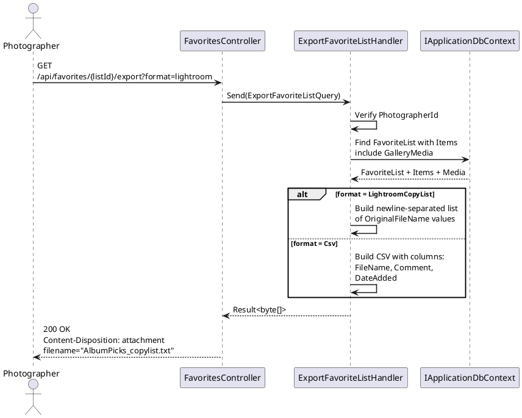

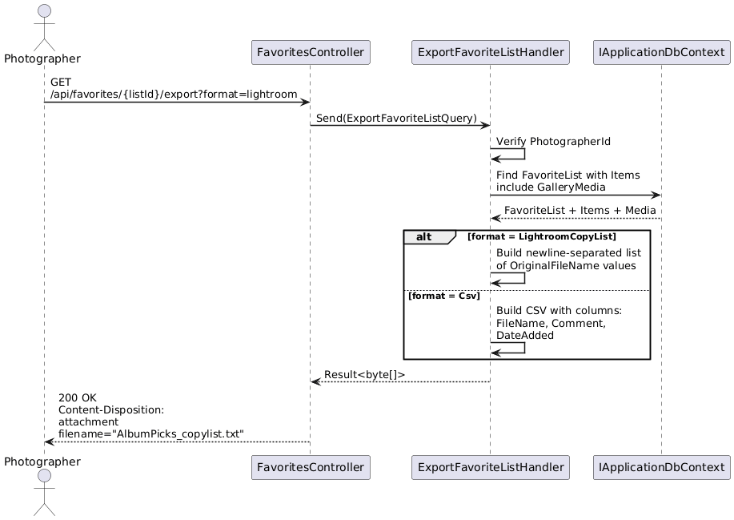

### Download Favorite List Photos

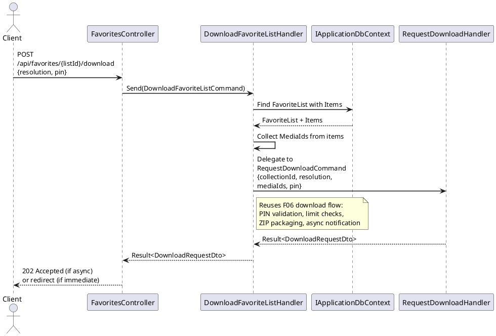

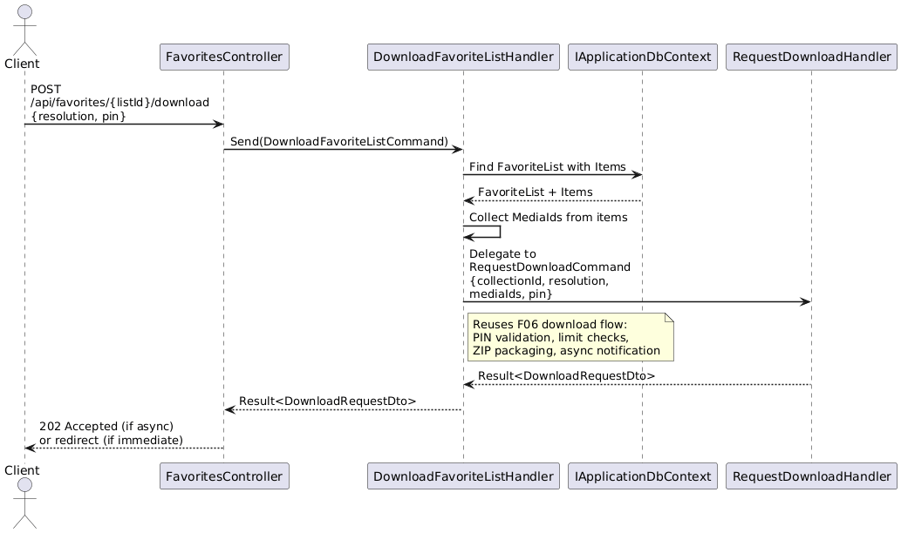

### Favorite Activity Dashboard

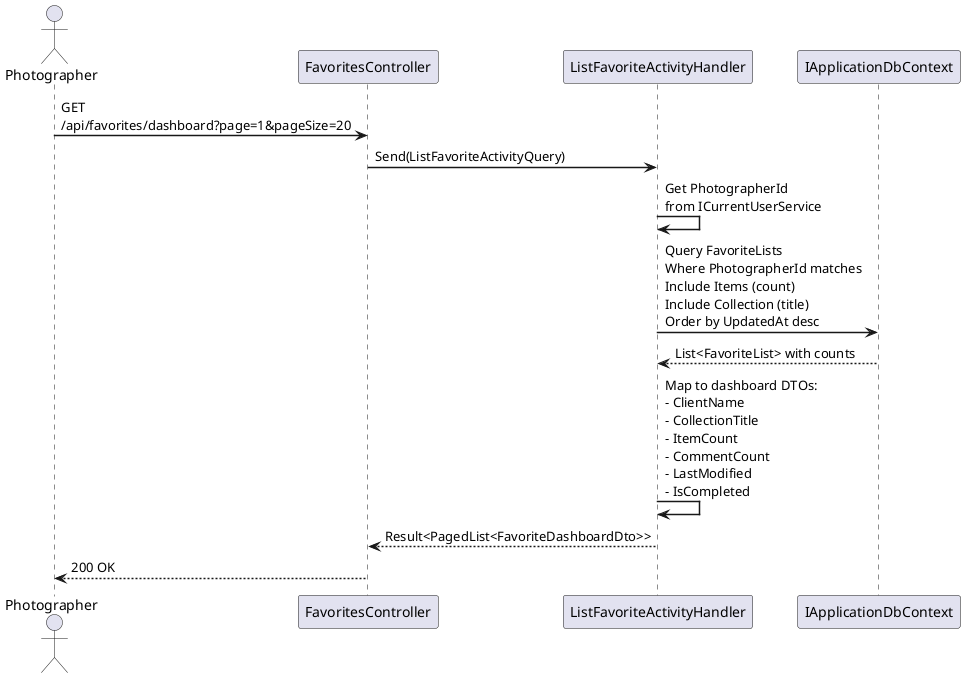

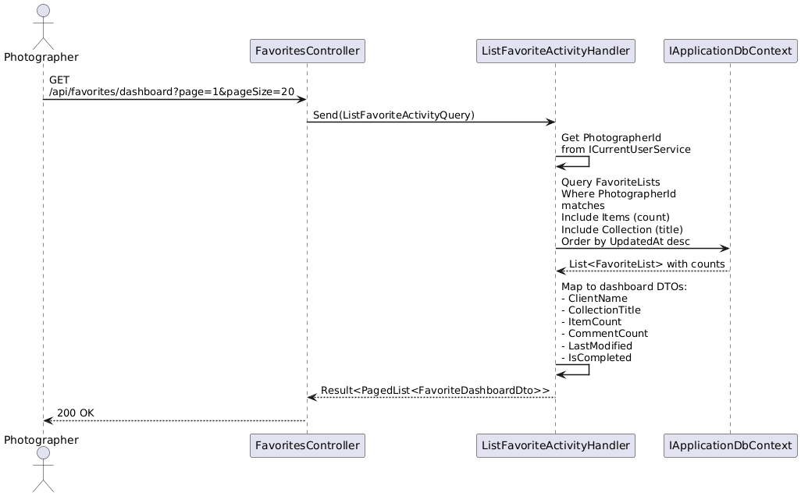
