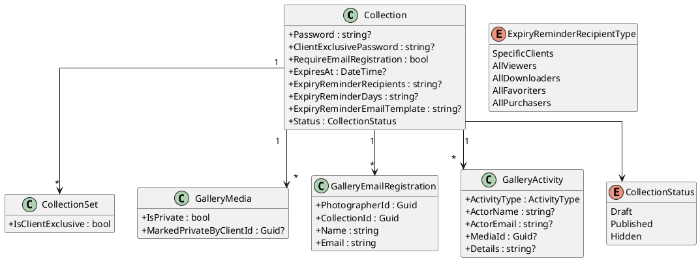
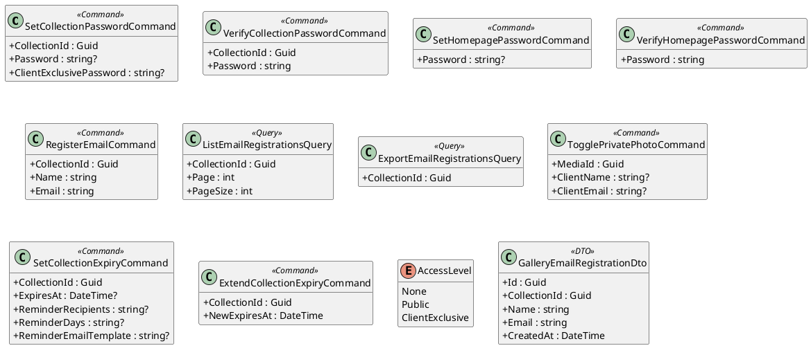
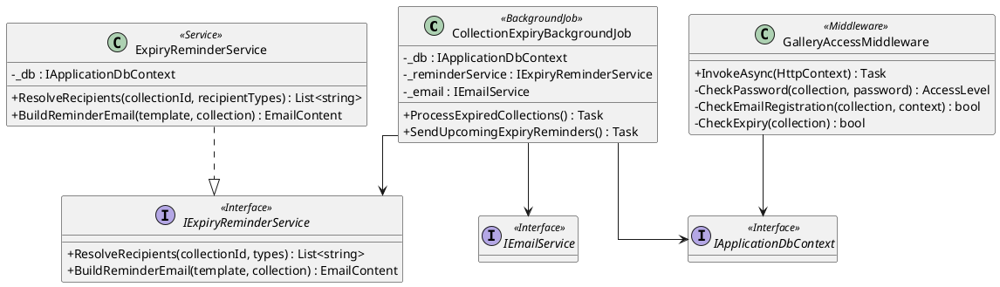
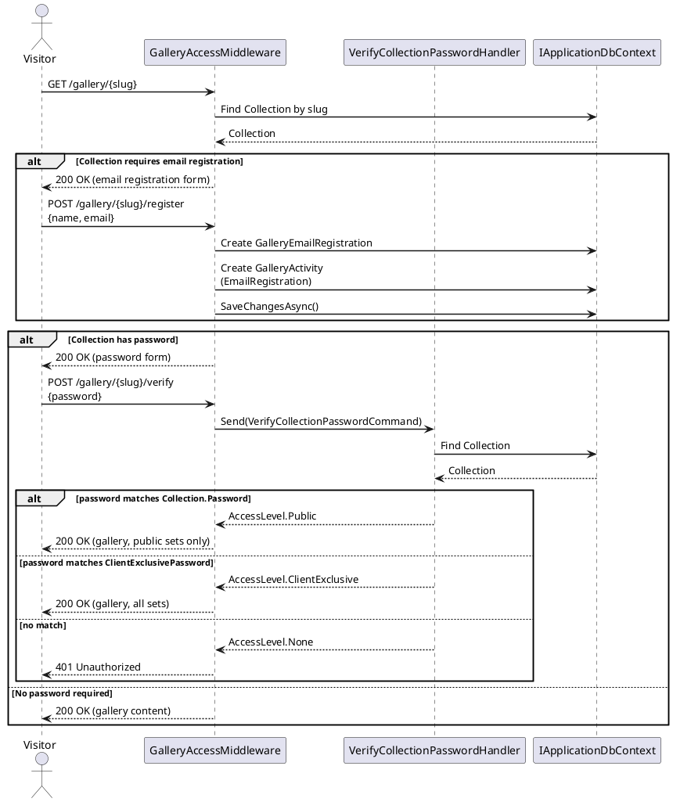
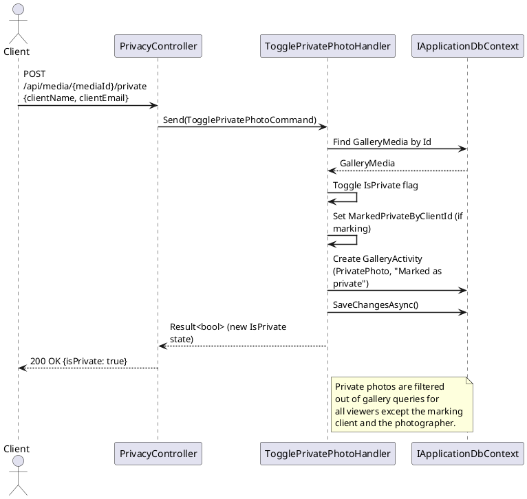
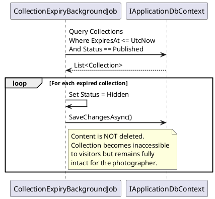
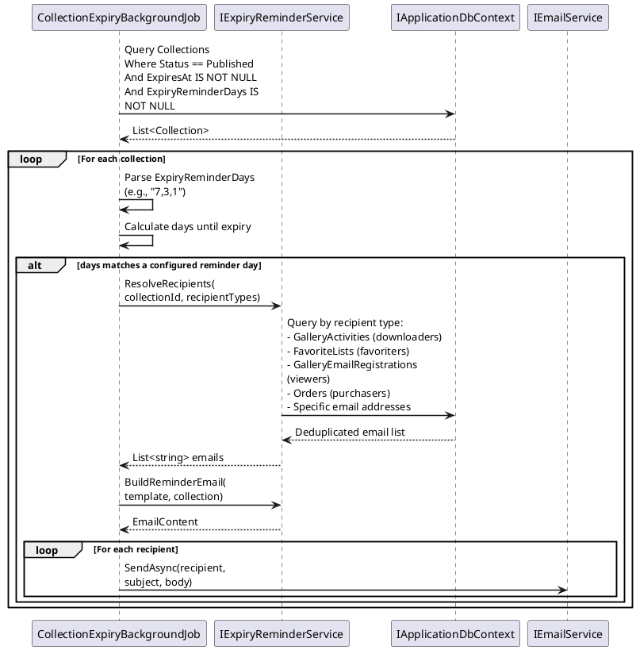
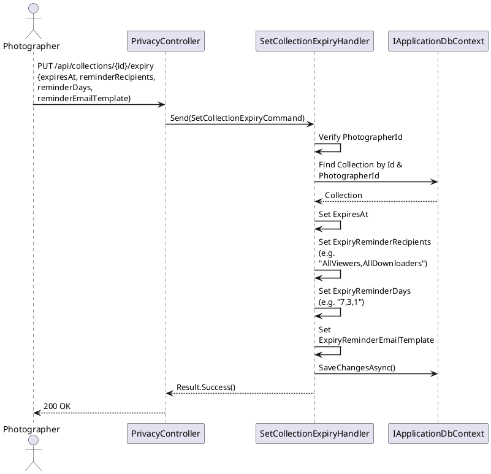
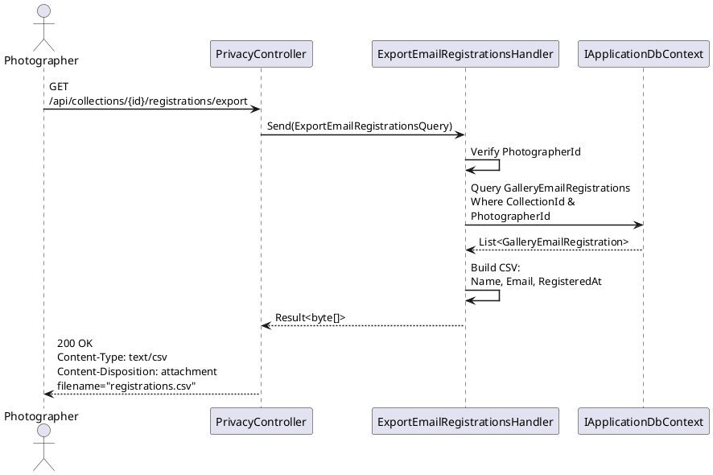

# F08 - Gallery Privacy & Access Control

## Overview

Gallery Privacy & Access Control provides a layered security model for photographer collections. At the most basic level, collections can be password-protected so that visitors must enter the correct password before any content is visible. A separate client-exclusive password reveals additional sets that are hidden from general password holders, with per-set visibility independently configurable. The photographer's gallery homepage can also be password-protected independently of individual collection passwords.

An email registration gate can require visitors to enter their name and email address before viewing any content. This gate can be combined with password protection (email first, then password). Collected email registrations are viewable and exportable by the photographer. At the individual photo level, clients can mark photos as private, hiding them from all other viewers; only the marking client and the photographer can see private photos, with the photographer tracking this in the activity tab.

Collections support date-based expiration. When the expiry date passes, the collection status changes from "Published" to "Hidden" (content is never deleted). Before expiration, the system sends automated reminder emails to configurable recipients: specific clients, or all guests who viewed, downloaded, favorited, or purchased from the collection. Reminder timing is configurable (e.g., 7 days, 3 days, on expiry day), and the email content is customizable by the photographer.

## Requirements Traceability

| Requirement | Description |
|---|---|
| GAL-1.6.1 | Collection Password (configurable, changeable) |
| GAL-1.6.2 | Client Exclusive Access (separate password, per-set visibility) |
| GAL-1.6.3 | Homepage Password (independent of collection passwords) |
| GAL-1.6.4 | Email Registration Gate (name + email, exportable, combinable with password) |
| GAL-1.6.5 | Private Photos (client-marked, hidden from others, visible in activity tab) |
| GAL-1.6.6 | Collection Expiration (date-based, auto-hide, extendable, no delete) |
| GAL-1.6.7 | Auto Expiry Reminder Emails (configurable recipients/timing/content) |

## Components

### Domain Layer

**Collection** (Entity, existing) — Extended with privacy-related properties: `Password`, `ClientExclusivePassword`, `RequireEmailRegistration`, `ExpiresAt`, `ExpiryReminderRecipients` (serialized list of recipient types or specific emails), `ExpiryReminderDays` (comma-separated day-before values), `ExpiryReminderEmailTemplate`.

**CollectionSet** (Entity, existing) — Extended with `IsClientExclusive` flag that controls whether the set is visible only to client-exclusive password holders.

**GalleryMedia** (Entity, existing) — Extended with `IsPrivate` and `MarkedPrivateByClientId` to support client-marked private photos.

**GalleryEmailRegistration** (Entity) — Records name and email of visitors who pass through the email registration gate. Implements `ITenantEntity`.

**GalleryActivity** (Entity, existing) — Records `ActivityType.PrivatePhoto` and `ActivityType.EmailRegistration` events with full actor attribution.

**HomepageSettings** (Value Object / Entity) — Stores the homepage-level password independently. Could be stored on the `Photographer` entity or as a separate tenant-scoped entity.

**ExpiryReminderRecipientType** (Enum) — `SpecificClients`, `AllViewers`, `AllDownloaders`, `AllFavoriters`, `AllPurchasers`.

### Application Layer

**SetCollectionPasswordCommand** — Sets or clears the collection password and/or client-exclusive password. Photographer-only.

**VerifyCollectionPasswordCommand** — Validates a visitor-provided password against the collection. Returns the access level: `None`, `Public`, or `ClientExclusive`.

**SetHomepagePasswordCommand** — Sets or clears the homepage password for the photographer's gallery root.

**VerifyHomepagePasswordCommand** — Validates a visitor-provided homepage password.

**RegisterEmailCommand** — Records a visitor's name and email for a collection's email registration gate. Logs a `GalleryActivity` with `ActivityType.EmailRegistration`.

**ListEmailRegistrationsQuery** — Returns all registered emails for a collection, paginated.

**ExportEmailRegistrationsQuery** — Generates a CSV of all registered emails for a collection.

**TogglePrivatePhotoCommand** — Toggles the `IsPrivate` flag on a `GalleryMedia` item. Records the client who marked it. Logs a `GalleryActivity` with `ActivityType.PrivatePhoto`.

**SetCollectionExpiryCommand** — Configures the expiry date, reminder recipients, reminder timing, and reminder email template for a collection.

**ExtendCollectionExpiryCommand** — Extends an expired or soon-to-expire collection's expiry date.

**IExpiryReminderService** (Interface) — Abstracts the logic of determining which recipients should receive reminders and building the reminder content.

### Infrastructure Layer

**CollectionExpiryBackgroundJob** — A scheduled background job that runs daily (or more frequently). It finds collections whose `ExpiresAt` is in the past and transitions their `Status` from `Published` to `Hidden`. It also finds collections approaching expiry and triggers reminder emails according to the configured `ExpiryReminderDays`.

**ExpiryReminderService** — Implements `IExpiryReminderService`. Resolves recipient lists by querying `GalleryActivities` (downloaders, favoriters), `GalleryEmailRegistrations` (viewers), and `Orders` (purchasers) to build the appropriate email recipient set.

**PasswordHashingService** — Hashes collection and homepage passwords for secure storage (bcrypt or PBKDF2). Note: the current domain model stores passwords as plaintext strings; this service would be introduced to improve security.

### API Layer

**PrivacyController** — Exposes endpoints for setting/verifying passwords, configuring email registration gates, toggling private photos, setting/extending expiry, and exporting email registrations.

**GalleryAccessMiddleware** — Middleware (or action filter) that intercepts requests to client-facing gallery endpoints and enforces password, email registration, and expiry checks before allowing access to collection content.

## Class Diagrams

### Domain Layer - Privacy Entities

### Application Layer - Commands and Queries

### Infrastructure Layer - Background Jobs and Services

## Sequence Diagrams

### Visitor Accesses Password-Protected Collection

### Client Marks Photo as Private

### Collection Expiry and Auto-Hide

### Send Expiry Reminder Emails

### Set Collection Expiry Configuration

### Email Registration and Export

