# F09 - Gallery Sharing & Social

## Overview

Gallery Sharing & Social enables photographers and their clients to distribute gallery content across communication channels and social platforms. The feature begins with email invitations: photographers compose branded emails using templates with custom subject lines, body text, and header images. The collection password can optionally be embedded in the email body. Each invitation tracks delivery status (sent and opened timestamps), giving photographers visibility into engagement.

Social media sharing covers Facebook, Instagram, Pinterest, WhatsApp, Messenger, Threads, email, and copy-link options. Both full collections and individual images can be shared. The system generates Open Graph metadata (title, description, preview image) for each shareable URL so that social platforms render rich previews. Quick Share allows photographers to select specific photos within a collection and generate a unique URL showing only those photos, independent of the collection's privacy settings. These links are revocable at any time.

QR code generation produces a scannable code linking to any collection, downloadable as a PNG image. Gallery embedding provides iframe and JavaScript snippet options that photographers can paste into external websites, with embedded galleries respecting the collection's privacy settings (password prompts render within the embed frame).

## Requirements Traceability

| Requirement | Description |
|---|---|
| GAL-1.7.1 | Email Invitations (branded templates, custom subject/body/header, optional password, delivery tracking) |
| GAL-1.7.2 | Social Media Sharing (8 platforms, Open Graph metadata, collection + individual image) |
| GAL-1.7.3 | Quick Share (photographer-selected photos, unique URL, privacy-independent, revocable) |
| GAL-1.7.4 | QR Code Generation (scannable, downloadable as PNG) |
| GAL-1.7.5 | Gallery Embedding (iframe/JS snippet, respects privacy settings) |

## Components

### Domain Layer

**EmailInvitation** (Entity) — Tracks a single email invitation for a collection. Stores the recipient email, subject, body text, optional header image URL, whether the collection password was included, and delivery tracking fields: `IsSent`, `SentAt`, `IsOpened`, `OpenedAt`. Implements `ITenantEntity`.

**QuickShareLink** (Entity) — Represents a curated photo selection with a unique token-based URL. Stores the comma-separated media IDs and a revocation flag. The link URL is derived from the token, not the collection slug, making it independent of collection privacy. Implements `ITenantEntity`.

**Collection** (Entity, existing) — Extended with `EmbeddingEnabled` and `EmbedCode` fields for gallery embedding support, and `GoogleAnalyticsPropertyId` for analytics tag injection into embedded galleries.

**SharePlatform** (Enum) — `Facebook`, `Instagram`, `Pinterest`, `WhatsApp`, `Messenger`, `Threads`, `Email`, `CopyLink`.

### Application Layer

**SendEmailInvitationCommand** — Composes and sends a branded email invitation for a collection. Optionally appends the collection password to the body. Records the invitation entity with delivery status. Uses `IEmailService` for sending.

**ListEmailInvitationsQuery** — Returns all invitations for a collection with delivery status.

**TrackEmailOpenCommand** — Updates an `EmailInvitation` record when the recipient opens the email (triggered by a tracking pixel or webhook from the email provider).

**GetShareMetadataQuery** — Generates Open Graph metadata for a collection or individual image, returning title, description, and preview image URL suitable for social platform rendering.

**CreateQuickShareLinkCommand** — Creates a `QuickShareLink` for a photographer-selected set of media IDs. Generates a unique token and persists the link.

**RevokeQuickShareLinkCommand** — Sets `IsRevoked = true` on a `QuickShareLink`, making the URL return a 404/gone response.

**ListQuickShareLinksQuery** — Returns all quick share links for a collection with revocation status.

**GetQuickSharePhotosQuery** — Resolves a quick share token to the list of photos, returning media data only if the link is not revoked.

**GenerateQrCodeQuery** — Generates a QR code PNG for a collection URL. Returns the image as a base64 data URL or byte array.

**GetEmbedCodeQuery** — Generates iframe and JavaScript embed snippets for a collection. The embed code includes privacy enforcement (the embedded view will prompt for a password if the collection requires one).

**IQrCodeService** (Interface) — Abstracts QR code image generation. Implemented in Infrastructure.

### Infrastructure Layer

**QrCodeService** — Implements `IQrCodeService` using a library such as QRCoder or SkiaSharp to generate PNG-format QR code images from URLs.

**EmailTrackingMiddleware** — Handles tracking pixel requests or email provider webhook callbacks to mark invitations as opened.

**OpenGraphMiddleware** — Injects Open Graph meta tags into the HTML response for gallery pages so that social platform crawlers receive rich preview metadata.

### API Layer

**SharingController** — Exposes endpoints for sending invitations, listing invitations, creating/revoking quick share links, generating QR codes, and retrieving embed code.

**QuickShareController** — Public-facing controller that resolves quick share tokens to photo galleries (no authentication required, but respects revocation).

**OpenGraphController** — Serves Open Graph metadata for social platform crawlers, returning appropriate meta tags for collections and individual images.

## Class Diagrams

### Domain Layer - Sharing Entities

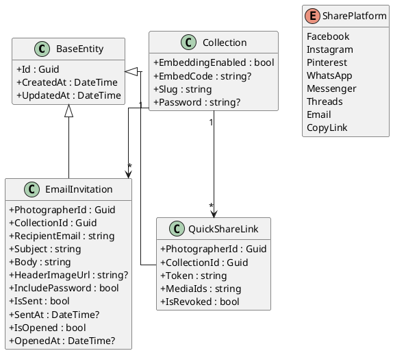

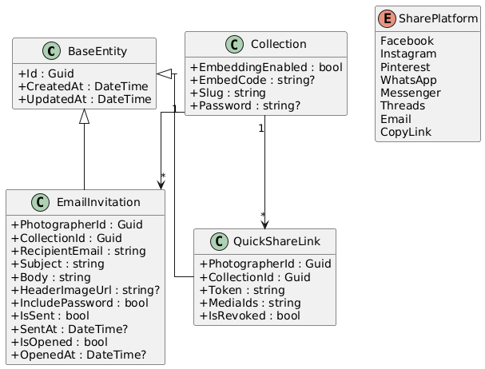

### Application Layer - Commands, Queries, and Services

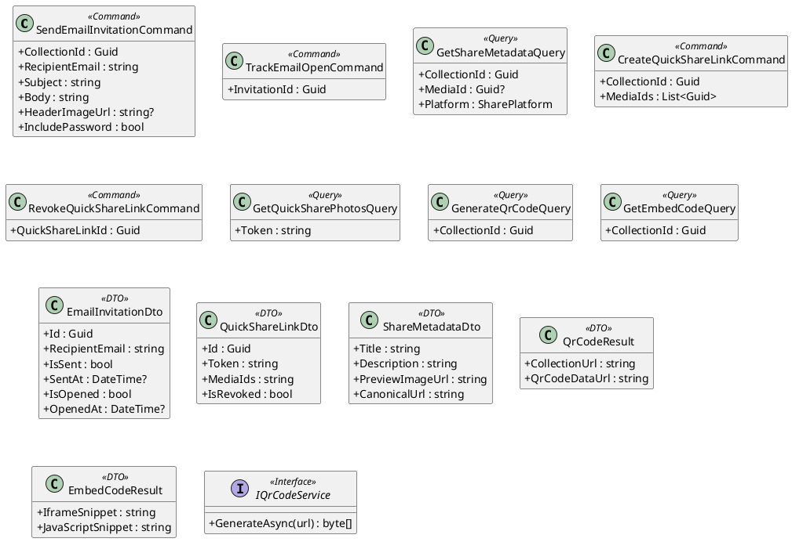

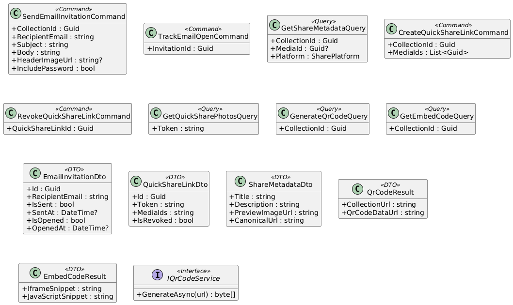

### API Layer

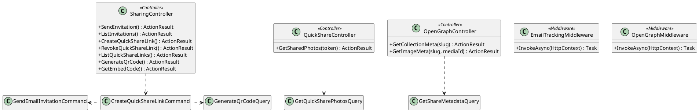

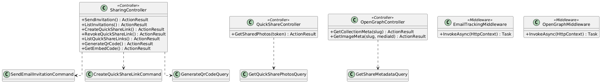

## Sequence Diagrams

### Send Email Invitation with Password

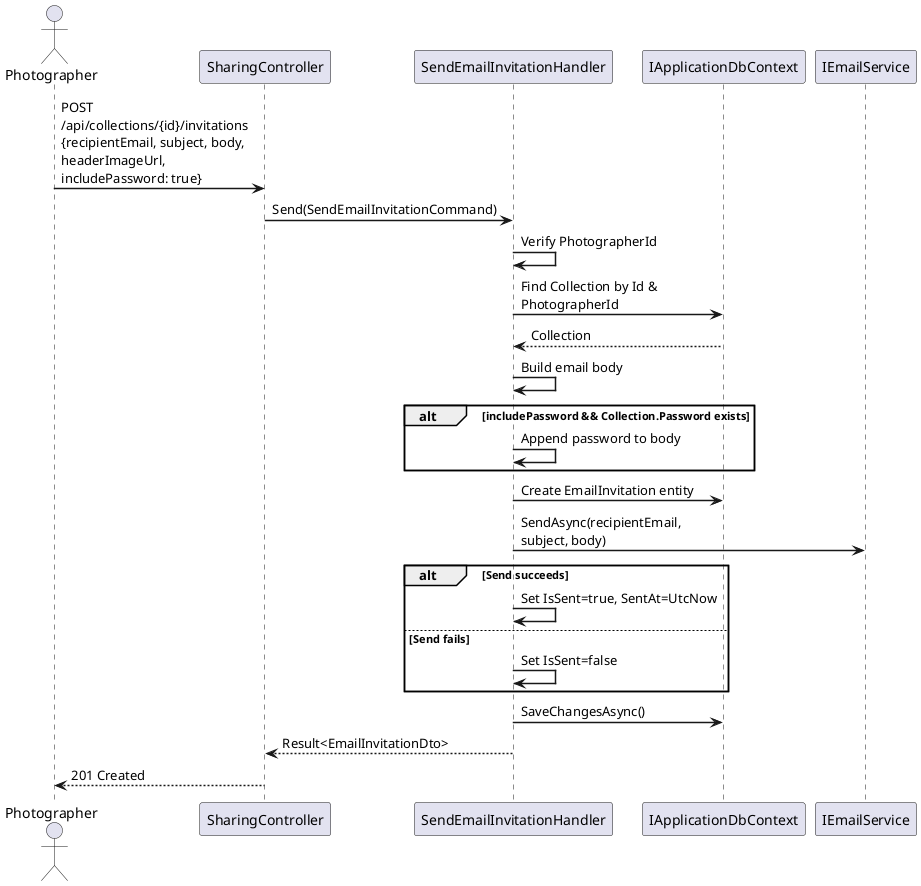

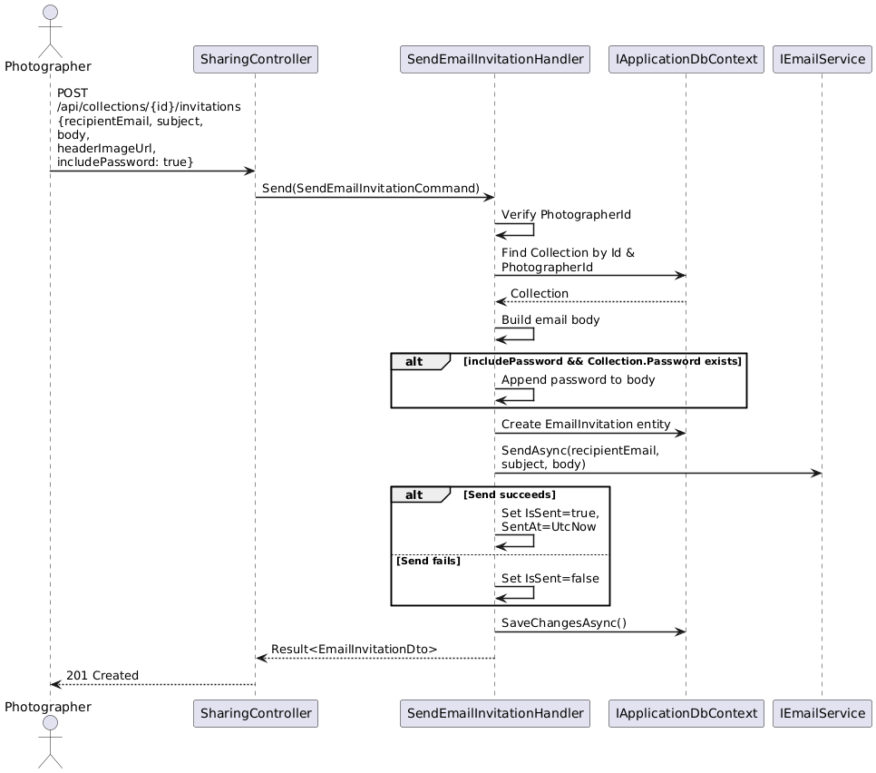

### Track Email Open

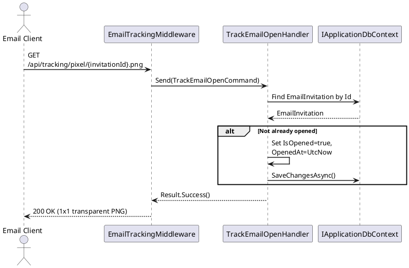

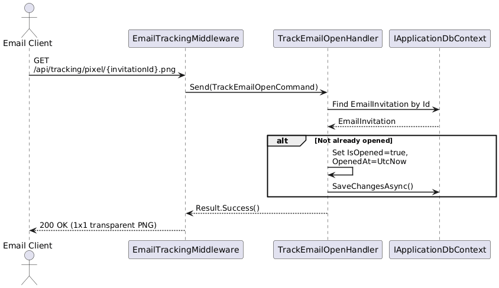

### Social Media Share with Open Graph

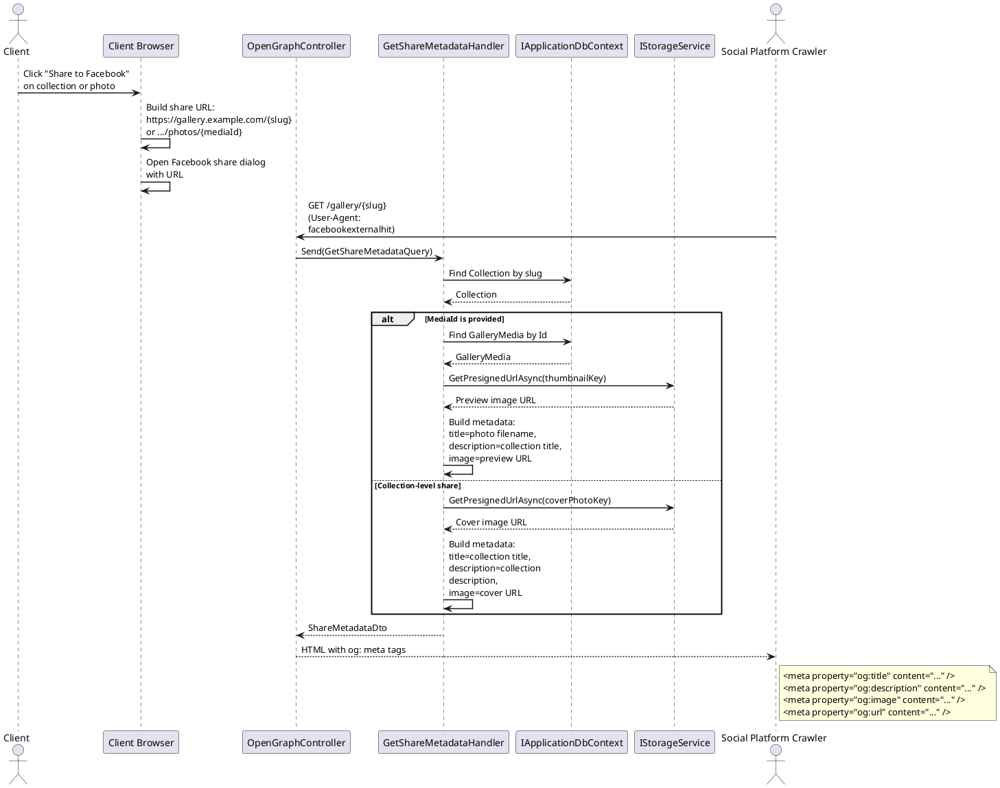

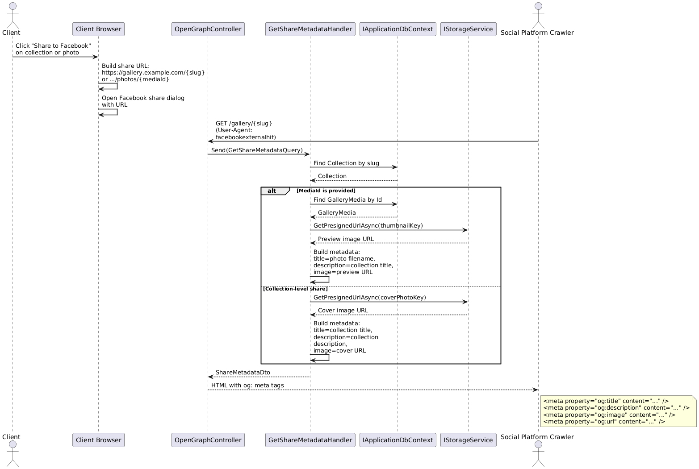

### Create and Access Quick Share Link

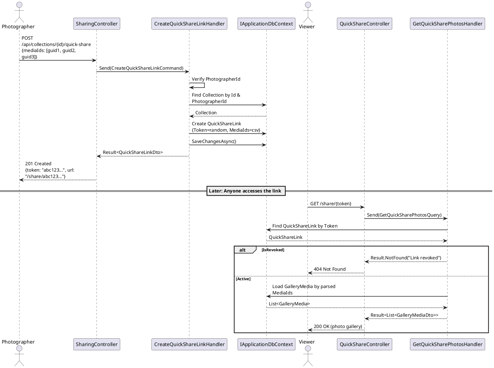

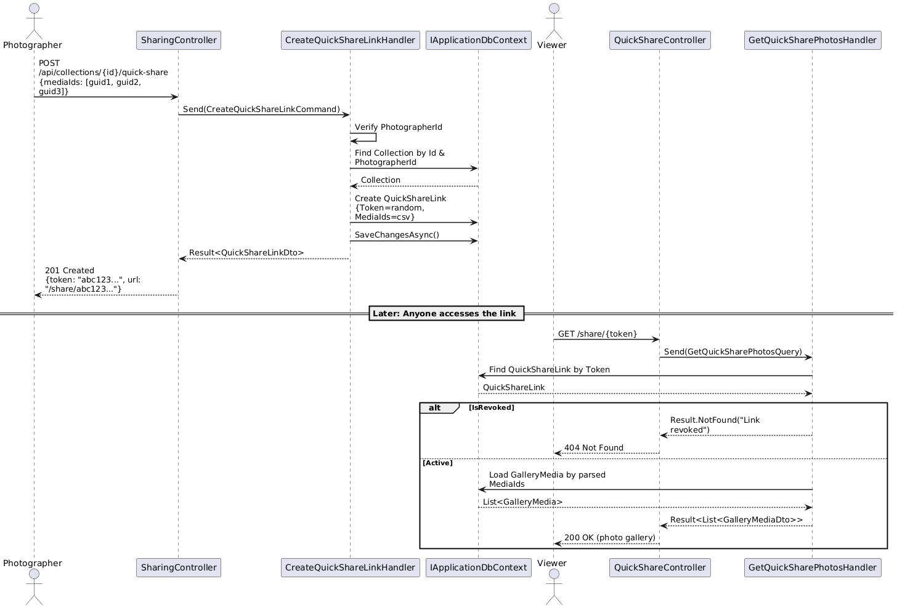

### Generate QR Code

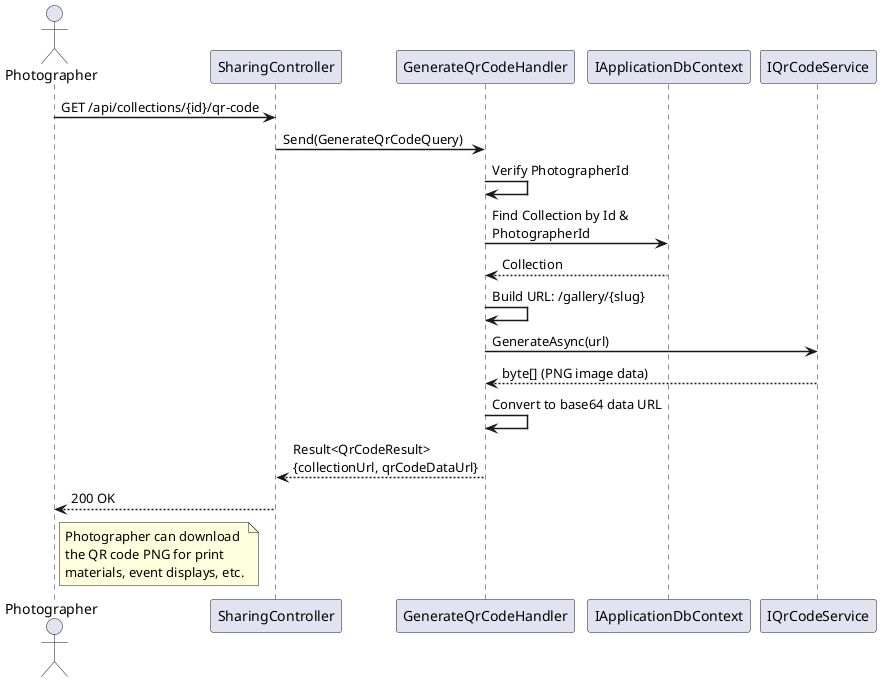

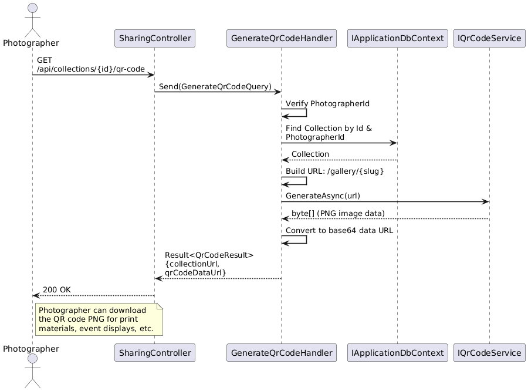

### Get Embed Code

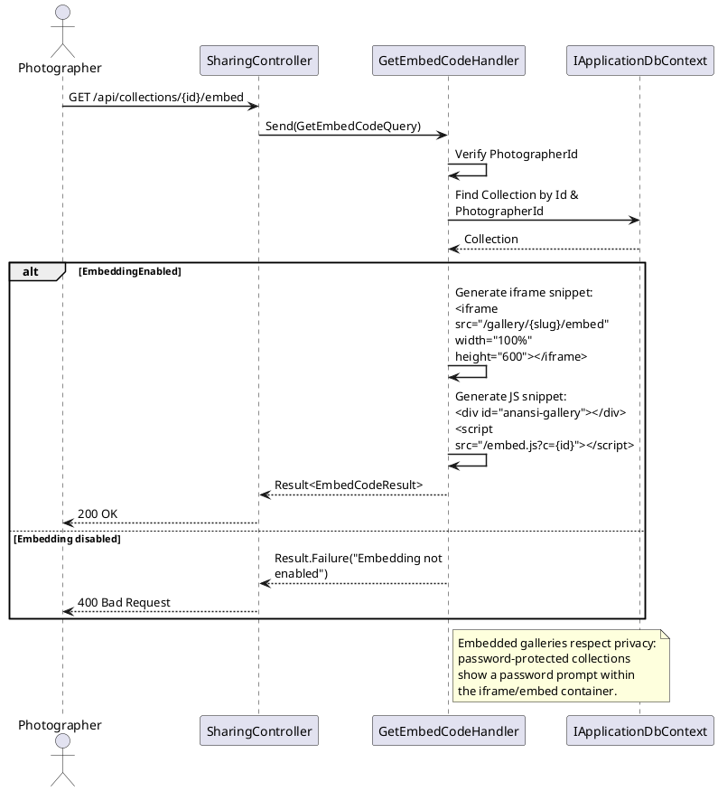

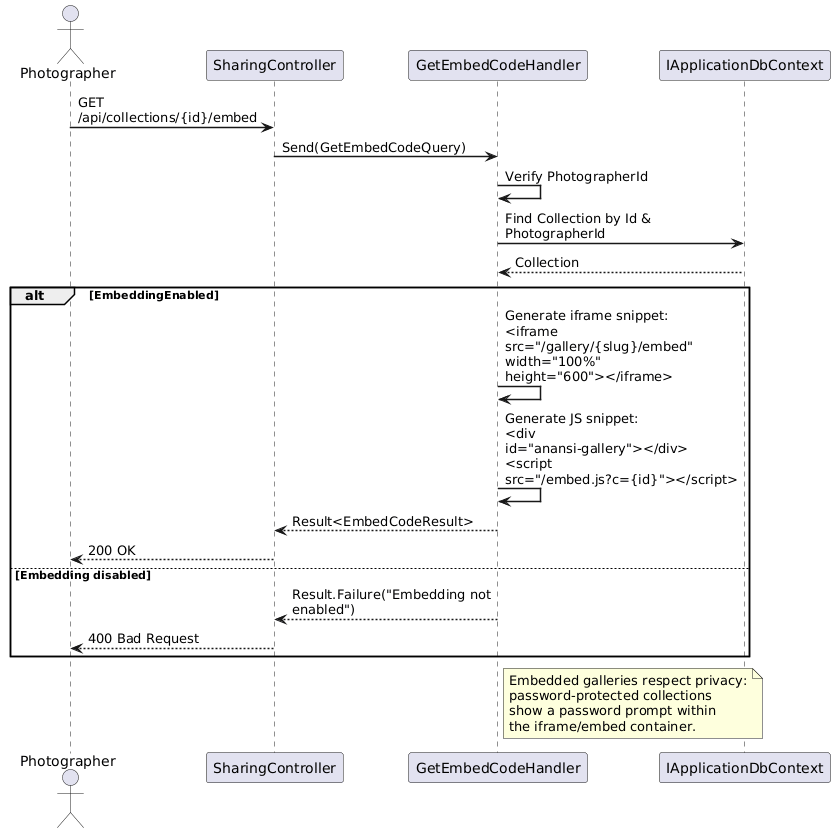
