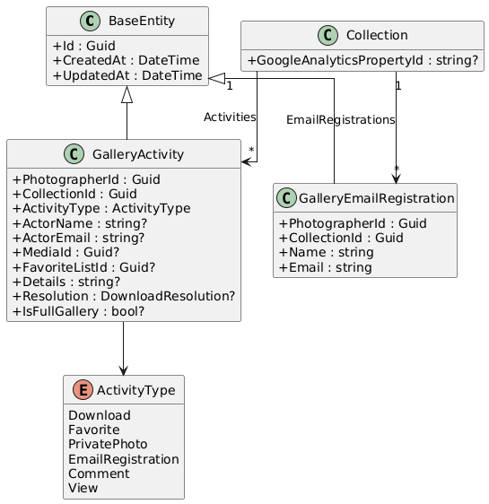
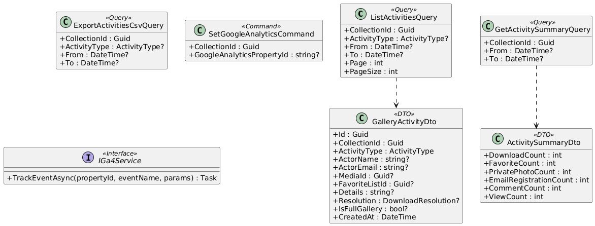
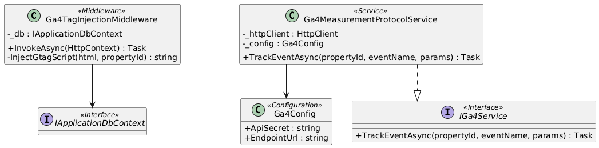
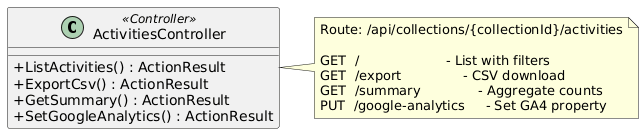
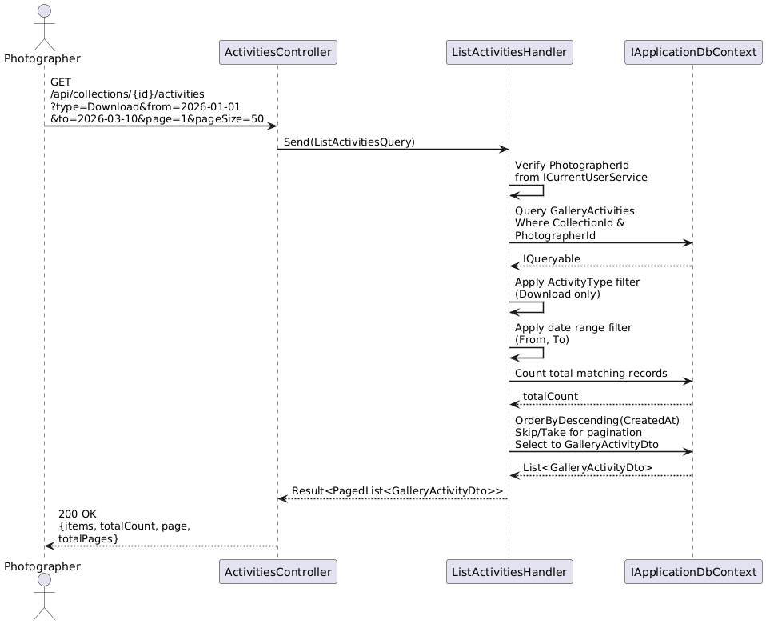
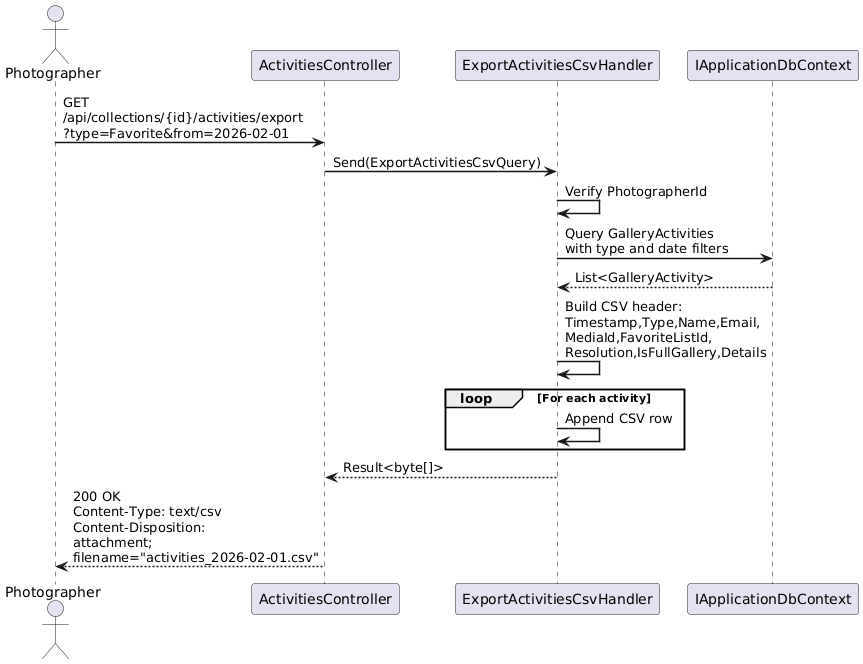
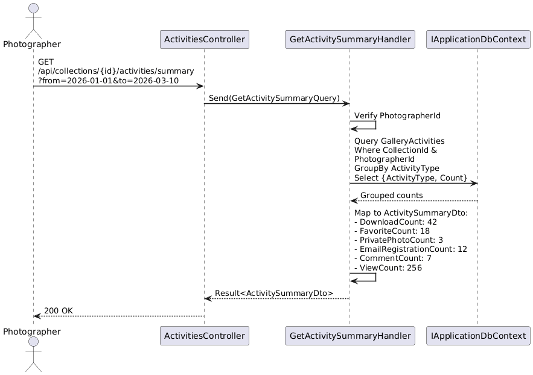
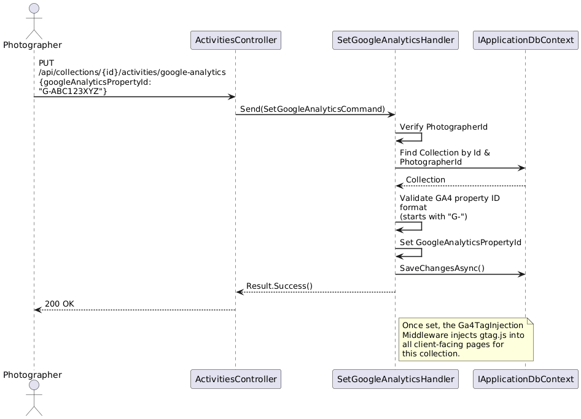
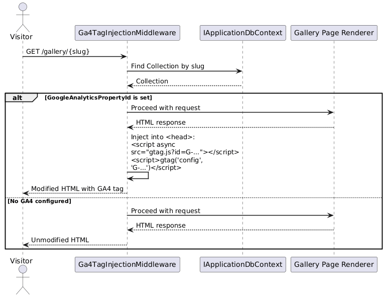
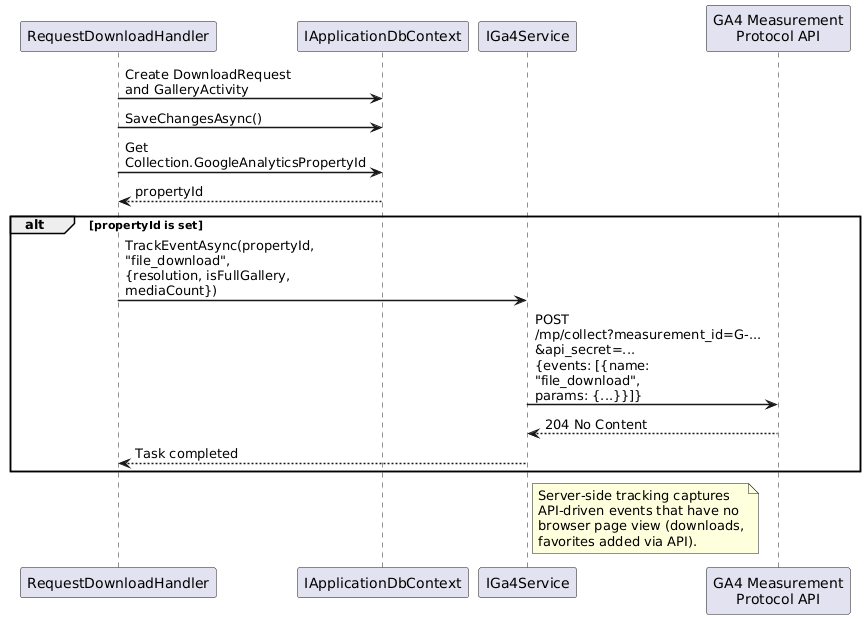

# F10 - Gallery Analytics & Activity

## Overview

Gallery Analytics & Activity provides photographers with a comprehensive view of how clients interact with their collections. Each collection has an Activities tab that aggregates four categories of events: download activity (who downloaded, when, what resolution, individual vs. full gallery), favorite activity (who favorited which photos, which list, any comments), private photo activity (which photos were marked private and by whom), and email registration activity (name, email, timestamp of visitors who registered). All activity records include timestamps, are filterable by event type and date range, and can be exported as CSV.

Beyond the built-in activity tracking, the platform integrates with Google Analytics GA4 to give photographers access to standard web analytics for their galleries. Photographers connect their GA4 property by entering their Measurement ID, and the system injects the GA4 tag into all client-facing gallery pages. Alternatively, server-side event tracking is supported via the GA4 Measurement Protocol for actions like downloads and favorites that occur through API calls rather than page views.

Together, these two layers give photographers both granular, action-level insight into client behavior (through the Activities tab) and aggregated web analytics (through GA4) covering page views, visitor counts, geographic distribution, and session duration.

## Requirements Traceability

| Requirement | Description |
|---|---|
| GAL-1.9.1 | Activities Tab (download, favorite, private photo, email registration activity, timestamps, filtering, CSV export) |
| GAL-1.9.2 | Google Analytics GA4 Integration (Measurement Protocol or tag injection, page views, visitors, geography, sessions) |

## Components

### Domain Layer

**GalleryActivity** (Entity, existing) — The central event record shared across all activity types. Stores `PhotographerId`, `CollectionId`, `ActivityType` (enum), actor name/email, optional `MediaId`, optional `FavoriteListId`, descriptive `Details` text, and download-specific fields (`Resolution`, `IsFullGallery`). Implements `ITenantEntity` for multi-tenant scoping.

**ActivityType** (Enum, existing) — `Download`, `Favorite`, `PrivatePhoto`, `EmailRegistration`, `Comment`, `View`.

**Collection** (Entity, existing) — Extended with `GoogleAnalyticsPropertyId` (nullable string) that stores the photographer's GA4 Measurement ID (e.g., `G-XXXXXXXXXX`).

**GalleryEmailRegistration** (Entity, existing) — Records from the email registration gate are surfaced in the activity tab alongside `GalleryActivity` records.

### Application Layer

**ListActivitiesQuery** — Unified paginated query over `GalleryActivities` for a given collection. Accepts optional filters: `ActivityType?` for type-based filtering and `From`/`To` date range. Returns `PagedList<GalleryActivityDto>`. Photographer-only (requires authentication).

**ExportActivitiesCsvQuery** — Generates a CSV byte array of all activity records for a collection, applying the same type and date range filters. Columns: Timestamp, Type, ActorName, ActorEmail, MediaId, FavoriteListId, Resolution, IsFullGallery, Details.

**GetActivitySummaryQuery** — Returns aggregate counts per activity type for a collection over a given date range. Useful for dashboard summary cards (e.g., "42 downloads, 18 favorites, 3 private, 12 registrations").

**SetGoogleAnalyticsCommand** — Sets or clears the `GoogleAnalyticsPropertyId` on a collection. Photographer-only.

**IGa4Service** (Interface) — Abstracts server-side GA4 event tracking via the Measurement Protocol. Methods for sending events like `download`, `favorite`, `view`, and `registration`.

**GalleryActivityDto** (DTO, existing) — Read model for a single activity record.

**ActivitySummaryDto** (DTO) — Aggregate counts per activity type.

### Infrastructure Layer

**Ga4TagInjectionMiddleware** — Middleware that inspects outgoing HTML responses for client-facing gallery pages. If the associated collection has a `GoogleAnalyticsPropertyId` set, the middleware injects the GA4 `gtag.js` script tag into the HTML `<head>`.

**Ga4MeasurementProtocolService** — Implements `IGa4Service`. Sends server-side events to the GA4 Measurement Protocol endpoint (`https://www.google-analytics.com/mp/collect`) using the collection's GA4 API secret and Measurement ID. Used for tracking API-driven events (downloads, favorites) that have no client-side page view.

**ActivityCsvExportService** — Utility for building CSV content from a list of `GalleryActivity` records. Could be inlined in the handler or extracted as a reusable service.

### API Layer

**ActivitiesController** — Exposes endpoints for listing activities (with filtering), exporting CSV, retrieving the activity summary, and configuring the GA4 integration.

## Class Diagrams

### Domain Layer - Activity Entities

### Application Layer - Queries and Services

### Infrastructure Layer - GA4 Integration

### API Layer

## Sequence Diagrams

### List Collection Activities with Filtering

### Export Activities as CSV

### Get Activity Summary

### Configure Google Analytics GA4

### GA4 Tag Injection for Client Page Views

### Server-Side GA4 Event Tracking (Downloads)

