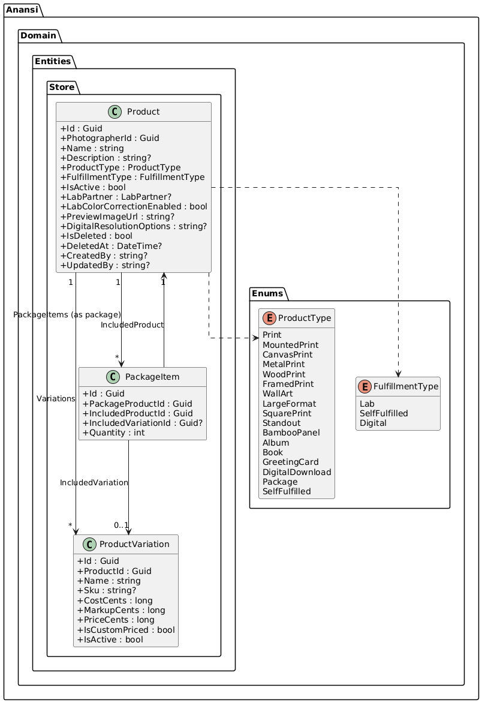
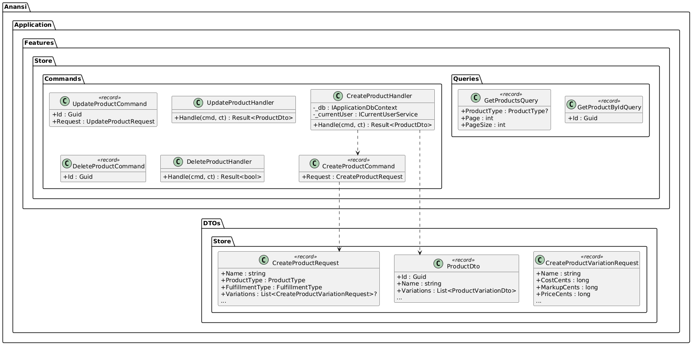
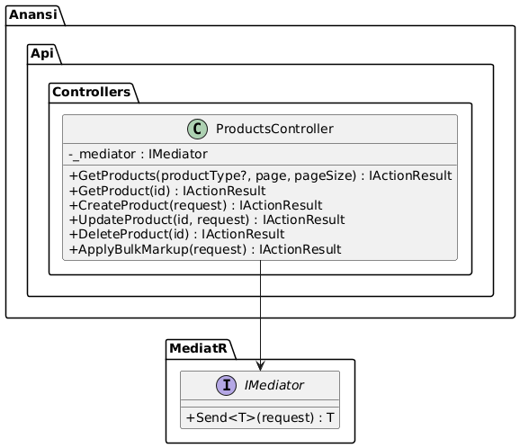
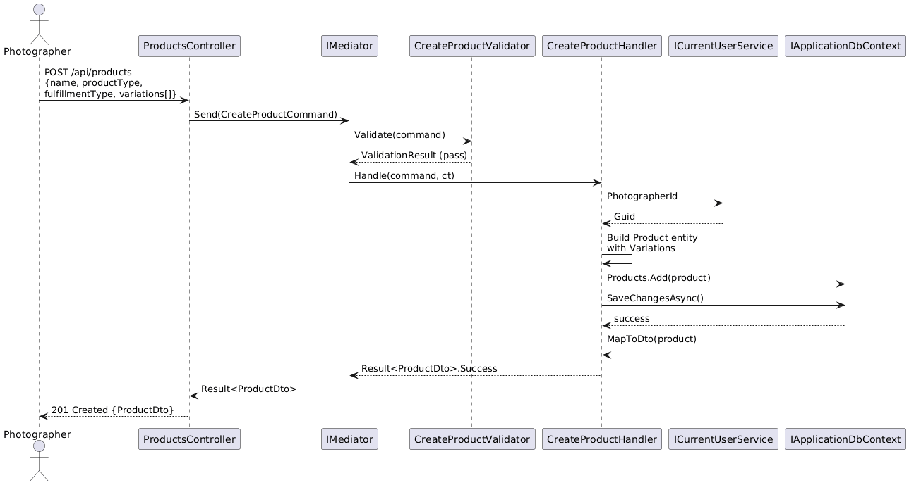
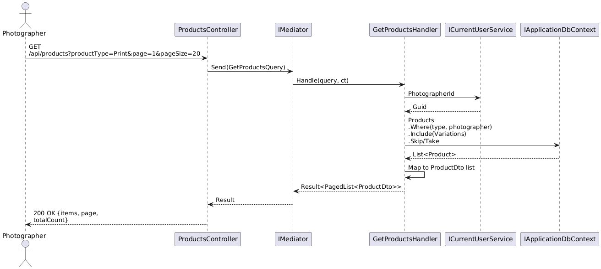
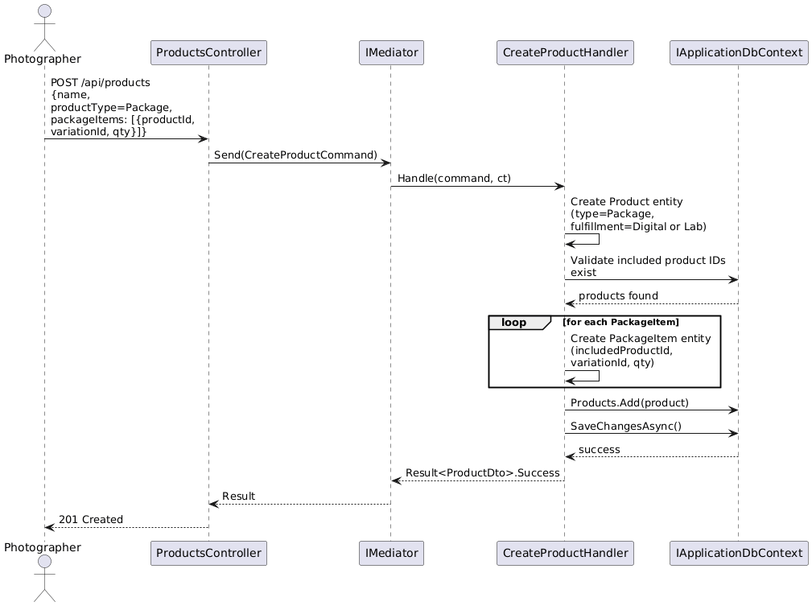
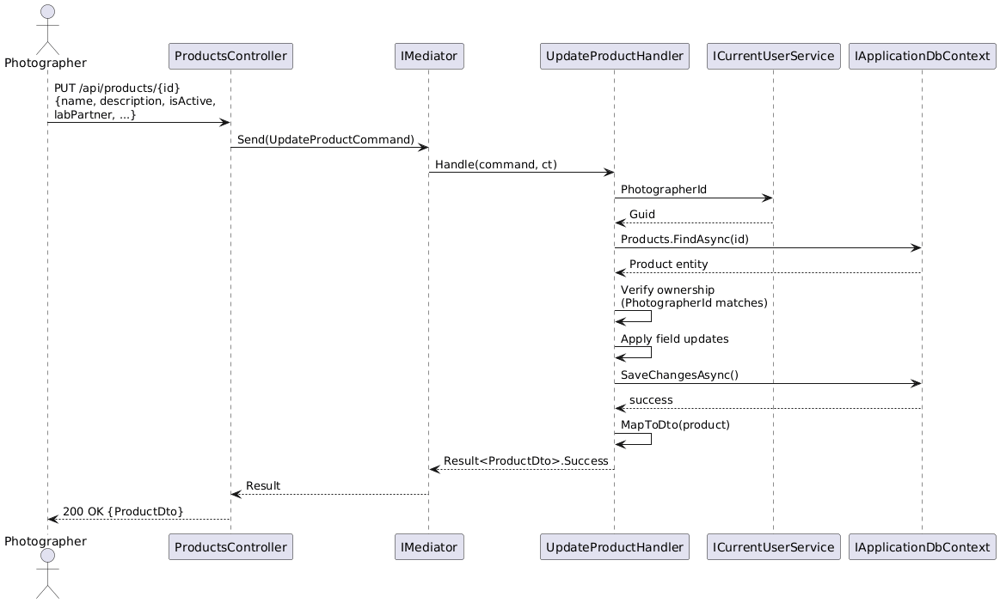
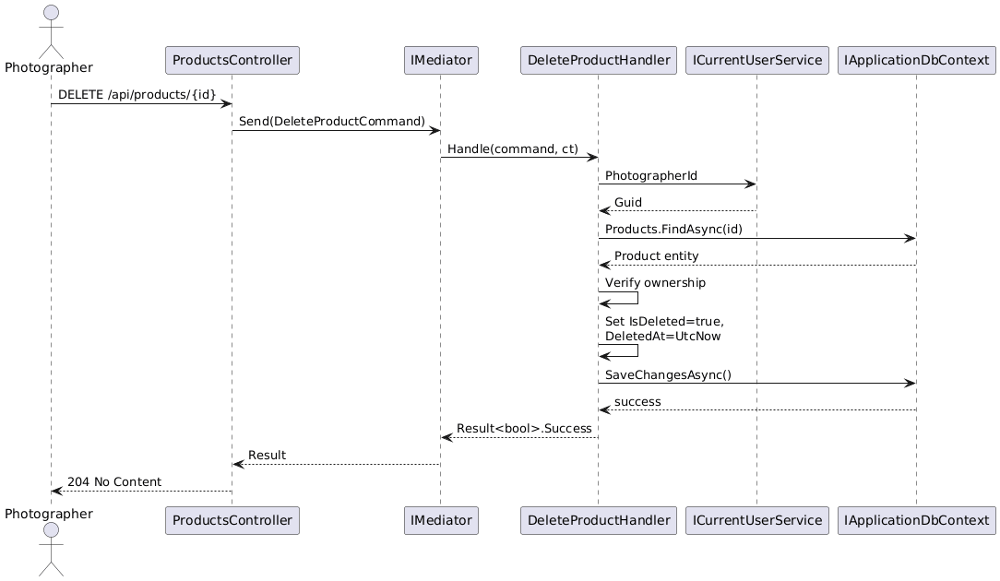
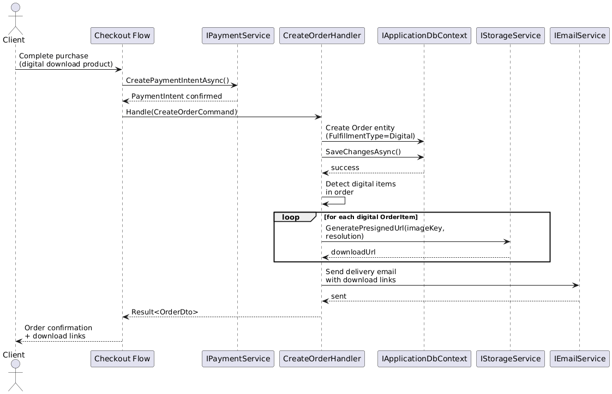

# F11 - Product Catalog Management

## Overview

Product Catalog Management is the foundation of the Anansi Online Store, enabling photographers to configure and sell a wide range of physical and digital products through their client galleries. The feature encompasses six distinct product categories: print products (photographic prints across multiple substrates including canvas, metal, wood, bamboo, mounted, framed, wall art, large format, square, and standouts), photo albums and books with extensive customization options, greeting cards with a built-in template designer, digital downloads with configurable resolutions and auto-delivery, bundled packages combining physical and digital items, and self-fulfilled custom products managed entirely by the photographer.

Each product type supports configurable size and variation options with independent pricing per variation. Print products include a photo overlay preview system that composites the client's selected image onto the product mockup, giving clients a realistic visualization before purchase. Albums and books expose hundreds of customization axes (cover type, paper stock, dimensions, page count) and leverage a bulk pricing markup tool so photographers can efficiently set margins across all variations. Greeting cards integrate a template-driven designer where clients choose from hundreds of pre-built layouts and customize them with their photos.

Digital downloads support both single-image and full-gallery delivery at photographer-defined resolutions, with automatic file delivery triggered upon payment confirmation. Packages allow photographers to bundle any combination of physical and digital products into a single purchasable item at a set price. Self-fulfilled products provide a lightweight mechanism for photographers to sell custom goods (e.g., USB drives, custom frames) where the platform notifies the photographer with order details and shipping address, and the photographer handles production and shipping independently.

**L2 Requirements:** STR-2.1.1, STR-2.1.2, STR-2.1.3, STR-2.1.4, STR-2.1.5, STR-2.1.6

---

## Components

### Domain Layer (Anansi.Domain)

**Product** (`Entities/Store/Product.cs`) -- The aggregate root for all store products. Holds the product name, description, type (from `ProductType` enum covering 17 substrate/product types), fulfillment type (Lab, SelfFulfilled, Digital), optional lab partner assignment, color correction toggle, photo overlay preview URL, and digital resolution options. Owns a collection of `ProductVariation` children and, for packages, a collection of `PackageItem` children.

**ProductVariation** (`Entities/Store/ProductVariation.cs`) -- Represents a specific size or configuration option within a product. Each variation carries its own SKU, lab cost (in cents), markup (in cents), final client-facing price (in cents), and a flag indicating whether the price was individually customized or set by a bulk operation. The three-tier pricing model (cost + markup = price) is central to the store's revenue mechanics.

**PackageItem** (`Entities/Store/PackageItem.cs`) -- A join entity linking a package-type `Product` to one or more included products and their optional variations, with a quantity. This enables photographers to compose bundles of prints, albums, and digital downloads into a single purchasable package.

**ProductType** (`Enums/ProductType.cs`) -- Enumerates all supported product categories: Print, MountedPrint, CanvasPrint, MetalPrint, WoodPrint, FramedPrint, WallArt, LargeFormat, SquarePrint, Standout, BambooPanel, Album, Book, GreetingCard, DigitalDownload, Package, SelfFulfilled.

**FulfillmentType** (`Enums/FulfillmentType.cs`) -- Distinguishes how a product is fulfilled: Lab (auto-sent to print lab), SelfFulfilled (photographer ships), Digital (auto-delivered file).

### Application Layer (Anansi.Application)

**CreateProduct** (`Features/Store/Commands/CreateProduct.cs`) -- Command/handler that creates a new product with optional inline variations. Validates product name, type, fulfillment type, and variation pricing. Returns a `ProductDto`.

**UpdateProduct** (`Features/Store/Commands/UpdateProduct.cs`) -- Command/handler that modifies an existing product's metadata (name, description, active status, lab settings, preview URL). Does not modify variations directly.

**DeleteProduct** (`Features/Store/Commands/DeleteProduct.cs`) -- Soft-deletes a product, setting `IsDeleted = true` and `DeletedAt` to the current UTC timestamp.

**GetProductsQuery / GetProductByIdQuery** (`Features/Store/Queries/`) -- Read-side queries returning paginated product lists (filterable by `ProductType`) and individual product details, respectively.

**ProductDto / ProductVariationDto / PackageItemDto** (`DTOs/Store/ProductDto.cs`) -- Data transfer objects carrying product data to the API layer. Includes request records for creation and update operations.

**IApplicationDbContext** (`Interfaces/IApplicationDbContext.cs`) -- Exposes `DbSet<Product>`, `DbSet<ProductVariation>`, and `DbSet<PackageItem>` for persistence operations.

### API Layer (Anansi.Api)

**ProductsController** (`Controllers/ProductsController.cs`) -- RESTful controller exposing CRUD endpoints under `api/products`. Includes `GET` (list with filter/pagination), `GET /{id}` (single), `POST` (create), `PUT /{id}` (update), `DELETE /{id}` (soft-delete), and `POST /bulk-markup` for batch pricing operations.

### Infrastructure Layer (Anansi.Infrastructure)

**ApplicationDbContext** -- EF Core DbContext implementing `IApplicationDbContext`. Configures Product, ProductVariation, and PackageItem entity mappings, including the self-referencing relationship on PackageItem (PackageProductId -> Product, IncludedProductId -> Product).

---

## Class Diagrams

### Domain -- Product Aggregate

### Application -- Commands, Queries, and DTOs

### API -- ProductsController

---

## Sequence Diagrams

### Create Product with Variations

### Get Products (Filtered & Paginated)

### Create Package (Bundle of Products)

### Update Product

### Delete Product (Soft Delete)

### Digital Download Auto-Delivery on Payment

