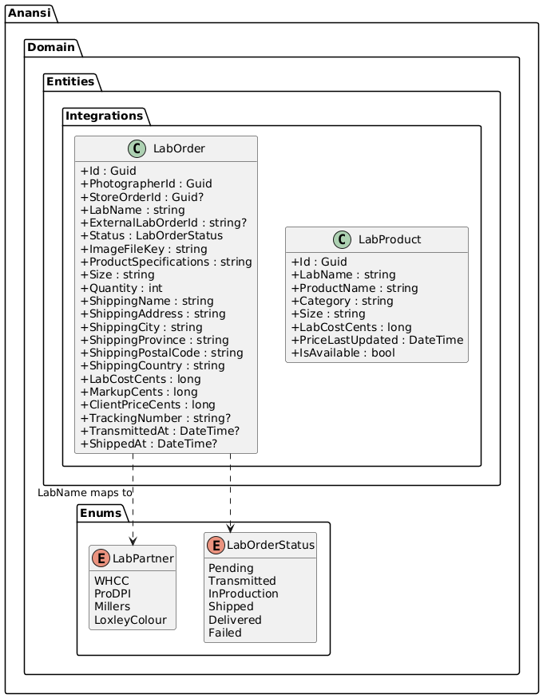
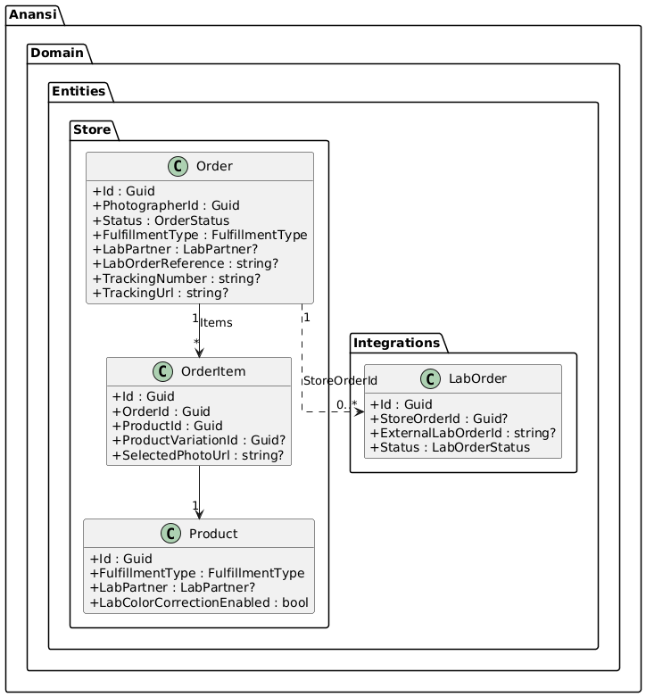
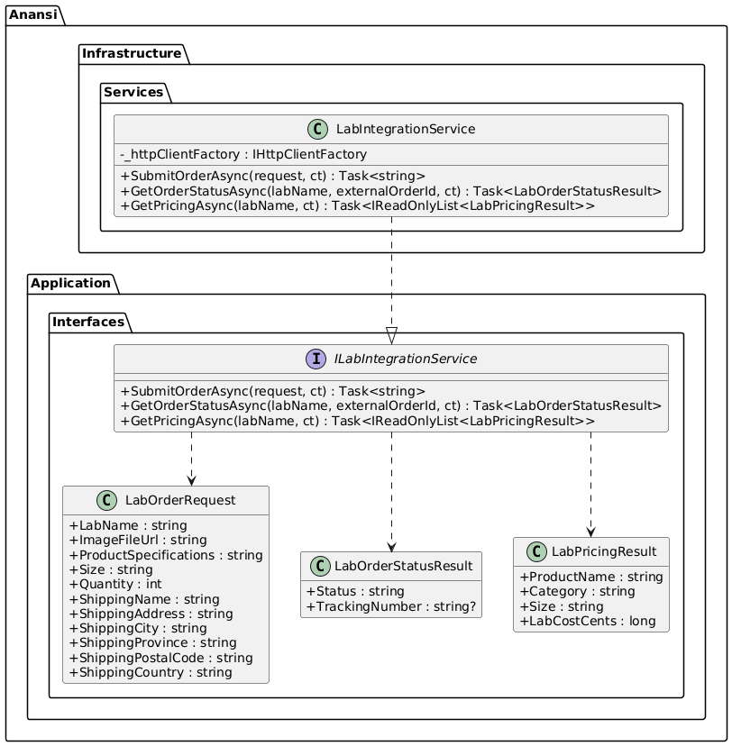
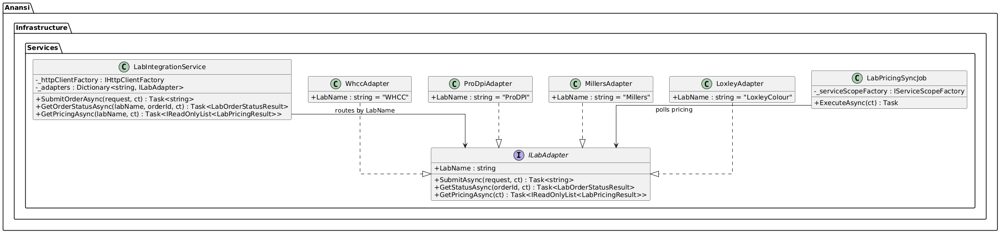
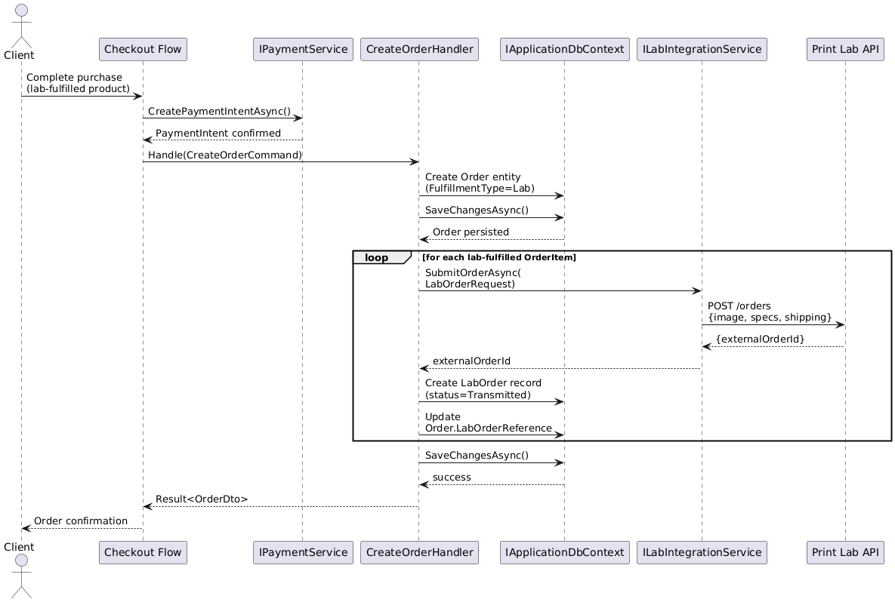
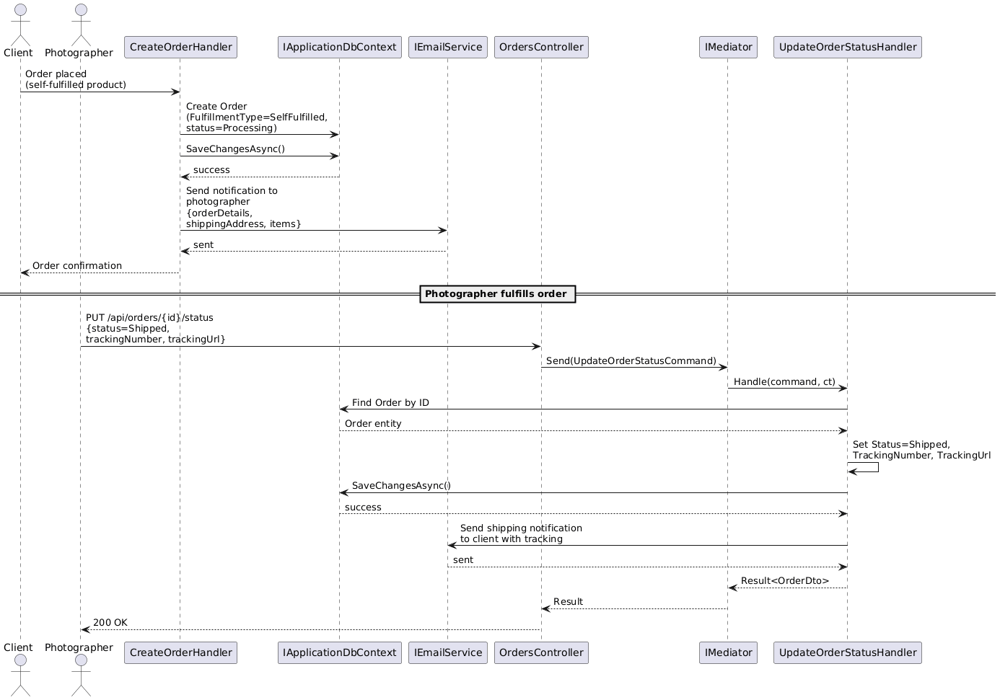
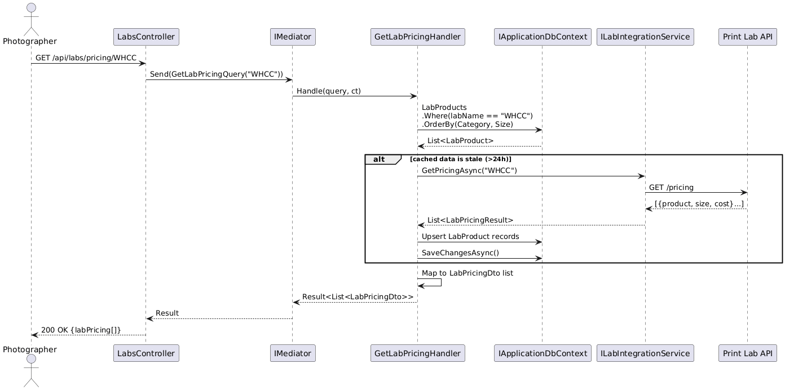
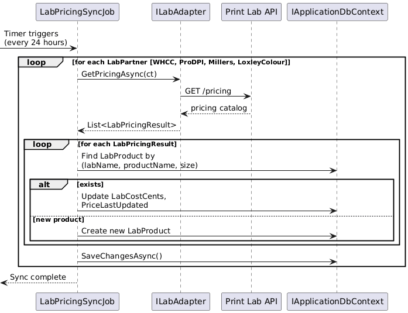
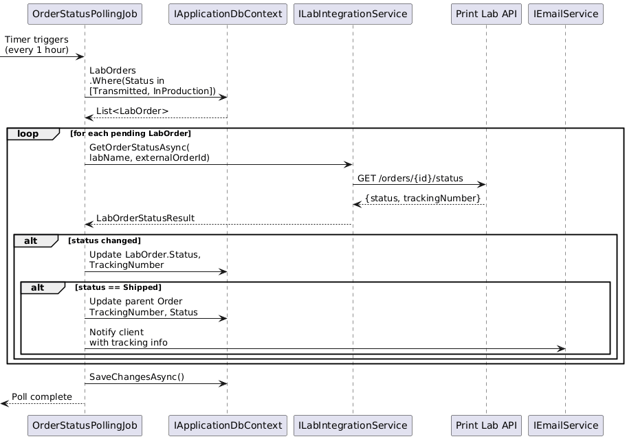

# F12 - Print Lab Integration & Fulfillment

## Overview

Print Lab Integration & Fulfillment handles the automated production and shipping pipeline that connects client orders to professional print laboratories. When a client purchases a lab-fulfilled product and payment is confirmed, the system automatically transmits the order to the photographer's configured print lab for production and direct-to-client shipping. All shipments are white-label, meaning no lab branding or platform branding appears on the packaging. The lab cost is deducted from the client payment, and the photographer retains the markup as profit. Lab color correction options are configurable on a per-product basis.

The platform integrates with a minimum of four lab partners: WHCC, ProDPI, Miller's, and Loxley Colour. Photographers select their preferred lab at the product or account level. Lab pricing (cost) is fetched via each lab's API and displayed alongside the photographer's markup and the final client-facing price, enabling transparent pricing management. Lab pricing auto-updates when labs change their rates, with the system periodically polling or receiving webhooks for pricing changes and storing the latest costs in the `LabProduct` catalog.

For products that are not lab-fulfilled, the self-fulfillment workflow applies: the photographer receives a notification containing order details and the client's shipping address, manually produces or procures the item, and marks the order as shipped with tracking information. The system supports both fulfillment models on a per-product basis, and a single order can contain a mix of lab-fulfilled and self-fulfilled items, each routed through its respective workflow.

**L2 Requirements:** STR-2.2.1, STR-2.2.2, STR-2.2.3, INT-8.2.1, INT-8.2.2

---

## Components

### Domain Layer (Anansi.Domain)

**LabOrder** (`Entities/Integrations/LabOrder.cs`) -- Represents a single order transmitted to a print lab. Tracks the lab name, external lab order ID, status (Pending, Transmitted, InProduction, Shipped, Delivered, Failed), image file reference, product specifications, size, quantity, full shipping address, cost breakdown (lab cost, markup, client price), tracking number, and timestamps for transmission and shipment.

**LabProduct** (`Entities/Integrations/LabProduct.cs`) -- A cached catalog entry representing a product available from a specific lab, with lab name, product name, category, size, cost in cents, availability flag, and a timestamp of when the price was last updated. Used for displaying lab pricing alongside photographer markup.

**LabPartner** (`Enums/LabPartner.cs`) -- Enumerates supported labs: WHCC, ProDPI, Millers, LoxleyColour.

**LabOrderStatus** (`Enums/LabOrderStatus.cs`) -- Tracks the lifecycle of a lab order: Pending, Transmitted, InProduction, Shipped, Delivered, Failed.

**Order** (`Entities/Store/Order.cs`) -- The store order entity, which includes `FulfillmentType`, `LabPartner`, and `LabOrderReference` fields linking it to the lab fulfillment pipeline.

### Application Layer (Anansi.Application)

**ILabIntegrationService** (`Interfaces/ILabIntegrationService.cs`) -- The abstraction over lab partner APIs. Exposes `SubmitOrderAsync` (transmit order to lab, returns external order ID), `GetOrderStatusAsync` (poll lab for current status and tracking), and `GetPricingAsync` (fetch current lab product catalog with costs).

**SubmitLabOrderCommand** (`Features/Integrations/Commands/`) -- Command/handler invoked when a paid order contains lab-fulfilled items. Builds a `LabOrderRequest`, calls `ILabIntegrationService.SubmitOrderAsync`, creates a `LabOrder` record, and updates the store `Order` with the lab reference.

**GetLabPricingQuery** (`Features/Integrations/Queries/`) -- Query that retrieves cached lab pricing from `LabProduct` records, optionally refreshing from the lab API if stale.

**IApplicationDbContext** -- Exposes `DbSet<LabOrder>` and `DbSet<LabProduct>` for persistence.

### API Layer (Anansi.Api)

**LabsController** (`Controllers/LabsController.cs`) -- Exposes `GET /api/labs/pricing/{labName}` (retrieve lab product catalog with costs) and `POST /api/labs/orders` (manually submit a lab order).

**OrdersController** (`Controllers/OrdersController.cs`) -- The `PUT /api/orders/{id}/status` endpoint allows photographers to update fulfillment status and add tracking info for self-fulfilled orders.

### Infrastructure Layer (Anansi.Infrastructure)

**LabIntegrationService** -- Concrete implementation of `ILabIntegrationService`. Contains adapter logic for each supported lab's API (WHCC, ProDPI, Miller's, Loxley Colour). Handles authentication, request/response mapping, and error handling per lab. Uses `HttpClient` with named clients for each lab.

**LabPricingSyncJob** -- A background hosted service (or Hangfire recurring job) that periodically polls each lab's pricing API and upserts `LabProduct` records, keeping cached pricing current (INT-8.2.2).

---

## Class Diagrams

### Domain -- Lab Integration Entities

### Domain -- Order-to-Lab Relationship

### Application -- Lab Integration Service Interface

### Infrastructure -- Lab Adapters

---

## Sequence Diagrams

### Automatic Lab Fulfillment on Payment

### Self-Fulfillment Workflow

### Fetch Lab Pricing

### Lab Pricing Auto-Sync (Background Job)

### Lab Order Status Polling

