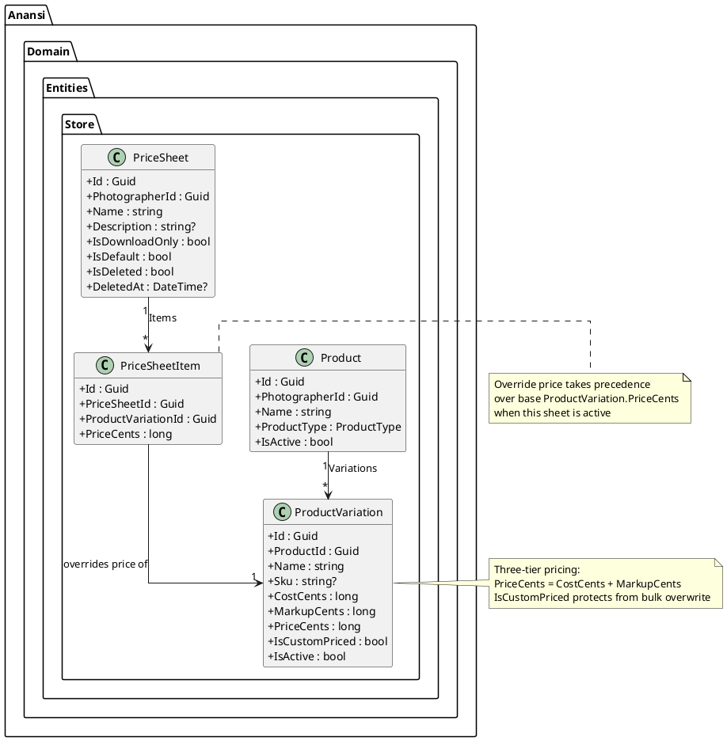
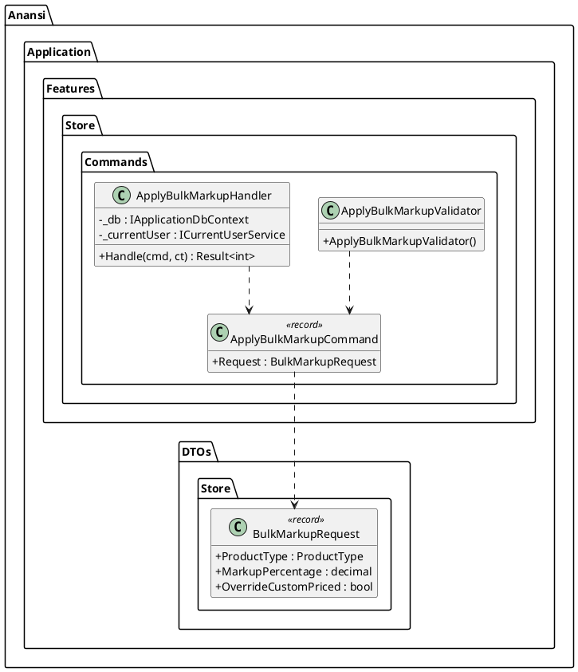
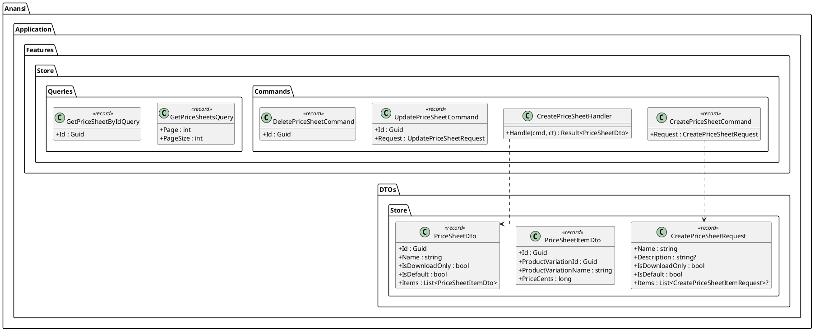
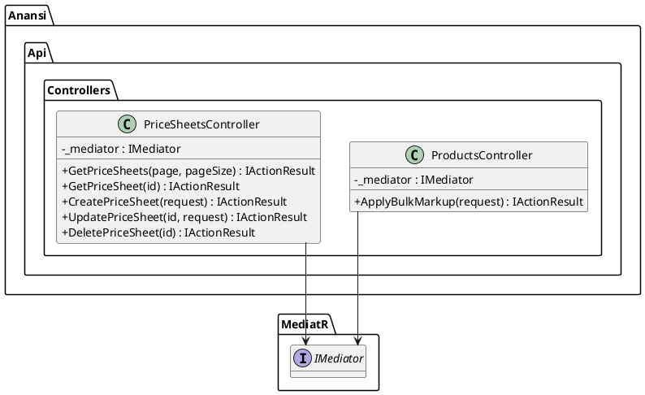
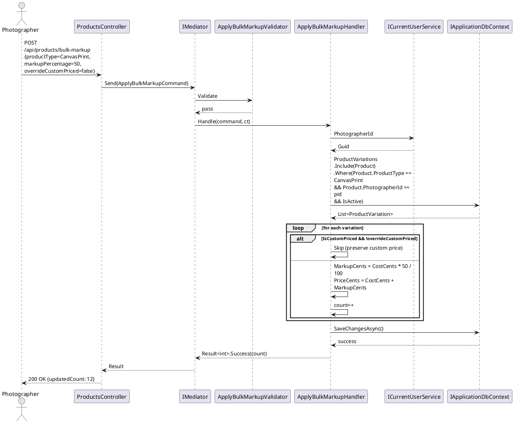
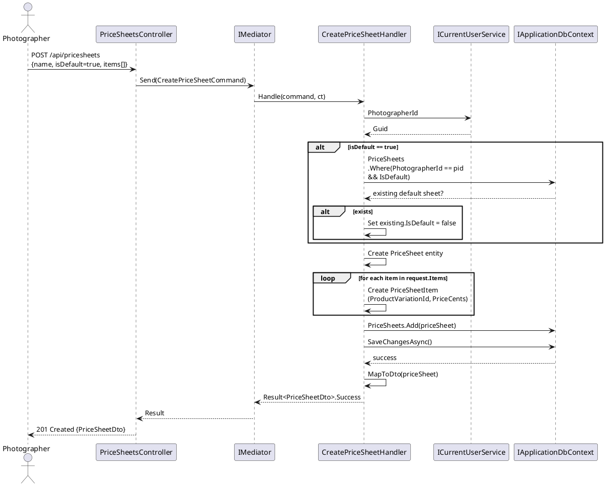
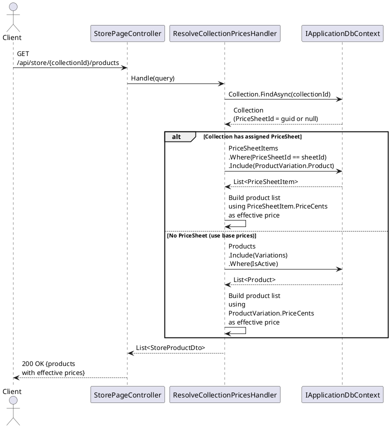
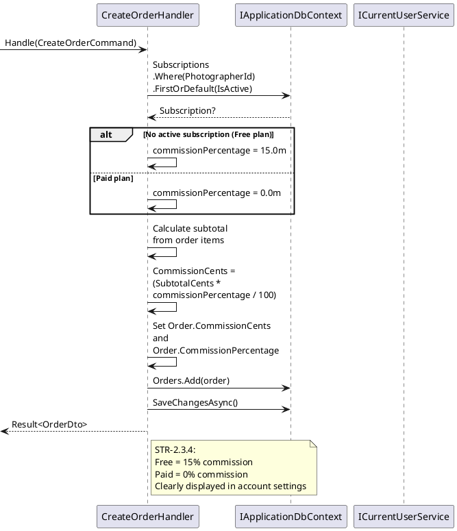
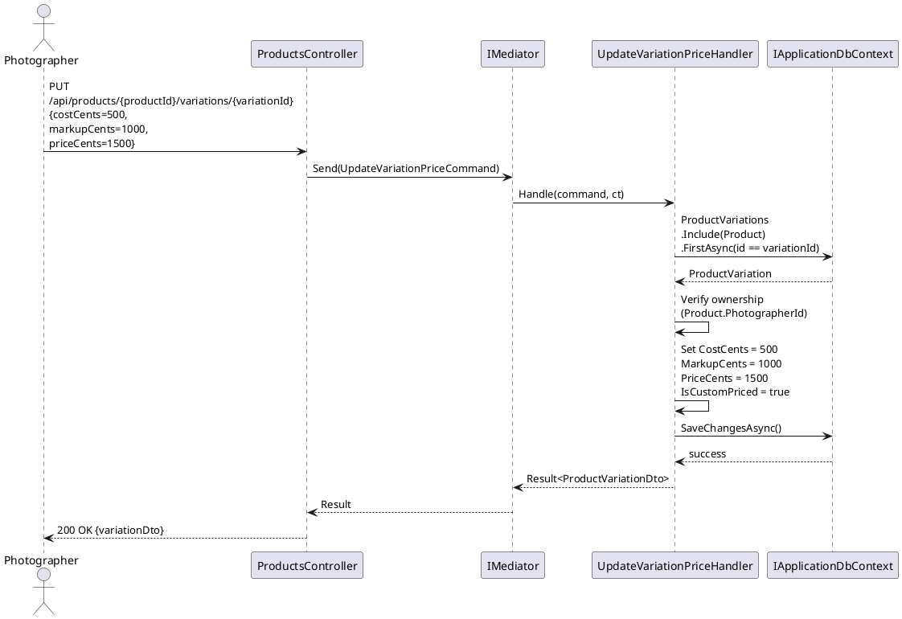

# F13 - Store Pricing & Price Sheets

## Overview

Store Pricing & Price Sheets provides photographers with a comprehensive pricing management system for their online store products. At the individual product level, each size and variation carries a three-tier pricing structure: cost (the lab price or base cost), markup (the photographer's profit margin), and final price (what the client pays, which equals cost plus markup). Both manual price entry and percentage-based markup are supported, giving photographers flexibility to set prices either as absolute amounts or relative to lab costs.

The bulk markup tool enables photographers to apply a percentage-based markup to an entire product category (e.g., all canvas prints) in a single operation. This is critical for efficiency when labs change their pricing or when a photographer wants to standardize margins. The bulk tool respects individually customized prices by default, requiring explicit confirmation before overriding them, preventing accidental loss of per-variation pricing decisions.

Price sheets add a layer of contextual pricing: photographers can create multiple named price sheets, each containing a set of product variations with override prices. Different price sheets can be assigned to different collections, allowing, for example, wedding collections to use premium pricing while mini-session collections use promotional rates. Download-only price sheets restrict available products to digital downloads only (no physical products). A default price sheet can be designated to auto-apply to newly created collections. The platform also enforces a commission structure: free-plan photographers pay 15% platform commission on all store sales, while all paid plans have 0% commission, clearly displayed in account settings.

**L2 Requirements:** STR-2.3.1, STR-2.3.2, STR-2.3.3, STR-2.3.4

---

## Components

### Domain Layer (Anansi.Domain)

**ProductVariation** (`Entities/Store/ProductVariation.cs`) -- The primary carrier of per-variation pricing. Contains `CostCents` (lab or base cost), `MarkupCents` (photographer profit), `PriceCents` (client-facing total), and `IsCustomPriced` flag that protects individually set prices from bulk overwrite.

**PriceSheet** (`Entities/Store/PriceSheet.cs`) -- A named pricing context assignable to collections. Has a photographer owner, name, description, `IsDownloadOnly` flag (restricting to digital products), and `IsDefault` flag (auto-assigned to new collections). Owns a collection of `PriceSheetItem` entries.

**PriceSheetItem** (`Entities/Store/PriceSheetItem.cs`) -- A junction entity linking a `PriceSheet` to a `ProductVariation` with an override price. When a collection uses a specific price sheet, the item prices from the sheet take precedence over the base variation prices.

**Product** (`Entities/Store/Product.cs`) -- The parent entity owning variations. The `ProductType` field is used as the category key for bulk markup operations.

### Application Layer (Anansi.Application)

**ApplyBulkMarkup** (`Features/Store/Commands/ApplyBulkMarkup.cs`) -- Command/handler that applies a percentage markup to all active variations of a given `ProductType` for the authenticated photographer. Accepts `MarkupPercentage` and `OverrideCustomPriced` flag. Computes `MarkupCents = CostCents * percentage / 100` and `PriceCents = CostCents + MarkupCents` for each variation. Returns the count of updated variations.

**CreatePriceSheet** (`Features/Store/Commands/CreatePriceSheet.cs`) -- Command/handler that creates a new price sheet with optional inline items. If `IsDefault` is true, ensures no other sheet is currently default (or unsets the previous default).

**UpdatePriceSheet** -- Modifies price sheet metadata (name, description, download-only, default). Handles default-uniqueness constraint.

**DeletePriceSheet** -- Soft-deletes a price sheet. Does not affect orders already placed under that sheet's pricing.

**AddPriceSheetItems / RemovePriceSheetItems** -- Manages the set of product variation overrides within a price sheet.

**GetPriceSheets / GetPriceSheetById** -- Queries returning price sheet data with their items, including resolved product and variation names.

**ProductDto / BulkMarkupRequest** (`DTOs/Store/ProductDto.cs`) -- Request record carrying `ProductType`, `MarkupPercentage`, and `OverrideCustomPriced`.

**PriceSheetDto / PriceSheetItemDto** (`DTOs/Store/PriceSheetDto.cs`) -- DTOs for price sheet CRUD operations.

### API Layer (Anansi.Api)

**ProductsController** (`Controllers/ProductsController.cs`) -- Exposes `POST /api/products/bulk-markup` for the bulk markup tool.

**PriceSheetsController** (`Controllers/PriceSheetsController.cs`) -- RESTful controller for CRUD operations on price sheets and their items.

### Infrastructure Layer (Anansi.Infrastructure)

**ApplicationDbContext** -- Configures `PriceSheet` and `PriceSheetItem` entity mappings, including the foreign key from `PriceSheetItem` to `ProductVariation` and the cascade behavior on price sheet deletion.

---

## Class Diagrams

### Domain -- Pricing Model

### Application -- Bulk Markup Command

### Application -- Price Sheet Commands & Queries

### API -- Controllers

---

## Sequence Diagrams

### Apply Bulk Markup to Product Category

### Create Price Sheet with Items

### Resolve Effective Price for Collection

### Commission Calculation on Order

### Set Individual Variation Price (Manual Override)

