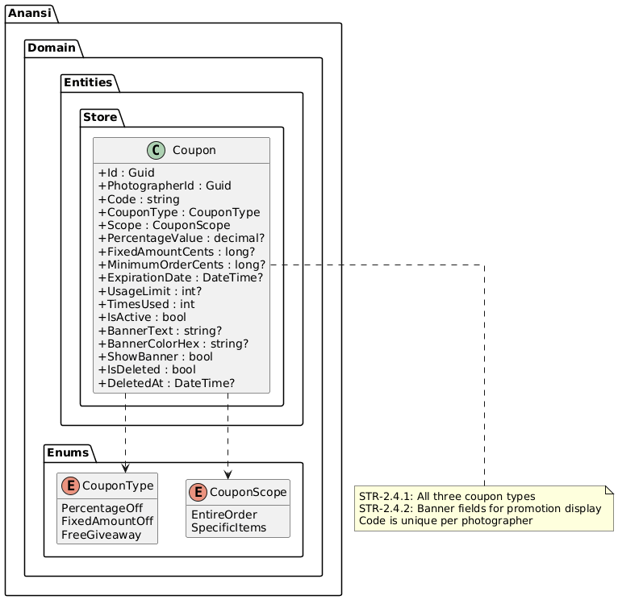
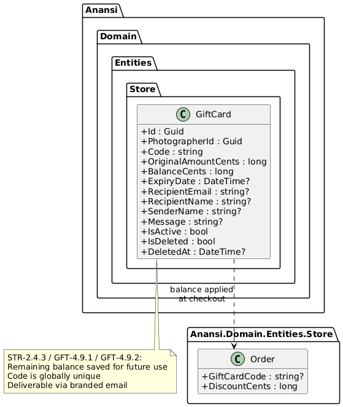
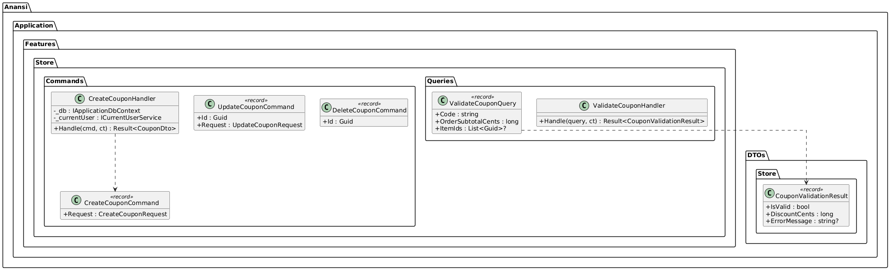
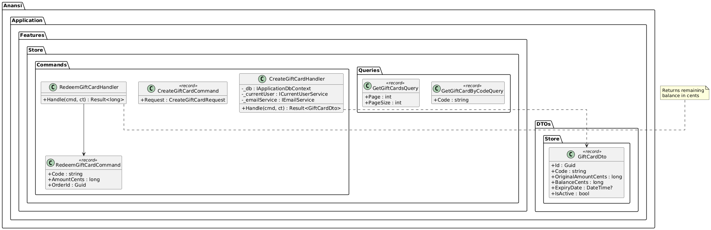
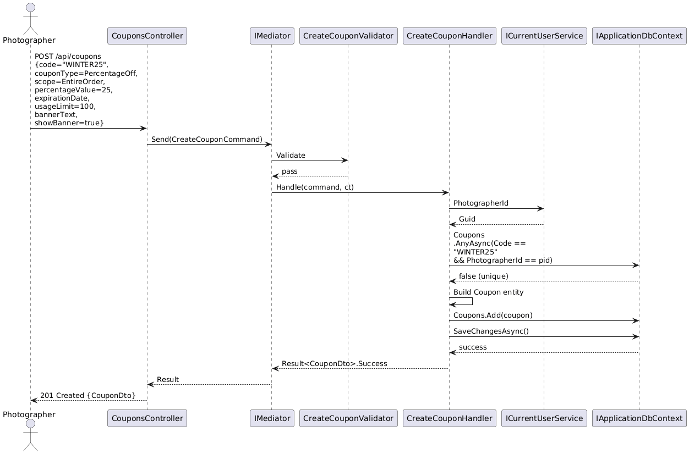
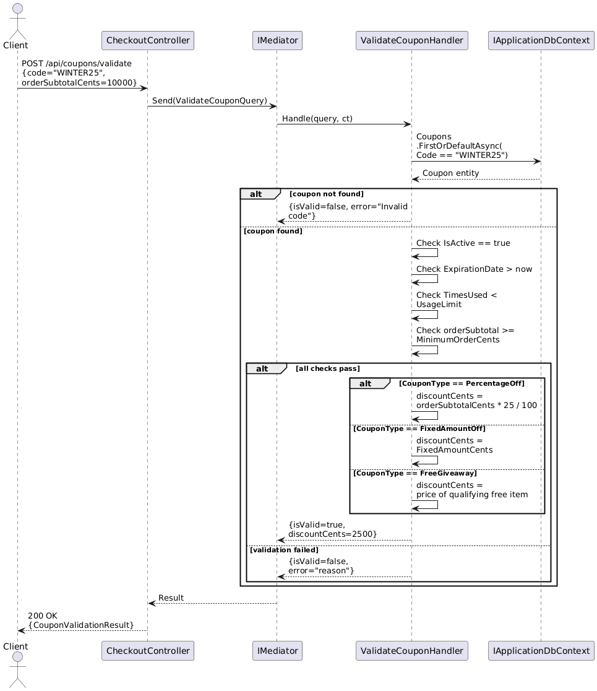
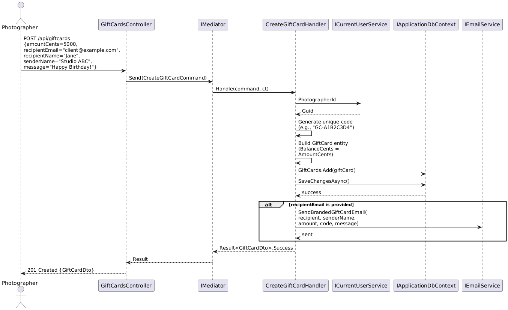
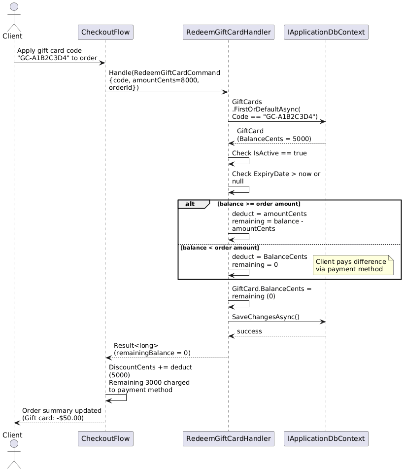
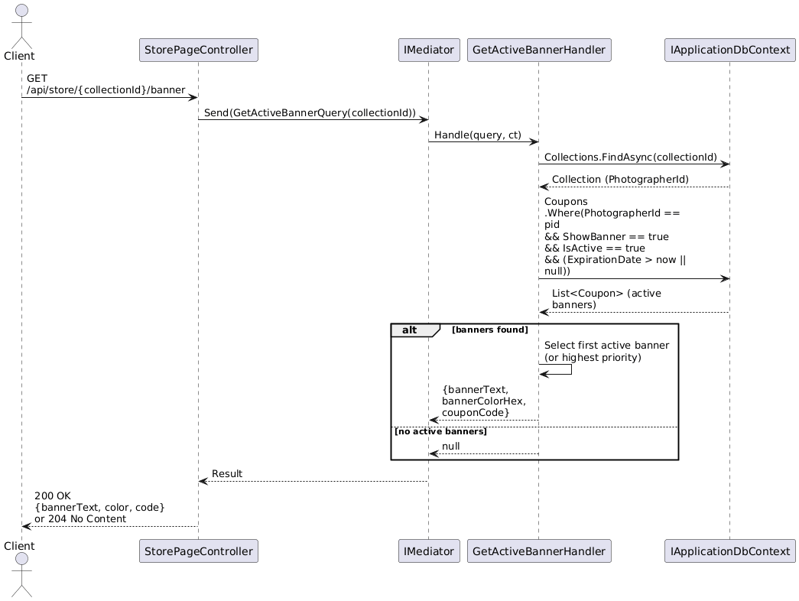

# F14 - Promotions & Gift Cards

## Overview

Promotions & Gift Cards enables photographers to drive sales and provide flexible payment options through two complementary mechanisms: coupon codes and gift cards. Coupon codes support three discount types -- percentage off, fixed dollar amount off, and free giveaway ("Buy X, Get Y Free") -- each applicable to either the entire order or specific items. Every coupon can be configured with an expiration date, a usage limit (maximum number of redemptions), and a minimum order threshold. Clients apply coupon codes during checkout, and the discount is calculated and displayed in the order summary before payment.

The promotional coupon banner system allows photographers to surface active promotions at the top of their gallery or store pages. The banner displays configurable text (e.g., "Use code HOLIDAY20 for 20% off!"), uses a photographer-defined background color, and can be toggled visible or hidden per coupon. This provides a passive promotional channel without requiring clients to already know a coupon code.

Gift cards offer a stored-value payment instrument. Photographers create gift cards with a custom dollar amount and optional expiration date. Cards are deliverable via branded email (containing recipient name, sender name, custom message, and the card code) or as a manual code the photographer shares directly. At checkout, clients enter a gift card code to apply the balance against the order total. If the gift card balance exceeds the order total, the remaining balance is preserved for future purchases. If the balance is less than the total, the client pays the difference via their selected payment method. Photographers can view all gift cards and their current balances through the management dashboard.

**L2 Requirements:** STR-2.4.1, STR-2.4.2, STR-2.4.3, GFT-4.9.1, GFT-4.9.2

---

## Components

### Domain Layer (Anansi.Domain)

**Coupon** (`Entities/Store/Coupon.cs`) -- Represents a discount coupon created by a photographer. Contains the coupon code (unique per photographer), type (`CouponType`: PercentageOff, FixedAmountOff, FreeGiveaway), scope (`CouponScope`: EntireOrder, SpecificItems), percentage value (for percentage-off type), fixed amount in cents (for fixed-amount-off type), minimum order threshold in cents, expiration date, usage limit, times-used counter, and active flag. Also carries banner configuration: banner text, banner color hex, and show-banner toggle.

**CouponType** (`Enums/CouponType.cs`) -- Enumerates discount mechanisms: PercentageOff, FixedAmountOff, FreeGiveaway.

**CouponScope** (`Enums/CouponScope.cs`) -- Defines applicability: EntireOrder (discount applies to full order total) or SpecificItems (discount applies only to qualifying items).

**GiftCard** (`Entities/Store/GiftCard.cs`) -- A stored-value payment instrument. Tracks the card code (unique), original amount in cents, remaining balance in cents, optional expiry date, recipient details (email, name), sender name, custom message, and active flag. Balance decrements on each redemption and persists for future use.

**Order** (`Entities/Store/Order.cs`) -- The order entity includes `CouponCode` and `GiftCardCode` fields capturing which promotions were applied, along with `DiscountCents` for the total discount amount.

### Application Layer (Anansi.Application)

**CreateCoupon** (`Features/Store/Commands/CreateCoupon.cs`) -- Command/handler that creates a new coupon. Validates code uniqueness per photographer, enum values, and conditional field requirements (percentage value required for PercentageOff, fixed amount for FixedAmountOff).

**UpdateCoupon** -- Modifies coupon active status, expiration, usage limit, and banner settings.

**DeleteCoupon** -- Soft-deletes a coupon.

**ValidateCoupon** -- Query that checks a coupon code's validity at checkout time: existence, active status, not expired, not exceeding usage limit, minimum order threshold met. Returns the computed discount amount.

**CreateGiftCard** (`Features/Store/Commands/CreateGiftCard.cs`) -- Command/handler that creates a gift card, generates a unique code, and optionally triggers branded email delivery.

**RedeemGiftCard** -- Command that applies a gift card balance to an order. Deducts the used amount from `BalanceCents`, recording the transaction. If balance reaches zero, marks the card as fully redeemed.

**GetGiftCards / GetGiftCardByCode** -- Queries for listing gift cards and looking up a card by code.

**CouponDto / CreateCouponRequest / UpdateCouponRequest** (`DTOs/Store/CouponDto.cs`) -- DTOs for coupon CRUD.

**GiftCardDto / CreateGiftCardRequest** (`DTOs/Store/GiftCardDto.cs`) -- DTOs for gift card operations.

### API Layer (Anansi.Api)

**CouponsController** (`Controllers/CouponsController.cs`) -- RESTful endpoints for coupon management: CRUD operations plus a `POST /api/coupons/validate` endpoint for checkout-time validation.

**GiftCardsController** (`Controllers/GiftCardsController.cs`) -- Endpoints for gift card creation, listing, and balance lookup.

### Infrastructure Layer (Anansi.Infrastructure)

**ApplicationDbContext** -- Configures Coupon and GiftCard entity mappings, including unique index on (PhotographerId, Code) for coupons and unique index on Code for gift cards.

**IEmailService** -- Used to send branded gift card delivery emails containing the card code, amount, sender message, and redemption instructions.

---

## Class Diagrams

### Domain -- Coupon Entity

### Domain -- Gift Card Entity

### Application -- Coupon Commands & Validation

### Application -- Gift Card Commands

---

## Sequence Diagrams

### Create Coupon

### Validate Coupon at Checkout

### Create and Deliver Gift Card via Email

### Redeem Gift Card at Checkout

### Display Coupon Banner on Gallery/Store

