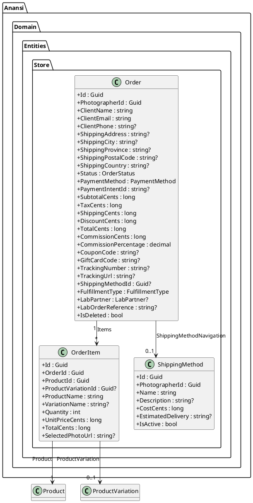
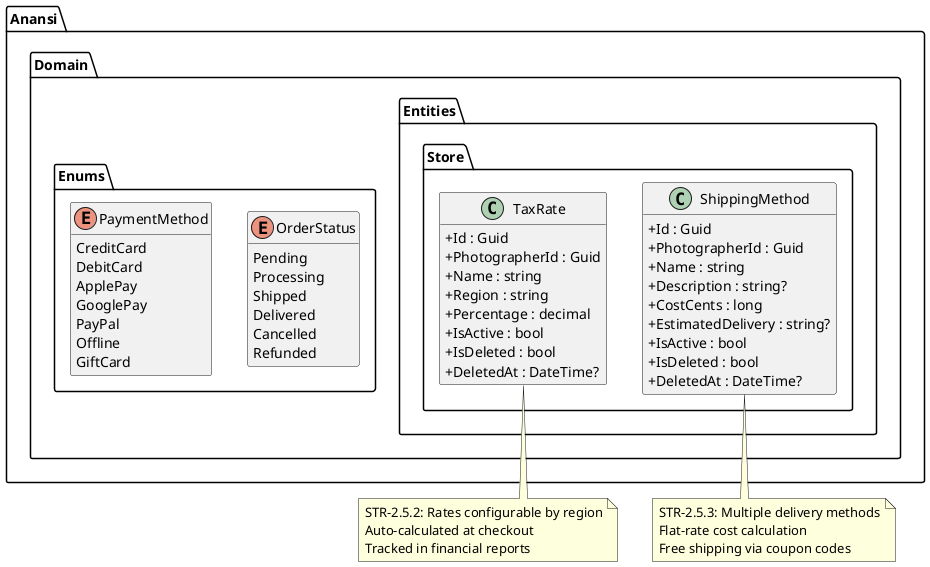
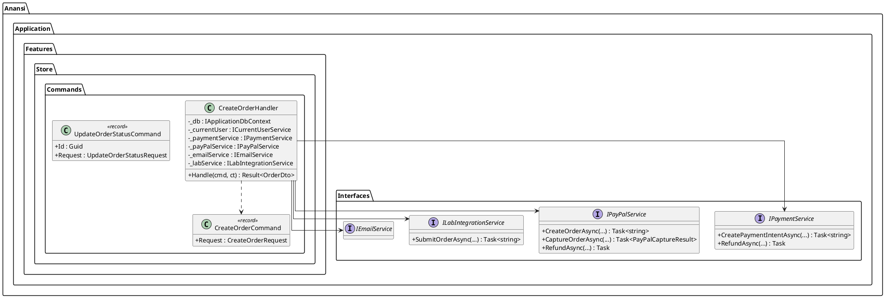
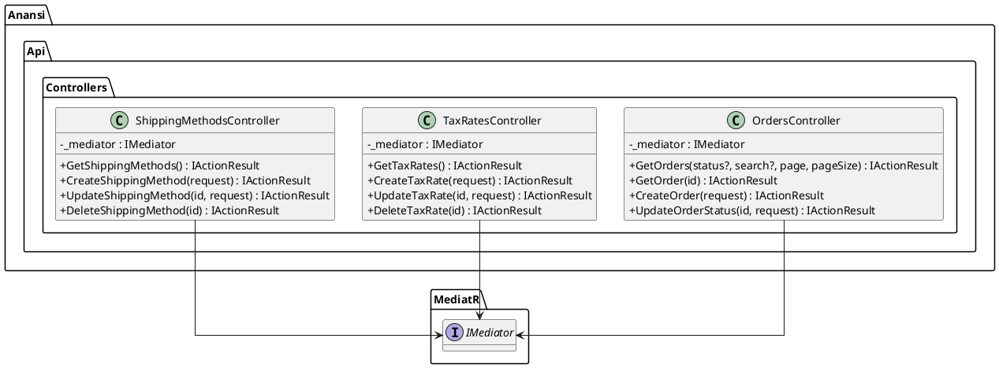
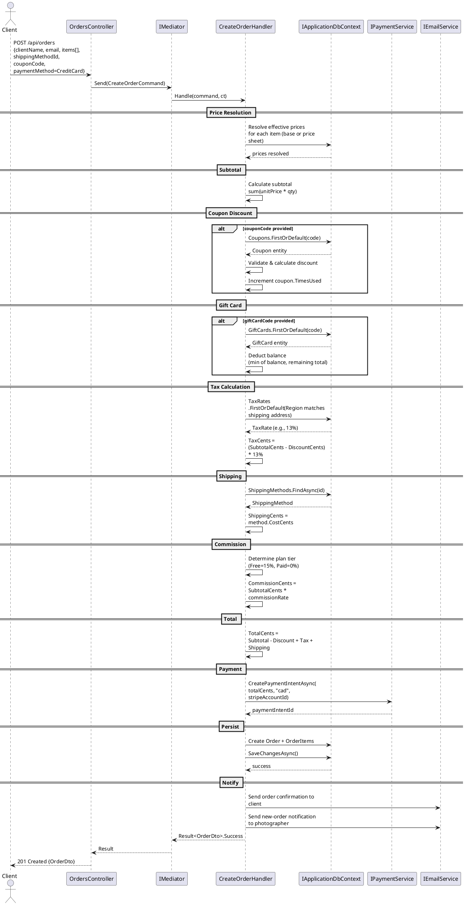
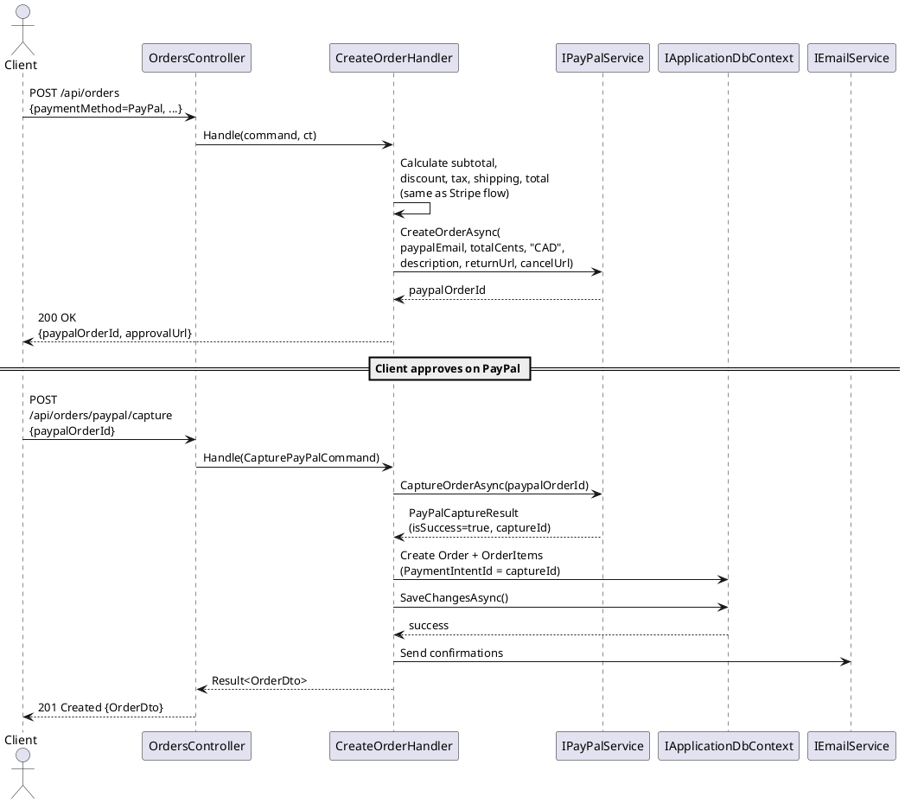
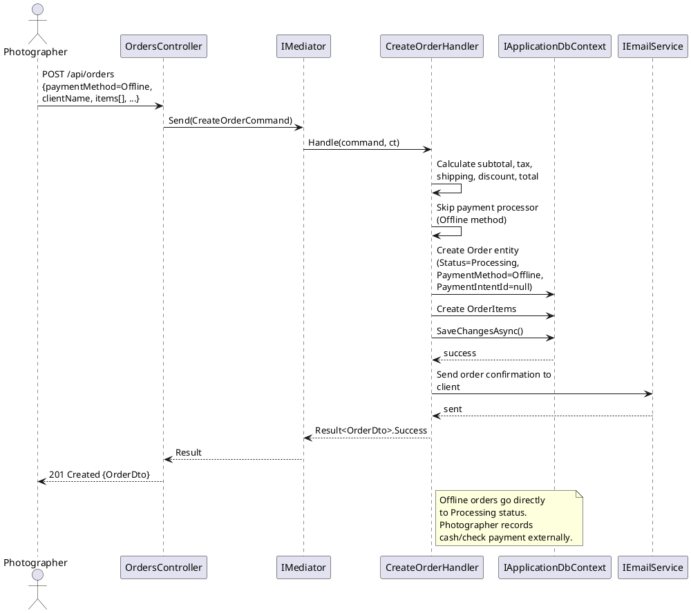
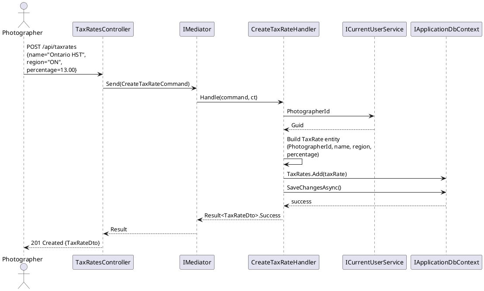
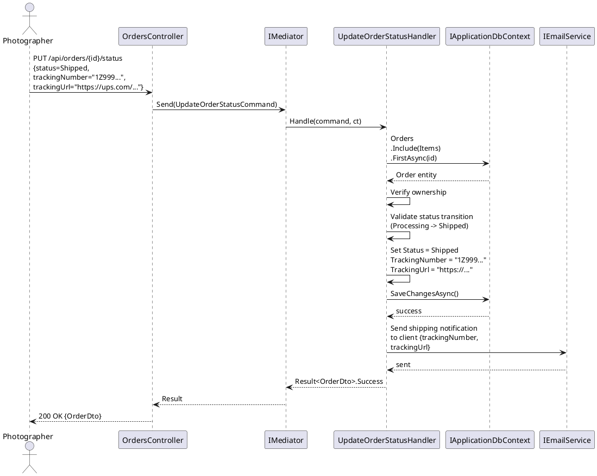
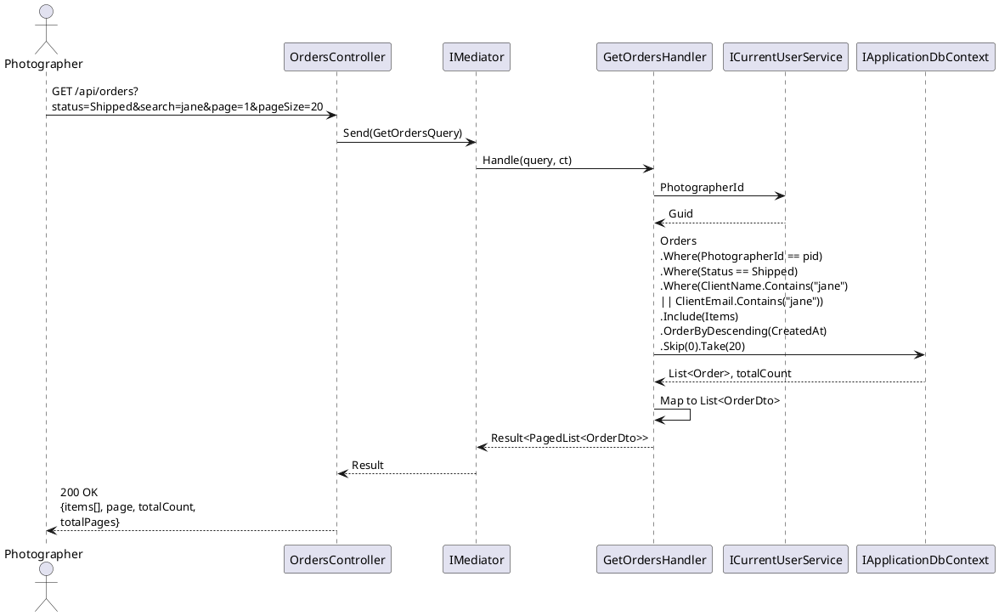

# F15 - Store Checkout & Orders

## Overview

Store Checkout & Orders is the transactional core of the Anansi Online Store, handling the complete purchase lifecycle from cart submission through payment processing, tax and shipping calculation, discount application, order creation, fulfillment routing, and ongoing order management. The checkout flow accepts multiple payment methods -- credit/debit cards, Apple Pay, Google Pay, PayPal, and offline payments -- with Stripe as the primary payment processor. The system creates a Stripe PaymentIntent (or PayPal order) based on the chosen method, applies any coupon or gift card discounts, calculates taxes and shipping, and upon successful payment confirmation, persists the order and routes items to the appropriate fulfillment channel.

Tax configuration allows photographers to define tax rates by region or jurisdiction (e.g., state, province, country). During checkout, the system determines the applicable tax rate based on the client's shipping address and applies it to the taxable order subtotal. Tax amounts are tracked per order and flow into financial reports. Shipping configuration supports multiple delivery methods (standard, express, etc.) with flat-rate costs and estimated delivery windows. Shipping costs are calculated at checkout based on the selected method. Free shipping can be achieved through coupon codes.

Order management provides photographers with a comprehensive dashboard to view order details, payment status, fulfillment status, and tracking information. Orders are searchable by client name or email and filterable by status. Real-time notifications alert photographers to new orders via in-app notifications and optionally email. The order status lifecycle flows from Pending through Processing, Shipped, Delivered, with branching paths for Cancelled and Refunded states. For lab-fulfilled orders, status updates propagate from the lab integration layer; for self-fulfilled orders, the photographer manually updates status and adds tracking information.

**L2 Requirements:** STR-2.5.1, STR-2.5.2, STR-2.5.3, STR-2.5.4

---

## Components

### Domain Layer (Anansi.Domain)

**Order** (`Entities/Store/Order.cs`) -- The aggregate root for store orders. Contains client contact info, full shipping address, order status, payment method, Stripe payment intent ID, financial breakdown (subtotal, tax, shipping, discount, total, commission), applied coupon and gift card codes, tracking info, shipping method reference, fulfillment type, and lab partner. Owns a collection of `OrderItem` children.

**OrderItem** (`Entities/Store/OrderItem.cs`) -- A line item in an order, referencing the purchased product and optional variation. Captures the product name, variation name, quantity, unit price, total price (all in cents at time of purchase), and the selected photo URL for print products.

**TaxRate** (`Entities/Store/TaxRate.cs`) -- A per-region tax rate configured by the photographer. Contains the region identifier (state, province, country code), tax percentage, name, and active flag.

**ShippingMethod** (`Entities/Store/ShippingMethod.cs`) -- A shipping option with name, description, flat-rate cost in cents, estimated delivery timeframe, and active flag.

**OrderStatus** (`Enums/OrderStatus.cs`) -- Lifecycle states: Pending, Processing, Shipped, Delivered, Cancelled, Refunded.

**PaymentMethod** (`Enums/PaymentMethod.cs`) -- Accepted payment methods: CreditCard, DebitCard, ApplePay, GooglePay, PayPal, BankTransfer, Klarna, Affirm, TapToPay, Offline, GiftCard.

### Application Layer (Anansi.Application)

**CreateOrder** -- The primary checkout command/handler. Validates the cart items, resolves effective prices (base or price-sheet override), calculates subtotal, applies coupon discount, applies gift card balance, looks up the applicable tax rate by shipping region, adds shipping cost, computes commission (15% free plan, 0% paid), creates the Order and OrderItems, processes payment via `IPaymentService` or `IPayPalService`, and routes to fulfillment (lab submission or photographer notification).

**UpdateOrderStatus** -- Allows photographers to update order status and add tracking information. Used for self-fulfillment workflow and manual corrections.

**GetOrders** -- Paginated query with filtering by `OrderStatus` and text search across client name and email.

**GetOrderById** -- Single-order detail query including all line items.

**CreateTaxRate / UpdateTaxRate / DeleteTaxRate** -- CRUD commands for managing per-region tax rates.

**CreateShippingMethod / UpdateShippingMethod / DeleteShippingMethod** -- CRUD commands for managing shipping options.

**IPaymentService** (`Interfaces/IPaymentService.cs`) -- Stripe abstraction exposing `CreatePaymentIntentAsync`, `CreateCheckoutSessionAsync`, `RefundAsync`, and `CreateConnectedAccountAsync`.

**IPayPalService** (`Interfaces/IPayPalService.cs`) -- PayPal abstraction exposing `CreateOrderAsync`, `CaptureOrderAsync`, and `RefundAsync`.

**IEmailService** (`Interfaces/IEmailService.cs`) -- Used to send order confirmation emails to clients and new-order notifications to photographers.

### API Layer (Anansi.Api)

**OrdersController** (`Controllers/OrdersController.cs`) -- Exposes `GET /api/orders` (list with filter/search/pagination), `GET /api/orders/{id}` (detail), `POST /api/orders` (checkout), and `PUT /api/orders/{id}/status` (update status/tracking).

**TaxRatesController** (`Controllers/TaxRatesController.cs`) -- CRUD endpoints for tax rate management.

**ShippingMethodsController** (`Controllers/ShippingMethodsController.cs`) -- CRUD endpoints for shipping method management.

### Infrastructure Layer (Anansi.Infrastructure)

**StripePaymentService** -- Concrete implementation of `IPaymentService` using the Stripe .NET SDK. Handles payment intent creation, checkout session setup, and refund processing against the photographer's Stripe Connected Account.

**PayPalService** -- Concrete implementation of `IPayPalService` using PayPal's REST API.

**ApplicationDbContext** -- Configures Order, OrderItem, TaxRate, and ShippingMethod entity mappings, including the Order -> ShippingMethod navigation and cascade delete behavior for order items.

---

## Class Diagrams

### Domain -- Order Aggregate

### Domain -- Tax & Shipping Configuration

### Application -- Checkout Command & Payment Interfaces

### API -- Store Controllers

---

## Sequence Diagrams

### Complete Checkout Flow (Stripe)

### Checkout with PayPal

### Offline Payment Recording

### Tax Rate Configuration

### Order Status Update with Tracking

### Search and Filter Orders

