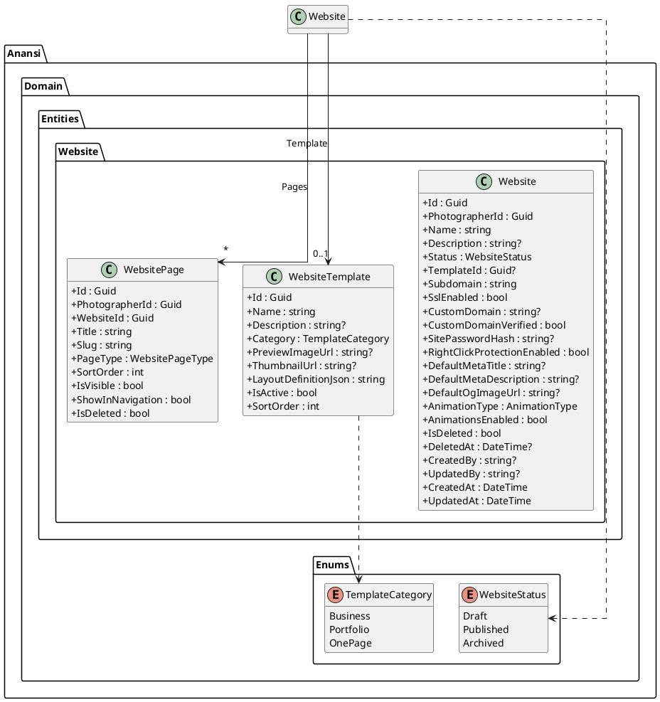
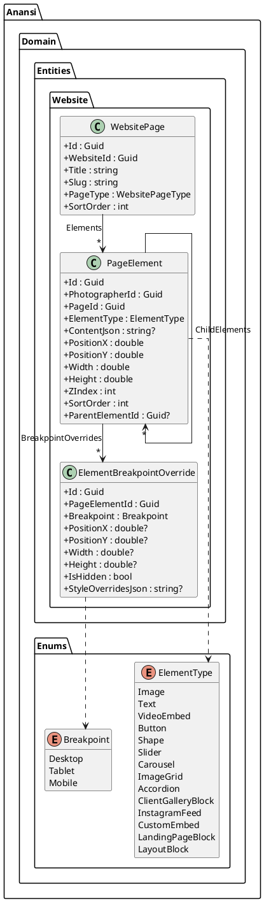
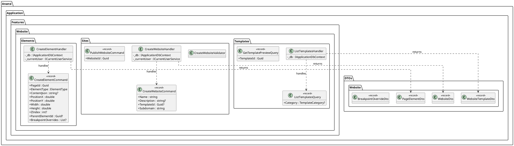
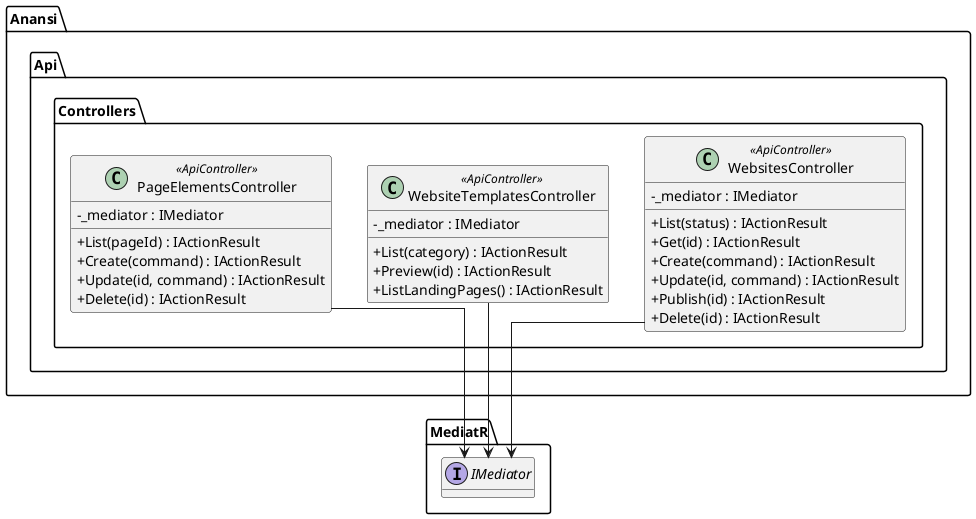
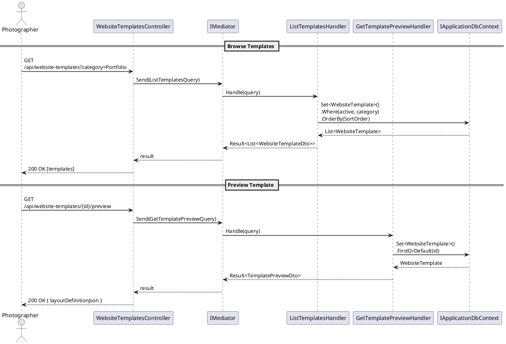
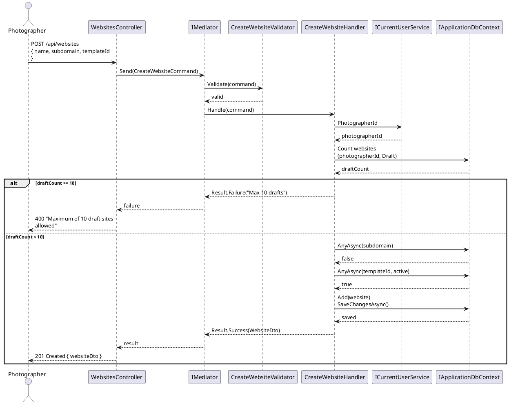
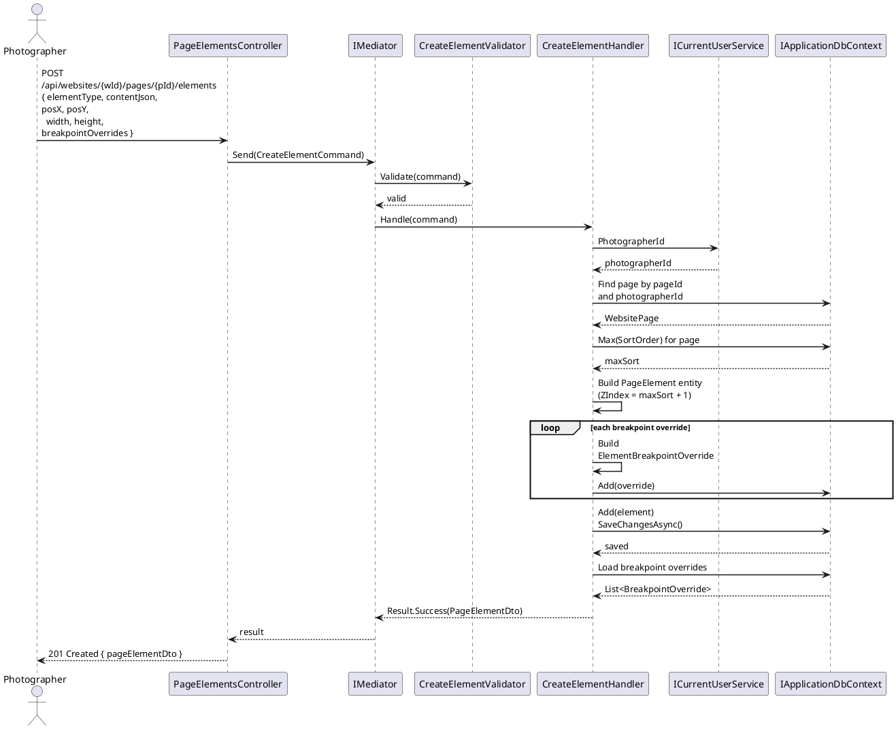
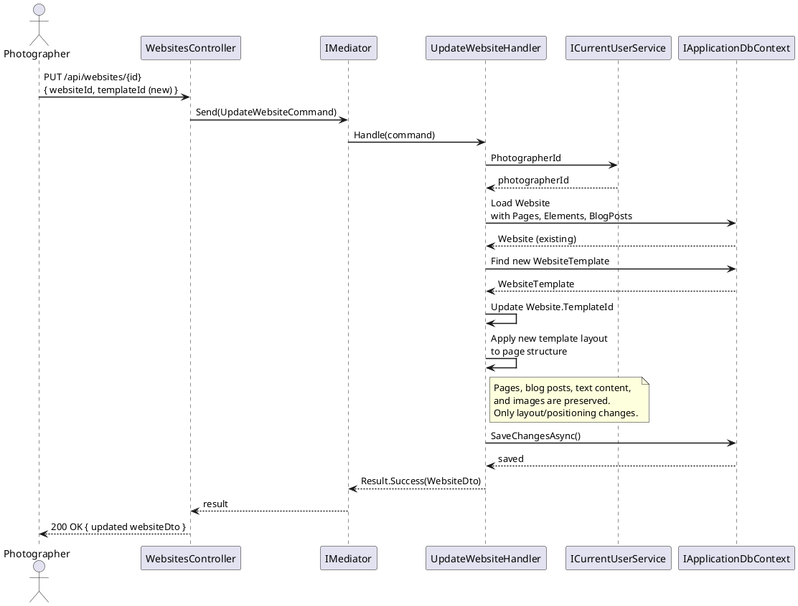
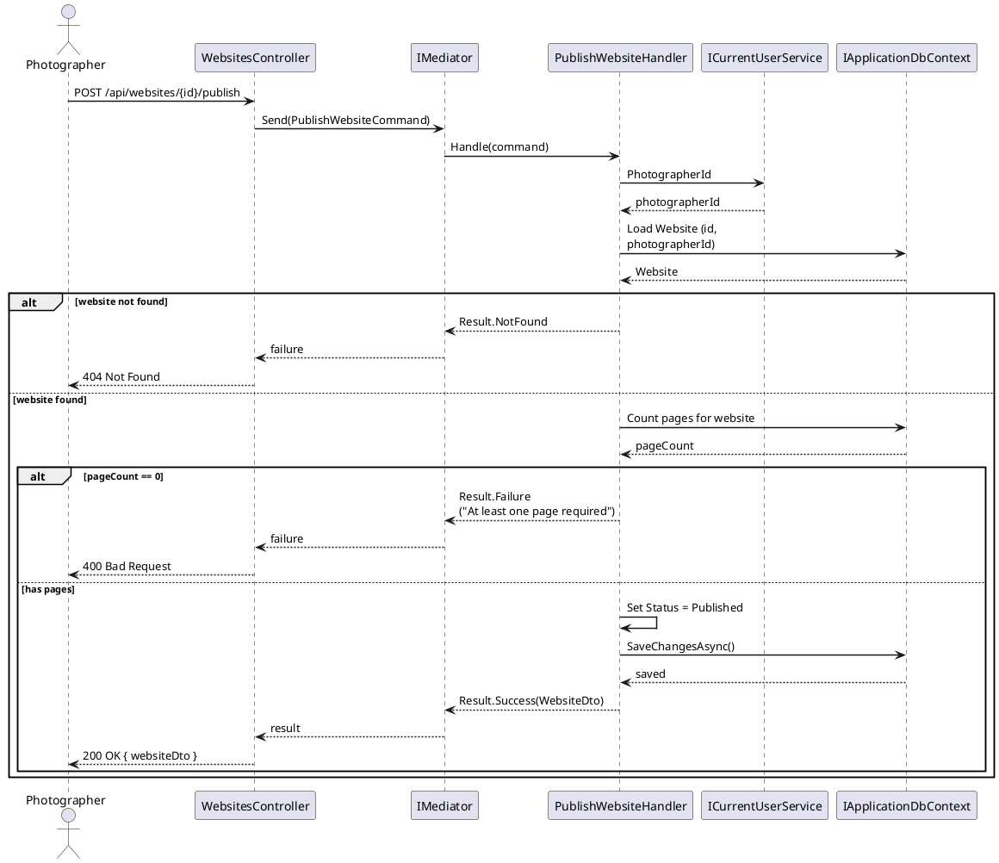

# F16 - Website Builder Core

## Overview

The Website Builder Core feature provides the foundational building blocks for photographers to create professional websites on the Anansi platform. It encompasses three major subsystems: the Template Library, the Flex Editor, and Draft Sites management.

The Template Library (WEB-3.1.1) offers at least 8 professionally designed templates organized into three categories -- business, portfolio, and one-page -- each previewable before selection. Template switching preserves all existing content (text, images, pages, blog posts), allowing photographers to experiment freely without data loss. Templates define a default layout via a JSON definition that the Flex Editor interprets and renders.

The Flex Editor (WEB-3.1.2) is a drag-and-drop visual editor supporting element addition, removal, resizing, and repositioning. It ships with 100+ ready-made layout blocks and blank blocks for custom layouts. Supported element types include images, text, video embeds, buttons, shapes, sliders, carousels, image grids, and accordions. Alignment guides, grid snapping, and layer management (z-index control) enable precise layout. The editor supports desktop, tablet, and mobile breakpoints with per-breakpoint customization stored as overrides. Draft Sites (WEB-3.1.3) allow photographers to maintain up to 10 simultaneous, fully independent draft websites, any of which can be published to become the live site.

## Components

### Domain Layer

**Website** (`Anansi.Domain.Entities.Website.Website`) -- The root aggregate for a photographer's website. Holds references to the selected template, typography/design settings, hosting configuration, SEO defaults, and analytics integration. Implements `ITenantEntity`, `ISoftDeletable`, and `IAuditableEntity`. Status tracks the site lifecycle via the `WebsiteStatus` enum (Draft, Published, Archived).

**WebsiteTemplate** (`Anansi.Domain.Entities.Website.WebsiteTemplate`) -- Represents a professionally designed template. Contains a `LayoutDefinitionJson` field storing the full structural definition (sections, blocks, default element placements) that the Flex Editor loads when a photographer selects the template. Categorized via `TemplateCategory` enum (Business, Portfolio, OnePage).

**PageElement** (`Anansi.Domain.Entities.Website.PageElement`) -- Represents a single draggable element within a page. Stores position (X, Y), dimensions (Width, Height), z-index for layering, and a `ContentJson` blob for element-specific data. The `ElementType` enum distinguishes between Image, Text, VideoEmbed, Button, Shape, Slider, Carousel, ImageGrid, Accordion, and layout-level types. Supports hierarchical nesting via `ParentElementId` for composite layouts.

**ElementBreakpointOverride** (`Anansi.Domain.Entities.Website.ElementBreakpointOverride`) -- Stores per-breakpoint customizations for a `PageElement`. The `Breakpoint` enum covers Desktop, Tablet, and Mobile. Each override can adjust position, dimensions, visibility, and arbitrary style properties via `StyleOverridesJson`.

**WebsitePage** (`Anansi.Domain.Entities.Website.WebsitePage`) -- A page within a website that contains a collection of `PageElement` entities. Each page has a type, slug, sort order, and navigation visibility settings.

### Application Layer

**ListTemplatesQuery / ListTemplatesHandler** -- Returns all active templates with optional `TemplateCategory` filter. No authentication required (templates are public catalog data).

**GetTemplatePreviewQuery / GetTemplatePreviewHandler** -- Returns the full layout definition JSON for a single template, enabling the front-end to render a live preview.

**CreateWebsiteCommand / CreateWebsiteHandler** -- Creates a new draft website. Validates the 10-draft limit per photographer, checks subdomain uniqueness, and optionally links a template. Returns `WebsiteDto`.

**UpdateWebsiteCommand / UpdateWebsiteHandler** -- Updates website properties including template switching. When `TemplateId` changes, the handler applies the new template's layout definition while preserving existing page content and blog posts.

**PublishWebsiteCommand / PublishWebsiteHandler** -- Transitions a draft website to Published status. Validates the site has at least one page and a valid subdomain.

**DeleteWebsiteCommand / DeleteWebsiteHandler** -- Soft-deletes a website and cascades to pages and elements.

**ListWebsitesQuery / ListWebsitesHandler** -- Returns all websites for the current photographer with optional status filter.

**GetWebsiteQuery / GetWebsiteHandler** -- Returns a single website with full detail.

**CreateElementCommand / CreateElementHandler** -- Adds a new element to a page with position, size, z-index, content, and optional breakpoint overrides.

**UpdateElementCommand / UpdateElementHandler** -- Updates element properties (position, size, content, z-index) and breakpoint overrides.

**DeleteElementCommand / DeleteElementHandler** -- Removes an element and its breakpoint overrides. Cascades to child elements.

**ListElementsQuery / ListElementsHandler** -- Returns all elements for a page, ordered by sort order, with breakpoint overrides included.

### Infrastructure Layer

**ApplicationDbContext** -- EF Core context with `DbSet<Website>`, `DbSet<WebsiteTemplate>`, `DbSet<PageElement>`, and `DbSet<ElementBreakpointOverride>`. Uses `Set<T>()` for generic access.

**CollectionConfiguration / WebsiteTemplate configuration** -- EF Core `IEntityTypeConfiguration` implementations defining table mappings, indexes (on `PhotographerId`, `Subdomain`, `TemplateId`), and relationships.

### API Layer

**WebsitesController** -- CRUD + publish + analytics endpoints at `api/websites`. Secured with `[Authorize]`.

**WebsiteTemplatesController** -- Public catalog endpoints at `api/website-templates` for listing templates, previewing, and listing landing page templates.

**PageElementsController** -- CRUD endpoints at `api/websites/{websiteId}/pages/{pageId}/elements` for drag-and-drop element management.

## Class Diagrams

### Domain Layer -- Website Aggregate & Template

### Domain Layer -- Page Elements & Breakpoint Overrides

### Application Layer -- Commands, Queries & DTOs

### API Layer -- Controllers

## Sequence Diagrams

### Select and Preview a Template (WEB-3.1.1)

### Create a New Draft Website (WEB-3.1.3)

### Add Element via Flex Editor (WEB-3.1.2)

### Switch Template Preserving Content (WEB-3.1.1)

### Publish a Draft Website (WEB-3.1.3)

