# F17 - Website Pages & Content

## Overview

The Website Pages & Content feature covers the page management system and specialized content blocks that allow photographers to build rich, multi-page websites. It builds on the Flex Editor foundation from F16 by providing the page-level organizational structure and several domain-specific content integrations.

Page Management (WEB-3.2.1) supports nine page types -- homepage, portfolio, about, services, contact, pricing, gallery, blog, and custom -- each addable, removable, and reorderable within the website navigation. Every page has a configurable URL slug for clean URLs and can be individually password-protected or hidden from navigation. Pages serve as containers for the drag-and-drop elements defined in the Flex Editor, and the sort order determines their position in the site navigation.

The feature also introduces four specialized element types. Client Gallery Blocks (WEB-3.2.2) embed Anansi client galleries directly within website pages, supporting multiple display formats (grid, featured collection) and allowing visitors to browse galleries without leaving the website. Instagram Feed Integration (WEB-3.2.3) connects a photographer's Instagram account to display a live feed with configurable photo count, size, and click behavior. Custom Embed Code blocks (WEB-3.2.4) allow Pro-plan users to inject arbitrary HTML, JavaScript, or iframe content for tracking pixels, widgets, custom forms, and video players. Landing Page Templates (WEB-3.2.5) provide ready-made page templates for common use cases like booking and mini session promos, available for one-click addition to any website.

## Components

### Domain Layer

**WebsitePage** (`Anansi.Domain.Entities.Website.WebsitePage`) -- Represents a page within a website. Key properties include `PageType` (from the `WebsitePageType` enum), `Slug` for URL routing, `SortOrder` for navigation ordering, `ShowInNavigation` and `IsVisible` for display control, and `PagePasswordHash` for per-page password protection. Also stores SEO metadata (`MetaTitle`, `MetaDescription`, `OgImageUrl`). Implements `ITenantEntity` and `ISoftDeletable`.

**PageElement** (`Anansi.Domain.Entities.Website.PageElement`) -- The element entity supports content blocks via the `ElementType` enum. For Client Gallery Blocks, the `ContentJson` field stores the gallery configuration (collection IDs, display type). For Instagram Feed, it stores feed configuration (photo count, size, click behavior). For Custom Embed, it stores the raw HTML/JS/iframe code. The `ElementType` enum values `ClientGalleryBlock`, `InstagramFeed`, `CustomEmbed`, and `LandingPageBlock` map to these features.

**LandingPageTemplate** (`Anansi.Domain.Entities.Website.LandingPageTemplate`) -- A system-provided template for landing pages. Contains `UseCase` (booking, mini-session-promo, etc.), `LayoutDefinitionJson` for the structural definition, and `PreviewImageUrl` for catalog display.

### Application Layer

**CreatePageCommand / CreatePageHandler** -- Creates a new page within a website. Validates slug uniqueness within the website, calculates next sort order, optionally hashes a page password, and stores SEO metadata. Returns `WebsitePageDto`.

**UpdatePageCommand / UpdatePageHandler** -- Updates page properties including title, slug, page type, visibility, navigation inclusion, password, and SEO fields. Re-validates slug uniqueness when changed.

**DeletePageCommand / DeletePageHandler** -- Soft-deletes a page and cascades to its child elements and breakpoint overrides.

**ListPagesQuery / ListPagesHandler** -- Returns all pages for a website ordered by `SortOrder`, supporting the navigation reordering UI.

**ReorderPagesCommand / ReorderPagesHandler** -- Accepts an ordered list of page IDs and updates `SortOrder` values to match the new sequence.

**CreateElementCommand / CreateElementHandler** -- (Shared with F16) Handles creation of all element types. For `ClientGalleryBlock`, validates that the referenced collection IDs exist and belong to the photographer. For `InstagramFeed`, validates that the photographer has a connected Instagram account. For `CustomEmbed`, validates the photographer's plan allows custom code (Pro tier). For `LandingPageBlock`, loads the landing page template's layout definition and creates child elements accordingly.

**ListLandingPageTemplatesQuery / ListLandingPageTemplatesHandler** -- Returns active landing page templates for catalog display.

**ConfigureInstagramFeedCommand / ConfigureInstagramFeedHandler** -- (In `Features.Integrations.Commands`) Connects or updates the photographer's Instagram account integration, storing the access token.

### Infrastructure Layer

**EF Core Configurations** -- Entity configurations for `WebsitePage` define indexes on `(WebsiteId, Slug)` for uniqueness checks and `(WebsiteId, SortOrder)` for ordered queries. `LandingPageTemplate` configuration maps the system-provided templates with a seeded data set.

### API Layer

**WebsitePagesController** (`api/websites/{websiteId}/pages`) -- CRUD endpoints for page management. `POST` creates a page, `PUT` updates, `DELETE` soft-deletes, `GET` lists all pages for a website. Includes `PUT reorder` for drag-and-drop navigation reordering.

**WebsiteTemplatesController** (`api/website-templates/landing-pages`) -- Lists available landing page templates for the one-click addition flow.

**PageElementsController** (`api/websites/{websiteId}/pages/{pageId}/elements`) -- Shared controller for all element types including the content-specific blocks.

## Class Diagrams

### Domain Layer -- Page Management

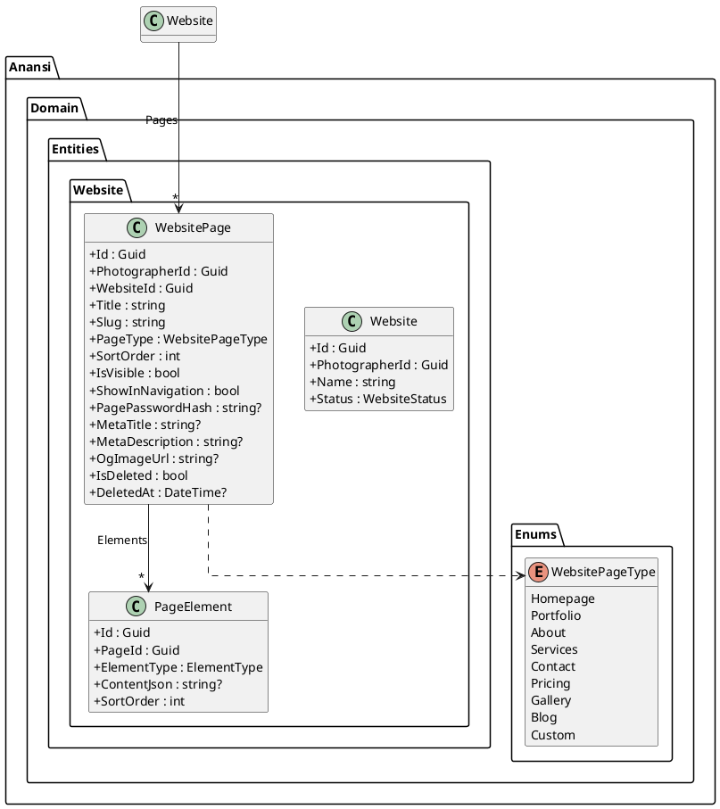
```plantuml
@startuml
skinparam classAttributeIconSize 0
skinparam linetype ortho
hide empty methods

package "Anansi.Domain.Entities.Website" {
  class Website {
    +Id : Guid
    +PhotographerId : Guid
    +Name : string
    +Status : WebsiteStatus
  }

  class WebsitePage {
    +Id : Guid
    +PhotographerId : Guid
    +WebsiteId : Guid
    +Title : string
    +Slug : string
    +PageType : WebsitePageType
    +SortOrder : int
    +IsVisible : bool
    +ShowInNavigation : bool
    +PagePasswordHash : string?
    +MetaTitle : string?
    +MetaDescription : string?
    +OgImageUrl : string?
    +IsDeleted : bool
    +DeletedAt : DateTime?
  }

  class PageElement {
    +Id : Guid
    +PageId : Guid
    +ElementType : ElementType
    +ContentJson : string?
    +SortOrder : int
  }
}

package "Anansi.Domain.Enums" {
  enum WebsitePageType {
    Homepage
    Portfolio
    About
    Services
    Contact
    Pricing
    Gallery
    Blog
    Custom
  }
}

Website --> "*" WebsitePage : Pages
WebsitePage --> "*" PageElement : Elements
WebsitePage ..> WebsitePageType

@enduml
```

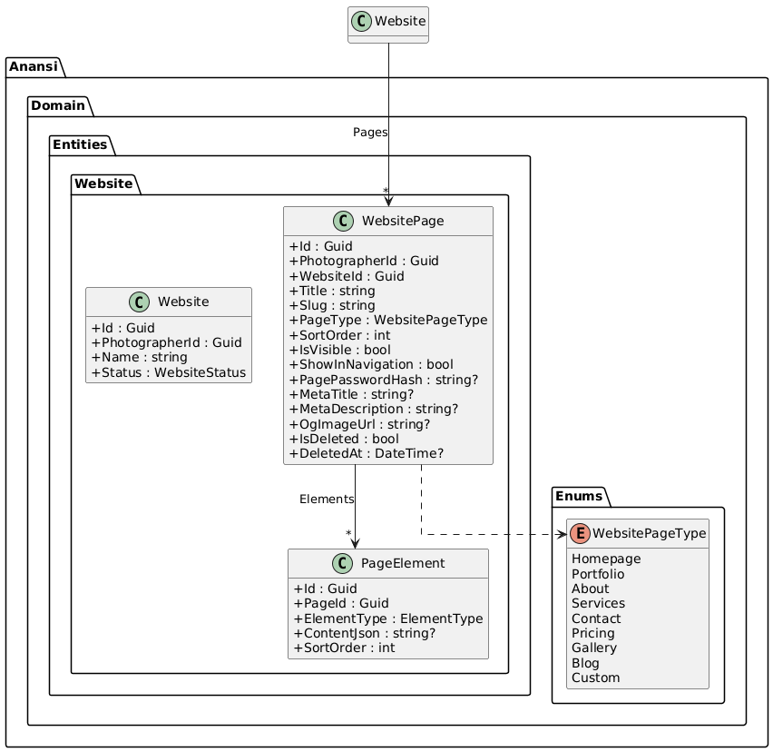

### Domain Layer -- Content Blocks & Landing Page Templates

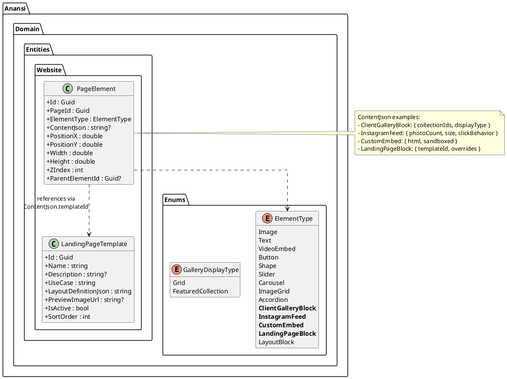
```plantuml
@startuml
skinparam classAttributeIconSize 0
skinparam linetype ortho
hide empty methods

package "Anansi.Domain.Entities.Website" {
  class PageElement {
    +Id : Guid
    +PageId : Guid
    +ElementType : ElementType
    +ContentJson : string?
    +PositionX : double
    +PositionY : double
    +Width : double
    +Height : double
    +ZIndex : int
    +ParentElementId : Guid?
  }

  class LandingPageTemplate {
    +Id : Guid
    +Name : string
    +Description : string?
    +UseCase : string
    +LayoutDefinitionJson : string
    +PreviewImageUrl : string?
    +IsActive : bool
    +SortOrder : int
  }
}

package "Anansi.Domain.Enums" {
  enum ElementType {
    Image
    Text
    VideoEmbed
    Button
    Shape
    Slider
    Carousel
    ImageGrid
    Accordion
    **ClientGalleryBlock**
    **InstagramFeed**
    **CustomEmbed**
    **LandingPageBlock**
    LayoutBlock
  }

  enum GalleryDisplayType {
    Grid
    FeaturedCollection
  }
}

note right of PageElement
  ContentJson examples:
  - ClientGalleryBlock: { collectionIds, displayType }
  - InstagramFeed: { photoCount, size, clickBehavior }
  - CustomEmbed: { html, sandboxed }
  - LandingPageBlock: { templateId, overrides }
end note

PageElement ..> ElementType
PageElement ..> LandingPageTemplate : references via\nContentJson.templateId

@enduml
```

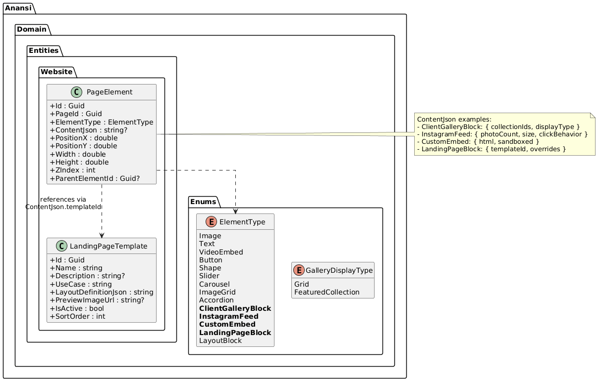

### Application Layer -- Page Commands & Queries

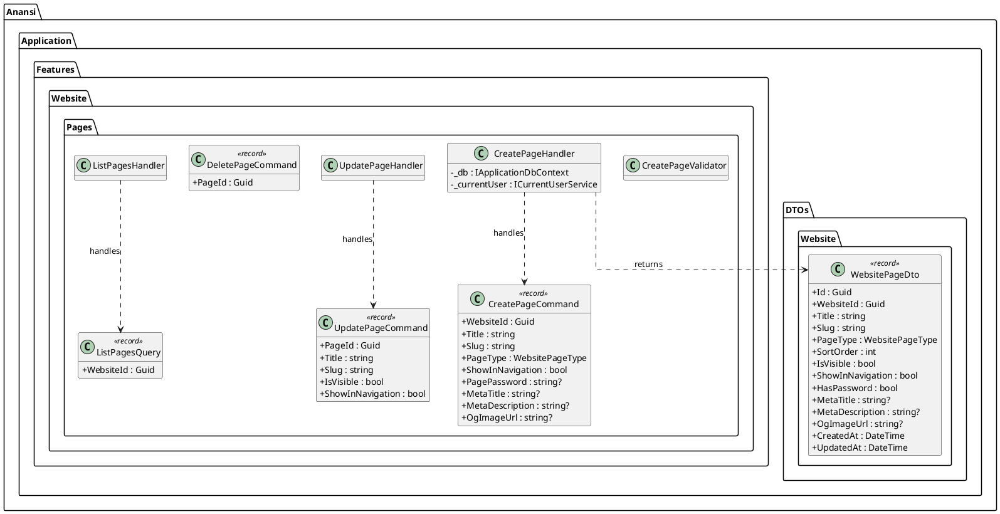
```plantuml
@startuml
skinparam classAttributeIconSize 0
skinparam linetype ortho
hide empty methods

package "Anansi.Application.Features.Website.Pages" {
  class CreatePageCommand <<record>> {
    +WebsiteId : Guid
    +Title : string
    +Slug : string
    +PageType : WebsitePageType
    +ShowInNavigation : bool
    +PagePassword : string?
    +MetaTitle : string?
    +MetaDescription : string?
    +OgImageUrl : string?
  }
  class CreatePageValidator
  class CreatePageHandler {
    -_db : IApplicationDbContext
    -_currentUser : ICurrentUserService
  }

  class UpdatePageCommand <<record>> {
    +PageId : Guid
    +Title : string
    +Slug : string
    +IsVisible : bool
    +ShowInNavigation : bool
  }
  class UpdatePageHandler

  class DeletePageCommand <<record>> {
    +PageId : Guid
  }

  class ListPagesQuery <<record>> {
    +WebsiteId : Guid
  }
  class ListPagesHandler
}

package "Anansi.Application.DTOs.Website" {
  class WebsitePageDto <<record>> {
    +Id : Guid
    +WebsiteId : Guid
    +Title : string
    +Slug : string
    +PageType : WebsitePageType
    +SortOrder : int
    +IsVisible : bool
    +ShowInNavigation : bool
    +HasPassword : bool
    +MetaTitle : string?
    +MetaDescription : string?
    +OgImageUrl : string?
    +CreatedAt : DateTime
    +UpdatedAt : DateTime
  }
}

CreatePageHandler ..> CreatePageCommand : handles
CreatePageHandler ..> WebsitePageDto : returns
UpdatePageHandler ..> UpdatePageCommand : handles
ListPagesHandler ..> ListPagesQuery : handles

@enduml
```

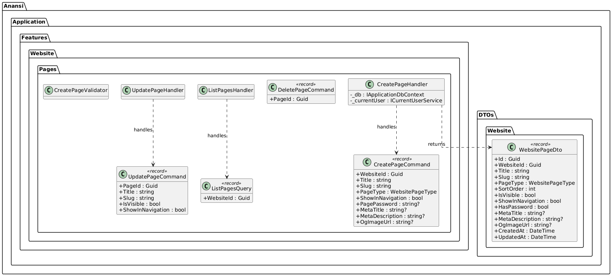

### API Layer -- Page & Content Controllers

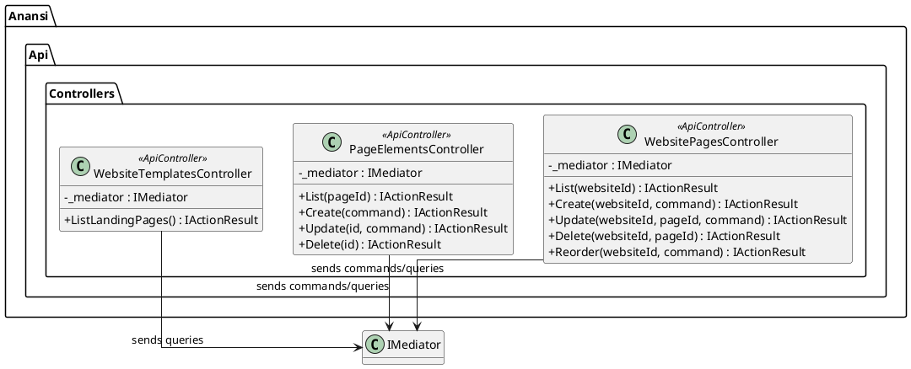
```plantuml
@startuml
skinparam classAttributeIconSize 0
skinparam linetype ortho
hide empty methods

package "Anansi.Api.Controllers" {
  class WebsitePagesController <<ApiController>> {
    -_mediator : IMediator
    +List(websiteId) : IActionResult
    +Create(websiteId, command) : IActionResult
    +Update(websiteId, pageId, command) : IActionResult
    +Delete(websiteId, pageId) : IActionResult
    +Reorder(websiteId, command) : IActionResult
  }

  class PageElementsController <<ApiController>> {
    -_mediator : IMediator
    +List(pageId) : IActionResult
    +Create(command) : IActionResult
    +Update(id, command) : IActionResult
    +Delete(id) : IActionResult
  }

  class WebsiteTemplatesController <<ApiController>> {
    -_mediator : IMediator
    +ListLandingPages() : IActionResult
  }
}

WebsitePagesController --> "IMediator" : sends commands/queries
PageElementsController --> "IMediator" : sends commands/queries
WebsiteTemplatesController --> "IMediator" : sends queries

@enduml
```

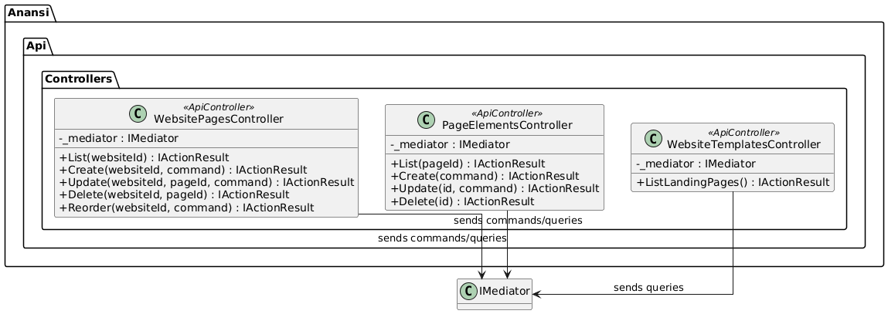

## Sequence Diagrams

### Create a New Page (WEB-3.2.1)

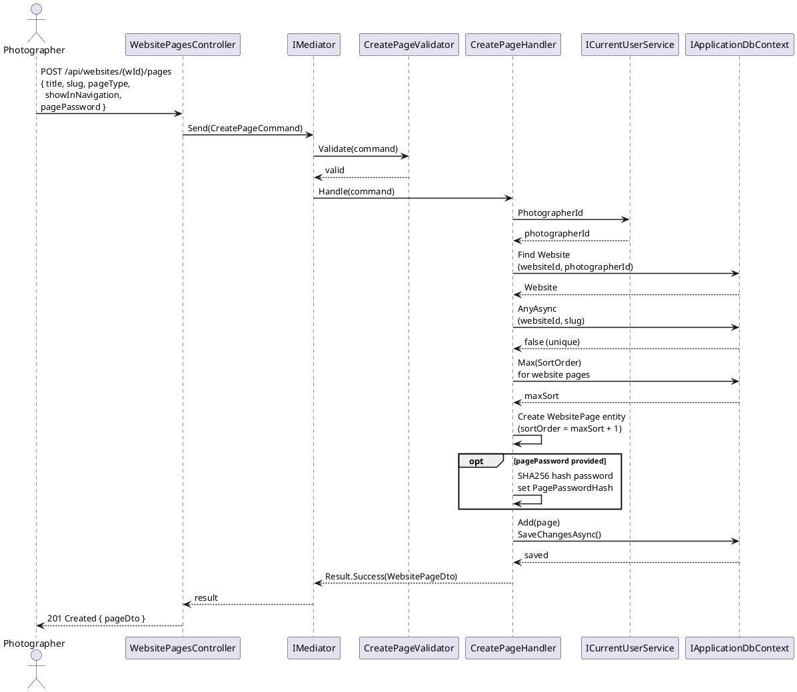
```plantuml
@startuml
skinparam sequenceArrowThickness 1.5
skinparam maxMessageSize 200

actor Photographer as P
participant "WebsitePagesController" as C
participant "IMediator" as M
participant "CreatePageValidator" as V
participant "CreatePageHandler" as H
participant "ICurrentUserService" as U
participant "IApplicationDbContext" as DB

P -> C : POST /api/websites/{wId}/pages\n{ title, slug, pageType,\n  showInNavigation, pagePassword }
C -> M : Send(CreatePageCommand)
M -> V : Validate(command)
V --> M : valid

M -> H : Handle(command)
H -> U : PhotographerId
U --> H : photographerId

H -> DB : Find Website\n(websiteId, photographerId)
DB --> H : Website

H -> DB : AnyAsync\n(websiteId, slug)
DB --> H : false (unique)

H -> DB : Max(SortOrder)\nfor website pages
DB --> H : maxSort

H -> H : Create WebsitePage entity\n(sortOrder = maxSort + 1)

opt pagePassword provided
  H -> H : SHA256 hash password\nset PagePasswordHash
end

H -> DB : Add(page)\nSaveChangesAsync()
DB --> H : saved

H --> M : Result.Success(WebsitePageDto)
M --> C : result
C --> P : 201 Created { pageDto }

@enduml
```

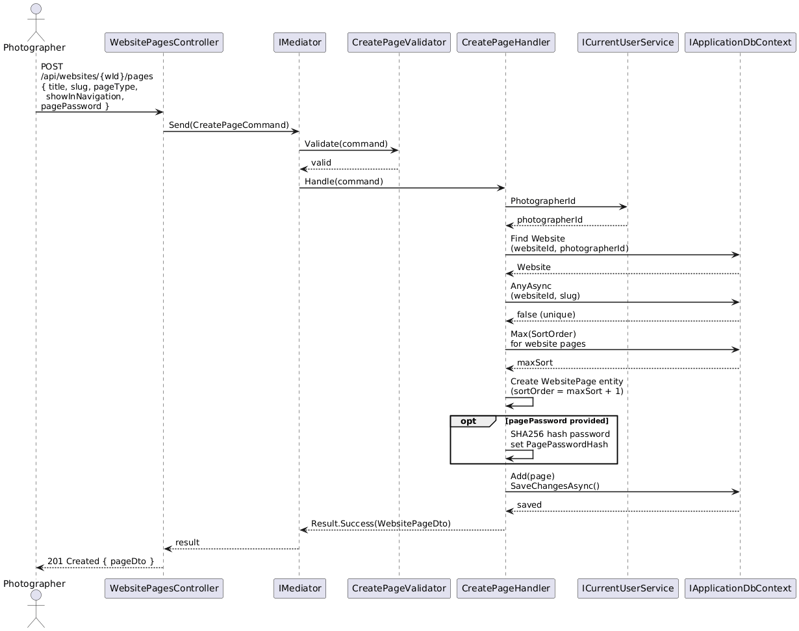

### Reorder Pages in Navigation (WEB-3.2.1)

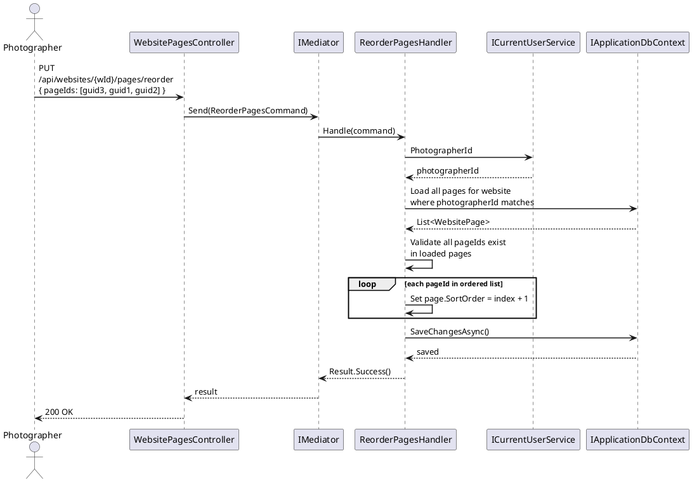
```plantuml
@startuml
skinparam sequenceArrowThickness 1.5
skinparam maxMessageSize 200

actor Photographer as P
participant "WebsitePagesController" as C
participant "IMediator" as M
participant "ReorderPagesHandler" as H
participant "ICurrentUserService" as U
participant "IApplicationDbContext" as DB

P -> C : PUT /api/websites/{wId}/pages/reorder\n{ pageIds: [guid3, guid1, guid2] }
C -> M : Send(ReorderPagesCommand)
M -> H : Handle(command)
H -> U : PhotographerId
U --> H : photographerId

H -> DB : Load all pages for website\nwhere photographerId matches
DB --> H : List<WebsitePage>

H -> H : Validate all pageIds exist\nin loaded pages

loop each pageId in ordered list
  H -> H : Set page.SortOrder = index + 1
end

H -> DB : SaveChangesAsync()
DB --> H : saved

H --> M : Result.Success()
M --> C : result
C --> P : 200 OK

@enduml
```

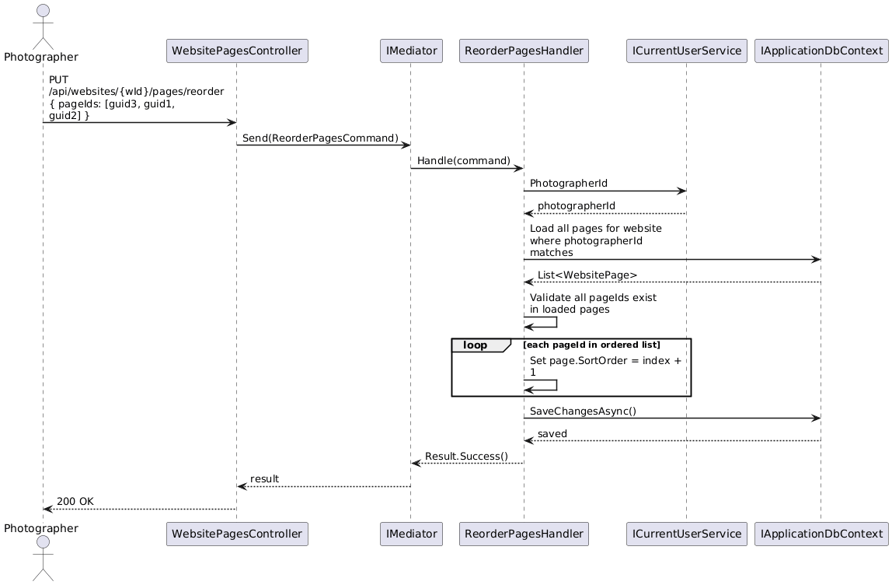

### Add Client Gallery Block to Page (WEB-3.2.2)

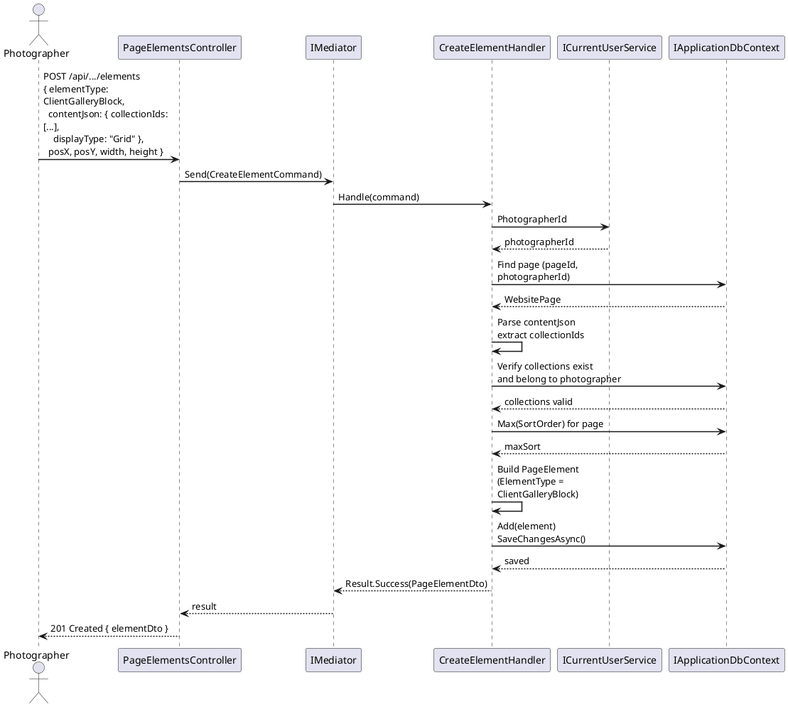
```plantuml
@startuml
skinparam sequenceArrowThickness 1.5
skinparam maxMessageSize 200

actor Photographer as P
participant "PageElementsController" as C
participant "IMediator" as M
participant "CreateElementHandler" as H
participant "ICurrentUserService" as U
participant "IApplicationDbContext" as DB

P -> C : POST /api/.../elements\n{ elementType: ClientGalleryBlock,\n  contentJson: { collectionIds: [...],\n    displayType: "Grid" },\n  posX, posY, width, height }
C -> M : Send(CreateElementCommand)
M -> H : Handle(command)
H -> U : PhotographerId
U --> H : photographerId

H -> DB : Find page (pageId, photographerId)
DB --> H : WebsitePage

H -> H : Parse contentJson\nextract collectionIds

H -> DB : Verify collections exist\nand belong to photographer
DB --> H : collections valid

H -> DB : Max(SortOrder) for page
DB --> H : maxSort

H -> H : Build PageElement\n(ElementType = ClientGalleryBlock)

H -> DB : Add(element)\nSaveChangesAsync()
DB --> H : saved

H --> M : Result.Success(PageElementDto)
M --> C : result
C --> P : 201 Created { elementDto }

@enduml
```

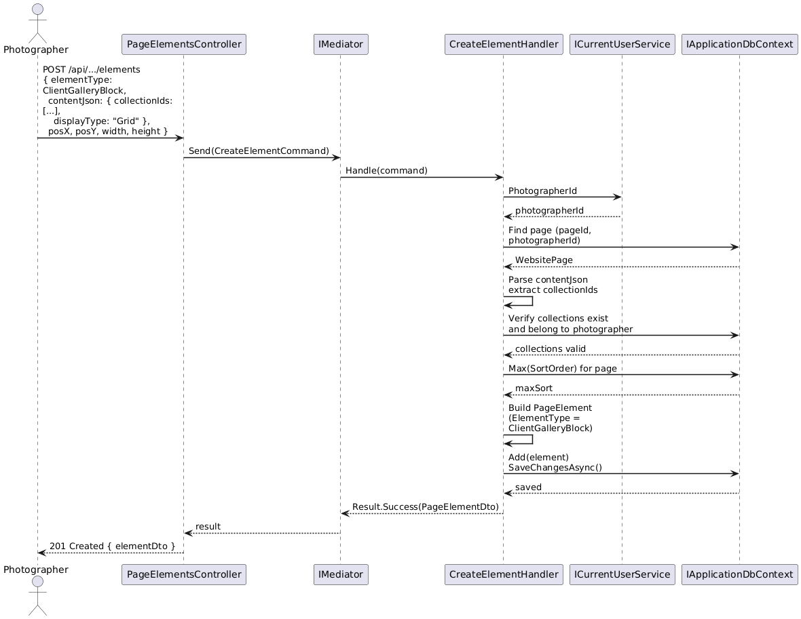

### Add Instagram Feed Block (WEB-3.2.3)

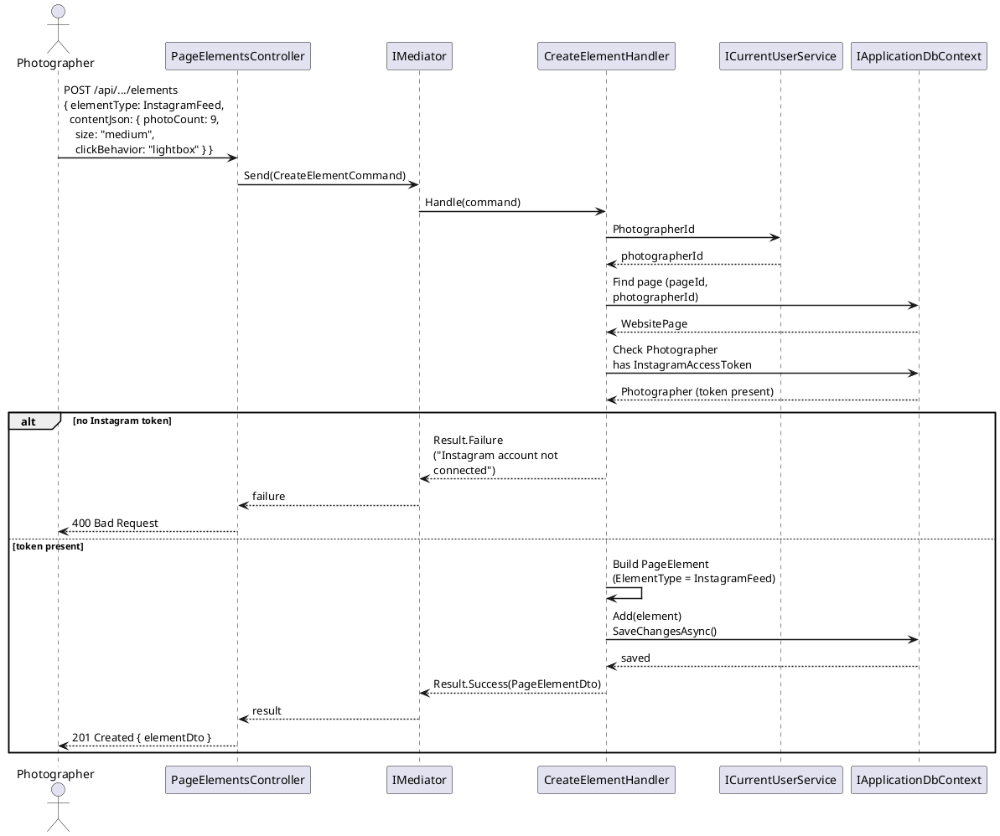
```plantuml
@startuml
skinparam sequenceArrowThickness 1.5
skinparam maxMessageSize 200

actor Photographer as P
participant "PageElementsController" as C
participant "IMediator" as M
participant "CreateElementHandler" as H
participant "ICurrentUserService" as U
participant "IApplicationDbContext" as DB

P -> C : POST /api/.../elements\n{ elementType: InstagramFeed,\n  contentJson: { photoCount: 9,\n    size: "medium",\n    clickBehavior: "lightbox" } }
C -> M : Send(CreateElementCommand)
M -> H : Handle(command)
H -> U : PhotographerId
U --> H : photographerId

H -> DB : Find page (pageId, photographerId)
DB --> H : WebsitePage

H -> DB : Check Photographer\nhas InstagramAccessToken
DB --> H : Photographer (token present)

alt no Instagram token
  H --> M : Result.Failure\n("Instagram account not connected")
  M --> C : failure
  C --> P : 400 Bad Request
else token present
  H -> H : Build PageElement\n(ElementType = InstagramFeed)
  H -> DB : Add(element)\nSaveChangesAsync()
  DB --> H : saved
  H --> M : Result.Success(PageElementDto)
  M --> C : result
  C --> P : 201 Created { elementDto }
end

@enduml
```

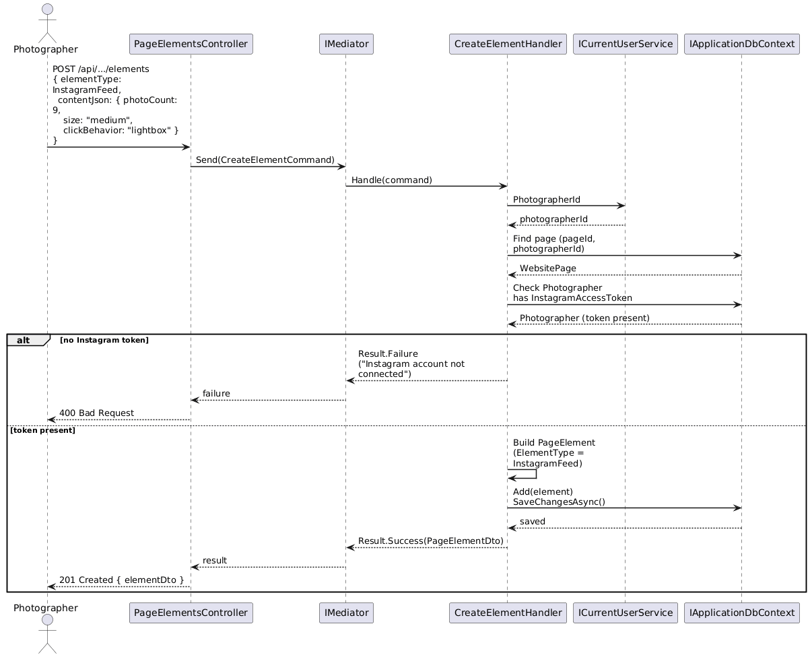

### Add Custom Embed Block with Plan Check (WEB-3.2.4)

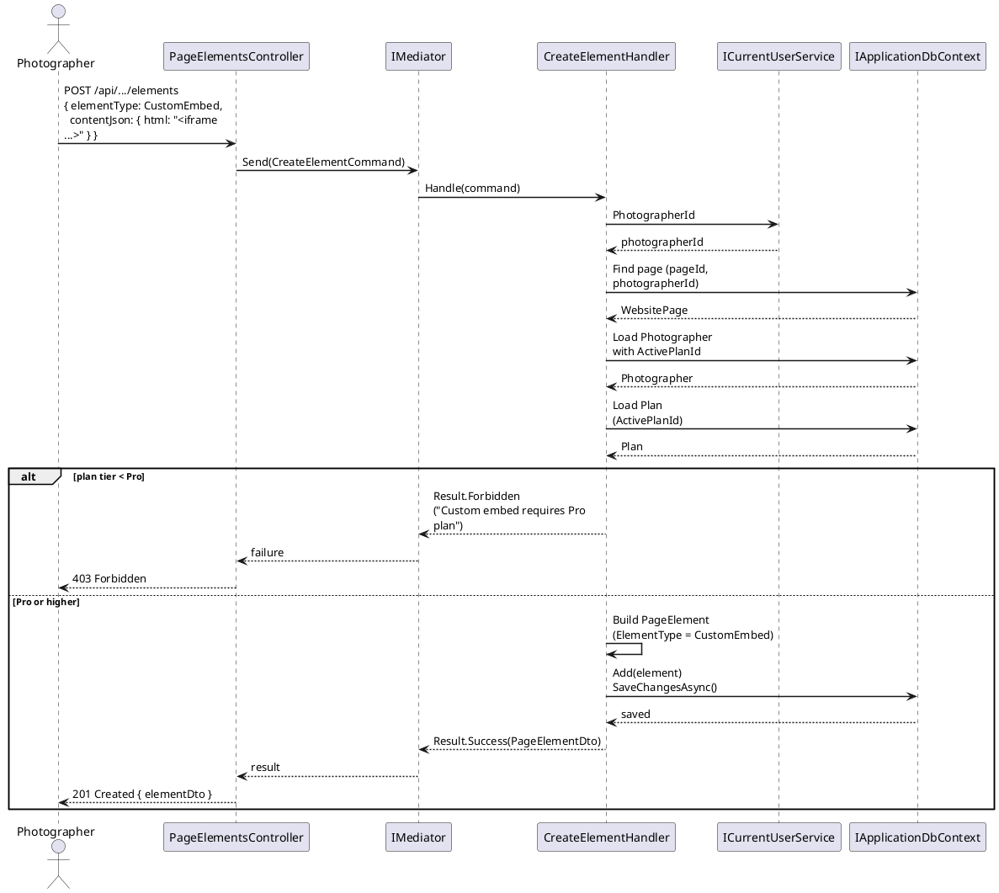
```plantuml
@startuml
skinparam sequenceArrowThickness 1.5
skinparam maxMessageSize 200

actor Photographer as P
participant "PageElementsController" as C
participant "IMediator" as M
participant "CreateElementHandler" as H
participant "ICurrentUserService" as U
participant "IApplicationDbContext" as DB

P -> C : POST /api/.../elements\n{ elementType: CustomEmbed,\n  contentJson: { html: "<iframe ...>" } }
C -> M : Send(CreateElementCommand)
M -> H : Handle(command)
H -> U : PhotographerId
U --> H : photographerId

H -> DB : Find page (pageId, photographerId)
DB --> H : WebsitePage

H -> DB : Load Photographer\nwith ActivePlanId
DB --> H : Photographer

H -> DB : Load Plan\n(ActivePlanId)
DB --> H : Plan

alt plan tier < Pro
  H --> M : Result.Forbidden\n("Custom embed requires Pro plan")
  M --> C : failure
  C --> P : 403 Forbidden
else Pro or higher
  H -> H : Build PageElement\n(ElementType = CustomEmbed)
  H -> DB : Add(element)\nSaveChangesAsync()
  DB --> H : saved
  H --> M : Result.Success(PageElementDto)
  M --> C : result
  C --> P : 201 Created { elementDto }
end

@enduml
```

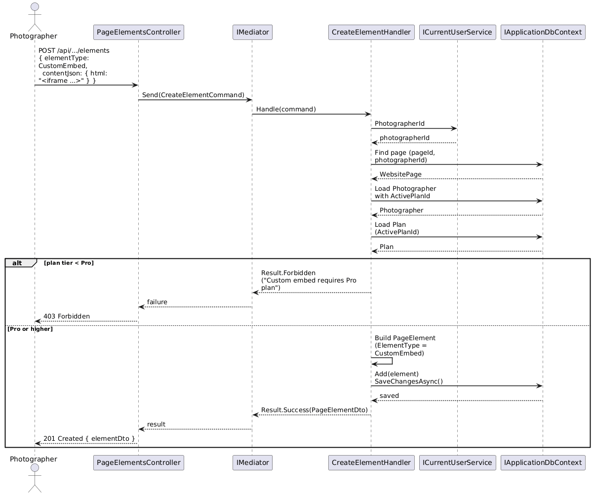

### Add Landing Page from Template (WEB-3.2.5)

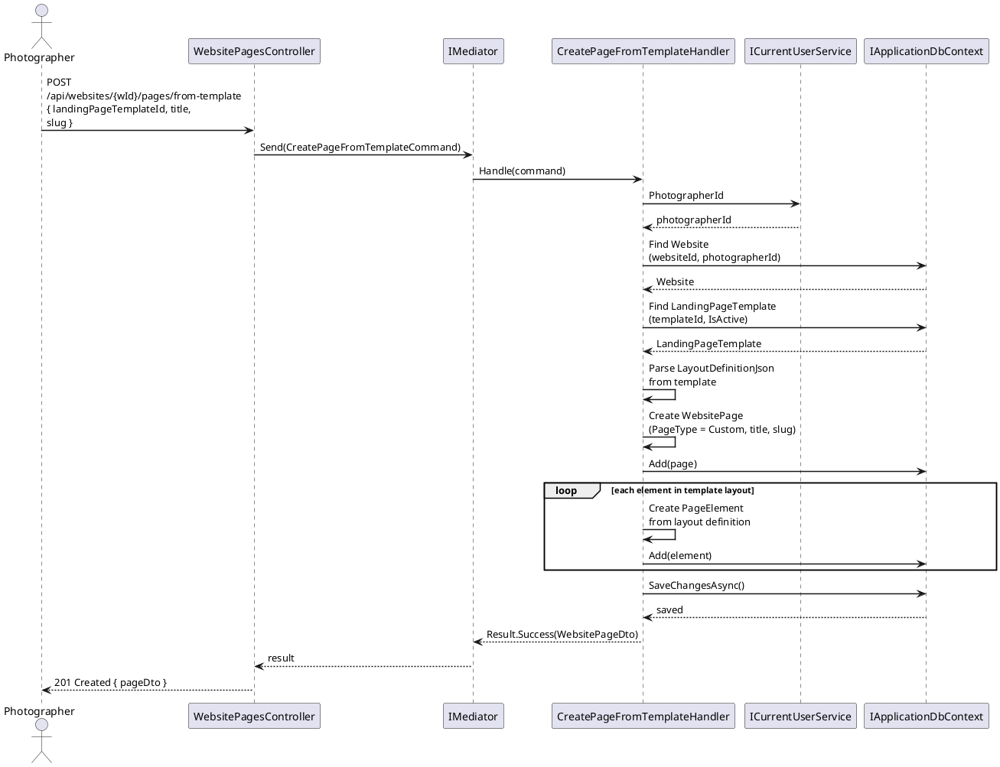
```plantuml
@startuml
skinparam sequenceArrowThickness 1.5
skinparam maxMessageSize 200

actor Photographer as P
participant "WebsitePagesController" as C
participant "IMediator" as M
participant "CreatePageFromTemplateHandler" as H
participant "ICurrentUserService" as U
participant "IApplicationDbContext" as DB

P -> C : POST /api/websites/{wId}/pages/from-template\n{ landingPageTemplateId, title, slug }
C -> M : Send(CreatePageFromTemplateCommand)
M -> H : Handle(command)
H -> U : PhotographerId
U --> H : photographerId

H -> DB : Find Website\n(websiteId, photographerId)
DB --> H : Website

H -> DB : Find LandingPageTemplate\n(templateId, IsActive)
DB --> H : LandingPageTemplate

H -> H : Parse LayoutDefinitionJson\nfrom template

H -> H : Create WebsitePage\n(PageType = Custom, title, slug)

H -> DB : Add(page)

loop each element in template layout
  H -> H : Create PageElement\nfrom layout definition
  H -> DB : Add(element)
end

H -> DB : SaveChangesAsync()
DB --> H : saved

H --> M : Result.Success(WebsitePageDto)
M --> C : result
C --> P : 201 Created { pageDto }

@enduml
```

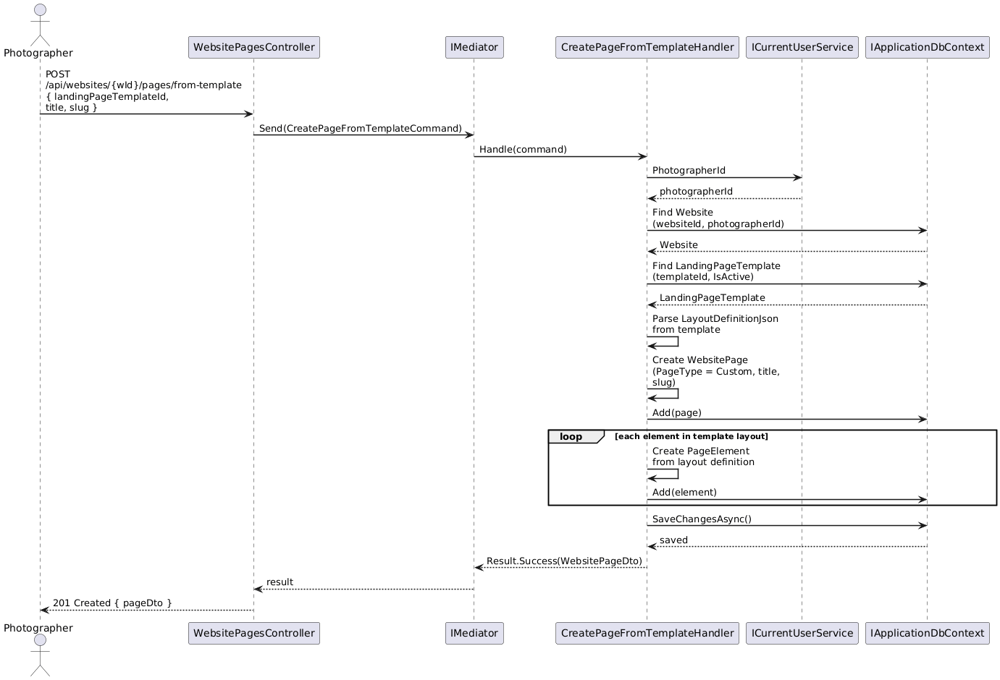
