# F18 - Blog Platform

## Overview

The Blog Platform feature provides photographers with a full-featured blogging system integrated into their Anansi websites. Blog posts serve as a key marketing tool for photographers, allowing them to showcase sessions, share behind-the-scenes content, and improve search engine visibility through regularly updated content.

Blog Post Management (WEB-3.3.1) enables creating posts with a title, rich text body (including inline images and embedded content), a custom URL slug, category assignments, and a configurable publication date. Posts support draft, published, and scheduled statuses, with scheduled posts automatically transitioning to published at their designated time. Post duplication allows photographers to reuse post structures efficiently. The Free plan limits photographers to 5 blog posts, while paid plans offer unlimited posts.

Blog Layouts (WEB-3.3.2) provide three presentation styles -- grid, stacked, and alternated cards -- configurable at the website level. Pagination is configurable with a "Load More" button alternative to traditional page-based pagination. Category filtering allows visitors to browse posts by topic. Blog content is preserved when switching website templates, ensuring posts survive design changes. Blog Migration (WEB-3.3.3) provides import tools to bring in existing blog content from other platforms, preserving post titles, body content, images, and publication dates through a URL-based import mechanism.

## Components

### Domain Layer

**BlogPost** (`Anansi.Domain.Entities.Website.BlogPost`) -- The core blog post entity. Contains `Title`, `Slug` (custom URL), `Excerpt` (summary), `BodyHtml` (rich text content), `FeaturedImageUrl`, `Status` (via `BlogPostStatus` enum: Draft, Published, Scheduled, Archived), `PublishDate`, and `ScheduledPublishDate`. Supports SEO metadata (`MetaTitle`, `MetaDescription`, `OgImageUrl`). Migration tracking via `ImportedFromUrl` and `ImportedAt`. Implements `ITenantEntity`, `ISoftDeletable`, and `IAuditableEntity`.

**BlogCategory** (`Anansi.Domain.Entities.Website.BlogCategory`) -- Represents a content category for organizing posts. Contains `Name`, `Slug`, `Description`, and `SortOrder`. Implements `ITenantEntity` for per-photographer categories.

**BlogPostCategory** (`Anansi.Domain.Entities.Website.BlogPostCategory`) -- Join entity for the many-to-many relationship between `BlogPost` and `BlogCategory`.

**Website** (blog-related properties) -- The `Website` entity holds blog-level configuration: `BlogLayout` (from `BlogLayoutType` enum: Grid, Stacked, AlternatedCards), `BlogPostsPerPage`, and `BlogLoadMoreEnabled`.

### Application Layer

**CreateBlogPostCommand / CreateBlogPostHandler** -- Creates a new blog post. Validates the blog post limit for Free-tier users (max 5). Generates a unique slug from the title if not provided. Handles category assignments through the `BlogPostCategory` join entity. Supports setting `ScheduledPublishDate` for future publication.

**UpdateBlogPostCommand / UpdateBlogPostHandler** -- Updates post properties including title, body, slug, excerpt, featured image, categories, status, and publication date. Re-validates slug uniqueness when changed.

**DuplicateBlogPostCommand / DuplicateBlogPostHandler** -- Creates a copy of an existing post with a modified title (e.g., "Copy of Original Title") and a new slug. The duplicate starts in Draft status regardless of the original's status. Category assignments are duplicated.

**DeleteBlogPostCommand / DeleteBlogPostHandler** -- Soft-deletes a blog post and removes its category associations.

**ListBlogPostsQuery / ListBlogPostsHandler** -- Returns paginated blog posts for a website with optional `BlogPostStatus` and `categoryId` filters. Returns `PagedList<BlogPostDto>` supporting both traditional pagination and the "Load More" pattern.

**ImportBlogPostCommand / ImportBlogPostHandler** -- Imports a blog post from an external URL. Fetches content, extracts title and body, downloads and re-hosts images, sets `ImportedFromUrl` and `ImportedAt` for tracking provenance. Creates the post in Draft status for review before publishing.

**CreateBlogCategoryCommand / CreateBlogCategoryHandler** -- Creates a new category with name, slug, and description.

**DeleteBlogCategoryCommand / DeleteBlogCategoryHandler** -- Deletes a category and removes all `BlogPostCategory` associations. Does not delete the posts themselves.

**ListBlogCategoriesQuery / ListBlogCategoriesHandler** -- Returns all categories for the current photographer ordered by `SortOrder`.

**PublishScheduledPostsJob** -- Background job (not a MediatR handler) that runs periodically to find posts with `Status == Scheduled` and `ScheduledPublishDate <= DateTime.UtcNow`, transitioning them to Published status.

### Infrastructure Layer

**EF Core Configurations** -- `BlogPost` configuration defines indexes on `(WebsiteId, Slug)` for uniqueness, `(WebsiteId, Status, PublishDate)` for listing queries, and `(ScheduledPublishDate)` for the scheduled publishing job. `BlogPostCategory` uses a composite key on `(BlogPostId, BlogCategoryId)`.

**BlogMigrationService** -- Infrastructure service implementing `IBlogMigrationService` that handles fetching external blog content, parsing HTML, extracting images, re-uploading them to Anansi storage, and rewriting image URLs in the post body.

### API Layer

**BlogController** (`api/websites/{websiteId}/blog`) -- Full CRUD for blog posts and categories. Endpoints include `GET posts` (paginated listing with filters), `POST posts` (create), `PUT posts/{id}` (update), `POST posts/{id}/duplicate` (duplicate), `DELETE posts/{id}` (soft-delete), `POST posts/import` (migration), `GET categories`, `POST categories`, and `DELETE categories/{id}`.

## Class Diagrams

### Domain Layer -- Blog Entities

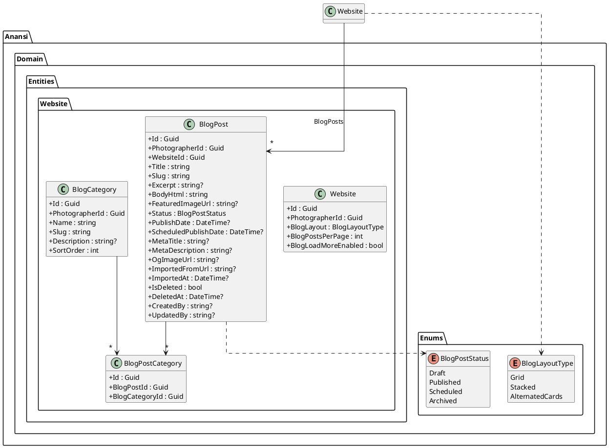
```plantuml
@startuml
skinparam classAttributeIconSize 0
skinparam linetype ortho
hide empty methods

package "Anansi.Domain.Entities.Website" {
  class Website {
    +Id : Guid
    +PhotographerId : Guid
    +BlogLayout : BlogLayoutType
    +BlogPostsPerPage : int
    +BlogLoadMoreEnabled : bool
  }

  class BlogPost {
    +Id : Guid
    +PhotographerId : Guid
    +WebsiteId : Guid
    +Title : string
    +Slug : string
    +Excerpt : string?
    +BodyHtml : string
    +FeaturedImageUrl : string?
    +Status : BlogPostStatus
    +PublishDate : DateTime?
    +ScheduledPublishDate : DateTime?
    +MetaTitle : string?
    +MetaDescription : string?
    +OgImageUrl : string?
    +ImportedFromUrl : string?
    +ImportedAt : DateTime?
    +IsDeleted : bool
    +DeletedAt : DateTime?
    +CreatedBy : string?
    +UpdatedBy : string?
  }

  class BlogCategory {
    +Id : Guid
    +PhotographerId : Guid
    +Name : string
    +Slug : string
    +Description : string?
    +SortOrder : int
  }

  class BlogPostCategory {
    +Id : Guid
    +BlogPostId : Guid
    +BlogCategoryId : Guid
  }
}

package "Anansi.Domain.Enums" {
  enum BlogPostStatus {
    Draft
    Published
    Scheduled
    Archived
  }

  enum BlogLayoutType {
    Grid
    Stacked
    AlternatedCards
  }
}

Website --> "*" BlogPost : BlogPosts
BlogPost --> "*" BlogPostCategory
BlogCategory --> "*" BlogPostCategory
BlogPost ..> BlogPostStatus
Website ..> BlogLayoutType

@enduml
```

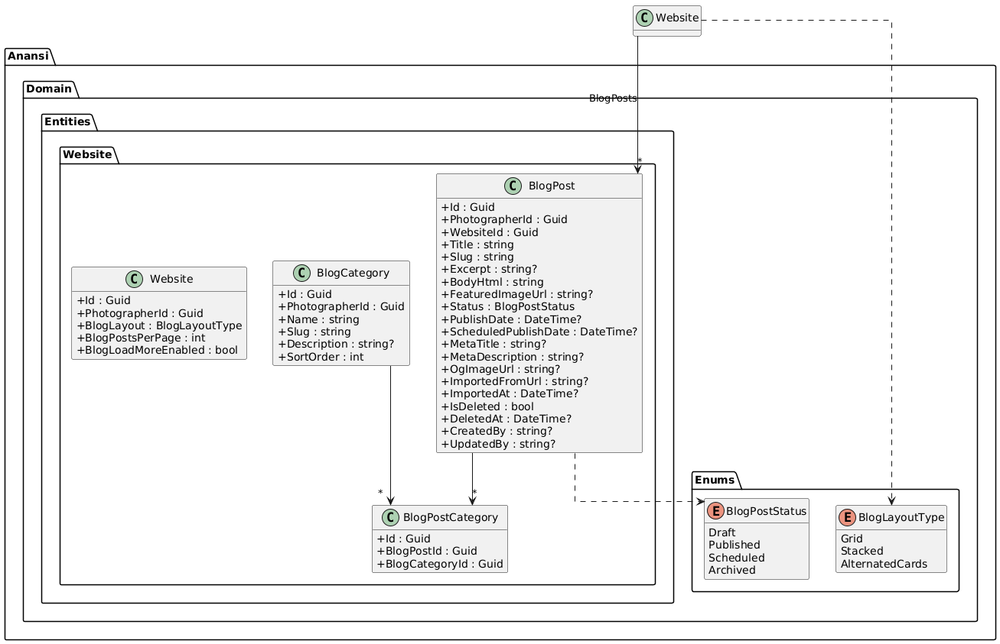

### Application Layer -- Blog Commands & Queries

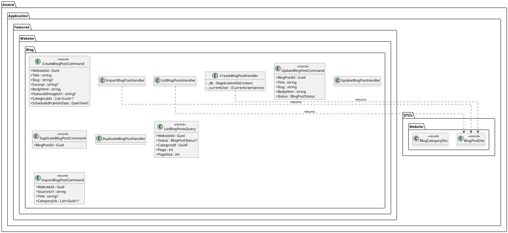
```plantuml
@startuml
skinparam classAttributeIconSize 0
skinparam linetype ortho
hide empty methods

package "Anansi.Application.Features.Website.Blog" {
  class CreateBlogPostCommand <<record>> {
    +WebsiteId : Guid
    +Title : string
    +Slug : string?
    +Excerpt : string?
    +BodyHtml : string
    +FeaturedImageUrl : string?
    +CategoryIds : List<Guid>?
    +ScheduledPublishDate : DateTime?
  }
  class CreateBlogPostHandler {
    -_db : IApplicationDbContext
    -_currentUser : ICurrentUserService
  }

  class UpdateBlogPostCommand <<record>> {
    +BlogPostId : Guid
    +Title : string
    +Slug : string
    +BodyHtml : string
    +Status : BlogPostStatus
  }
  class UpdateBlogPostHandler

  class DuplicateBlogPostCommand <<record>> {
    +BlogPostId : Guid
  }
  class DuplicateBlogPostHandler

  class ListBlogPostsQuery <<record>> {
    +WebsiteId : Guid
    +Status : BlogPostStatus?
    +CategoryId : Guid?
    +Page : int
    +PageSize : int
  }
  class ListBlogPostsHandler

  class ImportBlogPostCommand <<record>> {
    +WebsiteId : Guid
    +SourceUrl : string
    +Title : string?
    +CategoryIds : List<Guid>?
  }
  class ImportBlogPostHandler
}

package "Anansi.Application.DTOs.Website" {
  class BlogPostDto <<record>>
  class BlogCategoryDto <<record>>
}

CreateBlogPostHandler ..> BlogPostDto : returns
ListBlogPostsHandler ..> BlogPostDto : returns
ImportBlogPostHandler ..> BlogPostDto : returns

@enduml
```

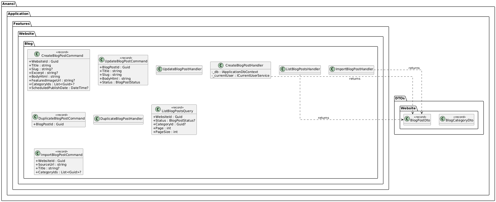

### Application Layer -- Category Management

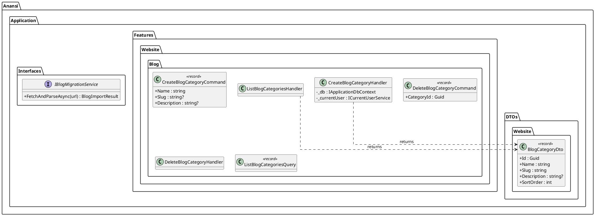
```plantuml
@startuml
skinparam classAttributeIconSize 0
skinparam linetype ortho
hide empty methods

package "Anansi.Application.Features.Website.Blog" {
  class CreateBlogCategoryCommand <<record>> {
    +Name : string
    +Slug : string?
    +Description : string?
  }
  class CreateBlogCategoryHandler {
    -_db : IApplicationDbContext
    -_currentUser : ICurrentUserService
  }

  class DeleteBlogCategoryCommand <<record>> {
    +CategoryId : Guid
  }
  class DeleteBlogCategoryHandler

  class ListBlogCategoriesQuery <<record>>
  class ListBlogCategoriesHandler
}

package "Anansi.Application.DTOs.Website" {
  class BlogCategoryDto <<record>> {
    +Id : Guid
    +Name : string
    +Slug : string
    +Description : string?
    +SortOrder : int
  }
}

package "Anansi.Application.Interfaces" {
  interface IBlogMigrationService {
    +FetchAndParseAsync(url) : BlogImportResult
  }
}

CreateBlogCategoryHandler ..> BlogCategoryDto : returns
ListBlogCategoriesHandler ..> BlogCategoryDto : returns

@enduml
```

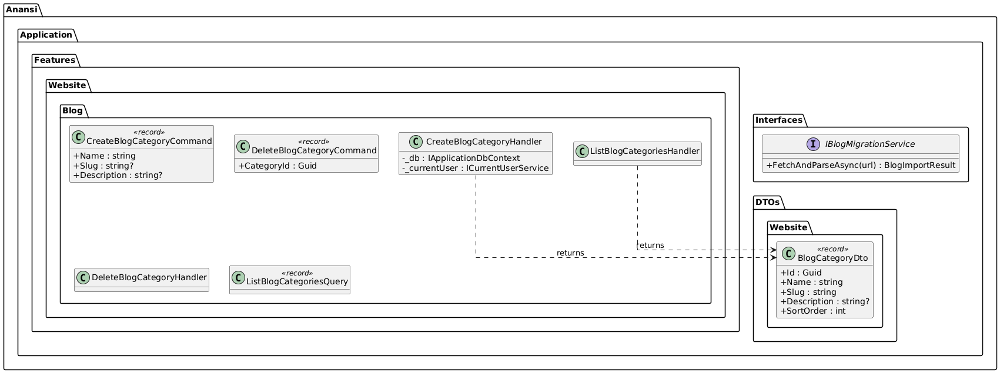

### API Layer -- BlogController

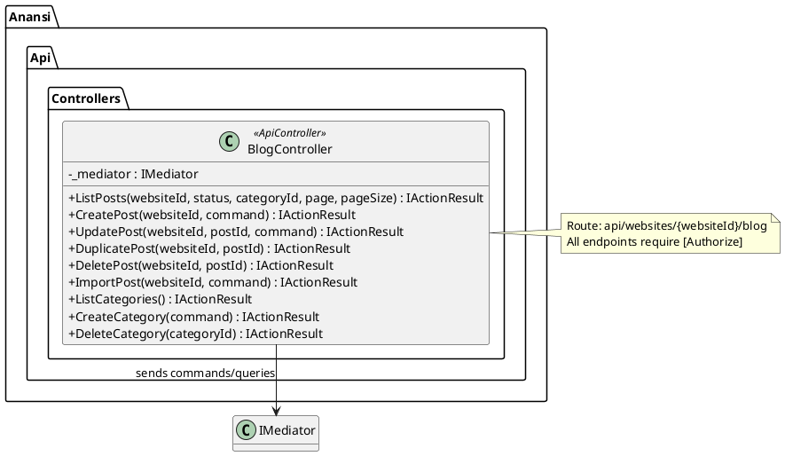
```plantuml
@startuml
skinparam classAttributeIconSize 0
skinparam linetype ortho
hide empty methods

package "Anansi.Api.Controllers" {
  class BlogController <<ApiController>> {
    -_mediator : IMediator
    +ListPosts(websiteId, status, categoryId, page, pageSize) : IActionResult
    +CreatePost(websiteId, command) : IActionResult
    +UpdatePost(websiteId, postId, command) : IActionResult
    +DuplicatePost(websiteId, postId) : IActionResult
    +DeletePost(websiteId, postId) : IActionResult
    +ImportPost(websiteId, command) : IActionResult
    +ListCategories() : IActionResult
    +CreateCategory(command) : IActionResult
    +DeleteCategory(categoryId) : IActionResult
  }
}

note right of BlogController
  Route: api/websites/{websiteId}/blog
  All endpoints require [Authorize]
end note

BlogController --> "IMediator" : sends commands/queries

@enduml
```

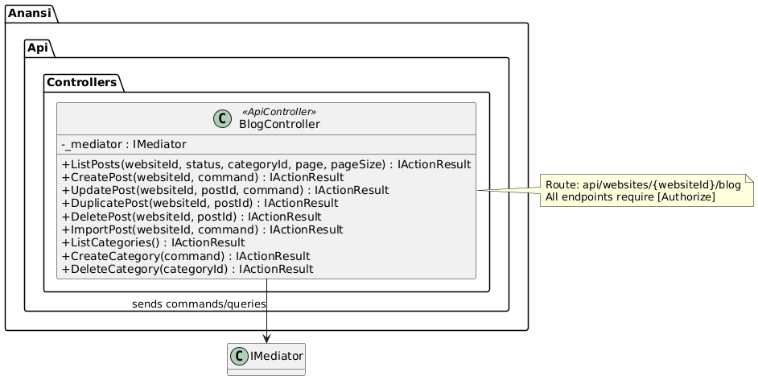

## Sequence Diagrams

### Create a Blog Post (WEB-3.3.1)

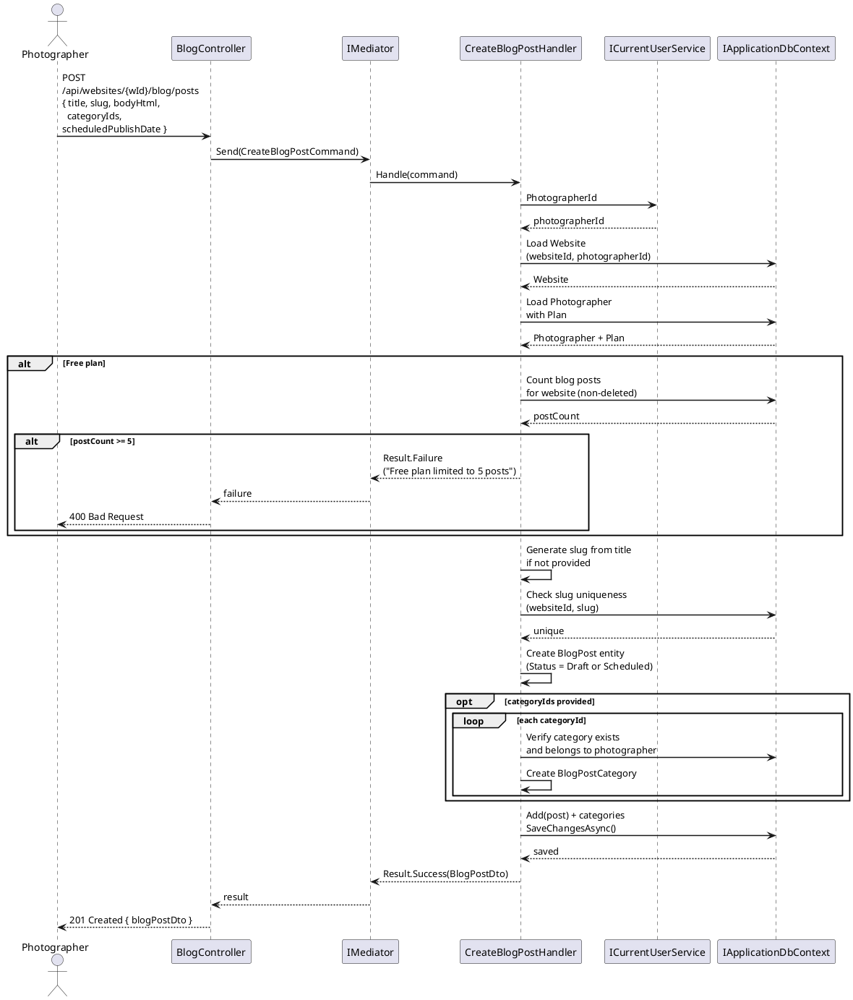
```plantuml
@startuml
skinparam sequenceArrowThickness 1.5
skinparam maxMessageSize 200

actor Photographer as P
participant "BlogController" as C
participant "IMediator" as M
participant "CreateBlogPostHandler" as H
participant "ICurrentUserService" as U
participant "IApplicationDbContext" as DB

P -> C : POST /api/websites/{wId}/blog/posts\n{ title, slug, bodyHtml,\n  categoryIds, scheduledPublishDate }
C -> M : Send(CreateBlogPostCommand)
M -> H : Handle(command)
H -> U : PhotographerId
U --> H : photographerId

H -> DB : Load Website\n(websiteId, photographerId)
DB --> H : Website

H -> DB : Load Photographer\nwith Plan
DB --> H : Photographer + Plan

alt Free plan
  H -> DB : Count blog posts\nfor website (non-deleted)
  DB --> H : postCount
  alt postCount >= 5
    H --> M : Result.Failure\n("Free plan limited to 5 posts")
    M --> C : failure
    C --> P : 400 Bad Request
  end
end

H -> H : Generate slug from title\nif not provided
H -> DB : Check slug uniqueness\n(websiteId, slug)
DB --> H : unique

H -> H : Create BlogPost entity\n(Status = Draft or Scheduled)

opt categoryIds provided
  loop each categoryId
    H -> DB : Verify category exists\nand belongs to photographer
    H -> H : Create BlogPostCategory
  end
end

H -> DB : Add(post) + categories\nSaveChangesAsync()
DB --> H : saved

H --> M : Result.Success(BlogPostDto)
M --> C : result
C --> P : 201 Created { blogPostDto }

@enduml
```

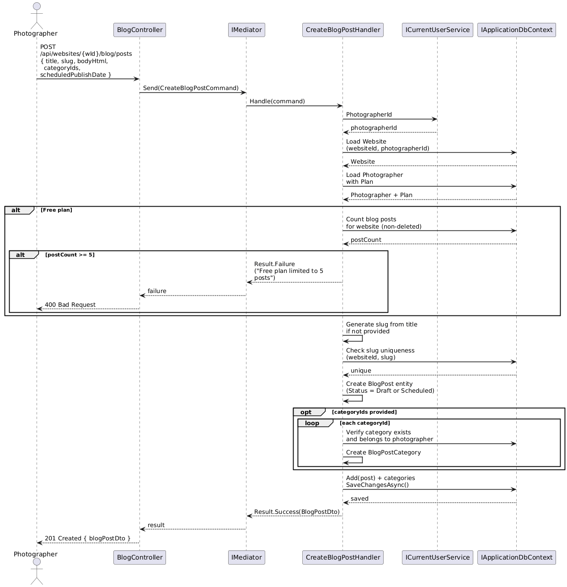

### Duplicate a Blog Post (WEB-3.3.1)

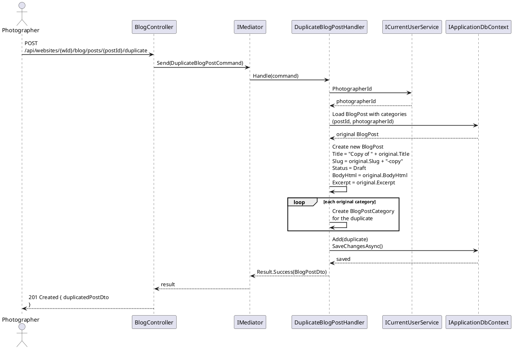
```plantuml
@startuml
skinparam sequenceArrowThickness 1.5
skinparam maxMessageSize 200

actor Photographer as P
participant "BlogController" as C
participant "IMediator" as M
participant "DuplicateBlogPostHandler" as H
participant "ICurrentUserService" as U
participant "IApplicationDbContext" as DB

P -> C : POST /api/websites/{wId}/blog/posts/{postId}/duplicate
C -> M : Send(DuplicateBlogPostCommand)
M -> H : Handle(command)
H -> U : PhotographerId
U --> H : photographerId

H -> DB : Load BlogPost with categories\n(postId, photographerId)
DB --> H : original BlogPost

H -> H : Create new BlogPost\nTitle = "Copy of " + original.Title\nSlug = original.Slug + "-copy"\nStatus = Draft\nBodyHtml = original.BodyHtml\nExcerpt = original.Excerpt

loop each original category
  H -> H : Create BlogPostCategory\nfor the duplicate
end

H -> DB : Add(duplicate)\nSaveChangesAsync()
DB --> H : saved

H --> M : Result.Success(BlogPostDto)
M --> C : result
C --> P : 201 Created { duplicatedPostDto }

@enduml
```

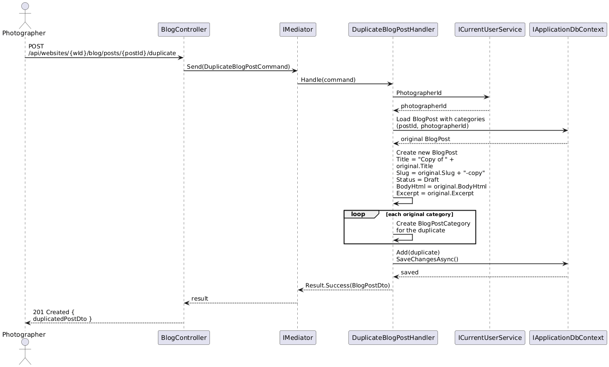

### List Blog Posts with Pagination and Filters (WEB-3.3.2)

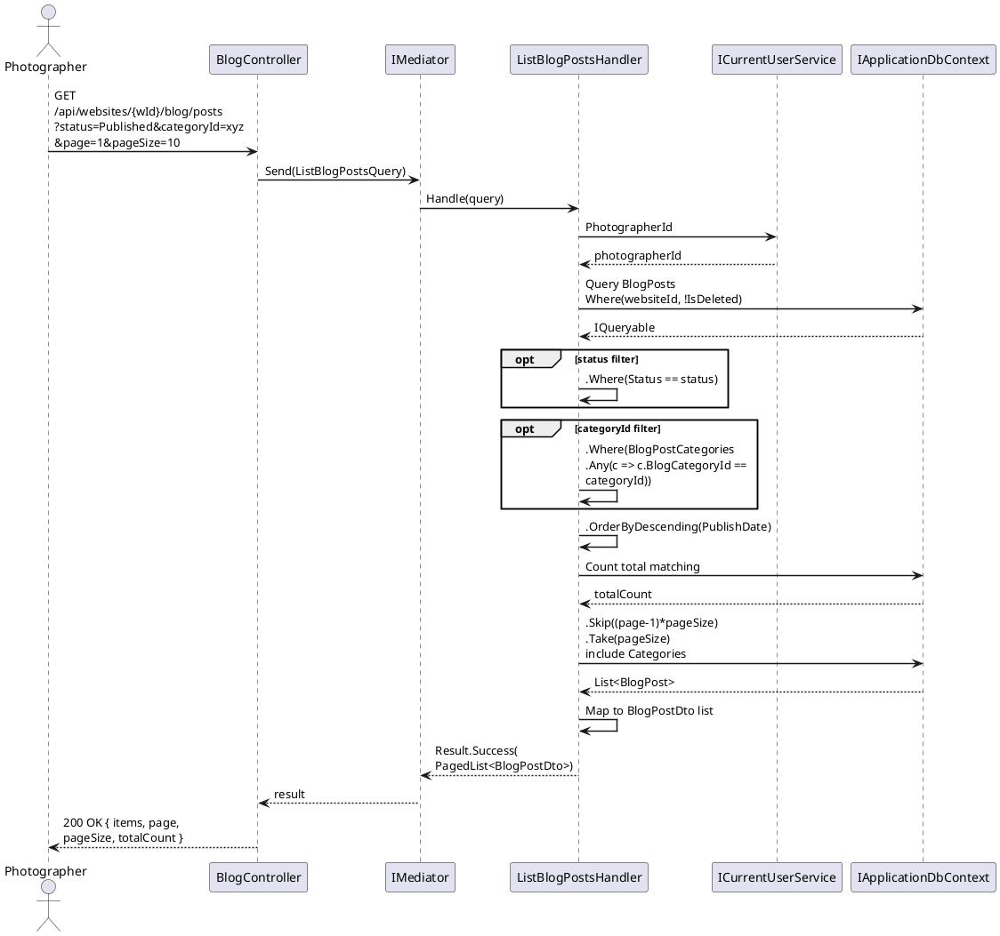
```plantuml
@startuml
skinparam sequenceArrowThickness 1.5
skinparam maxMessageSize 200

actor Photographer as P
participant "BlogController" as C
participant "IMediator" as M
participant "ListBlogPostsHandler" as H
participant "ICurrentUserService" as U
participant "IApplicationDbContext" as DB

P -> C : GET /api/websites/{wId}/blog/posts\n?status=Published&categoryId=xyz\n&page=1&pageSize=10
C -> M : Send(ListBlogPostsQuery)
M -> H : Handle(query)
H -> U : PhotographerId
U --> H : photographerId

H -> DB : Query BlogPosts\nWhere(websiteId, !IsDeleted)
DB --> H : IQueryable

opt status filter
  H -> H : .Where(Status == status)
end

opt categoryId filter
  H -> H : .Where(BlogPostCategories\n.Any(c => c.BlogCategoryId == categoryId))
end

H -> H : .OrderByDescending(PublishDate)

H -> DB : Count total matching
DB --> H : totalCount

H -> DB : .Skip((page-1)*pageSize)\n.Take(pageSize)\ninclude Categories
DB --> H : List<BlogPost>

H -> H : Map to BlogPostDto list

H --> M : Result.Success(\nPagedList<BlogPostDto>)
M --> C : result
C --> P : 200 OK { items, page,\npageSize, totalCount }

@enduml
```

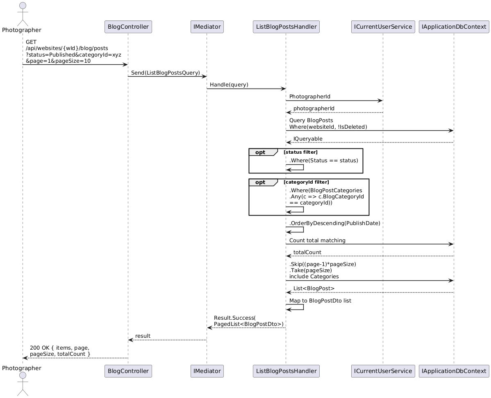

### Import Blog Post from External Platform (WEB-3.3.3)

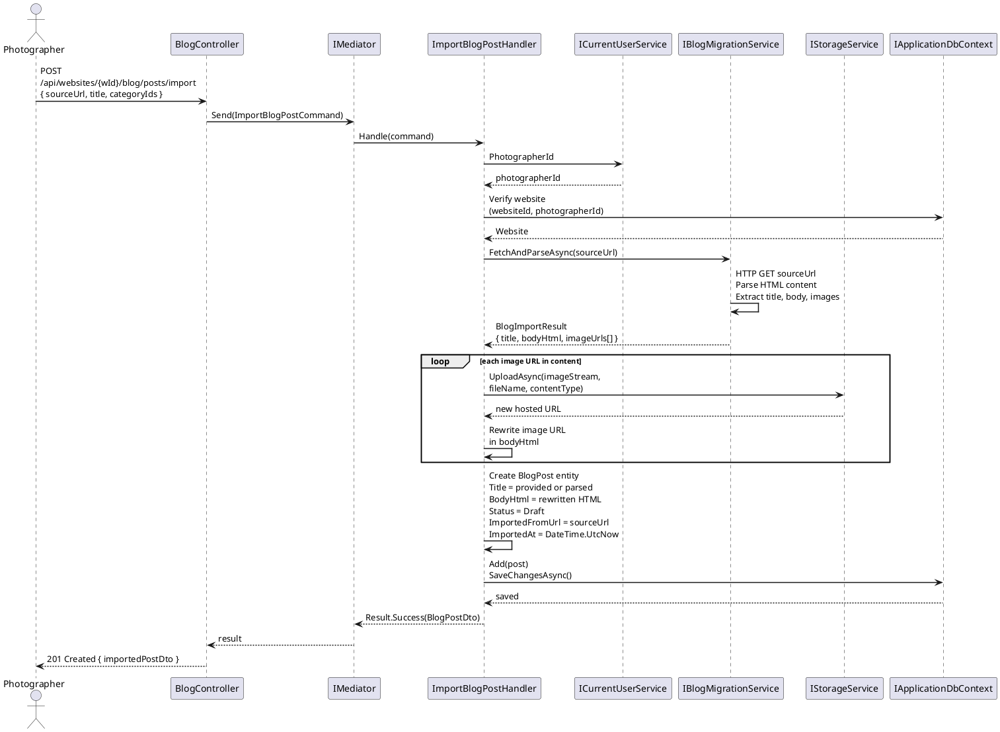
```plantuml
@startuml
skinparam sequenceArrowThickness 1.5
skinparam maxMessageSize 200

actor Photographer as P
participant "BlogController" as C
participant "IMediator" as M
participant "ImportBlogPostHandler" as H
participant "ICurrentUserService" as U
participant "IBlogMigrationService" as MS
participant "IStorageService" as SS
participant "IApplicationDbContext" as DB

P -> C : POST /api/websites/{wId}/blog/posts/import\n{ sourceUrl, title, categoryIds }
C -> M : Send(ImportBlogPostCommand)
M -> H : Handle(command)
H -> U : PhotographerId
U --> H : photographerId

H -> DB : Verify website\n(websiteId, photographerId)
DB --> H : Website

H -> MS : FetchAndParseAsync(sourceUrl)
MS -> MS : HTTP GET sourceUrl\nParse HTML content\nExtract title, body, images
MS --> H : BlogImportResult\n{ title, bodyHtml, imageUrls[] }

loop each image URL in content
  H -> SS : UploadAsync(imageStream,\nfileName, contentType)
  SS --> H : new hosted URL
  H -> H : Rewrite image URL\nin bodyHtml
end

H -> H : Create BlogPost entity\nTitle = provided or parsed\nBodyHtml = rewritten HTML\nStatus = Draft\nImportedFromUrl = sourceUrl\nImportedAt = DateTime.UtcNow

H -> DB : Add(post)\nSaveChangesAsync()
DB --> H : saved

H --> M : Result.Success(BlogPostDto)
M --> C : result
C --> P : 201 Created { importedPostDto }

@enduml
```

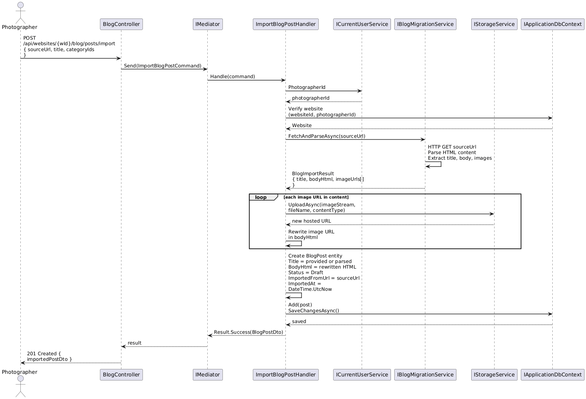

### Publish Scheduled Posts (Background Job)

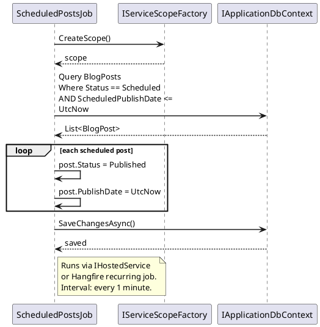
```plantuml
@startuml
skinparam sequenceArrowThickness 1.5
skinparam maxMessageSize 200

participant "ScheduledPostsJob" as J
participant "IServiceScopeFactory" as F
participant "IApplicationDbContext" as DB

J -> F : CreateScope()
F --> J : scope

J -> DB : Query BlogPosts\nWhere Status == Scheduled\nAND ScheduledPublishDate <= UtcNow
DB --> J : List<BlogPost>

loop each scheduled post
  J -> J : post.Status = Published
  J -> J : post.PublishDate = UtcNow
end

J -> DB : SaveChangesAsync()
DB --> J : saved

note right of J
  Runs via IHostedService
  or Hangfire recurring job.
  Interval: every 1 minute.
end note

@enduml
```

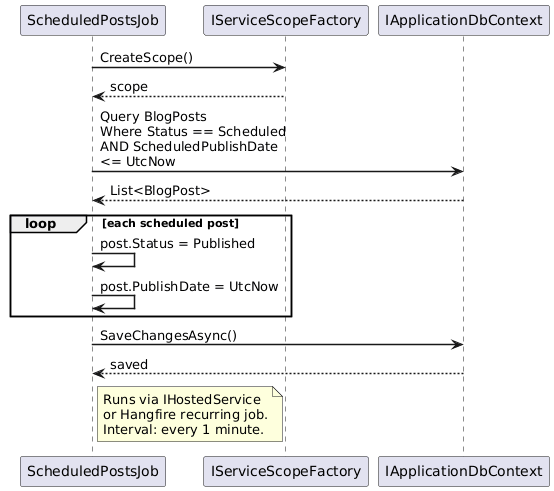
