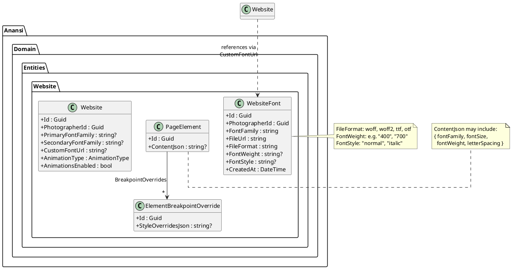
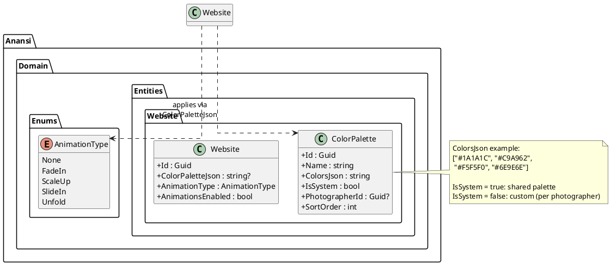
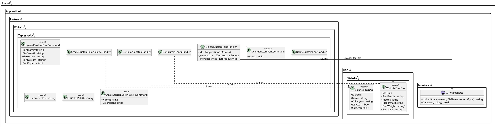
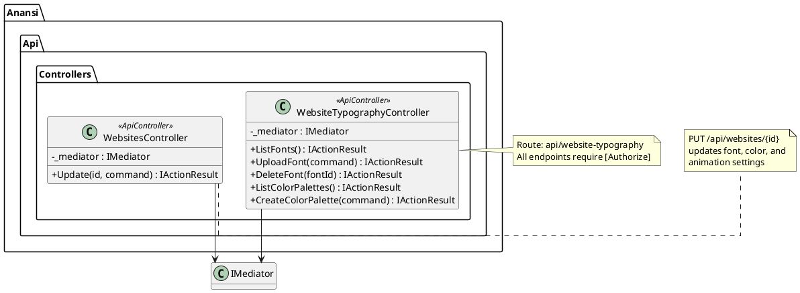
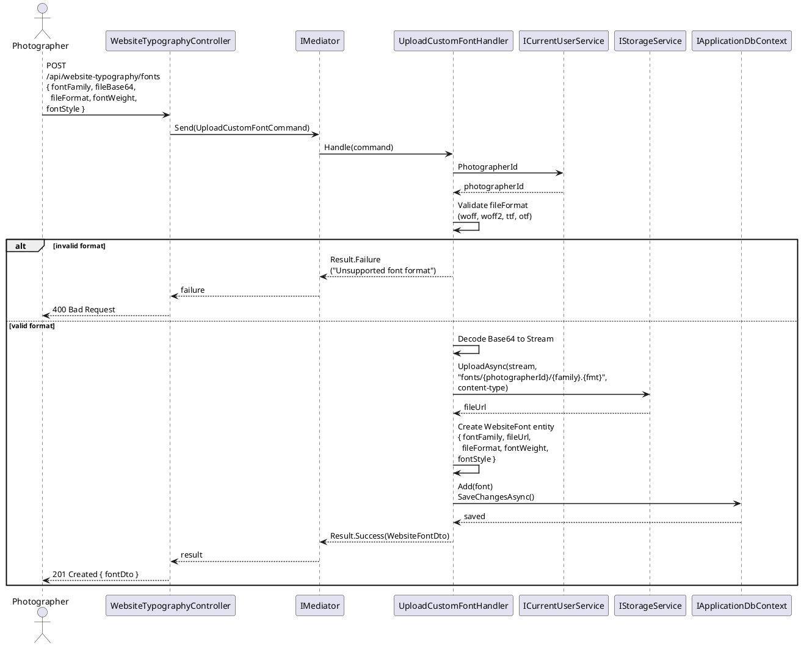
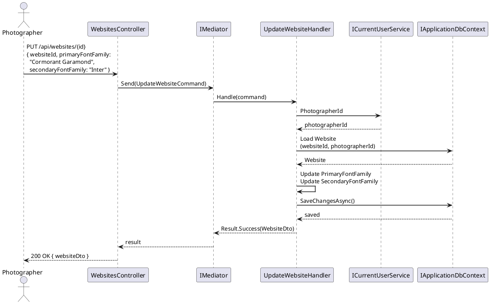
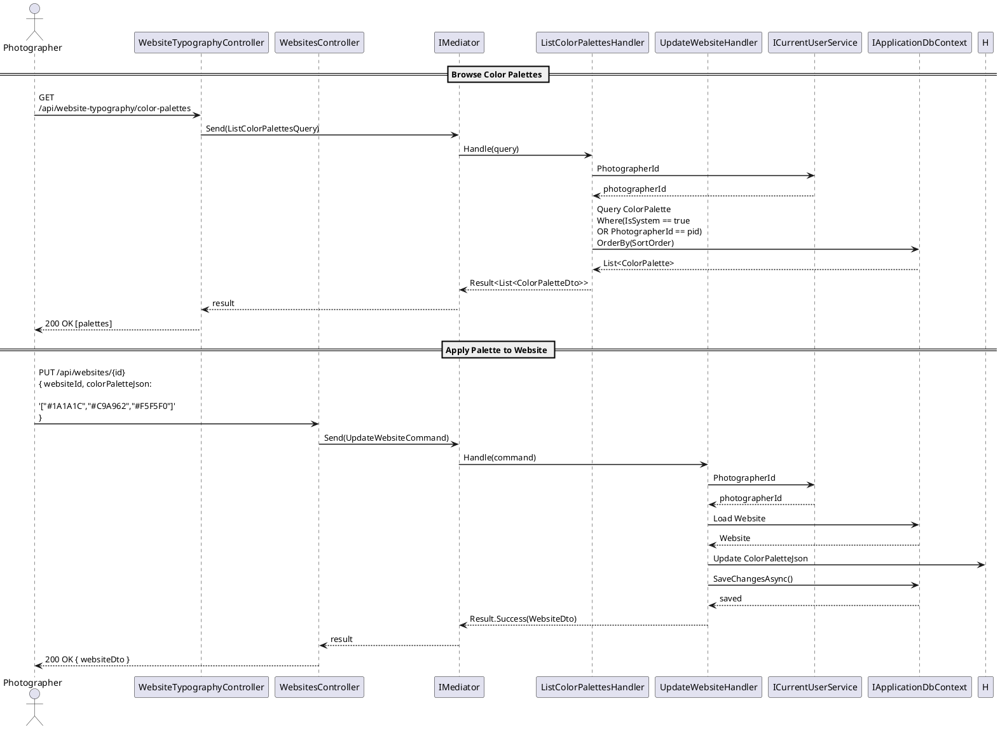
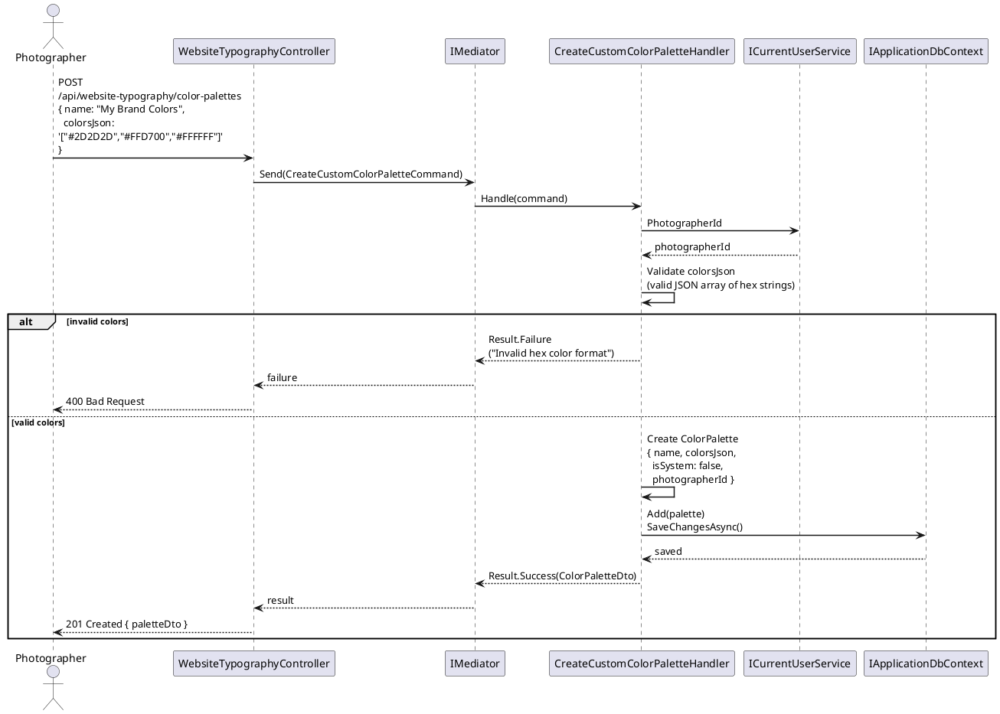
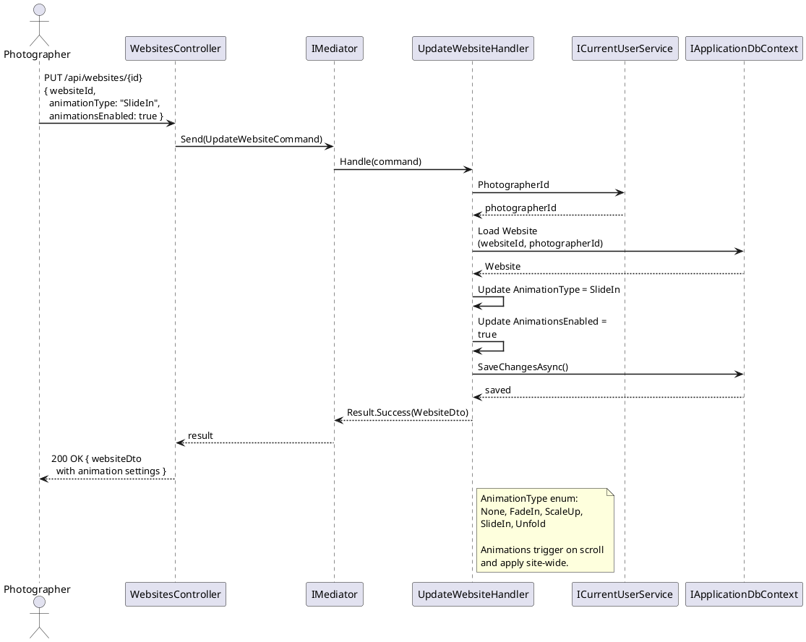
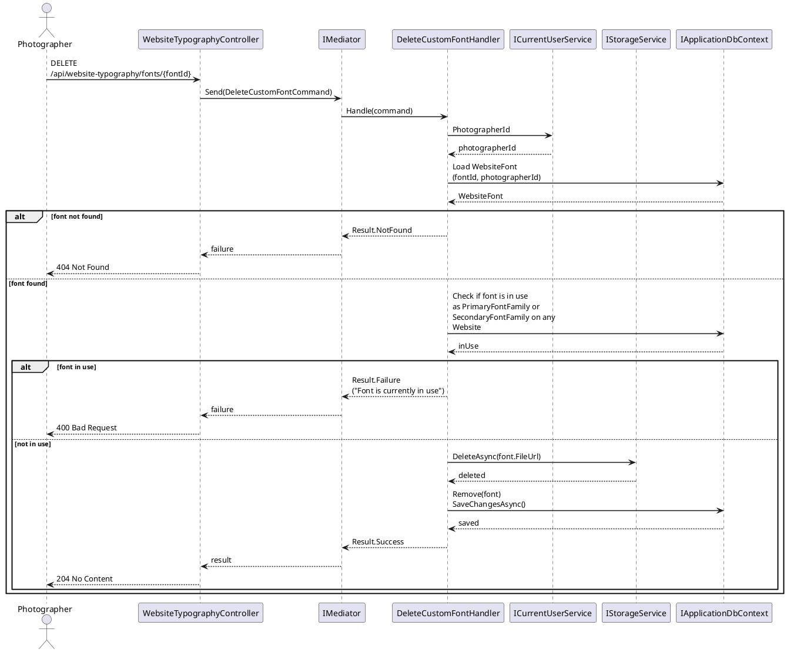

# F19 - Website Design & Typography

## Overview

The Website Design & Typography feature provides photographers with comprehensive visual customization tools for their websites. It covers three subsystems: the Font System, the Color System, and Scroll Animations, all of which work together to give photographers full control over their site's visual identity without requiring design expertise.

The Font System (WEB-3.4.1) offers a library of over 1,000 font families (sourced from Google Fonts or a similar CDN) plus the ability to upload custom fonts in WOFF, WOFF2, TTF, and OTF formats. Font properties -- family, size, weight, and letter spacing -- are configurable at the site-wide level (primary and secondary font families on the `Website` entity) or per individual element (through `ContentJson` style overrides on `PageElement`). Curated font themes bundle complementary display and body typefaces for one-click application across the entire site.

The Color System (WEB-3.4.2) provides at least 40 predefined color palettes with over 200 color combinations. Colors can be applied at three levels: entire site (via `ColorPaletteJson` on the `Website` entity), individual blocks (via element-level style overrides), or selected text ranges (via inline style data in the rich text content). Photographers can also enter custom hex colors. The `ColorPalette` entity stores both system-provided palettes and photographer-created custom palettes.

Scroll Animations (WEB-3.4.3) offer four site-wide animation types -- fade in, scale up, slide in, and unfold -- that trigger as elements scroll into the viewport. Animations are configured on the `Website` entity via `AnimationType` and `AnimationsEnabled`, providing a simple toggle between animated and static presentations.

## Components

### Domain Layer

**Website** (typography/design properties) -- The `Website` entity holds site-wide design configuration: `PrimaryFontFamily` and `SecondaryFontFamily` for typography, `CustomFontUrl` for uploaded custom fonts, `ColorPaletteJson` for the active color scheme, `AnimationType` (from the `AnimationType` enum), and `AnimationsEnabled` for the global animation toggle.

**WebsiteFont** (`Anansi.Domain.Entities.Website.WebsiteFont`) -- Represents a custom-uploaded font file. Contains `FontFamily` (the CSS font-family name), `FileUrl` (storage location), `FileFormat` (woff, woff2, ttf, otf), and optional `FontWeight` and `FontStyle` metadata. Implements `ITenantEntity` for per-photographer scoping.

**ColorPalette** (`Anansi.Domain.Entities.Website.ColorPalette`) -- Represents a color palette, either system-provided or custom. The `ColorsJson` field stores a JSON array of hex color values. `IsSystem` distinguishes between built-in palettes (shared across all users) and custom palettes created by individual photographers. `PhotographerId` is null for system palettes.

### Application Layer

**ListCustomFontsQuery / ListCustomFontsHandler** -- Returns all custom-uploaded fonts for the current photographer. System fonts (the 1,000+ library) are served statically from the CDN and not stored in the database.

**UploadCustomFontCommand / UploadCustomFontHandler** -- Uploads a custom font file to storage and creates a `WebsiteFont` record. Validates file format (WOFF, WOFF2, TTF, OTF), extracts font metadata, and stores the file via `IStorageService`.

**DeleteCustomFontCommand / DeleteCustomFontHandler** -- Deletes a custom font record and removes the file from storage. Validates that the font is not currently in use as a primary or secondary font on any website.

**ApplyFontThemeCommand / ApplyFontThemeHandler** -- Applies a curated font theme to a website. Updates `PrimaryFontFamily` and `SecondaryFontFamily` on the `Website` entity.

**UpdateWebsiteTypographyCommand / UpdateWebsiteTypographyHandler** -- Updates font-related properties on a website: primary font, secondary font, and custom font URL. Per-element typography is handled through `UpdateElementCommand` by modifying the element's `ContentJson` or `StyleOverridesJson`.

**ListColorPalettesQuery / ListColorPalettesHandler** -- Returns all available color palettes: system palettes plus custom palettes belonging to the current photographer.

**CreateCustomColorPaletteCommand / CreateCustomColorPaletteHandler** -- Creates a custom color palette for the photographer. Validates hex color format for all colors in the array.

**DeleteCustomColorPaletteCommand / DeleteCustomColorPaletteHandler** -- Deletes a photographer-created custom palette. System palettes cannot be deleted.

**ApplyColorPaletteCommand / ApplyColorPaletteHandler** -- Applies a color palette to a website by updating `ColorPaletteJson`. Can apply to the entire site or to individual elements.

**UpdateAnimationSettingsCommand / UpdateAnimationSettingsHandler** -- Updates the `AnimationType` and `AnimationsEnabled` properties on a website. This is a subset of `UpdateWebsiteCommand` but may be invoked independently from the design settings panel.

### Infrastructure Layer

**EF Core Configurations** -- `WebsiteFont` configuration indexes on `PhotographerId` for listing queries. `ColorPalette` configuration indexes on `(IsSystem, SortOrder)` for catalog queries and `(PhotographerId)` for custom palette lookups.

**FontStorageService** -- Infrastructure component that handles font file upload to blob storage, returning the public URL for the `FileUrl` field. Validates file size limits and format before upload.

### API Layer

**WebsiteTypographyController** (`api/website-typography`) -- Endpoints for font and color management. `GET fonts` lists custom fonts, `POST fonts` uploads a custom font, `DELETE fonts/{id}` removes a custom font, `GET color-palettes` lists all palettes, `POST color-palettes` creates a custom palette.

**WebsitesController** -- The `PUT /api/websites/{id}` endpoint handles updates to typography and animation settings as part of the general website update flow.

## Class Diagrams

### Domain Layer -- Font System

### Domain Layer -- Color System & Animations

### Application Layer -- Typography Commands & Queries

### API Layer -- WebsiteTypographyController

## Sequence Diagrams

### Upload a Custom Font (WEB-3.4.1)

### Apply a Font Theme to Website (WEB-3.4.1)

### List and Apply a Color Palette (WEB-3.4.2)

### Create a Custom Color Palette (WEB-3.4.2)

### Configure Scroll Animations (WEB-3.4.3)

### Delete a Custom Font with Usage Check (WEB-3.4.1)

