# F20 - SEO & Discovery

## Overview

The SEO & Discovery feature equips photographers with tools to optimize their websites for search engines and social media sharing. Poor SEO is a common gap in photographer websites, and this feature addresses it through both manual controls and AI-assisted automation.

The SEO Manager (WEB-3.5.1) provides a centralized dashboard where photographers can edit page titles and meta descriptions for every page, run SEO audits that flag missing titles, descriptions, and alt text, and manage all SEO settings from one place. The audit produces an actionable report of issues organized by page, enabling photographers to systematically address gaps without navigating to each page individually.

AI-powered tools assist with two common SEO tasks. AI Alt Text Generation (WEB-3.5.2) automatically generates descriptive alt text for images, supporting both individual and bulk operations, with all generated text editable before saving. AI Page Description Generation (WEB-3.5.3) creates meta descriptions from page content, also editable before committing. Both features depend on an `IAiContentService` interface that abstracts the underlying AI provider.

URL Redirects (WEB-3.5.4) allow photographers to create 301 (permanent) or 302 (temporary) redirects with configurable source and destination URLs, supporting site restructuring without breaking existing links. Social Sharing Images (WEB-3.5.5) enable custom Open Graph image configuration per page, controlling how pages appear when shared on social media platforms.

## Components

### Domain Layer

**WebsitePage** (SEO properties) -- The `WebsitePage` entity stores per-page SEO metadata: `MetaTitle`, `MetaDescription`, and `OgImageUrl`. These fields are managed through the SEO Manager dashboard and surface in the generated HTML `<head>` section.

**Website** (SEO defaults) -- The `Website` entity stores site-wide defaults: `DefaultMetaTitle`, `DefaultMetaDescription`, and `DefaultOgImageUrl`. These apply as fallbacks when individual pages lack specific SEO metadata.

**PageElement** (alt text) -- Image-type `PageElement` entities store alt text within their `ContentJson` field. The SEO audit inspects these for missing or empty alt text values.

**UrlRedirect** (`Anansi.Domain.Entities.Website.UrlRedirect`) -- Represents a URL redirect rule. Contains `SourcePath` (the old URL path), `DestinationUrl` (the target URL), `RedirectType` (from the `RedirectType` enum: Permanent301, Temporary302), and `IsActive` toggle. Implements `ITenantEntity` for per-photographer scoping.

**BlogPost** (SEO properties) -- Blog posts also have `MetaTitle`, `MetaDescription`, and `OgImageUrl` fields included in the SEO audit scan.

### Application Layer

**RunSeoAuditQuery / RunSeoAuditHandler** -- Scans all pages and blog posts for a website, identifying SEO issues: missing meta titles, missing meta descriptions, images without alt text. Returns `SeoAuditResultDto` containing a list of `SeoIssueDto` entries with page identification, issue type, and description.

**UpdatePageSeoCommand / UpdatePageSeoHandler** -- Updates SEO metadata (MetaTitle, MetaDescription, OgImageUrl) for a specific page. Part of the SEO Manager's per-page editing flow.

**GenerateAiAltTextCommand / GenerateAiAltTextHandler** -- Generates alt text for one or more images using AI. Accepts a list of image element IDs or image URLs. Calls `IAiContentService.GenerateAltTextAsync()` for each image. Returns the generated alt text without saving, allowing the photographer to review and edit before committing.

**SaveAltTextCommand / SaveAltTextHandler** -- Saves reviewed/edited alt text to the `ContentJson` of image elements. Accepts a list of `(elementId, altText)` pairs for bulk saving.

**GenerateAiDescriptionCommand / GenerateAiDescriptionHandler** -- Generates a meta description for a page based on its content. Aggregates text content from all `PageElement` entities on the page, sends it to `IAiContentService.GenerateDescriptionAsync()`, and returns the generated description without saving.

**CreateUrlRedirectCommand / CreateUrlRedirectHandler** -- Creates a new URL redirect. Validates that the source path does not conflict with existing page slugs or other active redirects. Returns `UrlRedirectDto`.

**UpdateUrlRedirectCommand / UpdateUrlRedirectHandler** -- Updates an existing redirect's source path, destination URL, redirect type, or active status.

**DeleteUrlRedirectCommand / DeleteUrlRedirectHandler** -- Deletes a URL redirect.

**ListUrlRedirectsQuery / ListUrlRedirectsHandler** -- Returns all redirects for a website, ordered by creation date.

**UpdateOgImageCommand / UpdateOgImageHandler** -- Uploads or sets a custom Open Graph image for a specific page. Stores the URL in `WebsitePage.OgImageUrl`.

### Infrastructure Layer

**AiContentService** -- Infrastructure implementation of `IAiContentService` that calls an external AI API (e.g., OpenAI) for alt text generation and page description generation. Handles rate limiting, retries, and response parsing.

**EF Core Configurations** -- `UrlRedirect` configuration defines indexes on `(WebsiteId, SourcePath)` for fast redirect resolution and uniqueness validation. The redirect middleware uses this index to intercept incoming requests.

**RedirectMiddleware** -- ASP.NET Core middleware that intercepts incoming requests, checks for matching active redirects, and returns the appropriate 301 or 302 response before the request reaches the controller pipeline.

### API Layer

**WebsiteSeoController** (`api/websites/{websiteId}/seo`) -- Centralized SEO management endpoints. `GET audit` runs the SEO audit, `POST ai-alt-text` generates AI alt text, `POST ai-description/{pageId}` generates AI page descriptions, `GET redirects` lists redirects, `POST redirects` creates, `PUT redirects/{id}` updates, and `DELETE redirects/{id}` removes redirects.

**WebsitePagesController** -- The `PUT` endpoint for pages handles SEO metadata updates and OG image configuration as part of the page update flow.

## Class Diagrams

### Domain Layer -- SEO Entities

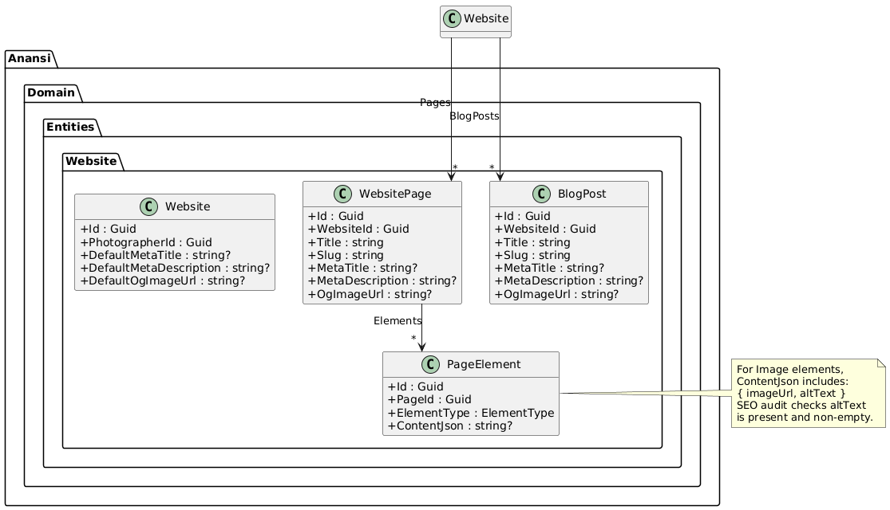

### Domain Layer -- URL Redirects

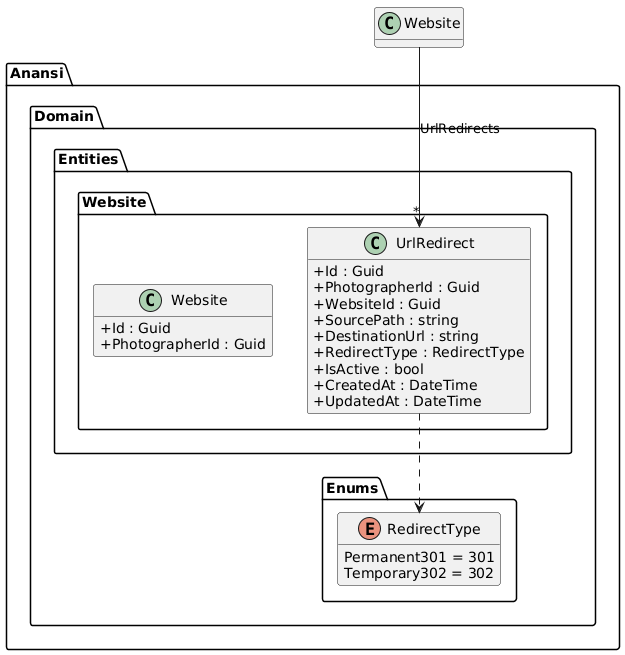

### Application Layer -- SEO Audit & AI Content

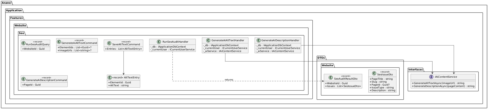

### Application Layer -- URL Redirect Commands

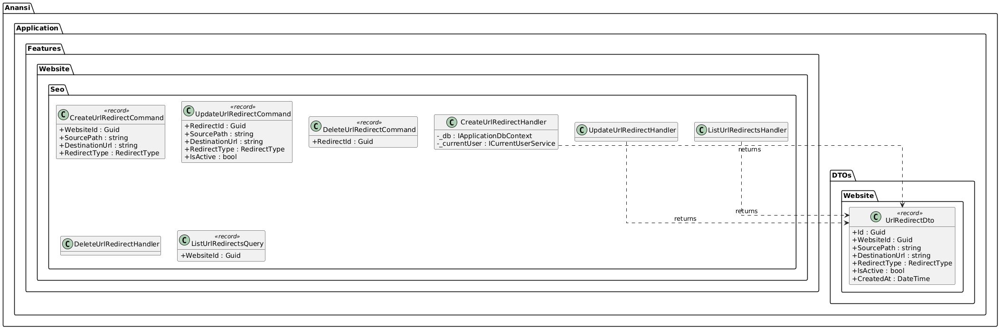

### API & Infrastructure Layer

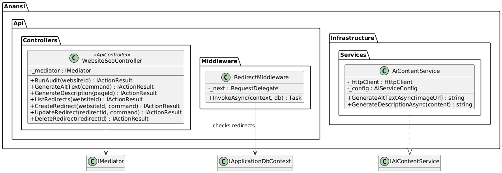

## Sequence Diagrams

### Run SEO Audit (WEB-3.5.1)

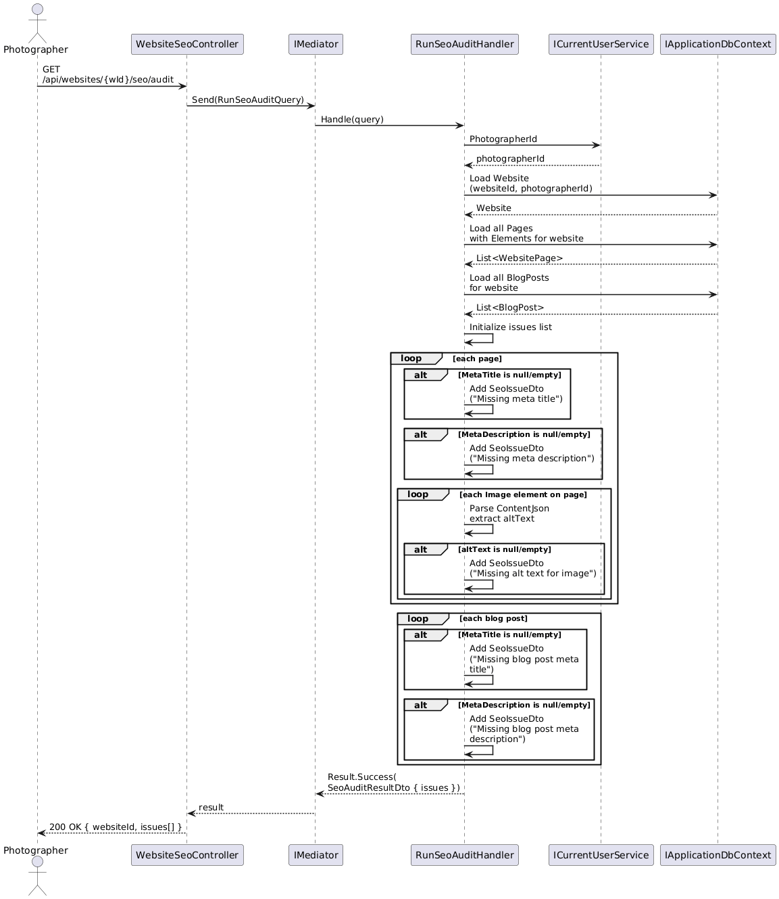

### Generate AI Alt Text for Images (WEB-3.5.2)

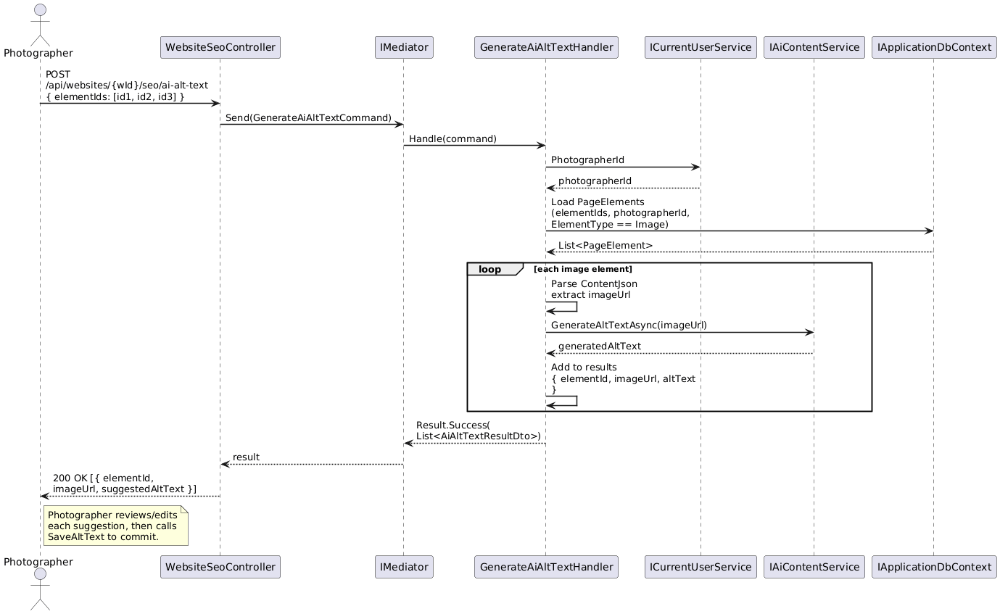

### Save Reviewed Alt Text (WEB-3.5.2)

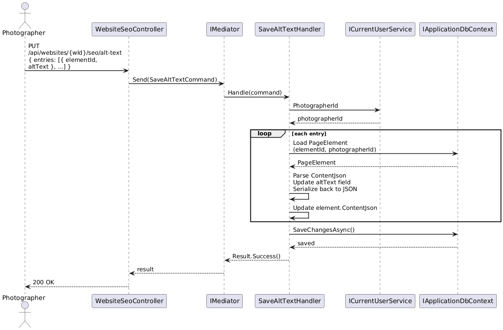

### Generate AI Page Description (WEB-3.5.3)

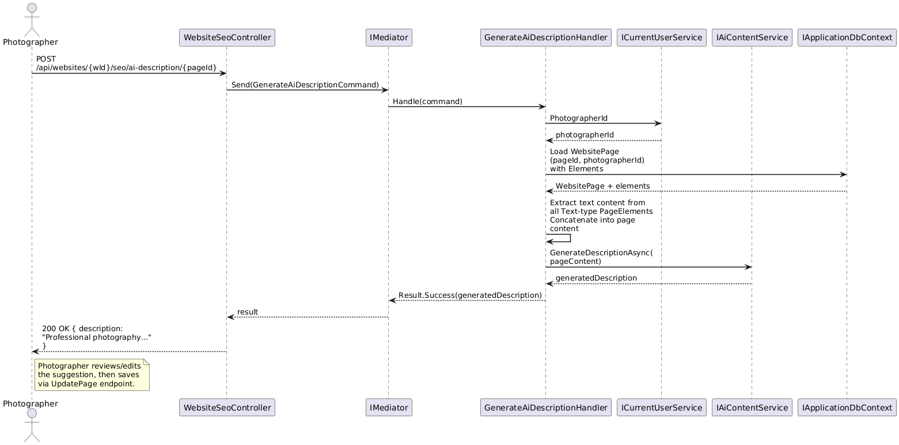

### Create a URL Redirect (WEB-3.5.4)

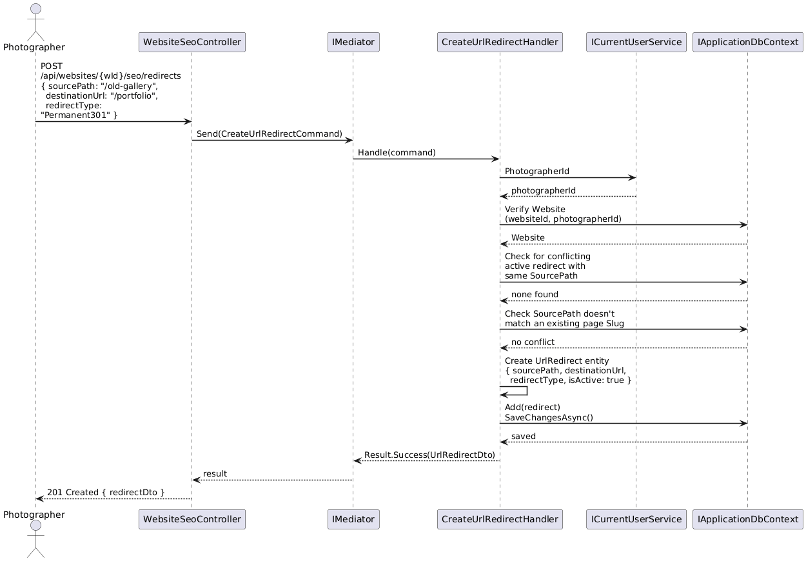

### URL Redirect Middleware Resolution

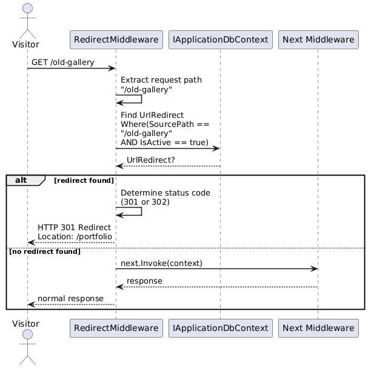

### Configure Open Graph Image (WEB-3.5.5)

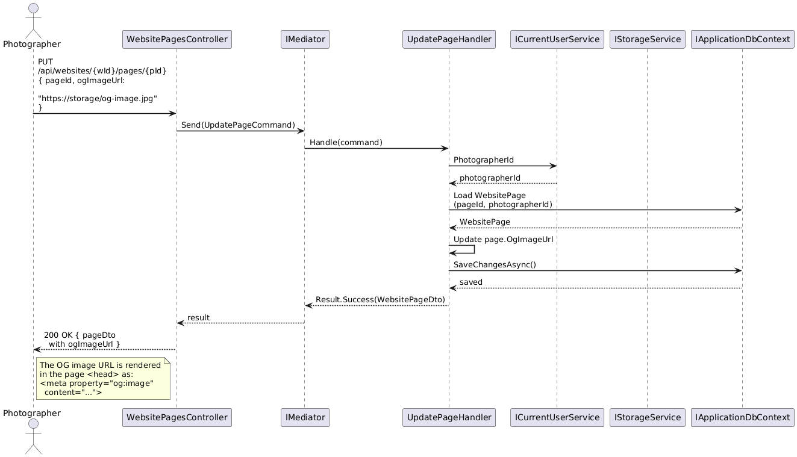
