# F21 - Website Hosting & Domains

## Overview

This feature provides the hosting infrastructure and domain management capabilities for every photographer website on the Anansi platform. Every published website receives free, unlimited hosting with no bandwidth limits or throttling. SSL certificates are automatically provisioned and renewed for all sites, ensuring every visitor connection is encrypted without requiring any photographer action.

Each photographer is assigned a free platform subdomain (username.anansi.com) derived from their `Subdomain` field on the `Photographer` entity. Photographers on paid plans can connect a custom domain -- either an apex domain or a subdomain -- by following step-by-step DNS instructions. The platform verifies DNS propagation, provisions an SSL certificate for the custom domain, and begins serving the website at the new address. The `CustomDomain` entity in the Branding namespace tracks verification state, SSL certificate lifecycle, and DNS instructions.

Security features complement the hosting layer. Password protection can be applied at the entire-site level (stored on `Website.SitePasswordHash`) or per-page (stored on `WebsitePage.PagePasswordHash`). Right-click image protection is enabled by default, suppressing the browser context menu on images to discourage casual downloading; it is toggleable via Settings > Advanced and stored as `Website.RightClickProtectionEnabled`.

**L2 Requirements:** WEB-3.6.1 (Hosting), WEB-3.6.2 (Custom Domain), WEB-3.6.3 (Password Protection), WEB-3.6.4 (Right-Click Protection)

---

## Components

### Domain Layer

| Component | Type | Description |
|-----------|------|-------------|
| `Website` | Entity | Core website entity. Stores `Subdomain`, `SslEnabled`, `CustomDomain`, `CustomDomainVerified`, `SitePasswordHash`, and `RightClickProtectionEnabled`. Implements `ITenantEntity`, `ISoftDeletable`, `IAuditableEntity`. |
| `WebsitePage` | Entity | Individual page within a website. Stores `PagePasswordHash` for per-page password protection (WEB-3.6.3). |
| `CustomDomain` | Entity | Tracks custom domain setup including `DomainName`, `Purpose`, `IsVerified`, `SslStatus`, `SslCertificateId`, `SslExpiresAt`, `DnsInstructions`, and `VerificationToken`. |
| `DomainPurpose` | Enum | `Gallery`, `Website` -- distinguishes custom domain usage. |
| `SslStatus` | Enum | `Pending`, `Active`, `Expired`, `Failed` -- tracks SSL certificate lifecycle. |
| `WebsiteStatus` | Enum | `Draft`, `Published`, `Archived` -- controls whether a site is publicly accessible. |

### Application Layer

| Component | Type | Description |
|-----------|------|-------------|
| `ConfigureSubdomainCommand` | Command | Sets or updates the photographer's platform subdomain. Validates uniqueness. |
| `ConnectCustomDomainCommand` | Command | Initiates custom domain connection: validates plan tier, creates `CustomDomain` record, generates DNS instructions and verification token. |
| `VerifyCustomDomainCommand` | Command | Checks DNS propagation for the domain, updates `IsVerified`, triggers SSL provisioning. |
| `RemoveCustomDomainCommand` | Command | Disconnects a custom domain, revokes SSL certificate, deletes the `CustomDomain` record. |
| `GetDnsInstructionsQuery` | Query | Returns step-by-step DNS configuration instructions for a pending custom domain. |
| `SetSitePasswordCommand` | Command | Hashes and stores a password for the entire website (`Website.SitePasswordHash`). |
| `SetPagePasswordCommand` | Command | Hashes and stores a password for a specific page (`WebsitePage.PagePasswordHash`). |
| `RemovePasswordCommand` | Command | Removes password protection from a site or specific page. |
| `ValidateSitePasswordCommand` | Command | Validates a visitor-provided password against the stored hash. Returns an access cookie/token on success. |
| `UpdateRightClickProtectionCommand` | Command | Toggles `RightClickProtectionEnabled` on the `Website` entity. |
| `GetHostingStatusQuery` | Query | Returns hosting details: subdomain URL, custom domain status, SSL status, protection settings. |
| `ISslService` | Interface | Provisions and renews SSL certificates. Methods: `ProvisionAsync`, `RenewAsync`, `RevokeAsync`. |
| `IDnsVerificationService` | Interface | Checks DNS records. Methods: `VerifyAsync`, `GenerateInstructionsAsync`. |
| `IPlanGateService` | Interface | Checks whether the photographer's current plan supports a given feature (e.g., custom domains). |

### Infrastructure Layer

| Component | Type | Description |
|-----------|------|-------------|
| `ConnectCustomDomainHandler` | Handler | Validates paid plan via `IPlanGateService`, creates `CustomDomain` entity, calls `IDnsVerificationService.GenerateInstructionsAsync` for DNS instructions. |
| `VerifyCustomDomainHandler` | Handler | Calls `IDnsVerificationService.VerifyAsync`. On success, calls `ISslService.ProvisionAsync` and updates `CustomDomain.SslStatus`. |
| `SslService` | Service | Implements `ISslService`. Integrates with Let's Encrypt (or similar ACME provider) for certificate provisioning and renewal. |
| `DnsVerificationService` | Service | Implements `IDnsVerificationService`. Queries DNS records to verify CNAME/A record configuration. |
| `SslRenewalBackgroundService` | Background Service | Periodic job that checks `CustomDomain.SslExpiresAt` and renews certificates approaching expiration. |
| `PasswordHashingService` | Service | Uses BCrypt to hash and verify site/page passwords. |

### API Layer

| Component | Type | Description |
|-----------|------|-------------|
| `HostingController` | Controller | Endpoints: `GET /api/websites/{id}/hosting` (status), `PUT /api/websites/{id}/subdomain`, `POST /api/websites/{id}/domain` (connect), `POST /api/websites/{id}/domain/verify`, `DELETE /api/websites/{id}/domain`. All require `[Authorize]`. |
| `WebsiteSecurityController` | Controller | Endpoints: `PUT /api/websites/{id}/password`, `DELETE /api/websites/{id}/password`, `PUT /api/websites/{id}/pages/{pageId}/password`, `DELETE /api/websites/{id}/pages/{pageId}/password`, `PUT /api/websites/{id}/right-click-protection`. All require `[Authorize]`. |
| `SiteAccessController` | Controller | Public endpoint: `POST /api/sites/{subdomain}/access` -- validates visitor password, returns access token/cookie. |
| `SiteRenderMiddleware` | Middleware | Intercepts requests to `*.anansi.com` and custom domains. Resolves the `Website` entity, checks publication status and password protection, injects right-click protection script if enabled. |

---

## Class Diagrams

### Domain Layer -- Hosting & Domain Entities

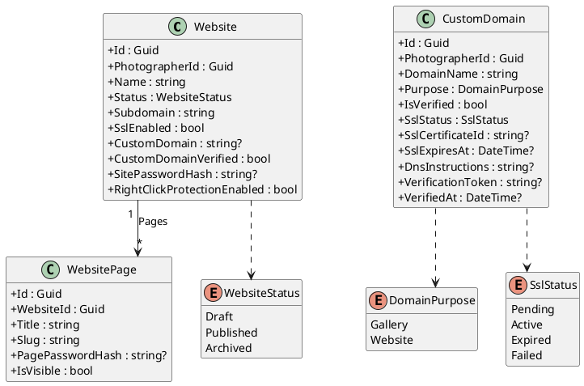

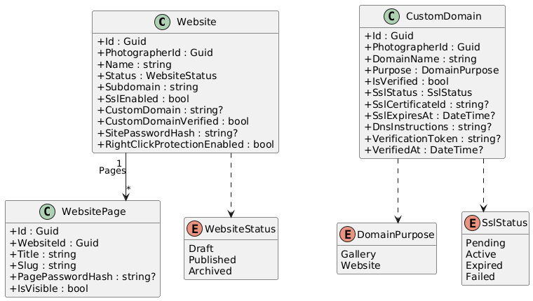

### Application Layer -- Hosting Commands & Interfaces

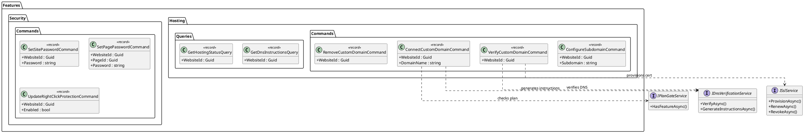

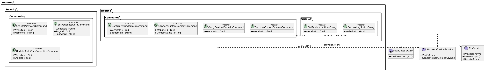

### Infrastructure Layer -- SSL & DNS Services

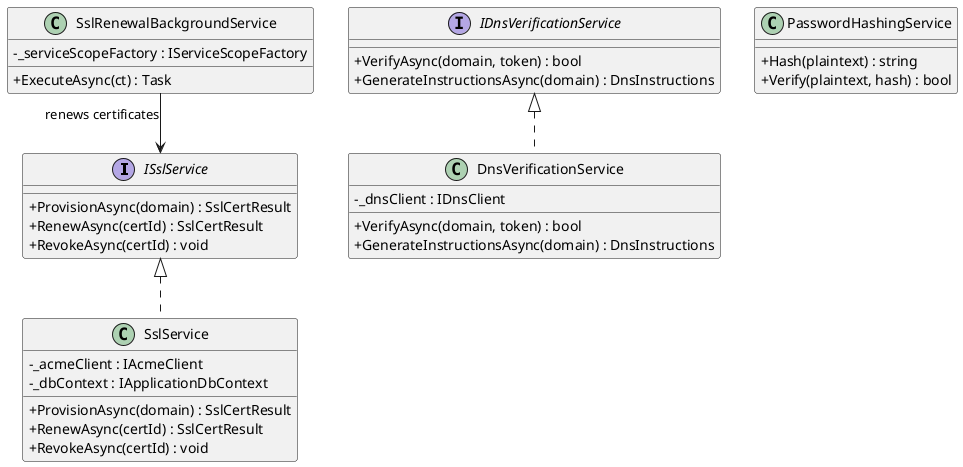

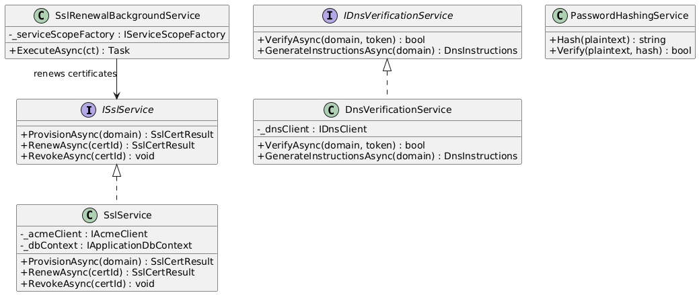

### API Layer -- Hosting & Security Controllers

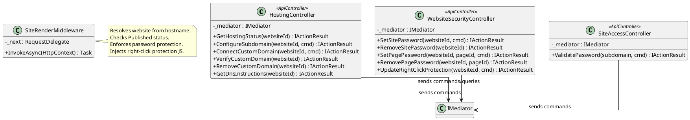

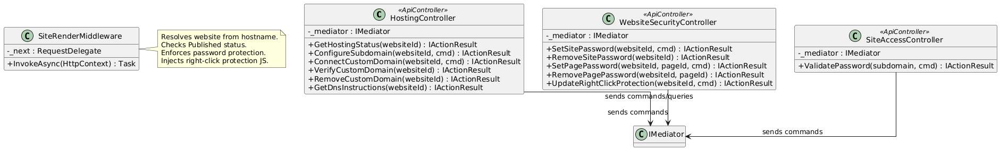

---

## Sequence Diagrams

### Connect Custom Domain

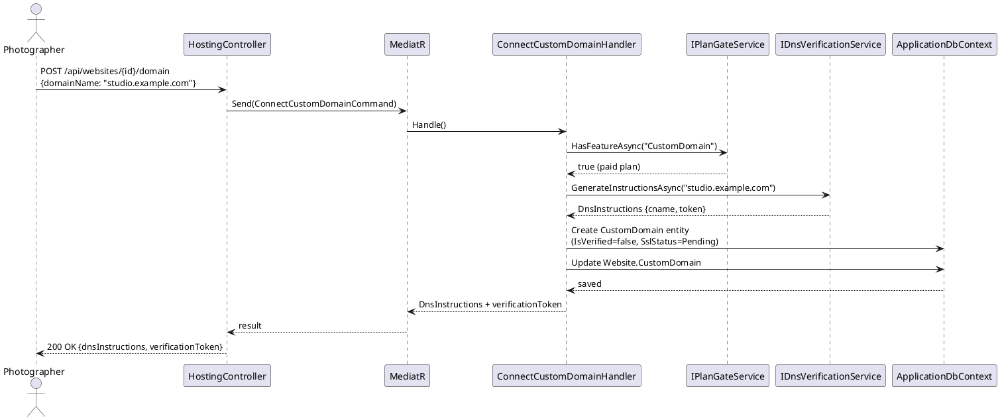

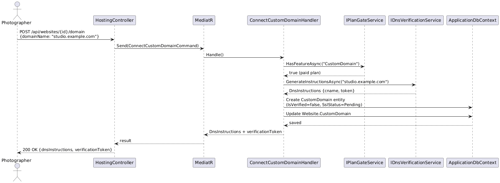

### Verify Custom Domain & Provision SSL

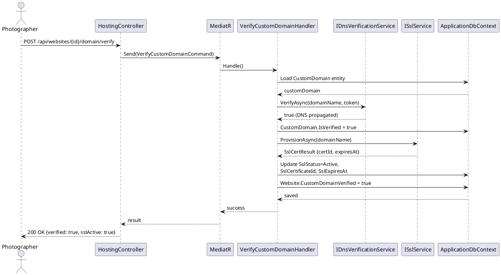

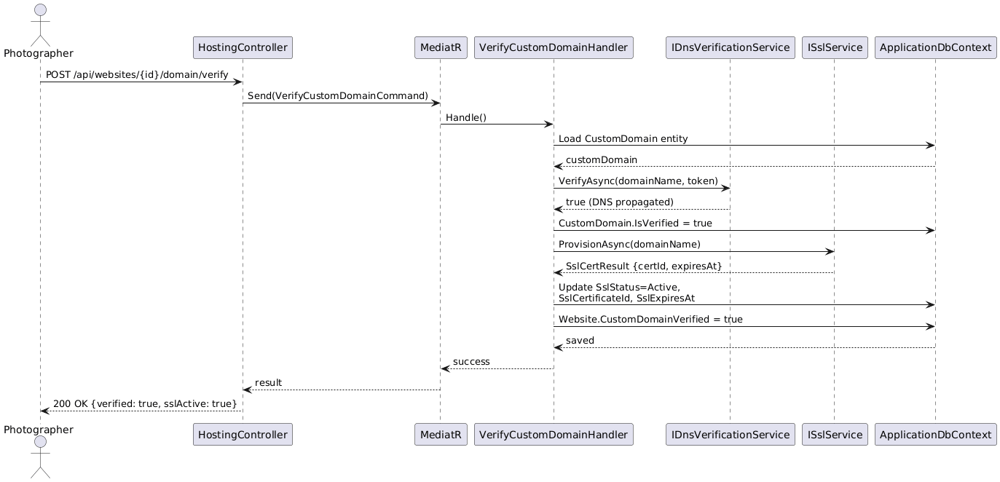

### Visitor Accesses Password-Protected Site

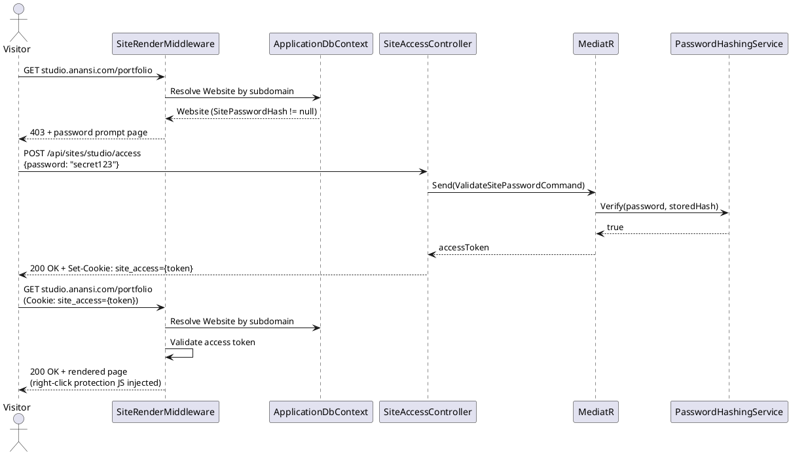

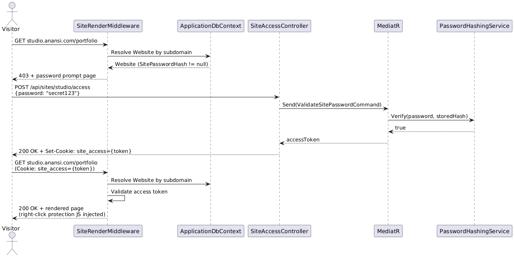

### SSL Certificate Auto-Renewal

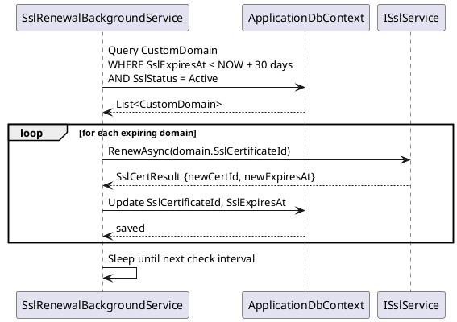

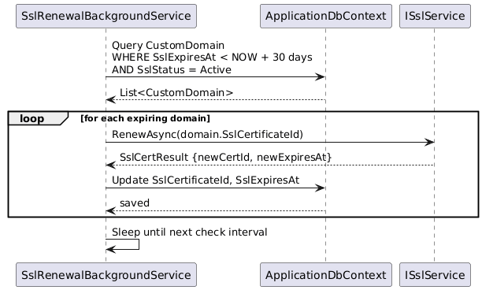
