# F22 - Website Analytics

## Overview

This feature delivers both built-in and third-party analytics capabilities for photographer websites. Built-in analytics (available on Plus and Pro plans) collect visitor data -- total visitors, unique visitors, page views, geographic distribution, session duration, and top pages -- and surface it through a filterable dashboard that updates within 24 hours of activity. Data is aggregated into daily `WebsiteAnalyticsSnapshot` records to keep query performance predictable and storage efficient.

Third-party analytics integration is configuration-only: photographers enter their Google Analytics GA4 Measurement ID or Facebook Pixel ID, and the platform injects the corresponding tracking scripts into every page of their website automatically. No manual code injection is required. The GA4 integration activates standard page-view tracking across all pages; the Facebook Pixel integration fires the standard `PageView` event on every page load.

The analytics pipeline consists of three layers: a lightweight event collector that records raw page hits, a background aggregation service that rolls raw events into daily snapshots, and a query layer that serves the dashboard with date-range filtering. Raw events are retained for a configurable window (default 90 days) before being pruned. Third-party script injection is handled by the `SiteRenderMiddleware` at request time, reading the measurement/pixel IDs from the `Website` entity.

**L2 Requirements:** WEB-3.7.1 (Built-In Analytics), WEB-3.7.2 (Google Analytics Integration), WEB-3.7.3 (Facebook Pixel Integration)

---

## Components

### Domain Layer

| Component | Type | Description |
|-----------|------|-------------|
| `WebsiteAnalyticsSnapshot` | Entity | Daily aggregate of visitor metrics: `TotalVisitors`, `UniqueVisitors`, `PageViews`, `AverageSessionDurationSeconds`, `GeographicDistributionJson`, `TopPagesJson`. Keyed by `WebsiteId` and `Date`. Implements `ITenantEntity`. |
| `AnalyticsPageHit` | Entity | Raw page-view event: `WebsiteId`, `PagePath`, `VisitorFingerprint`, `IpAddress`, `UserAgent`, `CountryCode`, `SessionId`, `Timestamp`. Used for aggregation, then pruned. |
| `Website` | Entity (existing) | Stores `BuiltInAnalyticsEnabled`, `GoogleAnalyticsMeasurementId`, and `FacebookPixelId`. |

### Application Layer

| Component | Type | Description |
|-----------|------|-------------|
| `RecordPageHitCommand` | Command | Receives a raw page-view event from the collector endpoint. Writes an `AnalyticsPageHit` record. Runs without authentication (public-facing). |
| `GetAnalyticsDashboardQuery` | Query | Returns aggregated analytics for a website within a date range. Queries `WebsiteAnalyticsSnapshot` records and computes totals/averages. |
| `GetTopPagesQuery` | Query | Returns the top N pages by view count for a date range. |
| `GetGeographicDistributionQuery` | Query | Returns visitor distribution by country/region for a date range. |
| `UpdateGoogleAnalyticsCommand` | Command | Sets or clears the `GoogleAnalyticsMeasurementId` on the `Website` entity. |
| `UpdateFacebookPixelCommand` | Command | Sets or clears the `FacebookPixelId` on the `Website` entity. |
| `ToggleBuiltInAnalyticsCommand` | Command | Enables or disables built-in analytics. Validates that the photographer's plan supports it (Plus/Pro). |
| `IAnalyticsAggregationService` | Interface | Aggregates raw `AnalyticsPageHit` records into `WebsiteAnalyticsSnapshot` records. Methods: `AggregateAsync(date)`, `PruneRawEventsAsync(retentionDays)`. |
| `IGeoLocationService` | Interface | Resolves IP addresses to country codes. Method: `ResolveCountryAsync(ipAddress)`. |
| `IPlanGateService` | Interface | Validates plan-tier access to built-in analytics. |

### Infrastructure Layer

| Component | Type | Description |
|-----------|------|-------------|
| `RecordPageHitHandler` | Handler | Resolves country from IP via `IGeoLocationService`, generates visitor fingerprint from IP + UserAgent hash, writes `AnalyticsPageHit`. |
| `GetAnalyticsDashboardHandler` | Handler | Queries `WebsiteAnalyticsSnapshot` for the date range, sums totals, computes weighted average session duration. |
| `AnalyticsAggregationService` | Service | Implements `IAnalyticsAggregationService`. Groups raw events by date, computes unique visitors (distinct fingerprints), page views, session durations, top pages, and geographic distribution. Creates/updates `WebsiteAnalyticsSnapshot`. |
| `AnalyticsAggregationBackgroundService` | Background Service | Runs daily (or more frequently). Invokes `AggregateAsync` for the previous day, then `PruneRawEventsAsync`. |
| `GeoLocationService` | Service | Implements `IGeoLocationService`. Uses MaxMind GeoLite2 or similar IP-to-country database. |
| `AnalyticsPageHitConfiguration` | EF Config | Configures `AnalyticsPageHit` table with indexes on `WebsiteId`, `Timestamp`, and composite index on `(WebsiteId, Date)` for efficient aggregation. |
| `WebsiteAnalyticsSnapshotConfiguration` | EF Config | Configures unique constraint on `(WebsiteId, Date)`. |

### API Layer

| Component | Type | Description |
|-----------|------|-------------|
| `AnalyticsCollectorController` | Controller | Public endpoint: `POST /api/collect` -- receives page-hit events from the tracking script embedded in websites. Rate-limited. No authentication required. |
| `AnalyticsDashboardController` | Controller | Authenticated endpoints: `GET /api/websites/{id}/analytics` (dashboard), `GET /api/websites/{id}/analytics/top-pages`, `GET /api/websites/{id}/analytics/geo`. All accept `startDate` and `endDate` query parameters. Require `[Authorize]`. |
| `AnalyticsSettingsController` | Controller | Authenticated endpoints: `PUT /api/websites/{id}/analytics/builtin` (toggle), `PUT /api/websites/{id}/analytics/google` (set GA4 ID), `PUT /api/websites/{id}/analytics/facebook` (set Pixel ID). Require `[Authorize]`. |
| `SiteRenderMiddleware` (extended) | Middleware | When rendering website pages, injects: (1) built-in tracking script that posts to `/api/collect`, (2) GA4 `gtag.js` script if `GoogleAnalyticsMeasurementId` is set, (3) Facebook Pixel `fbq` script if `FacebookPixelId` is set. |

---

## Class Diagrams

### Domain Layer -- Analytics Entities

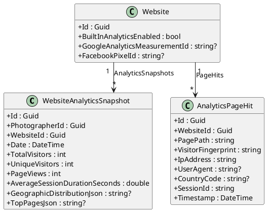

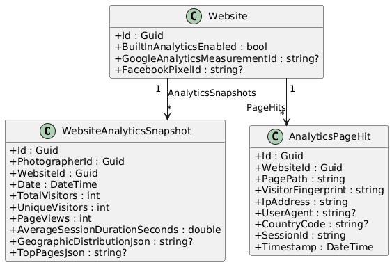

### Application Layer -- Analytics Commands & Queries

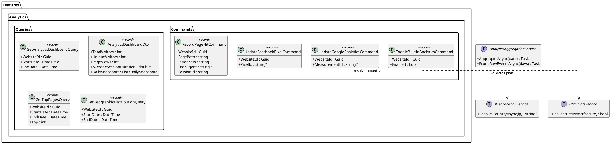

### Infrastructure Layer -- Aggregation & Geo Services

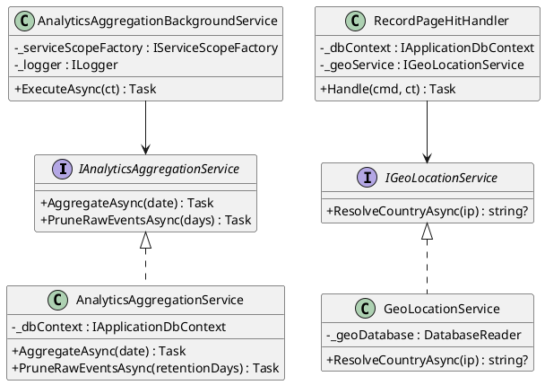

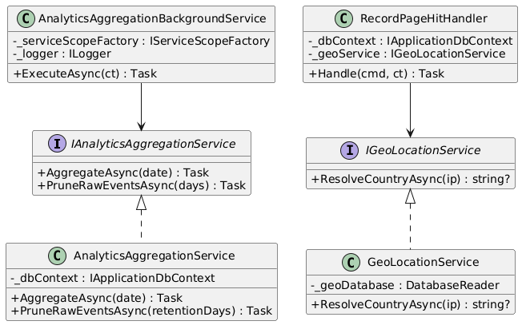

### API Layer -- Analytics Controllers

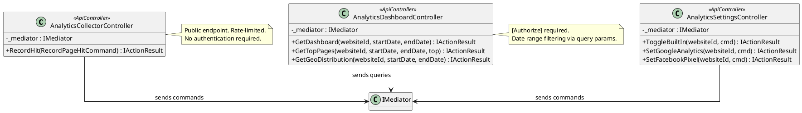

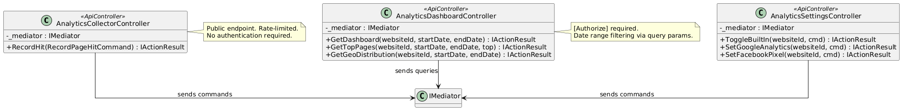

---

## Sequence Diagrams

### Record Page Hit (Built-In Tracking)

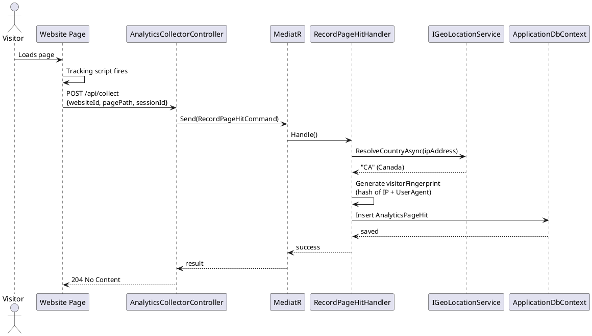

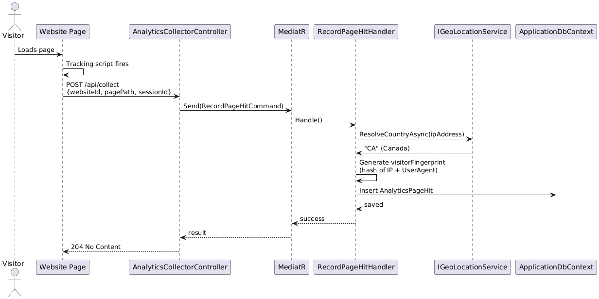

### Daily Analytics Aggregation

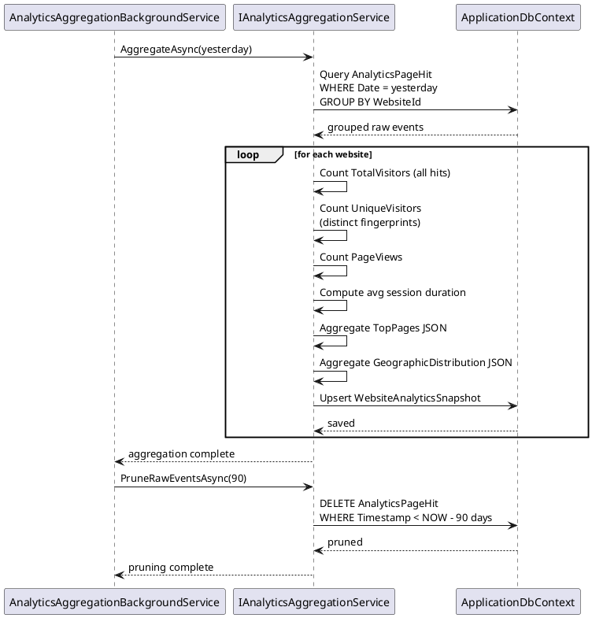

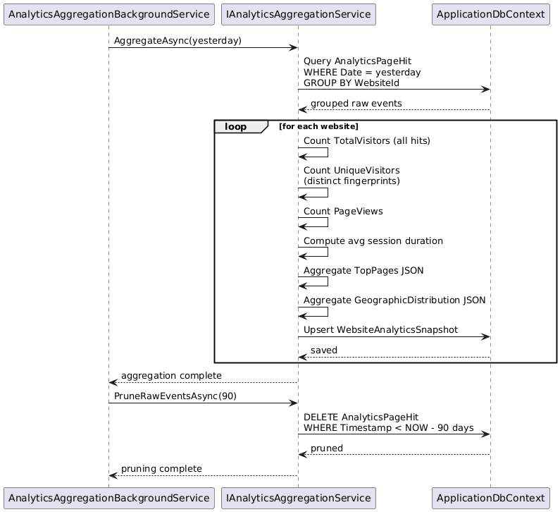

### View Analytics Dashboard

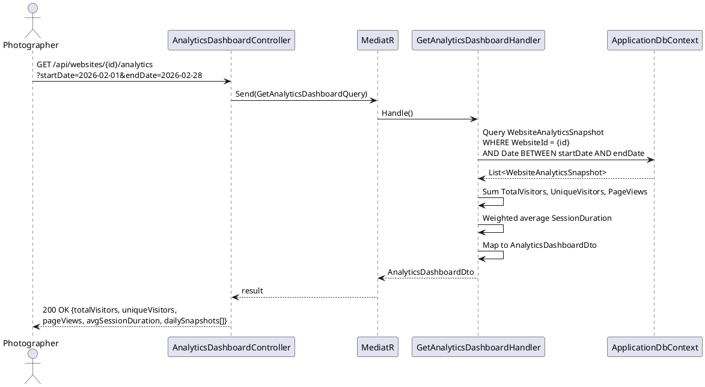

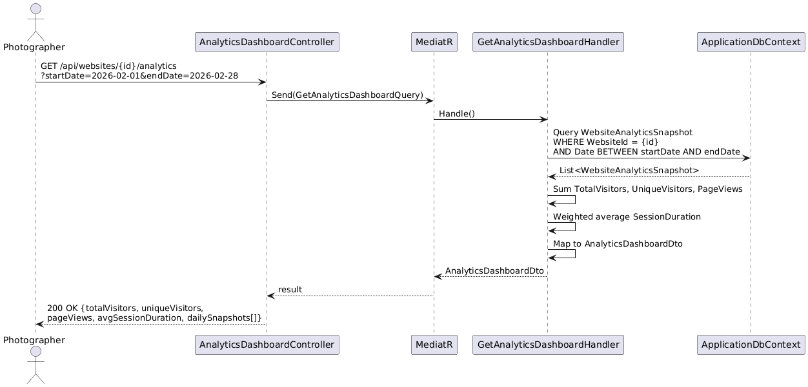

### Configure Google Analytics / Facebook Pixel

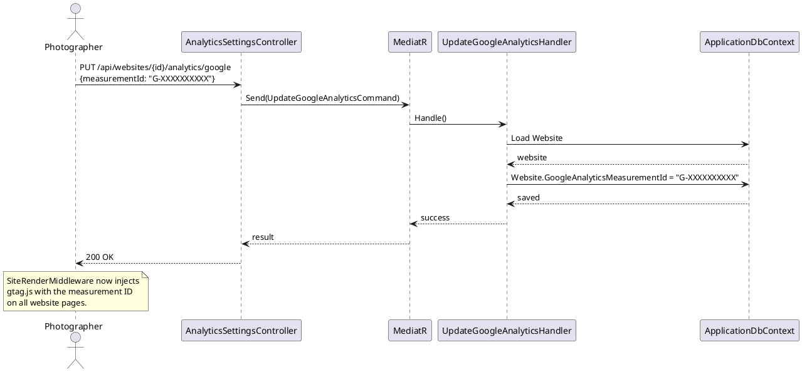

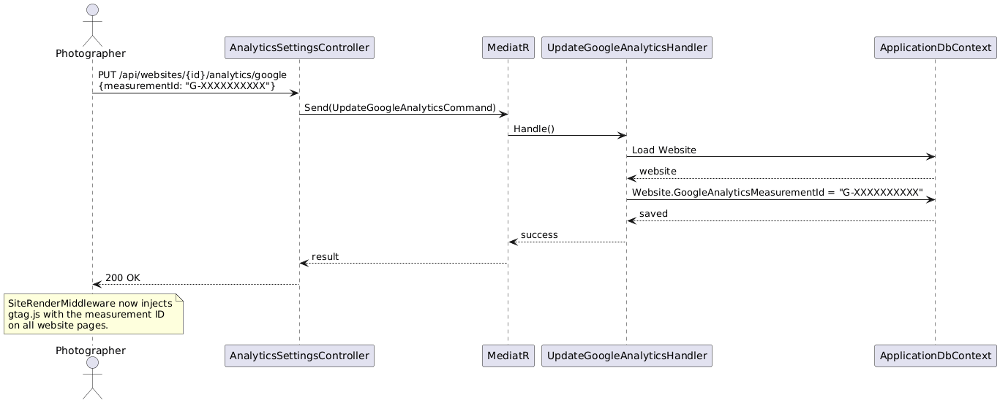
