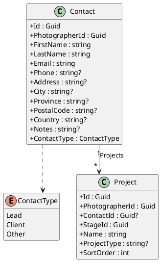
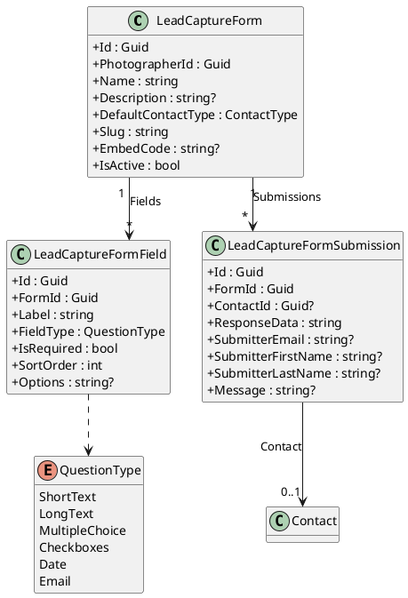
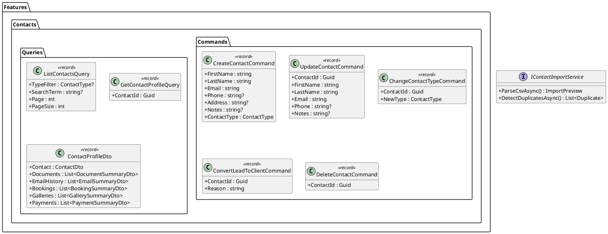
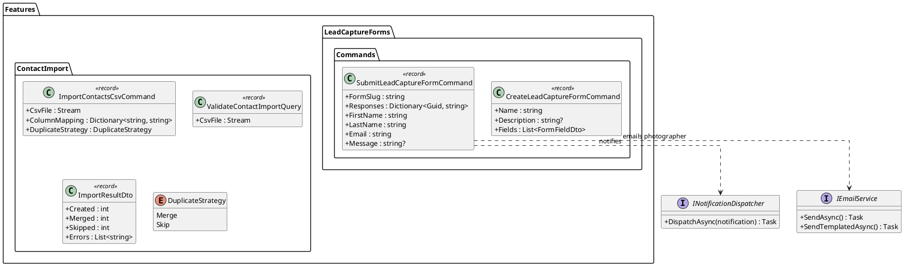
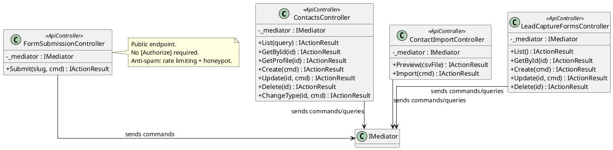
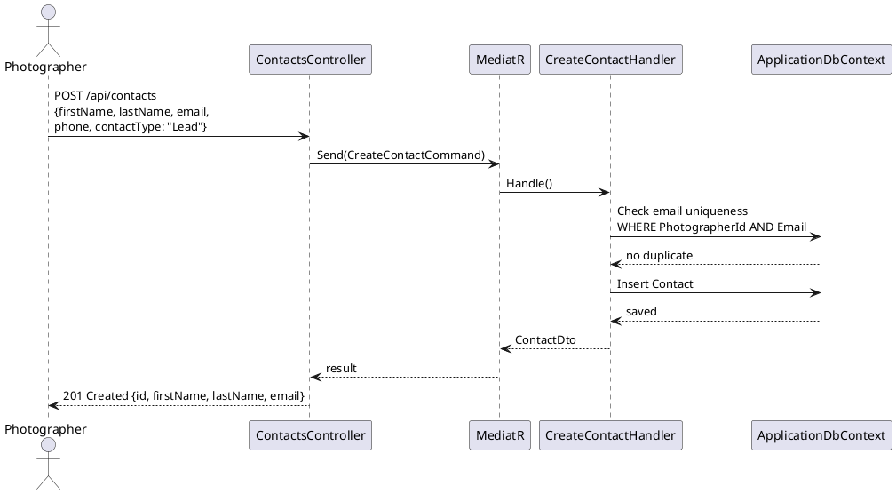
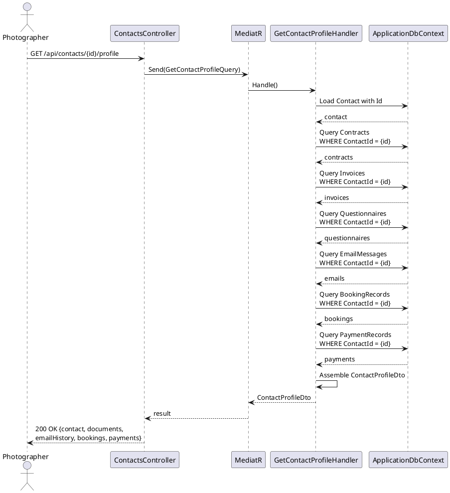
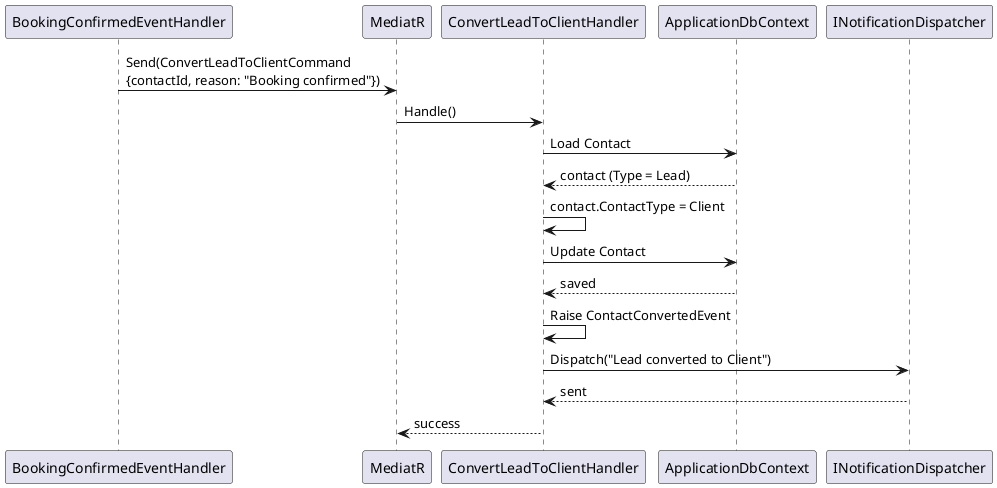
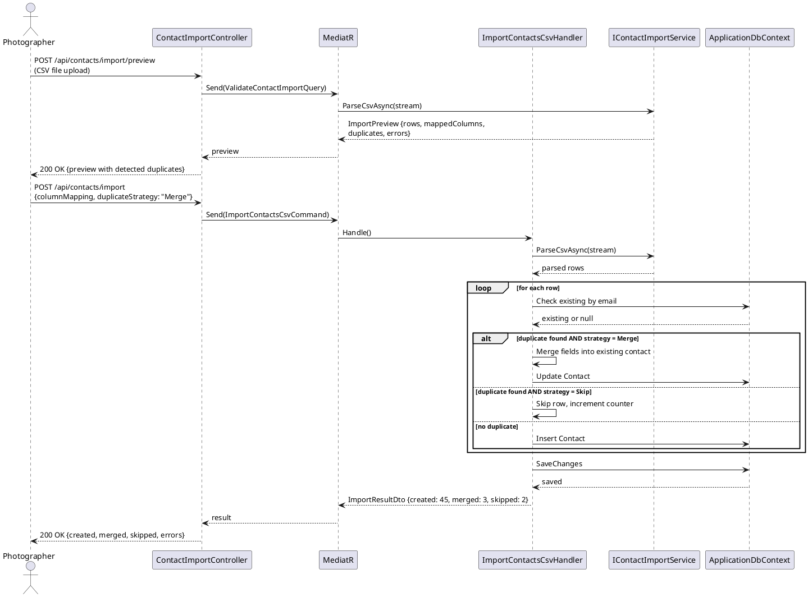
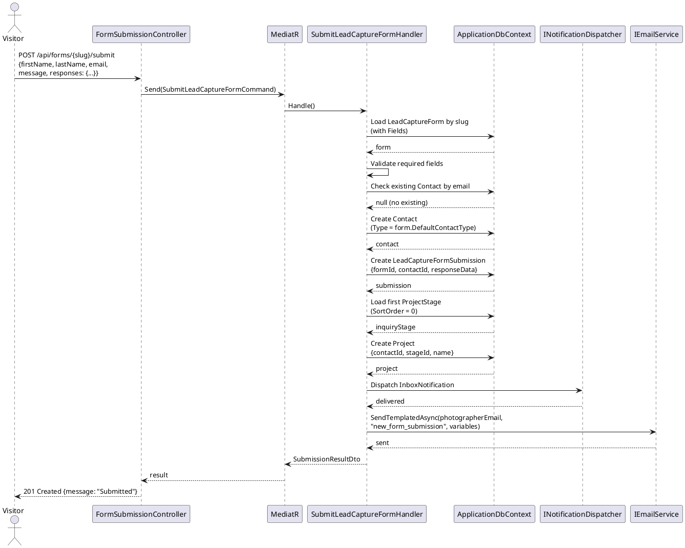

# F23 - Contacts & CRM

## Overview

This feature provides the contact management backbone of the Anansi Studio Manager. Photographers can maintain three types of contacts -- Client, Lead, and Other -- each storing first/last name, email, phone, address, and notes. Contact type is manually changeable at any time, and the system automatically converts a Lead to a Client when a booking is confirmed or a payment is received (with manual override always available).

Each contact has a centralized profile view that aggregates every touchpoint: personal details, all associated documents (contracts, invoices, questionnaires), email conversation history, sessions and bookings, linked galleries, and payment history. This profile serves as the single source of truth for the photographer-client relationship, with all associated items navigable from one screen.

The feature also includes CSV contact import with column mapping and duplicate detection (by email, with merge or skip options), and a lead capture form system. Lead capture forms support configurable fields (first name, last name, email, message as defaults, plus custom fields of type short text, long text, multiple choice, checkboxes, and date with calendar/time picker). Forms are shareable via direct link and embeddable on external websites via a code snippet. When submitted, the form auto-creates a contact (Lead by default), sends a notification to the photographer's Inbox and account email, and auto-creates a project card on the pipeline board.

**L2 Requirements:** CRM-4.1.1 (Contact Types), CRM-4.1.2 (Contact Profiles), CRM-4.1.3 (Automatic Lead Conversion), CRM-4.1.4 (Contact Import), CRM-4.1.5 (Lead Capture Forms)

---

## Components

### Domain Layer

| Component | Type | Description |
|-----------|------|-------------|
| `Contact` | Entity | Core contact entity storing personal info, `ContactType`, and navigation to `Projects`. Implements `ITenantEntity`, `ISoftDeletable`, `IAuditableEntity`. |
| `ContactType` | Enum | `Lead`, `Client`, `Other`. |
| `LeadCaptureForm` | Entity | Form definition with `Name`, `Description`, `DefaultContactType`, `Slug` (shareable link), `EmbedCode`, and `IsActive`. Implements `ITenantEntity`, `ISoftDeletable`, `IAuditableEntity`. |
| `LeadCaptureFormField` | Entity | Custom field on a form: `Label`, `FieldType` (QuestionType), `IsRequired`, `SortOrder`, `Options` (JSON for choice fields). |
| `LeadCaptureFormSubmission` | Entity | A form submission linking to auto-created `Contact`. Stores `ResponseData` (JSON), submitter info, and `Message`. |
| `QuestionType` | Enum | `ShortText`, `LongText`, `MultipleChoice`, `Checkboxes`, `Date`, `Email`. |
| `ContactConvertedEvent` | Domain Event | Raised when a Lead is converted to Client (automatic or manual). Carries `ContactId` and `ConversionReason`. |
| `FormSubmittedEvent` | Domain Event | Raised when a lead capture form is submitted. Carries `FormId`, `SubmissionId`, `ContactId`. |

### Application Layer

| Component | Type | Description |
|-----------|------|-------------|
| `CreateContactCommand` | Command | Creates a new contact. Validates required fields and email uniqueness per photographer. |
| `UpdateContactCommand` | Command | Updates contact details. Allows manual type change. |
| `DeleteContactCommand` | Command | Soft-deletes a contact. |
| `GetContactQuery` | Query | Returns a single contact with all profile data. |
| `GetContactProfileQuery` | Query | Returns the full contact profile: details, documents, email history, bookings, galleries, payments. |
| `ListContactsQuery` | Query | Returns paginated, filterable, searchable contact list. Supports filtering by `ContactType`. |
| `ChangeContactTypeCommand` | Command | Manually changes a contact's type (CRM-4.1.1). |
| `ConvertLeadToClientCommand` | Command | Automatically triggered on booking/payment. Changes type to Client, raises `ContactConvertedEvent`. Manual override available. |
| `ImportContactsCsvCommand` | Command | Accepts a CSV file, column mapping configuration, and duplicate handling strategy (merge/skip). Returns import results. |
| `ValidateContactImportQuery` | Query | Previews the import: shows mapped columns, detected duplicates, and validation errors before committing. |
| `CreateLeadCaptureFormCommand` | Command | Creates a new form with fields and generates a slug and embed code. |
| `UpdateLeadCaptureFormCommand` | Command | Updates form definition and fields. |
| `DeleteLeadCaptureFormCommand` | Command | Soft-deletes a form. |
| `GetLeadCaptureFormQuery` | Query | Returns form definition for editing. |
| `ListLeadCaptureFormsQuery` | Query | Returns all forms for the photographer. |
| `SubmitLeadCaptureFormCommand` | Command | Public-facing. Validates required fields, creates contact, creates submission, raises `FormSubmittedEvent`. |
| `IContactImportService` | Interface | Parses CSV, maps columns, detects duplicates. Methods: `ParseCsvAsync`, `MapColumnsAsync`, `DetectDuplicatesAsync`. |
| `INotificationDispatcher` | Interface | Sends in-app and email notifications on form submission. |

### Infrastructure Layer

| Component | Type | Description |
|-----------|------|-------------|
| `CreateContactHandler` | Handler | Validates email uniqueness within photographer scope, creates `Contact` entity. |
| `ImportContactsCsvHandler` | Handler | Uses `IContactImportService` to parse CSV, detect duplicates, and bulk-create/merge contacts. |
| `SubmitLeadCaptureFormHandler` | Handler | Validates form fields, creates `Contact` (or finds existing by email), creates `LeadCaptureFormSubmission`, auto-creates `Project` in first pipeline stage, dispatches notifications via `INotificationDispatcher` and `IEmailService`. |
| `ConvertLeadToClientHandler` | Handler | Changes `ContactType` to `Client`, raises `ContactConvertedEvent`. Called by booking/payment event handlers. |
| `ContactImportService` | Service | Implements `IContactImportService`. Uses CsvHelper for parsing. Column mapping heuristics match common header names to contact fields. |
| `FormSubmittedEventHandler` | Event Handler | Listens for `FormSubmittedEvent`. Creates Inbox notification and sends email to photographer. |
| `ContactConfiguration` | EF Config | Configures unique constraint on `(PhotographerId, Email)`. Indexes on `ContactType`, `LastName`. |
| `LeadCaptureFormConfiguration` | EF Config | Configures unique constraint on `(PhotographerId, Slug)`. |

### API Layer

| Component | Type | Description |
|-----------|------|-------------|
| `ContactsController` | Controller | CRUD endpoints: `GET /api/contacts` (list), `GET /api/contacts/{id}` (detail), `GET /api/contacts/{id}/profile` (full profile), `POST /api/contacts`, `PUT /api/contacts/{id}`, `DELETE /api/contacts/{id}`, `PUT /api/contacts/{id}/type` (change type). All require `[Authorize]`. |
| `ContactImportController` | Controller | Endpoints: `POST /api/contacts/import/preview` (validate/preview), `POST /api/contacts/import` (execute import). Require `[Authorize]`. |
| `LeadCaptureFormsController` | Controller | CRUD endpoints: `GET /api/forms` (list), `GET /api/forms/{id}`, `POST /api/forms`, `PUT /api/forms/{id}`, `DELETE /api/forms/{id}`. All require `[Authorize]`. |
| `FormSubmissionController` | Controller | Public endpoint: `POST /api/forms/{slug}/submit` -- processes form submission without authentication. |

---

## Class Diagrams

### Domain Layer -- Contact & CRM Entities

### Domain Layer -- Lead Capture Form Entities

### Application Layer -- Contact Commands & Queries

### Application Layer -- Import & Form Commands

### API Layer -- Contact & Form Controllers

---

## Sequence Diagrams

### Create Contact

### View Contact Profile

### Automatic Lead-to-Client Conversion

### CSV Contact Import

### Lead Capture Form Submission

