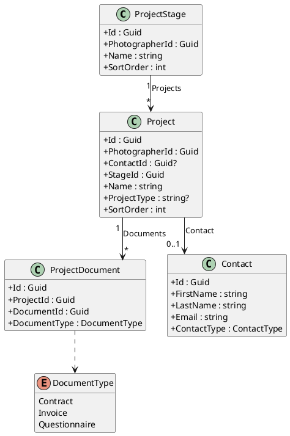
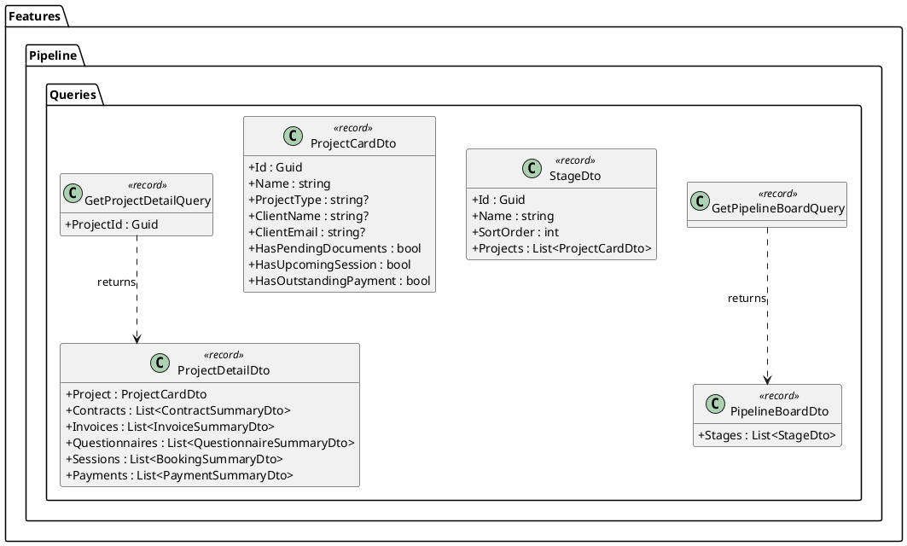
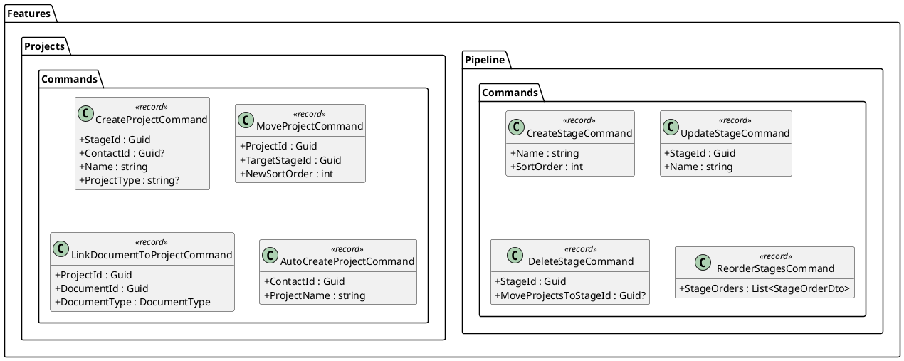
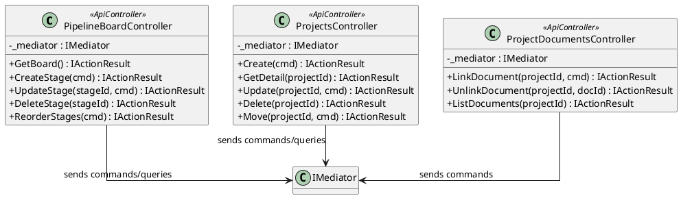
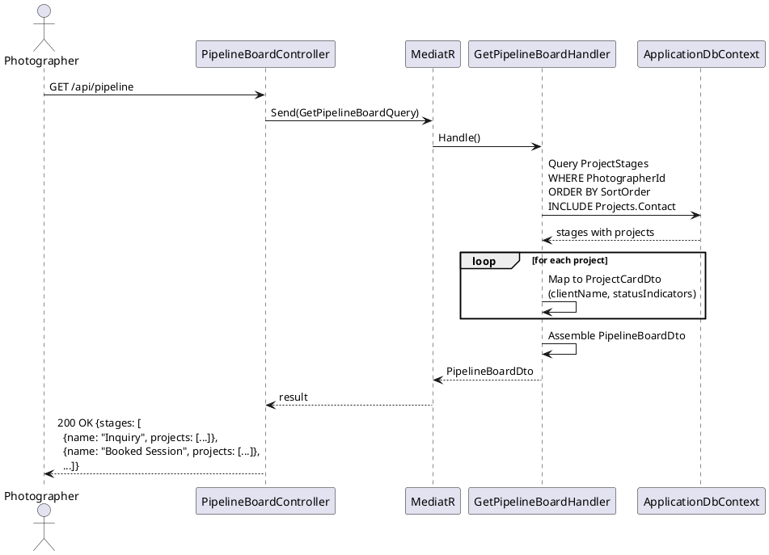
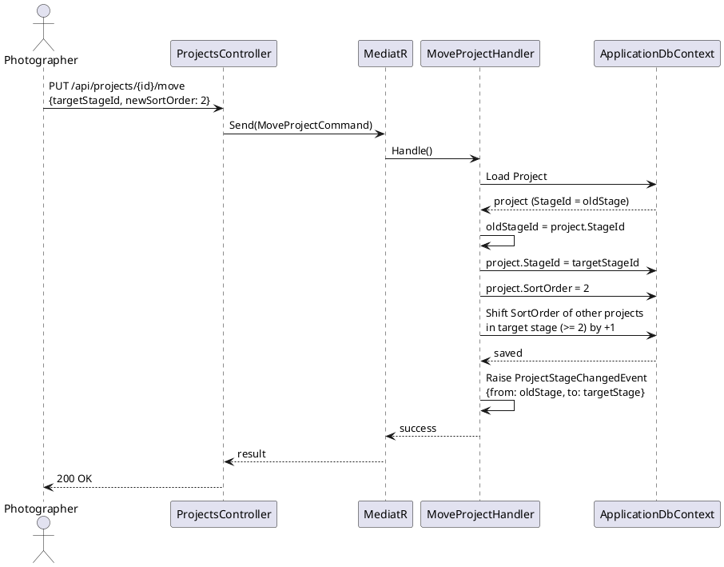
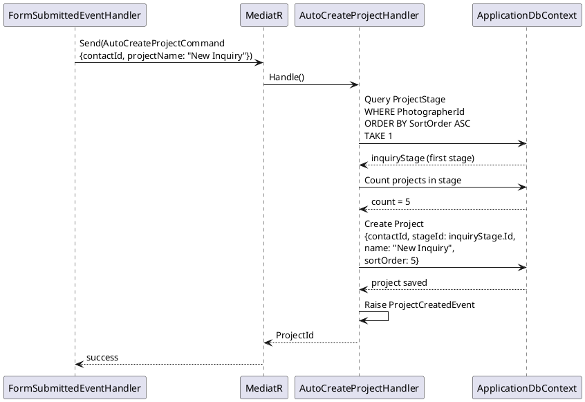
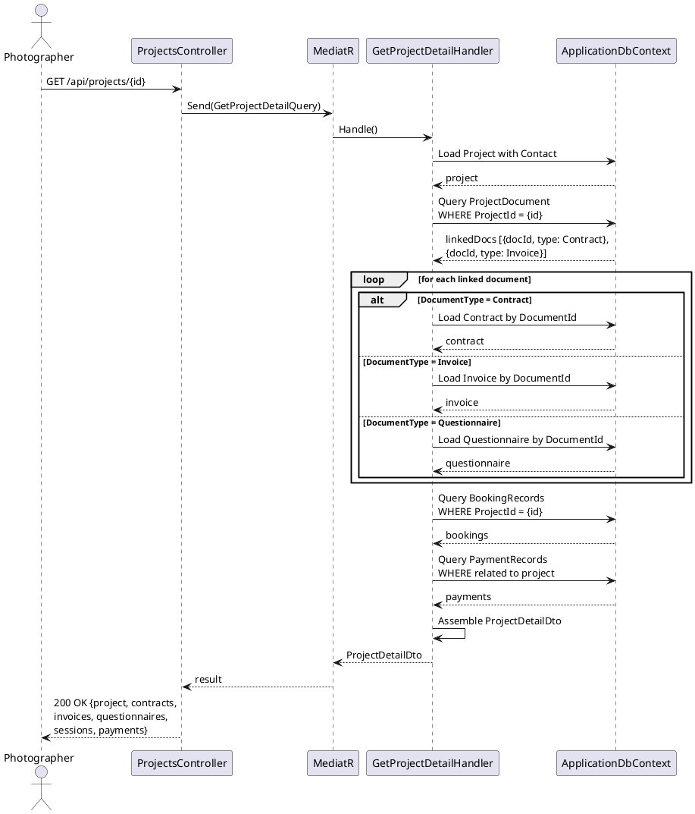
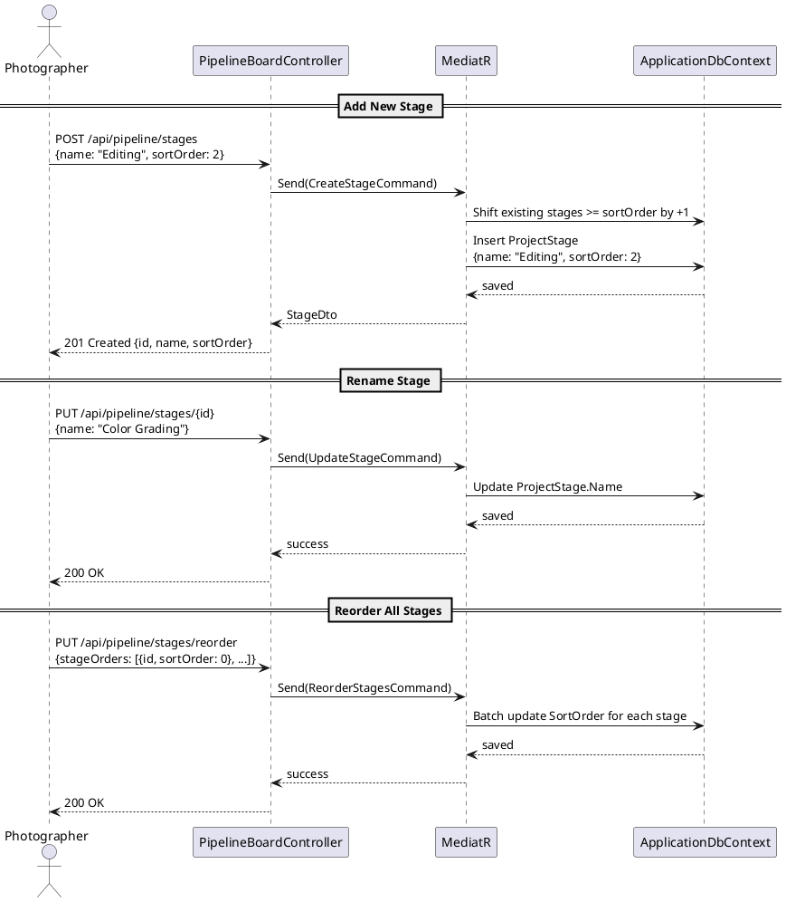

# F24 - Project Pipeline Board

## Overview

This feature provides a visual Kanban board for photographers to manage their workflow pipeline within the Studio Manager. The board displays project cards organized into customizable columns (stages) that represent workflow phases. The default stages are Inquiry, Booked Session, Post-production, and Completed Project, but photographers can fully customize the board by adding, removing, renaming, and reordering stages.

Project cards are the central organizational unit. Each card displays the client name, project name/type, and status indicators at a glance. Cards are draggable between stages via drag-and-drop, with their sort order within each column also adjustable. The card detail view surfaces all associated documents (contracts, invoices, questionnaires), sessions, and payments. Photographers can create new documents or sessions directly from a card, or link existing items to a project.

The pipeline board integrates tightly with the lead capture form system (F23). When a new form submission is received, a project card is automatically created in the first stage (Inquiry) and linked to the auto-created contact. This ensures every inbound lead immediately appears on the pipeline board without manual intervention, giving photographers instant visibility into their business funnel.

**L2 Requirements:** CRM-4.2.1 (Project Board), CRM-4.2.2 (Project Cards), CRM-4.2.3 (Auto-Created Projects)

---

## Components

### Domain Layer

| Component | Type | Description |
|-----------|------|-------------|
| `Project` | Entity | Kanban card representing a project. Stores `PhotographerId`, `ContactId`, `StageId`, `Name`, `ProjectType`, and `SortOrder`. Implements `ITenantEntity`, `ISoftDeletable`, `IAuditableEntity`. |
| `ProjectStage` | Entity | Column on the Kanban board. Stores `PhotographerId`, `Name`, and `SortOrder`. Implements `ITenantEntity`. Contains navigation to its `Projects`. |
| `ProjectDocument` | Entity | Join table linking a project to a document (contract, invoice, or questionnaire). Stores `ProjectId`, `DocumentId`, `DocumentType`. |
| `DocumentType` | Enum | `Contract`, `Invoice`, `Questionnaire` -- distinguishes linked document types. |
| `ProjectCreatedEvent` | Domain Event | Raised when a project card is created (manual or auto). Carries `ProjectId`, `ContactId`, `StageId`. |
| `ProjectStageChangedEvent` | Domain Event | Raised when a project moves between stages. Carries `ProjectId`, `FromStageId`, `ToStageId`. |

### Application Layer

| Component | Type | Description |
|-----------|------|-------------|
| `GetPipelineBoardQuery` | Query | Returns all stages with their projects for the authenticated photographer. Includes card summary data (client name, project name, type, status indicators). |
| `CreateProjectCommand` | Command | Creates a new project card in a specified stage. Optionally links to a contact. |
| `UpdateProjectCommand` | Command | Updates project name, type, and other details. |
| `DeleteProjectCommand` | Command | Soft-deletes a project card. |
| `MoveProjectCommand` | Command | Moves a project to a different stage and/or changes its sort order within the stage. Raises `ProjectStageChangedEvent`. |
| `ReorderProjectsCommand` | Command | Batch-updates sort orders of projects within a single stage (after drag-and-drop reorder). |
| `GetProjectDetailQuery` | Query | Returns full project detail: card info, linked documents (contracts/invoices/questionnaires), sessions, and payments. |
| `LinkDocumentToProjectCommand` | Command | Associates an existing document with a project by creating a `ProjectDocument` record. |
| `UnlinkDocumentFromProjectCommand` | Command | Removes the `ProjectDocument` association. |
| `CreateStageCommand` | Command | Adds a new stage to the board at a specified sort order. |
| `UpdateStageCommand` | Command | Renames a stage. |
| `DeleteStageCommand` | Command | Removes a stage. Requires that all projects be moved out first (or optionally moves them to another stage). |
| `ReorderStagesCommand` | Command | Batch-updates sort orders of all stages (after drag-and-drop reorder). |
| `AutoCreateProjectCommand` | Command | Internal command triggered by form submission. Creates a project in the first stage (lowest `SortOrder`), linked to the auto-created contact. |
| `SeedDefaultStagesCommand` | Command | Creates the four default stages for a new photographer account. Called during registration. |

### Infrastructure Layer

| Component | Type | Description |
|-----------|------|-------------|
| `GetPipelineBoardHandler` | Handler | Queries all `ProjectStage` entities for the photographer, includes projects with contact info, orders by `SortOrder`. |
| `MoveProjectHandler` | Handler | Updates `Project.StageId` and `SortOrder`, raises `ProjectStageChangedEvent`. |
| `AutoCreateProjectHandler` | Handler | Finds the first stage (min `SortOrder`), creates project linked to contact. Called by `FormSubmittedEventHandler`. |
| `GetProjectDetailHandler` | Handler | Loads project with contact, then queries `ProjectDocument` join records to load linked contracts, invoices, questionnaires. Also queries booking records and payment records by `ProjectId`. |
| `SeedDefaultStagesHandler` | Handler | Creates four `ProjectStage` records: Inquiry (0), Booked Session (1), Post-production (2), Completed Project (3). |
| `ProjectConfiguration` | EF Config | Indexes on `(PhotographerId, StageId)` and `(PhotographerId, ContactId)`. |
| `ProjectStageConfiguration` | EF Config | Unique constraint on `(PhotographerId, Name)`. Index on `(PhotographerId, SortOrder)`. |
| `ProjectDocumentConfiguration` | EF Config | Composite key on `(ProjectId, DocumentId, DocumentType)`. |

### API Layer

| Component | Type | Description |
|-----------|------|-------------|
| `PipelineBoardController` | Controller | Board-level endpoints: `GET /api/pipeline` (full board), `POST /api/pipeline/stages` (create stage), `PUT /api/pipeline/stages/{id}` (rename), `DELETE /api/pipeline/stages/{id}` (remove), `PUT /api/pipeline/stages/reorder` (batch reorder). All require `[Authorize]`. |
| `ProjectsController` | Controller | Card-level endpoints: `POST /api/projects` (create), `GET /api/projects/{id}` (detail), `PUT /api/projects/{id}` (update), `DELETE /api/projects/{id}` (delete), `PUT /api/projects/{id}/move` (move to stage), `PUT /api/projects/{id}/reorder` (reorder within stage). All require `[Authorize]`. |
| `ProjectDocumentsController` | Controller | Document linking: `POST /api/projects/{id}/documents` (link), `DELETE /api/projects/{id}/documents/{docId}` (unlink), `GET /api/projects/{id}/documents` (list linked). All require `[Authorize]`. |

---

## Class Diagrams

### Domain Layer -- Pipeline Board Entities

### Application Layer -- Board Queries & Commands

### Application Layer -- Stage & Project Commands

### API Layer -- Pipeline & Project Controllers

---

## Sequence Diagrams

### Load Pipeline Board

### Drag-and-Drop: Move Project Between Stages

### Auto-Create Project on Form Submission

### View Project Detail with Linked Documents

### Customize Stages (Add / Rename / Reorder)

