# F25 - Booking & Scheduling

## Overview

This feature delivers the complete booking and scheduling system for photographers on the Anansi platform. At its core is the online booking site -- a branded, public-facing page displaying the photographer's cover image, profile photo, welcome message, business info, and all published session types. The booking site URL is customizable and the entire page is embeddable on external websites. Clients browse available session types, select a date and time, enter contact information, complete any required intake documents (contracts and questionnaires), and pay the session fee -- all in a single uninterrupted flow.

The system supports two session type variants. Full session types define a name, description, duration, price, per-day availability windows, and location, with plan-based limits (Free = 1, Plus = 3, Pro = unlimited). Mini session types are date-specific with configurable start times per date, spots per time slot, gap/break between slots, multi-date setup, schedule duplication, and a "Nearly sold out" indicator. Both variants support buffer time (pre/post for full sessions, gap between slots for mini sessions) that blocks availability across all session types. Sessions can require manual confirmation (Pending until photographer accepts or declines) and can be set to Public or Hidden (link-only) visibility with configurable display order.

Integration capabilities include two-way Google Calendar sync (within 5 minutes, with busy-blocks-availability and client-as-attendee), video call integration with Zoom and Google Meet (auto-generated unique links included in confirmation emails), intake documents from templates (contracts and questionnaires on upgraded plans), payment processing (full or deposit with auto-invoice for balance), and booking coupons (fixed or percentage discount with expiration and usage limits). A booking confirmation email is sent automatically upon completion.

**L2 Requirements:** BKG-4.3.1 (Online Booking Site), BKG-4.3.2 (Full Session Types), BKG-4.3.3 (Mini Session Types), BKG-4.3.4 (Booking Flow), BKG-4.3.5 (Google Calendar Sync), BKG-4.3.6 (Buffer Time), BKG-4.3.7 (Manual Confirmation Mode), BKG-4.3.8 (Session Visibility), BKG-4.3.9 (Intake Documents), BKG-4.3.10 (Booking Payment), BKG-4.3.11 (Video Call Integration), BKG-4.3.12 (Booking Coupons)

---

## Components

### Domain Layer

| Component | Type | Description |
|-----------|------|-------------|
| `SessionType` | Entity | Defines a bookable session with `Name`, `Description`, `DurationMinutes`, `PriceCents`, `Location`, `Visibility`, `SortOrder`, `BufferBeforeMinutes`, `BufferAfterMinutes`, `RequireManualConfirmation`, `IsMiniSession`, `MiniSessionGapMinutes`, `MiniSessionSpotsPerSlot`, `AvailabilityWindows` (JSON), `VideoCallType`, `RequirePayment`, `DepositAmountCents`, `IntakeDocumentIds` (JSON), `CoverImageUrl`. Implements `ITenantEntity`, `ISoftDeletable`, `IAuditableEntity`. |
| `MiniSessionDate` | Entity | Date-specific configuration for mini sessions: `SessionTypeId`, `Date`, `StartTimes` (JSON array of time strings). |
| `BookingRecord` | Entity | A booked session storing `SessionTypeId`, `ContactId`, `ProjectId`, client info, `StartTime`, `EndTime`, `Status`, `Location`, `VideoCallLink`, `GoogleCalendarEventId`, `AmountPaidCents`, `CouponCode`, `DiscountCents`. Implements `ITenantEntity`, `ISoftDeletable`, `IAuditableEntity`. |
| `BookingCoupon` | Entity | Discount code for bookings: `Code`, `CouponType`, `PercentageValue`, `FixedAmountCents`, `ExpirationDate`, `UsageLimit`, `TimesUsed`, `IsActive`. Implements `ITenantEntity`, `ISoftDeletable`. |
| `BookingStatus` | Enum | `Pending`, `Confirmed`, `Declined`, `Cancelled`, `Completed`, `NoShow`. |
| `SessionVisibility` | Enum | `Public`, `Hidden`. |
| `CouponType` | Enum | `PercentageOff`, `FixedAmountOff`, `FreeGiveaway`. |
| `BookingSiteConfig` | Entity | Per-photographer booking site settings: `CoverImageUrl`, `ProfilePhotoUrl`, `WelcomeMessage`, `CustomSlug`, `IsPublished`, `EmbedCode`. Implements `ITenantEntity`. |
| `BookingConfirmedEvent` | Domain Event | Raised when a booking is confirmed (auto or manual). Triggers calendar sync, confirmation email, and lead conversion. |
| `BookingDeclinedEvent` | Domain Event | Raised when a photographer declines a pending booking. Triggers client notification. |

### Application Layer

| Component | Type | Description |
|-----------|------|-------------|
| `GetBookingSiteQuery` | Query | Public. Returns the booking site configuration and all visible session types for a photographer (filtered by visibility). |
| `GetAvailableSlotsQuery` | Query | Public. Returns available date/time slots for a session type within a date range. Considers availability windows, existing bookings, buffer time, Google Calendar busy blocks, and mini session spot counts. |
| `CreateBookingCommand` | Command | Public. Processes the complete booking flow: validates slot availability, creates contact (or finds existing), processes payment (if required), applies coupon, creates `BookingRecord`, generates video call link (if configured), sends confirmation email. |
| `ConfirmBookingCommand` | Command | Photographer confirms a pending booking (manual confirmation mode). Changes status to `Confirmed`, raises `BookingConfirmedEvent`. |
| `DeclineBookingCommand` | Command | Photographer declines a pending booking. Changes status to `Declined`, raises `BookingDeclinedEvent`. |
| `CancelBookingCommand` | Command | Cancels a booking. Handles refund logic if payment was made. |
| `CreateSessionTypeCommand` | Command | Creates a full or mini session type. Validates plan-tier session type limits. |
| `UpdateSessionTypeCommand` | Command | Updates session type configuration. |
| `DeleteSessionTypeCommand` | Command | Soft-deletes a session type. |
| `ReorderSessionTypesCommand` | Command | Batch-updates `SortOrder` for session types on the booking site. |
| `CreateMiniSessionDateCommand` | Command | Adds date/time slots to a mini session type. |
| `DuplicateMiniSessionScheduleCommand` | Command | Copies start times from one `MiniSessionDate` to other dates. |
| `UpdateBookingSiteCommand` | Command | Updates booking site branding: cover image, profile photo, welcome message, custom slug. |
| `CreateBookingCouponCommand` | Command | Creates a booking coupon with type, value, expiration, and usage limit. |
| `UpdateBookingCouponCommand` | Command | Updates coupon details. |
| `DeleteBookingCouponCommand` | Command | Soft-deletes a coupon. |
| `ValidateCouponQuery` | Query | Public. Validates a coupon code and returns the discount amount for a given session price. |
| `ListBookingsQuery` | Query | Returns paginated bookings for the photographer, filterable by status and date range. |
| `GetBookingDetailQuery` | Query | Returns full booking details including linked documents and payment info. |
| `IGoogleCalendarService` | Interface | Two-way calendar sync. Methods: `CreateEventAsync`, `UpdateEventAsync`, `DeleteEventAsync`, `GetBusyBlocksAsync`, `SyncIncomingChangesAsync`. |
| `IVideoCallService` | Interface | Generates video call links. Methods: `CreateMeetingAsync(provider, booking)`. |
| `IPaymentService` | Interface (existing) | Processes booking payments and creates payment intents. |
| `IEmailService` | Interface (existing) | Sends booking confirmation and notification emails. |
| `IPlanGateService` | Interface | Validates session type count against plan limits. |

### Infrastructure Layer

| Component | Type | Description |
|-----------|------|-------------|
| `GetAvailableSlotsHandler` | Handler | Core availability engine. For full sessions: generates slots from availability windows, subtracts booked slots + buffer time + Google Calendar busy blocks. For mini sessions: reads `MiniSessionDate.StartTimes`, subtracts booked spots, calculates "Nearly sold out" when remaining spots <= 2. |
| `CreateBookingHandler` | Handler | Orchestrates the booking flow: re-validates availability (double-booking guard), applies coupon discount, processes payment via `IPaymentService`, creates `BookingRecord`, auto-creates contact and project, generates video call link, sends confirmation. |
| `ConfirmBookingHandler` | Handler | Changes status to `Confirmed`, raises `BookingConfirmedEvent` which triggers `GoogleCalendarService.CreateEventAsync` and confirmation email. |
| `GoogleCalendarService` | Service | Implements `IGoogleCalendarService`. Uses Google Calendar API. Creates events with client as attendee. Reads busy/free blocks to exclude from availability. |
| `GoogleCalendarSyncBackgroundService` | Background Service | Runs every 5 minutes. Polls Google Calendar for changes (new/updated/deleted events) and updates Anansi availability accordingly. Two-way sync. |
| `VideoCallService` | Service | Implements `IVideoCallService`. Integrates with Zoom API and Google Meet API. Generates unique meeting links for each booking. |
| `BookingConfirmedEventHandler` | Event Handler | Listens for `BookingConfirmedEvent`. Creates Google Calendar event, sends confirmation email, triggers lead-to-client conversion. |
| `SessionTypeConfiguration` | EF Config | Index on `(PhotographerId, Visibility)`. Unique constraint on `(PhotographerId, Name)`. |
| `BookingRecordConfiguration` | EF Config | Index on `(PhotographerId, StartTime)` for availability queries. Index on `(SessionTypeId, StartTime)`. |
| `BookingCouponConfiguration` | EF Config | Unique constraint on `(PhotographerId, Code)`. |

### API Layer

| Component | Type | Description |
|-----------|------|-------------|
| `BookingSiteController` | Controller | Public endpoints: `GET /api/booking/{slug}` (site page), `GET /api/booking/{slug}/sessions/{sessionTypeId}/slots` (available slots). Photographer endpoints: `PUT /api/booking/site` (update branding), `GET /api/booking/site` (get config). |
| `SessionTypesController` | Controller | Authenticated CRUD: `POST /api/session-types`, `GET /api/session-types`, `GET /api/session-types/{id}`, `PUT /api/session-types/{id}`, `DELETE /api/session-types/{id}`, `PUT /api/session-types/reorder`. |
| `MiniSessionsController` | Controller | Authenticated endpoints: `POST /api/session-types/{id}/dates` (add dates), `PUT /api/session-types/{id}/dates/{dateId}` (update), `DELETE /api/session-types/{id}/dates/{dateId}`, `POST /api/session-types/{id}/dates/duplicate` (copy schedule). |
| `BookingsController` | Controller | Public: `POST /api/bookings` (create booking), `POST /api/bookings/validate-coupon` (check coupon). Authenticated: `GET /api/bookings` (list), `GET /api/bookings/{id}` (detail), `PUT /api/bookings/{id}/confirm`, `PUT /api/bookings/{id}/decline`, `PUT /api/bookings/{id}/cancel`. |
| `BookingCouponsController` | Controller | Authenticated CRUD: `POST /api/booking-coupons`, `GET /api/booking-coupons`, `PUT /api/booking-coupons/{id}`, `DELETE /api/booking-coupons/{id}`. |

---

## Class Diagrams

### Domain Layer -- Session Type & Booking Entities

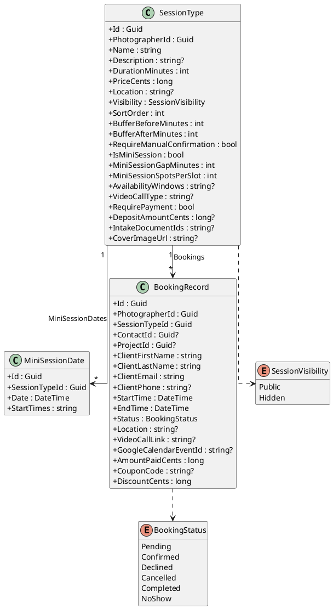
```plantuml
@startuml
skinparam classAttributeIconSize 0
skinparam linetype ortho
hide empty methods

class SessionType {
  +Id : Guid
  +PhotographerId : Guid
  +Name : string
  +Description : string?
  +DurationMinutes : int
  +PriceCents : long
  +Location : string?
  +Visibility : SessionVisibility
  +SortOrder : int
  +BufferBeforeMinutes : int
  +BufferAfterMinutes : int
  +RequireManualConfirmation : bool
  +IsMiniSession : bool
  +MiniSessionGapMinutes : int
  +MiniSessionSpotsPerSlot : int
  +AvailabilityWindows : string?
  +VideoCallType : string?
  +RequirePayment : bool
  +DepositAmountCents : long?
  +IntakeDocumentIds : string?
  +CoverImageUrl : string?
}

class MiniSessionDate {
  +Id : Guid
  +SessionTypeId : Guid
  +Date : DateTime
  +StartTimes : string
}

class BookingRecord {
  +Id : Guid
  +PhotographerId : Guid
  +SessionTypeId : Guid
  +ContactId : Guid?
  +ProjectId : Guid?
  +ClientFirstName : string
  +ClientLastName : string
  +ClientEmail : string
  +ClientPhone : string?
  +StartTime : DateTime
  +EndTime : DateTime
  +Status : BookingStatus
  +Location : string?
  +VideoCallLink : string?
  +GoogleCalendarEventId : string?
  +AmountPaidCents : long
  +CouponCode : string?
  +DiscountCents : long
}

enum BookingStatus {
  Pending
  Confirmed
  Declined
  Cancelled
  Completed
  NoShow
}

enum SessionVisibility {
  Public
  Hidden
}

SessionType "1" --> "*" MiniSessionDate : MiniSessionDates
SessionType "1" --> "*" BookingRecord : Bookings
BookingRecord ..> BookingStatus
SessionType ..> SessionVisibility
@enduml
```

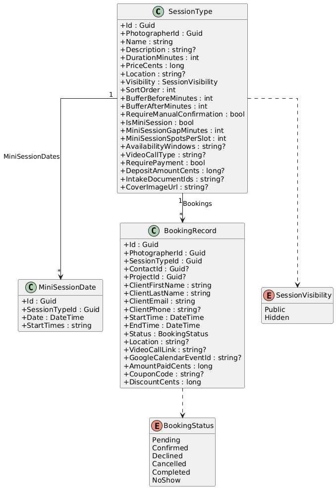

### Domain Layer -- Booking Site & Coupon Entities

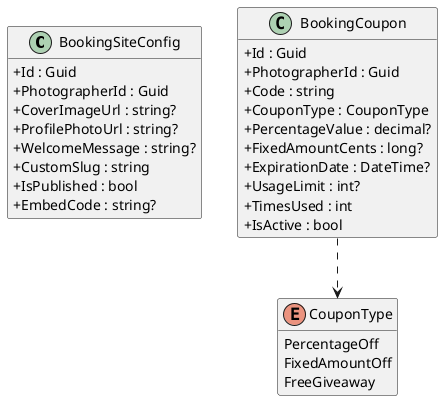
```plantuml
@startuml
skinparam classAttributeIconSize 0
skinparam linetype ortho
hide empty methods

class BookingSiteConfig {
  +Id : Guid
  +PhotographerId : Guid
  +CoverImageUrl : string?
  +ProfilePhotoUrl : string?
  +WelcomeMessage : string?
  +CustomSlug : string
  +IsPublished : bool
  +EmbedCode : string?
}

class BookingCoupon {
  +Id : Guid
  +PhotographerId : Guid
  +Code : string
  +CouponType : CouponType
  +PercentageValue : decimal?
  +FixedAmountCents : long?
  +ExpirationDate : DateTime?
  +UsageLimit : int?
  +TimesUsed : int
  +IsActive : bool
}

enum CouponType {
  PercentageOff
  FixedAmountOff
  FreeGiveaway
}

BookingCoupon ..> CouponType
@enduml
```

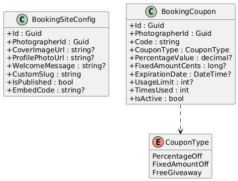

### Application Layer -- Booking Commands

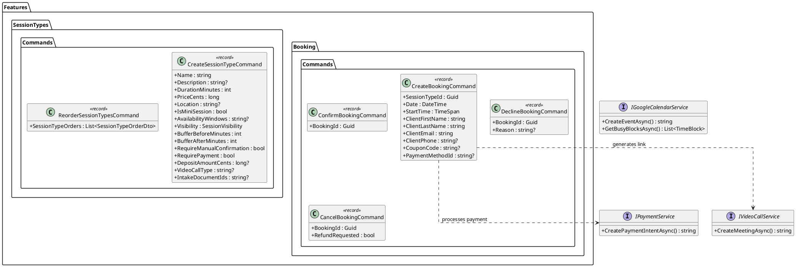
```plantuml
@startuml
skinparam classAttributeIconSize 0
skinparam linetype ortho
hide empty methods

package "Features.Booking.Commands" {
  class CreateBookingCommand <<record>> {
    +SessionTypeId : Guid
    +Date : DateTime
    +StartTime : TimeSpan
    +ClientFirstName : string
    +ClientLastName : string
    +ClientEmail : string
    +ClientPhone : string?
    +CouponCode : string?
    +PaymentMethodId : string?
  }

  class ConfirmBookingCommand <<record>> {
    +BookingId : Guid
  }

  class DeclineBookingCommand <<record>> {
    +BookingId : Guid
    +Reason : string?
  }

  class CancelBookingCommand <<record>> {
    +BookingId : Guid
    +RefundRequested : bool
  }
}

package "Features.SessionTypes.Commands" {
  class CreateSessionTypeCommand <<record>> {
    +Name : string
    +Description : string?
    +DurationMinutes : int
    +PriceCents : long
    +Location : string?
    +IsMiniSession : bool
    +AvailabilityWindows : string?
    +Visibility : SessionVisibility
    +BufferBeforeMinutes : int
    +BufferAfterMinutes : int
    +RequireManualConfirmation : bool
    +RequirePayment : bool
    +DepositAmountCents : long?
    +VideoCallType : string?
    +IntakeDocumentIds : string?
  }

  class ReorderSessionTypesCommand <<record>> {
    +SessionTypeOrders : List<SessionTypeOrderDto>
  }
}

interface IPaymentService {
  +CreatePaymentIntentAsync() : string
}

interface IGoogleCalendarService {
  +CreateEventAsync() : string
  +GetBusyBlocksAsync() : List<TimeBlock>
}

interface IVideoCallService {
  +CreateMeetingAsync() : string
}

CreateBookingCommand ..> IPaymentService : processes payment
CreateBookingCommand ..> IVideoCallService : generates link
@enduml
```

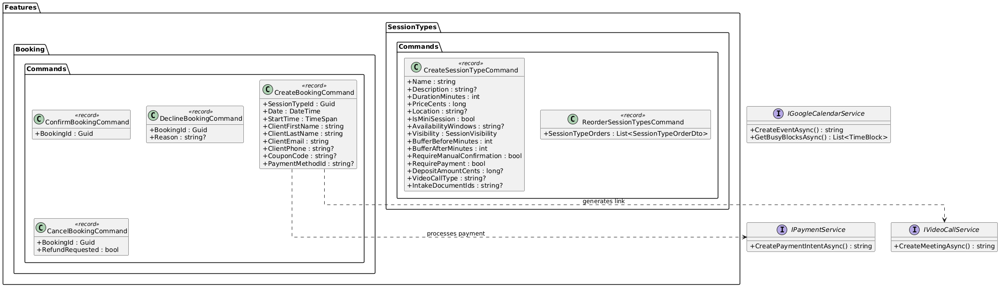

### Application Layer -- Booking Queries

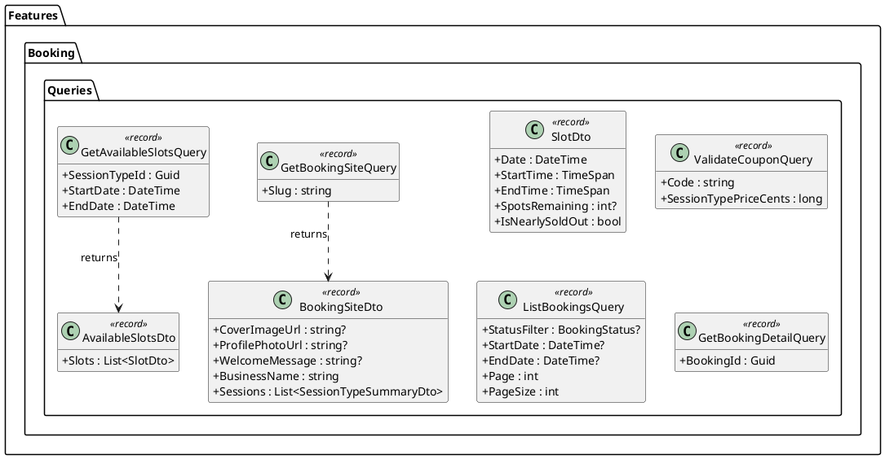
```plantuml
@startuml
skinparam classAttributeIconSize 0
skinparam linetype ortho
hide empty methods

package "Features.Booking.Queries" {
  class GetBookingSiteQuery <<record>> {
    +Slug : string
  }

  class BookingSiteDto <<record>> {
    +CoverImageUrl : string?
    +ProfilePhotoUrl : string?
    +WelcomeMessage : string?
    +BusinessName : string
    +Sessions : List<SessionTypeSummaryDto>
  }

  class GetAvailableSlotsQuery <<record>> {
    +SessionTypeId : Guid
    +StartDate : DateTime
    +EndDate : DateTime
  }

  class AvailableSlotsDto <<record>> {
    +Slots : List<SlotDto>
  }

  class SlotDto <<record>> {
    +Date : DateTime
    +StartTime : TimeSpan
    +EndTime : TimeSpan
    +SpotsRemaining : int?
    +IsNearlySoldOut : bool
  }

  class ValidateCouponQuery <<record>> {
    +Code : string
    +SessionTypePriceCents : long
  }

  class ListBookingsQuery <<record>> {
    +StatusFilter : BookingStatus?
    +StartDate : DateTime?
    +EndDate : DateTime?
    +Page : int
    +PageSize : int
  }

  class GetBookingDetailQuery <<record>> {
    +BookingId : Guid
  }
}

GetAvailableSlotsQuery ..> AvailableSlotsDto : returns
GetBookingSiteQuery ..> BookingSiteDto : returns
@enduml
```

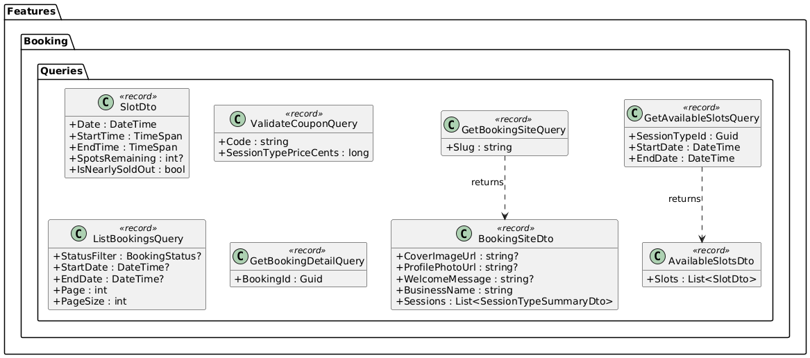

### Infrastructure Layer -- Calendar & Video Call Services

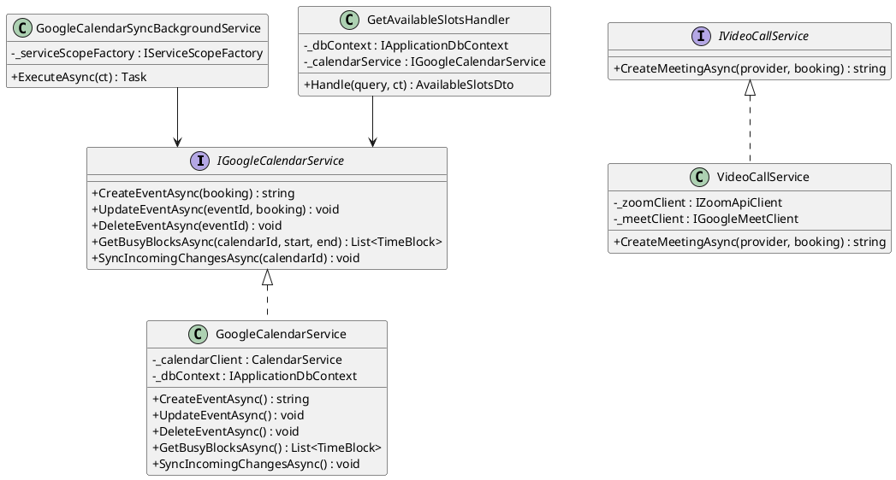
```plantuml
@startuml
skinparam classAttributeIconSize 0
skinparam linetype ortho
hide empty methods

interface IGoogleCalendarService {
  +CreateEventAsync(booking) : string
  +UpdateEventAsync(eventId, booking) : void
  +DeleteEventAsync(eventId) : void
  +GetBusyBlocksAsync(calendarId, start, end) : List<TimeBlock>
  +SyncIncomingChangesAsync(calendarId) : void
}

interface IVideoCallService {
  +CreateMeetingAsync(provider, booking) : string
}

class GoogleCalendarService {
  -_calendarClient : CalendarService
  -_dbContext : IApplicationDbContext
  +CreateEventAsync() : string
  +UpdateEventAsync() : void
  +DeleteEventAsync() : void
  +GetBusyBlocksAsync() : List<TimeBlock>
  +SyncIncomingChangesAsync() : void
}

class GoogleCalendarSyncBackgroundService {
  -_serviceScopeFactory : IServiceScopeFactory
  +ExecuteAsync(ct) : Task
}

class VideoCallService {
  -_zoomClient : IZoomApiClient
  -_meetClient : IGoogleMeetClient
  +CreateMeetingAsync(provider, booking) : string
}

class GetAvailableSlotsHandler {
  -_dbContext : IApplicationDbContext
  -_calendarService : IGoogleCalendarService
  +Handle(query, ct) : AvailableSlotsDto
}

IGoogleCalendarService <|.. GoogleCalendarService
IVideoCallService <|.. VideoCallService
GoogleCalendarSyncBackgroundService --> IGoogleCalendarService
GetAvailableSlotsHandler --> IGoogleCalendarService
@enduml
```

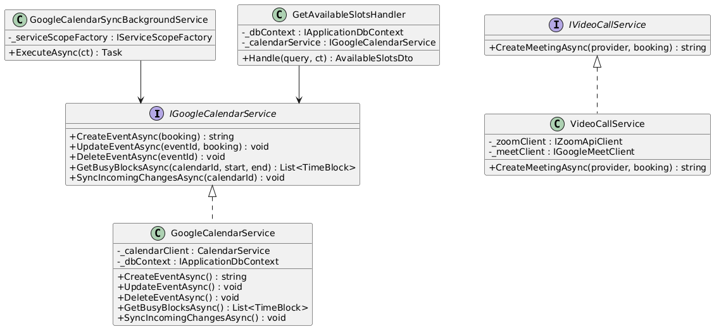

### API Layer -- Booking Controllers

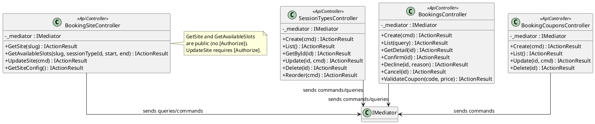
```plantuml
@startuml
skinparam classAttributeIconSize 0
skinparam linetype ortho
hide empty methods

class BookingSiteController <<ApiController>> {
  -_mediator : IMediator
  +GetSite(slug) : IActionResult
  +GetAvailableSlots(slug, sessionTypeId, start, end) : IActionResult
  +UpdateSite(cmd) : IActionResult
  +GetSiteConfig() : IActionResult
}

class SessionTypesController <<ApiController>> {
  -_mediator : IMediator
  +Create(cmd) : IActionResult
  +List() : IActionResult
  +GetById(id) : IActionResult
  +Update(id, cmd) : IActionResult
  +Delete(id) : IActionResult
  +Reorder(cmd) : IActionResult
}

class BookingsController <<ApiController>> {
  -_mediator : IMediator
  +Create(cmd) : IActionResult
  +List(query) : IActionResult
  +GetDetail(id) : IActionResult
  +Confirm(id) : IActionResult
  +Decline(id, reason) : IActionResult
  +Cancel(id) : IActionResult
  +ValidateCoupon(code, price) : IActionResult
}

class BookingCouponsController <<ApiController>> {
  -_mediator : IMediator
  +Create(cmd) : IActionResult
  +List() : IActionResult
  +Update(id, cmd) : IActionResult
  +Delete(id) : IActionResult
}

note right of BookingSiteController
  GetSite and GetAvailableSlots
  are public (no [Authorize]).
  UpdateSite requires [Authorize].
end note

BookingSiteController --> "IMediator" : sends queries/commands
SessionTypesController --> "IMediator" : sends commands/queries
BookingsController --> "IMediator" : sends commands/queries
BookingCouponsController --> "IMediator" : sends commands
@enduml
```

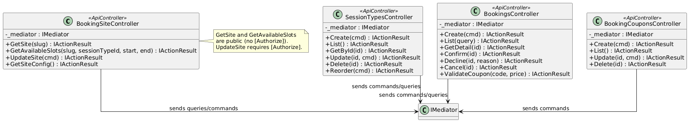

---

## Sequence Diagrams

### View Booking Site & Available Slots

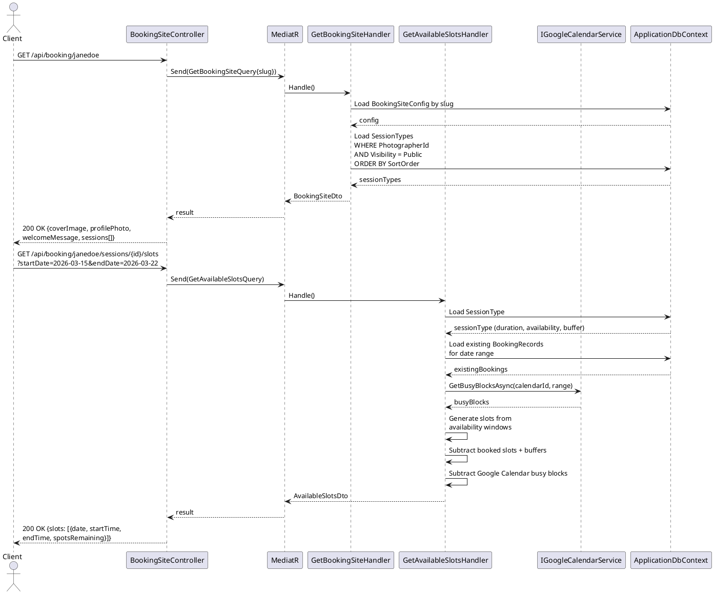
```plantuml
@startuml
actor Client as C
participant "BookingSiteController" as BSC
participant "MediatR" as M
participant "GetBookingSiteHandler" as SH
participant "GetAvailableSlotsHandler" as AH
participant "IGoogleCalendarService" as GC
participant "ApplicationDbContext" as DB

C -> BSC : GET /api/booking/janedoe
BSC -> M : Send(GetBookingSiteQuery{slug})
M -> SH : Handle()
SH -> DB : Load BookingSiteConfig by slug
DB --> SH : config
SH -> DB : Load SessionTypes\nWHERE PhotographerId\nAND Visibility = Public\nORDER BY SortOrder
DB --> SH : sessionTypes
SH --> M : BookingSiteDto
M --> BSC : result
BSC --> C : 200 OK {coverImage, profilePhoto,\nwelcomeMessage, sessions[]}

C -> BSC : GET /api/booking/janedoe/sessions/{id}/slots\n?startDate=2026-03-15&endDate=2026-03-22
BSC -> M : Send(GetAvailableSlotsQuery)
M -> AH : Handle()
AH -> DB : Load SessionType
DB --> AH : sessionType (duration, availability, buffer)
AH -> DB : Load existing BookingRecords\nfor date range
DB --> AH : existingBookings
AH -> GC : GetBusyBlocksAsync(calendarId, range)
GC --> AH : busyBlocks
AH -> AH : Generate slots from\navailability windows
AH -> AH : Subtract booked slots + buffers
AH -> AH : Subtract Google Calendar busy blocks
AH --> M : AvailableSlotsDto
M --> BSC : result
BSC --> C : 200 OK {slots: [{date, startTime,\nendTime, spotsRemaining}]}
@enduml
```

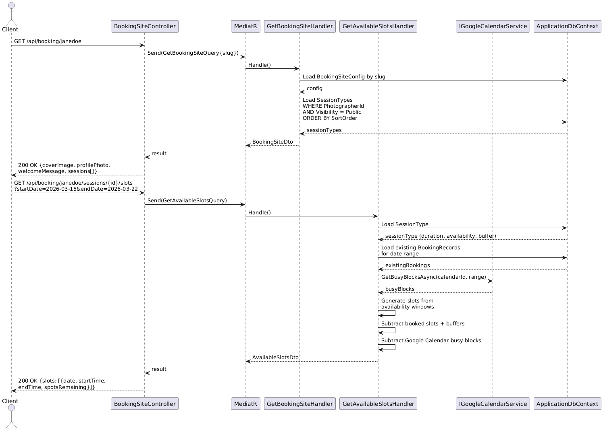

### Complete Booking Flow

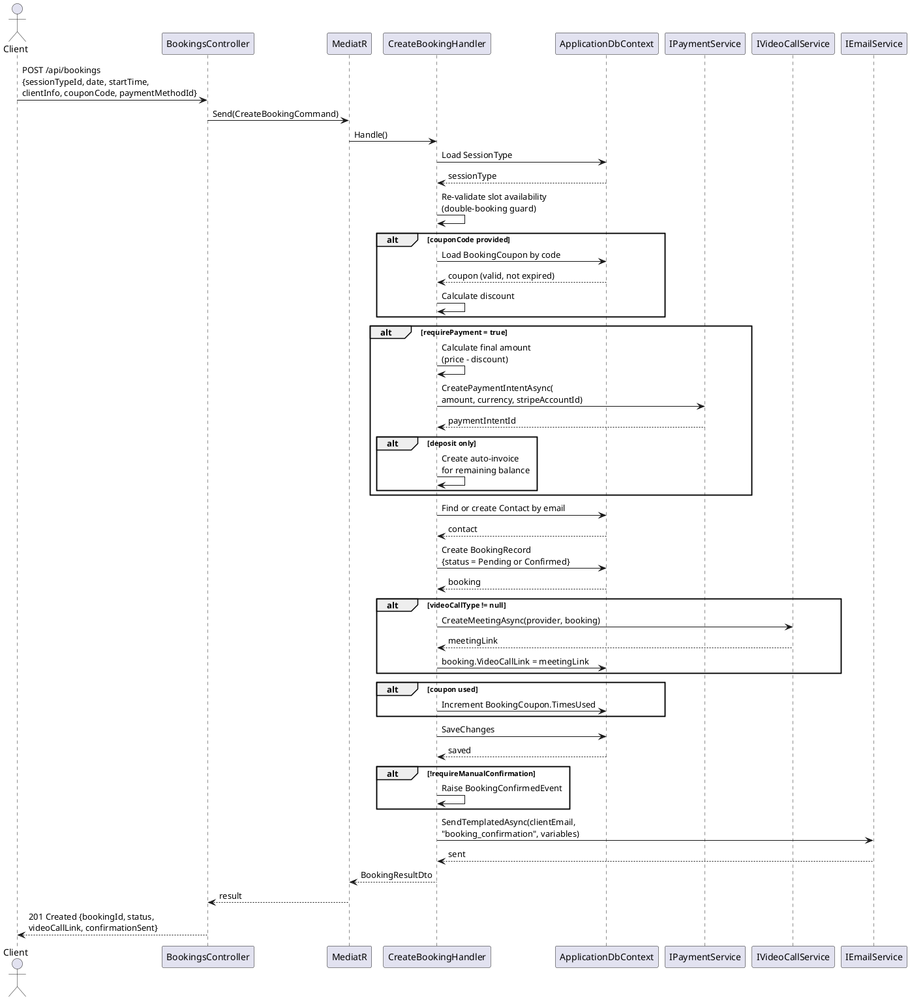
```plantuml
@startuml
actor Client as C
participant "BookingsController" as BC
participant "MediatR" as M
participant "CreateBookingHandler" as BH
participant "ApplicationDbContext" as DB
participant "IPaymentService" as PS
participant "IVideoCallService" as VC
participant "IEmailService" as ES

C -> BC : POST /api/bookings\n{sessionTypeId, date, startTime,\nclientInfo, couponCode, paymentMethodId}
BC -> M : Send(CreateBookingCommand)
M -> BH : Handle()

BH -> DB : Load SessionType
DB --> BH : sessionType

BH -> BH : Re-validate slot availability\n(double-booking guard)

alt couponCode provided
  BH -> DB : Load BookingCoupon by code
  DB --> BH : coupon (valid, not expired)
  BH -> BH : Calculate discount
end

alt requirePayment = true
  BH -> BH : Calculate final amount\n(price - discount)
  BH -> PS : CreatePaymentIntentAsync(\namount, currency, stripeAccountId)
  PS --> BH : paymentIntentId

  alt deposit only
    BH -> BH : Create auto-invoice\nfor remaining balance
  end
end

BH -> DB : Find or create Contact by email
DB --> BH : contact

BH -> DB : Create BookingRecord\n{status = Pending or Confirmed}
DB --> BH : booking

alt videoCallType != null
  BH -> VC : CreateMeetingAsync(provider, booking)
  VC --> BH : meetingLink
  BH -> DB : booking.VideoCallLink = meetingLink
end

alt coupon used
  BH -> DB : Increment BookingCoupon.TimesUsed
end

BH -> DB : SaveChanges
DB --> BH : saved

alt !requireManualConfirmation
  BH -> BH : Raise BookingConfirmedEvent
end

BH -> ES : SendTemplatedAsync(clientEmail,\n"booking_confirmation", variables)
ES --> BH : sent

BH --> M : BookingResultDto
M --> BC : result
BC --> C : 201 Created {bookingId, status,\nvideoCallLink, confirmationSent}
@enduml
```

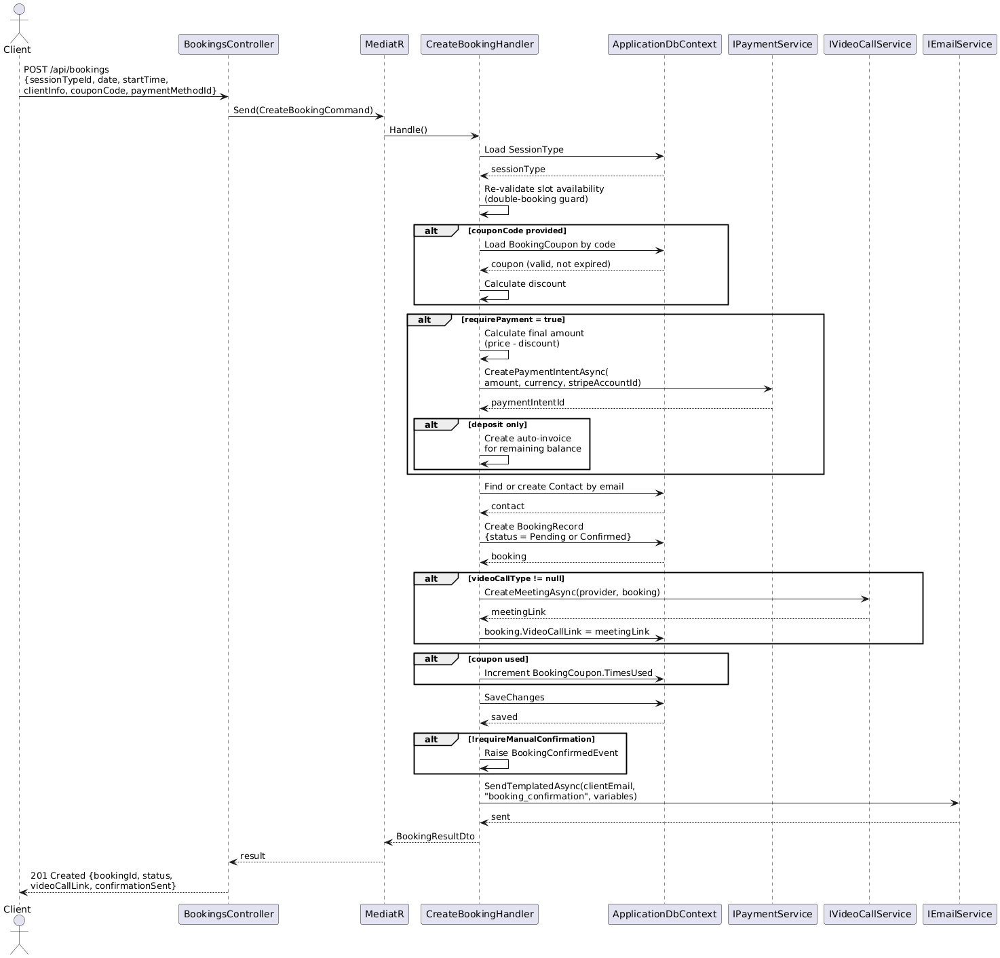

### Manual Booking Confirmation

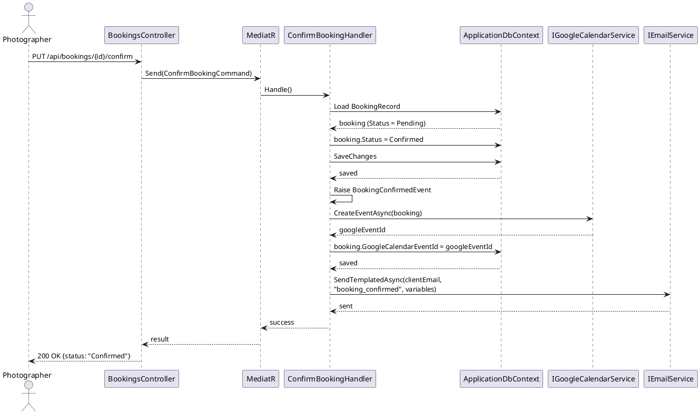
```plantuml
@startuml
actor Photographer as P
participant "BookingsController" as BC
participant "MediatR" as M
participant "ConfirmBookingHandler" as CH
participant "ApplicationDbContext" as DB
participant "IGoogleCalendarService" as GC
participant "IEmailService" as ES

P -> BC : PUT /api/bookings/{id}/confirm
BC -> M : Send(ConfirmBookingCommand)
M -> CH : Handle()
CH -> DB : Load BookingRecord
DB --> CH : booking (Status = Pending)
CH -> DB : booking.Status = Confirmed
CH -> DB : SaveChanges
DB --> CH : saved

CH -> CH : Raise BookingConfirmedEvent

CH -> GC : CreateEventAsync(booking)
GC --> CH : googleEventId
CH -> DB : booking.GoogleCalendarEventId = googleEventId
DB --> CH : saved

CH -> ES : SendTemplatedAsync(clientEmail,\n"booking_confirmed", variables)
ES --> CH : sent

CH --> M : success
M --> BC : result
BC --> P : 200 OK {status: "Confirmed"}
@enduml
```

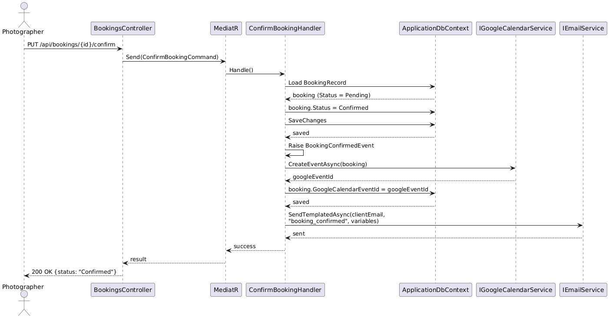

### Google Calendar Two-Way Sync

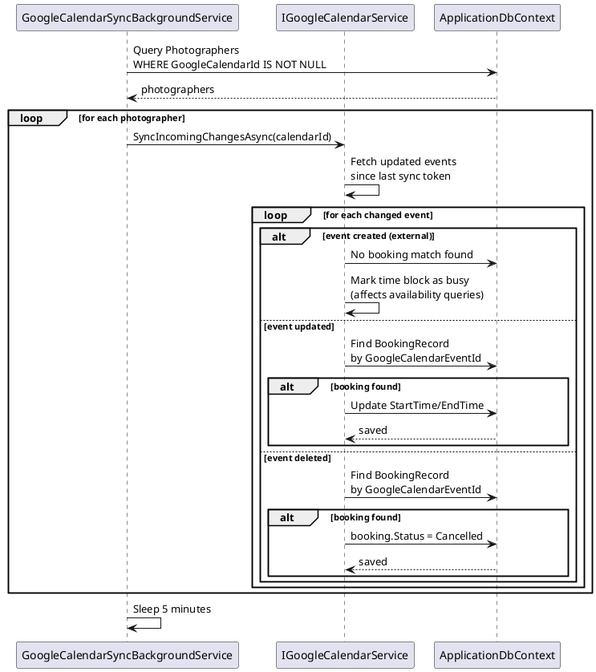
```plantuml
@startuml
participant "GoogleCalendarSyncBackgroundService" as BG
participant "IGoogleCalendarService" as GC
participant "ApplicationDbContext" as DB

BG -> DB : Query Photographers\nWHERE GoogleCalendarId IS NOT NULL
DB --> BG : photographers

loop for each photographer
  BG -> GC : SyncIncomingChangesAsync(calendarId)

  GC -> GC : Fetch updated events\nsince last sync token

  loop for each changed event
    alt event created (external)
      GC -> DB : No booking match found
      GC -> GC : Mark time block as busy\n(affects availability queries)
    else event updated
      GC -> DB : Find BookingRecord\nby GoogleCalendarEventId
      alt booking found
        GC -> DB : Update StartTime/EndTime
        DB --> GC : saved
      end
    else event deleted
      GC -> DB : Find BookingRecord\nby GoogleCalendarEventId
      alt booking found
        GC -> DB : booking.Status = Cancelled
        DB --> GC : saved
      end
    end
  end
end

BG -> BG : Sleep 5 minutes
@enduml
```

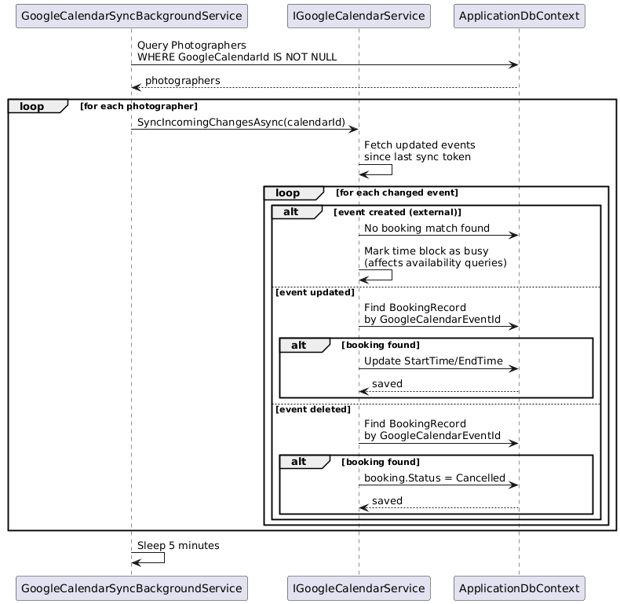

### Mini Session Availability with "Nearly Sold Out"

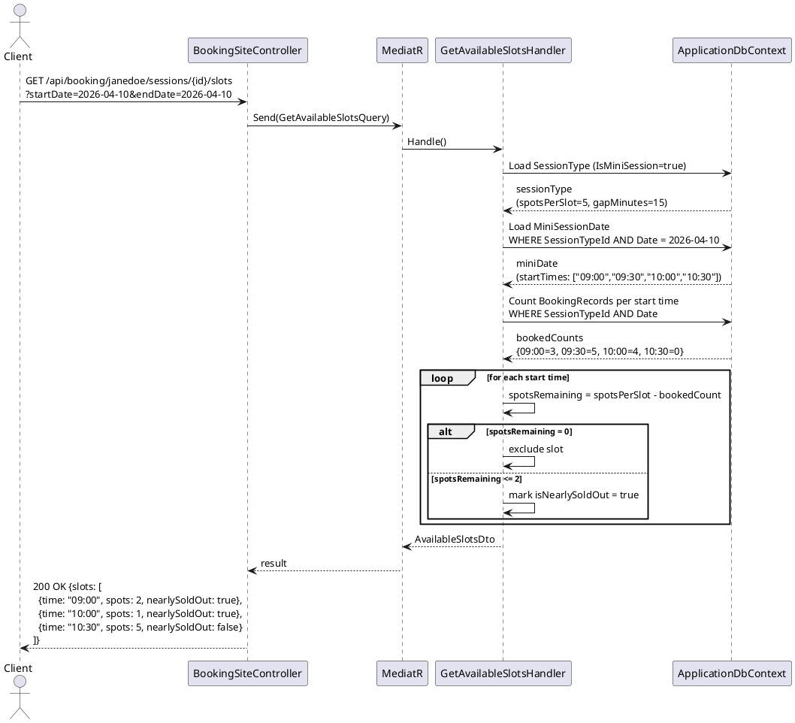
```plantuml
@startuml
actor Client as C
participant "BookingSiteController" as BSC
participant "MediatR" as M
participant "GetAvailableSlotsHandler" as AH
participant "ApplicationDbContext" as DB

C -> BSC : GET /api/booking/janedoe/sessions/{id}/slots\n?startDate=2026-04-10&endDate=2026-04-10
BSC -> M : Send(GetAvailableSlotsQuery)
M -> AH : Handle()
AH -> DB : Load SessionType (IsMiniSession=true)
DB --> AH : sessionType\n(spotsPerSlot=5, gapMinutes=15)
AH -> DB : Load MiniSessionDate\nWHERE SessionTypeId AND Date = 2026-04-10
DB --> AH : miniDate\n(startTimes: ["09:00","09:30","10:00","10:30"])
AH -> DB : Count BookingRecords per start time\nWHERE SessionTypeId AND Date
DB --> AH : bookedCounts\n{09:00=3, 09:30=5, 10:00=4, 10:30=0}

loop for each start time
  AH -> AH : spotsRemaining = spotsPerSlot - bookedCount
  alt spotsRemaining = 0
    AH -> AH : exclude slot
  else spotsRemaining <= 2
    AH -> AH : mark isNearlySoldOut = true
  end
end

AH --> M : AvailableSlotsDto
M --> BSC : result
BSC --> C : 200 OK {slots: [\n  {time: "09:00", spots: 2, nearlySoldOut: true},\n  {time: "10:00", spots: 1, nearlySoldOut: true},\n  {time: "10:30", spots: 5, nearlySoldOut: false}\n]}
@enduml
```

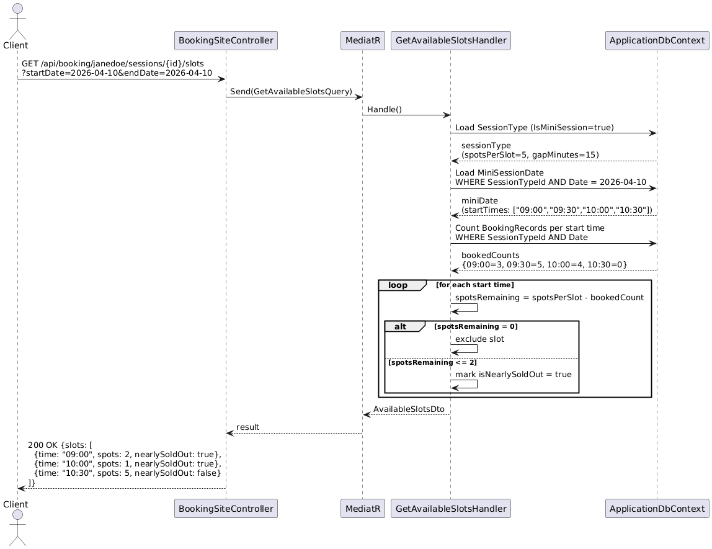

### Apply Booking Coupon

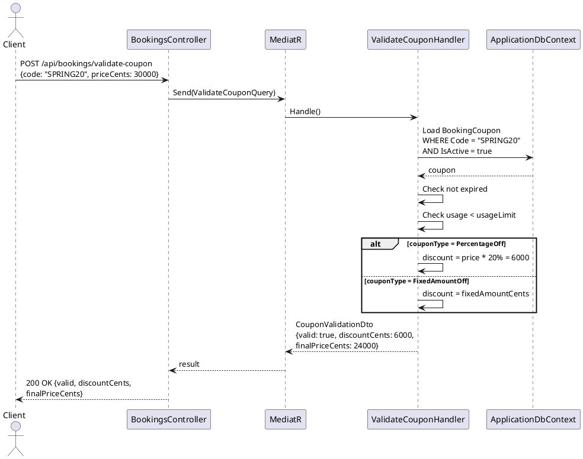
```plantuml
@startuml
actor Client as C
participant "BookingsController" as BC
participant "MediatR" as M
participant "ValidateCouponHandler" as VH
participant "ApplicationDbContext" as DB

C -> BC : POST /api/bookings/validate-coupon\n{code: "SPRING20", priceCents: 30000}
BC -> M : Send(ValidateCouponQuery)
M -> VH : Handle()
VH -> DB : Load BookingCoupon\nWHERE Code = "SPRING20"\nAND IsActive = true
DB --> VH : coupon

VH -> VH : Check not expired
VH -> VH : Check usage < usageLimit

alt couponType = PercentageOff
  VH -> VH : discount = price * 20% = 6000
else couponType = FixedAmountOff
  VH -> VH : discount = fixedAmountCents
end

VH --> M : CouponValidationDto\n{valid: true, discountCents: 6000,\nfinalPriceCents: 24000}
M --> BC : result
BC --> C : 200 OK {valid, discountCents,\nfinalPriceCents}
@enduml
```

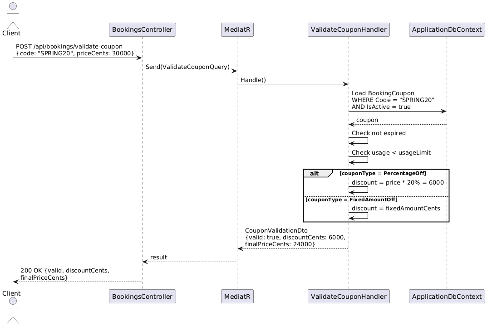
