# F26 - Contracts & E-Signatures

## Overview

This feature provides photographers with a full-lifecycle contract management system: authoring rich-content contracts, collecting client-fillable fields, auto-populating variables from contact profiles, capturing legally-timestamped e-signatures on any device, and managing document expiry with automated reminders. Contracts are first-class documents within the Studio Manager CRM, linkable to contacts and projects.

The contract editor supports structured rich content (headings, bold, italic, lists, paragraphs) stored as sanitized HTML, plus custom header images for branding. Client-fillable fields can be inserted anywhere in the document body with custom labels and optional pre-fill values. Auto-population variables (e.g., `{{client_name}}`, `{{client_email}}`) resolve from the linked contact's profile data when the contract is sent; custom variables prompt the photographer for values at send time.

E-signatures are captured digitally with timestamp, IP address, and user-agent metadata. By default, every contract includes a photographer and a client signature block at the bottom. Photographers can pre-sign before sending. Multi-signer support allows adding a second client signer (e.g., a spouse). Contract templates let photographers save and reuse configurations including content, fields, and variables, with at least three sample templates for common photography scenarios. Document expiry auto-cancels unsigned contracts after a configurable period, and automatic reminder emails nudge clients at configurable intervals until they sign (both features available on upgraded plans).

**L2 Requirements:** CON-4.4.1 (Contract Editor), CON-4.4.2 (Client-Fillable Fields), CON-4.4.3 (Auto-Population Variables), CON-4.4.4 (E-Signatures), CON-4.4.5 (Contract Templates), CON-4.4.6 (Document Expiry), CON-4.4.7 (Automatic Reminders)

---

## Components

### Domain Layer

| Component | Type | Description |
|-----------|------|-------------|
| `Contract` | Entity | Rich-content contract with HTML body, header image, status lifecycle, expiry settings, reminder configuration, and template flag. Implements `ITenantEntity`, `ISoftDeletable`, `IAuditableEntity`. |
| `ContractField` | Entity | Client-fillable field or auto-population variable inserted in the contract body. Stores label, default value, client-entered value, variable key, and sort order. |
| `ContractSignature` | Entity | Digital signature record capturing signer name, email, role (Photographer/Client/SecondClient), Base64 signature data, timestamp, IP, and user-agent. |
| `ContractStatus` | Enum | `Draft`, `Sent`, `Viewed`, `Signed`, `Expired`, `Cancelled`. |

### Application Layer

| Component | Type | Description |
|-----------|------|-------------|
| `CreateContractCommand` | Command | Creates a new contract with title, HTML content, header image, fields, and linked contact/project. Returns the contract ID. |
| `UpdateContractCommand` | Command | Updates content, fields, header image, expiry settings, and reminder configuration on a draft contract. |
| `DeleteContractCommand` | Command | Soft-deletes a contract. |
| `SendContractCommand` | Command | Transitions status to `Sent`, sets `SentAt`, calculates `ExpiresAt`, resolves auto-population variables from contact profile, and sends email to client via `IEmailService`. |
| `PreSignContractCommand` | Command | Captures the photographer's signature before sending. |
| `SignContractCommand` | Command | Captures a client signature (or second-client signature) with timestamp, IP, user-agent. When all required signatures are collected, transitions status to `Signed` and stops reminders. |
| `AddSignerCommand` | Command | Adds a second client signer to the contract (multi-signer support). |
| `ViewContractQuery` | Query | Returns full contract detail including content, fields, and signature status. Transitions status to `Viewed` if currently `Sent`. |
| `ListContractsQuery` | Query | Returns paginated list of contracts for the authenticated photographer, filterable by status and contact. |
| `GetContractByTokenQuery` | Query | Returns the client-facing contract view using a secure access token (no auth required). |
| `SaveContractTemplateCommand` | Command | Saves a contract configuration as a reusable template (sets `IsTemplate = true` with a template name). |
| `ListContractTemplatesQuery` | Query | Returns all saved contract templates for the photographer. |
| `ApplyContractTemplateCommand` | Command | Creates a new contract from a template, copying content, fields, and variables. Prompts for custom variable values. |
| `CancelContractCommand` | Command | Manually cancels a sent/viewed contract, setting status to `Cancelled`. |
| `ProcessContractExpiryCommand` | Command | Background job command: finds contracts past `ExpiresAt`, transitions to `Expired`, notifies photographer. |
| `SendContractRemindersCommand` | Command | Background job command: finds contracts due for reminders based on interval, sends email, updates `LastReminderSentAt`. |
| `ContractDto` | DTO | Contract summary for list views. |
| `ContractDetailDto` | DTO | Full contract detail with content, fields, signatures. |
| `ContractTemplateDto` | DTO | Template summary for selection. |

### Infrastructure Layer

| Component | Type | Description |
|-----------|------|-------------|
| `CreateContractCommandHandler` | Handler | Validates input, creates `Contract` + `ContractField` entities, persists to database. |
| `SendContractCommandHandler` | Handler | Resolves auto-population variables from `Contact` profile, generates secure client access token, sends email via `IEmailService`, updates status. |
| `SignContractCommandHandler` | Handler | Validates signer role, creates `ContractSignature`, checks if all required signatures are present, transitions to `Signed`. |
| `ProcessContractExpiryHandler` | Handler | Queries contracts where `ExpiresAt < UtcNow` and `Status = Sent/Viewed`, updates to `Expired`, sends notification. |
| `SendContractRemindersHandler` | Handler | Queries contracts due for reminder, validates plan supports reminders, sends email, updates timestamp. |
| `ContractExpiryJob` | Background Job | Hangfire/Quartz recurring job that dispatches `ProcessContractExpiryCommand`. |
| `ContractReminderJob` | Background Job | Hangfire/Quartz recurring job that dispatches `SendContractRemindersCommand`. |

### API Layer

| Component | Type | Description |
|-----------|------|-------------|
| `ContractsController` | Controller | Authenticated endpoints: `POST` (create), `PUT /{id}` (update), `DELETE /{id}`, `POST /{id}/send`, `POST /{id}/pre-sign`, `POST /{id}/add-signer`, `POST /{id}/cancel`, `GET` (list), `GET /{id}` (detail). |
| `ContractTemplatesController` | Controller | Authenticated endpoints: `POST` (save template), `GET` (list templates), `POST /{id}/apply` (create from template). |
| `ContractPublicController` | Controller | Anonymous endpoints: `GET /contracts/view/{token}` (client view), `POST /contracts/sign/{token}` (client signature). |

---

## Class Diagrams

### Domain Layer -- Contract Entities

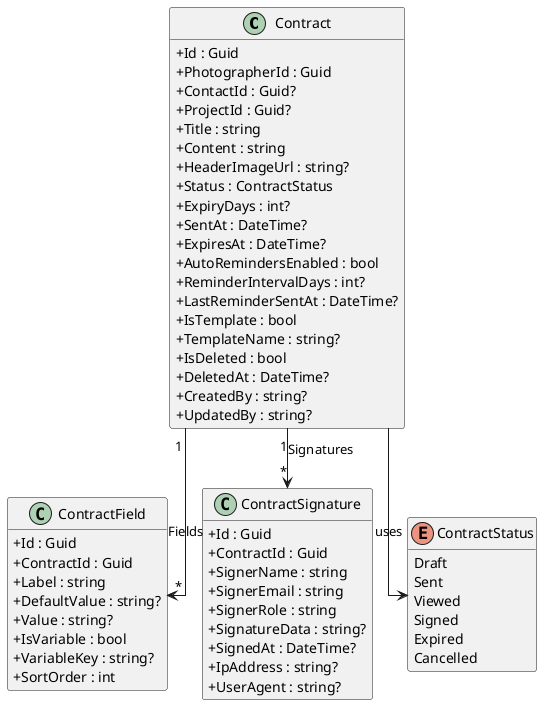
```plantuml
@startuml
skinparam classAttributeIconSize 0
skinparam linetype ortho
hide empty methods

class Contract {
  +Id : Guid
  +PhotographerId : Guid
  +ContactId : Guid?
  +ProjectId : Guid?
  +Title : string
  +Content : string
  +HeaderImageUrl : string?
  +Status : ContractStatus
  +ExpiryDays : int?
  +SentAt : DateTime?
  +ExpiresAt : DateTime?
  +AutoRemindersEnabled : bool
  +ReminderIntervalDays : int?
  +LastReminderSentAt : DateTime?
  +IsTemplate : bool
  +TemplateName : string?
  +IsDeleted : bool
  +DeletedAt : DateTime?
  +CreatedBy : string?
  +UpdatedBy : string?
}

class ContractField {
  +Id : Guid
  +ContractId : Guid
  +Label : string
  +DefaultValue : string?
  +Value : string?
  +IsVariable : bool
  +VariableKey : string?
  +SortOrder : int
}

class ContractSignature {
  +Id : Guid
  +ContractId : Guid
  +SignerName : string
  +SignerEmail : string
  +SignerRole : string
  +SignatureData : string?
  +SignedAt : DateTime?
  +IpAddress : string?
  +UserAgent : string?
}

enum ContractStatus {
  Draft
  Sent
  Viewed
  Signed
  Expired
  Cancelled
}

Contract "1" --> "*" ContractField : Fields
Contract "1" --> "*" ContractSignature : Signatures
Contract --> ContractStatus : uses
@enduml
```

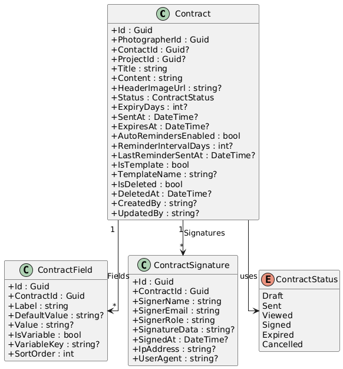

### Application Layer -- Contract Commands & Queries

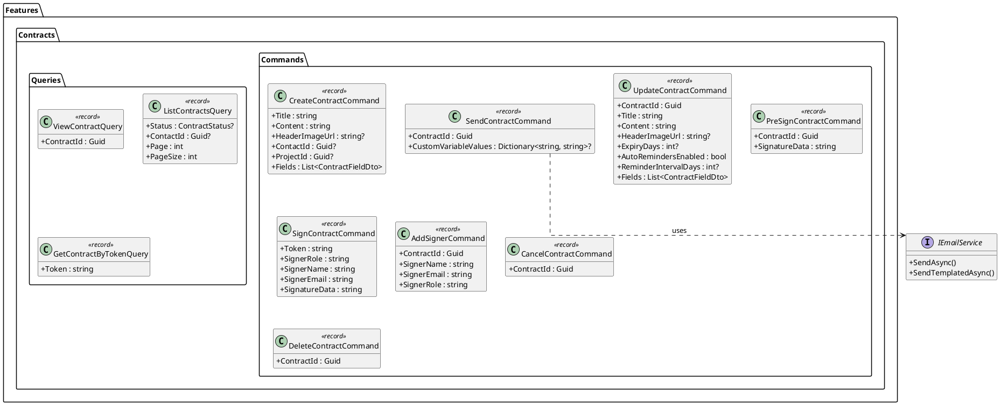
```plantuml
@startuml
skinparam classAttributeIconSize 0
skinparam linetype ortho
hide empty methods

package "Features.Contracts.Commands" {
  class CreateContractCommand <<record>> {
    +Title : string
    +Content : string
    +HeaderImageUrl : string?
    +ContactId : Guid?
    +ProjectId : Guid?
    +Fields : List<ContractFieldDto>
  }

  class UpdateContractCommand <<record>> {
    +ContractId : Guid
    +Title : string
    +Content : string
    +HeaderImageUrl : string?
    +ExpiryDays : int?
    +AutoRemindersEnabled : bool
    +ReminderIntervalDays : int?
    +Fields : List<ContractFieldDto>
  }

  class SendContractCommand <<record>> {
    +ContractId : Guid
    +CustomVariableValues : Dictionary<string, string>?
  }

  class PreSignContractCommand <<record>> {
    +ContractId : Guid
    +SignatureData : string
  }

  class SignContractCommand <<record>> {
    +Token : string
    +SignerRole : string
    +SignerName : string
    +SignerEmail : string
    +SignatureData : string
  }

  class AddSignerCommand <<record>> {
    +ContractId : Guid
    +SignerName : string
    +SignerEmail : string
    +SignerRole : string
  }

  class CancelContractCommand <<record>> {
    +ContractId : Guid
  }

  class DeleteContractCommand <<record>> {
    +ContractId : Guid
  }
}

package "Features.Contracts.Queries" {
  class ViewContractQuery <<record>> {
    +ContractId : Guid
  }

  class ListContractsQuery <<record>> {
    +Status : ContractStatus?
    +ContactId : Guid?
    +Page : int
    +PageSize : int
  }

  class GetContractByTokenQuery <<record>> {
    +Token : string
  }
}

interface IEmailService {
  +SendAsync()
  +SendTemplatedAsync()
}

SendContractCommand ..> IEmailService : uses
@enduml
```

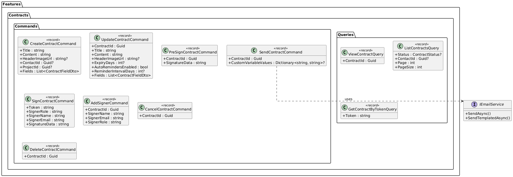

### Application Layer -- Contract Template Commands

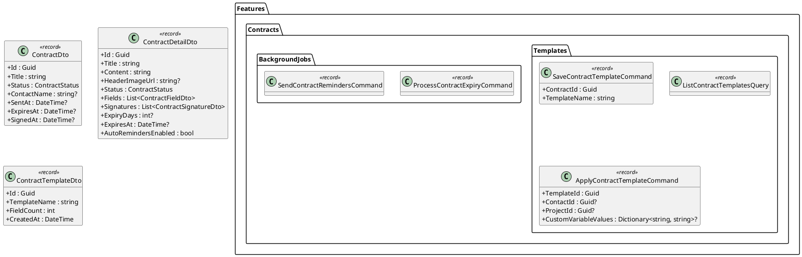
```plantuml
@startuml
skinparam classAttributeIconSize 0
skinparam linetype ortho
hide empty methods

package "Features.Contracts.Templates" {
  class SaveContractTemplateCommand <<record>> {
    +ContractId : Guid
    +TemplateName : string
  }

  class ListContractTemplatesQuery <<record>>

  class ApplyContractTemplateCommand <<record>> {
    +TemplateId : Guid
    +ContactId : Guid?
    +ProjectId : Guid?
    +CustomVariableValues : Dictionary<string, string>?
  }
}

package "Features.Contracts.BackgroundJobs" {
  class ProcessContractExpiryCommand <<record>>
  class SendContractRemindersCommand <<record>>
}

class ContractDto <<record>> {
  +Id : Guid
  +Title : string
  +Status : ContractStatus
  +ContactName : string?
  +SentAt : DateTime?
  +ExpiresAt : DateTime?
  +SignedAt : DateTime?
}

class ContractDetailDto <<record>> {
  +Id : Guid
  +Title : string
  +Content : string
  +HeaderImageUrl : string?
  +Status : ContractStatus
  +Fields : List<ContractFieldDto>
  +Signatures : List<ContractSignatureDto>
  +ExpiryDays : int?
  +ExpiresAt : DateTime?
  +AutoRemindersEnabled : bool
}

class ContractTemplateDto <<record>> {
  +Id : Guid
  +TemplateName : string
  +FieldCount : int
  +CreatedAt : DateTime
}
@enduml
```

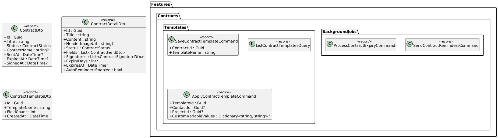

### API Layer -- Contract Controllers

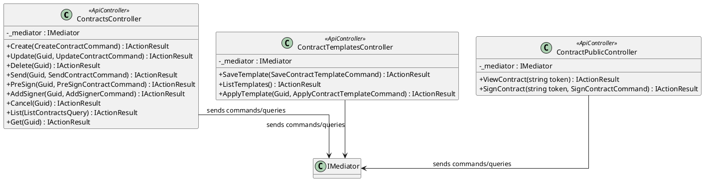
```plantuml
@startuml
skinparam classAttributeIconSize 0
skinparam linetype ortho
hide empty methods

class ContractsController <<ApiController>> {
  -_mediator : IMediator
  +Create(CreateContractCommand) : IActionResult
  +Update(Guid, UpdateContractCommand) : IActionResult
  +Delete(Guid) : IActionResult
  +Send(Guid, SendContractCommand) : IActionResult
  +PreSign(Guid, PreSignContractCommand) : IActionResult
  +AddSigner(Guid, AddSignerCommand) : IActionResult
  +Cancel(Guid) : IActionResult
  +List(ListContractsQuery) : IActionResult
  +Get(Guid) : IActionResult
}

class ContractTemplatesController <<ApiController>> {
  -_mediator : IMediator
  +SaveTemplate(SaveContractTemplateCommand) : IActionResult
  +ListTemplates() : IActionResult
  +ApplyTemplate(Guid, ApplyContractTemplateCommand) : IActionResult
}

class ContractPublicController <<ApiController>> {
  -_mediator : IMediator
  +ViewContract(string token) : IActionResult
  +SignContract(string token, SignContractCommand) : IActionResult
}

ContractsController --> "IMediator" : sends commands/queries
ContractTemplatesController --> "IMediator" : sends commands/queries
ContractPublicController --> "IMediator" : sends commands/queries
@enduml
```

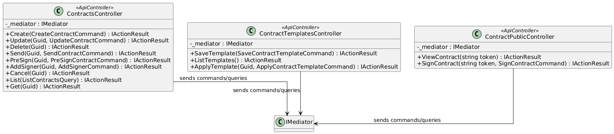

---

## Sequence Diagrams

### Create and Send Contract

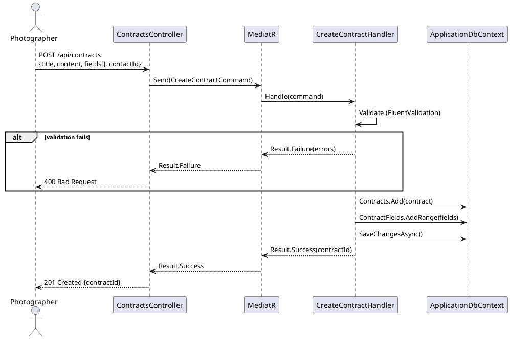
```plantuml
@startuml
actor Photographer as P
participant "ContractsController" as CC
participant "MediatR" as M
participant "CreateContractHandler" as CH
participant "ApplicationDbContext" as DB

P -> CC : POST /api/contracts\n{title, content, fields[], contactId}
CC -> M : Send(CreateContractCommand)
M -> CH : Handle(command)

CH -> CH : Validate (FluentValidation)
alt validation fails
  CH --> M : Result.Failure(errors)
  M --> CC : Result.Failure
  CC --> P : 400 Bad Request
end

CH -> DB : Contracts.Add(contract)
CH -> DB : ContractFields.AddRange(fields)
CH -> DB : SaveChangesAsync()
CH --> M : Result.Success(contractId)
M --> CC : Result.Success
CC --> P : 201 Created {contractId}
@enduml
```

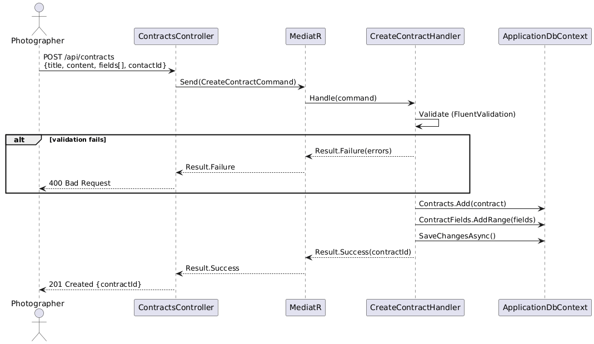

### Send Contract to Client

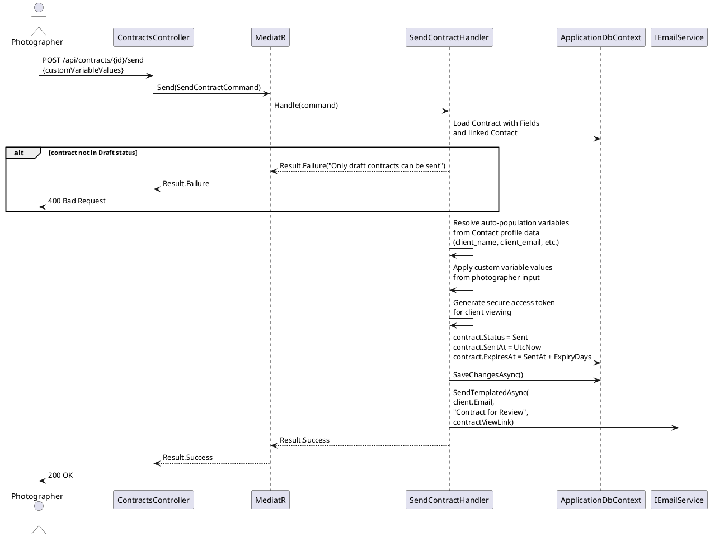
```plantuml
@startuml
actor Photographer as P
participant "ContractsController" as CC
participant "MediatR" as M
participant "SendContractHandler" as SH
participant "ApplicationDbContext" as DB
participant "IEmailService" as ES

P -> CC : POST /api/contracts/{id}/send\n{customVariableValues}
CC -> M : Send(SendContractCommand)
M -> SH : Handle(command)

SH -> DB : Load Contract with Fields\nand linked Contact
alt contract not in Draft status
  SH --> M : Result.Failure("Only draft contracts can be sent")
  M --> CC : Result.Failure
  CC --> P : 400 Bad Request
end

SH -> SH : Resolve auto-population variables\nfrom Contact profile data\n(client_name, client_email, etc.)

SH -> SH : Apply custom variable values\nfrom photographer input

SH -> SH : Generate secure access token\nfor client viewing

SH -> DB : contract.Status = Sent\ncontract.SentAt = UtcNow\ncontract.ExpiresAt = SentAt + ExpiryDays
SH -> DB : SaveChangesAsync()

SH -> ES : SendTemplatedAsync(\nclient.Email,\n"Contract for Review",\ncontractViewLink)

SH --> M : Result.Success
M --> CC : Result.Success
CC --> P : 200 OK
@enduml
```

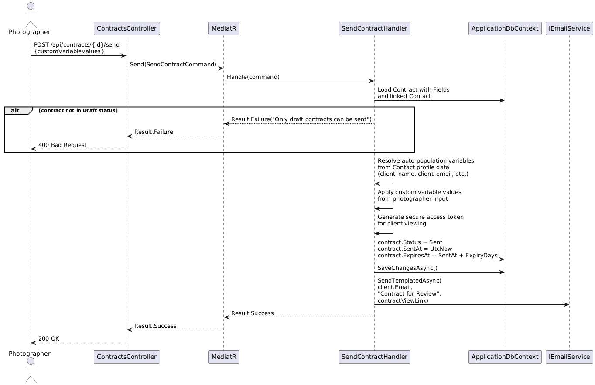

### Client Views and Signs Contract

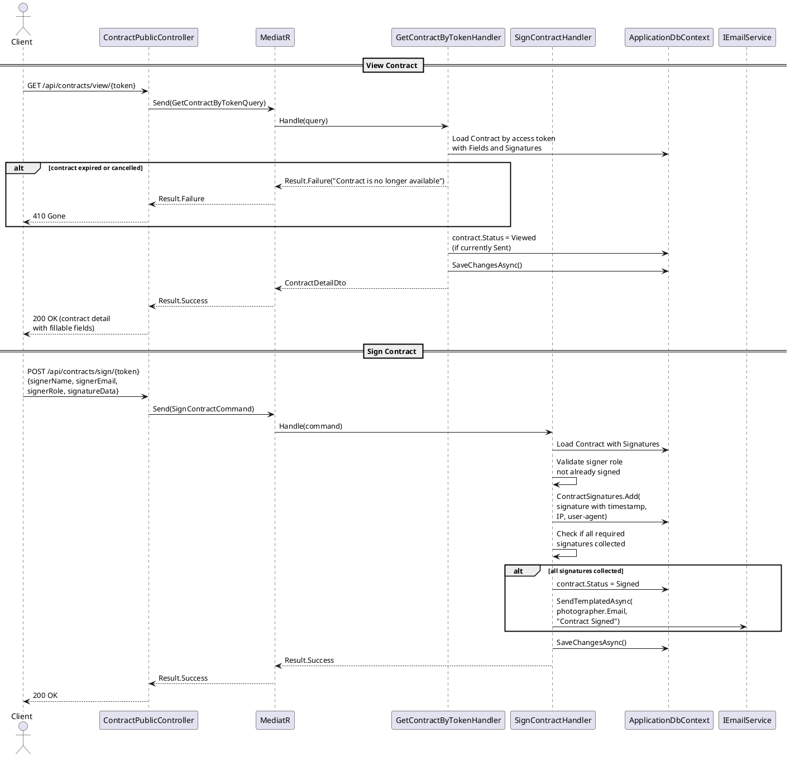
```plantuml
@startuml
actor Client as C
participant "ContractPublicController" as CPC
participant "MediatR" as M
participant "GetContractByTokenHandler" as GH
participant "SignContractHandler" as SH
participant "ApplicationDbContext" as DB
participant "IEmailService" as ES

== View Contract ==
C -> CPC : GET /api/contracts/view/{token}
CPC -> M : Send(GetContractByTokenQuery)
M -> GH : Handle(query)

GH -> DB : Load Contract by access token\nwith Fields and Signatures

alt contract expired or cancelled
  GH --> M : Result.Failure("Contract is no longer available")
  M --> CPC : Result.Failure
  CPC --> C : 410 Gone
end

GH -> DB : contract.Status = Viewed\n(if currently Sent)
GH -> DB : SaveChangesAsync()
GH --> M : ContractDetailDto
M --> CPC : Result.Success
CPC --> C : 200 OK (contract detail\nwith fillable fields)

== Sign Contract ==
C -> CPC : POST /api/contracts/sign/{token}\n{signerName, signerEmail,\nsignerRole, signatureData}
CPC -> M : Send(SignContractCommand)
M -> SH : Handle(command)

SH -> DB : Load Contract with Signatures
SH -> SH : Validate signer role\nnot already signed

SH -> DB : ContractSignatures.Add(\nsignature with timestamp,\nIP, user-agent)

SH -> SH : Check if all required\nsignatures collected

alt all signatures collected
  SH -> DB : contract.Status = Signed
  SH -> ES : SendTemplatedAsync(\nphotographer.Email,\n"Contract Signed")
end

SH -> DB : SaveChangesAsync()
SH --> M : Result.Success
M --> CPC : Result.Success
CPC --> C : 200 OK
@enduml
```

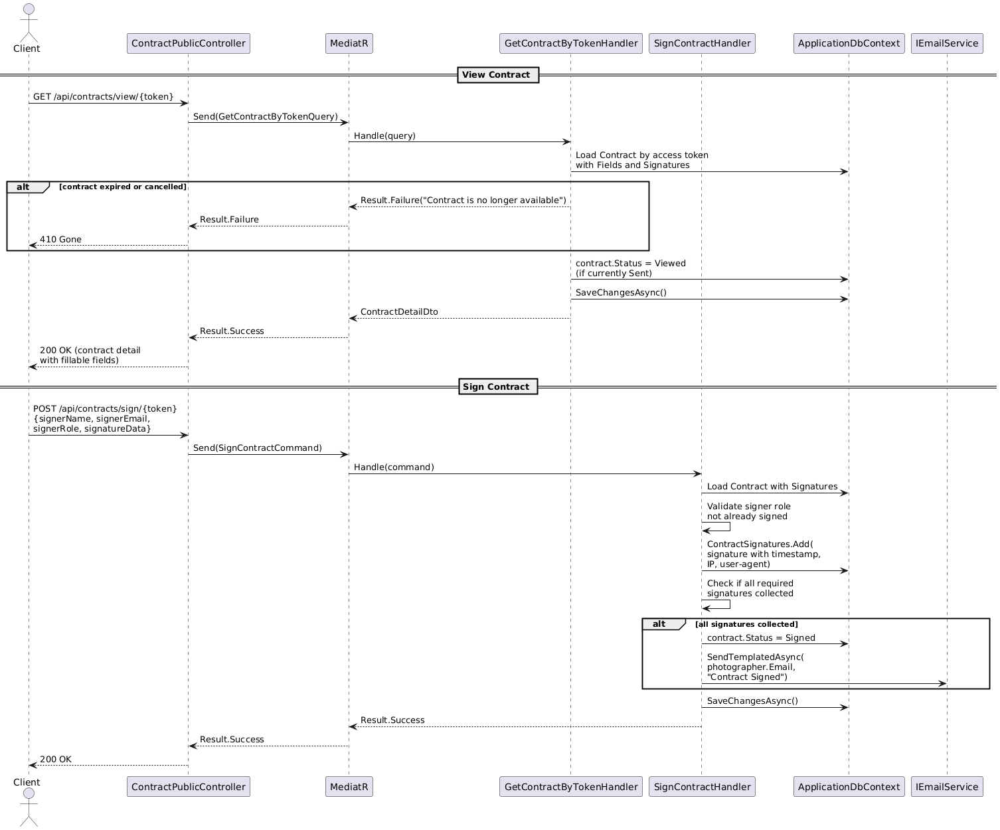

### Photographer Pre-Signs Contract

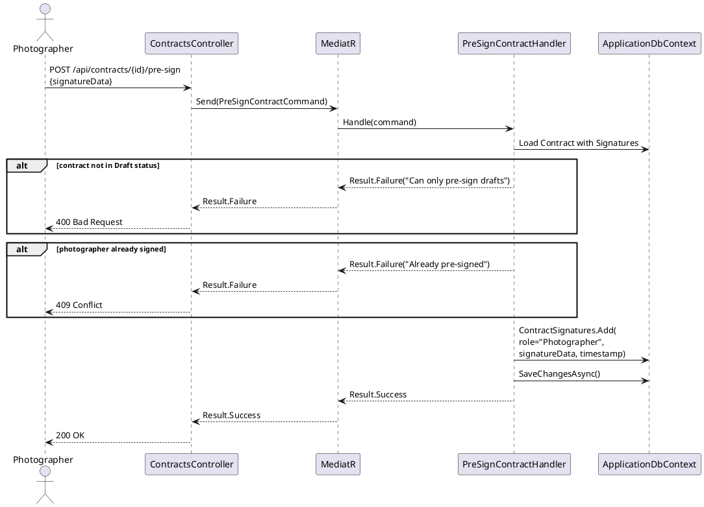
```plantuml
@startuml
actor Photographer as P
participant "ContractsController" as CC
participant "MediatR" as M
participant "PreSignContractHandler" as PSH
participant "ApplicationDbContext" as DB

P -> CC : POST /api/contracts/{id}/pre-sign\n{signatureData}
CC -> M : Send(PreSignContractCommand)
M -> PSH : Handle(command)

PSH -> DB : Load Contract with Signatures

alt contract not in Draft status
  PSH --> M : Result.Failure("Can only pre-sign drafts")
  M --> CC : Result.Failure
  CC --> P : 400 Bad Request
end

alt photographer already signed
  PSH --> M : Result.Failure("Already pre-signed")
  M --> CC : Result.Failure
  CC --> P : 409 Conflict
end

PSH -> DB : ContractSignatures.Add(\nrole="Photographer",\nsignatureData, timestamp)
PSH -> DB : SaveChangesAsync()
PSH --> M : Result.Success
M --> CC : Result.Success
CC --> P : 200 OK
@enduml
```

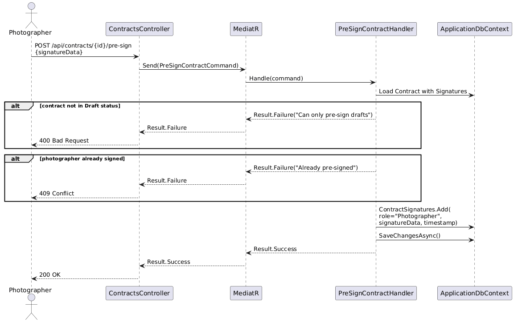

### Contract Expiry Background Job

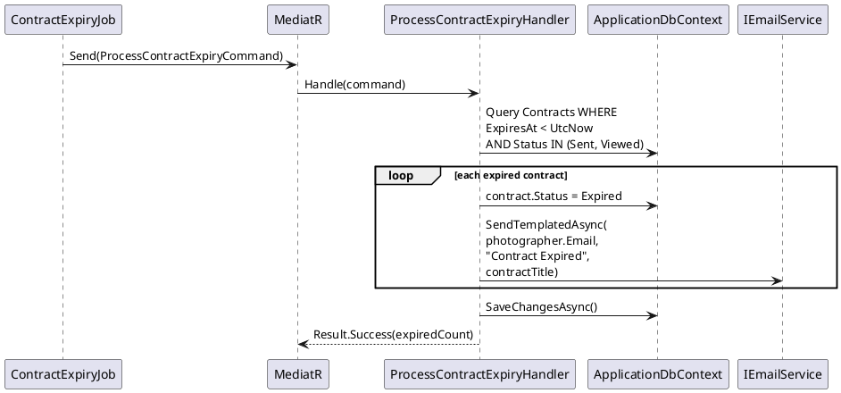
```plantuml
@startuml
participant "ContractExpiryJob" as JOB
participant "MediatR" as M
participant "ProcessContractExpiryHandler" as PEH
participant "ApplicationDbContext" as DB
participant "IEmailService" as ES

JOB -> M : Send(ProcessContractExpiryCommand)
M -> PEH : Handle(command)

PEH -> DB : Query Contracts WHERE\nExpiresAt < UtcNow\nAND Status IN (Sent, Viewed)

loop each expired contract
  PEH -> DB : contract.Status = Expired
  PEH -> ES : SendTemplatedAsync(\nphotographer.Email,\n"Contract Expired",\ncontractTitle)
end

PEH -> DB : SaveChangesAsync()
PEH --> M : Result.Success(expiredCount)
@enduml
```

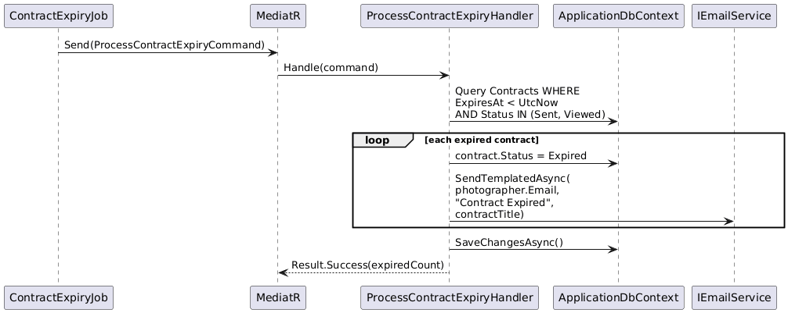

### Contract Reminder Background Job

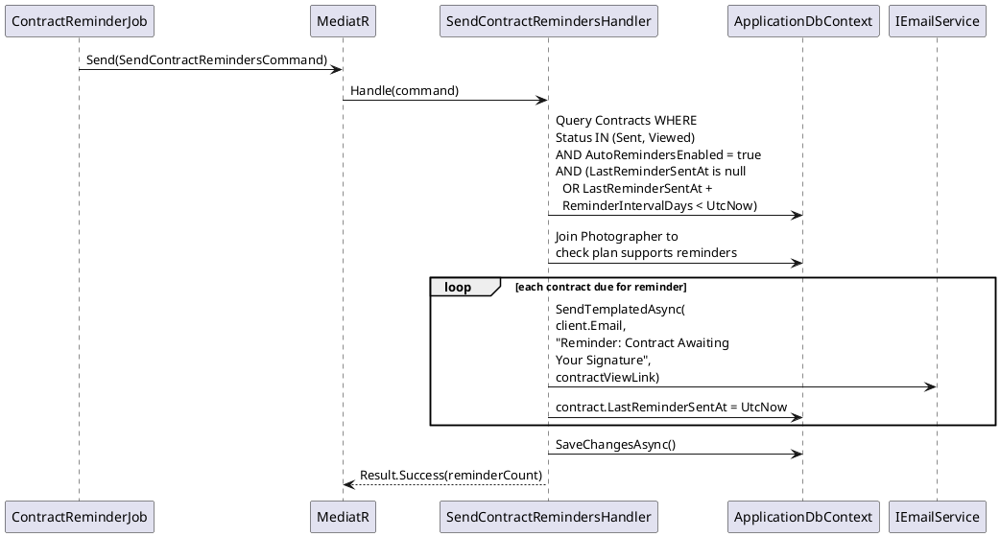
```plantuml
@startuml
participant "ContractReminderJob" as JOB
participant "MediatR" as M
participant "SendContractRemindersHandler" as SRH
participant "ApplicationDbContext" as DB
participant "IEmailService" as ES

JOB -> M : Send(SendContractRemindersCommand)
M -> SRH : Handle(command)

SRH -> DB : Query Contracts WHERE\nStatus IN (Sent, Viewed)\nAND AutoRemindersEnabled = true\nAND (LastReminderSentAt is null\n  OR LastReminderSentAt +\n  ReminderIntervalDays < UtcNow)

SRH -> DB : Join Photographer to\ncheck plan supports reminders

loop each contract due for reminder
  SRH -> ES : SendTemplatedAsync(\nclient.Email,\n"Reminder: Contract Awaiting\nYour Signature",\ncontractViewLink)
  SRH -> DB : contract.LastReminderSentAt = UtcNow
end

SRH -> DB : SaveChangesAsync()
SRH --> M : Result.Success(reminderCount)
@enduml
```

### Apply Contract Template

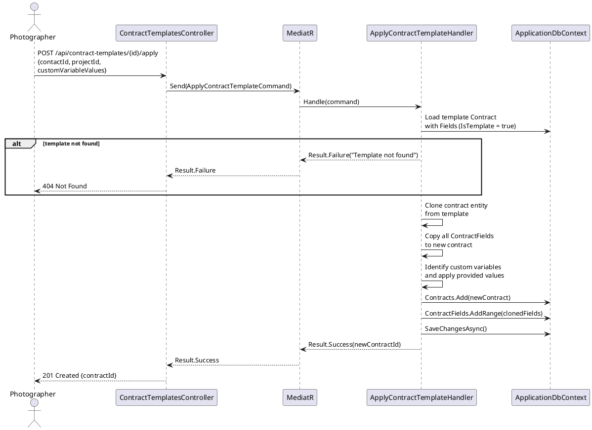
```plantuml
@startuml
actor Photographer as P
participant "ContractTemplatesController" as CTC
participant "MediatR" as M
participant "ApplyContractTemplateHandler" as ATH
participant "ApplicationDbContext" as DB

P -> CTC : POST /api/contract-templates/{id}/apply\n{contactId, projectId,\ncustomVariableValues}
CTC -> M : Send(ApplyContractTemplateCommand)
M -> ATH : Handle(command)

ATH -> DB : Load template Contract\nwith Fields (IsTemplate = true)

alt template not found
  ATH --> M : Result.Failure("Template not found")
  M --> CTC : Result.Failure
  CTC --> P : 404 Not Found
end

ATH -> ATH : Clone contract entity\nfrom template

ATH -> ATH : Copy all ContractFields\nto new contract

ATH -> ATH : Identify custom variables\nand apply provided values

ATH -> DB : Contracts.Add(newContract)
ATH -> DB : ContractFields.AddRange(clonedFields)
ATH -> DB : SaveChangesAsync()

ATH --> M : Result.Success(newContractId)
M --> CTC : Result.Success
CTC --> P : 201 Created {contractId}
@enduml
```

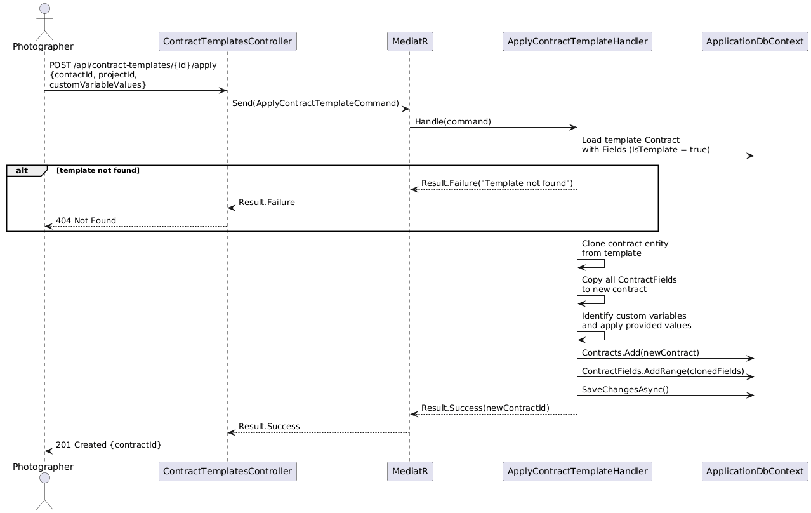
