# F27 - Invoicing

## Overview

This feature provides photographers with a comprehensive invoicing system for billing clients. The invoice builder allows creating line-item invoices with names, descriptions, quantities, and unit prices, with auto-calculated subtotals, tax, discounts, and totals. Invoices support custom branding through header images and color palettes, plus custom header fields (VAT, ABN, business ID) configurable in Settings > Preferences.

Payment schedules enable splitting an invoice into multiple installments with specific due dates, each independently payable and individually status-tracked. The deposit/retainer flow lets photographers set a deposit amount with the remaining balance as a separate installment, and invoices auto-generated from bookings support this split natively. Tax support applies configurable percentage-based rates displayed as a separate line, flowing into financial reports. Gratuity/tips present clients with 5%, 10%, 15%, or custom tip options at payment time, tracked separately in reports.

Automated payment reminders send emails before, on, and after due dates at configurable intervals, with confirmation emails on successful payment (available on upgraded plans). Invoice templates let photographers save configurations with pre-filled line items and settings for reuse. Invoices can also be auto-generated as drafts from accepted quotes (cross-feature with F28), with all items, totals, and due dates carried over and editable before sending.

**L2 Requirements:** INV-4.5.1 (Invoice Builder), INV-4.5.2 (Payment Schedules), INV-4.5.3 (Deposit/Retainer), INV-4.5.4 (Payment Reminders), INV-4.5.5 (Tax Support), INV-4.5.6 (Gratuity/Tips), INV-4.5.7 (Invoice Templates)

---

## Components

### Domain Layer

| Component | Type | Description |
|-----------|------|-------------|
| `Invoice` | Entity | Invoice with line items, tax, tips, payment schedules, branding, reminders, and template support. Implements `ITenantEntity`, `ISoftDeletable`, `IAuditableEntity`. |
| `InvoiceLineItem` | Entity | Individual billable item with name, description, quantity, unit price, and calculated total. |
| `InvoicePaymentSchedule` | Entity | Single installment within a payment schedule: label, amount, due date, paid status, and Stripe payment intent reference. |
| `InvoiceStatus` | Enum | `Draft`, `Sent`, `Viewed`, `PartiallyPaid`, `Paid`, `Overdue`, `Cancelled`, `Refunded`. |

### Application Layer

| Component | Type | Description |
|-----------|------|-------------|
| `CreateInvoiceCommand` | Command | Creates a new invoice with title, line items, contact/project linkage, tax rate, and optional deposit configuration. Auto-generates invoice number. Returns invoice ID. |
| `UpdateInvoiceCommand` | Command | Updates line items, tax rate, branding, notes, custom header fields, tip settings, and reminder configuration on a draft invoice. |
| `DeleteInvoiceCommand` | Command | Soft-deletes an invoice. |
| `SendInvoiceCommand` | Command | Transitions to `Sent`, sets `SentAt`, sends payment link to client via email. |
| `RecalculateInvoiceTotalsCommand` | Command | Recalculates subtotal, tax, and total from line items. Called internally after line item changes. |
| `ConfigurePaymentScheduleCommand` | Command | Sets up multiple installments with amounts and due dates. Validates total matches invoice total. |
| `ConfigureDepositCommand` | Command | Sets deposit amount and creates two installments: deposit (due immediately) and balance (due on specified date). |
| `RecordPaymentCommand` | Command | Records a payment against a specific installment. Updates installment status, invoice `PaidCents`, and transitions invoice status (`PartiallyPaid` or `Paid`). |
| `RecordTipCommand` | Command | Records a tip amount against an invoice payment. |
| `ViewInvoiceQuery` | Query | Returns full invoice detail. Transitions status to `Viewed` if currently `Sent`. |
| `ListInvoicesQuery` | Query | Paginated list filterable by status, contact, date range. |
| `GetInvoiceByTokenQuery` | Query | Client-facing invoice view via secure token (no auth required). |
| `GetInvoicePaymentSummaryQuery` | Query | Returns payment breakdown: installments, paid amounts, remaining balance. |
| `SaveInvoiceTemplateCommand` | Command | Saves invoice configuration as a reusable template. |
| `ListInvoiceTemplatesQuery` | Query | Lists all invoice templates for the photographer. |
| `ApplyInvoiceTemplateCommand` | Command | Creates a new invoice from a template with pre-filled line items and settings. |
| `CancelInvoiceCommand` | Command | Cancels an invoice, setting status to `Cancelled`. |
| `ProcessOverdueInvoicesCommand` | Command | Background job: finds invoices with past-due installments, transitions to `Overdue`. |
| `SendPaymentRemindersCommand` | Command | Background job: sends reminder emails for upcoming/overdue installments. |
| `GenerateInvoiceFromQuoteCommand` | Command | Creates a draft invoice from an accepted quote's items and total (cross-feature with F28). |
| `InvoiceDto` | DTO | Invoice summary for list views. |
| `InvoiceDetailDto` | DTO | Full invoice detail with line items, schedules, and payment history. |
| `InvoiceTemplateDto` | DTO | Template summary. |
| `PaymentScheduleDto` | DTO | Installment detail with status. |

### Infrastructure Layer

| Component | Type | Description |
|-----------|------|-------------|
| `CreateInvoiceCommandHandler` | Handler | Generates sequential invoice number, creates `Invoice` + `InvoiceLineItem` entities, calculates totals, persists. |
| `SendInvoiceCommandHandler` | Handler | Generates client access token, sends email with payment link, updates status. |
| `RecordPaymentCommandHandler` | Handler | Validates installment, marks as paid, updates `PaidCents`, transitions invoice status. Integrates with `IPaymentService` for Stripe confirmation. |
| `ConfigurePaymentScheduleHandler` | Handler | Validates installment amounts sum to invoice total, creates/replaces `InvoicePaymentSchedule` records. |
| `ProcessOverdueInvoicesHandler` | Handler | Queries installments past due date and unpaid, updates parent invoice status. |
| `SendPaymentRemindersHandler` | Handler | Checks plan eligibility, queries installments needing reminders, sends emails. |
| `InvoiceOverdueJob` | Background Job | Recurring job dispatching `ProcessOverdueInvoicesCommand`. |
| `PaymentReminderJob` | Background Job | Recurring job dispatching `SendPaymentRemindersCommand`. |

### API Layer

| Component | Type | Description |
|-----------|------|-------------|
| `InvoicesController` | Controller | Authenticated endpoints: `POST` (create), `PUT /{id}` (update), `DELETE /{id}`, `POST /{id}/send`, `POST /{id}/schedule` (configure payment schedule), `POST /{id}/deposit` (configure deposit), `POST /{id}/cancel`, `GET` (list), `GET /{id}` (detail), `GET /{id}/payments` (payment summary). |
| `InvoiceTemplatesController` | Controller | Authenticated endpoints: `POST` (save template), `GET` (list templates), `POST /{id}/apply` (create from template). |
| `InvoicePublicController` | Controller | Anonymous endpoints: `GET /invoices/view/{token}` (client view), `POST /invoices/pay/{token}` (client payment with tip). |

---

## Class Diagrams

### Domain Layer -- Invoice Entities

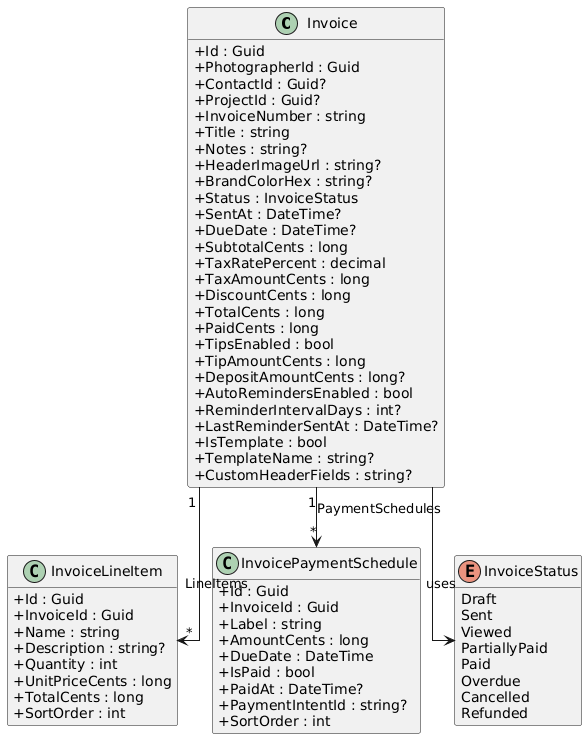

### Application Layer -- Invoice Commands

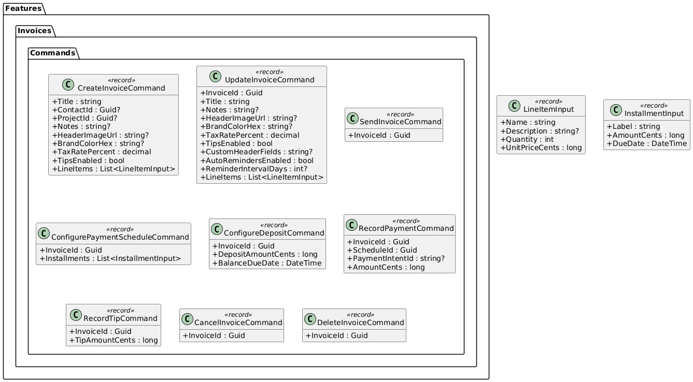

### Application Layer -- Invoice Queries & Templates

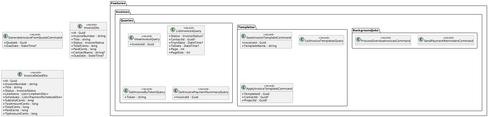

### API Layer -- Invoice Controllers

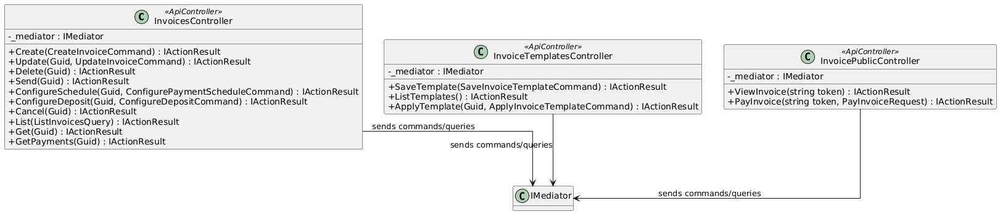

---

## Sequence Diagrams

### Create Invoice with Line Items

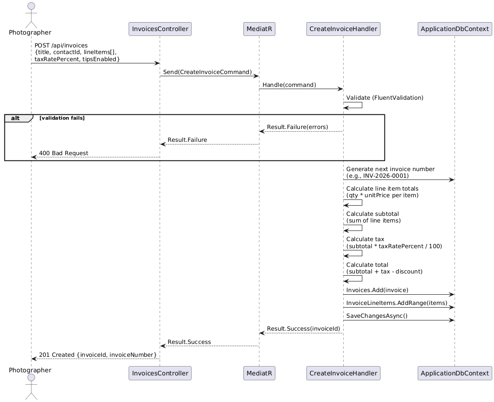

### Configure Payment Schedule with Deposit

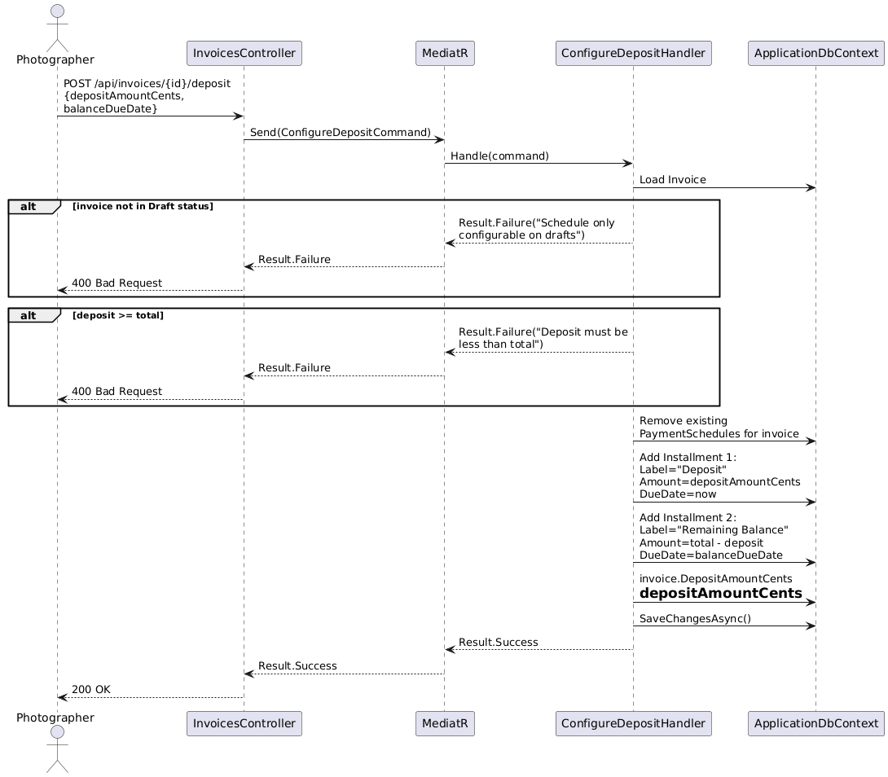

### Client Pays Invoice Installment

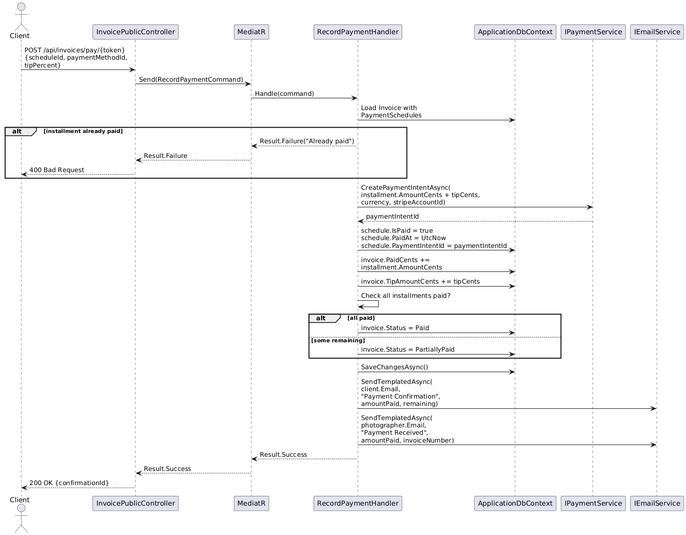

### Send Invoice to Client

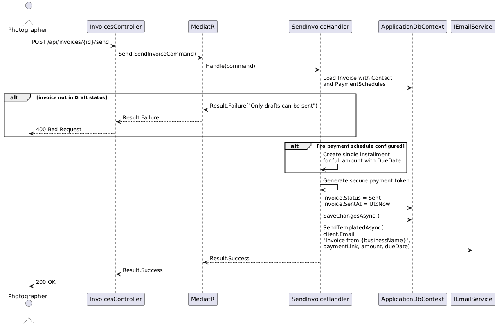

### Payment Reminder Background Job

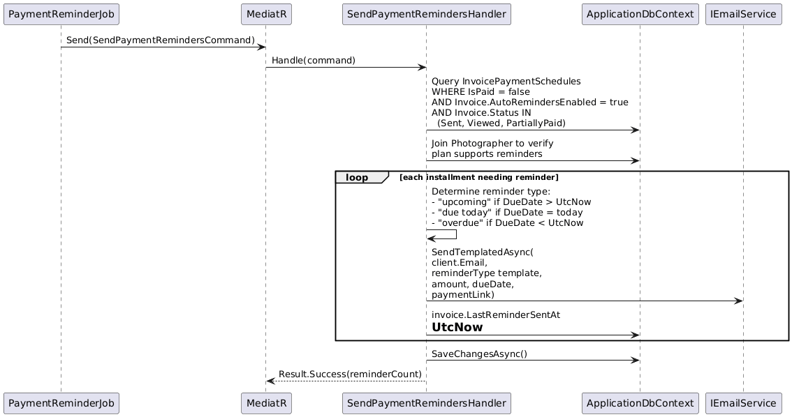

### Overdue Invoice Processing

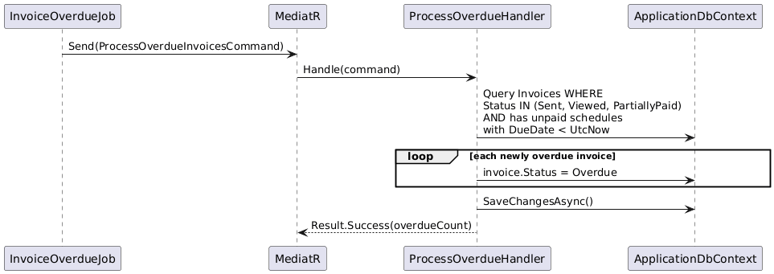

### Generate Invoice from Accepted Quote

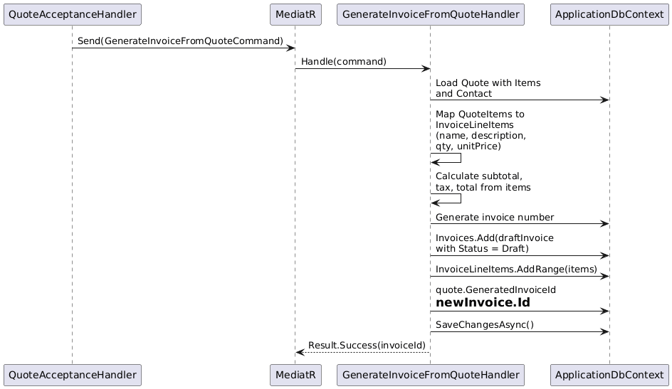
