# F28 - Quotes & Proposals

## Overview

This feature enables photographers to create professional quotes and proposals for prospective clients. A quote lists services and products with descriptions and prices in a clean, itemized view. Photographers build quotes by adding line items, each with a name, description, quantity, and unit price, and the system auto-calculates the total. Quotes can be linked to contacts and projects within the Studio Manager CRM.

When a client accepts a quote, the system automatically generates an invoice draft containing the accepted items, total amount, and due date. The photographer receives a notification of acceptance and can review and edit the auto-generated invoice before sending it to the client. This cross-feature integration with F27 (Invoicing) streamlines the photographer's workflow from proposal to billing.

Quote templates allow photographers to save and reuse common service configurations. Templates store service descriptions, pricing, and terms, enabling quick creation of new quotes from proven packages. Templates are particularly useful for photographers who offer standardized session types (e.g., wedding packages, portrait sessions, event coverage).

**L2 Requirements:** QOT-4.6.1 (Quote Creation), QOT-4.6.2 (Quote Acceptance), QOT-4.6.3 (Quote Templates)

---

## Components

### Domain Layer

| Component | Type | Description |
|-----------|------|-------------|
| `Quote` | Entity | Quote/proposal with items, status lifecycle, template support, and auto-generated invoice linkage. Implements `ITenantEntity`, `ISoftDeletable`, `IAuditableEntity`. |
| `QuoteItem` | Entity | Individual service/product line item with name, description, quantity, unit price, and calculated total. |
| `QuoteStatus` | Enum | `Draft`, `Sent`, `Viewed`, `Accepted`, `Declined`, `Expired`, `Cancelled`. |

### Application Layer

| Component | Type | Description |
|-----------|------|-------------|
| `CreateQuoteCommand` | Command | Creates a new quote with title, notes, items, and contact/project linkage. Auto-calculates total. Returns quote ID. |
| `UpdateQuoteCommand` | Command | Updates title, notes, and line items on a draft quote. Recalculates total. |
| `DeleteQuoteCommand` | Command | Soft-deletes a quote. |
| `SendQuoteCommand` | Command | Transitions to `Sent`, sets `SentAt`, sends client-facing link via email. |
| `AcceptQuoteCommand` | Command | Client accepts the quote. Transitions to `Accepted`, sets `AcceptedAt`, dispatches `GenerateInvoiceFromQuoteCommand`, notifies photographer. |
| `DeclineQuoteCommand` | Command | Client declines the quote. Transitions to `Declined`. |
| `CancelQuoteCommand` | Command | Photographer cancels a sent quote. |
| `ViewQuoteQuery` | Query | Returns full quote detail. Transitions to `Viewed` if currently `Sent`. |
| `ListQuotesQuery` | Query | Paginated list filterable by status and contact. |
| `GetQuoteByTokenQuery` | Query | Client-facing quote view via secure access token (no auth required). |
| `SaveQuoteTemplateCommand` | Command | Saves a quote as a reusable template (sets `IsTemplate = true`). |
| `ListQuoteTemplatesQuery` | Query | Lists all quote templates for the photographer. |
| `ApplyQuoteTemplateCommand` | Command | Creates a new quote from a template, copying items and terms. |
| `QuoteDto` | DTO | Quote summary for list views. |
| `QuoteDetailDto` | DTO | Full quote detail with items. |
| `QuoteTemplateDto` | DTO | Template summary. |

### Infrastructure Layer

| Component | Type | Description |
|-----------|------|-------------|
| `CreateQuoteCommandHandler` | Handler | Creates `Quote` + `QuoteItem` entities, calculates total, persists. |
| `SendQuoteCommandHandler` | Handler | Generates secure client token, sends email via `IEmailService`, updates status. |
| `AcceptQuoteCommandHandler` | Handler | Validates quote is in `Sent`/`Viewed` status, transitions to `Accepted`, dispatches `GenerateInvoiceFromQuoteCommand` via MediatR, sends photographer notification. |
| `ApplyQuoteTemplateHandler` | Handler | Clones template quote and items into a new draft quote linked to specified contact/project. |

### API Layer

| Component | Type | Description |
|-----------|------|-------------|
| `QuotesController` | Controller | Authenticated endpoints: `POST` (create), `PUT /{id}` (update), `DELETE /{id}`, `POST /{id}/send`, `POST /{id}/cancel`, `GET` (list), `GET /{id}` (detail). |
| `QuoteTemplatesController` | Controller | Authenticated endpoints: `POST` (save template), `GET` (list templates), `POST /{id}/apply` (create from template). |
| `QuotePublicController` | Controller | Anonymous endpoints: `GET /quotes/view/{token}` (client view), `POST /quotes/accept/{token}` (accept), `POST /quotes/decline/{token}` (decline). |

---

## Class Diagrams

### Domain Layer -- Quote Entities

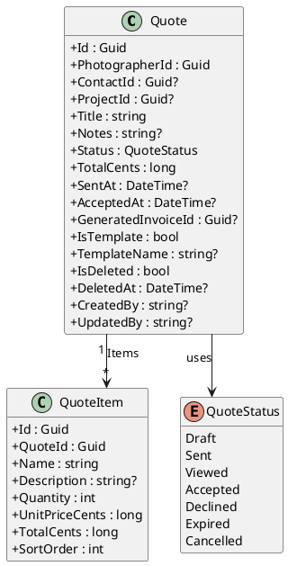

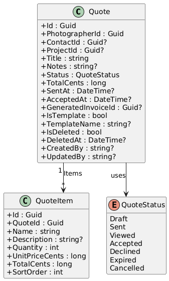

### Application Layer -- Quote Commands & Queries

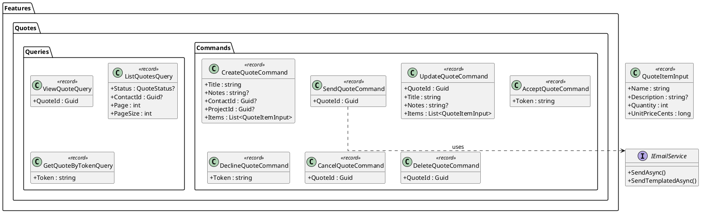

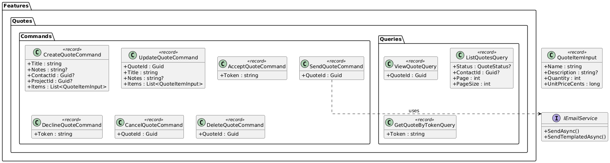

### Application Layer -- Quote Templates

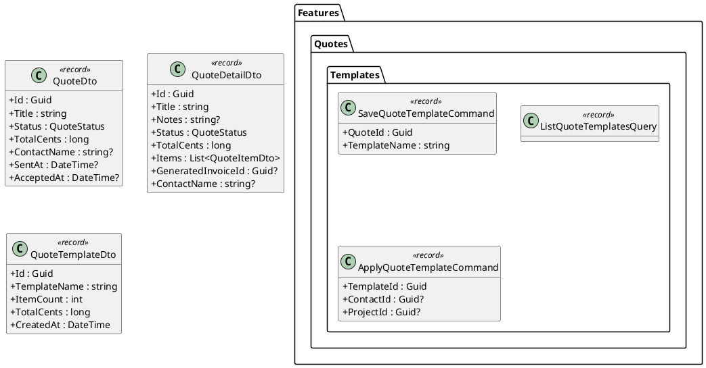

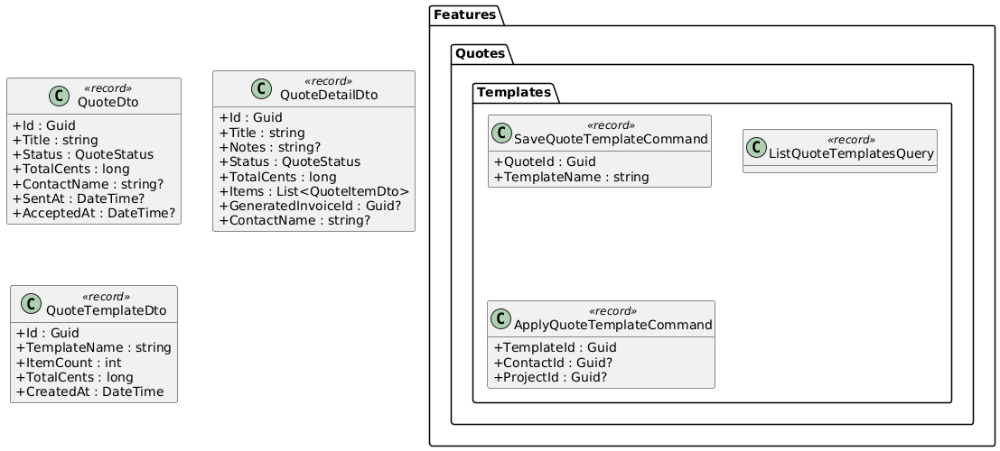

### API Layer -- Quote Controllers

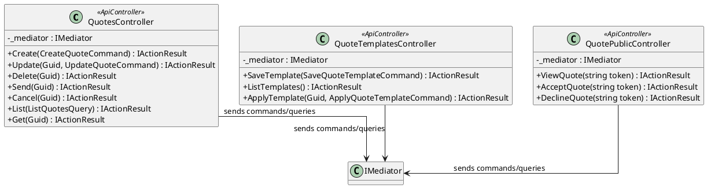

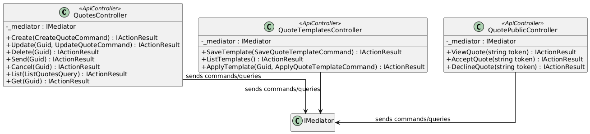

---

## Sequence Diagrams

### Create Quote

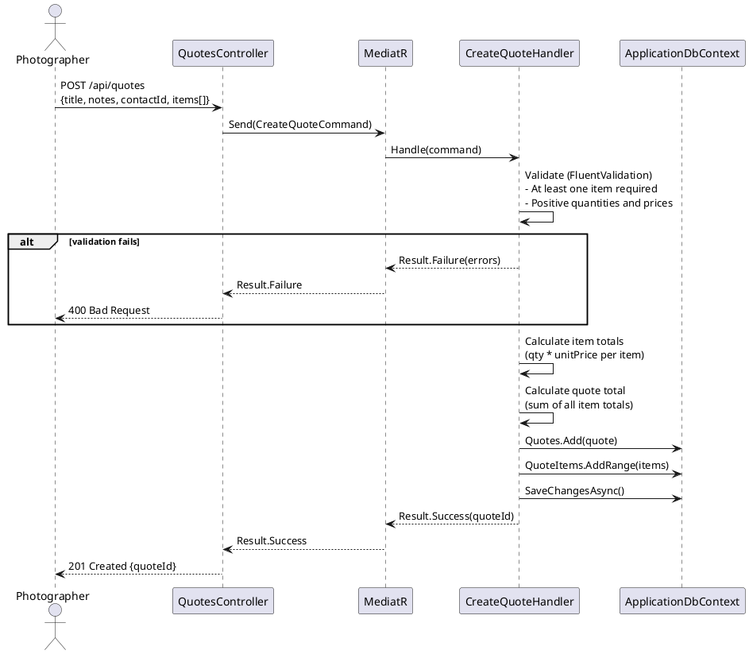

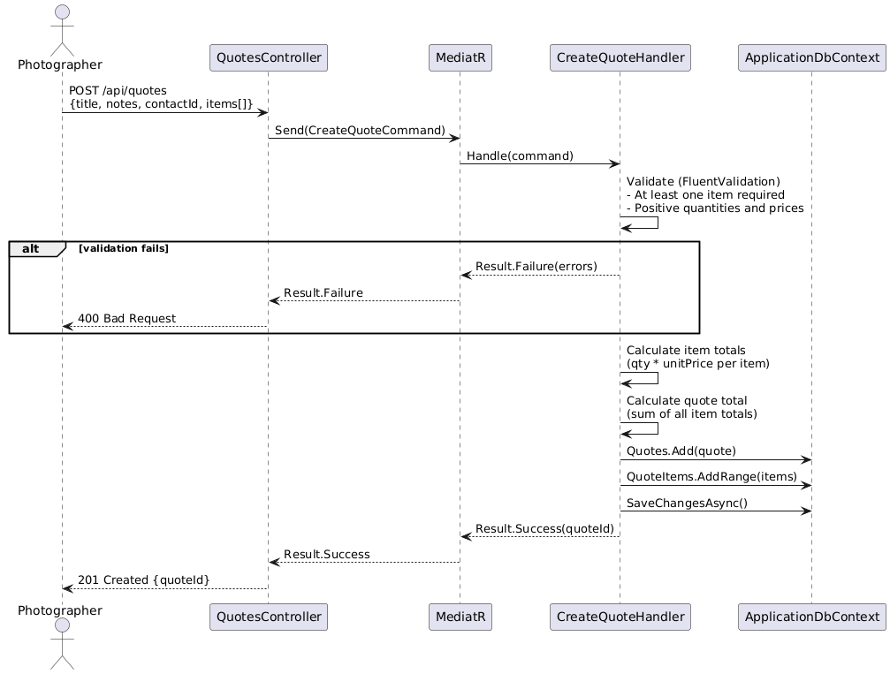

### Send Quote to Client

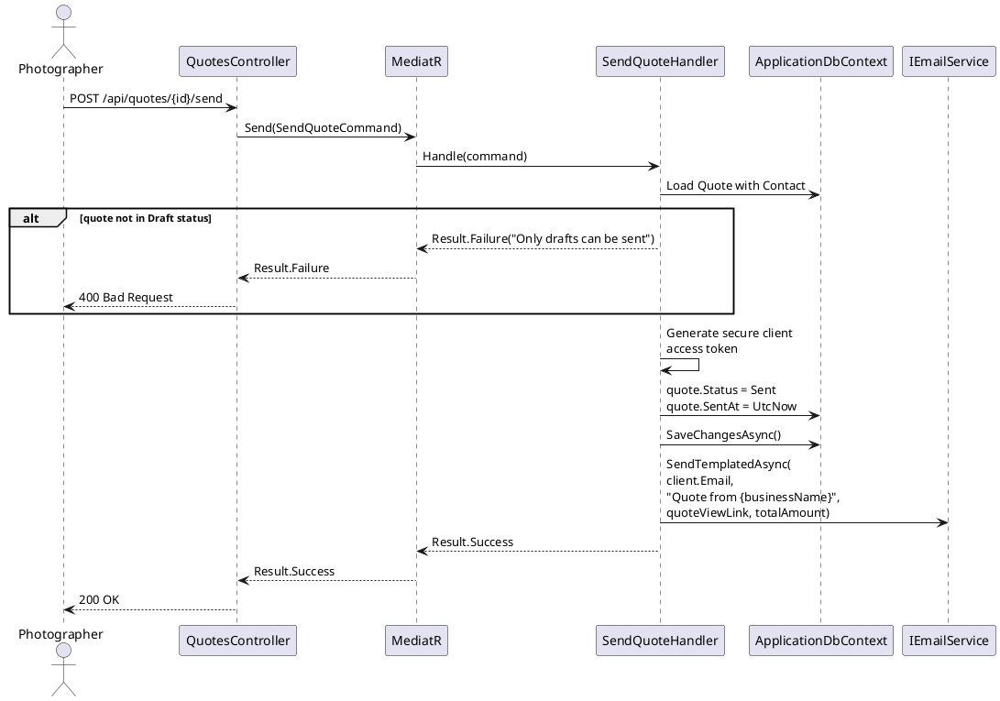

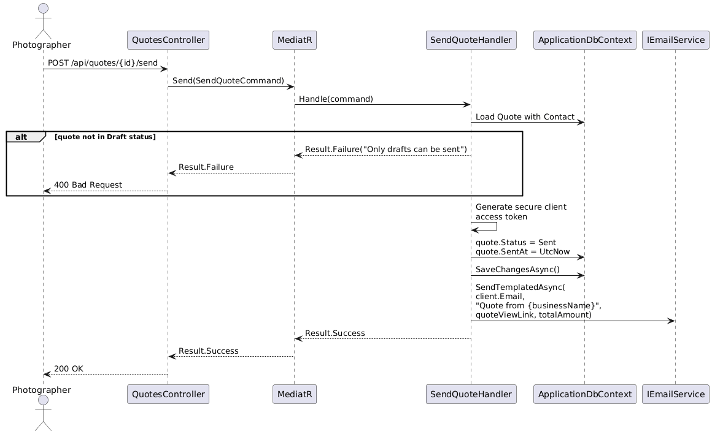

### Client Accepts Quote (Auto-generates Invoice)

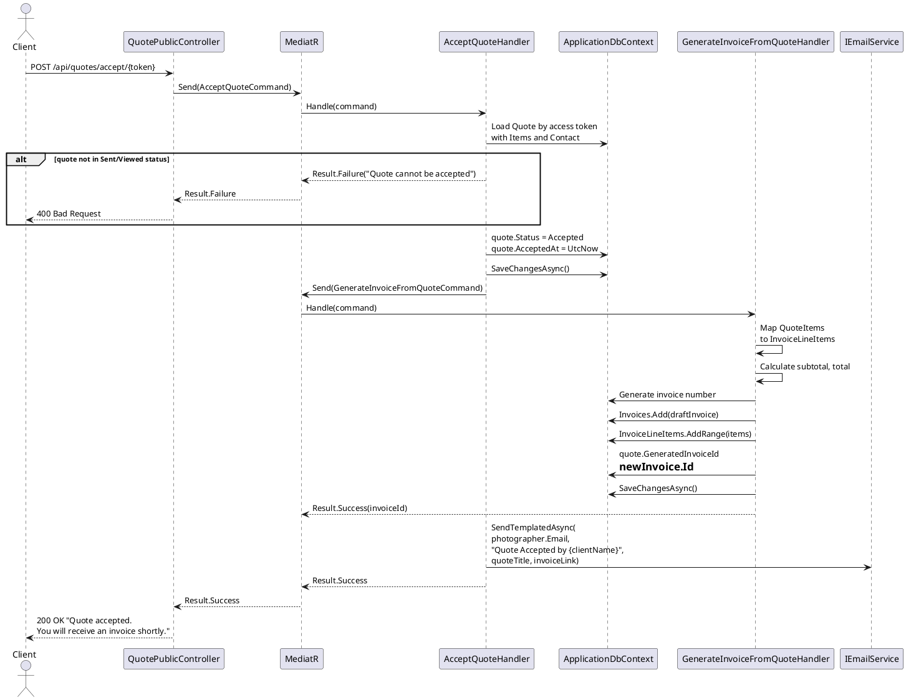

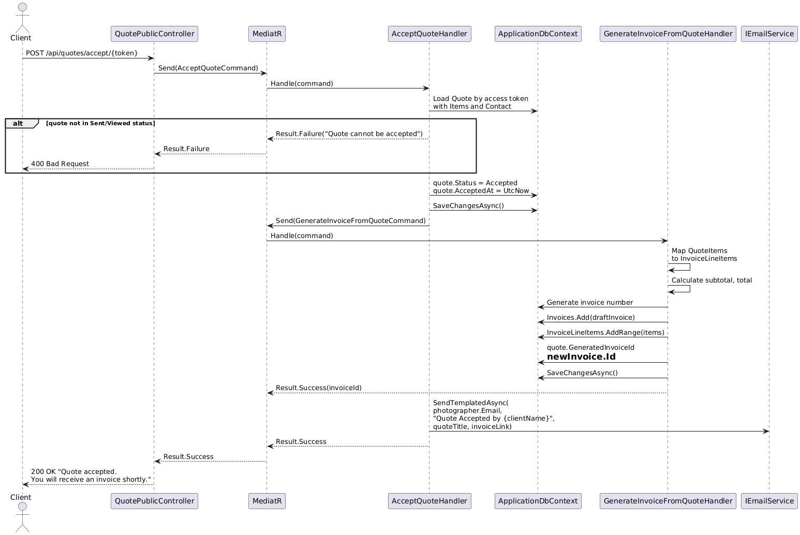

### Client Declines Quote

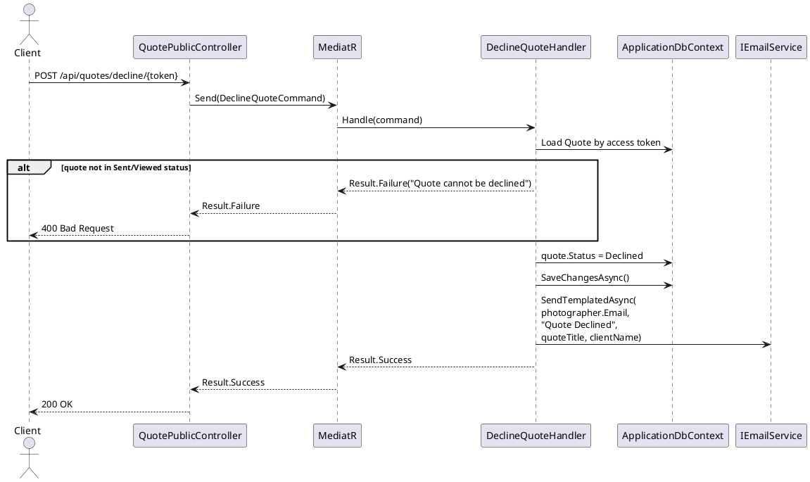

### Apply Quote Template

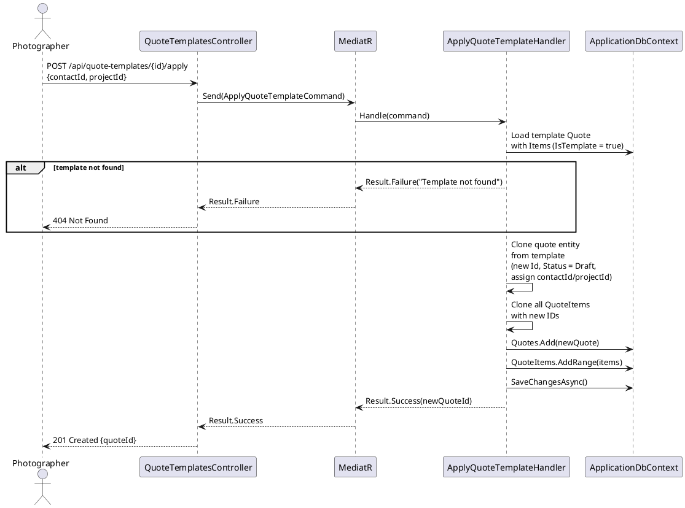

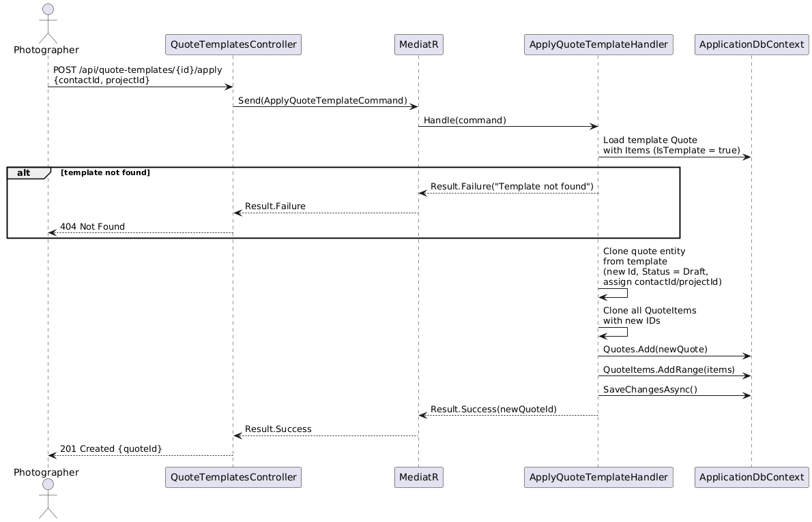
