# F29 - Questionnaires

## Overview

This feature provides photographers with a flexible questionnaire builder for collecting information from clients. Questionnaires support multiple question types (short text, long text, multiple choice, checkboxes, date, email), each with a required toggle and custom label. Questions are individually editable and reorderable via drag-and-drop. The builder stores question configurations including labels, types, options (for choice-based types), and required status.

Questionnaire delivery is multi-modal: questionnaires can be sent directly to a specific client from Studio Manager, attached as booking intake documents, or shared publicly via a unique URL that allows multiple submissions (useful for event planning scenarios like gathering guest preferences). Clients complete questionnaires on any device, with required field enforcement before submission. Responses are stored as structured JSON with respondent identification.

Templates let photographers save and reuse questionnaire configurations, with at least six sample templates for common photography scenarios (e.g., wedding day details, portrait session preferences, event logistics, family session info, newborn session prep, engagement session planning). Templates are fully customizable with add/remove/reorder capabilities. Document expiry auto-cancels incomplete questionnaires past a deadline, and automatic reminder emails nudge clients to complete them (both available on upgraded plans).

**L2 Requirements:** QST-4.7.1 (Question Builder), QST-4.7.2 (Questionnaire Templates), QST-4.7.3 (Questionnaire Delivery), QST-4.7.4 (Document Expiry & Reminders)

---

## Components

### Domain Layer

| Component | Type | Description |
|-----------|------|-------------|
| `Questionnaire` | Entity | Questionnaire with questions, status lifecycle, public sharing, expiry, reminders, and template support. Implements `ITenantEntity`, `ISoftDeletable`, `IAuditableEntity`. |
| `QuestionnaireQuestion` | Entity | Individual question with label, type, required toggle, sort order, and JSON options for choice-based types. |
| `QuestionnaireResponse` | Entity | A completed submission containing respondent identification and JSON-serialized answers. |
| `QuestionnaireStatus` | Enum | `Draft`, `Sent`, `Viewed`, `Completed`, `Expired`, `Cancelled`. |
| `QuestionType` | Enum | `ShortText`, `LongText`, `MultipleChoice`, `Checkboxes`, `Date`, `Email`. |

### Application Layer

| Component | Type | Description |
|-----------|------|-------------|
| `CreateQuestionnaireCommand` | Command | Creates a questionnaire with title, description, questions, and contact/project linkage. Returns questionnaire ID. |
| `UpdateQuestionnaireCommand` | Command | Updates title, description, questions (add/remove/reorder), expiry, and reminder settings on a draft questionnaire. |
| `DeleteQuestionnaireCommand` | Command | Soft-deletes a questionnaire. |
| `SendQuestionnaireCommand` | Command | Sends questionnaire to a specific client. Transitions to `Sent`, sends email with link. |
| `ShareQuestionnairePubliclyCommand` | Command | Generates a public slug for the questionnaire, enabling multiple submissions without authentication. |
| `SubmitQuestionnaireResponseCommand` | Command | Records a client's answers. Validates required fields. If not public/multi-submit, transitions to `Completed` and notifies photographer. |
| `ViewQuestionnaireQuery` | Query | Returns full questionnaire detail. Transitions to `Viewed` if currently `Sent`. |
| `ListQuestionnairesQuery` | Query | Paginated list filterable by status and contact. |
| `GetQuestionnaireByTokenQuery` | Query | Client-facing view via secure token (single-submission mode). |
| `GetQuestionnaireBySlugQuery` | Query | Public view via slug (multi-submission mode). |
| `ListQuestionnaireResponsesQuery` | Query | Returns all responses for a questionnaire. |
| `GetQuestionnaireResponseQuery` | Query | Returns a single response detail. |
| `SaveQuestionnaireTemplateCommand` | Command | Saves questionnaire as a reusable template. |
| `ListQuestionnaireTemplatesQuery` | Query | Lists all questionnaire templates. |
| `ApplyQuestionnaireTemplateCommand` | Command | Creates a new questionnaire from a template, copying questions. |
| `CancelQuestionnaireCommand` | Command | Manually cancels a sent questionnaire. |
| `ProcessQuestionnaireExpiryCommand` | Command | Background job: finds expired questionnaires, transitions to `Expired`. |
| `SendQuestionnaireRemindersCommand` | Command | Background job: sends reminder emails for incomplete questionnaires. |
| `QuestionnaireDto` | DTO | Questionnaire summary for list views. |
| `QuestionnaireDetailDto` | DTO | Full detail with questions. |
| `QuestionnaireResponseDto` | DTO | Response summary with answers. |
| `QuestionnaireTemplateDto` | DTO | Template summary. |

### Infrastructure Layer

| Component | Type | Description |
|-----------|------|-------------|
| `CreateQuestionnaireCommandHandler` | Handler | Creates `Questionnaire` + `QuestionnaireQuestion` entities, persists. |
| `SendQuestionnaireCommandHandler` | Handler | Generates secure client token, sends email, updates status. |
| `SubmitQuestionnaireResponseHandler` | Handler | Validates required fields against question definitions, creates `QuestionnaireResponse`, transitions status for single-submission questionnaires. |
| `ShareQuestionnairePubliclyHandler` | Handler | Generates unique slug, sets `AllowMultipleSubmissions = true`, persists. |
| `ProcessQuestionnaireExpiryHandler` | Handler | Queries expired questionnaires, updates status, sends notification. |
| `SendQuestionnaireRemindersHandler` | Handler | Queries questionnaires due for reminder, validates plan, sends emails. |
| `QuestionnaireExpiryJob` | Background Job | Recurring job dispatching `ProcessQuestionnaireExpiryCommand`. |
| `QuestionnaireReminderJob` | Background Job | Recurring job dispatching `SendQuestionnaireRemindersCommand`. |

### API Layer

| Component | Type | Description |
|-----------|------|-------------|
| `QuestionnairesController` | Controller | Authenticated endpoints: `POST` (create), `PUT /{id}` (update), `DELETE /{id}`, `POST /{id}/send`, `POST /{id}/share` (make public), `POST /{id}/cancel`, `GET` (list), `GET /{id}` (detail), `GET /{id}/responses` (list responses), `GET /{id}/responses/{responseId}` (response detail). |
| `QuestionnaireTemplatesController` | Controller | Authenticated endpoints: `POST` (save template), `GET` (list templates), `POST /{id}/apply` (create from template). |
| `QuestionnairePublicController` | Controller | Anonymous endpoints: `GET /questionnaires/view/{token}` (client view, single), `GET /questionnaires/public/{slug}` (public view, multi), `POST /questionnaires/submit/{token}` (single submit), `POST /questionnaires/submit/public/{slug}` (public submit). |

---

## Class Diagrams

### Domain Layer -- Questionnaire Entities

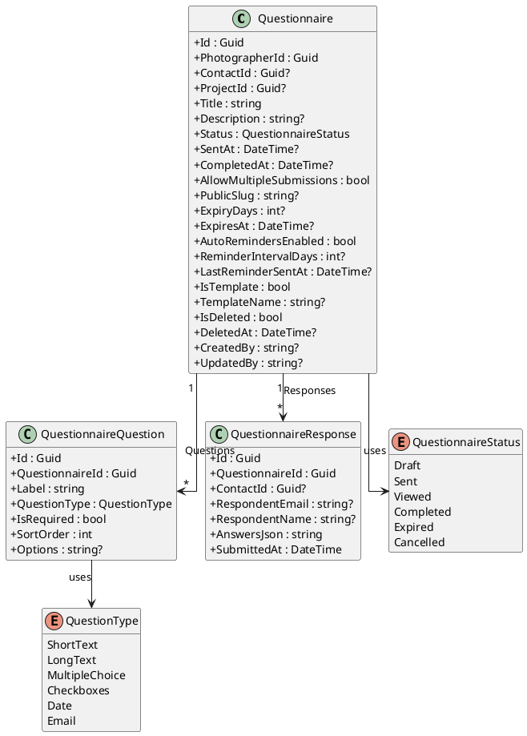

### Application Layer -- Questionnaire Commands

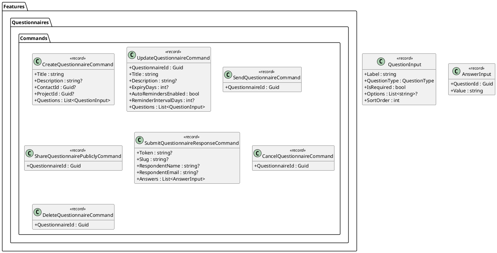

### Application Layer -- Questionnaire Queries & Templates

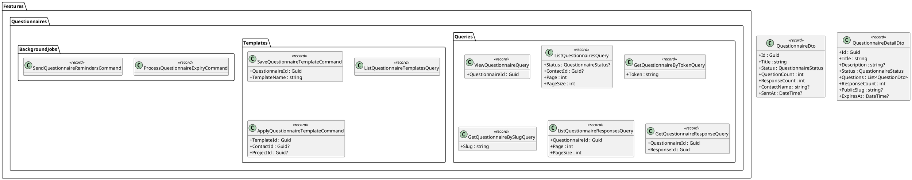

### API Layer -- Questionnaire Controllers

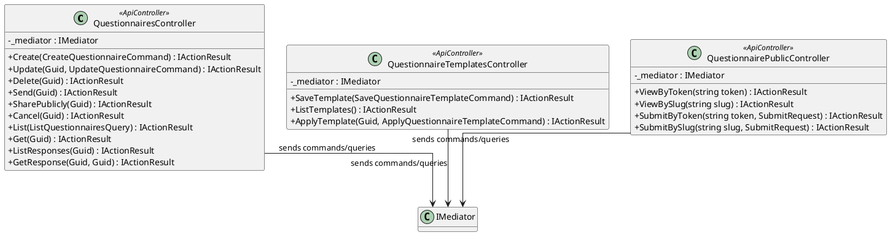

---

## Sequence Diagrams

### Create Questionnaire with Questions

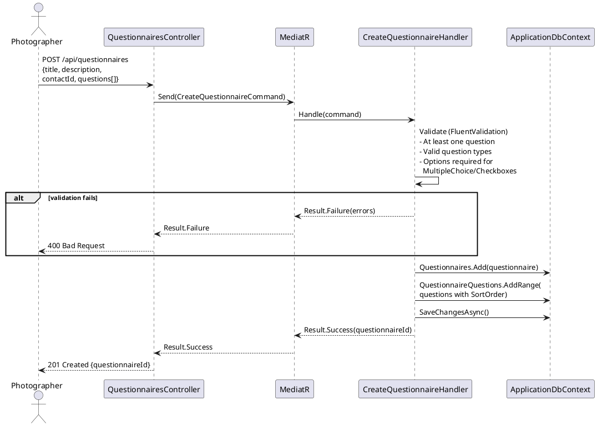

### Send Questionnaire to Client

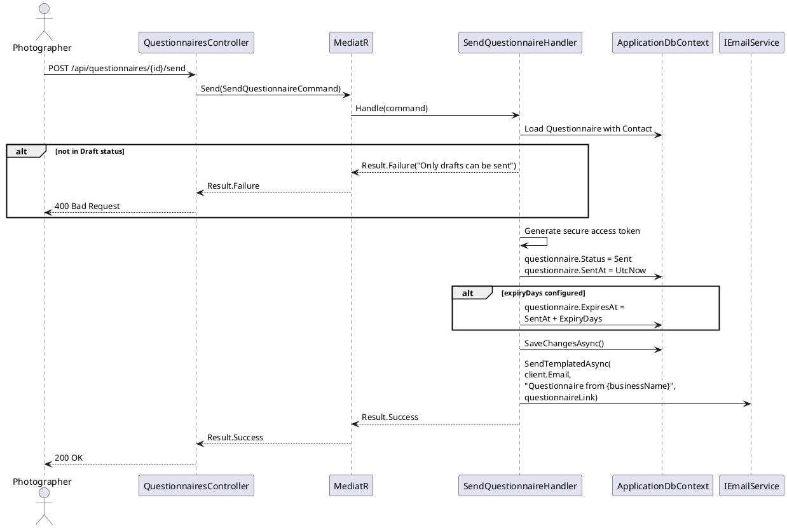

### Client Submits Questionnaire Response

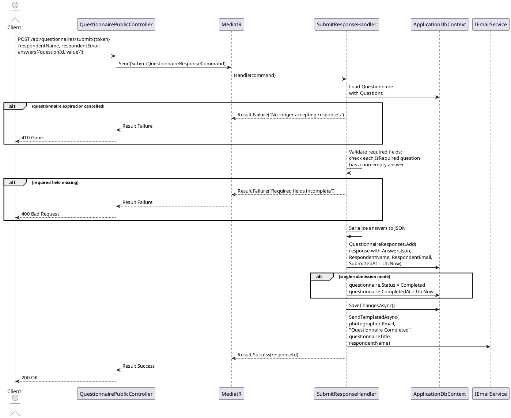

### Share Questionnaire Publicly

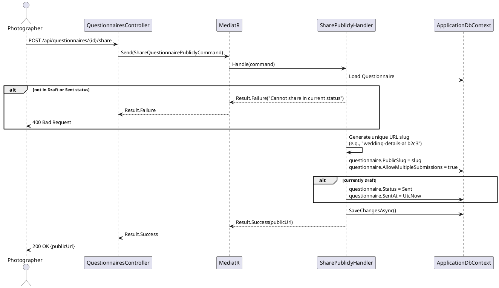

### Questionnaire Expiry Background Job

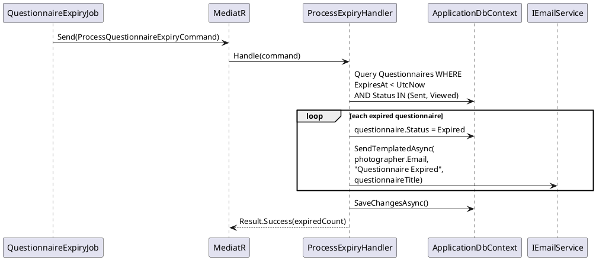

### Questionnaire Reminder Background Job

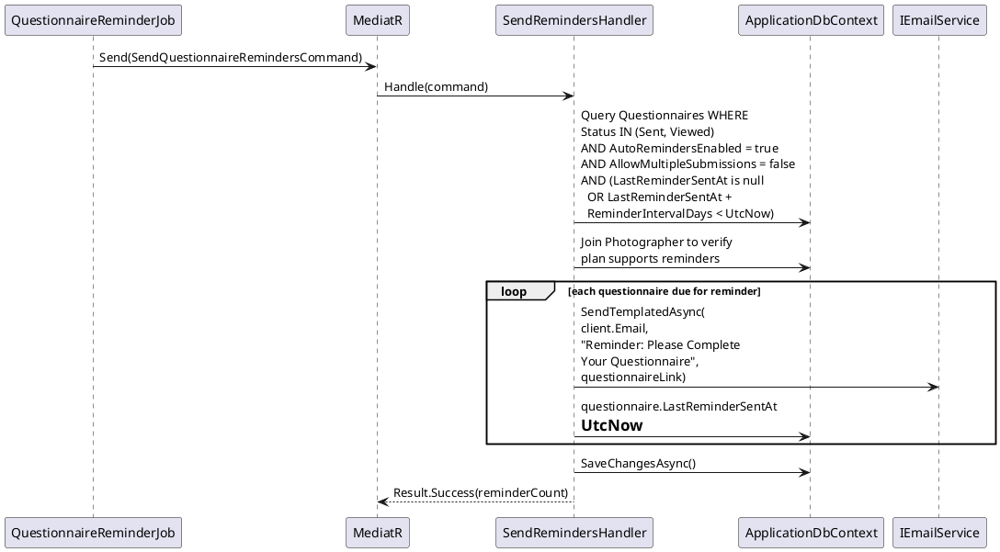

### Apply Questionnaire Template

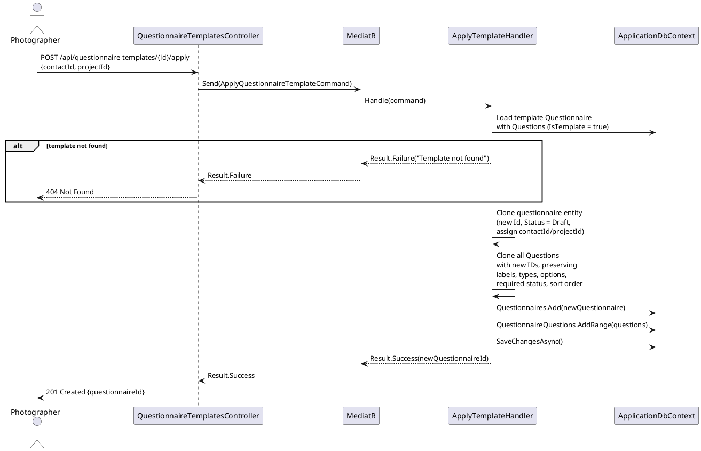
