# F30 - Payment Processing

## Overview

This feature provides the payment infrastructure that underpins all financial transactions across the Anansi platform, including invoice payments, store purchases, and booking deposits. It integrates multiple payment methods through Stripe as the primary processor: credit/debit cards (2.9% + $0.30 fee), digital wallets (Apple Pay, Google Pay, Link), Buy Now Pay Later (Klarna, Affirm), and bank transfers (ACH, 1% fee). PayPal is supported as an alternative processor for store and invoice payments via API credentials.

For in-person scenarios, Tap to Pay enables NFC-based contactless payments on the photographer's mobile device, with QR code fallback when contactless fails or reaches its limit, and tip support during the flow. Offline payments (cash, check) can be manually recorded against invoices and are tracked in the system and reports. Every transaction is recorded as a `PaymentRecord` entity that captures gross amount, fees, net amount, tips, tax, payment method, and external references.

Payouts follow Stripe's standard timelines: 2 business days for US accounts, 3 business days for Canadian accounts, with first payouts taking 7-10 days for Stripe verification. Eligible users can opt for instant payouts at a 1.5% fee. The payout system provides visibility into pending, in-transit, and completed payouts. All payment data flows into the financial reporting system for revenue tracking, tax calculations, and business analytics.

**L2 Requirements:** PAY-4.8.1 (Card Payments), PAY-4.8.2 (Digital Wallets), PAY-4.8.3 (Buy Now Pay Later), PAY-4.8.4 (Bank Transfers), PAY-4.8.5 (PayPal), PAY-4.8.6 (Tap to Pay), PAY-4.8.7 (Offline Payments), PAY-4.8.8 (Payouts)

---

## Components

### Domain Layer

| Component | Type | Description |
|-----------|------|-------------|
| `PaymentRecord` | Entity | Immutable transaction record capturing all financial details: gross, fees, net, tips, tax, method, external reference, offline flag, refund flag. Implements `ITenantEntity`. |
| `PaymentMethod` | Enum | `CreditCard`, `DebitCard`, `ApplePay`, `GooglePay`, `PayPal`, `BankTransfer`, `Klarna`, `Affirm`, `TapToPay`, `Offline`, `GiftCard`. |
| `PayoutRecord` | Entity | Tracks Stripe payout disbursements: amount, status, arrival date, Stripe payout ID. Implements `ITenantEntity`. |
| `PayoutStatus` | Enum | `Pending`, `InTransit`, `Paid`, `Failed`, `Cancelled`. |

### Application Layer

| Component | Type | Description |
|-----------|------|-------------|
| `CreatePaymentIntentCommand` | Command | Creates a Stripe PaymentIntent for a given amount, currency, and connected account. Supports metadata for invoice/booking/order linkage. Returns client secret for frontend confirmation. |
| `CreateCheckoutSessionCommand` | Command | Creates a Stripe Checkout Session with line items for store purchases. Returns session URL. |
| `ConfirmPaymentCommand` | Command | Webhook-triggered: confirms a payment succeeded, creates `PaymentRecord`, updates linked invoice/order status. |
| `ProcessCardPaymentCommand` | Command | Processes a credit/debit card payment via Stripe PaymentIntent (PAY-4.8.1). |
| `ProcessDigitalWalletPaymentCommand` | Command | Processes Apple Pay, Google Pay, or Link payment. Uses same Stripe PaymentIntent flow with wallet-specific payment method types (PAY-4.8.2). |
| `ProcessBnplPaymentCommand` | Command | Creates a Klarna or Affirm payment session. Client pays in installments; photographer receives full amount upfront (PAY-4.8.3). |
| `ProcessBankTransferCommand` | Command | Initiates ACH bank transfer via Stripe. Applies 1% fee (PAY-4.8.4). |
| `ProcessPayPalPaymentCommand` | Command | Creates PayPal order, returns redirect URL for client approval. On capture, creates `PaymentRecord` (PAY-4.8.5). |
| `ProcessTapToPayCommand` | Command | Initiates NFC contactless payment on mobile. On failure/limit, generates QR code with payment link fallback. Supports tip input (PAY-4.8.6). |
| `RecordOfflinePaymentCommand` | Command | Manually records a cash/check payment against an invoice. Creates `PaymentRecord` with `IsOffline = true` (PAY-4.8.7). |
| `RefundPaymentCommand` | Command | Initiates full or partial refund via Stripe or PayPal. Creates a refund `PaymentRecord`. |
| `RequestInstantPayoutCommand` | Command | Requests an instant payout from Stripe (1.5% fee). Validates eligibility (PAY-4.8.8). |
| `ListPaymentRecordsQuery` | Query | Paginated payment history filterable by method, date range, invoice/booking. |
| `GetPaymentRecordQuery` | Query | Returns detail for a single payment. |
| `GetPayoutSummaryQuery` | Query | Returns payout overview: pending, in-transit, available balance, next scheduled payout. |
| `ListPayoutsQuery` | Query | Paginated payout history with status and dates. |
| `GetPaymentMethodsQuery` | Query | Returns available payment methods for a photographer's account based on Stripe capabilities and configuration. |
| `HandleStripeWebhookCommand` | Command | Processes incoming Stripe webhook events (payment_intent.succeeded, payout.paid, charge.refunded, etc.). |
| `HandlePayPalWebhookCommand` | Command | Processes incoming PayPal webhook/IPN notifications. |
| `PaymentRecordDto` | DTO | Payment transaction summary. |
| `PaymentRecordDetailDto` | DTO | Full payment detail with all fields. |
| `PayoutDto` | DTO | Payout summary. |
| `PaymentMethodsDto` | DTO | Available payment method options for the photographer. |
| `IPaymentService` | Interface | Stripe operations: create payment intent, create checkout session, refund, create connected account. |
| `IPayPalService` | Interface | PayPal operations: create order, capture order, refund. |

### Infrastructure Layer

| Component | Type | Description |
|-----------|------|-------------|
| `StripePaymentService` | Service | Implements `IPaymentService`. Wraps Stripe SDK for PaymentIntent creation, Checkout Sessions, refunds, and connected account management. |
| `PayPalPaymentService` | Service | Implements `IPayPalService`. Wraps PayPal REST API for order creation, capture, and refunds. |
| `ConfirmPaymentCommandHandler` | Handler | Creates `PaymentRecord` with calculated fees, updates linked invoice installment/order status. |
| `ProcessCardPaymentHandler` | Handler | Creates Stripe PaymentIntent with card payment method type, returns client secret. |
| `ProcessDigitalWalletPaymentHandler` | Handler | Creates PaymentIntent with wallet-specific payment method types (apple_pay, google_pay, link). |
| `ProcessBnplPaymentHandler` | Handler | Creates Stripe Checkout Session with Klarna/Affirm payment method types. |
| `ProcessBankTransferHandler` | Handler | Creates PaymentIntent with `us_bank_account` payment method type, applies 1% fee. |
| `ProcessPayPalPaymentHandler` | Handler | Creates PayPal order via `IPayPalService`, returns approval URL. |
| `ProcessTapToPayHandler` | Handler | Creates Stripe Terminal PaymentIntent for NFC. On failure, generates QR code with payment link. |
| `RecordOfflinePaymentHandler` | Handler | Creates `PaymentRecord` with `IsOffline = true`, updates invoice paid amount. |
| `RefundPaymentHandler` | Handler | Calls Stripe or PayPal refund API, creates refund `PaymentRecord`. |
| `HandleStripeWebhookHandler` | Handler | Parses and validates Stripe webhook signatures, routes events to appropriate handlers. |
| `HandlePayPalWebhookHandler` | Handler | Validates PayPal webhook/IPN, routes events. |
| `RequestInstantPayoutHandler` | Handler | Calls Stripe Payout API with `method: instant`, creates `PayoutRecord`. |
| `StripeWebhookMiddleware` | Middleware | Validates Stripe webhook signatures before passing to handler. |

### API Layer

| Component | Type | Description |
|-----------|------|-------------|
| `PaymentsController` | Controller | Authenticated endpoints: `POST /create-intent` (payment intent), `POST /checkout-session` (store checkout), `POST /record-offline` (offline payment), `POST /refund/{id}`, `GET` (list payments), `GET /{id}` (payment detail), `GET /methods` (available methods). |
| `PayoutsController` | Controller | Authenticated endpoints: `GET /summary` (payout overview), `GET` (list payouts), `POST /instant` (request instant payout). |
| `TapToPayController` | Controller | Authenticated endpoints: `POST /initiate` (start NFC payment), `POST /qr-fallback` (generate QR code). |
| `StripeWebhookController` | Controller | Anonymous endpoint: `POST /webhooks/stripe` (Stripe event handler). |
| `PayPalWebhookController` | Controller | Anonymous endpoint: `POST /webhooks/paypal` (PayPal event handler). |

---

## Class Diagrams

### Domain Layer -- Payment Entities

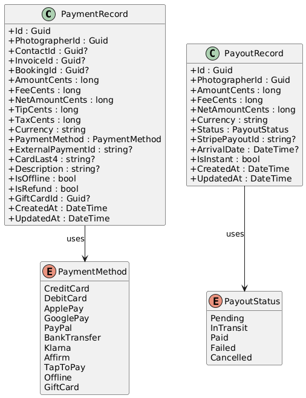

### Application Layer -- Payment Commands

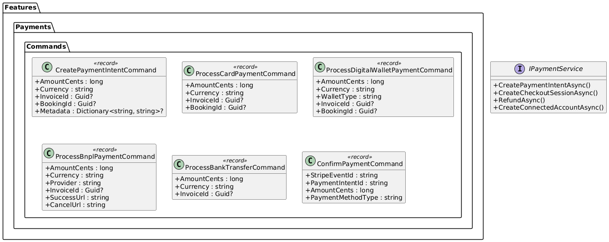

### Application Layer -- PayPal, Tap to Pay, and Offline Commands

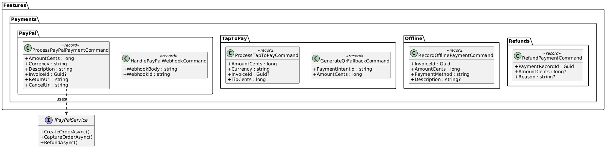

### Application Layer -- Payout & Webhook Commands

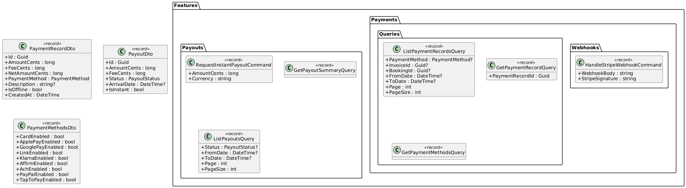

### API Layer -- Payment Controllers

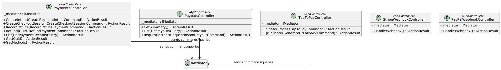

---

## Sequence Diagrams

### Card Payment via Stripe PaymentIntent

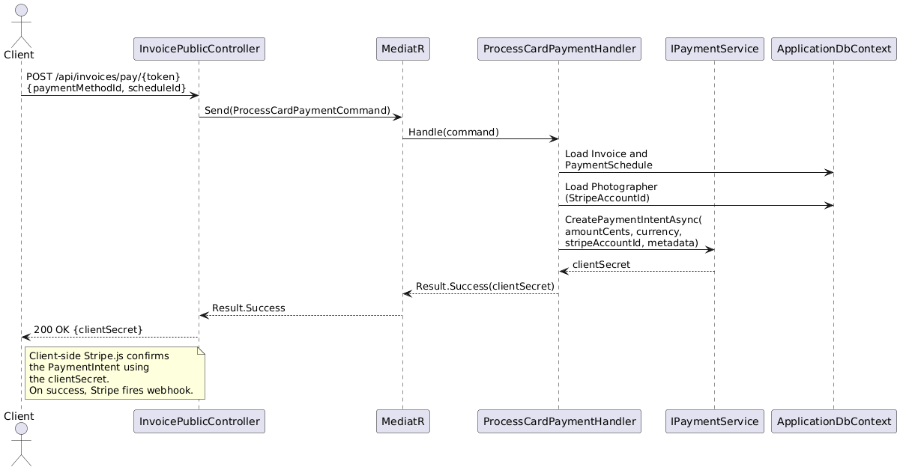

### Stripe Webhook Confirms Payment

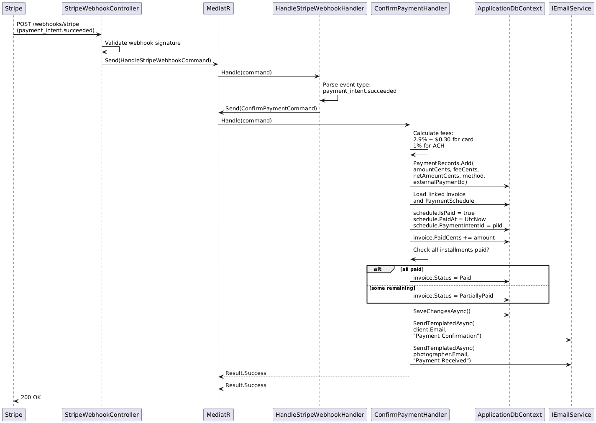

### PayPal Payment Flow

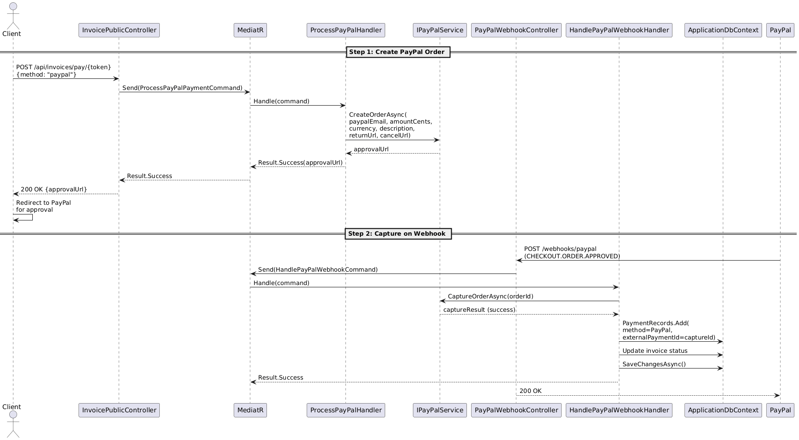

### Buy Now Pay Later (Klarna/Affirm)

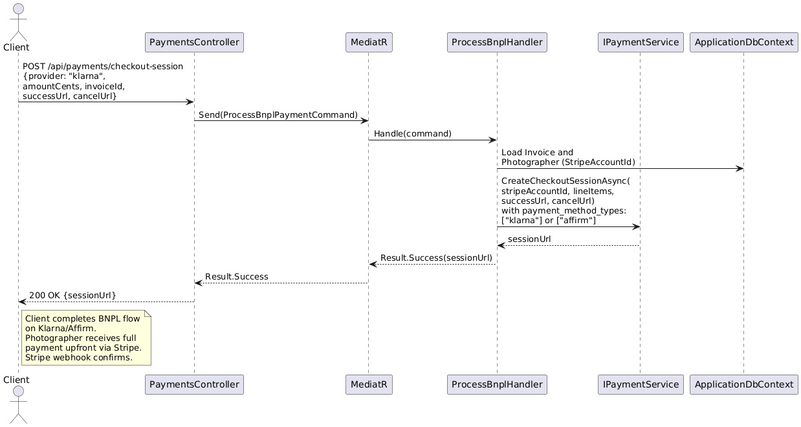

### Tap to Pay with QR Fallback

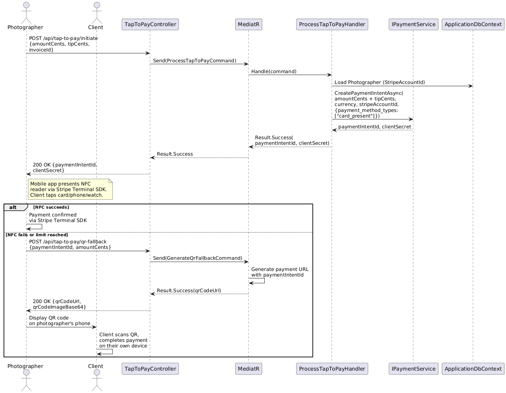

### Record Offline Payment

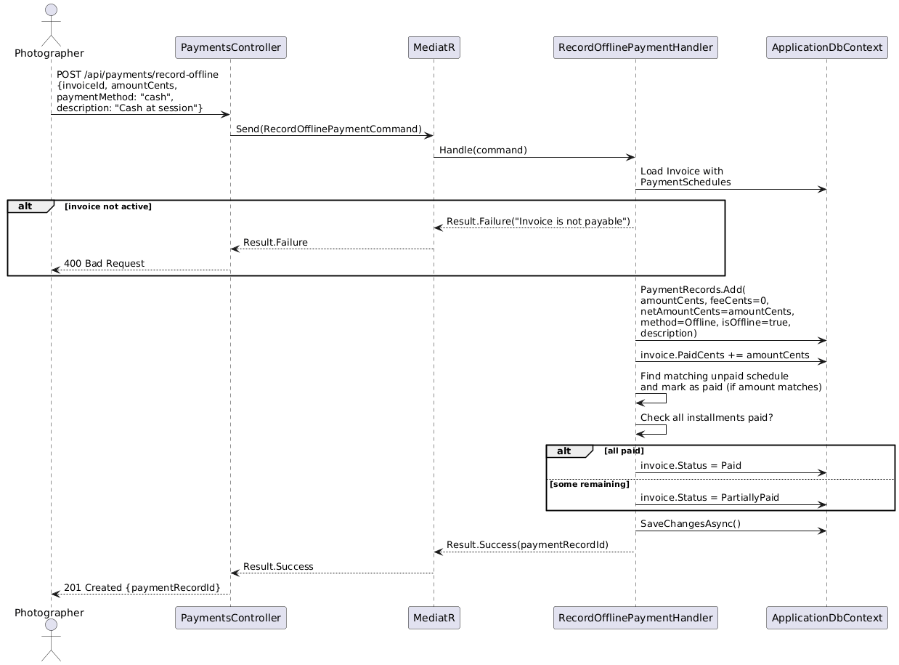

### Request Instant Payout

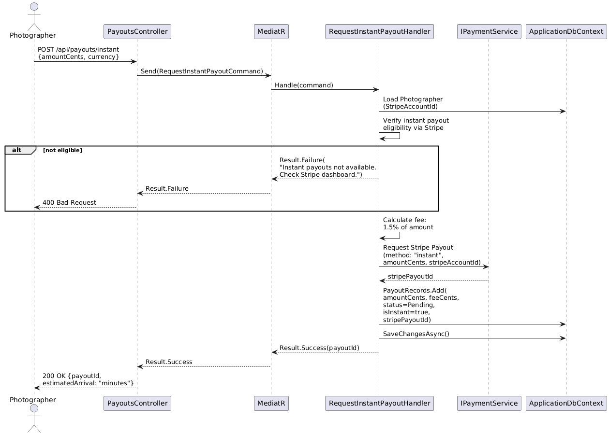

### Get Payout Summary

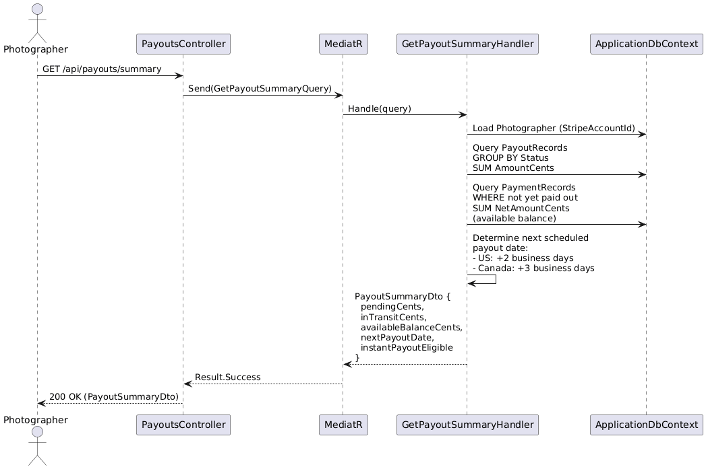
