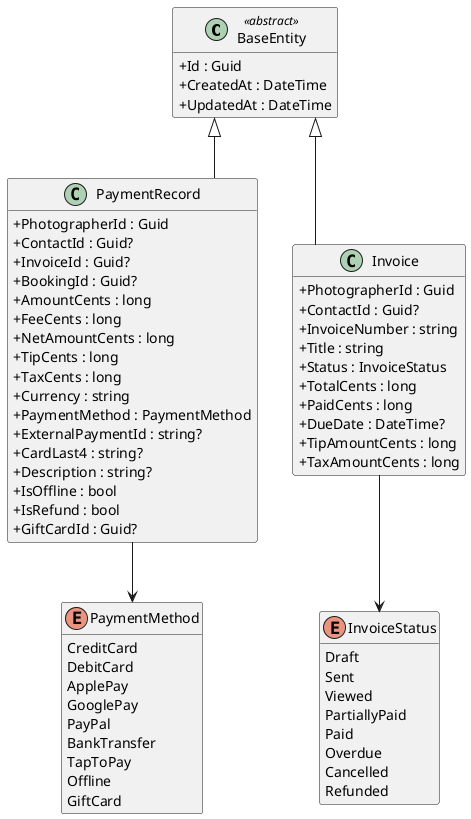
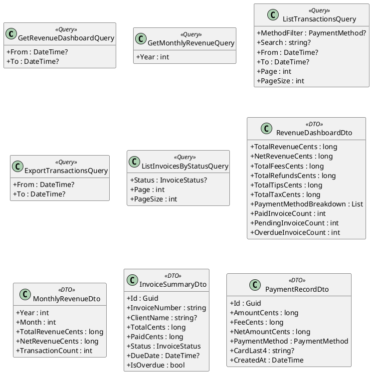
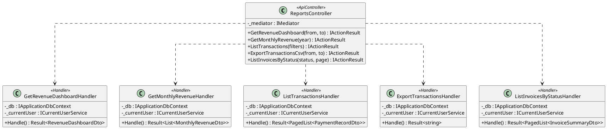
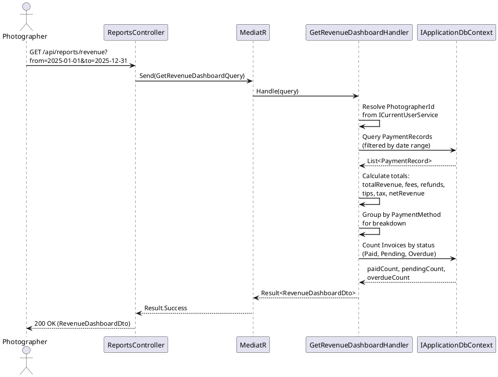
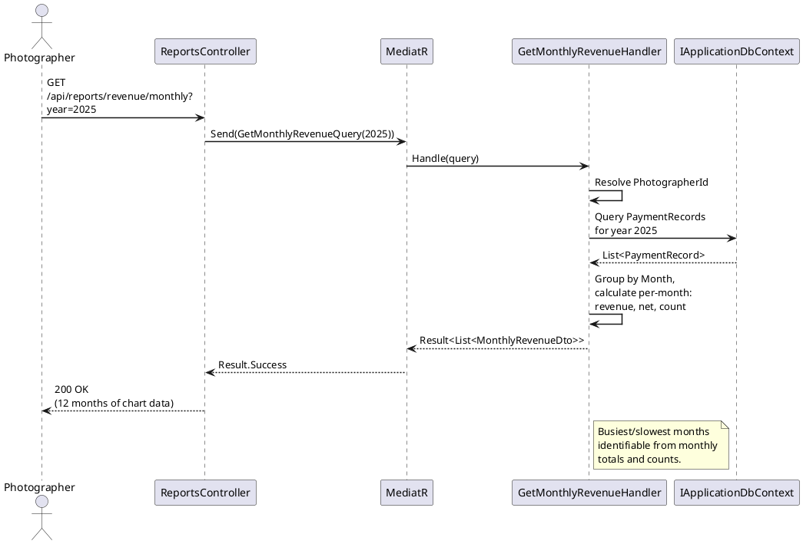
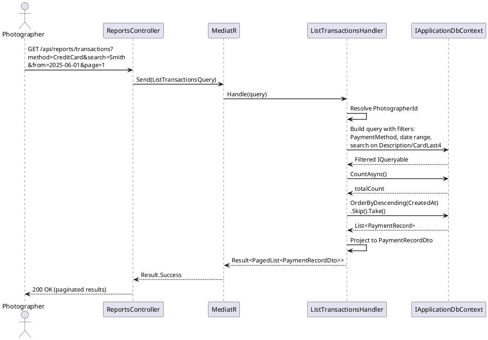
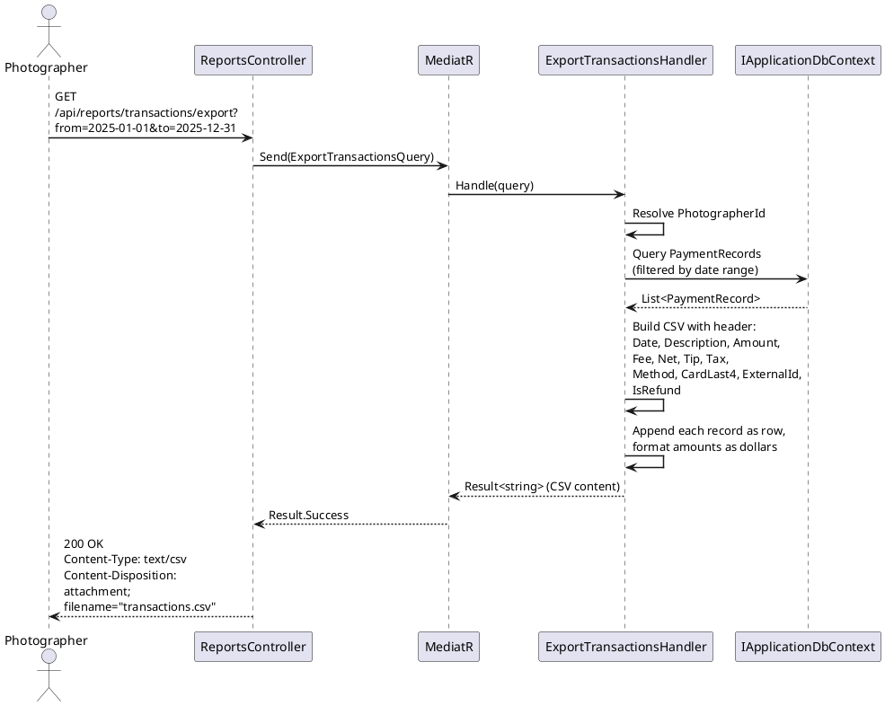
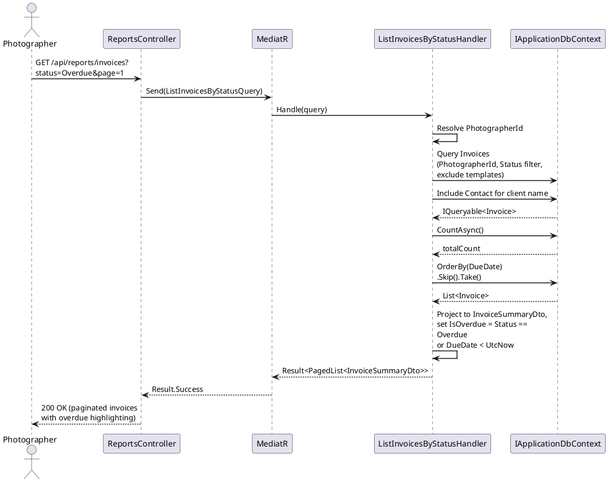

# F31 - Financial Reporting

## Overview

Financial Reporting provides photographers with a comprehensive revenue dashboard, detailed transaction history, CSV data export, and invoice tracking. The dashboard aggregates all `PaymentRecord` data to present total revenue, net revenue (after fees, refunds, and disputes), payment method breakdown, tips, and taxes. Visual graphs and charts allow photographers to identify trends, busiest months, and slowest periods at a glance. All dashboard data supports date range filtering with preset ranges (yearly, quarterly, monthly) and fully custom start/end dates.

Transaction details expose every individual payment with its full financial profile: amount, payment method, processing fees, net amount, date, associated client name, and card last 4 digits. The transaction list is searchable by description or card digits and filterable by payment method and date range. Pagination ensures performance with large transaction volumes.

CSV data export produces a downloadable file covering all transactions for a selected period, formatted for direct use in tax filing or sharing with an accountant. Invoice tracking surfaces paid, pending, and overdue invoices directly from the dashboard, with overdue invoices visually highlighted. Monthly aggregation of revenue data enables identification of busiest and slowest months.

**L2 Requirements:** RPT-4.10.1 (Revenue Dashboard), RPT-4.10.2 (Transaction Details), RPT-4.10.3 (Data Export), RPT-4.10.4 (Invoice Tracking)

---

## Components

### Domain Layer

| Component | Type | Description |
|-----------|------|-------------|
| `PaymentRecord` | Entity (existing) | Transaction record storing gross amount, fees, net amount, tips, tax, payment method, card last 4, refund flag, and links to Contact/Invoice/Booking. Implements `ITenantEntity`. |
| `Invoice` | Entity (existing) | Invoice entity with status tracking (Draft, Sent, Viewed, PartiallyPaid, Paid, Overdue, Cancelled, Refunded). Linked to Contact and Project. |
| `PaymentMethod` | Enum (existing) | CreditCard, DebitCard, ApplePay, GooglePay, PayPal, BankTransfer, Klarna, Affirm, TapToPay, Offline, GiftCard. |
| `InvoiceStatus` | Enum (existing) | Draft, Sent, Viewed, PartiallyPaid, Paid, Overdue, Cancelled, Refunded. |

### Application Layer

| Component | Type | Description |
|-----------|------|-------------|
| `GetRevenueDashboardQuery` | Query (existing) | Aggregates `PaymentRecord` data within an optional date range. Returns totals for revenue, fees, refunds, tips, taxes, payment method breakdown, and invoice status counts (paid/pending/overdue). |
| `GetMonthlyRevenueQuery` | Query | Returns monthly revenue aggregation for a specified year, enabling busiest/slowest month identification via a time-series dataset suitable for charting. |
| `ListTransactionsQuery` | Query (existing) | Paginated list of `PaymentRecord` entries with optional filters for payment method, date range, and free-text search across description and card last 4. |
| `ExportTransactionsQuery` | Query (existing) | Produces a CSV string of all transactions matching the date range, formatted with columns for Date, Description, Amount, Fee, Net, Tip, Tax, Method, CardLast4, ExternalId, IsRefund. |
| `ListInvoicesByStatusQuery` | Query | Returns paginated invoices filtered by status (paid, pending, overdue) with overdue highlighting. Includes client name, amount, due date. |
| `RevenueDashboardDto` | DTO (existing) | Aggregated dashboard read model with totals, breakdown, and invoice counts. |
| `MonthlyRevenueDto` | DTO | Per-month aggregation: month, year, total revenue, net revenue, transaction count. |
| `PaymentRecordDto` | DTO (existing) | Full transaction detail read model. |
| `InvoiceSummaryDto` | DTO | Lightweight invoice read model for dashboard listing: Id, InvoiceNumber, ClientName, TotalCents, PaidCents, Status, DueDate, IsOverdue. |

### Infrastructure Layer

| Component | Type | Description |
|-----------|------|-------------|
| `GetMonthlyRevenueHandler` | Handler | Groups `PaymentRecord` by year/month, aggregates totals per period. |
| `ListInvoicesByStatusHandler` | Handler | Queries invoices filtered by status with Contact join for client name. Calculates overdue flag from `DueDate`. |

### API Layer

| Component | Type | Description |
|-----------|------|-------------|
| `ReportsController` | Controller | Endpoints: `GET /api/reports/revenue` (dashboard), `GET /api/reports/revenue/monthly` (chart data), `GET /api/reports/transactions` (paginated list), `GET /api/reports/transactions/export` (CSV download), `GET /api/reports/invoices` (by-status listing). All require `[Authorize]`. |

---

## Class Diagrams

### Domain Layer - Financial Entities

### Application Layer - Queries, DTOs, and Handlers

### Infrastructure & API Layer

---

## Sequence Diagrams

### View Revenue Dashboard

### Get Monthly Revenue for Charts

### List and Search Transactions

### Export Transactions as CSV

### List Invoices by Status

