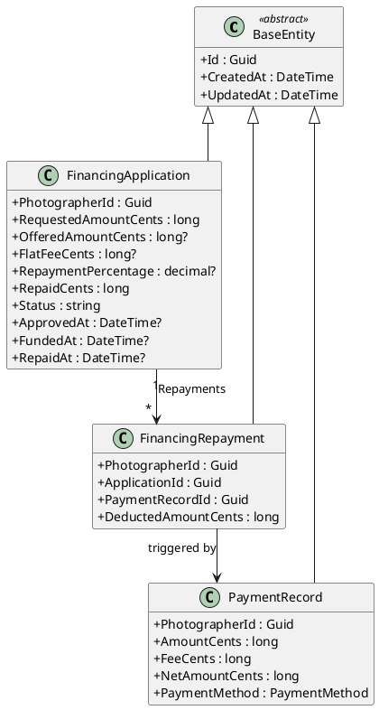
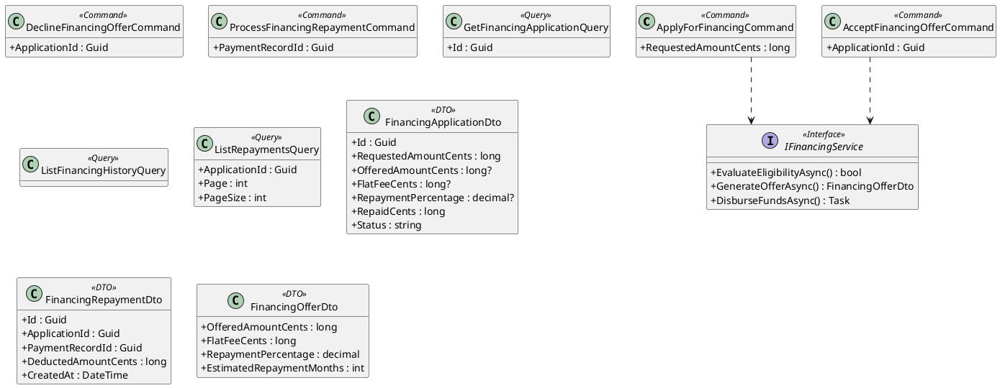
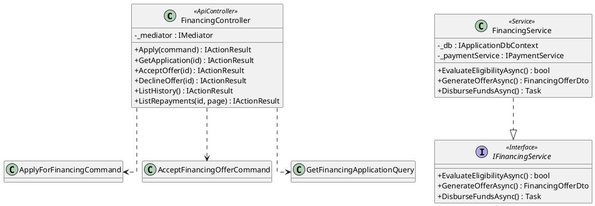
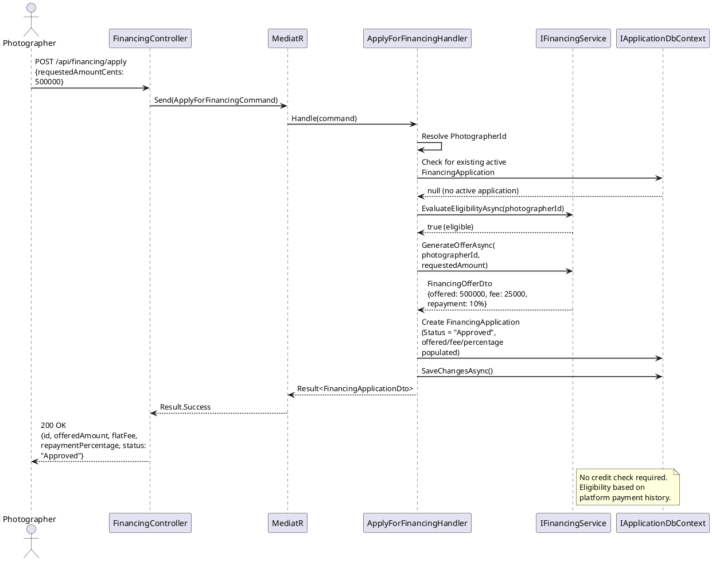
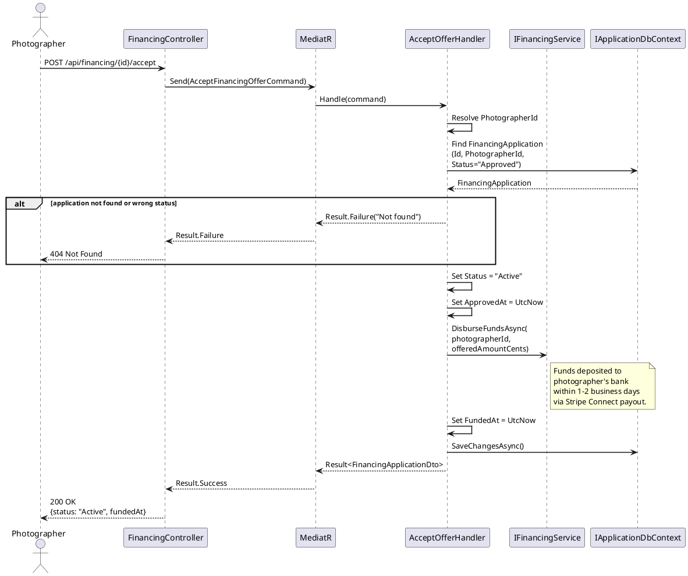
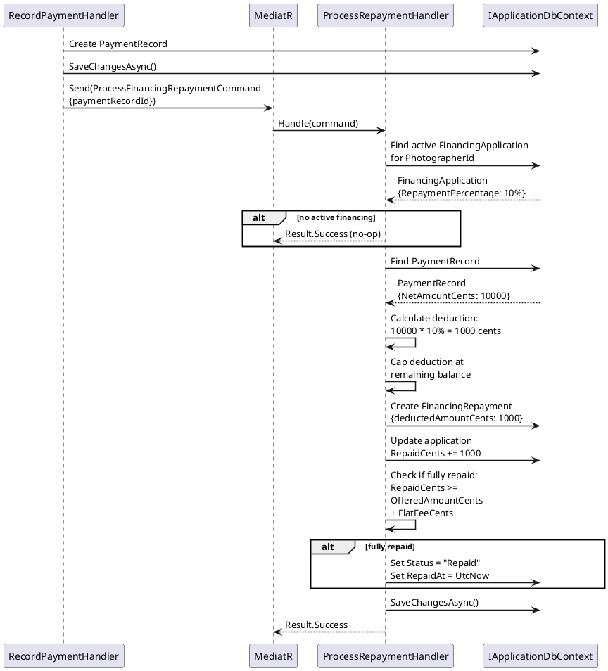
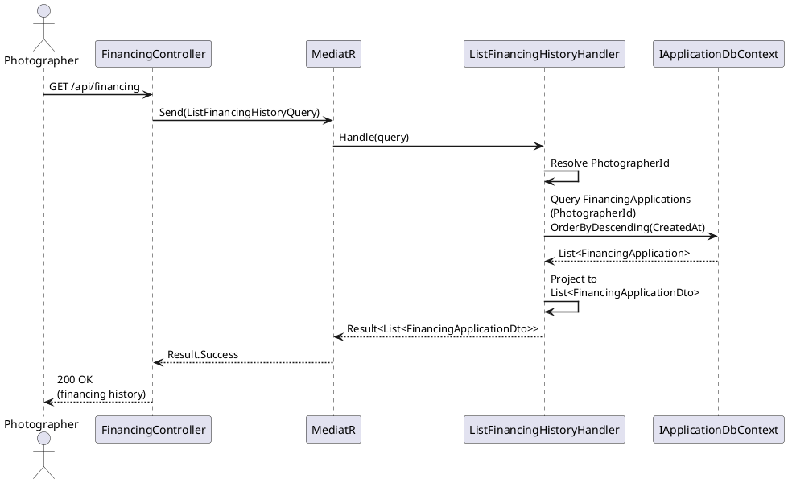

# F32 - Business Financing

## Overview

Business Financing (Capital) provides eligible photographers with access to funding directly through the Anansi platform. The feature enables photographers to apply for financing and receive an offer that includes a funding amount, a flat fee (not compounding interest), and clear repayment terms. The application process requires no credit check and has no impact on the photographer's personal credit score. Eligibility is determined internally based on the photographer's platform payment history and account standing.

Once a financing offer is accepted, funds are deposited directly to the photographer's linked bank account within 1-2 business days. Repayment is automatic: a disclosed percentage of every incoming platform payment is withheld and applied to the outstanding balance. The repayment percentage is clearly communicated before the photographer accepts the offer, ensuring full transparency. The `FinancingApplication` entity tracks the full lifecycle from application through funding to complete repayment.

The financing flow integrates with the existing payment processing pipeline. When a `PaymentRecord` is created for a photographer who has an active financing application, the repayment deduction is automatically calculated, recorded as a `FinancingRepayment`, and the application's `RepaidCents` balance is updated. Once the total owed (offered amount plus flat fee) is fully repaid, the application status transitions to "Repaid" and automatic deductions cease.

**L2 Requirements:** CAP-4.11.1 (Financing Application), CAP-4.11.2 (Repayment)

---

## Components

### Domain Layer

| Component | Type | Description |
|-----------|------|-------------|
| `FinancingApplication` | Entity (existing) | Tracks the financing lifecycle: requested amount, offered amount, flat fee, repayment percentage, total repaid, status (Pending/Approved/Active/Repaid/Declined), and timestamps for approval, funding, and full repayment. Implements `ITenantEntity`. |
| `FinancingRepayment` | Entity | Records each individual repayment deduction. Links to both the `FinancingApplication` and the triggering `PaymentRecord`. Stores the deducted amount in cents. |
| `FinancingApplicationStatus` | Enum | Pending, Approved, Active, Repaid, Declined. Replaces the current string-based status on `FinancingApplication`. |

### Application Layer

| Component | Type | Description |
|-----------|------|-------------|
| `ApplyForFinancingCommand` | Command (existing) | Creates a new `FinancingApplication` with status "Pending". Validates that the photographer does not already have an active application. |
| `GetFinancingApplicationQuery` | Query (existing) | Returns the current financing application details for a given application ID. |
| `AcceptFinancingOfferCommand` | Command | Transitions an approved application to "Active" status. Records the photographer's acceptance of the disclosed repayment percentage and terms. Triggers fund disbursement via `IFinancingService`. |
| `DeclineFinancingOfferCommand` | Command | Transitions an approved application to "Declined" status. |
| `ListFinancingHistoryQuery` | Query | Returns all financing applications for the authenticated photographer, ordered by creation date. |
| `ListRepaymentsQuery` | Query | Returns paginated repayment records for a specific financing application. |
| `ProcessFinancingRepaymentCommand` | Command (internal) | Called by the payment pipeline when a new `PaymentRecord` is created. Calculates the repayment deduction, creates a `FinancingRepayment`, and updates the application's `RepaidCents`. Marks application as "Repaid" when fully paid. |
| `IFinancingService` | Interface | Abstracts eligibility evaluation, offer generation, and fund disbursement. Implemented in Infrastructure. |
| `FinancingApplicationDto` | DTO (existing) | Read model for financing application details. |
| `FinancingRepaymentDto` | DTO | Read model for repayment records: Id, ApplicationId, PaymentRecordId, DeductedAmountCents, CreatedAt. |
| `FinancingOfferDto` | DTO | Offer details returned after eligibility evaluation: offered amount, flat fee, repayment percentage, estimated repayment timeline. |

### Infrastructure Layer

| Component | Type | Description |
|-----------|------|-------------|
| `FinancingService` | Service | Implements `IFinancingService`. Evaluates eligibility based on platform payment history (minimum volume/tenure), generates offers with configurable terms, and initiates fund disbursement through Stripe Connect payouts. |
| `FinancingRepaymentJob` | Background Job | Listens for new payment events (or is called inline during `RecordPayment`). For photographers with active financing, calculates deduction and invokes `ProcessFinancingRepaymentCommand`. |

### API Layer

| Component | Type | Description |
|-----------|------|-------------|
| `FinancingController` | Controller | Endpoints: `POST /api/financing/apply` (submit application), `GET /api/financing/{id}` (get application), `POST /api/financing/{id}/accept` (accept offer), `POST /api/financing/{id}/decline` (decline offer), `GET /api/financing` (list history), `GET /api/financing/{id}/repayments` (list repayments). All require `[Authorize]`. |

---

## Class Diagrams

### Domain Layer - Financing Entities

### Application Layer - Commands, Queries, and Services

### Infrastructure & API Layer

---

## Sequence Diagrams

### Apply for Financing

### Accept Financing Offer and Fund Disbursement

### Automatic Repayment on Payment Received

### View Financing History

