# F33 - Email Inbox & Communication

## Overview

The Email Inbox feature provides a unified communication hub within Studio Manager where photographers can manage all client conversations in one place. Every conversation is threaded by client, ensuring that all messages exchanged with a particular client (or email address) appear in a single, chronological thread. Photographers can compose new messages via a "New Message" button, and when a client replies to any message, the response is automatically threaded into the existing conversation.

File attachments are supported on all messages, with a maximum size of 25MB per message and compatibility with 30+ file types including documents (PDF, DOCX), images (JPG, PNG, GIF), video (MP4), and archives (ZIP). Attachment size validation occurs on the server side, rejecting oversized files with a clear error message before storage. Files are uploaded to blob storage and linked to the message via the `EmailAttachment` entity.

Real-time notification is central to the inbox experience. When a client responds, an instant in-app notification is delivered via the existing `Notification` entity and optionally through push notifications. An email notification is also sent to the photographer's account email address. Notification preferences are configurable per photographer, allowing control over which channels (in-app, email, push) are active and which event types trigger alerts.

**L2 Requirements:** EML-5.1.1 (Unified Inbox), EML-5.1.2 (File Attachments), EML-5.1.3 (Notifications)

---

## Components

### Domain Layer

| Component | Type | Description |
|-----------|------|-------------|
| `EmailConversation` | Entity (existing) | Threaded conversation with a client. Scoped by `PhotographerId`, linked to optional `ContactId`. Tracks subject, client email/name, read status, and last message timestamp. Implements `ITenantEntity`, `ISoftDeletable`. |
| `EmailMessage` | Entity (existing) | Individual message within a conversation. Stores sender info, body (plain and HTML), read status, and sent timestamp. `IsFromPhotographer` flag distinguishes direction. |
| `EmailAttachment` | Entity (existing) | File attachment on a message. Records file name, content type, size in bytes, and blob storage URL. Max 25MB per message enforced at the Application layer. |
| `Notification` | Entity (existing) | In-app notification with `EventType = MessageReceived`. Links to the photographer and includes a deep link to the conversation. |
| `NotificationPreference` | Entity (existing) | Per-photographer, per-event-type configuration for notification delivery channels (in-app, email, push). |

### Application Layer

| Component | Type | Description |
|-----------|------|-------------|
| `ListConversationsQuery` | Query | Paginated list of `EmailConversation` records for the authenticated photographer, ordered by `LastMessageAt` descending. Returns unread count per conversation. |
| `GetConversationQuery` | Query | Returns a single conversation with all its messages and attachments, ordered chronologically. Marks the conversation as read. |
| `ComposeMessageCommand` | Command | Creates a new `EmailConversation` (or threads into an existing one by client email), creates the `EmailMessage`, uploads attachments, sends the email via `IEmailService`, and updates `LastMessageAt`. |
| `ReplyToConversationCommand` | Command | Adds a new `EmailMessage` to an existing conversation, handles attachments, sends the email, and updates `LastMessageAt`. |
| `ReceiveInboundEmailCommand` | Command (internal) | Called by the inbound email webhook handler. Matches the incoming email to an existing conversation by client email (or creates a new one), creates the `EmailMessage` with attachments, marks conversation as unread, creates an in-app `Notification`, sends email notification to the photographer, and optionally triggers a push notification. |
| `MarkConversationReadCommand` | Command | Sets `IsRead = true` on the conversation and all its unread messages. |
| `DeleteConversationCommand` | Command | Soft-deletes a conversation. |
| `UploadAttachmentCommand` | Command (internal) | Validates file size (max 25MB per message total), validates file type against the allowed list, uploads to blob storage via `IStorageService`, and returns the `EmailAttachment` record. |
| `ConversationDto` | DTO | Read model for conversation list: Id, Subject, ClientName, ClientEmail, LastMessagePreview, LastMessageAt, IsRead, UnreadCount. |
| `ConversationDetailDto` | DTO | Full conversation with nested messages and attachments. |
| `EmailMessageDto` | DTO | Read model for a single message: Id, IsFromPhotographer, SenderName, Body, SentAt, Attachments. |
| `EmailAttachmentDto` | DTO | Read model for attachment: Id, FileName, ContentType, FileSizeBytes, DownloadUrl. |

### Infrastructure Layer

| Component | Type | Description |
|-----------|------|-------------|
| `InboundEmailWebhookHandler` | Service | Receives inbound emails from the email provider (e.g., SendGrid Inbound Parse, Mailgun Routes). Parses sender, subject, body, and attachments. Invokes `ReceiveInboundEmailCommand`. |
| `EmailService` | Service (existing) | Implements `IEmailService`. Sends outbound emails through the configured email provider. |
| `StorageService` | Service (existing) | Implements `IStorageService`. Handles attachment upload to blob storage and presigned URL generation for downloads. |

### API Layer

| Component | Type | Description |
|-----------|------|-------------|
| `EmailController` | Controller (existing, extended) | Endpoints: `GET /api/email/conversations` (list), `GET /api/email/conversations/{id}` (detail), `POST /api/email/conversations` (compose new), `POST /api/email/conversations/{id}/reply` (reply), `PUT /api/email/conversations/{id}/read` (mark read), `DELETE /api/email/conversations/{id}` (soft-delete), `POST /api/email/inbound` (webhook for inbound emails). Compose and reply endpoints accept multipart form data for file attachments. |

---

## Class Diagrams

### Domain Layer - Email Entities

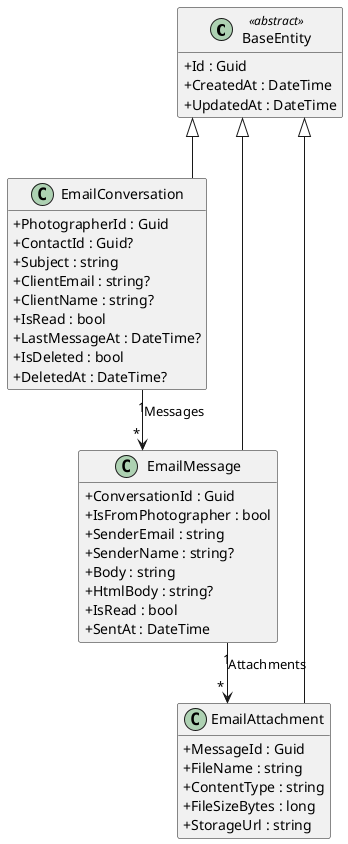

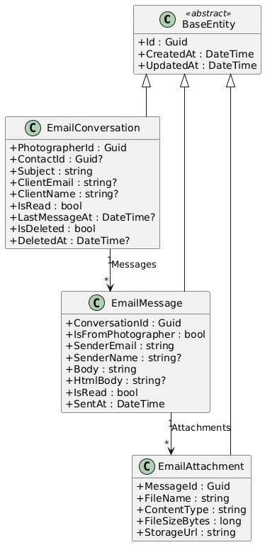

### Domain Layer - Notification Entities

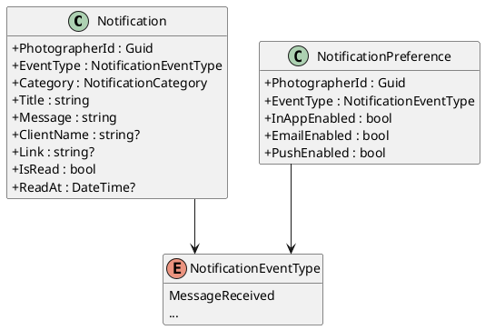

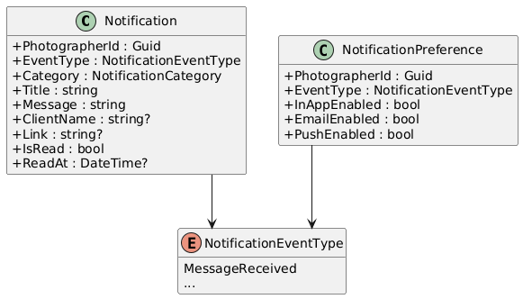

### Application Layer - Commands, Queries, and DTOs

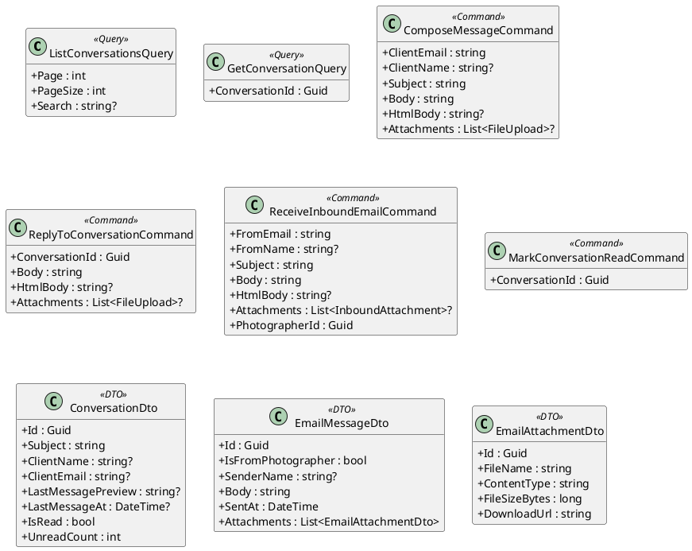

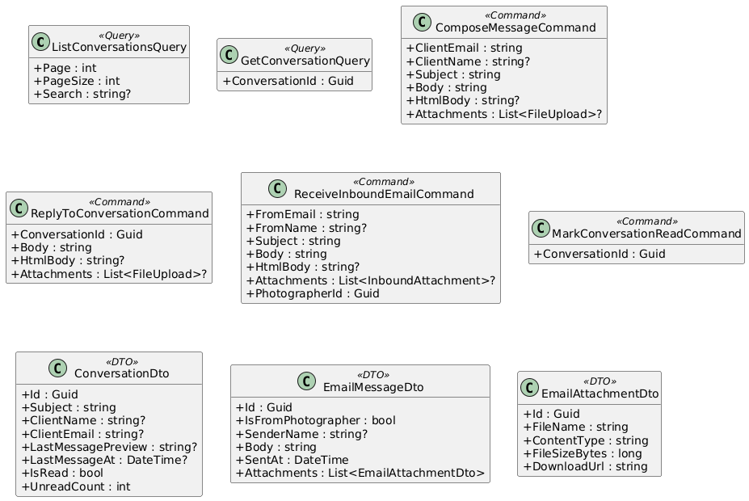

### Infrastructure & API Layer

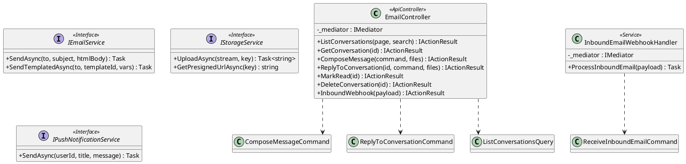

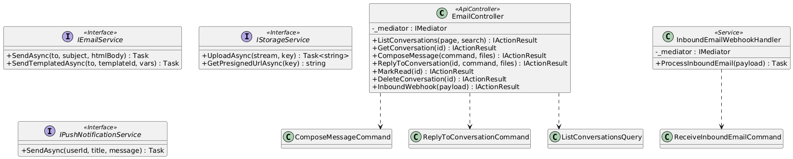

---

## Sequence Diagrams

### Compose and Send New Message

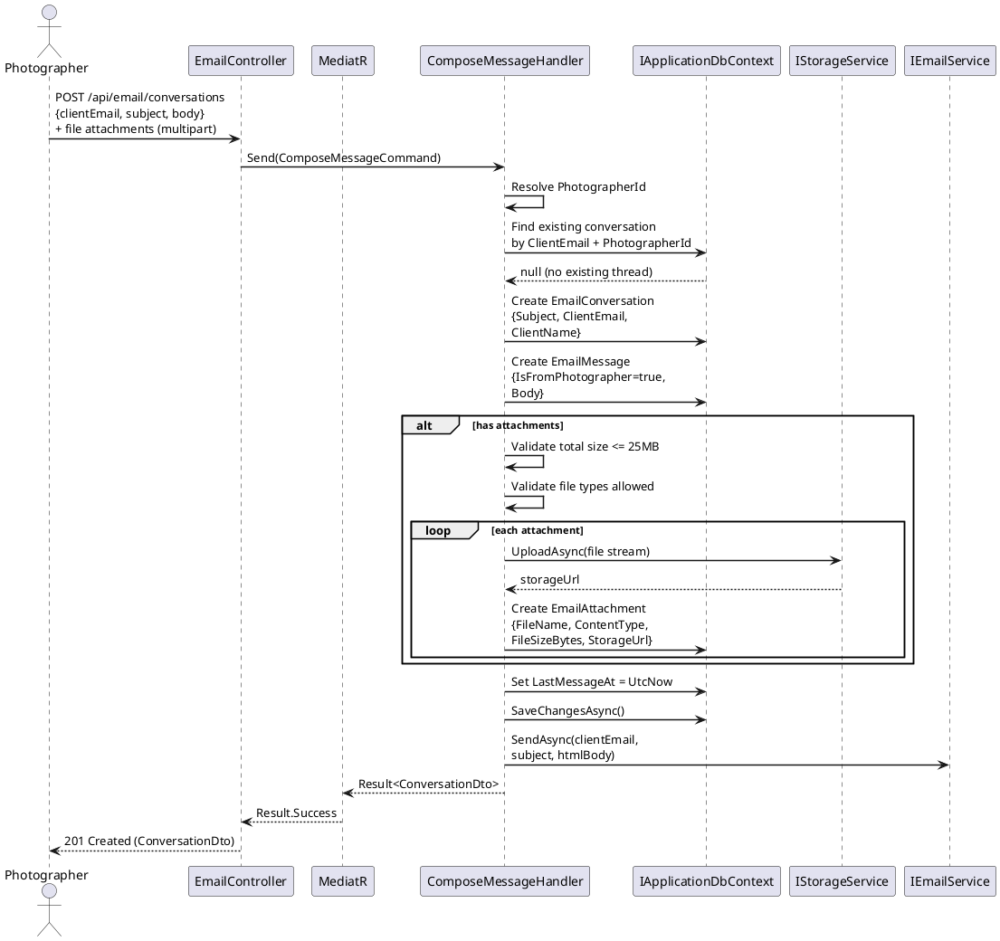

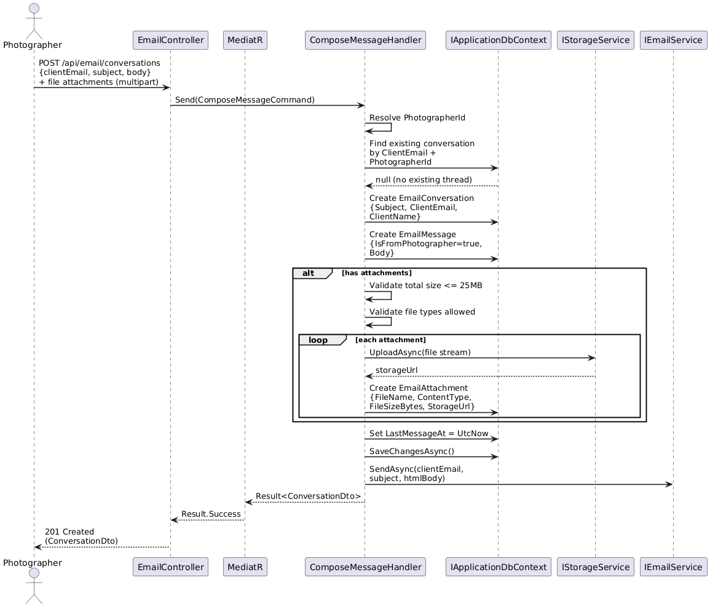

### Receive Inbound Client Reply

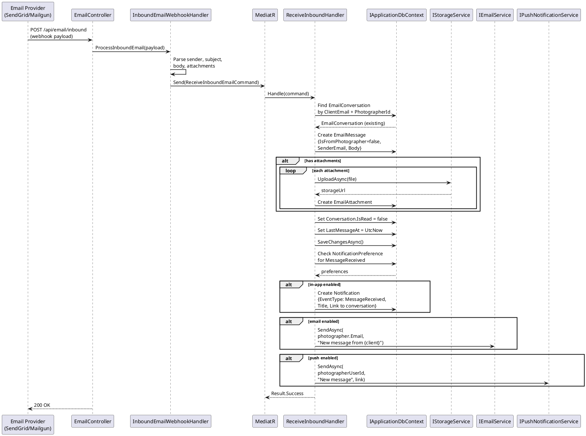

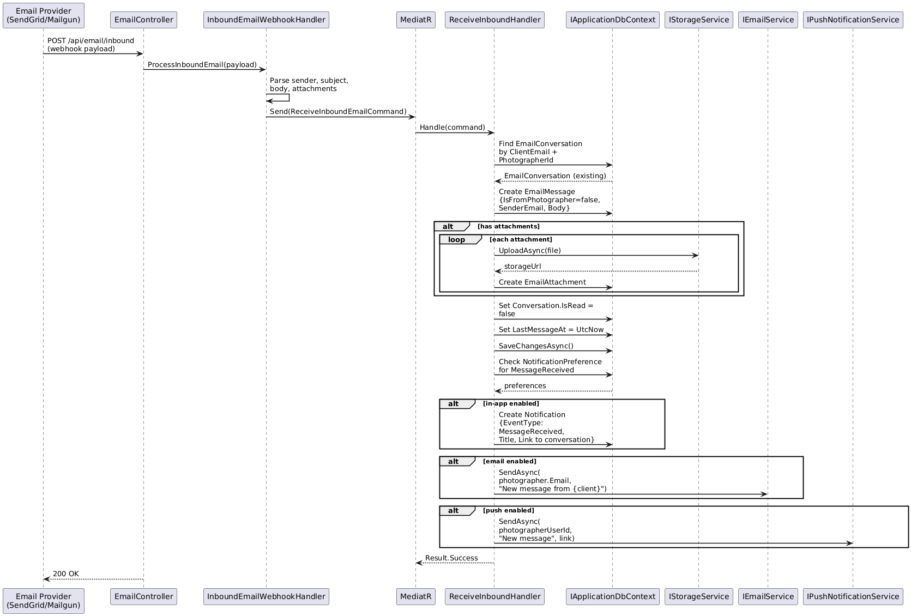

### List Conversations (Unified Inbox)

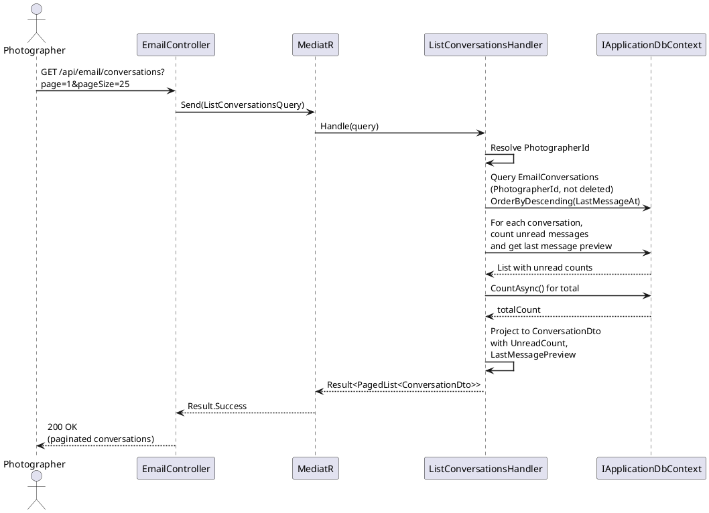

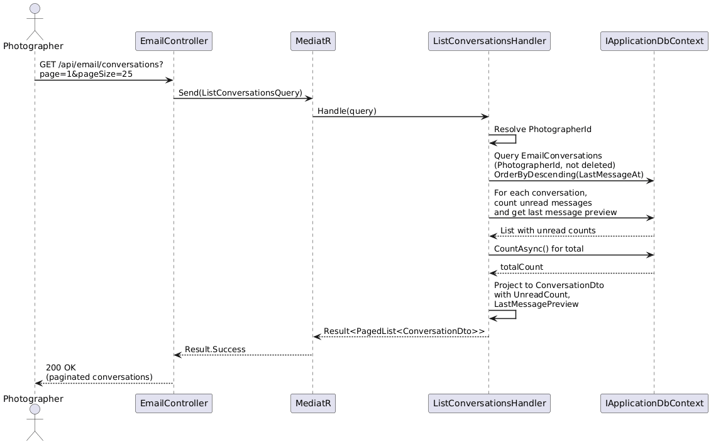

### Reply to Conversation with Attachments

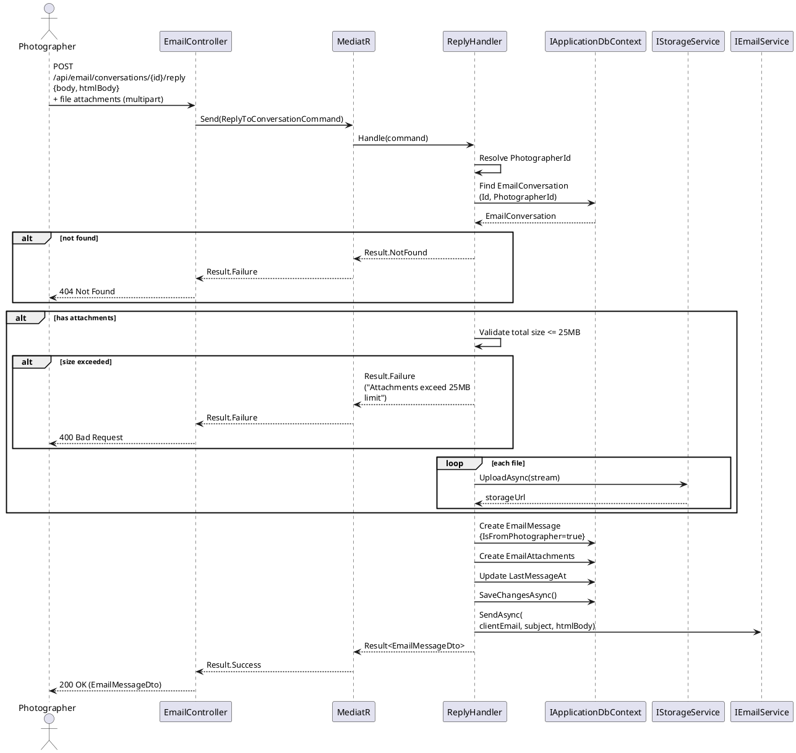

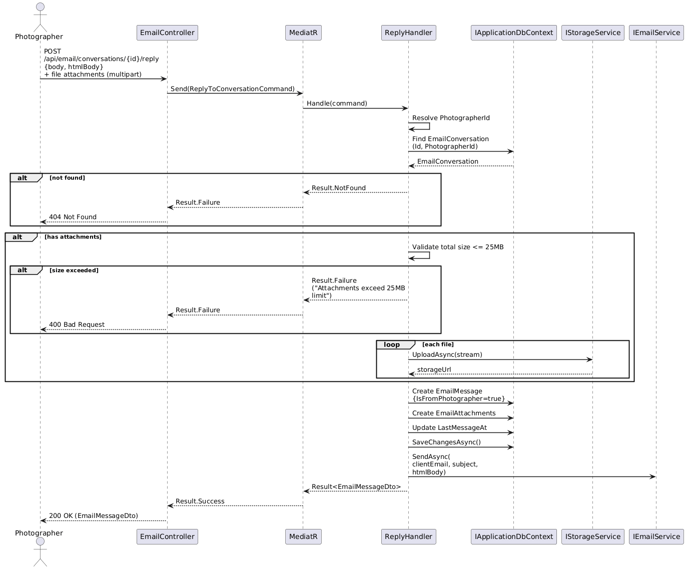

### Mark Conversation as Read

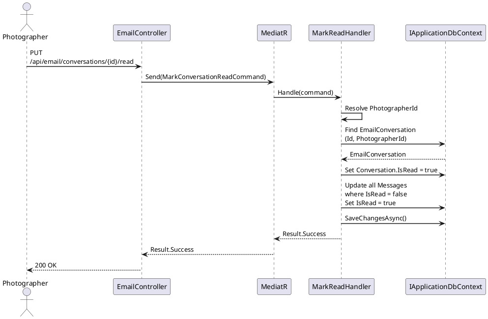

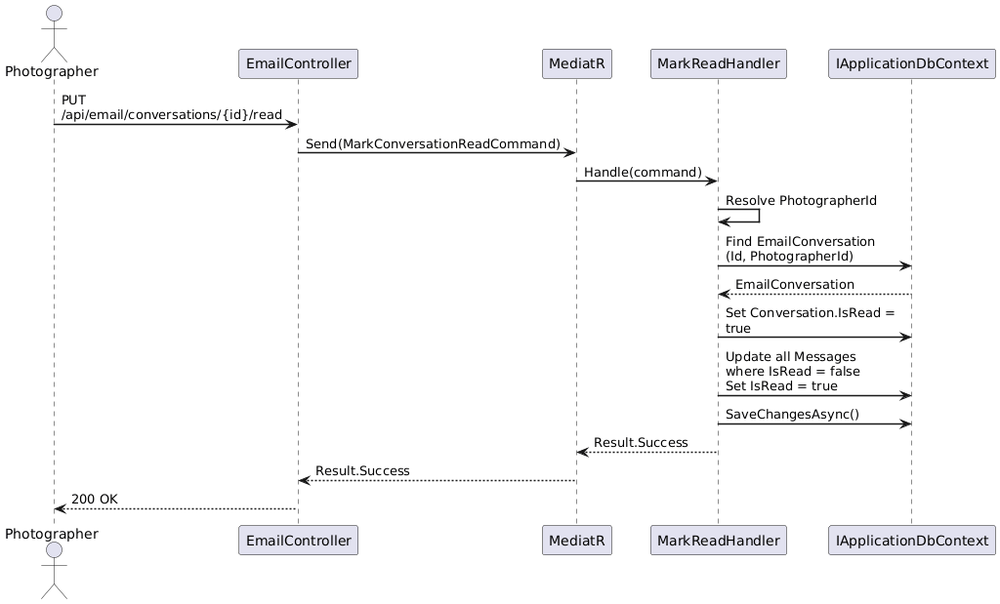
