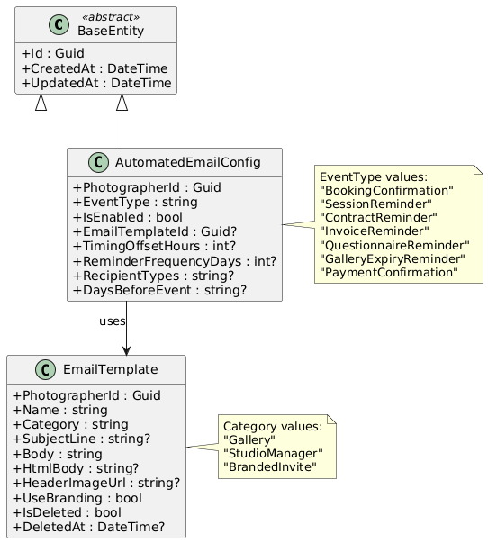
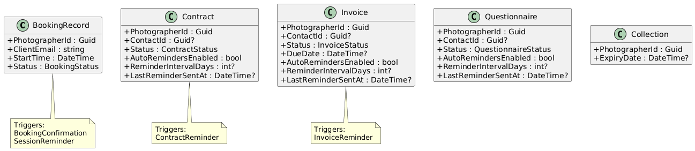
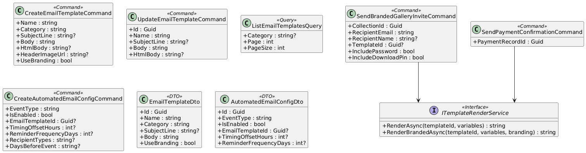
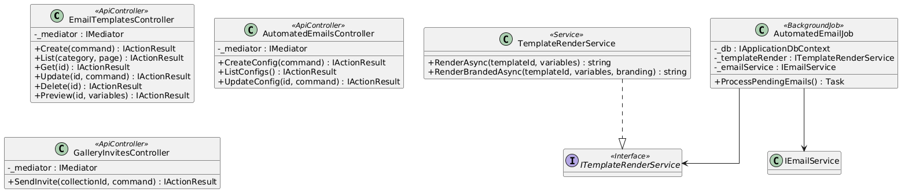
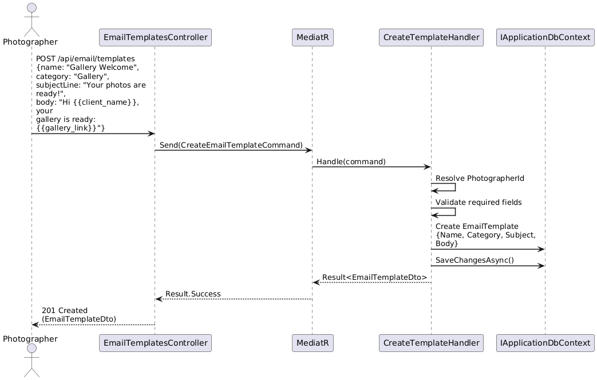
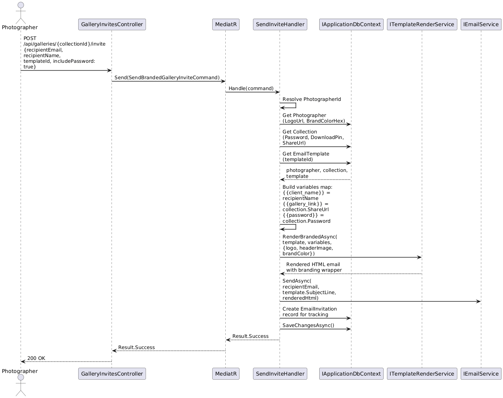
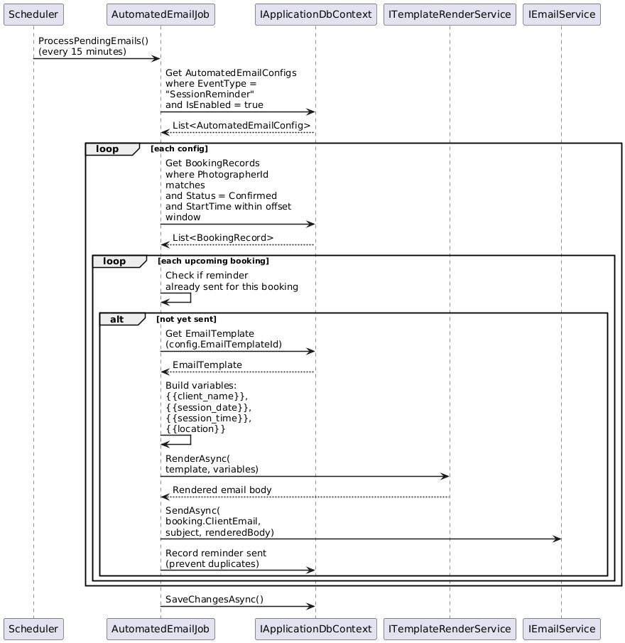
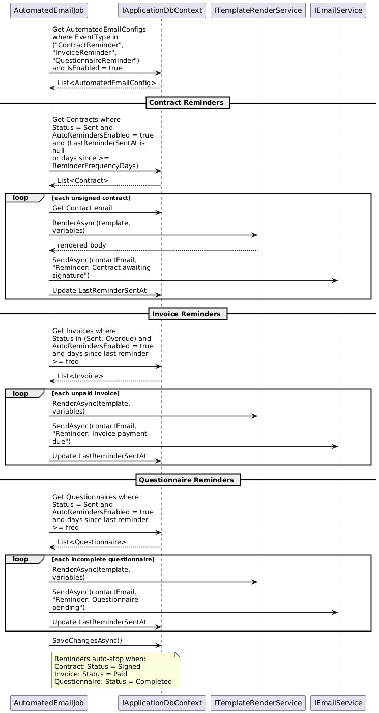
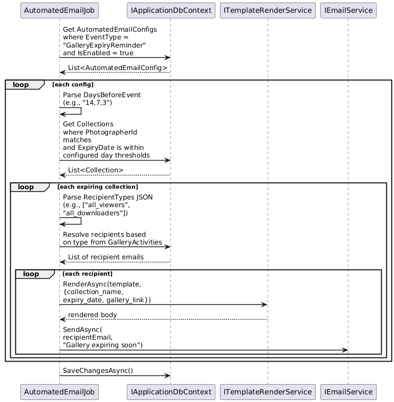
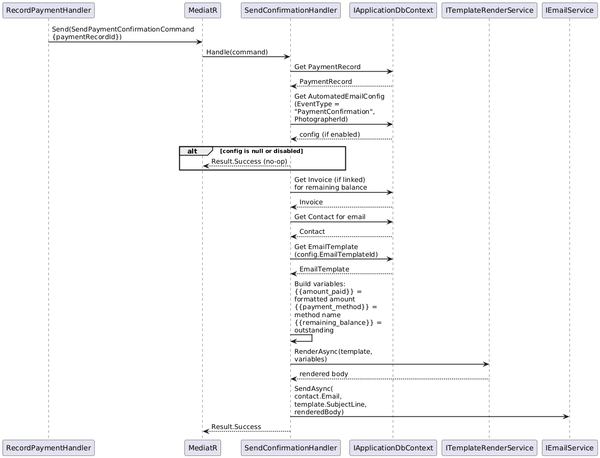

# F34 - Email Templates & Automation

## Overview

Email Templates & Automation enables photographers to create reusable email templates and configure automated emails for key workflow events. Templates fall into three categories: Gallery Email Templates (used when sending gallery invitations, with personalization variables for client name, gallery link, and password), Studio Manager Email Templates (usable at any workflow stage including inquiry, booking, invoicing, and delivery, with variable substitution for client data), and Branded Gallery Invites (incorporating the photographer's logo, header image, and brand colors alongside a direct gallery link and optional password/PIN).

Automated emails cover four key scenarios. Booking Emails send a confirmation automatically upon successful booking and a configurable session reminder before the shoot. Document Reminders send automated follow-ups for unsigned contracts, unpaid invoices, and incomplete questionnaires, with configurable frequency and automatic cessation once the action is completed. Gallery Expiry Reminders notify configurable recipient groups (specific clients, all viewers, downloaders, favoriters, or purchasers) at configurable intervals before a collection expires (e.g., 14, 7, 3 days before). Payment Confirmations send an email when a payment is processed, including the amount paid, payment method, and remaining balance.

The `AutomatedEmailConfig` entity stores per-photographer, per-event-type configuration, while the `EmailTemplate` entity provides the content. A background job (`AutomatedEmailJob`) periodically evaluates pending triggers -- upcoming sessions needing reminders, overdue documents, expiring galleries -- and dispatches emails through the template engine with variable substitution.

**L2 Requirements:** EML-5.2.1 (Gallery Email Templates), EML-5.2.2 (Studio Manager Email Templates), EML-5.2.3 (Branded Gallery Invites), EML-5.3.1 (Booking Emails), EML-5.3.2 (Document Reminders), EML-5.3.3 (Gallery Expiry Reminders), EML-5.3.4 (Payment Confirmations)

---

## Components

### Domain Layer

| Component | Type | Description |
|-----------|------|-------------|
| `EmailTemplate` | Entity (existing) | Reusable email template with name, category ("Gallery", "StudioManager", "BrandedInvite"), subject line, body (plain + HTML), header image URL, and branding flag. Implements `ITenantEntity`, `ISoftDeletable`. |
| `AutomatedEmailConfig` | Entity (existing) | Per-photographer configuration for automated emails. Stores event type (BookingConfirmation, SessionReminder, ContractReminder, InvoiceReminder, QuestionnaireReminder, GalleryExpiryReminder, PaymentConfirmation), enabled flag, linked template ID, timing offset, reminder frequency, recipient types (JSON), and days-before-event schedule. |
| `Photographer` | Entity (existing) | Provides branding data (LogoUrl, ProfileIconUrl, BrandColorHex) used in branded gallery invites. |
| `BookingRecord` | Entity (existing) | Booking with `StartTime` used for session reminder scheduling. |
| `Contract` | Entity (existing) | Contract with `Status` and `AutoRemindersEnabled` for document reminder triggers. |
| `Invoice` | Entity (existing) | Invoice with `Status`, `DueDate`, and `AutoRemindersEnabled` for payment reminder triggers. |
| `Questionnaire` | Entity (existing) | Questionnaire with `Status` and `AutoRemindersEnabled` for completion reminder triggers. |
| `Collection` | Entity (existing) | Gallery collection with `ExpiryDate` for gallery expiry reminder triggers. |

### Application Layer

| Component | Type | Description |
|-----------|------|-------------|
| `CreateEmailTemplateCommand` | Command | Creates a new `EmailTemplate` with name, category, subject, body, and optional branding configuration. Validates required fields per category. |
| `UpdateEmailTemplateCommand` | Command | Updates an existing template's fields. |
| `DeleteEmailTemplateCommand` | Command | Soft-deletes an email template. |
| `ListEmailTemplatesQuery` | Query | Paginated list of templates for the photographer, optionally filtered by category. |
| `GetEmailTemplateQuery` | Query | Returns a single template by ID. |
| `PreviewEmailTemplateQuery` | Query | Renders a template with sample variable substitution so the photographer can preview the result. |
| `CreateAutomatedEmailConfigCommand` | Command | Creates or updates an `AutomatedEmailConfig` for a specific event type. Validates timing/frequency values. |
| `UpdateAutomatedEmailConfigCommand` | Command | Updates configuration fields (enabled, template, timing, frequency, recipients). |
| `ListAutomatedEmailConfigsQuery` | Query | Returns all automated email configurations for the photographer. |
| `SendBrandedGalleryInviteCommand` | Command | Sends a gallery invitation email using the photographer's branding, a selected template, and personalization variables (client name, gallery link, password/PIN). |
| `SendPaymentConfirmationCommand` | Command (internal) | Triggered after payment processing. Sends confirmation email with amount, method, and remaining balance using the configured template. |
| `ITemplateRenderService` | Interface | Renders an email template body by substituting variables (e.g., `{{client_name}}`, `{{gallery_link}}`, `{{password}}`). Applies branding (logo, colors) for branded invites. |
| `EmailTemplateDto` | DTO | Read model for template: Id, Name, Category, SubjectLine, Body, HtmlBody, HeaderImageUrl, UseBranding. |
| `AutomatedEmailConfigDto` | DTO | Read model for config: Id, EventType, IsEnabled, EmailTemplateId, TimingOffsetHours, ReminderFrequencyDays, RecipientTypes, DaysBeforeEvent. |

### Infrastructure Layer

| Component | Type | Description |
|-----------|------|-------------|
| `TemplateRenderService` | Service | Implements `ITemplateRenderService`. Performs Mustache-style variable substitution on template bodies. Wraps content in branded HTML layout (logo, header image, brand colors) for branded invites. |
| `AutomatedEmailJob` | Background Job | Runs on a schedule (e.g., every 15 minutes). Evaluates each automated email type for pending triggers. |
| `BookingEmailProcessor` | Component | Sub-processor for `AutomatedEmailJob`. Sends booking confirmations for newly confirmed bookings and session reminders based on `TimingOffsetHours` before `StartTime`. |
| `DocumentReminderProcessor` | Component | Sub-processor for `AutomatedEmailJob`. Finds unsigned contracts, unpaid invoices, and incomplete questionnaires with `AutoRemindersEnabled`. Sends reminders at configured frequency. Skips completed items. |
| `GalleryExpiryReminderProcessor` | Component | Sub-processor for `AutomatedEmailJob`. Finds collections approaching expiry within configured day thresholds. Resolves recipient lists based on configured types (viewers, downloaders, favoriters, purchasers). Sends reminders. |

### API Layer

| Component | Type | Description |
|-----------|------|-------------|
| `EmailTemplatesController` | Controller | Endpoints: `POST /api/email/templates` (create), `GET /api/email/templates` (list), `GET /api/email/templates/{id}` (get), `PUT /api/email/templates/{id}` (update), `DELETE /api/email/templates/{id}` (delete), `POST /api/email/templates/{id}/preview` (preview with variables). All require `[Authorize]`. |
| `AutomatedEmailsController` | Controller | Endpoints: `POST /api/email/automation` (create config), `GET /api/email/automation` (list configs), `PUT /api/email/automation/{id}` (update config). All require `[Authorize]`. |
| `GalleryInvitesController` | Controller | Endpoint: `POST /api/galleries/{collectionId}/invite` (send branded gallery invite). Requires `[Authorize]`. |

---

## Class Diagrams

### Domain Layer - Email Template & Automation Entities

### Domain Layer - Entities Triggering Automated Emails

### Application Layer - Commands, Queries, and Services

### Infrastructure & API Layer

---

## Sequence Diagrams

### Create and Use Gallery Email Template

### Send Branded Gallery Invite

### Automated Session Reminder

### Automated Document Reminders

### Gallery Expiry Reminders

### Payment Confirmation Email

