# F35 - Studio Manager Mobile App

## Overview

The Studio Manager Mobile App is a native iOS and Android application that gives photographers on-the-go access to their core Studio Manager capabilities. The app provides booking management (view upcoming sessions, manage the calendar, accept or decline pending bookings), invoice management (create, edit, send invoices, view payment status), client communication (full Inbox access with read, reply, compose, and file attachments), and document management (create, edit, share contracts and questionnaires, view signing/completion status). The app is free for all registered Anansi users regardless of their subscription plan and is distributed through the iOS App Store and Google Play.

A key differentiating feature is Tap to Pay, which allows photographers to collect in-person payments directly from the mobile app. The photographer initiates a payment on-screen, and the client taps their credit/debit card, phone, or watch to complete the transaction. The system supports credit cards, debit cards, Apple Pay, and Google Pay. A QR code fallback is available when contactless payment fails, generating a payment link the client can scan and pay through. Tip collection is integrated into the Tap to Pay flow, presented to the client before final confirmation.

Push notifications keep photographers informed in real time about new bookings, payments received, contracts signed, invoice payments, new messages, and form submissions. Notification preferences are configurable per event type. The mobile app consumes the same API endpoints as the web application, ensuring data consistency. Platform-specific functionality (NFC/Tap to Pay, push notification registration, camera/file picker for attachments) is handled in the native layers, while business logic remains in the shared backend.

**L2 Requirements:** MOB-6.1.1 (Booking Management), MOB-6.1.2 (Invoice Management), MOB-6.1.3 (Tap to Pay), MOB-6.1.4 (Client Communication), MOB-6.1.5 (Document Management), MOB-6.1.6 (Push Notifications), MOB-6.1.7 (Availability)

---

## Components

### Domain Layer

| Component | Type | Description |
|-----------|------|-------------|
| `BookingRecord` | Entity (existing) | Session booking with status (Pending, Confirmed, Declined, Cancelled, Completed, NoShow), client details, timing, and location. |
| `SessionType` | Entity (existing) | Session type definition with duration, pricing, availability windows. |
| `Invoice` | Entity (existing) | Invoice with line items, status tracking, tips, and payment schedules. |
| `InvoiceLineItem` | Entity (existing) | Individual line item on an invoice. |
| `EmailConversation` | Entity (existing) | Threaded conversation with a client. |
| `EmailMessage` | Entity (existing) | Individual email message within a conversation. |
| `EmailAttachment` | Entity (existing) | File attachment on a message. |
| `Contract` | Entity (existing) | Contract with e-signature support and status tracking. |
| `Questionnaire` | Entity (existing) | Questionnaire with questions and response tracking. |
| `PaymentRecord` | Entity (existing) | Transaction record for all payments, including Tap to Pay. |
| `Notification` | Entity (existing) | In-app notification entry. |
| `NotificationPreference` | Entity (existing) | Per-event notification channel preferences. |
| `DeviceToken` | Entity | Stores registered push notification device tokens per user. Tracks platform (iOS/Android), token string, and registration date. Used by `IPushNotificationService` for targeted delivery. |
| `PaymentMethod` | Enum (existing) | Includes `TapToPay` value for in-person contactless payments. |

### Application Layer

The mobile app reuses existing CQRS commands and queries from the web application. The following lists the primary operations consumed by each mobile feature area, plus new mobile-specific commands.

**Booking Management (MOB-6.1.1):**

| Component | Type | Description |
|-----------|------|-------------|
| `ListBookingsQuery` | Query (existing) | Returns upcoming bookings for the photographer, filterable by date range and status. |
| `GetBookingQuery` | Query (existing) | Returns a single booking with full details. |
| `UpdateBookingStatusCommand` | Command (existing) | Accepts or declines a pending booking by updating its `BookingStatus`. |

**Invoice Management (MOB-6.1.2):**

| Component | Type | Description |
|-----------|------|-------------|
| `CreateInvoiceCommand` | Command (existing) | Creates an invoice with line items, tax, and optional deposit. |
| `UpdateInvoiceCommand` | Command (existing) | Edits invoice fields and line items. |
| `SendInvoiceCommand` | Command (existing) | Sends the invoice to the client, updating status to Sent. |
| `ListInvoicesQuery` | Query (existing) | Returns paginated invoices with status filter (paid/pending/overdue). |

**Tap to Pay (MOB-6.1.3):**

| Component | Type | Description |
|-----------|------|-------------|
| `InitiateTapToPayCommand` | Command | Creates a Stripe Terminal `PaymentIntent` for the specified amount, returns a client secret for the native NFC reader SDK. Includes optional tip amount. |
| `CompleteTapToPayCommand` | Command | Called after successful NFC/contactless payment. Creates a `PaymentRecord` with `PaymentMethod = TapToPay`, links to the invoice if applicable, and records the tip. |
| `GeneratePaymentQrCommand` | Command | Generates a time-limited payment link and QR code as a fallback when contactless payment fails. Creates a Stripe Checkout session. |
| `TapToPayResultDto` | DTO | Result of initiating Tap to Pay: client secret, payment intent ID. |
| `PaymentQrDto` | DTO | QR fallback result: payment URL, QR code data URI, expiration. |

**Client Communication (MOB-6.1.4):**

| Component | Type | Description |
|-----------|------|-------------|
| `ListConversationsQuery` | Query (existing) | Paginated conversation list. |
| `GetConversationQuery` | Query (existing) | Full conversation with messages. |
| `ComposeMessageCommand` | Command (existing) | New message with attachments from mobile camera/file picker. |
| `ReplyToConversationCommand` | Command (existing) | Reply with attachments. |

**Document Management (MOB-6.1.5):**

| Component | Type | Description |
|-----------|------|-------------|
| `CreateContractCommand` | Command (existing) | Creates a contract from mobile. |
| `UpdateContractCommand` | Command (existing) | Edits contract content. |
| `SendContractCommand` | Command (existing) | Sends contract to client for signing. |
| `ListContractsQuery` | Query (existing) | Lists contracts with status filter. |
| `CreateQuestionnaireCommand` | Command (existing) | Creates a questionnaire from mobile. |
| `SendQuestionnaireCommand` | Command (existing) | Sends questionnaire to client. |
| `ListQuestionnairesQuery` | Query (existing) | Lists questionnaires with status filter. |

**Push Notifications (MOB-6.1.6):**

| Component | Type | Description |
|-----------|------|-------------|
| `RegisterDeviceCommand` | Command | Registers a device token for push notifications. Stores platform (iOS/Android) and token via `IPushNotificationService`. |
| `UnregisterDeviceCommand` | Command | Removes a device token when the user logs out or uninstalls. |
| `UpdateNotificationPreferencesCommand` | Command (existing) | Configures which event types trigger push notifications. |
| `IPushNotificationService` | Interface (existing) | Sends push notifications to registered devices. |

### Infrastructure Layer

| Component | Type | Description |
|-----------|------|-------------|
| `StripeTerminalService` | Service | Manages Stripe Terminal integration for Tap to Pay. Creates connection tokens for the mobile SDK, handles payment intent creation for NFC readers, and manages the Stripe Terminal reader lifecycle. |
| `PushNotificationService` | Service (existing, extended) | Implements `IPushNotificationService`. Extended to support both Apple Push Notification Service (APNs) for iOS and Firebase Cloud Messaging (FCM) for Android. Routes notifications to the correct platform based on device token registration. |
| `PushNotificationDispatcher` | Service | Listens for domain events (booking confirmed, payment received, contract signed, invoice paid, message received, form submitted) and dispatches push notifications based on the photographer's notification preferences. |

### API Layer

The mobile app consumes the existing API endpoints. The following are the mobile-specific additions.

| Component | Type | Description |
|-----------|------|-------------|
| `TapToPayController` | Controller | Endpoints: `POST /api/tap-to-pay/initiate` (create payment intent for NFC), `POST /api/tap-to-pay/complete` (record successful payment), `POST /api/tap-to-pay/qr-fallback` (generate QR payment link). All require `[Authorize]`. |
| `DevicesController` | Controller | Endpoints: `POST /api/devices/register` (register push token), `DELETE /api/devices/{token}` (unregister). Require `[Authorize]`. |

---

## Class Diagrams

### Domain Layer - Mobile-Relevant Entities

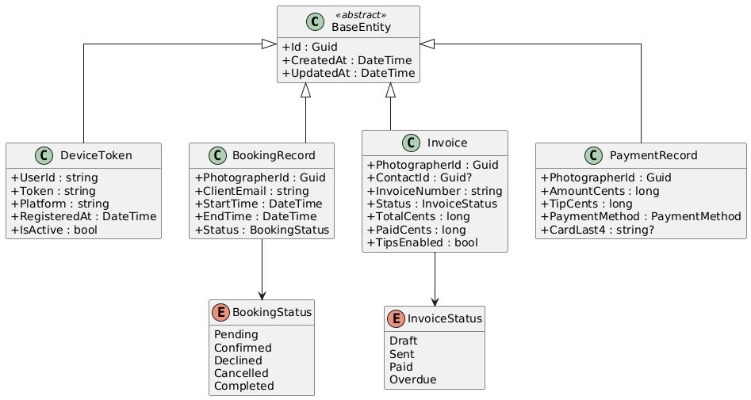

### Domain Layer - Communication & Document Entities

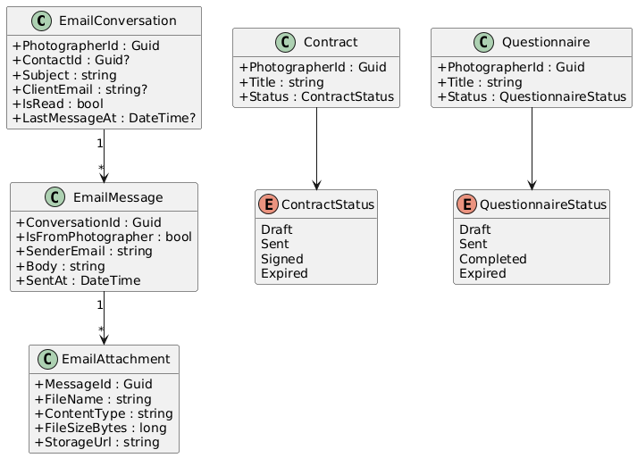

### Application Layer - Tap to Pay Commands

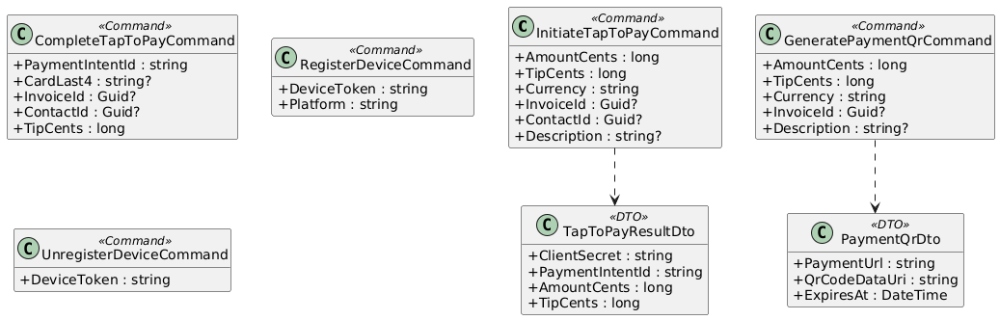

### Application Layer - Existing Queries Consumed by Mobile

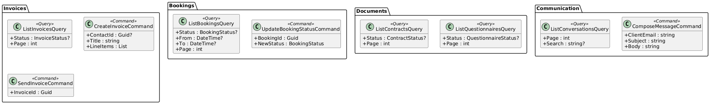

### Infrastructure & API Layer

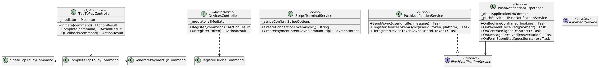

---

## Sequence Diagrams

### Tap to Pay - Successful Contactless Payment

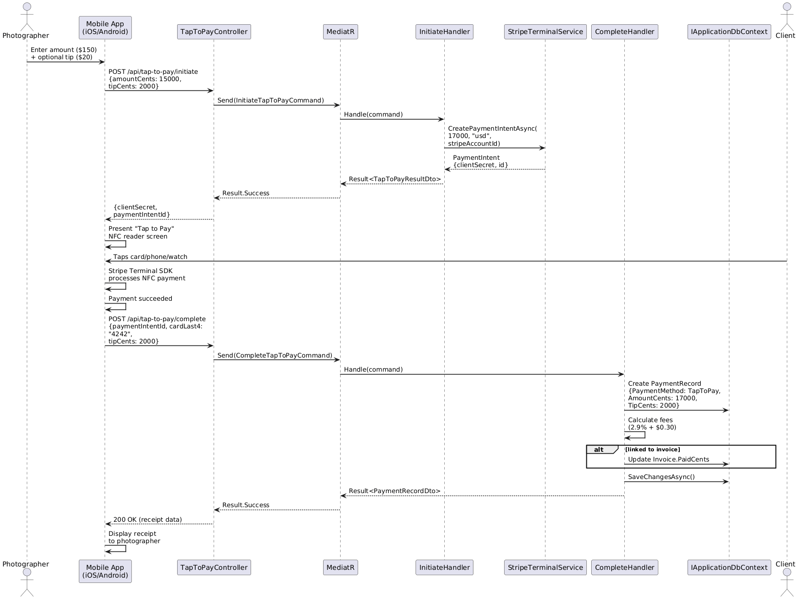

### Tap to Pay - QR Code Fallback

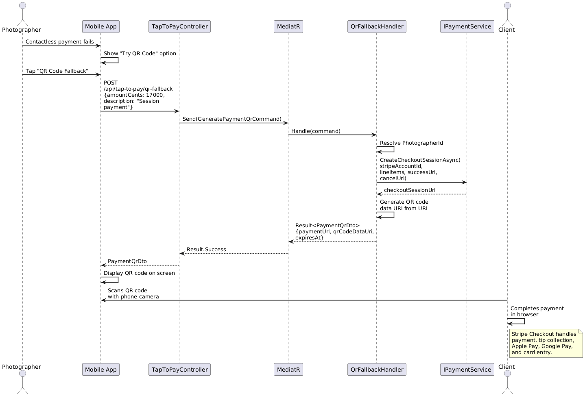

### Mobile Booking Management

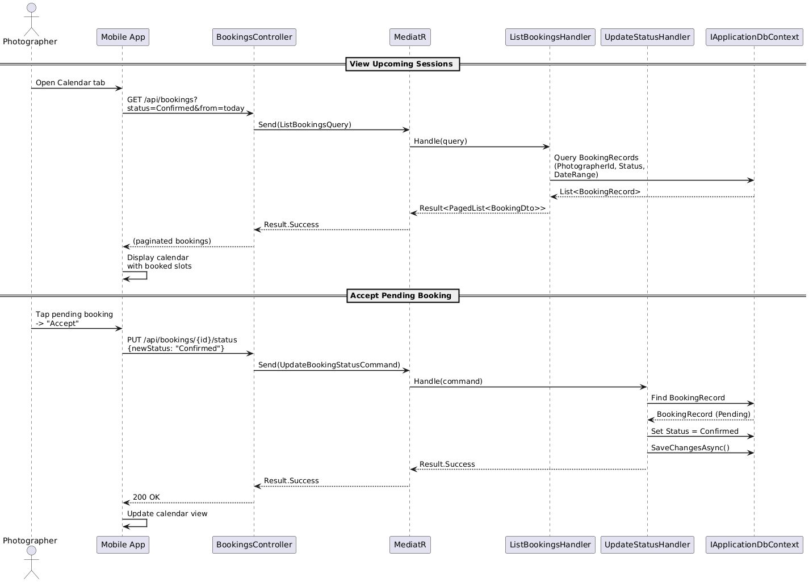

### Mobile Invoice Management

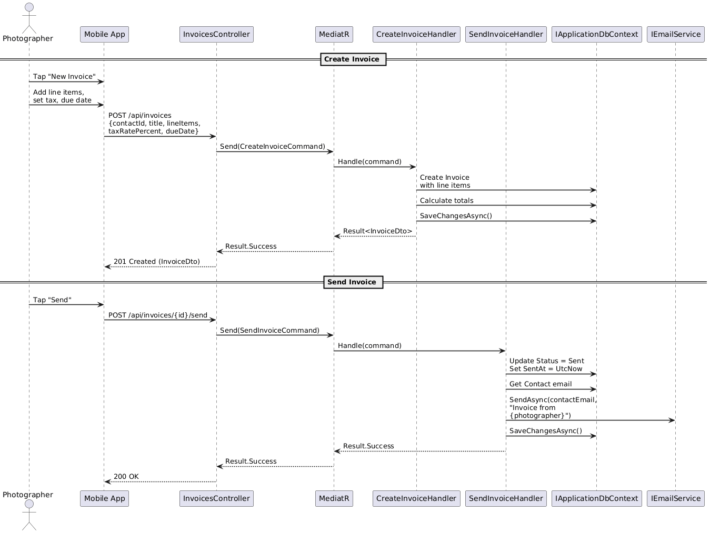

### Push Notification Registration and Delivery

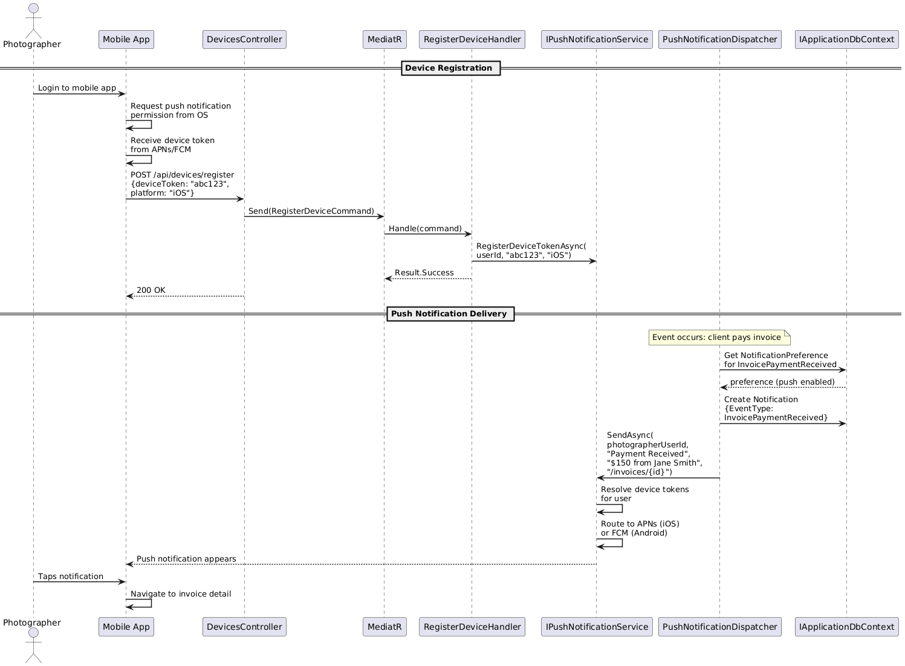

### Mobile Document Management

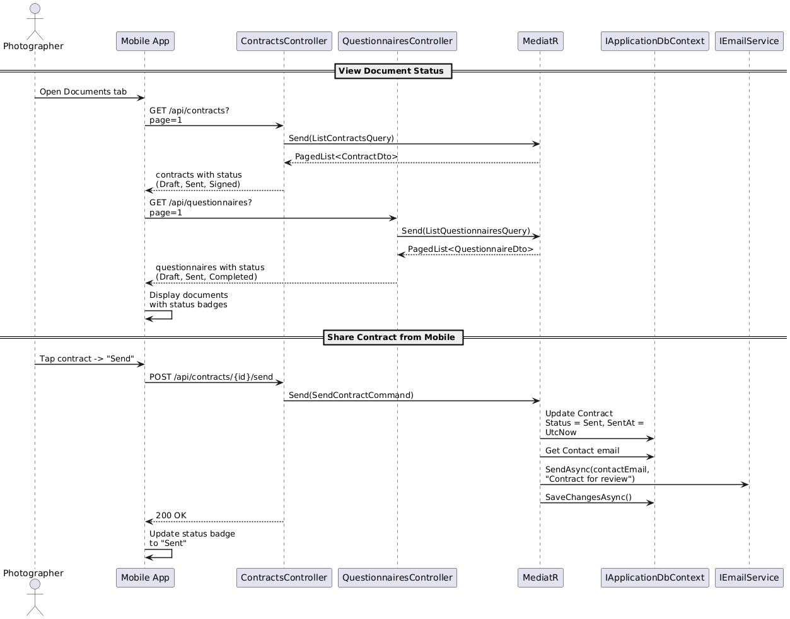
