# F36 - Mobile Gallery PWA

## Overview

Mobile Gallery PWA delivers a Progressive Web App experience for client photo delivery. Photographers create a curated, installable app from a collection of up to 200 images. The client receives a shareable link, opens it on any device, and is prompted to add the app to their home screen. Once installed, it behaves like a native app: custom icon (sourced from the client's favorite photo), offline support for previously loaded images via a service worker cache, and a branded shell with the photographer's cover, theme, layout, and contact info.

Beyond the gallery view, each PWA includes photographer contact details, social sharing buttons for individual images, and a configurable call-to-action button ("Book Again", "Refer a Friend", or custom). The app shell is rendered server-side on first load and then cached client-side, allowing the gallery to function offline for images already viewed. Plan limits govern the number of active PWAs: Free-tier photographers may maintain up to 3 apps, while paid plans allow unlimited apps. Paid plans also unlock the removal of "Powered by Anansi" branding from the app shell.

The technical implementation hinges on a `MobileGalleryApp` domain entity that captures the curated image set, branding configuration, and CTA settings. The API generates a dynamic `manifest.json` and service worker per app instance, while a dedicated controller serves the PWA shell and assets. Image delivery reuses the existing `IStorageService` and CDN pipeline from F03/F06.

**L2 Requirements:** MOB-6.2.1 (App Creation), MOB-6.2.2 (Client Installation), MOB-6.2.3 (App Features), MOB-6.2.4 (Plan Limits)

---

## Components

### Domain Layer

| Component | Type | Description |
|-----------|------|-------------|
| `MobileGalleryApp` | Entity | Represents a single PWA instance. Stores photographer ID, source collection ID, curated media IDs (up to 200), app icon media ID (client's favorite photo), cover/theme/layout/branding settings, CTA configuration, and publication status. Implements `ITenantEntity` and `ISoftDeletable`. |
| `MobileGalleryAppStatus` | Enum | `Draft`, `Published`, `Archived`. Controls whether the PWA link is publicly accessible. |
| `CtaButtonType` | Enum | `BookAgain`, `ReferAFriend`, `Custom`. Determines the call-to-action displayed in the app. |

### Application Layer

| Component | Type | Description |
|-----------|------|-------------|
| `CreateMobileGalleryAppCommand` | Command | Creates a new PWA from a collection. Validates curated image count (max 200), resolves the app icon from the client's favorite photo, enforces plan limits (Free = 3 apps), and persists the entity. |
| `UpdateMobileGalleryAppCommand` | Command | Updates cover, theme, layout, branding, CTA settings, or curated image list for an existing app. |
| `PublishMobileGalleryAppCommand` | Command | Transitions the app from Draft to Published. Generates the public shareable link and caches the service worker manifest. |
| `DeleteMobileGalleryAppCommand` | Command | Soft-deletes an app, freeing the slot against plan limits. |
| `ListMobileGalleryAppsQuery` | Query | Returns all PWAs for the authenticated photographer, with status filter and pagination. |
| `GetMobileGalleryAppQuery` | Query | Returns full details of a single PWA by ID (photographer-facing). |
| `GetPublicMobileGalleryQuery` | Query | Public (unauthenticated) query that returns the PWA shell data, manifest, curated images, and CTA config for client rendering. Checks publication status. |
| `MobileGalleryAppDto` | DTO | Read model for photographer-facing views (ID, title, status, image count, CTA, share link). |
| `PublicMobileGalleryDto` | DTO | Read model for client-facing PWA rendering (images, branding, contact info, CTA). |
| `IManifestService` | Interface | Generates `manifest.json` and service worker content per app instance. |

### Infrastructure Layer

| Component | Type | Description |
|-----------|------|-------------|
| `ManifestService` | Service | Implements `IManifestService`. Builds a W3C-compliant Web App Manifest with app name, icons (resized from favorite photo via `ICdnService`), theme color, background color, display mode, and start URL. Generates a service worker script that pre-caches the curated image list. |
| `MobileGalleryBackgroundJob` | BackgroundJob | After publish, pre-generates icon sizes (192x192, 512x512) from the favorite photo and warms the CDN cache for curated images. |

### API Layer

| Component | Type | Description |
|-----------|------|-------------|
| `MobileGalleryController` | Controller | Authenticated endpoints for CRUD on PWAs: `POST`, `PUT`, `DELETE`, `GET` (list), `GET /{id}`, `POST /{id}/publish`. |
| `PublicMobileGalleryController` | Controller | Unauthenticated endpoints for client-facing PWA delivery: `GET /m/{slug}` (HTML shell), `GET /m/{slug}/manifest.json`, `GET /m/{slug}/sw.js`, `GET /m/{slug}/images` (paginated image list). |

---

## Class Diagrams

### Domain Layer - Mobile Gallery Entities

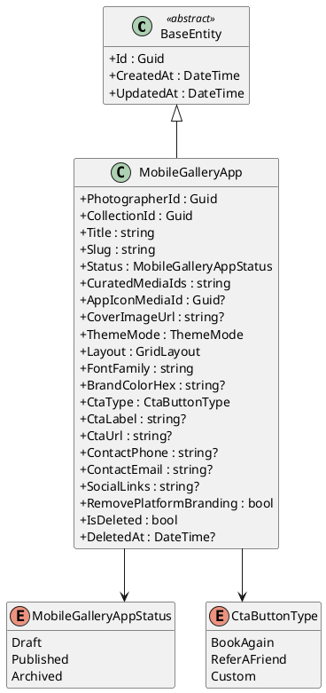

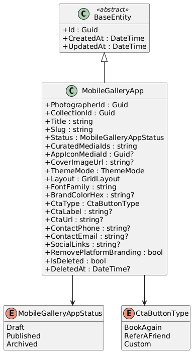

### Application Layer - Commands, Queries, and DTOs

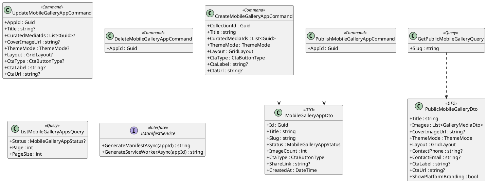

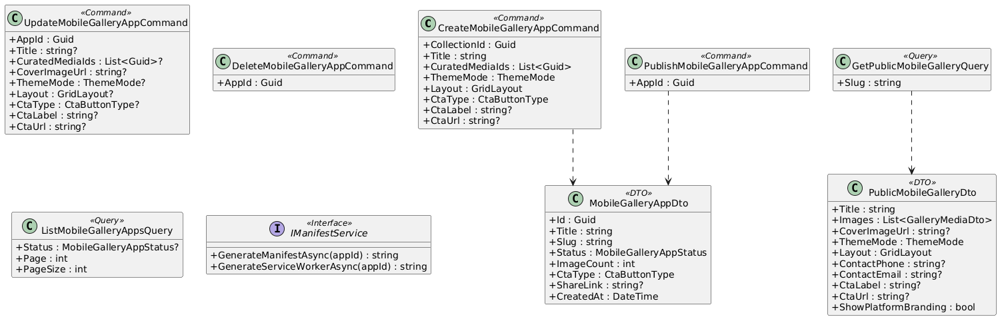

### Infrastructure & API Layer

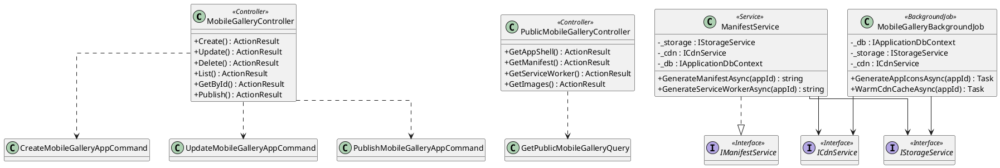

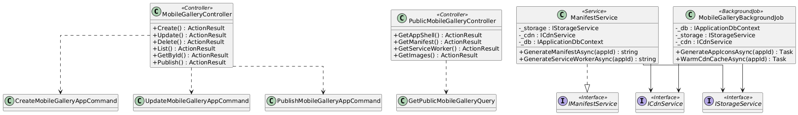

---

## Sequence Diagrams

### Create Mobile Gallery App

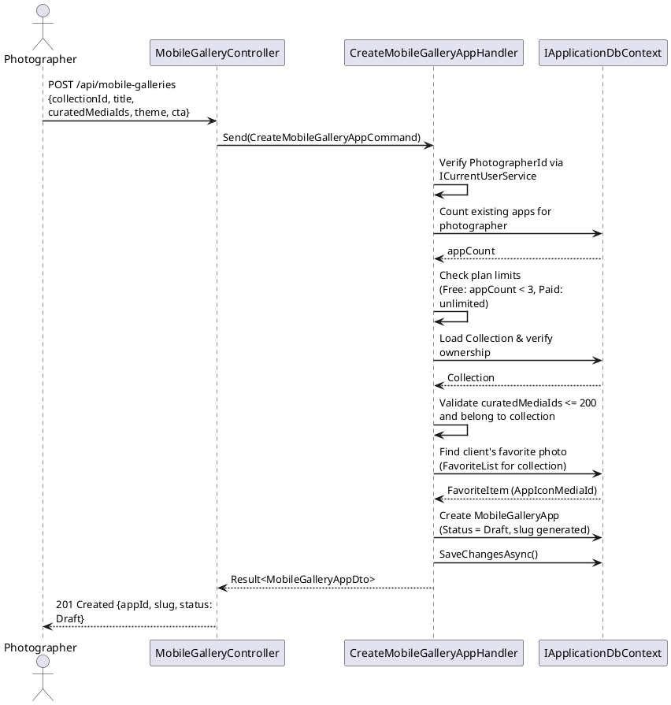

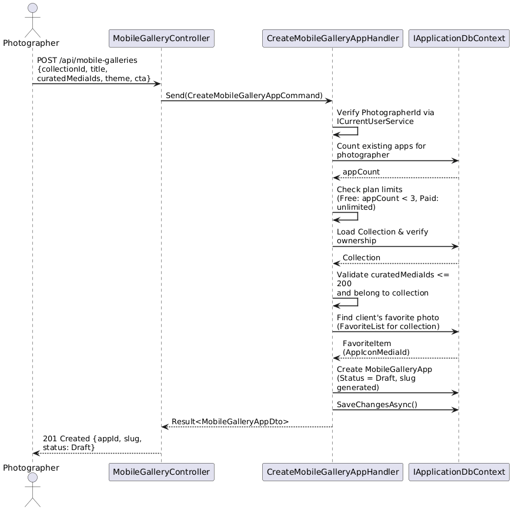

### Publish and Client Installation

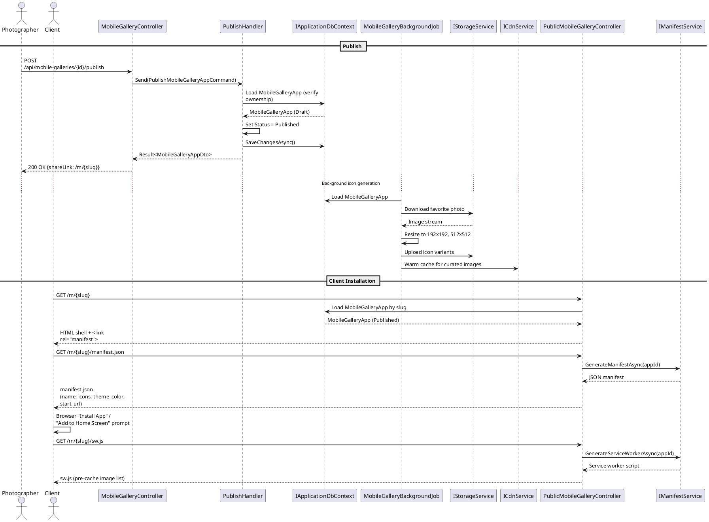

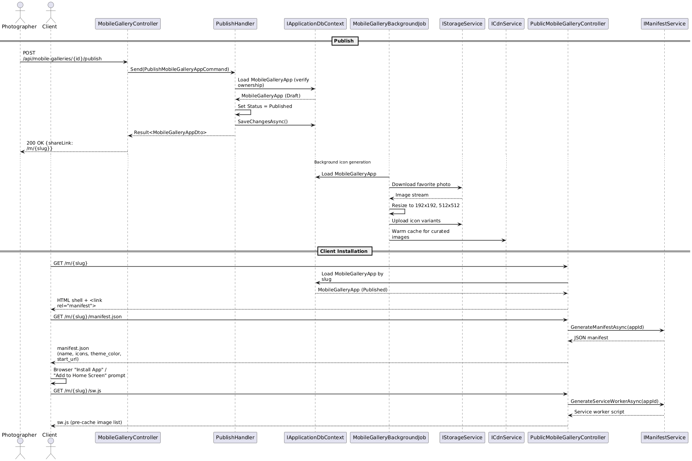

### Browse Gallery and Share Image

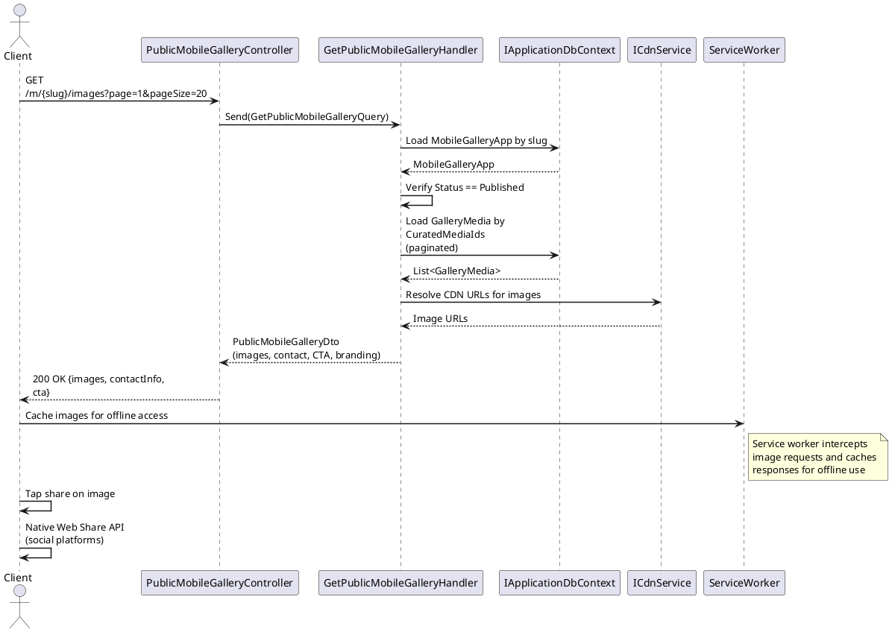

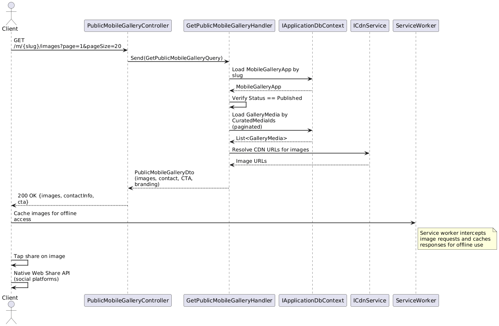

### Delete Mobile Gallery App

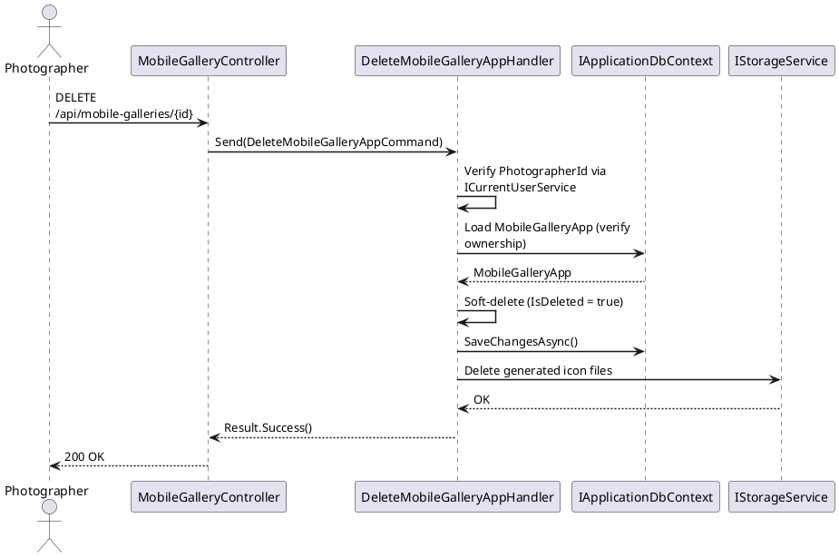

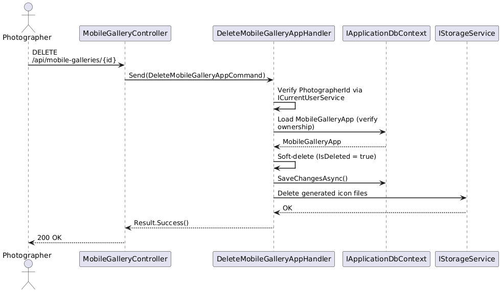
