# F37 - Branding & Identity

## Overview

Branding & Identity centralizes every visual asset and configuration that makes a photographer's client-facing presence feel uniquely theirs. It spans profile icons, logo uploads, auto-generated cover logos, custom favicons, platform branding removal, document-level branding (contracts, invoices, questionnaires), and a global font theme. All of these settings radiate outward: they are consumed by gallery rendering, website pages, booking sites, email templates, document PDF generation, and the mobile gallery PWA.

The profile icon serves as the photographer's avatar across the platform -- either a default generated avatar or an uploaded image. The logo (PNG, transparent background, up to 5 MB) is the primary brand mark and appears in gallery headers, the website header, booking site, document headers, and email invitations. From the uploaded logo, the system auto-generates a white-on-transparent variant for overlaying on collection cover photos. Paid-plan photographers can upload a custom favicon that replaces the default Anansi icon in browser tabs, and can remove all "Powered by Anansi" badges from galleries, website, booking site, documents, and mobile gallery apps.

Document branding allows per-document-type customization: contracts, invoices, and questionnaires each get their own header image and brand color (hex code entry). The font theme is a single selection that propagates to the booking site, contracts, invoices, questionnaires, and email communications, ensuring visual consistency. All branding fields live on the existing `Photographer` entity and the `DocumentBranding` entity, with CQRS commands and queries exposing a unified "branding profile" surface.

**L2 Requirements:** BRD-7.1.1 (Profile Icon), BRD-7.1.2 (Logo Upload), BRD-7.1.3 (Collection Cover Logo), BRD-7.1.4 (Custom Favicon), BRD-7.1.5 (Platform Branding Removal), BRD-7.4.1 (Document Branding), BRD-7.4.2 (Font Theme)

---

## Components

### Domain Layer

| Component | Type | Description |
|-----------|------|-------------|
| `Photographer` | Entity (existing) | Extended with branding properties: `ProfileIconUrl`, `LogoUrl`, `FaviconUrl`, `BrandColorHex`, `FontTheme`. These already exist on the entity and serve as the single source of truth for studio-wide branding. |
| `DocumentBranding` | Entity (existing) | Per-document-type branding overrides: `DocumentType` (Contract, Invoice, Questionnaire), `HeaderImageUrl`, `BrandColorHex`, `SecondaryColorHex`, `FontTheme`. Implements `ITenantEntity`. |
| `DocumentType` | Enum (existing) | `Contract`, `Invoice`, `Questionnaire`. |

### Application Layer

| Component | Type | Description |
|-----------|------|-------------|
| `GetBrandingProfileQuery` | Query (existing) | Returns the complete branding profile: profile icon, logo, auto-generated cover logo URL, favicon, brand color, font theme, and whether platform branding is removed (derived from plan tier). |
| `UpdateBrandingProfileCommand` | Command (existing) | Updates profile icon URL, logo URL, favicon URL, brand color hex, and font theme on the `Photographer` entity. Validates hex color format. |
| `UploadLogoCommand` | Command | Accepts a file stream, validates PNG format and 5 MB size limit, uploads to storage via `IStorageService`, generates the white cover variant via `IImageProcessingService`, and updates `Photographer.LogoUrl`. |
| `UploadFaviconCommand` | Command | Accepts a file stream, validates ICO/PNG format, checks paid plan via `IPlanService`, uploads to storage, and updates `Photographer.FaviconUrl`. |
| `UploadProfileIconCommand` | Command | Accepts a file stream, uploads to storage, and updates `Photographer.ProfileIconUrl`. |
| `GetDocumentBrandingQuery` | Query | Returns all `DocumentBranding` records for the photographer, one per document type. |
| `UpsertDocumentBrandingCommand` | Command | Creates or updates the `DocumentBranding` for a specific `DocumentType`. Validates hex color format and header image URL. |
| `BrandingProfileDto` | DTO (existing) | Read model: photographer ID, profile icon, logo, cover logo, favicon, brand color, font theme, platform branding removed flag. |
| `DocumentBrandingDto` | DTO (existing) | Read model: ID, document type, header image URL, brand color hex, secondary color hex, font theme. |
| `IImageProcessingService` | Interface | Converts an uploaded logo to a white-on-transparent variant for cover overlays. |
| `IPlanService` | Interface | Checks whether the photographer's active plan includes a given feature (e.g., custom favicon, branding removal). |

### Infrastructure Layer

| Component | Type | Description |
|-----------|------|-------------|
| `ImageProcessingService` | Service | Implements `IImageProcessingService`. Uses ImageSharp to convert a color logo PNG to a white silhouette version, preserving alpha channel. Uploads the result to storage and returns the URL. |
| `PlanService` | Service | Implements `IPlanService`. Queries `Plans` and `PlanFeatureGates` to determine feature access. |
| `CoverLogoGenerationJob` | BackgroundJob | Triggered when a logo is uploaded. Generates the white cover variant asynchronously if the synchronous path times out. |

### API Layer

| Component | Type | Description |
|-----------|------|-------------|
| `BrandingController` | Controller | Endpoints: `GET /api/branding` (profile), `PUT /api/branding` (update profile), `POST /api/branding/logo` (upload logo), `POST /api/branding/favicon` (upload favicon), `POST /api/branding/profile-icon` (upload icon), `GET /api/branding/documents` (list document branding), `PUT /api/branding/documents/{type}` (upsert document branding). All require `[Authorize]`. |

---

## Class Diagrams

### Domain Layer - Branding Entities

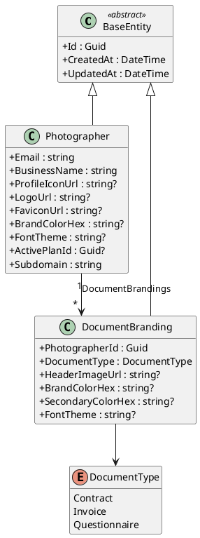

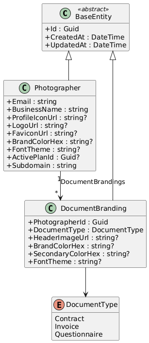

### Application Layer - Commands, Queries, and Services

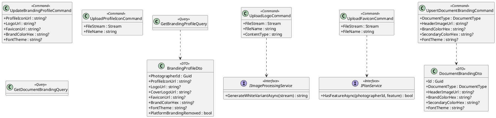

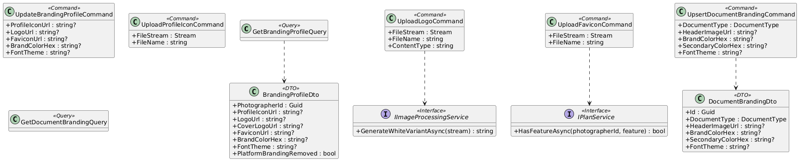

### Infrastructure & API Layer

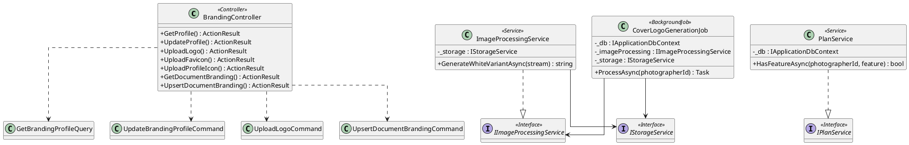

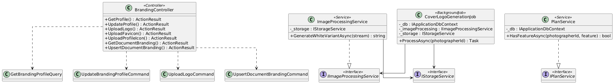

---

## Sequence Diagrams

### Upload Logo with Cover Logo Generation

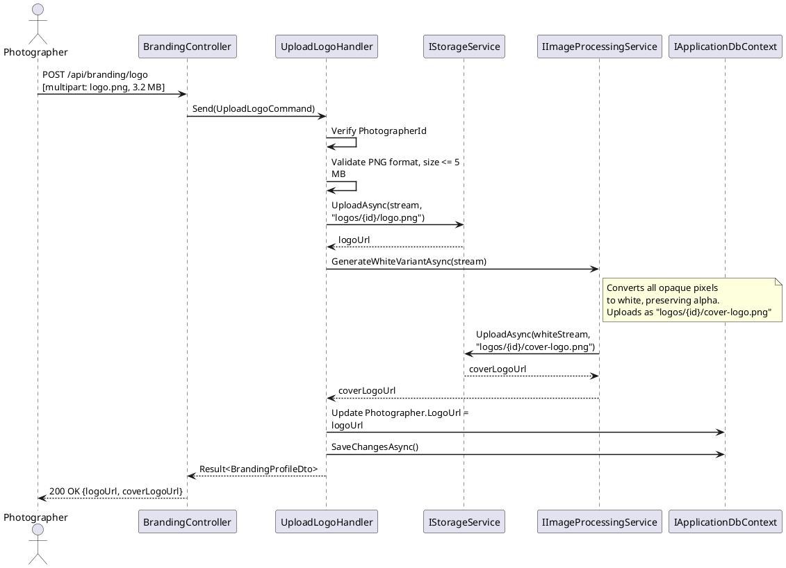

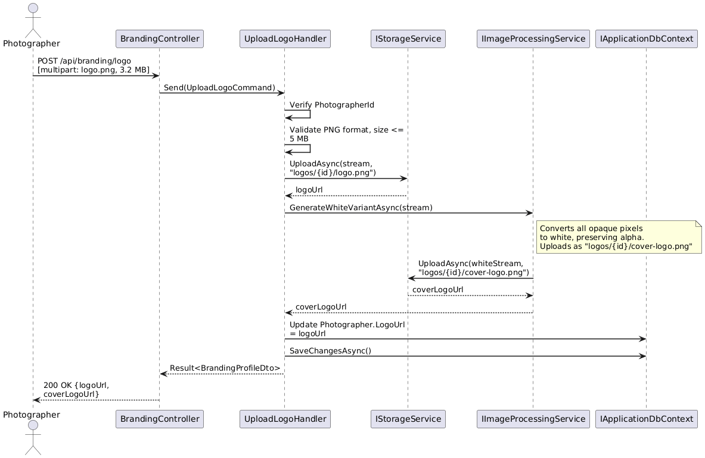

### Get Branding Profile

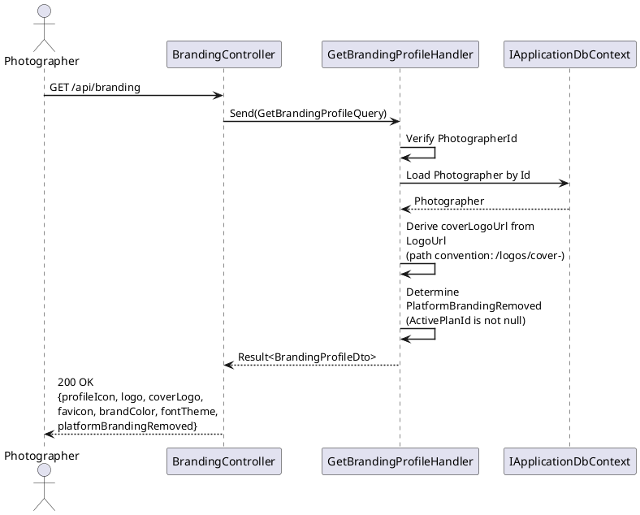

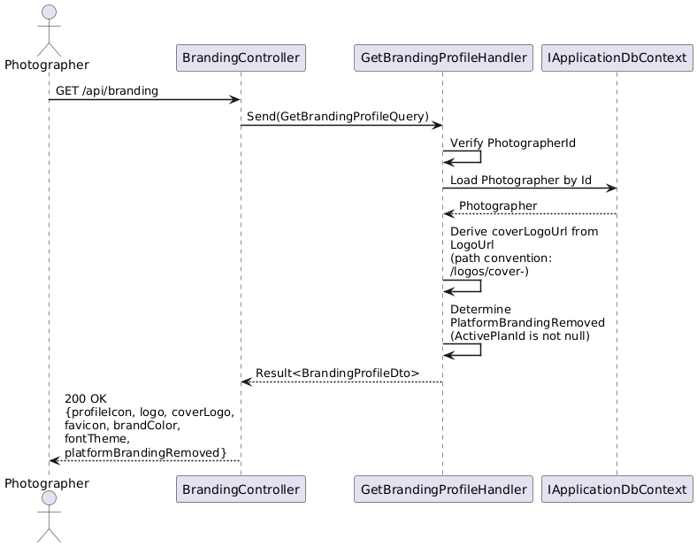

### Upload Custom Favicon (Paid Plan Gate)

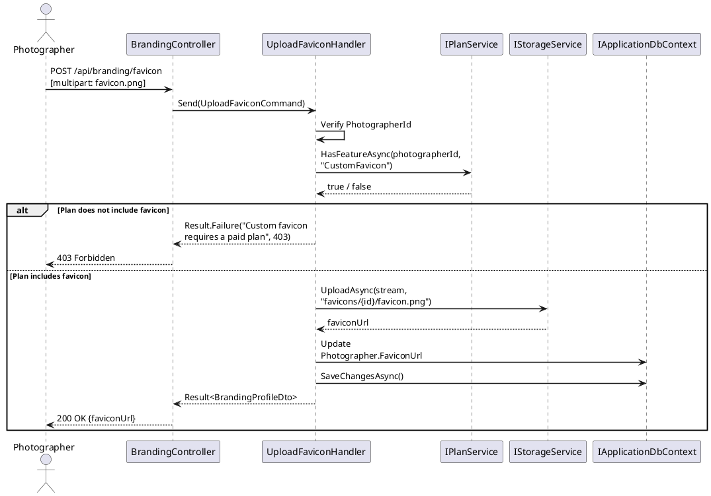

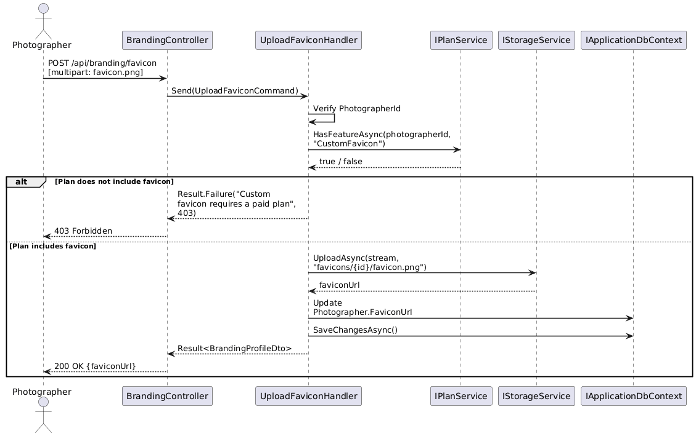

### Upsert Document Branding

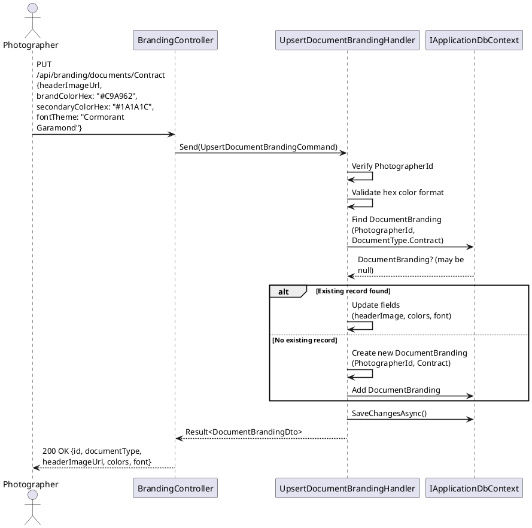

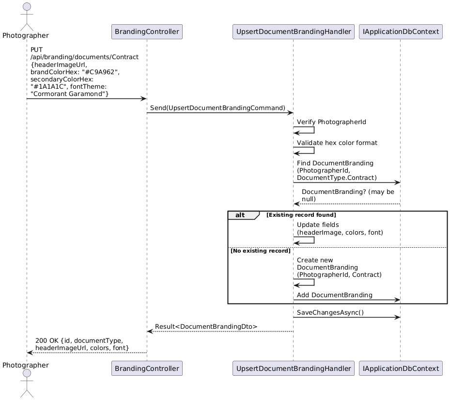

### Platform Branding Check (Consumed by Gallery Rendering)

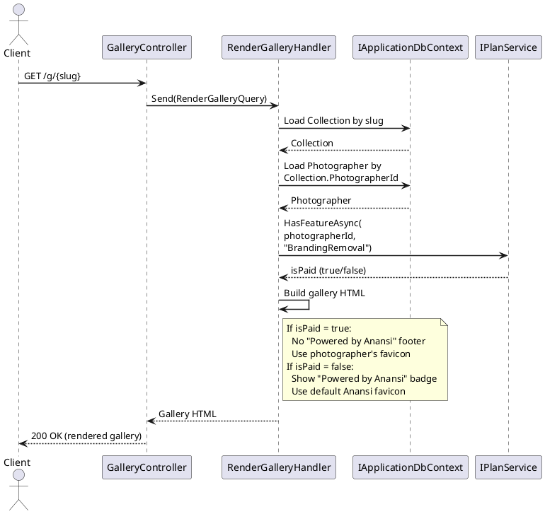

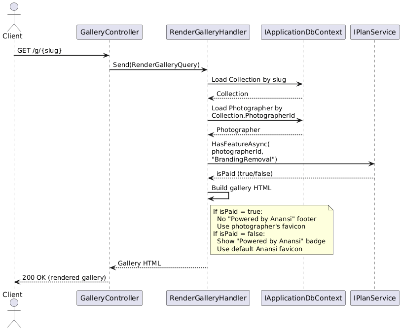
