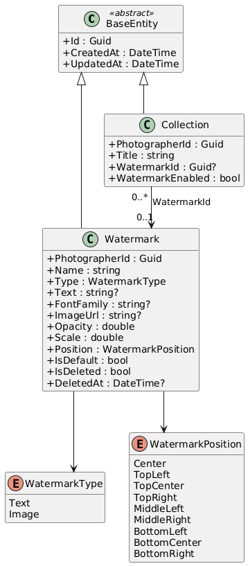
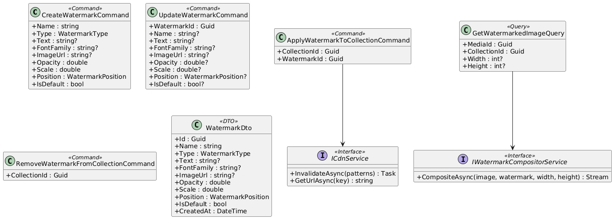
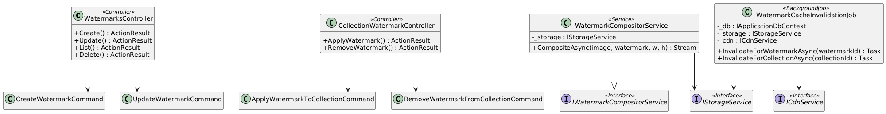
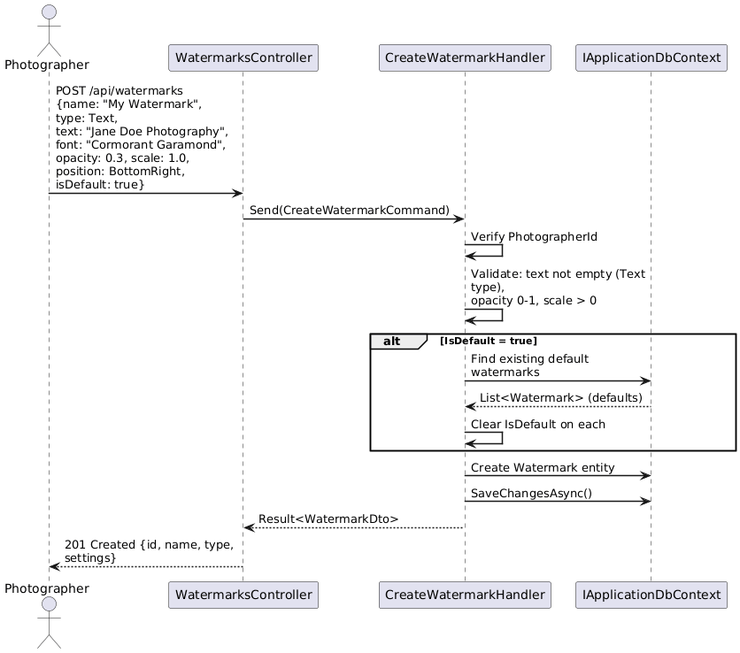
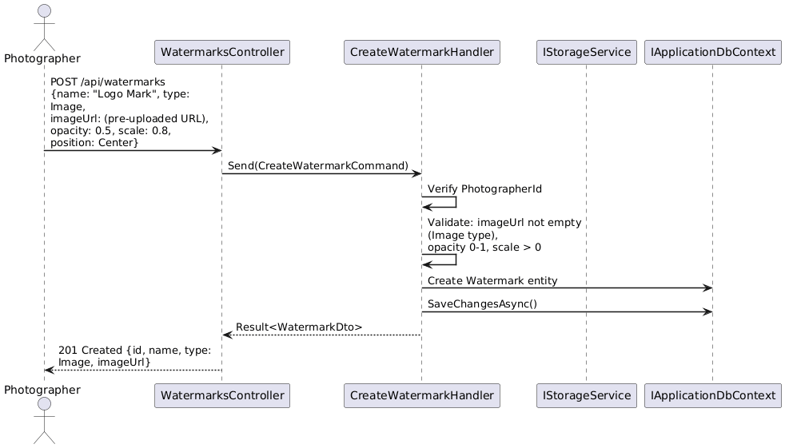
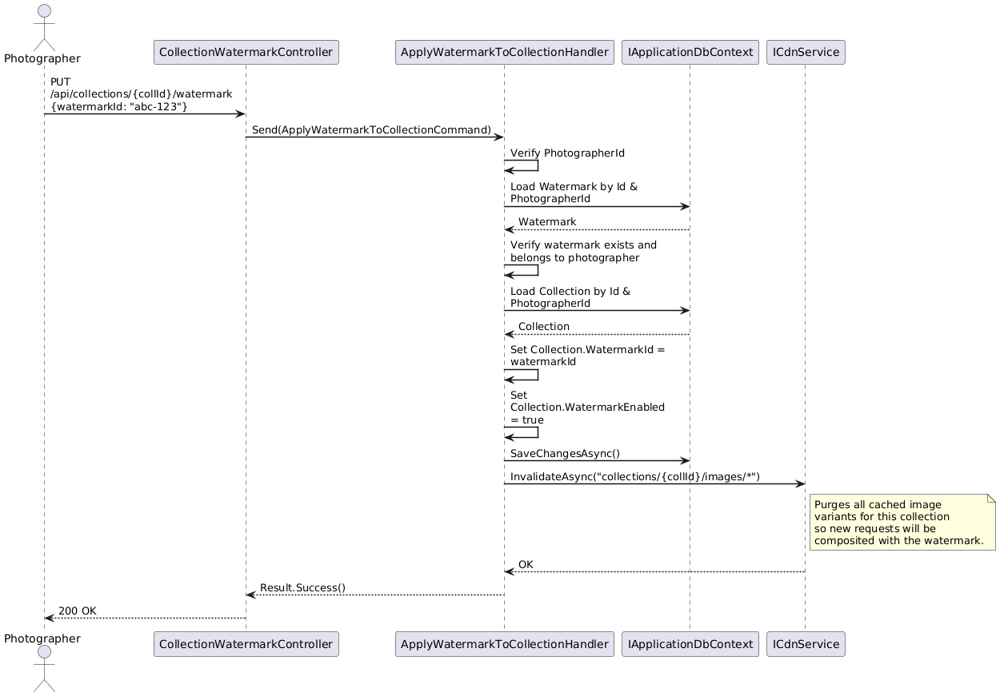
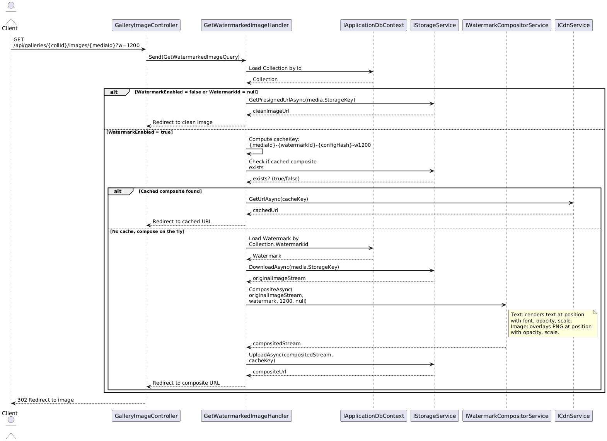
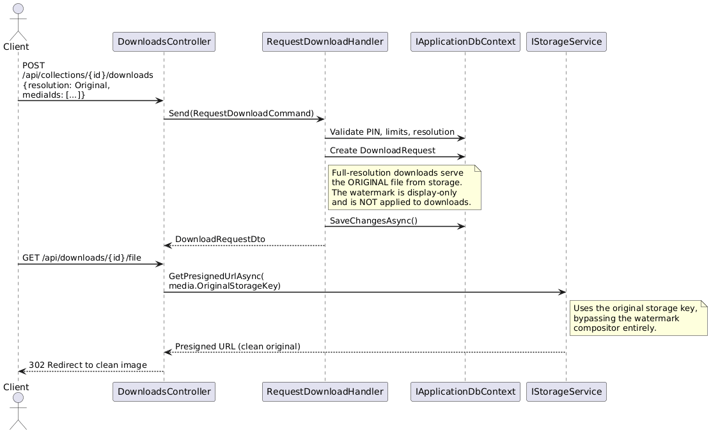
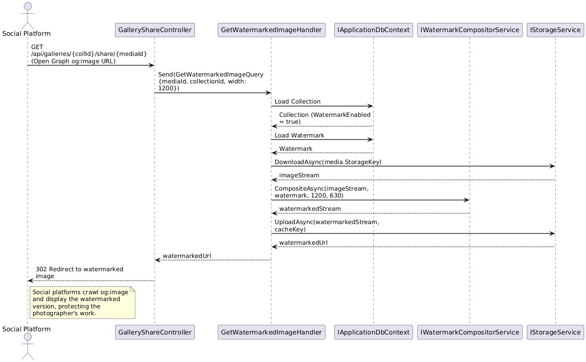

# F38 - Watermarking

## Overview

Watermarking protects photographers' images displayed in client galleries by overlaying either text or image-based watermarks. Text watermarks support configurable content, font, opacity, scale, and position. Image watermarks accept an uploaded transparent PNG (typically a logo) with the same opacity, scale, and position controls. Photographers create named watermark presets, designate one as the default, and then toggle watermarking on or off per collection.

A critical design constraint is that watermarks are display-only: they are rendered server-side as an overlay composited onto the image at request time (or pre-composited and cached), but the original full-resolution files stored in blob storage remain untouched. When a client downloads the full-resolution image through the F06 download flow, the watermark is not applied. However, watermarks must be visible when images are shared to social media (via Open Graph / Twitter Card meta images), so the share-preview pipeline must serve watermarked variants.

Server-side watermark rendering uses a compositing pipeline in Infrastructure. When a gallery image is requested for display, the system checks whether the collection has watermarking enabled and which watermark preset is assigned. If active, the image is composited with the watermark overlay, cached on the CDN, and served. The cache key includes the watermark configuration hash so that changes to watermark settings automatically invalidate stale composites. This approach avoids client-side CSS overlays (which are trivially bypassed) and avoids permanently burning watermarks into source files.

**L2 Requirements:** BRD-7.2.1 (Text Watermarks), BRD-7.2.2 (Image Watermarks), BRD-7.2.3 (Per-Gallery Application)

---

## Components

### Domain Layer

| Component | Type | Description |
|-----------|------|-------------|
| `Watermark` | Entity (existing) | Stores watermark presets: `Name`, `Type` (Text/Image), text content, font, image URL, `Opacity`, `Scale`, `Position`, `IsDefault`. Implements `ITenantEntity` and `ISoftDeletable`. |
| `WatermarkType` | Enum (existing) | `Text`, `Image`. |
| `WatermarkPosition` | Enum (existing) | `Center`, `TopLeft`, `TopCenter`, `TopRight`, `MiddleLeft`, `MiddleRight`, `BottomLeft`, `BottomCenter`, `BottomRight`. |
| `Collection` | Entity (existing) | Extended with `WatermarkId` (nullable Guid) and `WatermarkEnabled` (bool) to associate a watermark preset with a collection and toggle it. |

### Application Layer

| Component | Type | Description |
|-----------|------|-------------|
| `CreateWatermarkCommand` | Command (existing) | Creates a named watermark preset. Validates required fields based on type (text content for Text, image URL for Image). Enforces opacity 0-1 range and positive scale. If `IsDefault`, clears other defaults. |
| `UpdateWatermarkCommand` | Command (existing) | Partially updates an existing watermark preset. Same validation rules. |
| `ListWatermarksQuery` | Query (existing) | Returns all watermarks for the photographer, ordered by default-first then name. |
| `DeleteWatermarkCommand` | Command (existing) | Soft-deletes a watermark. Collections referencing it retain the `WatermarkId` but watermarking becomes a no-op until reassigned. |
| `ApplyWatermarkToCollectionCommand` | Command | Sets `Collection.WatermarkId` and `Collection.WatermarkEnabled = true` for a given collection. Validates the watermark belongs to the same photographer. Invalidates CDN cache for that collection's images. |
| `RemoveWatermarkFromCollectionCommand` | Command | Sets `Collection.WatermarkEnabled = false` for a given collection. Invalidates CDN cache. |
| `GetWatermarkedImageQuery` | Query | Given a media ID and collection ID, resolves the watermark config, composites the overlay via `IWatermarkCompositorService`, and returns the composited image stream or a CDN URL. Used by gallery rendering and social share preview generation. |
| `WatermarkDto` | DTO (existing) | Read model: ID, name, type, text, font, image URL, opacity, scale, position, is default, created at. |
| `IWatermarkCompositorService` | Interface | Composites a watermark overlay onto an image. Accepts the source image stream, watermark configuration, and target dimensions. Returns a composited image stream. |
| `ICdnService` | Interface (existing) | Manages CDN cache invalidation and URL generation. |

### Infrastructure Layer

| Component | Type | Description |
|-----------|------|-------------|
| `WatermarkCompositorService` | Service | Implements `IWatermarkCompositorService`. Uses ImageSharp to overlay text (with font rendering) or image watermarks at the configured position, opacity, and scale. Caches the composited result in blob storage with a key derived from `{mediaId}-{watermarkConfigHash}`. |
| `WatermarkCacheInvalidationJob` | BackgroundJob | When a watermark preset is updated or a collection's watermark assignment changes, this job purges all cached composites for the affected collection's media from both blob storage and CDN edge caches. |

### API Layer

| Component | Type | Description |
|-----------|------|-------------|
| `WatermarksController` | Controller | CRUD endpoints for watermark presets: `POST`, `PUT /{id}`, `GET` (list), `DELETE /{id}`. All require `[Authorize]`. |
| `CollectionWatermarkController` | Controller | Endpoints for per-collection watermark management: `PUT /api/collections/{id}/watermark` (apply), `DELETE /api/collections/{id}/watermark` (remove). |
| `GalleryImageController` | Controller (existing, extended) | The image-serving endpoint checks watermark configuration and returns the composited image for display, or the clean original for authorized full-resolution downloads. |

---

## Class Diagrams

### Domain Layer - Watermark Entities

### Application Layer - Commands, Queries, and Services

### Infrastructure & API Layer

---

## Sequence Diagrams

### Create Text Watermark

### Create Image Watermark (Logo Upload)

### Apply Watermark to Collection

### Serve Watermarked Image (Gallery Display)

### Download Full-Res (No Watermark)

### Social Share with Watermark

