# F39 - Custom Domains

## Overview

Custom Domains allows photographers on paid plans to serve their galleries and websites from their own domain names instead of the default `username.anansi.com` platform subdomain. Gallery custom domains use a CNAME-based subdomain pattern (e.g., `gallery.yourdomain.com`), while website custom domains support both apex domains (`yourdomain.com`) and subdomains (`www.yourdomain.com`). Every custom domain receives auto-provisioned SSL via Let's Encrypt or a managed certificate provider, ensuring HTTPS is available without manual intervention.

The connection workflow follows a three-phase process: registration, DNS verification, and SSL provisioning. When a photographer registers a custom domain, the system generates a unique verification token and returns step-by-step DNS configuration instructions (CNAME and TXT records). The photographer configures their DNS provider, then triggers a verification check. Once the TXT record is confirmed, the domain is marked as verified and SSL provisioning begins automatically. The system periodically monitors certificate expiry and renews certificates before they lapse.

All users receive a free platform subdomain (`username.anansi.com`) that routes to their primary gallery or website. This subdomain is provisioned at account creation and cannot be removed. Custom domains are additive -- they do not replace the platform subdomain but provide a branded alternative. The `CustomDomain` entity and its CQRS commands already exist in the codebase; this design document describes their full behavior, the DNS verification infrastructure, SSL lifecycle management, and the routing middleware that directs incoming requests to the correct photographer's content.

**L2 Requirements:** BRD-7.3.1 (Gallery Custom Domain), BRD-7.3.2 (Website Custom Domain)

---

## Components

### Domain Layer

| Component | Type | Description |
|-----------|------|-------------|
| `CustomDomain` | Entity (existing) | Stores `DomainName`, `Purpose` (Gallery/Website), `IsVerified`, `SslStatus`, `SslCertificateId`, `SslExpiresAt`, `DnsInstructions`, `VerificationToken`, `VerifiedAt`. Implements `ITenantEntity`. |
| `DomainPurpose` | Enum (existing) | `Gallery`, `Website`. Determines routing behavior and DNS instruction template. |
| `SslStatus` | Enum (existing) | `Pending`, `Active`, `Expired`, `Failed`. Tracks the lifecycle of the SSL certificate. |
| `Photographer` | Entity (existing) | Contains `Subdomain` (the free `username.anansi.com` slug), `CustomGalleryDomain`, and `CustomWebsiteDomain` (quick-lookup fields updated when a domain is verified). |

### Application Layer

| Component | Type | Description |
|-----------|------|-------------|
| `CreateCustomDomainCommand` | Command (existing) | Registers a new custom domain. Validates domain format (regex), checks for global uniqueness, generates verification token, generates DNS instructions, and persists the entity. Plan-gated: rejects if the photographer's plan does not include custom domains. |
| `VerifyCustomDomainCommand` | Command (existing) | Triggers DNS verification for a registered domain. Calls `IDnsVerificationService` to check the TXT record matches the verification token. On success, marks `IsVerified = true` and initiates SSL provisioning via `ISslProvisioningService`. |
| `ListCustomDomainsQuery` | Query (existing) | Returns all custom domains for the photographer, ordered by creation date. |
| `DeleteCustomDomainCommand` | Command (existing) | Removes a custom domain and its SSL certificate. Updates the photographer's quick-lookup domain fields to null. |
| `CheckDomainDnsCommand` | Command | Performs a live DNS lookup without marking the domain as verified. Returns current CNAME and TXT records so the photographer can diagnose configuration issues. |
| `RenewSslCertificateCommand` | Command | Triggered by a scheduled job when a certificate is within 30 days of expiry. Calls `ISslProvisioningService` to renew and updates `SslExpiresAt`. |
| `GetSubdomainAvailabilityQuery` | Query | Checks whether a desired platform subdomain (`username.anansi.com`) is available. Used during registration and account settings. |
| `CustomDomainDto` | DTO (existing) | Read model: ID, domain name, purpose, is verified, SSL status, SSL expiry, DNS instructions, verified at, created at. |
| `DnsCheckResultDto` | DTO | Read model for DNS diagnostic: domain name, CNAME target found, TXT records found, verification match status. |
| `IDnsVerificationService` | Interface | Performs DNS lookups (CNAME, TXT) against public DNS resolvers. Returns structured results. |
| `ISslProvisioningService` | Interface | Provisions and renews SSL certificates for verified custom domains. Abstracts the certificate authority integration. |

### Infrastructure Layer

| Component | Type | Description |
|-----------|------|-------------|
| `DnsVerificationService` | Service | Implements `IDnsVerificationService`. Queries public DNS resolvers (e.g., Google 8.8.8.8, Cloudflare 1.1.1.1) for CNAME and TXT records. Compares TXT record values against the stored verification token. |
| `SslProvisioningService` | Service | Implements `ISslProvisioningService`. Integrates with Let's Encrypt (ACME protocol) or a managed provider (e.g., Azure Front Door, Cloudflare) to issue and renew certificates. Stores certificate identifiers on the `CustomDomain` entity. |
| `SslRenewalBackgroundJob` | BackgroundJob | Runs daily. Queries all `CustomDomain` records where `SslStatus = Active` and `SslExpiresAt` is within 30 days. Dispatches `RenewSslCertificateCommand` for each. |
| `DomainRoutingMiddleware` | Middleware | Inspects the `Host` header on incoming requests. Maps custom domains to photographer IDs by querying a cached lookup table of verified `CustomDomain` records. Sets the tenant context (`PhotographerId`) for downstream handlers. Falls back to platform subdomain resolution for `*.anansi.com` requests. |

### API Layer

| Component | Type | Description |
|-----------|------|-------------|
| `CustomDomainsController` | Controller | Endpoints: `POST /api/domains` (create), `POST /api/domains/{id}/verify` (verify), `POST /api/domains/{id}/dns-check` (diagnostic), `GET /api/domains` (list), `DELETE /api/domains/{id}` (remove). All require `[Authorize]`. |
| `SubdomainController` | Controller | Endpoints: `GET /api/subdomain/availability?name={slug}` (check availability), `PUT /api/subdomain` (change subdomain on account settings). |

---

## Class Diagrams

### Domain Layer - Custom Domain Entities

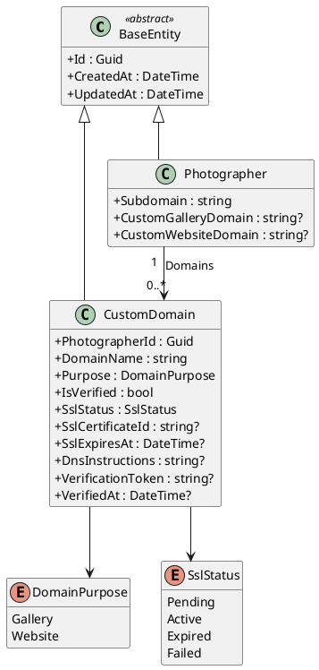

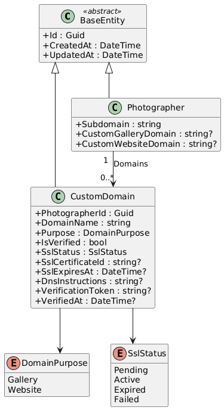

### Application Layer - Commands, Queries, and Services

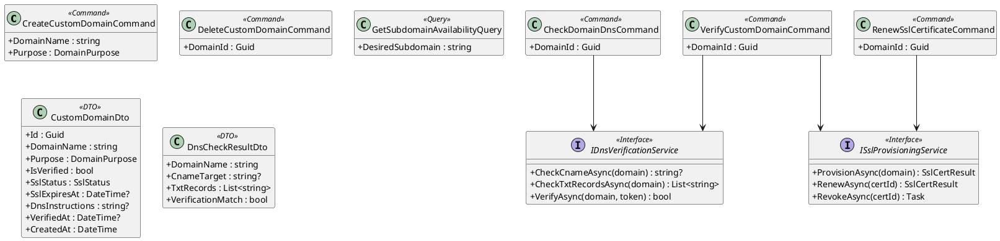

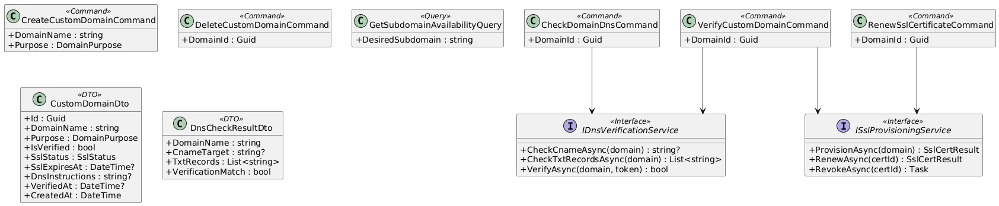

### Infrastructure & API Layer

```plantuml
@startuml
skinparam classAttributeIconSize 0
skinparam linetype ortho
hide empty methods

class CustomDomainsController <<Controller>> {
  +Create() : ActionResult
  +Verify() : ActionResult
  +DnsCheck() : ActionResult
  +List() : ActionResult
  +Delete() : ActionResult
}

class SubdomainController <<Controller>> {
  +CheckAvailability() : ActionResult
  +ChangeSubdomain() : ActionResult
}

class DnsVerificationService <<Service>> {
  +CheckCnameAsync(domain) : string?
  +CheckTxtRecordsAsync(domain) : List<string>
  +VerifyAsync(domain, token) : bool
}

class SslProvisioningService <<Service>> {
  +ProvisionAsync(domain) : SslCertResult
  +RenewAsync(certId) : SslCertResult
  +RevokeAsync(certId) : Task
}

class SslRenewalBackgroundJob <<BackgroundJob>> {
  -_db : IApplicationDbContext
  -_mediator : IMediator
  +RunAsync() : Task
}

class DomainRoutingMiddleware <<Middleware>> {
  -_domainCache : IConcurrentDictionary
  -_db : IApplicationDbContext
  +InvokeAsync(HttpContext) : Task
}

interface IDnsVerificationService <<Interface>>
interface ISslProvisioningService <<Interface>>

DnsVerificationService ..|> IDnsVerificationService
SslProvisioningService ..|> ISslProvisioningService
SslRenewalBackgroundJob --> ISslProvisioningService
DomainRoutingMiddleware --> IApplicationDbContext

CustomDomainsController ..> CreateCustomDomainCommand
CustomDomainsController ..> VerifyCustomDomainCommand
CustomDomainsController ..> CheckDomainDnsCommand

@enduml
```

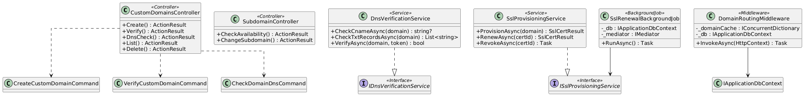

---

## Sequence Diagrams

### Register Custom Domain

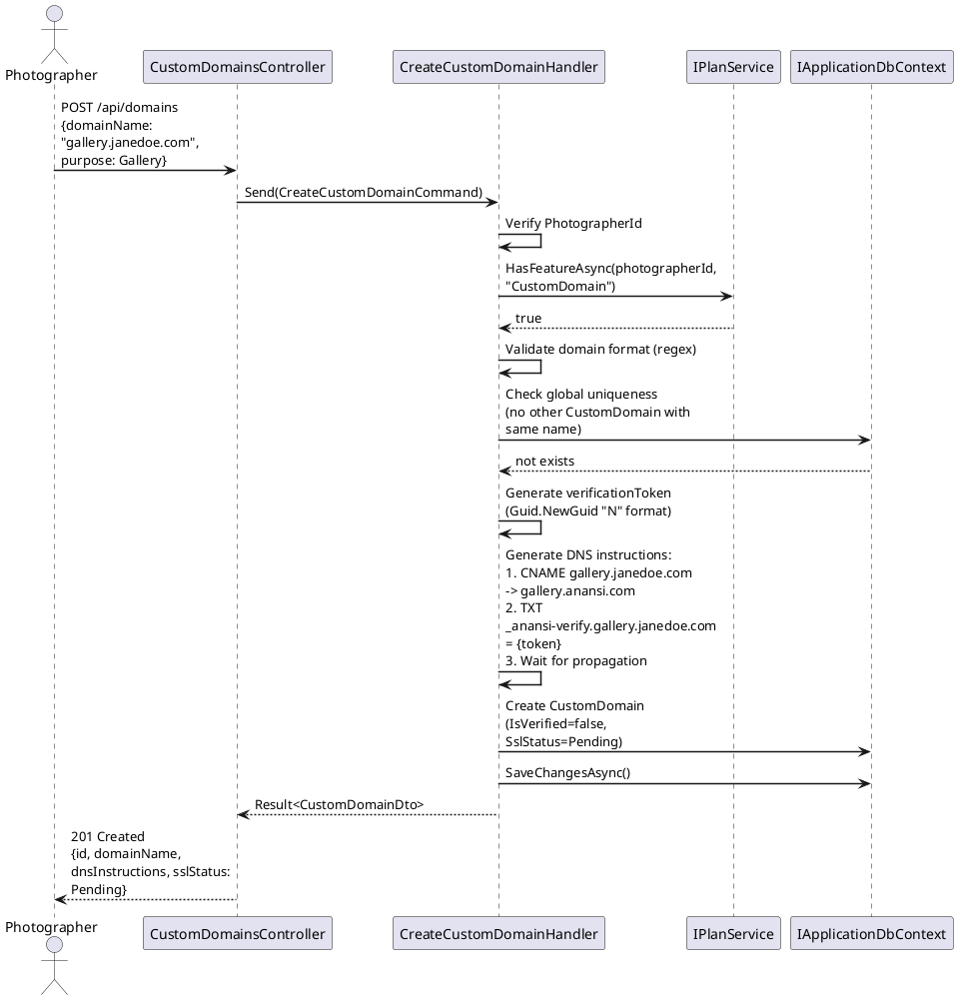

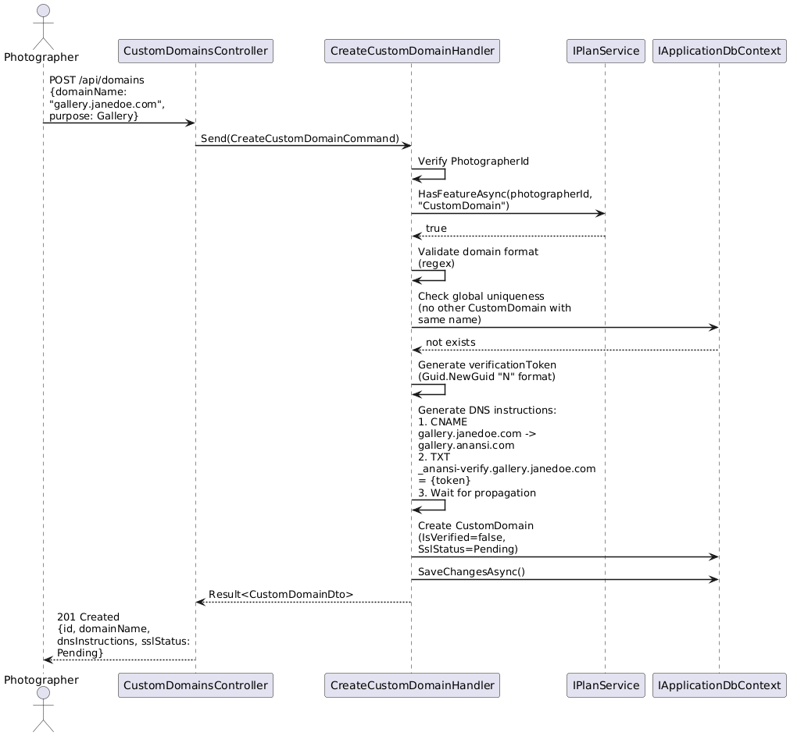

### Verify Domain and Provision SSL

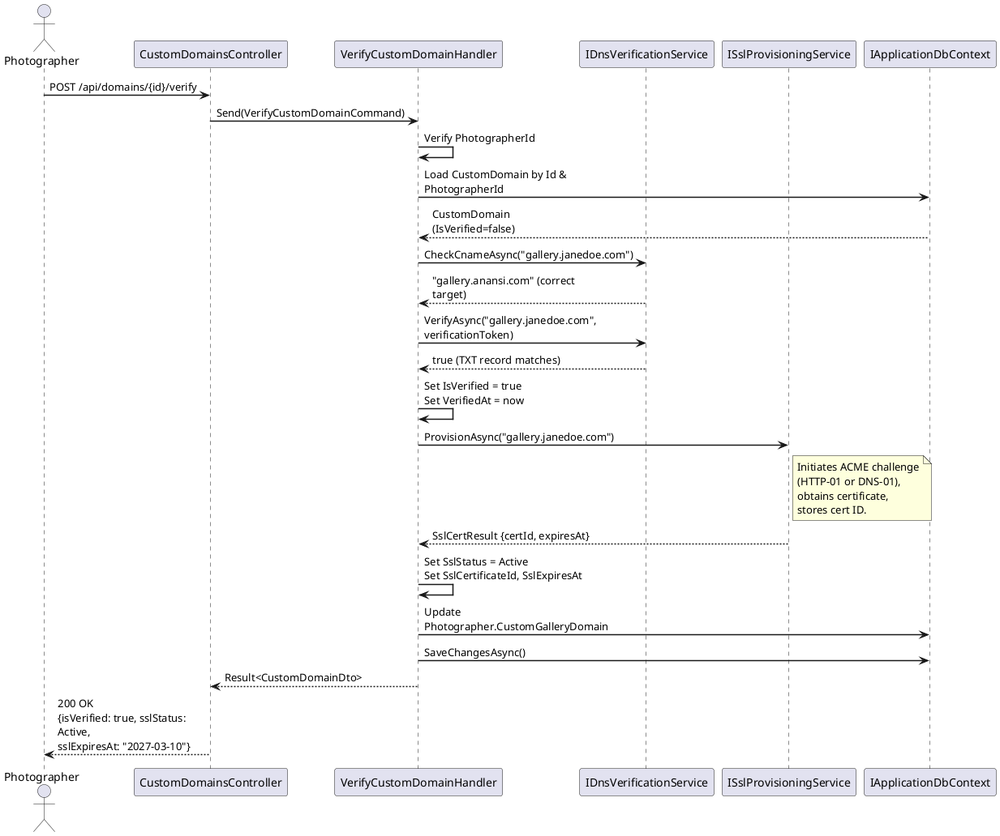

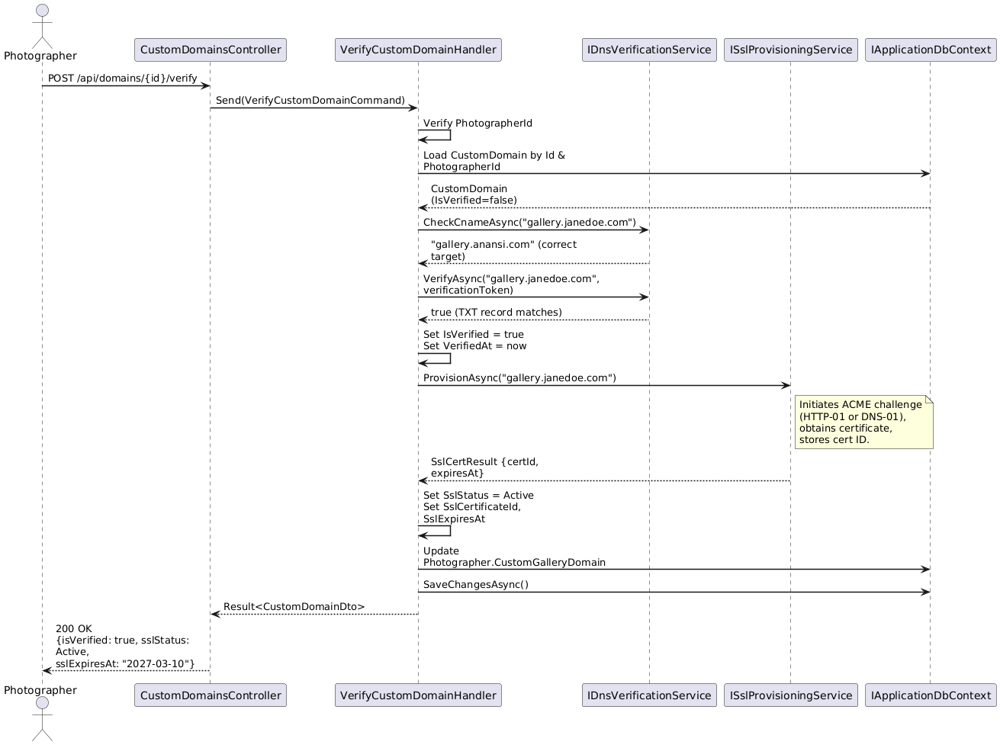

### DNS Diagnostic Check

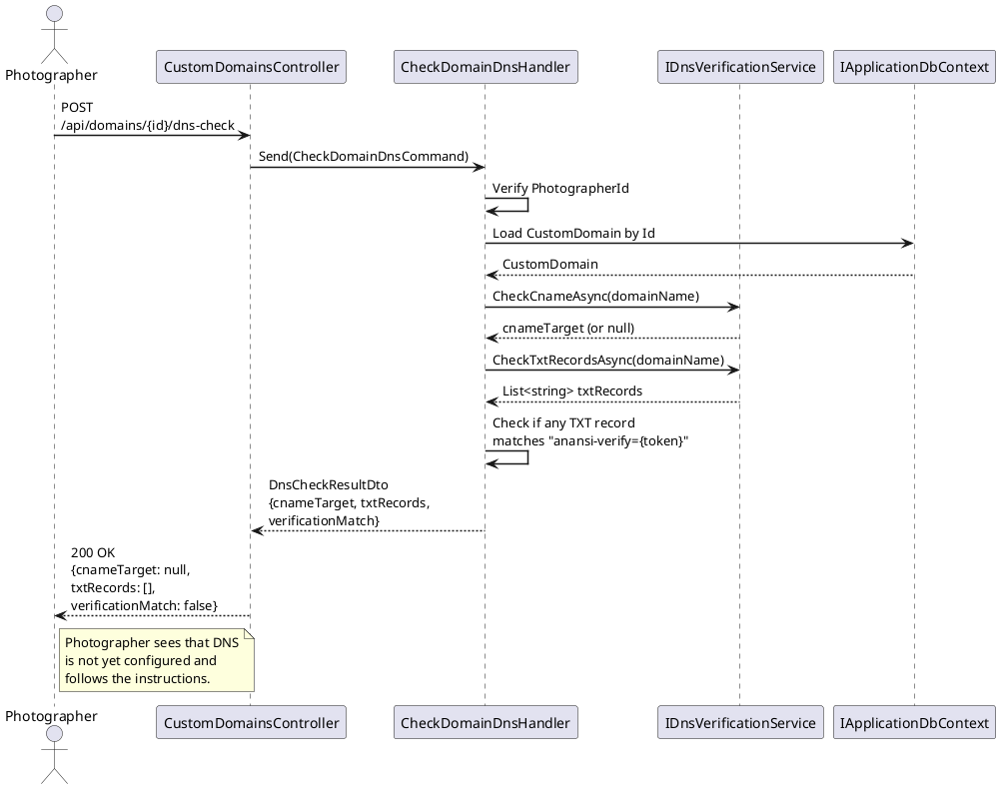

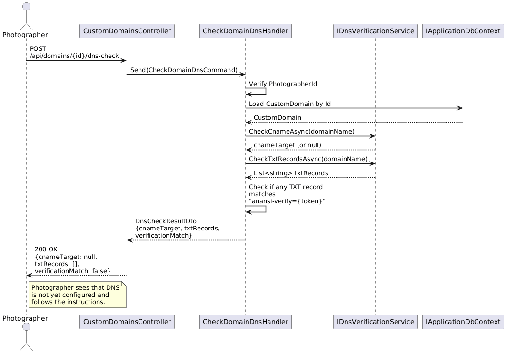

### Domain Routing (Incoming Request)

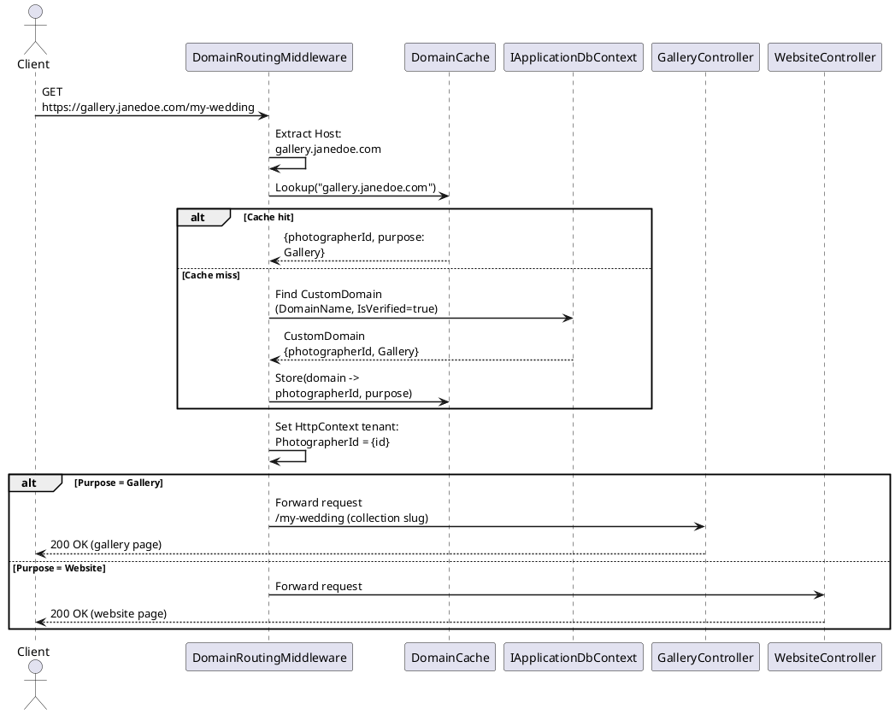

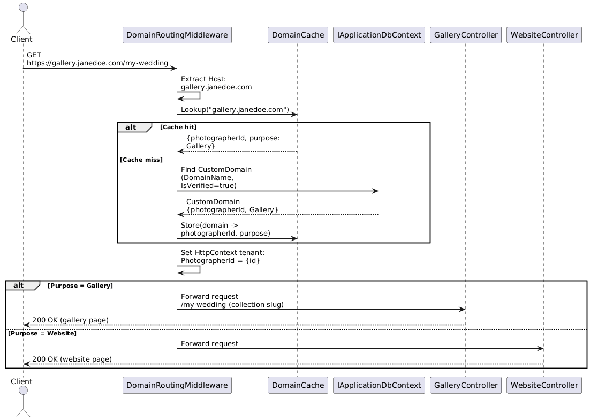

### SSL Certificate Renewal

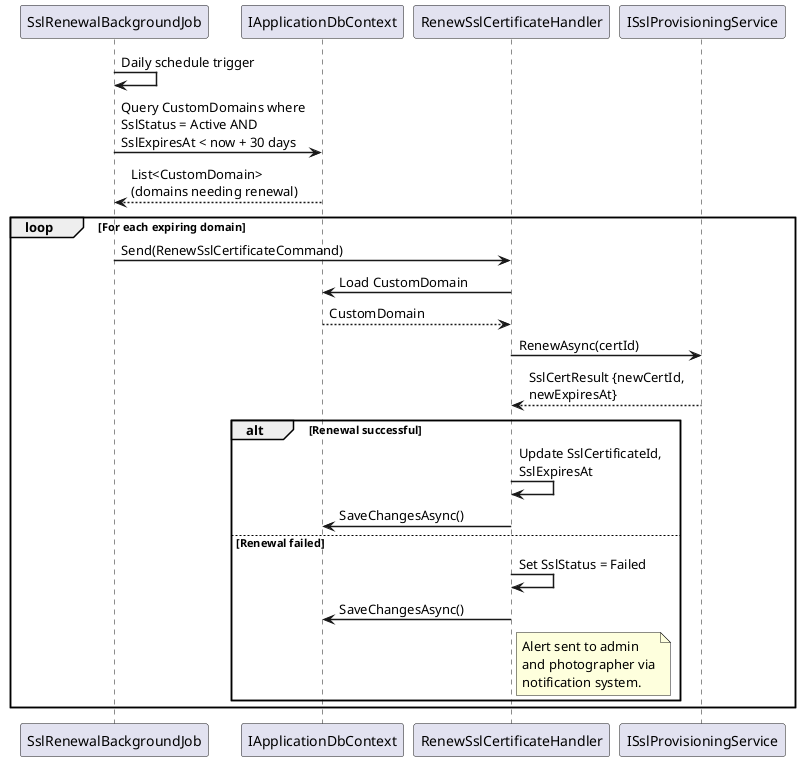

### Delete Custom Domain

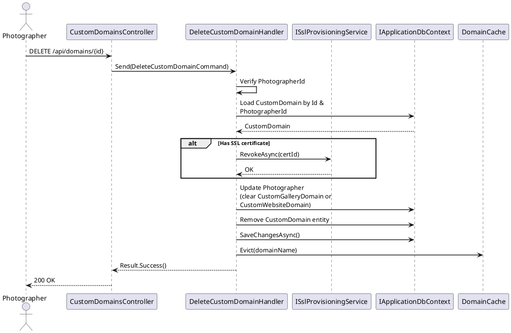

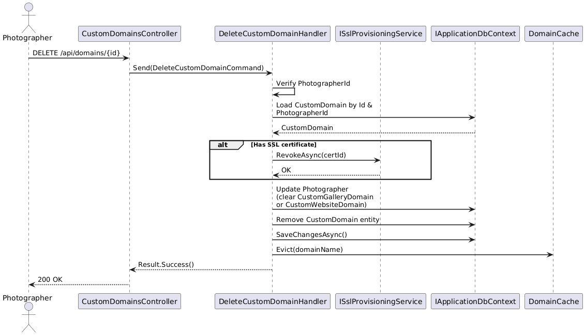
