# F40 - Notification System

## Overview

The Notification System is the cross-cutting communication backbone of the Anansi platform. It delivers real-time and batched notifications to photographers through three channels: in-app (a notification center in the dashboard), email (per-event or daily digest), and mobile push (delivered within 30 seconds of the triggering event). Every significant platform event -- photo downloads, store orders, favorite list updates, contract signatures, invoice payments, session bookings, quote acceptances, client messages, form submissions, and gallery expirations -- flows through a single `NotificationEvent` MediatR notification that fans out to all enabled channels.

The in-app notification center is accessed via a bell icon in the dashboard header. The bell displays an unread count badge. Clicking it opens a notification panel showing recent events, each with event type, client name, timestamp, and a deep link to the relevant item. Notifications are filterable by category (Client Gallery, Store, Studio Manager, Other) and can be marked as read individually or in bulk. The panel supports infinite scroll with cursor-based pagination.

Photographers control their notification experience through per-event-type preferences. Each of the 10 event types has independent toggles for in-app, email, and push delivery. Email delivery supports two modes: real-time (sent immediately) and daily digest (aggregated into a single summary email sent at a configurable time). Push notifications are delivered via Firebase Cloud Messaging (FCM) for Android and Apple Push Notification service (APNs) for iOS, with device tokens registered through the mobile app. A background digest job runs hourly, collecting all undelivered digest-mode notifications and batching them into a single email per photographer.

**L2 Requirements:** NTF-9.1.1 (Notification Center), NTF-9.1.2 (Notification Events), NTF-9.2.1 (Email Preferences), NTF-9.3.1 (Mobile Push)

---

## Components

### Domain Layer

| Component | Type | Description |
|-----------|------|-------------|
| `Notification` | Entity (existing) | Stores `PhotographerId`, `EventType`, `Category`, `Title`, `Message`, `ClientName`, `Link`, `IsRead`, `ReadAt`. Implements `ITenantEntity`. |
| `NotificationPreference` | Entity (existing) | Per-event-type preference: `EmailEnabled`, `PushEnabled`, `InAppEnabled`, `EmailDigestOption` (RealTime/DailySummary). One record per photographer per event type. |
| `NotificationEventType` | Enum (existing) | `PhotoDownloaded`, `StoreOrderPlaced`, `FavoriteListUpdated`, `ContractSigned`, `InvoicePaymentReceived`, `SessionBooked`, `QuoteAccepted`, `MessageReceived`, `FormSubmissionReceived`, `GalleryExpiring`. |
| `NotificationCategory` | Enum (existing) | `ClientGallery`, `Store`, `StudioManager`, `Other`. Used for filtering in the notification panel. |
| `EmailDigestOption` | Enum (existing) | `RealTime`, `DailySummary`. |
| `NotificationDeliveryMethod` | Enum (existing) | `InApp`, `Email`, `Push`. |

### Application Layer

| Component | Type | Description |
|-----------|------|-------------|
| `NotificationEvent` | MediatR Notification (existing) | Raised by any feature handler when a notifiable event occurs. Carries `PhotographerId`, `EventType`, `Category`, `Title`, `Message`, `ClientName`, and `Link`. |
| `NotificationEventHandler` | Notification Handler (existing) | Receives `NotificationEvent` and dispatches `CreateNotificationCommand` to the mediator, which handles channel fan-out. |
| `CreateNotificationCommand` | Command (existing) | Core notification creation logic. Checks the photographer's `NotificationPreference` for the event type. Creates an in-app `Notification` if enabled. Sends an email immediately if email is enabled and digest option is RealTime. Sends a push notification if push is enabled. For DailySummary email mode, the notification is created but email delivery is deferred to the digest job. |
| `MarkNotificationReadCommand` | Command (existing) | Marks a single notification as read (sets `IsRead = true`, `ReadAt = now`). |
| `MarkAllNotificationsReadCommand` | Command (existing) | Marks all unread notifications for the photographer as read, optionally filtered by category. |
| `GetNotificationsQuery` | Query (existing) | Paginated query returning notifications for the authenticated photographer. Supports filtering by `Category` and `IsRead` status. Ordered by `CreatedAt` descending. |
| `GetUnreadCountQuery` | Query (existing) | Returns the count of unread notifications for the authenticated photographer, used to render the bell badge. |
| `GetNotificationPreferencesQuery` | Query (existing) | Returns all `NotificationPreference` records for the photographer (one per event type). If no record exists for an event type, defaults are returned (all channels enabled, RealTime email). |
| `UpdateNotificationPreferenceCommand` | Command (existing) | Updates the preference for a specific event type: toggles for in-app, email, push, and email digest option. Upserts the record (creates if not present). |
| `SendDigestEmailCommand` | Command | Triggered by the digest background job. Collects all notifications created since the last digest for photographers on DailySummary mode, groups by photographer, and sends a single summary email per photographer. |
| `RegisterDeviceTokenCommand` | Command | Registers a mobile device's push notification token (FCM/APNs) for the authenticated user. Stores it via `IPushNotificationService`. |
| `UnregisterDeviceTokenCommand` | Command | Removes a device token when the user logs out of a device or uninstalls the app. |
| `NotificationDto` | DTO (existing) | Read model: ID, event type, category, title, message, client name, link, is read, read at, created at. |
| `NotificationPreferenceDto` | DTO | Read model: event type, in-app enabled, email enabled, push enabled, email digest option. |
| `IEmailService` | Interface (existing) | Sends templated emails. Used for both real-time and digest notification emails. |
| `IPushNotificationService` | Interface (existing) | Sends push notifications, registers/unregisters device tokens. |

### Infrastructure Layer

| Component | Type | Description |
|-----------|------|-------------|
| `PushNotificationService` | Service | Implements `IPushNotificationService`. Integrates with FCM (Firebase Cloud Messaging) for Android and APNs (Apple Push Notification service) for iOS. Maintains a device token registry in the database. Ensures delivery within 30 seconds by using async fire-and-forget with retry. |
| `NotificationDigestBackgroundJob` | BackgroundJob | Runs on a configurable schedule (default: hourly). Queries notifications created since the last run for photographers with `EmailDigestOption = DailySummary`. Groups by photographer, builds a summary email body, and sends via `IEmailService`. Tracks the last-processed timestamp to avoid duplicates. |
| `DeviceToken` | Entity (Infrastructure) | Stores `UserId`, `Token`, `Platform` ("ios"/"android"), `CreatedAt`. Used by `PushNotificationService` to target the correct devices. |

### API Layer

| Component | Type | Description |
|-----------|------|-------------|
| `NotificationsController` | Controller | Endpoints: `GET /api/notifications` (paginated list with category/read filters), `GET /api/notifications/unread-count`, `PUT /api/notifications/{id}/read`, `PUT /api/notifications/read-all`, `GET /api/notifications/preferences`, `PUT /api/notifications/preferences/{eventType}`. All require `[Authorize]`. |
| `DeviceTokenController` | Controller | Endpoints: `POST /api/device-tokens` (register), `DELETE /api/device-tokens/{token}` (unregister). Used by mobile apps during login/logout. |
| `NotificationHub` | SignalR Hub | Real-time WebSocket hub for pushing new notifications to connected dashboard clients. When `CreateNotificationCommand` creates an in-app notification, it also broadcasts to the photographer's SignalR group so the bell badge updates without polling. |

---

## Class Diagrams

### Domain Layer - Notification Entities

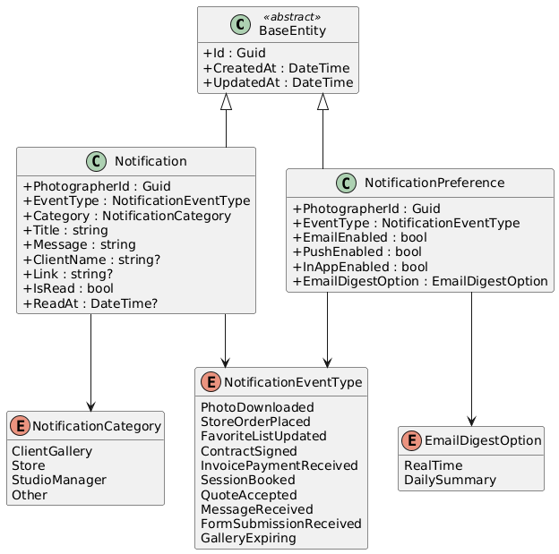

### Application Layer - Commands, Queries, and Event Flow

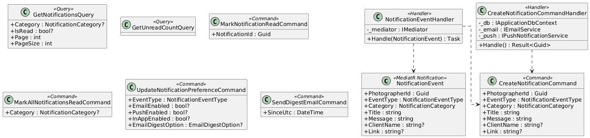

### Application Layer - DTOs and Service Interfaces

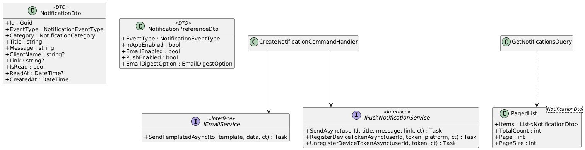

### Infrastructure & API Layer

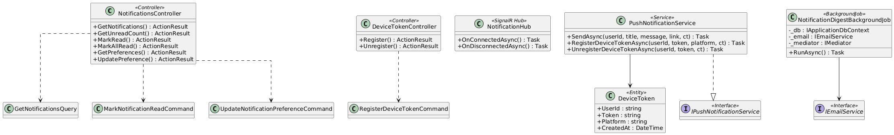

---

## Sequence Diagrams

### Event Triggers Notification (Full Fan-Out)

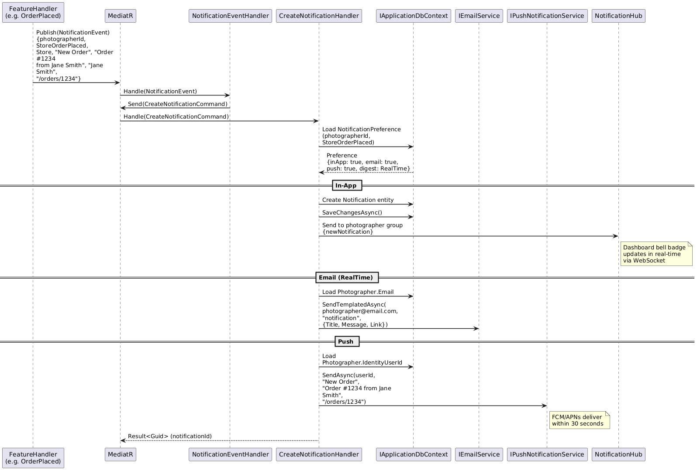

### Notification Center - List and Filter

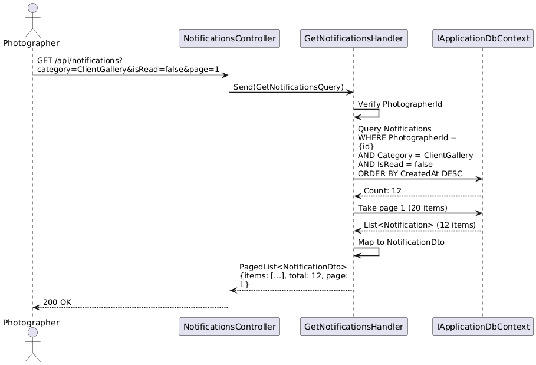

### Mark Notification as Read

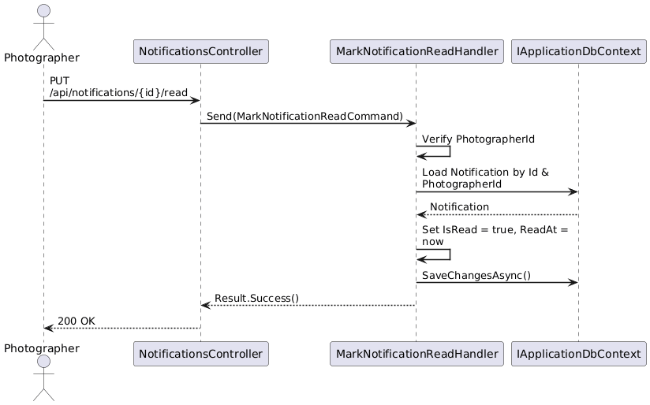

### Get Unread Count (Bell Badge)

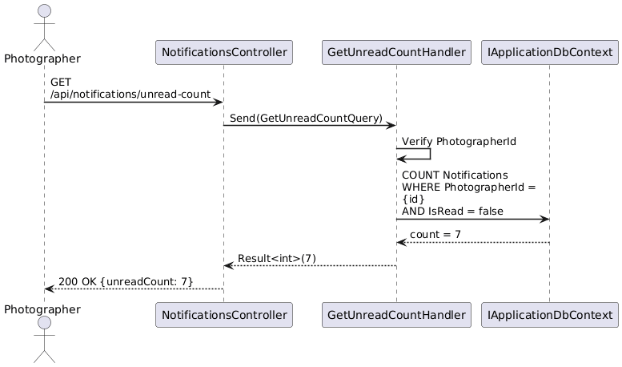

### Update Notification Preferences

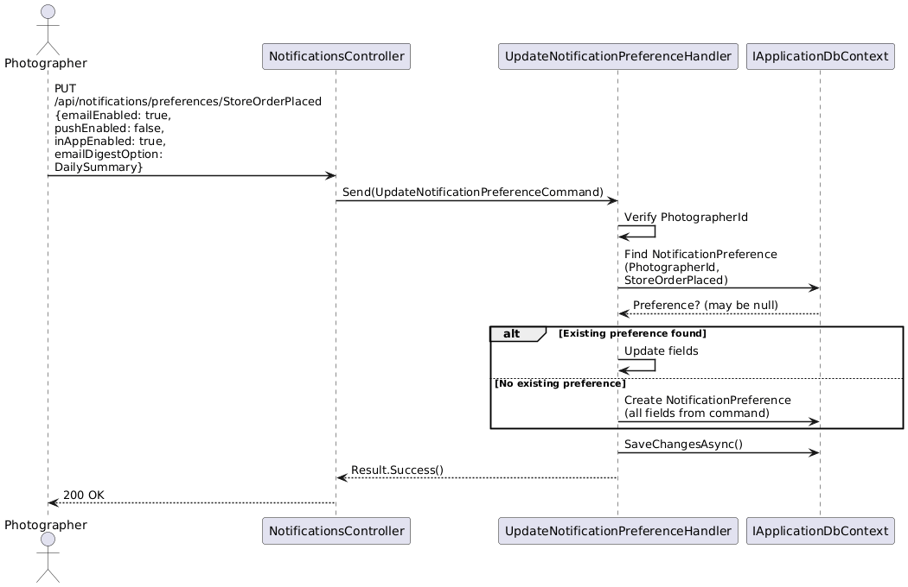

### Daily Digest Email

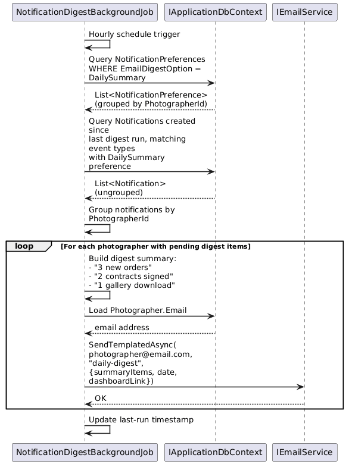

### Register Device Token for Push

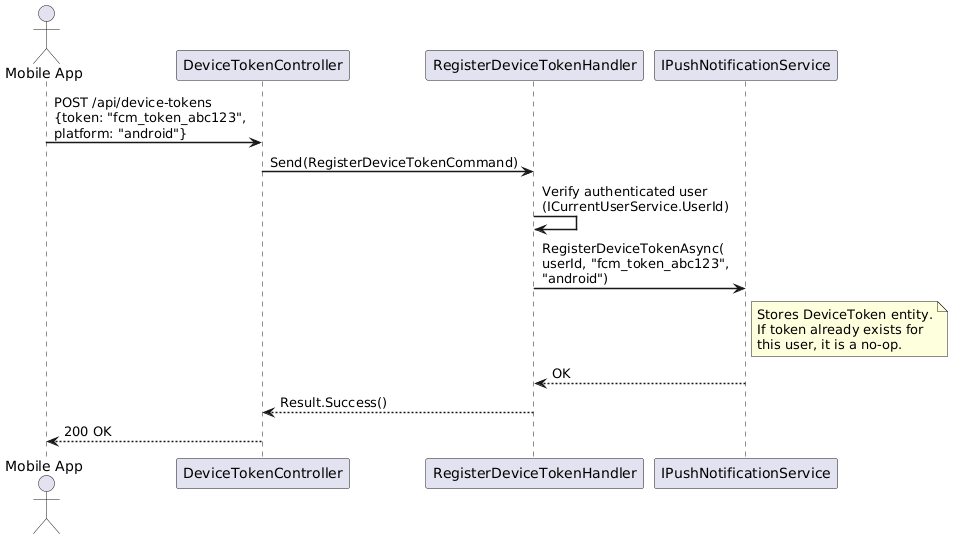

### Real-Time SignalR Notification Push

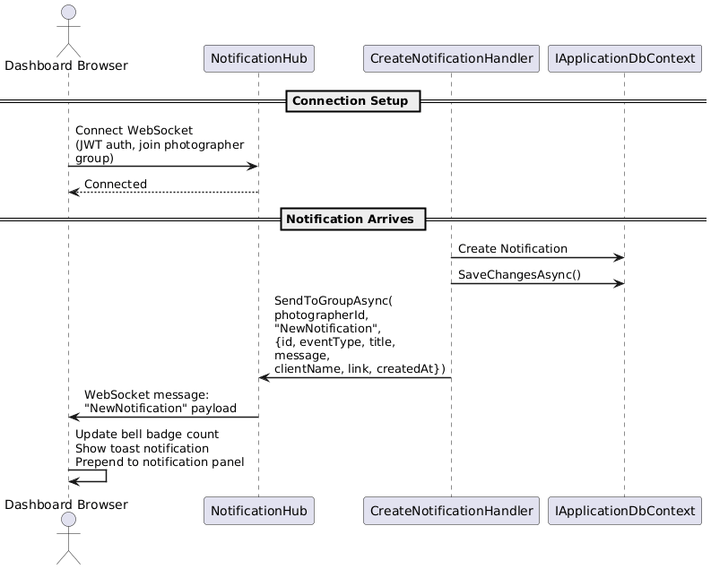
