# F41 - Integrations Hub

## Overview

The Integrations Hub is the centralized surface through which photographers connect third-party services to their Anansi account. It covers eight distinct integrations spanning scheduling, video conferencing, analytics, social media, and payment processing. Each integration follows an OAuth or credential-based connection flow, stores its configuration on the `Photographer` entity (or in a dedicated config entity), and exposes domain-specific behaviors consumed by other features throughout the platform.

Calendar and video integrations work together with the Booking feature (F25). Google Calendar provides two-way sync: when a booking is confirmed in Anansi a calendar event is created with the client as attendee, and external busy events block available booking slots. A background sync job polls for changes within a 5-minute window. Zoom and Google Meet integrations auto-generate unique meeting links when a session type is configured for video calls. Analytics integrations (GA4 and Facebook Pixel) inject tracking scripts into all client-facing pages via the rendering pipeline without requiring manual code from the photographer. The Instagram Feed integration uses the Instagram Basic Display API to pull the photographer's latest posts and display them on their website. Stripe and PayPal integrations provide payment processing capabilities consumed by F30 (Payment Processing) and F15 (Store Checkout).

The hub provides a unified settings UI under the photographer's account where each integration shows its connection status, configuration options, and disconnect action. All OAuth tokens are stored encrypted at rest. The feature relies on existing domain entities (`Photographer`, `InstagramFeedConfig`) and application interfaces (`IGoogleCalendarService`, `IVideoCallService`, `IInstagramService`, `IPaymentService`, `IPayPalService`) already defined in the codebase.

**L2 Requirements:** INT-8.1.2 (Google Calendar), INT-8.1.3 (Zoom), INT-8.1.4 (Google Meet), INT-8.1.5 (GA4), INT-8.1.6 (Facebook Pixel), INT-8.1.7 (Instagram Feed), INT-8.1.8 (Stripe), INT-8.1.8 (PayPal)

---

## Components

### Domain Layer (Anansi.Domain)

| Component | Type | Description |
|-----------|------|-------------|
| `Photographer` | Entity | Stores integration credential references: `GoogleCalendarId`, `ZoomAccountId`, `GoogleAnalyticsId`, `FacebookPixelId`, `InstagramAccessToken`, `StripeAccountId`, `PayPalEmail`. |
| `InstagramFeedConfig` | Entity | Per-photographer Instagram feed display settings: `NumberOfPosts`, `ImageSize`, `ClickBehavior`, `IsActive`. |
| `IntegrationProvider` | Enum | Enumerates supported providers: `GoogleCalendar`, `Zoom`, `GoogleMeet`, `GoogleAnalytics`, `FacebookPixel`, `Instagram`, `Stripe`, `PayPal`. |

### Application Layer (Anansi.Application)

| Component | Type | Description |
|-----------|------|-------------|
| `ConnectGoogleCalendarCommand` | Command | Exchanges OAuth authorization code for tokens, stores `GoogleCalendarId` on `Photographer`, triggers initial sync. |
| `DisconnectGoogleCalendarCommand` | Command | Clears `GoogleCalendarId`, removes stored tokens, cancels pending sync jobs. |
| `SyncGoogleCalendarCommand` | Command | Pulls remote events, pushes local confirmed bookings, reconciles conflicts. Invoked by background job every 5 minutes. |
| `ConnectZoomCommand` | Command | Exchanges Zoom OAuth code for tokens, stores `ZoomAccountId` on `Photographer`. |
| `DisconnectZoomCommand` | Command | Clears `ZoomAccountId` and stored tokens. |
| `ConfigureGoogleAnalyticsCommand` | Command | Saves GA4 Measurement ID to `Photographer.GoogleAnalyticsId`. |
| `ConfigureFacebookPixelCommand` | Command | Saves Pixel ID to `Photographer.FacebookPixelId`. |
| `ConnectInstagramCommand` | Command | Exchanges Instagram OAuth code for long-lived token, stores on `Photographer.InstagramAccessToken`, creates default `InstagramFeedConfig`. |
| `DisconnectInstagramCommand` | Command | Clears token and deactivates `InstagramFeedConfig`. |
| `UpdateInstagramFeedConfigCommand` | Command | Updates `NumberOfPosts`, `ImageSize`, `ClickBehavior` on `InstagramFeedConfig`. |
| `GetInstagramFeedQuery` | Query | Calls `IInstagramService.GetFeedAsync` with stored token, returns posts. |
| `ConnectStripeCommand` | Command | Creates Stripe Connect account via `IPaymentService.CreateConnectedAccountAsync`, stores `StripeAccountId`. |
| `DisconnectStripeCommand` | Command | Clears `StripeAccountId`. |
| `ConfigurePayPalCommand` | Command | Saves PayPal API credentials (email) to `Photographer.PayPalEmail`. |
| `GetIntegrationsStatusQuery` | Query | Returns connection status for all integrations for the authenticated photographer. |
| `IGoogleCalendarService` | Interface | Creates, updates, deletes calendar events; queries events and busy times within a date range. |
| `IVideoCallService` | Interface | Creates Zoom meetings and Google Meet links with topic, time, and attendee. |
| `IInstagramService` | Interface | Fetches Instagram feed posts using an access token. |
| `IPaymentService` | Interface | Creates Stripe payment intents, checkout sessions, refunds, and connected accounts. |
| `IPayPalService` | Interface | Creates PayPal orders, captures payments, issues refunds. |

### Infrastructure Layer (Anansi.Infrastructure)

| Component | Type | Description |
|-----------|------|-------------|
| `GoogleCalendarService` | Service | Implements `IGoogleCalendarService` using Google Calendar API v3. Manages OAuth token refresh. |
| `VideoCallService` | Service | Implements `IVideoCallService`. Creates Zoom meetings via Zoom REST API and Google Meet links via Calendar API with `conferenceData`. |
| `InstagramService` | Service | Implements `IInstagramService` using Instagram Basic Display API. Handles token refresh. |
| `StripePaymentService` | Service | Implements `IPaymentService` using Stripe .NET SDK. |
| `PayPalService` | Service | Implements `IPayPalService` using PayPal REST SDK. |
| `GoogleCalendarSyncJob` | BackgroundJob | Hangfire recurring job (every 5 min) that invokes `SyncGoogleCalendarCommand` for each connected photographer. |

### API Layer (Anansi.Api)

| Component | Type | Description |
|-----------|------|-------------|
| `IntegrationsController` | Controller | Endpoints for connecting, disconnecting, and configuring all integrations. `GET /status` returns all integration states. |
| `IntegrationsOAuthController` | Controller | Handles OAuth callback endpoints for Google, Zoom, and Instagram. |

---

## Class Diagrams

### Domain -- Integration Fields on Photographer

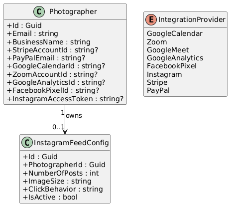

### Application -- Integration Commands & Queries

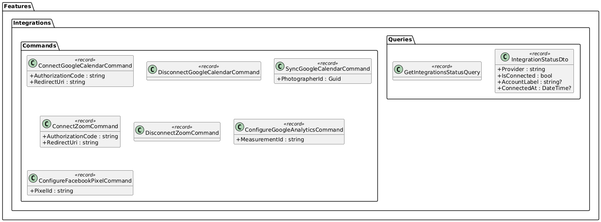

### Application -- Instagram & Payment Commands

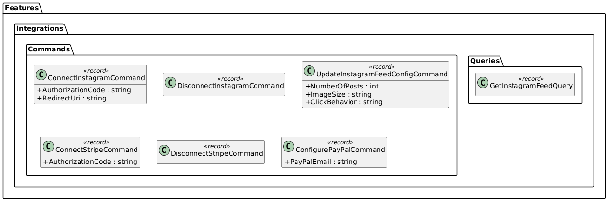

### Application -- Service Interfaces

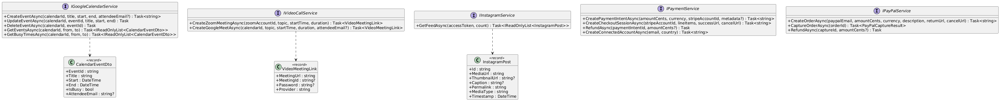

### Infrastructure -- Service Implementations

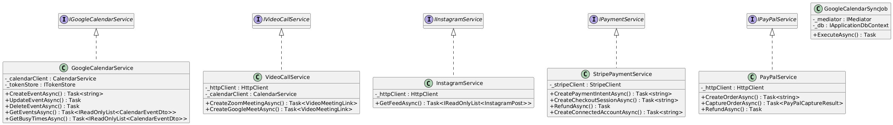

### API -- Integration Controllers

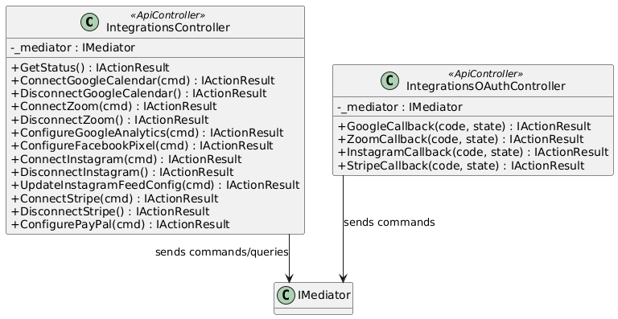

---

## Sequence Diagrams

### Connect Google Calendar (OAuth Flow)

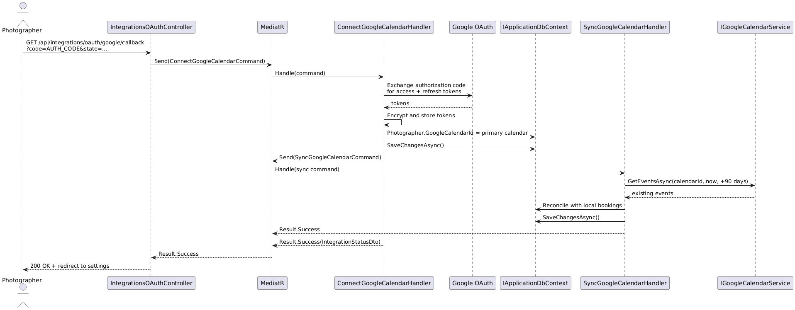

### Two-Way Google Calendar Sync (Background Job)

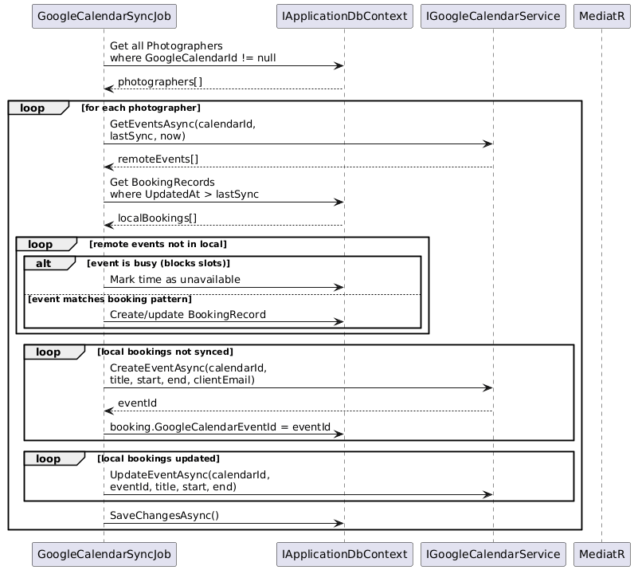

### Auto-Generate Video Call Link on Booking Confirmation

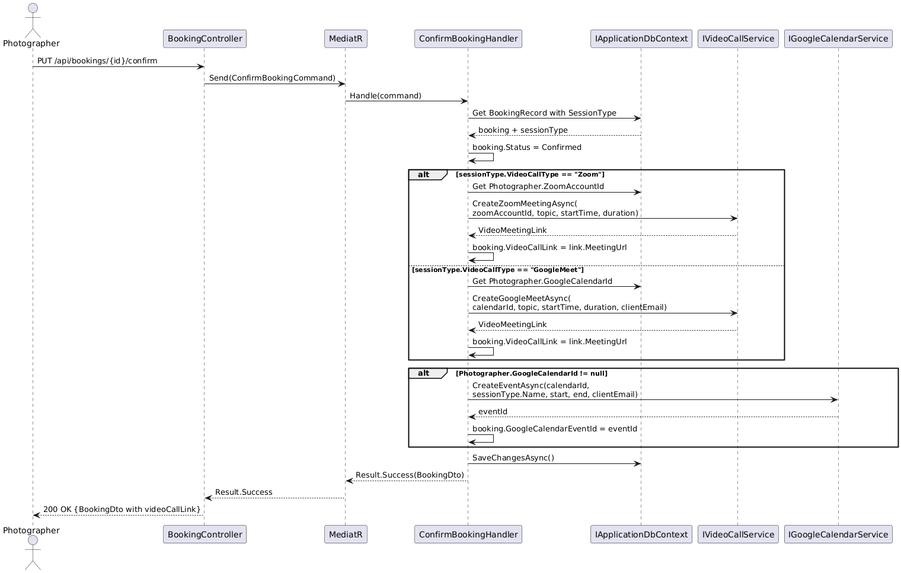

### Configure Analytics Integration (GA4 / Facebook Pixel)

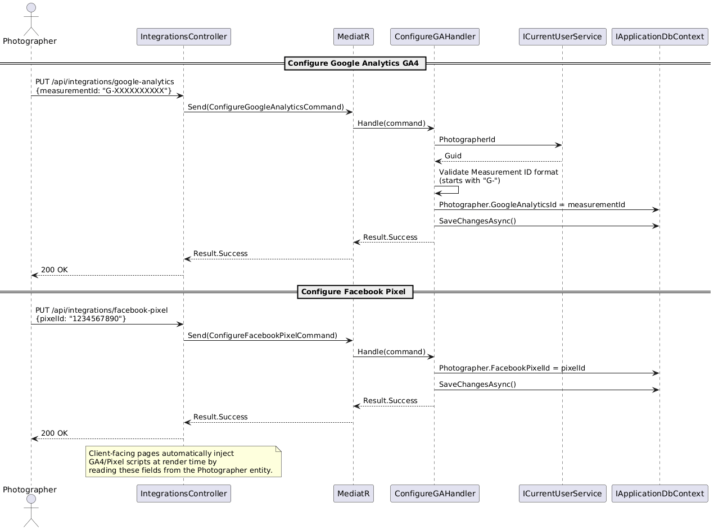

### Connect Instagram Feed

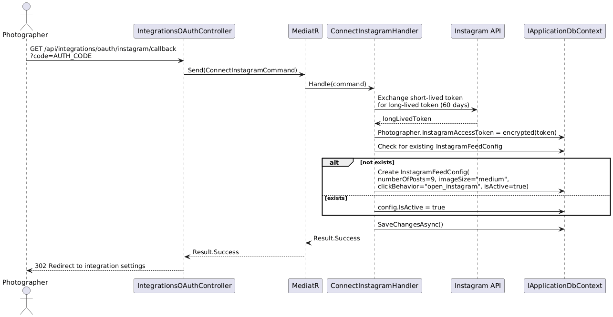

### Connect Stripe (OAuth Connect)

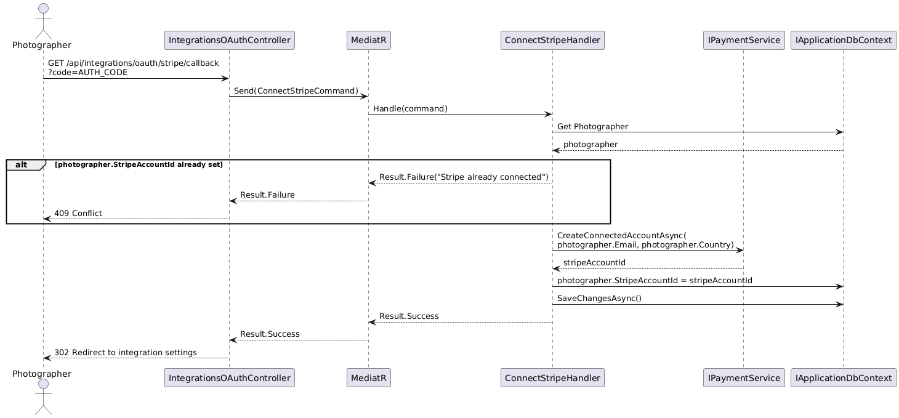

### Get All Integration Statuses

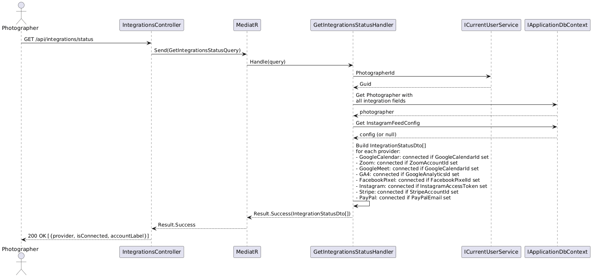
