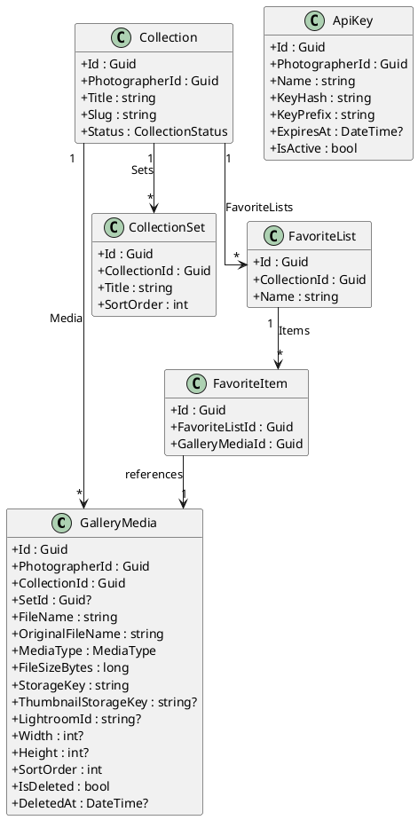
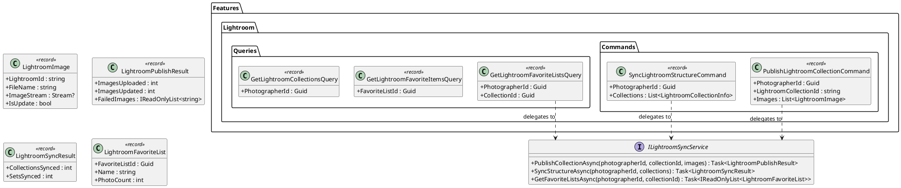
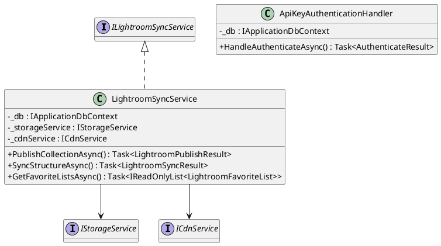
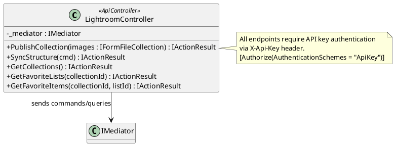
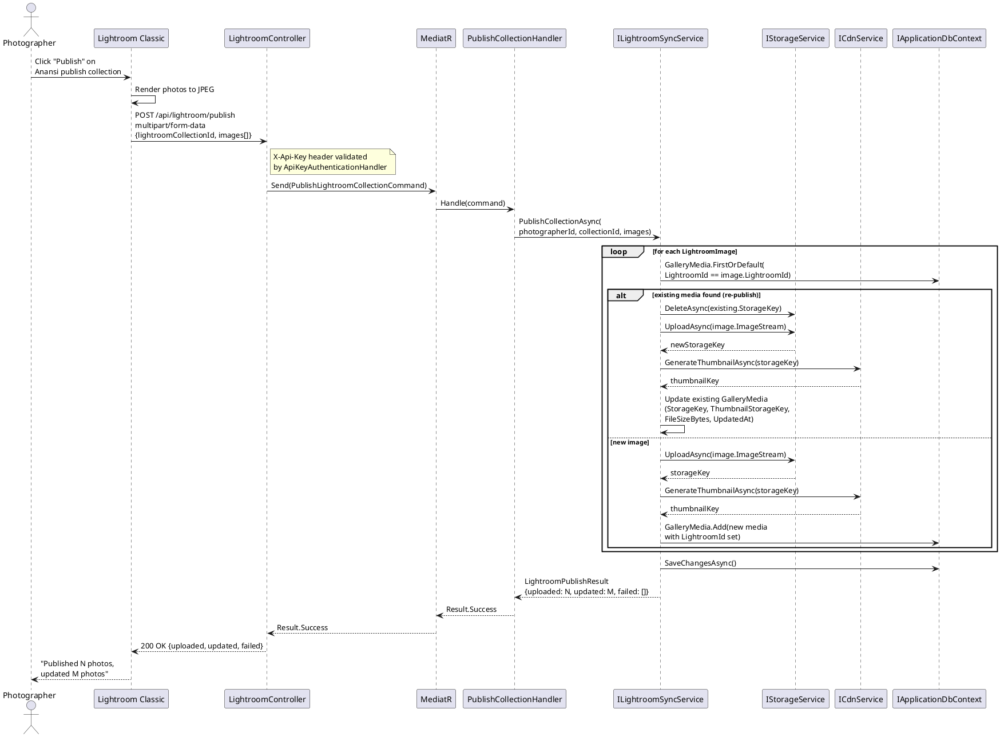
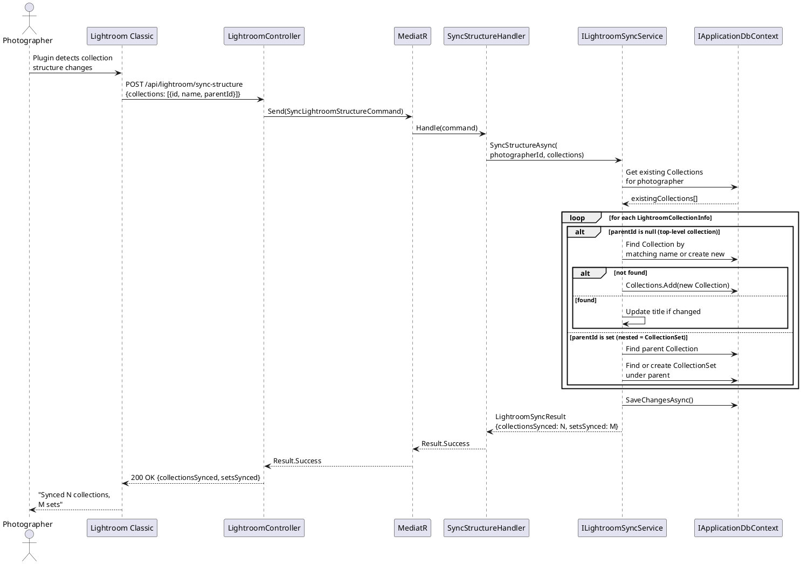
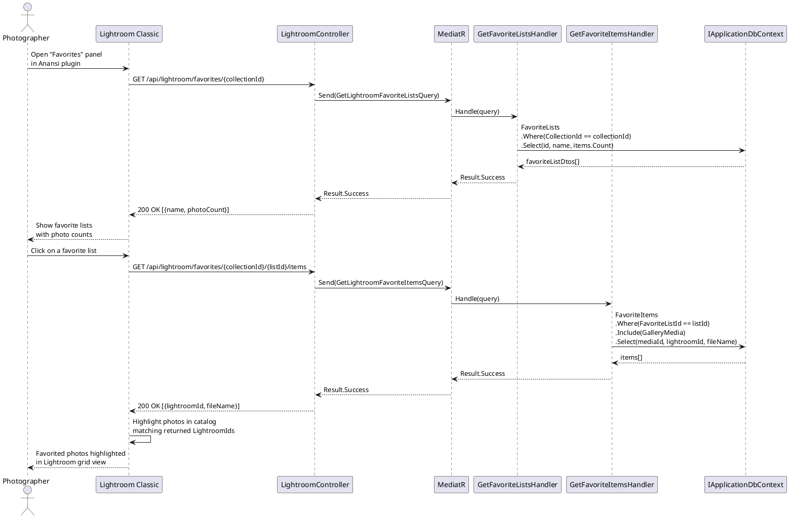
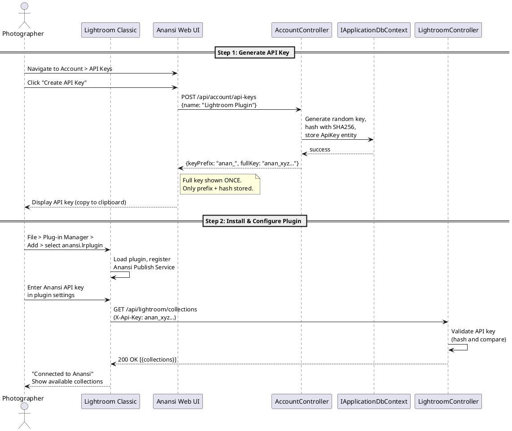

# F42 - Lightroom Plugin

## Overview

The Lightroom Plugin enables photographers to publish images directly from Adobe Lightroom Classic to their Anansi galleries without leaving the editing environment. The plugin registers as a Lightroom Publish Service, integrating with Lightroom's native publish workflow so that export-to-Anansi works the same way as export-to-Flickr or export-to-SmugMug. Photographers install the plugin through Lightroom's Plugin Manager, authenticate with their Anansi API key, and then create publish collections that map to Anansi collections.

The plugin supports three core workflows. First, initial publish: the photographer selects images in a Lightroom collection and publishes them, which uploads JPEG renditions to Anansi and creates corresponding `GalleryMedia` records. Second, re-publish: when the photographer edits an image that was previously published, Lightroom marks it as needing re-publish. The plugin detects the existing `LightroomId` mapping and performs an update-in-place rather than creating a duplicate. Third, structure sync: the plugin reads the photographer's Lightroom collection sets and mirrors them as Anansi `CollectionSet` entities, preserving the hierarchical organization. Additionally, the plugin can pull client favorite lists from Anansi and display them within Lightroom so the photographer can see which images the client selected.

On the server side, Anansi exposes a dedicated set of API endpoints under `/api/lightroom/` that the plugin calls. These endpoints delegate to the `ILightroomSyncService` interface, which orchestrates uploads via `IStorageService`, media record creation via `IApplicationDbContext`, and favorite list retrieval. Authentication uses the same API key mechanism defined in F43 (Webhooks & API), with the `ApiKey` entity and hash-based validation.

**L2 Requirements:** GAL-1.1.3 (Lightroom Plugin), INT-8.1.1 (Lightroom Integration)

---

## Components

### Domain Layer (Anansi.Domain)

| Component | Type | Description |
|-----------|------|-------------|
| `GalleryMedia` | Entity | Extended with `LightroomId` (string, nullable) to track the Lightroom catalog identifier for each published image, enabling update-on-republish. |
| `Collection` | Entity | Existing entity used as the target for Lightroom publish collections. |
| `CollectionSet` | Entity | Existing entity representing album sets. The plugin syncs Lightroom collection sets to these entities. |
| `FavoriteList` | Entity | Existing entity. The plugin reads favorite lists and their items for display inside Lightroom. |
| `FavoriteItem` | Entity | Existing entity. Each item references a `GalleryMedia` record; the plugin resolves these to Lightroom photo IDs. |
| `ApiKey` | Entity | Used for plugin authentication. The photographer generates an API key in Anansi and enters it in the Lightroom plugin settings. |

### Application Layer (Anansi.Application)

| Component | Type | Description |
|-----------|------|-------------|
| `PublishLightroomCollectionCommand` | Command | Receives a photographer ID, Lightroom collection ID, and a list of `LightroomImage` records (each with stream, filename, and isUpdate flag). Delegates to `ILightroomSyncService.PublishCollectionAsync`. Returns `LightroomPublishResult` with counts of uploaded/updated/failed images. |
| `SyncLightroomStructureCommand` | Command | Receives a list of `LightroomCollectionInfo` records (ID, name, parent ID). Delegates to `ILightroomSyncService.SyncStructureAsync` to create or update `Collection` and `CollectionSet` entities. Returns `LightroomSyncResult`. |
| `GetLightroomFavoriteListsQuery` | Query | Returns favorite lists for a given collection, including photo counts. Delegates to `ILightroomSyncService.GetFavoriteListsAsync`. |
| `GetLightroomFavoriteItemsQuery` | Query | Returns individual favorite items for a given list, including the `LightroomId` of each image so the plugin can highlight them in the Lightroom catalog. |
| `GetLightroomCollectionsQuery` | Query | Returns the photographer's Anansi collections with their Lightroom mapping status (mapped/unmapped) for the plugin's collection picker UI. |
| `ILightroomSyncService` | Interface | Defines `PublishCollectionAsync`, `SyncStructureAsync`, and `GetFavoriteListsAsync`. |
| `IStorageService` | Interface | Used by the sync service to upload image streams to blob storage. |

### Infrastructure Layer (Anansi.Infrastructure)

| Component | Type | Description |
|-----------|------|-------------|
| `LightroomSyncService` | Service | Implements `ILightroomSyncService`. For publish: uploads each image stream via `IStorageService`, creates or updates `GalleryMedia` records (matching on `LightroomId`), generates thumbnails via `ICdnService`. For structure sync: creates `Collection`/`CollectionSet` entities matching the Lightroom hierarchy. For favorites: queries `FavoriteList` and `FavoriteItem` joined with `GalleryMedia.LightroomId`. |
| `ApiKeyAuthenticationHandler` | Handler | ASP.NET Core authentication handler that validates the `X-Api-Key` header against hashed keys in the `ApiKeys` table. |

### API Layer (Anansi.Api)

| Component | Type | Description |
|-----------|------|-------------|
| `LightroomController` | Controller | Endpoints: `POST /api/lightroom/publish` (multipart upload), `POST /api/lightroom/sync-structure`, `GET /api/lightroom/collections`, `GET /api/lightroom/favorites/{collectionId}`, `GET /api/lightroom/favorites/{collectionId}/{listId}/items`. All require API key authentication. |

### Lightroom Plugin (External Lua)

| Component | Type | Description |
|-----------|------|-------------|
| `AnansiPublishServiceProvider` | Lua Module | Registers the Anansi Publish Service with Lightroom. Implements `processRenderedPhotos`, `getCollectionBehaviorInfo`, and `metadataProviderForExportedPhotos`. |
| `AnansiAPI` | Lua Module | HTTP client wrapper that calls the Anansi Lightroom API endpoints with API key authentication. Handles multipart uploads, JSON parsing, error handling. |
| `AnansiDialogs` | Lua Module | UI dialogs for API key entry, collection mapping, favorite list viewing, and publish progress. |

---

## Class Diagrams

### Domain -- GalleryMedia with Lightroom Mapping

### Application -- Lightroom Commands, Queries & Service Interface

### Infrastructure -- LightroomSyncService

### API -- LightroomController

---

## Sequence Diagrams

### Publish Collection from Lightroom

### Sync Collection Structure

### View Favorite Lists in Lightroom

### Plugin Installation and Authentication

