# F43 - Webhooks & API

## Overview

Webhooks & API provides three extensibility mechanisms for the Anansi platform: outgoing webhooks that notify external systems of key business events, custom code injection that lets Pro-plan photographers embed arbitrary HTML/JS into their website, and a REST API that exposes template management for programmatic access. Together, these features enable photographers to integrate Anansi with external tools such as Zapier, custom CRM systems, live chat widgets, and third-party analytics services.

Outgoing webhooks support four event types: `BookingCreated`, `PaymentReceived`, `ContractSigned`, and `FormSubmitted`. Photographers configure one or more webhook URLs in their account settings, each subscribed to specific event types. When a matching event occurs, the `IWebhookService` constructs a JSON payload containing the event type, timestamp, photographer ID, and relevant entity data, then delivers it via HTTP POST to the subscribed URL. Each delivery is recorded in a `WebhookDelivery` entity for auditability, including the HTTP status code and response body. Failed deliveries are retried with exponential backoff (up to 3 attempts).

Custom code injection (available on Pro plans and above) allows photographers to inject HTML/CSS/JS snippets into the `<head>` or before `</body>` of their public website pages. Each injection is stored as a `CustomCodeInjection` entity with a location (Header or Footer), content, and active flag. The rendering pipeline injects active snippets at the appropriate location. A validation layer ensures injected code does not include dangerous patterns (e.g., `<script src>` pointing to known malicious domains) but otherwise permits tracking pixels, live chat, analytics, and custom forms. The REST API provides CRUD operations on email, contract, invoice, questionnaire, and quote templates via API key authentication, with paginated list endpoints.

**L2 Requirements:** INT-8.3.1 (Webhooks), INT-8.3.2 (Custom Code Injection), INT-8.3.3 (REST API)

---

## Components

### Domain Layer (Anansi.Domain)

| Component | Type | Description |
|-----------|------|-------------|
| `WebhookSubscription` | Entity | Stores a webhook endpoint URL, subscribed `WebhookEventType`, optional signing secret, active flag, and photographer reference. Implements `ITenantEntity`, `ISoftDeletable`. |
| `WebhookDelivery` | Entity | Records each delivery attempt: payload JSON, HTTP status code, response body, success flag, and delivery timestamp. References its parent `WebhookSubscription`. |
| `WebhookEventType` | Enum | `BookingCreated`, `PaymentReceived`, `ContractSigned`, `FormSubmitted`. |
| `CustomCodeInjection` | Entity | Stores a code snippet, its injection location (Header/Footer), active flag, and optional label. Implements `ITenantEntity`. |
| `CodeInjectionLocation` | Enum | `Header`, `Footer`. |
| `ApiKey` | Entity | Stores a hashed API key with prefix, name, optional expiration, last-used timestamp, and active flag. Implements `ITenantEntity`, `ISoftDeletable`. |

### Application Layer (Anansi.Application)

| Component | Type | Description |
|-----------|------|-------------|
| `CreateWebhookSubscriptionCommand` | Command | Creates a new webhook subscription with URL, event type, and optional secret. |
| `UpdateWebhookSubscriptionCommand` | Command | Updates URL, event type, secret, or active status on an existing subscription. |
| `DeleteWebhookSubscriptionCommand` | Command | Soft-deletes a webhook subscription. |
| `GetWebhookSubscriptionsQuery` | Query | Returns all subscriptions for the authenticated photographer. |
| `GetWebhookDeliveriesQuery` | Query | Returns paginated delivery history for a subscription. |
| `TestWebhookCommand` | Command | Sends a test payload to a webhook URL and returns the delivery result. |
| `CreateCustomCodeInjectionCommand` | Command | Creates a new code injection. Validates Pro plan access via `IPlanGateService`. |
| `UpdateCustomCodeInjectionCommand` | Command | Updates code content, location, label, or active flag. |
| `DeleteCustomCodeInjectionCommand` | Command | Deletes a code injection record. |
| `GetCustomCodeInjectionsQuery` | Query | Returns all code injections for the authenticated photographer. |
| `GetActiveInjectionsForSiteQuery` | Query | Returns active injections for a photographer's website, grouped by location. Used by the rendering pipeline. |
| `CreateApiKeyCommand` | Command | Generates a cryptographically random API key, hashes it, stores the `ApiKey` entity, and returns the full key once. |
| `RevokeApiKeyCommand` | Command | Soft-deletes an API key. |
| `GetApiKeysQuery` | Query | Returns all API keys for the authenticated photographer (prefix only, not full key). |
| `IWebhookService` | Interface | `DeliverAsync(photographerId, eventType, payload)` -- finds matching subscriptions and delivers the webhook. |

### Infrastructure Layer (Anansi.Infrastructure)

| Component | Type | Description |
|-----------|------|-------------|
| `WebhookService` | Service | Implements `IWebhookService`. Queries active `WebhookSubscription` records matching the event type, serializes the payload to JSON, signs it with HMAC-SHA256 if a secret is configured, sends HTTP POST, records `WebhookDelivery`, and schedules retries on failure. |
| `WebhookRetryJob` | BackgroundJob | Hangfire job that retries failed deliveries with exponential backoff (30s, 2min, 10min). Maximum 3 attempts. |
| `ApiKeyAuthenticationHandler` | Handler | ASP.NET Core authentication handler for `X-Api-Key` header validation. Hashes the provided key with SHA256 and matches against `ApiKey.KeyHash`. Updates `LastUsedAt` on success. |
| `CodeInjectionSanitizer` | Service | Validates custom code injections against a blocklist of dangerous patterns. Allows most HTML/JS but rejects known malicious domains and inline event handlers that could hijack the page. |

### API Layer (Anansi.Api)

| Component | Type | Description |
|-----------|------|-------------|
| `WebhooksController` | Controller | CRUD endpoints for webhook subscriptions under `api/webhooks`. Includes `POST /test` to send a test delivery. Requires JWT authentication. |
| `WebhookDeliveriesController` | Controller | Read-only endpoints for webhook delivery history under `api/webhooks/{subscriptionId}/deliveries`. Paginated. |
| `CodeInjectionsController` | Controller | CRUD endpoints for custom code injections under `api/code-injections`. Requires JWT + Pro plan. |
| `ApiKeysController` | Controller | Endpoints for creating and revoking API keys under `api/api-keys`. Requires JWT authentication. |
| `TemplatesApiController` | Controller | REST API endpoints under `api/v1/templates/{type}` for programmatic CRUD on email, contract, invoice, questionnaire, and quote templates. Requires API key authentication. Paginated list responses. |

---

## Class Diagrams

### Domain -- Webhook Entities

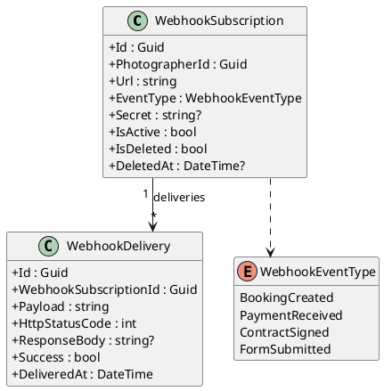

### Domain -- Code Injection & API Key Entities

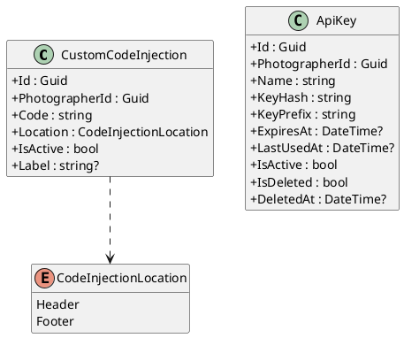

### Application -- Webhook Commands & Queries

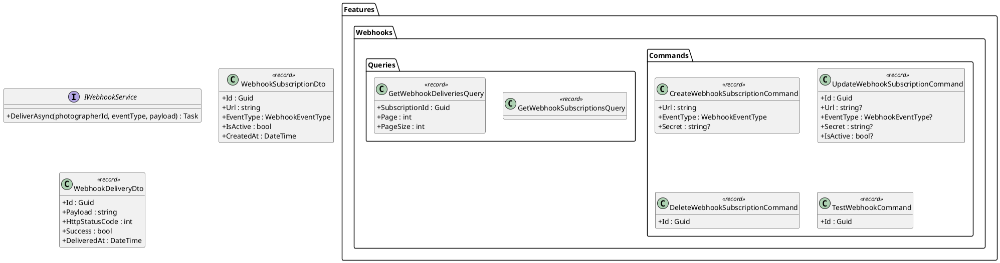

### Application -- Code Injection & API Key Commands

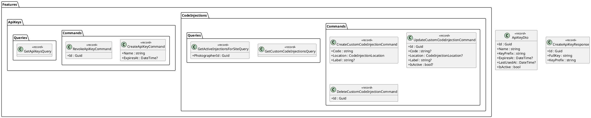

### Infrastructure -- WebhookService & Authentication

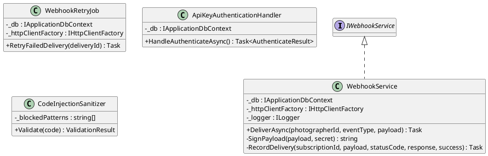

### API -- Controllers

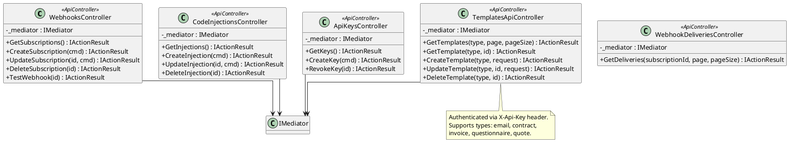

---

## Sequence Diagrams

### Webhook Delivery on Business Event

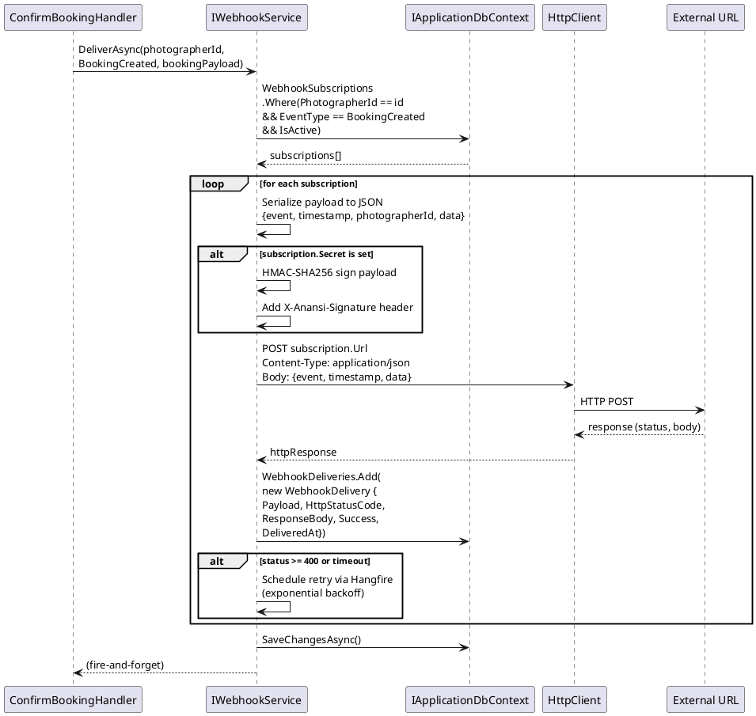

### Webhook Retry (Exponential Backoff)

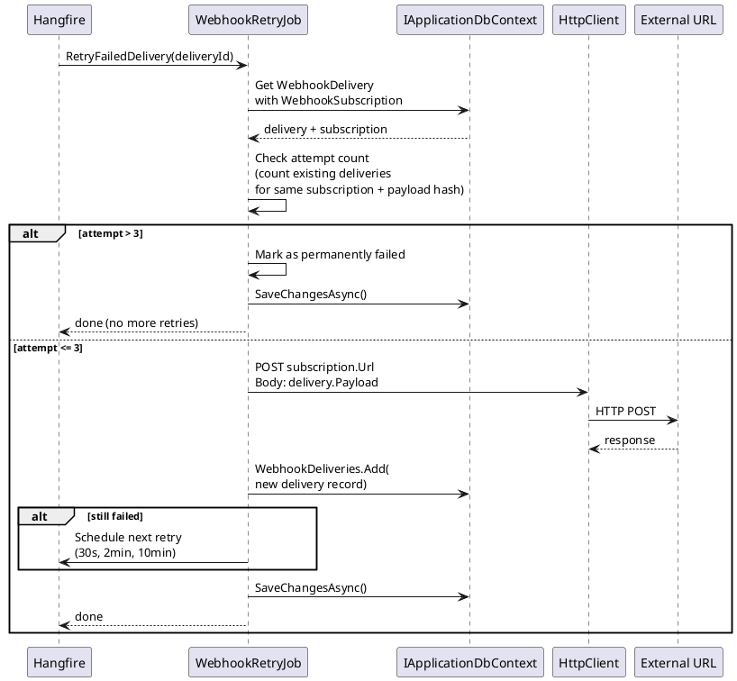

### Create Custom Code Injection (Pro Plan)

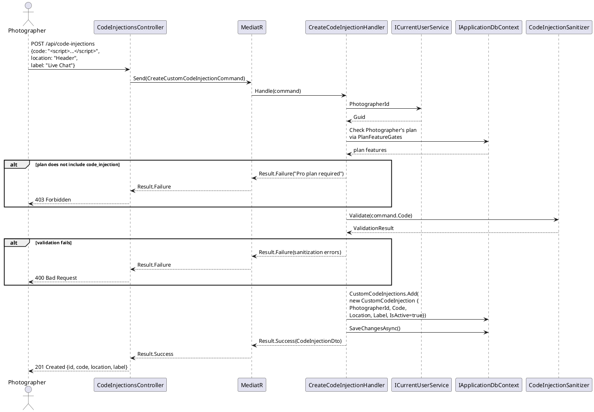

### Create API Key

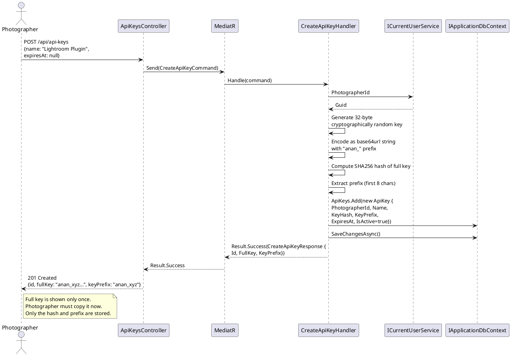

### REST API Template Access (API Key Auth)

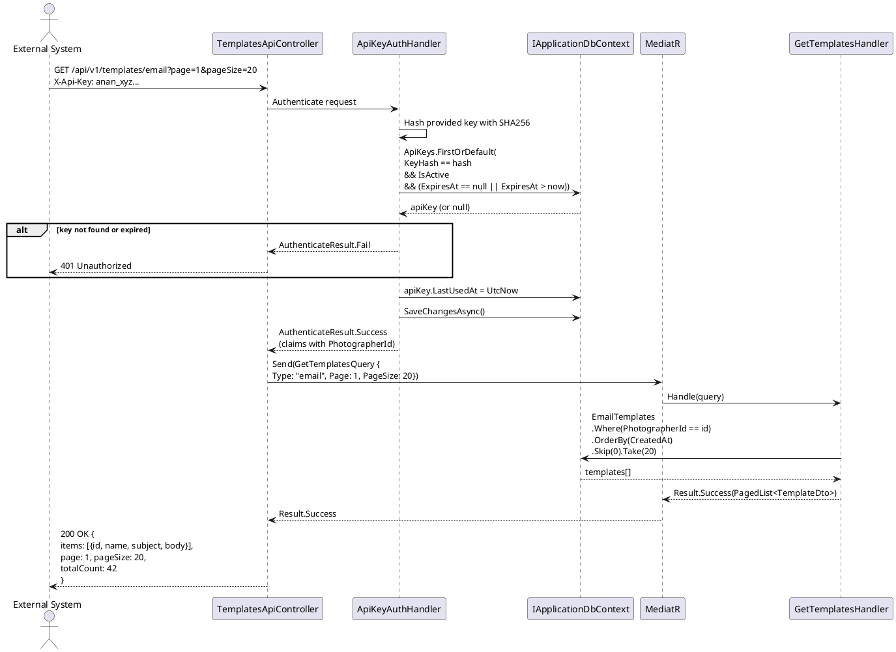

### Code Injection Rendering in Website Pipeline

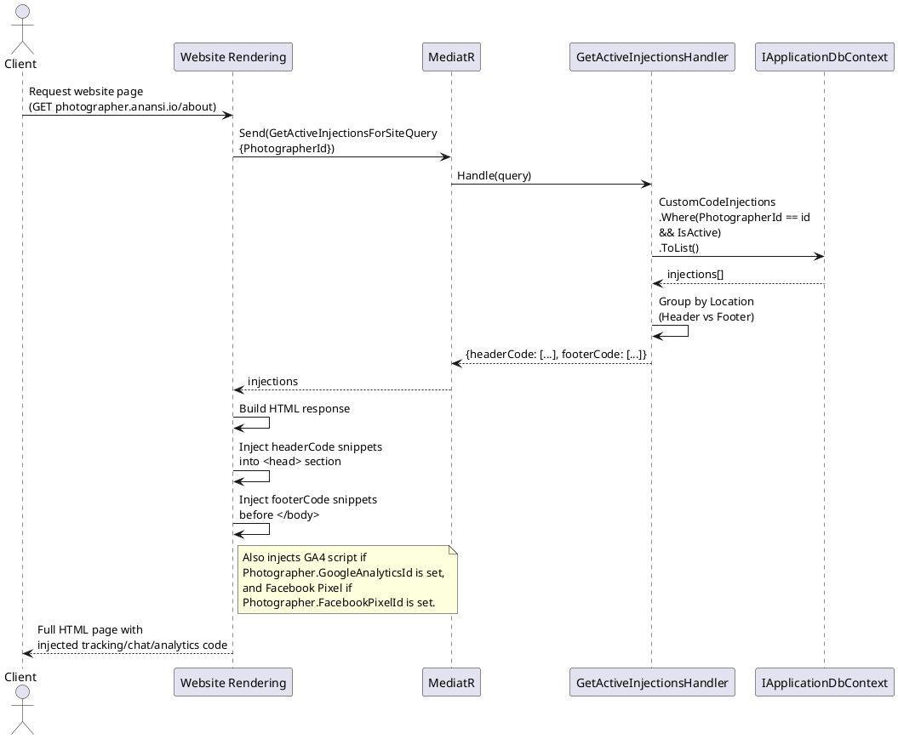
