# F44 - Design System & UI Components

## Overview

The Design System & UI Components feature defines the visual foundation for the entire Anansi platform. It establishes a comprehensive set of design tokens (colors, typography, spacing, corner radius) and shared UI components that every screen in the application consumes. Rather than being a traditional backend feature with CRUD operations, this feature produces a centralized token system, a component library, and the infrastructure to serve and theme these elements consistently across the web dashboard, client-facing pages, and mobile apps.

The design tokens codify the Elegant Luxury aesthetic: a dark palette anchored by page background `#1A1A1C`, card surface `#242426`, and gold accent `#C9A962`, with Cormorant Garamond for display typography and Inter for body/UI text. These tokens are expressed as CSS custom properties for the web, a JSON token file for the mobile apps, and C# constants for server-side rendering decisions (e.g., email templates). The spacing and radius scales are deliberately constrained to maintain visual consistency -- gaps range from 4px to 40px, padding from 4px to 32px, and corner radii from 16px to 34px.

The shared component catalog covers buttons (5 variants), form inputs (8 control types with 4 states each), cards (standard and metric variants), navigation (sidebar, top bar, mobile tab bar), data tables, badges, modals/dialogs, toasts, empty states, and loading indicators. Each component is documented with its token usage, responsive behavior, and interaction states. On the server side, a `DesignTokensController` serves the current token set as JSON so that client apps can dynamically theme themselves, and a `ComponentManifest` query returns metadata about all available components for the website builder's element toolbox.

**L2 Requirements:** DSN-12.1.1 (Color Tokens), DSN-12.1.2 (Typography Tokens), DSN-12.1.3 (Spacing Tokens), DSN-12.1.4 (Corner Radius Tokens), DSN-12.2.1 (Buttons), DSN-12.2.2 (Form Inputs), DSN-12.2.3 (Cards), DSN-12.2.4 (Navigation), DSN-12.2.5 (Tables), DSN-12.2.6 (Badges), DSN-12.2.7 (Modals/Dialogs), DSN-12.2.8 (Toasts), DSN-12.2.9 (Empty States), DSN-12.2.10 (Loading States), DSN-12.2.11 (Responsive Layouts), DSN-12.2.12 (System States)

---

## Components

### Domain Layer (Anansi.Domain)

| Component | Type | Description |
|-----------|------|-------------|
| `DesignToken` | Value Object | Immutable record representing a single design token with `Category` (Color, Typography, Spacing, Radius), `Key` (e.g., `color.page.bg`), `Value` (e.g., `#1A1A1C`), and optional `Description`. |
| `DesignTokenCategory` | Enum | `Color`, `Typography`, `Spacing`, `CornerRadius`. |
| `ComponentVariant` | Enum | `Primary`, `Secondary`, `Outline`, `Ghost`, `Destructive` (for buttons); `Success`, `Warning`, `Error`, `Info`, `Neutral` (for badges). |
| `InputState` | Enum | `Default`, `Focused`, `Error`, `Disabled`. |

### Application Layer (Anansi.Application)

| Component | Type | Description |
|-----------|------|-------------|
| `GetDesignTokensQuery` | Query | Returns the full design token set, optionally filtered by `DesignTokenCategory`. |
| `GetComponentManifestQuery` | Query | Returns metadata for all shared components: name, variants, supported props, and default values. Used by the website builder toolbox. |
| `DesignTokenDto` | DTO | `Category`, `Key`, `Value`, `Description`. |
| `ComponentManifestDto` | DTO | `ComponentName`, `Variants`, `Props`, `DefaultValues`, `ResponsiveBehavior`. |
| `DesignTokensProvider` | Service | Static provider that returns the canonical token set. Reads from an embedded JSON file or code constants. No database dependency. |

### Infrastructure Layer (Anansi.Infrastructure)

| Component | Type | Description |
|-----------|------|-------------|
| `DesignTokensProvider` | Service | Implements the token provider. Loads tokens from an embedded `design-tokens.json` resource file. Caches in memory. |

### API Layer (Anansi.Api)

| Component | Type | Description |
|-----------|------|-------------|
| `DesignTokensController` | Controller | `GET /api/design-tokens` returns the full token set as JSON. `GET /api/design-tokens/{category}` returns tokens filtered by category. Public endpoint (no auth required) so client apps can theme themselves. |
| `ComponentManifestController` | Controller | `GET /api/components/manifest` returns the component catalog metadata. Used by the website builder. |

### Frontend (Anansi.Web / Client Apps)

| Component | Type | Description |
|-----------|------|-------------|
| `tokens.css` | CSS File | CSS custom properties generated from the design token set. Imported at the root of the application. |
| `Button` | Component | Five variants (Primary, Secondary, Outline, Ghost, Destructive) with 20px border radius, disabled state at 0.4 opacity. |
| `FormInput` | Component | Text, Textarea, Select, Checkbox, Radio, Toggle, DatePicker. Four states: Default (border #3A3A3C), Focused (border #C9A962), Error (border red, message below), Disabled (0.4 opacity). |
| `Card` | Component | Header/Content/Actions slot layout. Metric variant for dashboard KPIs. Hover state with subtle border highlight. |
| `Sidebar` | Component | 260px width, dark background, collapsible on tablet/mobile. |
| `TopBar` | Component | 64px height, contains breadcrumbs, search, notifications, profile. |
| `MobileTabBar` | Component | 62px height, pill-shaped active indicator with 34px radius. Fixed bottom position. |
| `DataTable` | Component | Sortable column headers, hover rows, pagination footer. |
| `Badge` | Component | Success (#6E9E6E), Warning (amber), Error (red), Info (blue), Neutral (#4A4A4C). |
| `Modal` | Component | 70% overlay, max 560px width, confirmation and destructive variants. |
| `Toast` | Component | Top-right on desktop, top-center on mobile. Color bar on left. Auto-dismiss 5s. Max stack 3. |
| `EmptyState` | Component | Centered layout: icon + heading + description + CTA button. |
| `LoadingState` | Component | Skeleton pulse, gold spinner (#C9A962), progress bar. |

---

## Class Diagrams

### Domain -- Design Token Value Objects & Enums

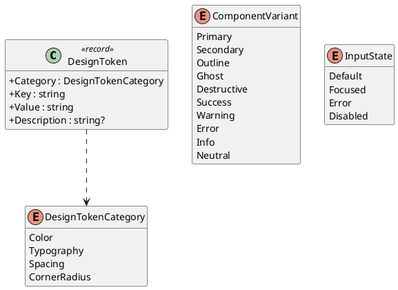

### Application -- Token Queries & DTOs

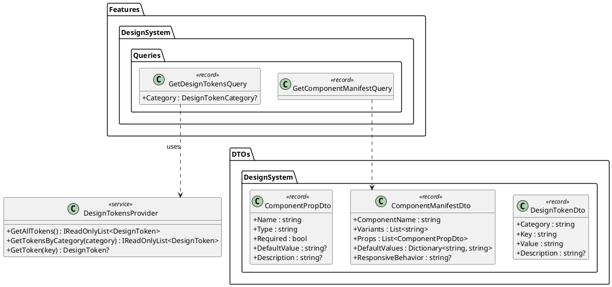

### Token Catalog -- Color Tokens

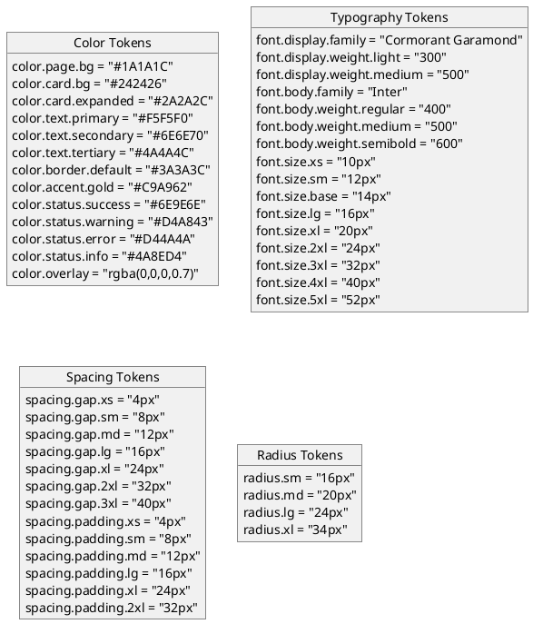

### Component Catalog -- Buttons & Form Inputs

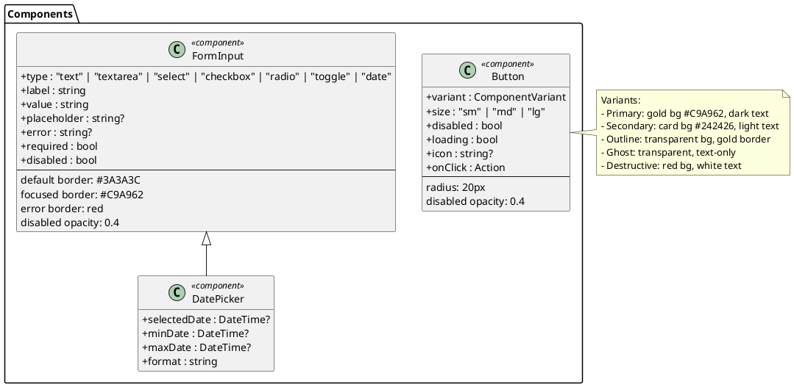

### Component Catalog -- Cards, Navigation & Data Display

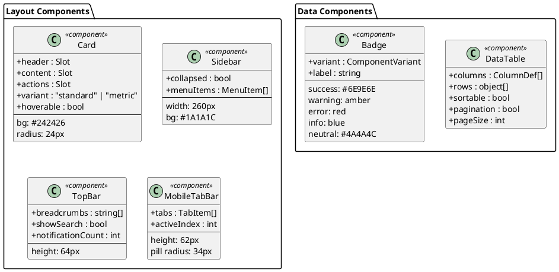

### Component Catalog -- Overlays & Feedback

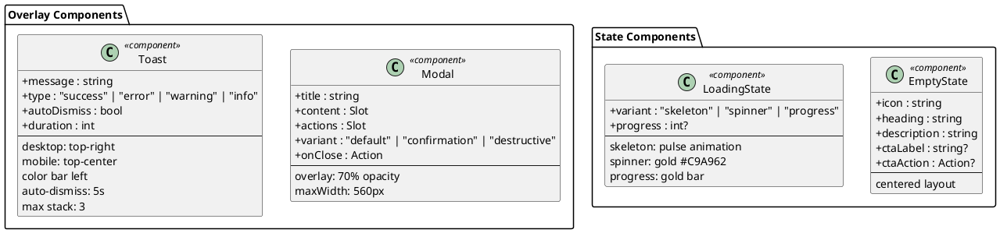

### API -- Design System Controllers

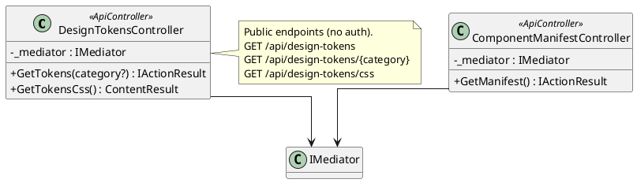

---

## Sequence Diagrams

### Load Design Tokens (Client App Initialization)

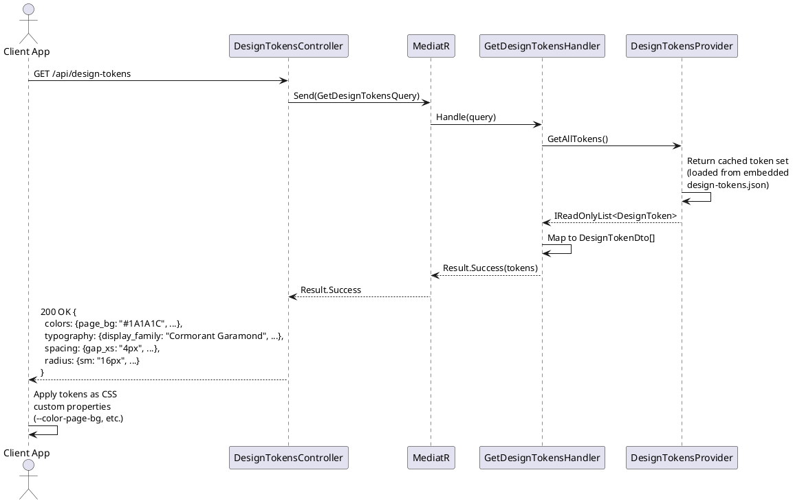

### Serve Design Tokens as CSS Custom Properties

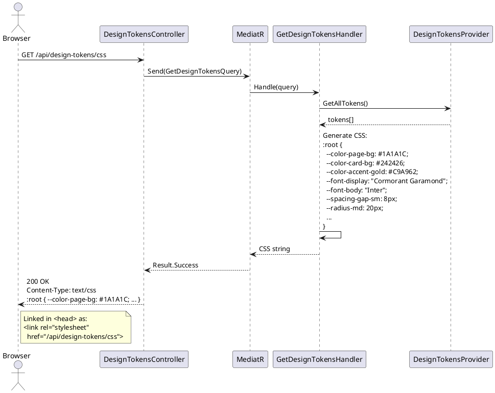

### Get Component Manifest (Website Builder Toolbox)

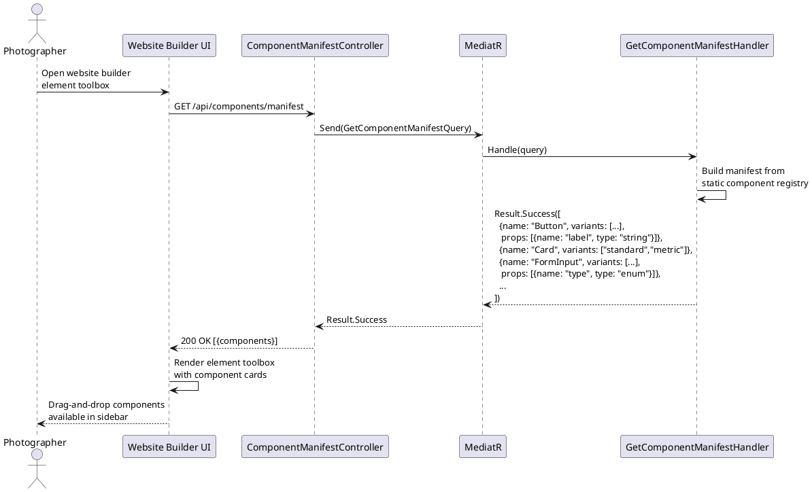

### Render Page with Responsive Token Application

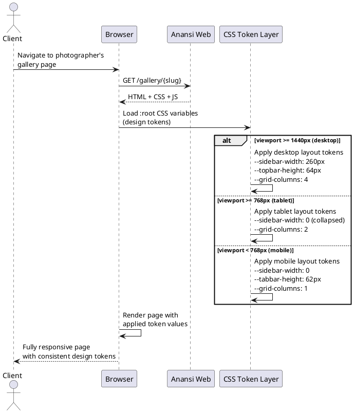

### Toast Notification Lifecycle

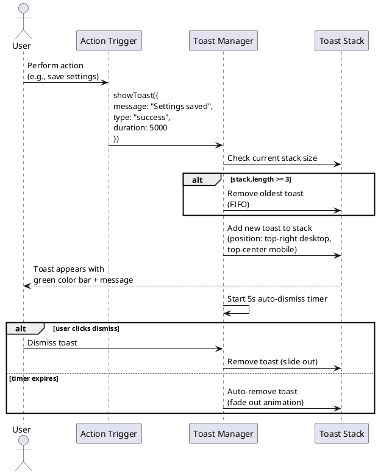

### Modal Confirmation Flow (Destructive Action)

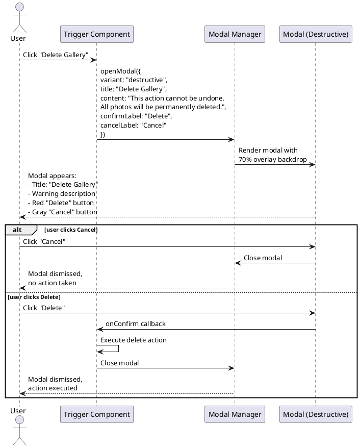
