# F45 - Data Security & Content Protection

## Overview

Data Security & Content Protection encompasses the platform-wide security infrastructure, gallery content protection mechanisms, responsive design enforcement, and media delivery optimization. This feature cuts across every layer of the application, establishing baseline security guarantees (TLS, PCI compliance, password hashing), then layering on photographer-controlled content protection (gallery passwords, download PINs, right-click suppression, server-side watermarks), and finally ensuring all client-facing pages are fully responsive and media is delivered efficiently through CDN and adaptive streaming.

On the security side, all connections are enforced at TLS 1.2+ via infrastructure configuration. Payment card data never touches Anansi servers -- Stripe handles all card processing in PCI DSS-compliant fashion, with Anansi only storing Stripe account IDs and payment intent references. Passwords are hashed using bcrypt (via ASP.NET Core Identity's default `PasswordHasher<T>` configured with a work factor of 12). Gallery password protection is implemented as a server-side gate: the API returns zero gallery content until the correct password is provided and validated. Download PINs are similarly validated server-side before generating download URLs.

Content protection includes right-click suppression (a JavaScript overlay that intercepts the browser context menu on all gallery images) and server-side watermarking (watermarks are composited onto images during thumbnail and display-size generation, not applied via CSS overlays, so they cannot be bypassed by disabling styles). Responsive design is enforced through the design token system (F44) with breakpoints at 1440px (desktop), 768px (tablet), and 402px (mobile), and touch interactions (swipe, pinch-to-zoom) are supported on gallery views. Media delivery uses a CDN for all photo assets, with server-side thumbnail generation, progressive loading (low-res placeholder then full resolution), adaptive bitrate video streaming, and Chromecast/AirPlay casting support for video galleries.

**L2 Requirements:** SEC-11.1.1 (TLS/PCI/Hashing), SEC-11.1.2 (Content Protection), UX-11.3.1 (Responsive Design), UX-11.3.2 (Touch Interactions), UX-11.3.3 (CDN/Progressive Loading), UX-11.3.4 (Chromecast/AirPlay)

---

## Components

### Domain Layer (Anansi.Domain)

| Component | Type | Description |
|-----------|------|-------------|
| `Collection` | Entity | Contains `Password` (nullable string, bcrypt-hashed), `DownloadPin` (nullable string), and `DownloadsEnabled` flag. The password gate prevents any gallery content from being served without authentication. |
| `GalleryMedia` | Entity | Contains `StorageKey` and `ThumbnailStorageKey` for CDN delivery. Watermarked display versions are derived at thumbnail generation time. |
| `Watermark` | Entity | Defines watermark settings (text/image, opacity, scale, position) applied server-side during image processing. |
| `Collection.ClientExclusivePassword` | Property | Separate password for expanded client-only visibility (more photos than the general password provides). |

### Application Layer (Anansi.Application)

| Component | Type | Description |
|-----------|------|-------------|
| `ValidateGalleryPasswordCommand` | Command | Accepts a collection ID and password attempt. Verifies the password hash. On success, issues a short-lived gallery access token (JWT scoped to that collection). Returns 401 on failure with no content leak. |
| `ValidateDownloadPinCommand` | Command | Accepts a collection ID and PIN attempt. Verifies server-side. On success, authorizes the download request. |
| `GetGalleryMediaQuery` | Query | Returns gallery media only if the caller has a valid gallery access token (from password validation) or the collection has no password. Includes CDN URLs for progressive loading. |
| `GenerateWatermarkedImageCommand` | Command | Triggers server-side watermark compositing on a source image using the photographer's `Watermark` settings. Returns the watermarked CDN URL. |
| `GetProgressiveImageSetQuery` | Query | Returns placeholder, low-res, and full-res URLs for a given media item via `ICdnService`. |
| `GetAdaptiveVideoStreamQuery` | Query | Returns HLS/DASH manifest URLs for adaptive bitrate video streaming. |
| `ICdnService` | Interface | `GetCdnUrlAsync`, `GenerateThumbnailAsync`, `GenerateProgressiveImagesAsync`, `InvalidateCacheAsync`. |
| `IStorageService` | Interface | File upload/download/delete and pre-signed URL generation for secure direct downloads. |
| `IWatermarkService` | Interface | `ApplyWatermarkAsync(sourceKey, watermarkSettings)` -- composites watermark onto image server-side, returns watermarked storage key. |

### Infrastructure Layer (Anansi.Infrastructure)

| Component | Type | Description |
|-----------|------|-------------|
| `CdnService` | Service | Implements `ICdnService`. Integrates with CloudFront or Azure CDN. Generates signed URLs with expiration. Generates thumbnail variants at multiple sizes. Produces progressive image sets (placeholder blur-up, low-res, full-res). |
| `WatermarkService` | Service | Implements `IWatermarkService`. Uses ImageSharp (SixLabors) to composite text or image watermarks onto photos at the configured position, opacity, and scale. Outputs are cached in storage for subsequent requests. |
| `AdaptiveVideoService` | Service | Transcodes uploaded videos into HLS segments with multiple quality levels (480p, 720p, 1080p, 4K). Generates DASH/HLS manifests. |
| `TlsEnforcementMiddleware` | Middleware | Redirects HTTP to HTTPS and sets HSTS headers. Enforces minimum TLS 1.2. |
| `SecurityHeadersMiddleware` | Middleware | Adds `X-Content-Type-Options: nosniff`, `X-Frame-Options: DENY`, `X-XSS-Protection`, `Referrer-Policy`, `Content-Security-Policy` headers. |
| `GalleryAccessTokenService` | Service | Issues and validates short-lived JWTs scoped to a specific collection ID. Tokens expire after 1 hour and contain the access level (password vs. client-exclusive). |

### API Layer (Anansi.Api)

| Component | Type | Description |
|-----------|------|-------------|
| `GalleryAccessController` | Controller | `POST /api/galleries/{id}/authenticate` accepts password, returns gallery access token. `POST /api/galleries/{id}/validate-pin` validates download PIN. |
| `GalleryMediaController` | Controller | `GET /api/galleries/{id}/media` returns media list with CDN URLs. Requires valid gallery access token for password-protected collections. |
| `ContentProtectionMiddleware` | Middleware | For client-facing gallery pages, injects the right-click suppression JavaScript and watermark display logic. |

### Frontend (Client-Facing Gallery)

| Component | Type | Description |
|-----------|------|-------------|
| `RightClickProtection` | JS Module | Intercepts `contextmenu` events on gallery images, preventing the browser context menu from appearing. Also intercepts drag events. |
| `ProgressiveImageLoader` | JS Module | Loads a tiny placeholder image first, then swaps in the low-res version, then loads the full-res version in the background. Uses IntersectionObserver for lazy loading. |
| `TouchGestureHandler` | JS Module | Handles swipe (horizontal navigation between photos), pinch-to-zoom (on lightbox view), and tap-to-dismiss gestures. |
| `CastButton` | JS Component | Detects Chromecast and AirPlay compatible devices. Shows a cast icon when available. Uses the Google Cast SDK and WebKit AirPlay API. |
| `AdaptiveVideoPlayer` | JS Component | HLS.js-based video player with quality level selector. Falls back to native HLS on Safari. Exposes Chromecast/AirPlay cast targets. |

---

## Class Diagrams

### Domain -- Security-Related Entity Fields

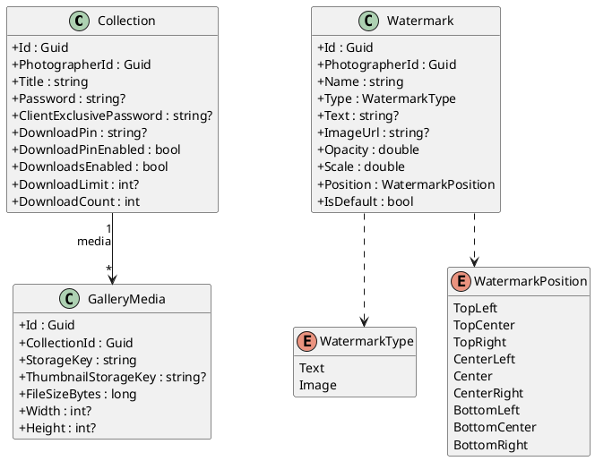

### Application -- Security Commands & Queries

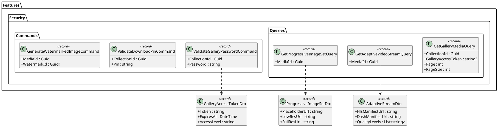

### Application -- Service Interfaces

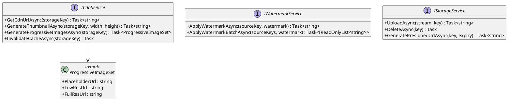

### Infrastructure -- Security Services

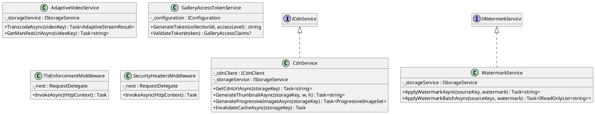

### API -- Security Controllers

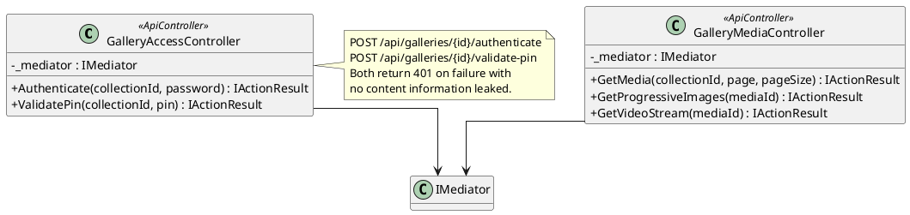

---

## Sequence Diagrams

### Gallery Password Authentication (Content Gate)

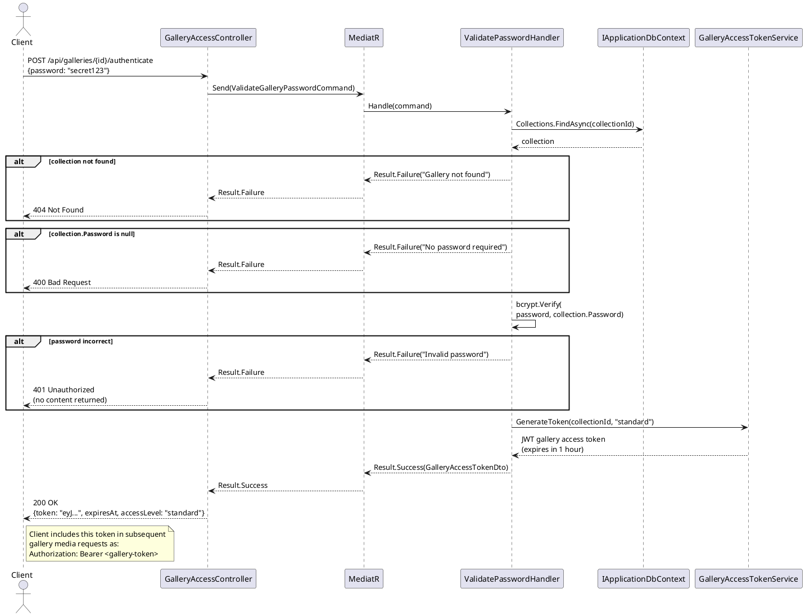

### Download PIN Validation

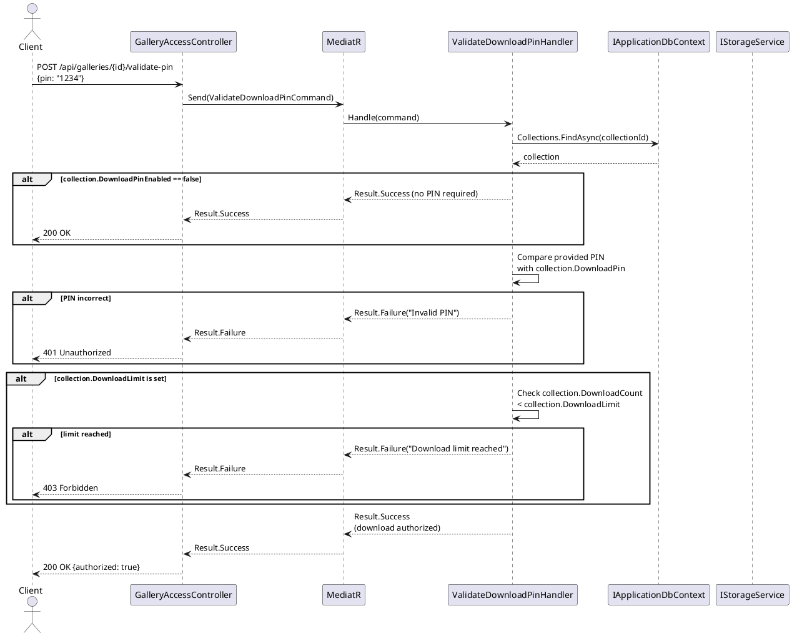

### Server-Side Watermark Application

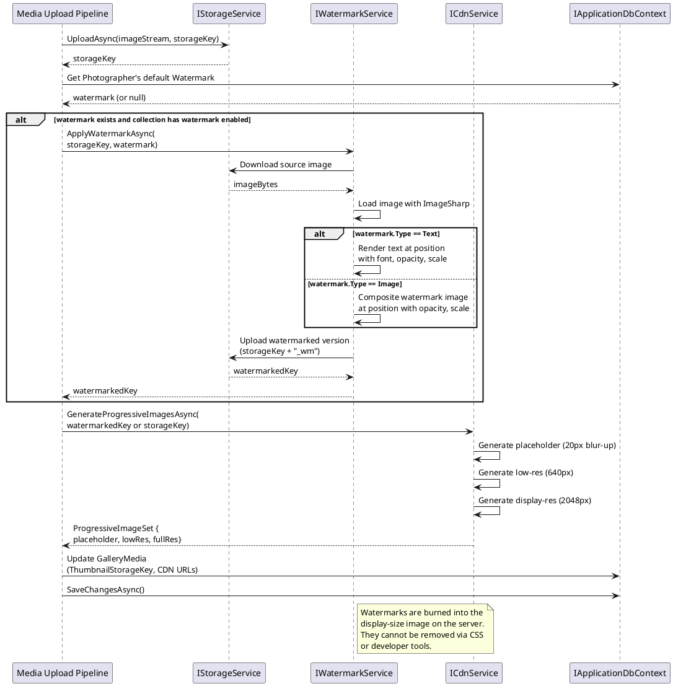

### Progressive Image Loading (Client-Side)

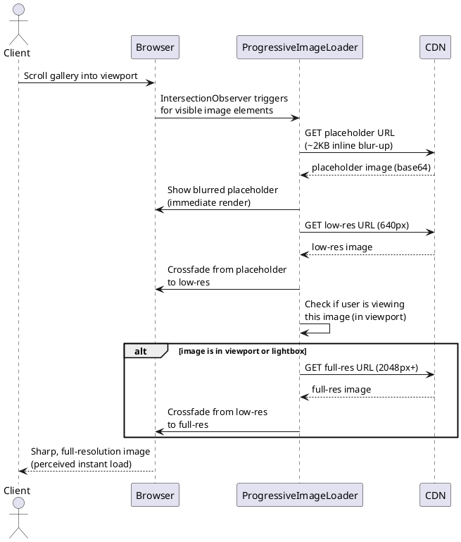

### Adaptive Video Streaming with Cast Support

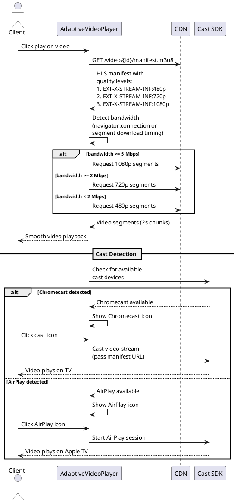

### Right-Click Protection on Gallery Images

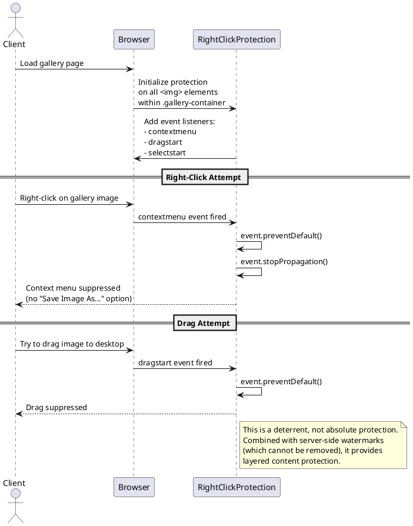

### TLS & Security Headers Enforcement

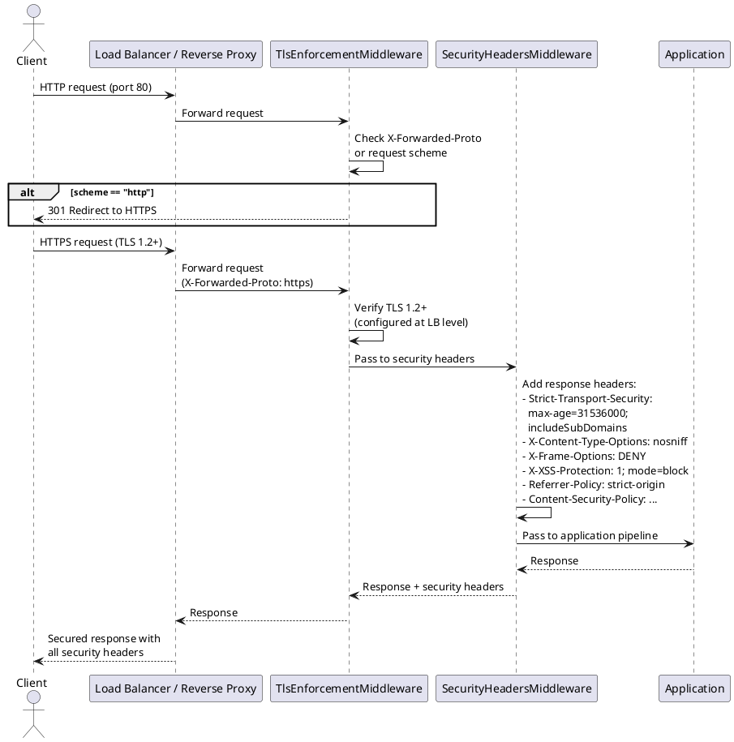

