# F46 - Interac e-Transfer Integration

## Overview

This feature adds Interac e-Transfer as a Canadian payment method across the Anansi platform. Photographers can generate Interac payment requests directly from invoices, each with a unique reference code in the format "ANANSI-INV-XXXX". When a client sends the e-Transfer outside the platform, the photographer manually confirms receipt within Anansi, which reconciles the payment by creating a `PaymentRecord`, updating the invoice's `PaidCents`, and transitioning its status to `Paid` or `PartiallyPaid`. Payment requests are tracked through a `Pending`, `Completed`, `Expired` lifecycle, with a paginated list filterable by status.

A background job runs on a recurring schedule to automatically expire stale payment requests that have passed their `ExpiryDate`. Photographers configure their Interac email address and enable/disable the feature through a dedicated settings endpoint. When enabled, clients see Interac e-Transfer as a payment option during store checkout -- the system creates the order with `PaymentMethod = InteracETransfer`, generates a reference code, and displays the photographer's Interac email along with payment instructions. The order remains in `Pending` status until the photographer confirms receipt.

The integration is intentionally manual on the reconciliation side, reflecting how Interac e-Transfer works in practice: the actual money movement happens through the banking system, and Anansi tracks the request/confirmation lifecycle. This keeps the implementation simple while providing photographers with a familiar Canadian payment rail that avoids credit card processing fees.

**L2 Requirements:** INT-20.1.1 (Create Payment Request), INT-20.1.2 (Confirm Payment), INT-20.1.3 (List Payment Requests), INT-20.1.4 (Background Expiry), INT-20.2.1 (Interac Settings), INT-20.2.2 (Store Checkout with Interac)

---

## Components

### Domain Layer

| Component | Type | Description |
|-----------|------|-------------|
| `InteracPaymentRequest` | Entity | Tracks an Interac e-Transfer payment request. Contains `InvoiceId`, `OrderId` (nullable, for store orders), `PaymentReference` (unique "ANANSI-INV-XXXX" code), `AmountCents`, `RecipientEmail`, `Status`, `ExpiryDate`, `ConfirmedAt`. Implements `ITenantEntity`, `IAuditableEntity`. |
| `InteracPaymentRequestStatus` | Enum | `Pending`, `Completed`, `Expired`. |
| `InteracSettings` | Entity | Photographer's Interac configuration: `InteracEmail`, `IsEnabled`. Implements `ITenantEntity`. One record per photographer. |
| `PaymentMethod` | Enum (existing, extended) | Extended with `InteracETransfer` value alongside existing methods. |

### Application Layer

| Component | Type | Description |
|-----------|------|-------------|
| `CreateInteracPaymentRequestCommand` | Command | Creates a payment request from an invoice. Generates unique "ANANSI-INV-XXXX" reference code, calculates expiry date (default 30 days), loads photographer's Interac email. Returns 201 with `paymentReference`, `amount`, `recipientEmail`, `expiryDate` (INT-20.1.1). |
| `ConfirmInteracPaymentCommand` | Command | Confirms receipt of an Interac payment. Transitions request to `Completed`, creates `PaymentRecord` with `PaymentMethod = InteracETransfer`, updates invoice `PaidCents` and status (INT-20.1.2). |
| `ListInteracPaymentRequestsQuery` | Query | Paginated list of payment requests filtered by `Status`. Ordered by `CreatedAt` descending (INT-20.1.3). |
| `ExpireStaleInteracRequestsCommand` | Command | Background job command: finds all `Pending` requests past their `ExpiryDate` and transitions them to `Expired` (INT-20.1.4). |
| `UpdateInteracSettingsCommand` | Command | Upserts the photographer's `InteracSettings`: sets `InteracEmail` and `IsEnabled` flag (INT-20.2.1). |
| `GetInteracSettingsQuery` | Query | Returns the photographer's current Interac configuration (INT-20.2.1). |
| `CreateStoreOrderWithInteracCommand` | Command | Store checkout with `PaymentMethod = InteracETransfer`. Creates the order in `Pending` status, generates an `InteracPaymentRequest`, returns the payment reference and photographer's Interac email (INT-20.2.2). |
| `InteracPaymentRequestDto` | DTO | Read model: `Id`, `InvoiceId`, `OrderId`, `PaymentReference`, `AmountCents`, `RecipientEmail`, `Status`, `ExpiryDate`, `ConfirmedAt`, `CreatedAt`. |
| `InteracSettingsDto` | DTO | Read model: `InteracEmail`, `IsEnabled`. |
| `InteracCheckoutResultDto` | DTO | Store checkout result: `OrderId`, `PaymentReference`, `AmountCents`, `InteracEmail`, `Instructions`. |
| `InteracPaymentRequestValidator` | Validator | FluentValidation: validates `InvoiceId` exists, invoice is in payable status, photographer has Interac enabled, and Interac email is configured. |

### Infrastructure Layer

| Component | Type | Description |
|-----------|------|-------------|
| `CreateInteracPaymentRequestHandler` | Handler | Loads invoice and photographer settings, validates Interac is enabled, generates unique reference code using sequential counter + random suffix, creates `InteracPaymentRequest`, persists. |
| `ConfirmInteracPaymentHandler` | Handler | Loads request and linked invoice, validates request is `Pending`, creates `PaymentRecord` with `IsOffline = false` and `PaymentMethod = InteracETransfer`, updates invoice `PaidCents`, transitions invoice status. |
| `ExpireStaleInteracRequestsHandler` | Handler | Queries `InteracPaymentRequests` where `Status = Pending AND ExpiryDate < UtcNow`, batch-updates to `Expired`. |
| `InteracExpiryBackgroundJob` | Background Job | Recurring job (runs hourly) dispatching `ExpireStaleInteracRequestsCommand`. |
| `CreateStoreOrderWithInteracHandler` | Handler | Creates `Order` with `PaymentMethod = InteracETransfer` and `Status = Pending`, creates linked `InteracPaymentRequest`, returns checkout result with instructions. |

### API Layer

| Component | Type | Description |
|-----------|------|-------------|
| `InteracController` | Controller | Authenticated endpoints: `POST /api/interac/payment-requests` (create request from invoice), `POST /api/interac/payment-requests/{id}/confirm` (confirm receipt), `GET /api/interac/payment-requests` (list with status filter). |
| `InteracSettingsController` | Controller | Authenticated endpoints: `PUT /api/settings/interac` (update settings), `GET /api/settings/interac` (get settings). |
| `StoreCheckoutController` | Controller (extended) | Extended checkout endpoint: `POST /api/store/checkout` with `paymentMethod = InteracETransfer` routes to `CreateStoreOrderWithInteracCommand`. |

---

## Class Diagrams

### Domain Layer -- Interac Entities

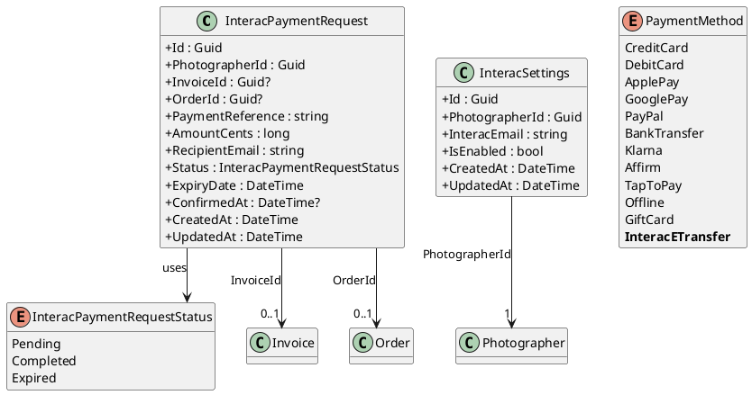
```plantuml
@startuml
skinparam classAttributeIconSize 0
skinparam linetype ortho
hide empty methods

class InteracPaymentRequest {
  +Id : Guid
  +PhotographerId : Guid
  +InvoiceId : Guid?
  +OrderId : Guid?
  +PaymentReference : string
  +AmountCents : long
  +RecipientEmail : string
  +Status : InteracPaymentRequestStatus
  +ExpiryDate : DateTime
  +ConfirmedAt : DateTime?
  +CreatedAt : DateTime
  +UpdatedAt : DateTime
}

class InteracSettings {
  +Id : Guid
  +PhotographerId : Guid
  +InteracEmail : string
  +IsEnabled : bool
  +CreatedAt : DateTime
  +UpdatedAt : DateTime
}

enum InteracPaymentRequestStatus {
  Pending
  Completed
  Expired
}

enum PaymentMethod {
  CreditCard
  DebitCard
  ApplePay
  GooglePay
  PayPal
  BankTransfer
  Klarna
  Affirm
  TapToPay
  Offline
  GiftCard
  **InteracETransfer**
}

InteracPaymentRequest --> InteracPaymentRequestStatus : uses
InteracPaymentRequest --> "0..1" Invoice : InvoiceId
InteracPaymentRequest --> "0..1" Order : OrderId
InteracSettings --> "1" Photographer : PhotographerId
@enduml
```

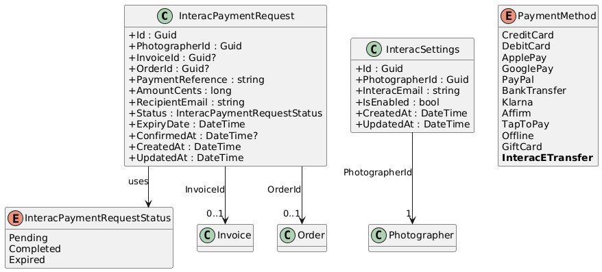

### Application Layer -- Interac Commands

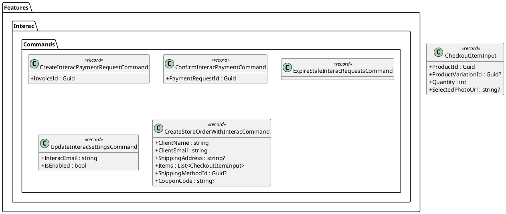
```plantuml
@startuml
skinparam classAttributeIconSize 0
skinparam linetype ortho
hide empty methods

package "Features.Interac.Commands" {
  class CreateInteracPaymentRequestCommand <<record>> {
    +InvoiceId : Guid
  }

  class ConfirmInteracPaymentCommand <<record>> {
    +PaymentRequestId : Guid
  }

  class ExpireStaleInteracRequestsCommand <<record>>

  class UpdateInteracSettingsCommand <<record>> {
    +InteracEmail : string
    +IsEnabled : bool
  }

  class CreateStoreOrderWithInteracCommand <<record>> {
    +ClientName : string
    +ClientEmail : string
    +ShippingAddress : string?
    +Items : List<CheckoutItemInput>
    +ShippingMethodId : Guid?
    +CouponCode : string?
  }
}

class CheckoutItemInput <<record>> {
  +ProductId : Guid
  +ProductVariationId : Guid?
  +Quantity : int
  +SelectedPhotoUrl : string?
}
@enduml
```

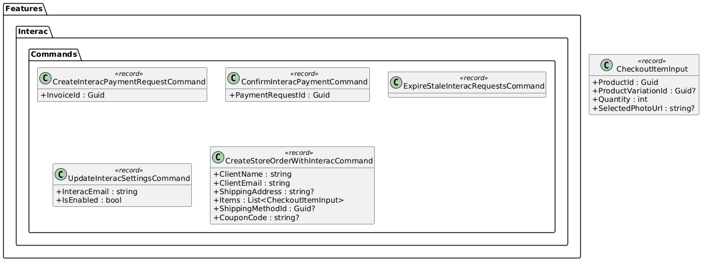

### Application Layer -- Interac Queries & DTOs

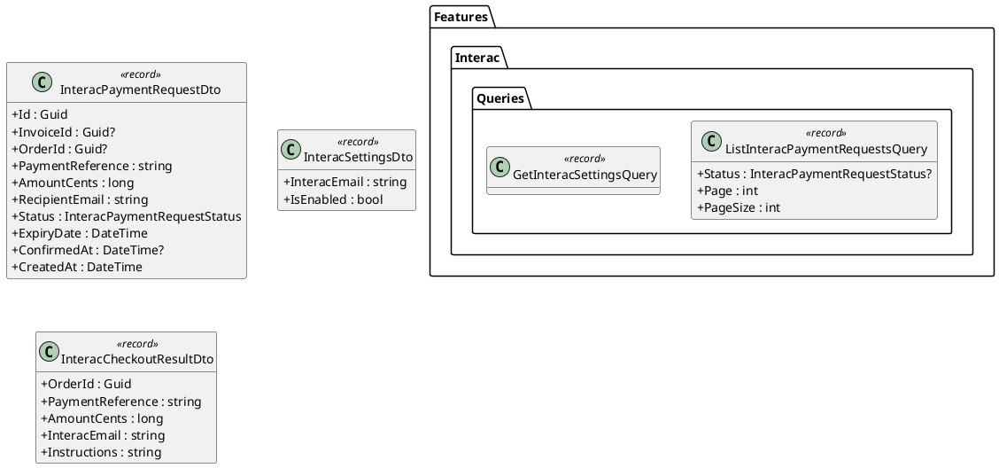
```plantuml
@startuml
skinparam classAttributeIconSize 0
skinparam linetype ortho
hide empty methods

package "Features.Interac.Queries" {
  class ListInteracPaymentRequestsQuery <<record>> {
    +Status : InteracPaymentRequestStatus?
    +Page : int
    +PageSize : int
  }

  class GetInteracSettingsQuery <<record>>
}

class InteracPaymentRequestDto <<record>> {
  +Id : Guid
  +InvoiceId : Guid?
  +OrderId : Guid?
  +PaymentReference : string
  +AmountCents : long
  +RecipientEmail : string
  +Status : InteracPaymentRequestStatus
  +ExpiryDate : DateTime
  +ConfirmedAt : DateTime?
  +CreatedAt : DateTime
}

class InteracSettingsDto <<record>> {
  +InteracEmail : string
  +IsEnabled : bool
}

class InteracCheckoutResultDto <<record>> {
  +OrderId : Guid
  +PaymentReference : string
  +AmountCents : long
  +InteracEmail : string
  +Instructions : string
}
@enduml
```

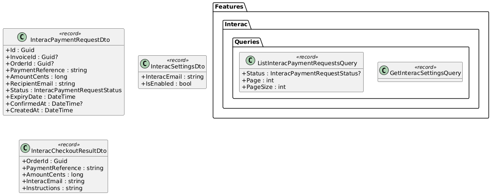

### API Layer -- Interac Controllers

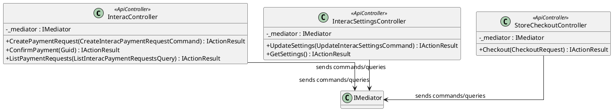
```plantuml
@startuml
skinparam classAttributeIconSize 0
skinparam linetype ortho
hide empty methods

class InteracController <<ApiController>> {
  -_mediator : IMediator
  +CreatePaymentRequest(CreateInteracPaymentRequestCommand) : IActionResult
  +ConfirmPayment(Guid) : IActionResult
  +ListPaymentRequests(ListInteracPaymentRequestsQuery) : IActionResult
}

class InteracSettingsController <<ApiController>> {
  -_mediator : IMediator
  +UpdateSettings(UpdateInteracSettingsCommand) : IActionResult
  +GetSettings() : IActionResult
}

class StoreCheckoutController <<ApiController>> {
  -_mediator : IMediator
  +Checkout(CheckoutRequest) : IActionResult
}

InteracController --> "IMediator" : sends commands/queries
InteracSettingsController --> "IMediator" : sends commands/queries
StoreCheckoutController --> "IMediator" : sends commands/queries
@enduml
```

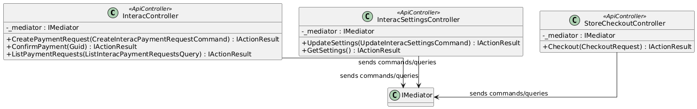

---

## Sequence Diagrams

### Create Interac Payment Request from Invoice

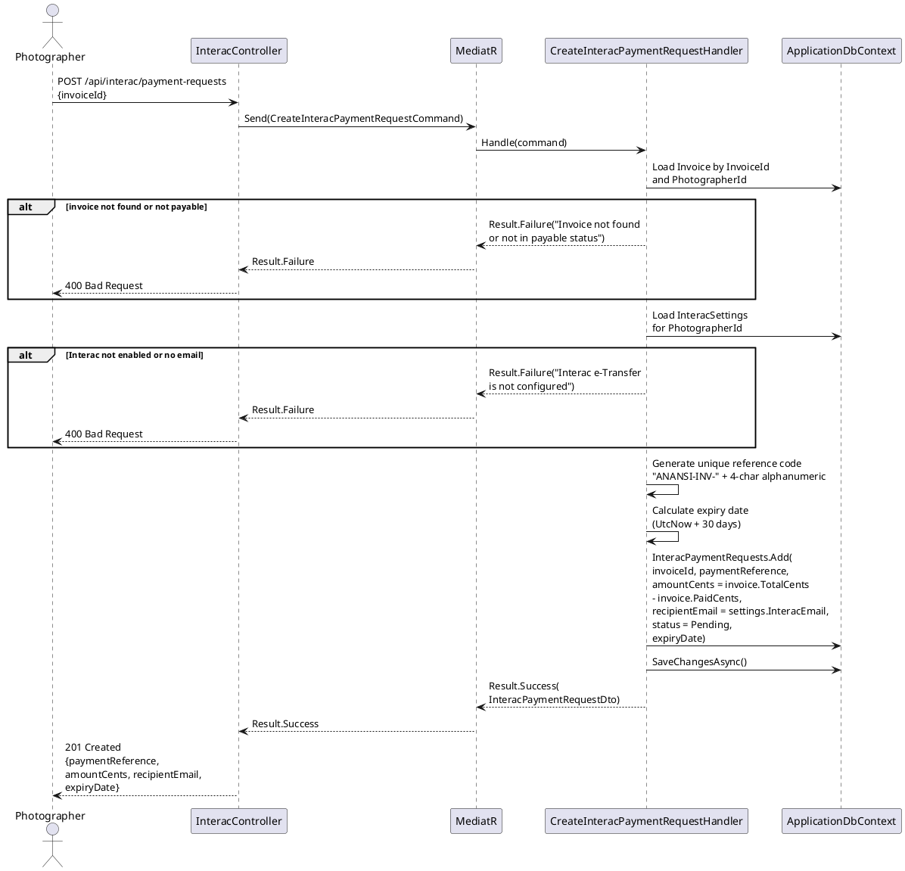
```plantuml
@startuml
actor Photographer as P
participant "InteracController" as IC
participant "MediatR" as M
participant "CreateInteracPaymentRequestHandler" as CH
participant "ApplicationDbContext" as DB

P -> IC : POST /api/interac/payment-requests\n{invoiceId}
IC -> M : Send(CreateInteracPaymentRequestCommand)
M -> CH : Handle(command)

CH -> DB : Load Invoice by InvoiceId\nand PhotographerId
alt invoice not found or not payable
  CH --> M : Result.Failure("Invoice not found\nor not in payable status")
  M --> IC : Result.Failure
  IC --> P : 400 Bad Request
end

CH -> DB : Load InteracSettings\nfor PhotographerId
alt Interac not enabled or no email
  CH --> M : Result.Failure("Interac e-Transfer\nis not configured")
  M --> IC : Result.Failure
  IC --> P : 400 Bad Request
end

CH -> CH : Generate unique reference code\n"ANANSI-INV-" + 4-char alphanumeric

CH -> CH : Calculate expiry date\n(UtcNow + 30 days)

CH -> DB : InteracPaymentRequests.Add(\ninvoiceId, paymentReference,\namountCents = invoice.TotalCents\n- invoice.PaidCents,\nrecipientEmail = settings.InteracEmail,\nstatus = Pending,\nexpiryDate)

CH -> DB : SaveChangesAsync()

CH --> M : Result.Success(\nInteracPaymentRequestDto)
M --> IC : Result.Success
IC --> P : 201 Created\n{paymentReference,\namountCents, recipientEmail,\nexpiryDate}
@enduml
```

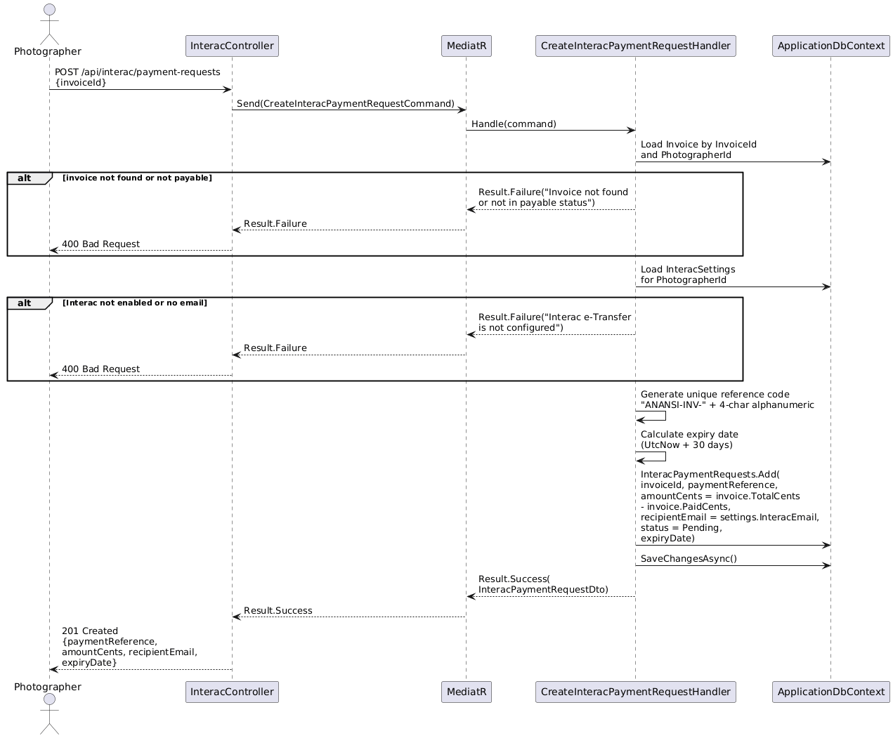

### Confirm Interac Payment Receipt

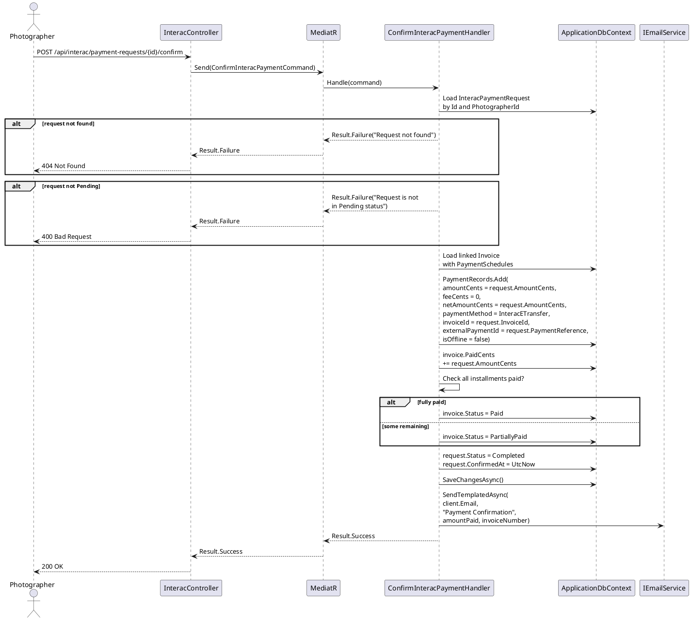
```plantuml
@startuml
actor Photographer as P
participant "InteracController" as IC
participant "MediatR" as M
participant "ConfirmInteracPaymentHandler" as CH
participant "ApplicationDbContext" as DB
participant "IEmailService" as ES

P -> IC : POST /api/interac/payment-requests/{id}/confirm
IC -> M : Send(ConfirmInteracPaymentCommand)
M -> CH : Handle(command)

CH -> DB : Load InteracPaymentRequest\nby Id and PhotographerId
alt request not found
  CH --> M : Result.Failure("Request not found")
  M --> IC : Result.Failure
  IC --> P : 404 Not Found
end

alt request not Pending
  CH --> M : Result.Failure("Request is not\nin Pending status")
  M --> IC : Result.Failure
  IC --> P : 400 Bad Request
end

CH -> DB : Load linked Invoice\nwith PaymentSchedules

CH -> DB : PaymentRecords.Add(\namountCents = request.AmountCents,\nfeeCents = 0,\nnetAmountCents = request.AmountCents,\npaymentMethod = InteracETransfer,\ninvoiceId = request.InvoiceId,\nexternalPaymentId = request.PaymentReference,\nisOffline = false)

CH -> DB : invoice.PaidCents\n+= request.AmountCents

CH -> CH : Check all installments paid?
alt fully paid
  CH -> DB : invoice.Status = Paid
else some remaining
  CH -> DB : invoice.Status = PartiallyPaid
end

CH -> DB : request.Status = Completed\nrequest.ConfirmedAt = UtcNow

CH -> DB : SaveChangesAsync()

CH -> ES : SendTemplatedAsync(\nclient.Email,\n"Payment Confirmation",\namountPaid, invoiceNumber)

CH --> M : Result.Success
M --> IC : Result.Success
IC --> P : 200 OK
@enduml
```

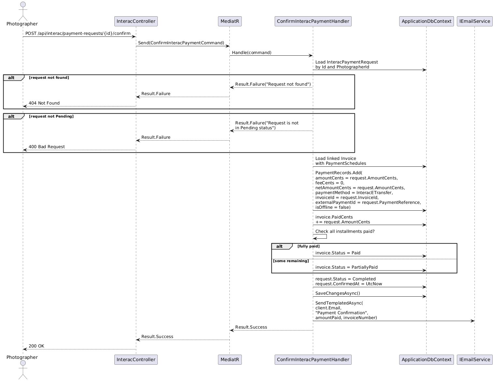

### List Interac Payment Requests

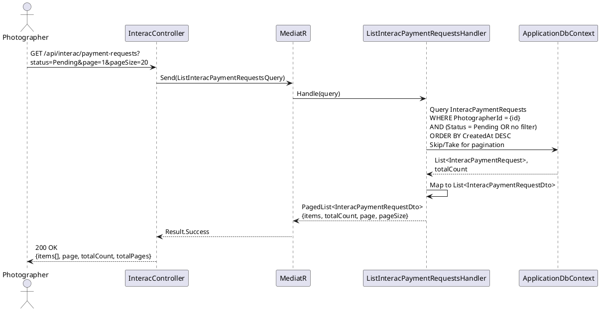
```plantuml
@startuml
actor Photographer as P
participant "InteracController" as IC
participant "MediatR" as M
participant "ListInteracPaymentRequestsHandler" as LH
participant "ApplicationDbContext" as DB

P -> IC : GET /api/interac/payment-requests?\nstatus=Pending&page=1&pageSize=20
IC -> M : Send(ListInteracPaymentRequestsQuery)
M -> LH : Handle(query)

LH -> DB : Query InteracPaymentRequests\nWHERE PhotographerId = {id}\nAND (Status = Pending OR no filter)\nORDER BY CreatedAt DESC\nSkip/Take for pagination

DB --> LH : List<InteracPaymentRequest>,\ntotalCount

LH -> LH : Map to List<InteracPaymentRequestDto>

LH --> M : PagedList<InteracPaymentRequestDto>\n{items, totalCount, page, pageSize}
M --> IC : Result.Success
IC --> P : 200 OK\n{items[], page, totalCount, totalPages}
@enduml
```

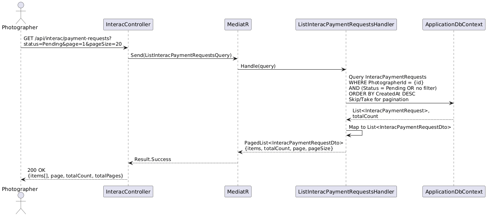

### Background Expiry of Stale Requests

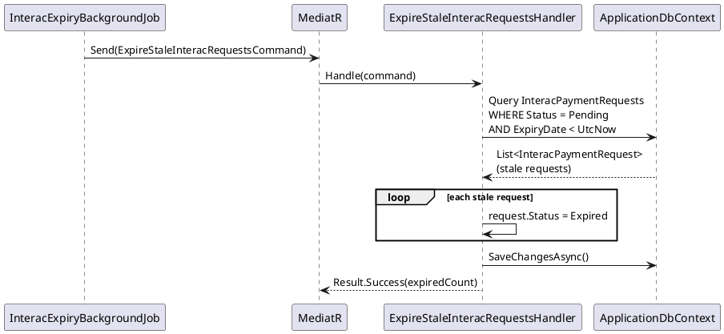
```plantuml
@startuml
participant "InteracExpiryBackgroundJob" as JOB
participant "MediatR" as M
participant "ExpireStaleInteracRequestsHandler" as EH
participant "ApplicationDbContext" as DB

JOB -> M : Send(ExpireStaleInteracRequestsCommand)
M -> EH : Handle(command)

EH -> DB : Query InteracPaymentRequests\nWHERE Status = Pending\nAND ExpiryDate < UtcNow

DB --> EH : List<InteracPaymentRequest>\n(stale requests)

loop each stale request
  EH -> EH : request.Status = Expired
end

EH -> DB : SaveChangesAsync()
EH --> M : Result.Success(expiredCount)
@enduml
```

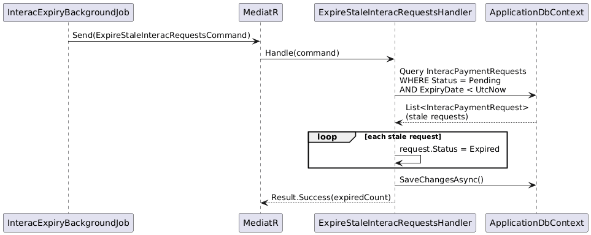

### Update Interac Settings

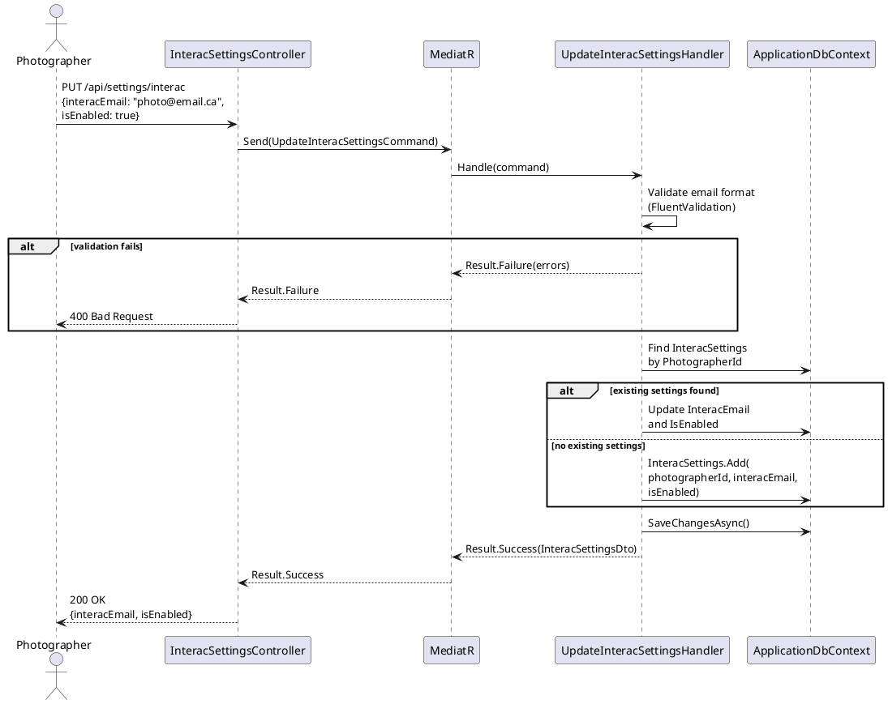
```plantuml
@startuml
actor Photographer as P
participant "InteracSettingsController" as ISC
participant "MediatR" as M
participant "UpdateInteracSettingsHandler" as USH
participant "ApplicationDbContext" as DB

P -> ISC : PUT /api/settings/interac\n{interacEmail: "photo@email.ca",\nisEnabled: true}
ISC -> M : Send(UpdateInteracSettingsCommand)
M -> USH : Handle(command)

USH -> USH : Validate email format\n(FluentValidation)
alt validation fails
  USH --> M : Result.Failure(errors)
  M --> ISC : Result.Failure
  ISC --> P : 400 Bad Request
end

USH -> DB : Find InteracSettings\nby PhotographerId
alt existing settings found
  USH -> DB : Update InteracEmail\nand IsEnabled
else no existing settings
  USH -> DB : InteracSettings.Add(\nphotographerId, interacEmail,\nisEnabled)
end

USH -> DB : SaveChangesAsync()
USH --> M : Result.Success(InteracSettingsDto)
M --> ISC : Result.Success
ISC --> P : 200 OK\n{interacEmail, isEnabled}
@enduml
```

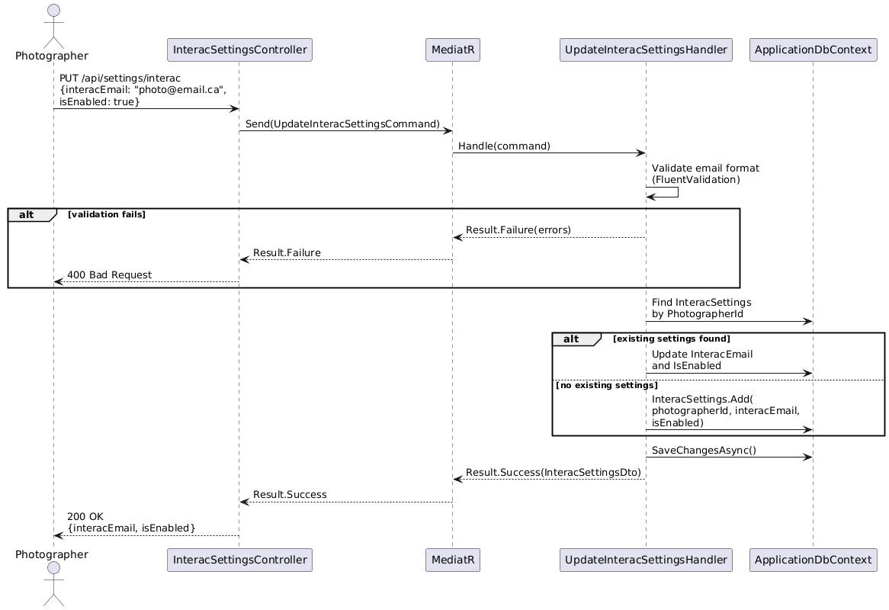

### Store Checkout with Interac e-Transfer

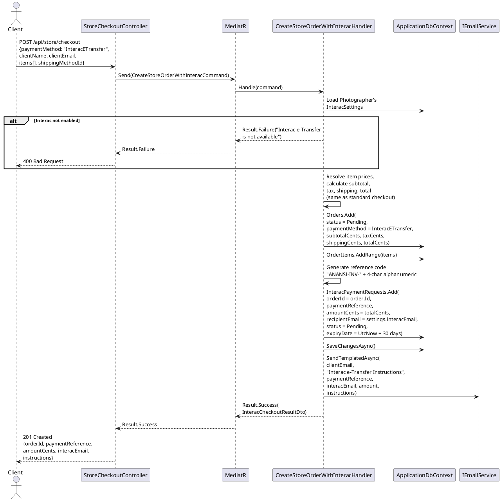
```plantuml
@startuml
actor Client as C
participant "StoreCheckoutController" as SCC
participant "MediatR" as M
participant "CreateStoreOrderWithInteracHandler" as COH
participant "ApplicationDbContext" as DB
participant "IEmailService" as ES

C -> SCC : POST /api/store/checkout\n{paymentMethod: "InteracETransfer",\nclientName, clientEmail,\nitems[], shippingMethodId}
SCC -> M : Send(CreateStoreOrderWithInteracCommand)
M -> COH : Handle(command)

COH -> DB : Load Photographer's\nInteracSettings
alt Interac not enabled
  COH --> M : Result.Failure("Interac e-Transfer\nis not available")
  M --> SCC : Result.Failure
  SCC --> C : 400 Bad Request
end

COH -> COH : Resolve item prices,\ncalculate subtotal,\ntax, shipping, total\n(same as standard checkout)

COH -> DB : Orders.Add(\nstatus = Pending,\npaymentMethod = InteracETransfer,\nsubtotalCents, taxCents,\nshippingCents, totalCents)
COH -> DB : OrderItems.AddRange(items)

COH -> COH : Generate reference code\n"ANANSI-INV-" + 4-char alphanumeric

COH -> DB : InteracPaymentRequests.Add(\norderId = order.Id,\npaymentReference,\namountCents = totalCents,\nrecipientEmail = settings.InteracEmail,\nstatus = Pending,\nexpiryDate = UtcNow + 30 days)

COH -> DB : SaveChangesAsync()

COH -> ES : SendTemplatedAsync(\nclientEmail,\n"Interac e-Transfer Instructions",\npaymentReference,\ninteracEmail, amount,\ninstructions)

COH --> M : Result.Success(\nInteracCheckoutResultDto)
M --> SCC : Result.Success
SCC --> C : 201 Created\n{orderId, paymentReference,\namountCents, interacEmail,\ninstructions}
@enduml
```

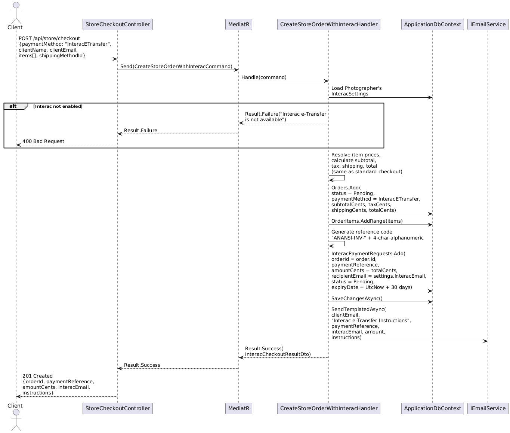
