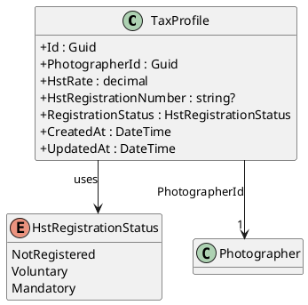
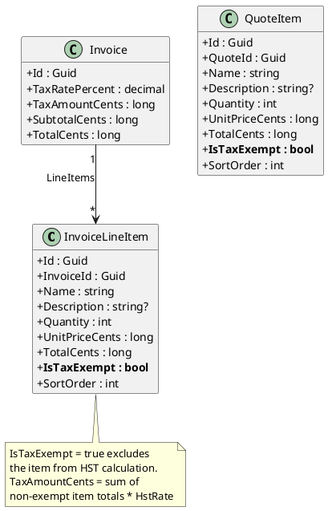
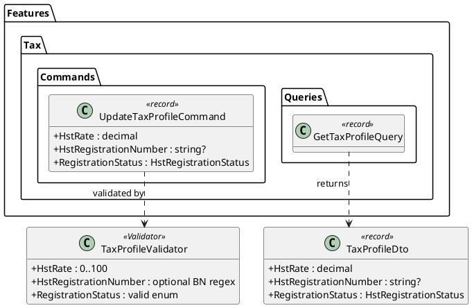
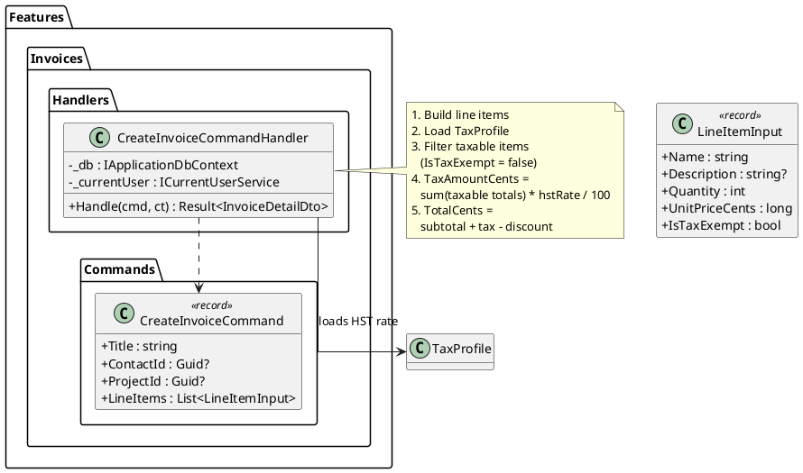
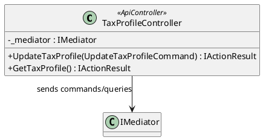
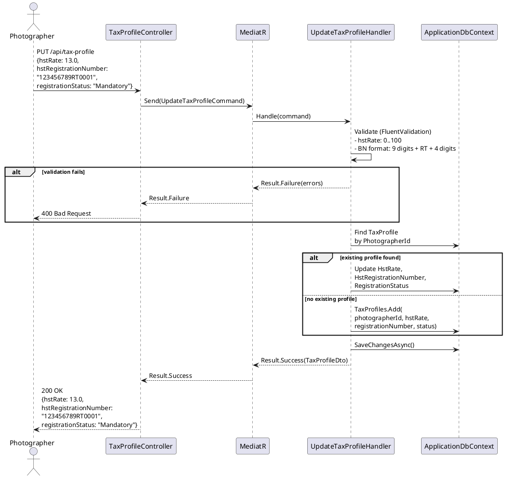
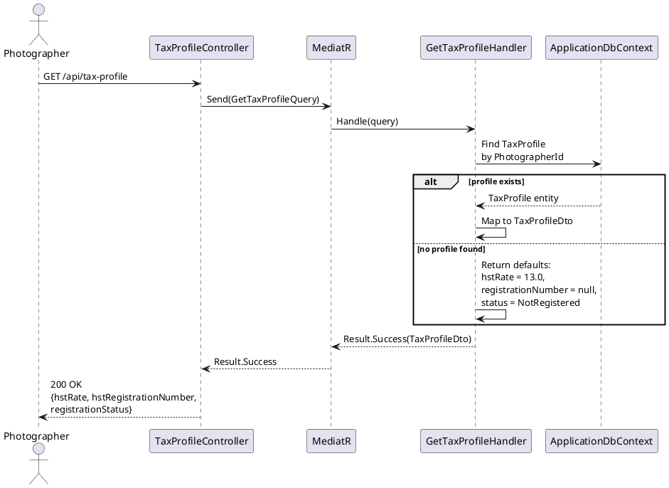
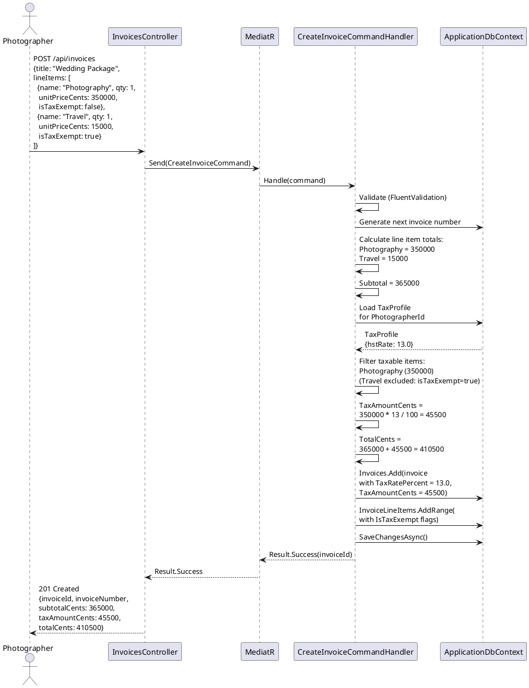
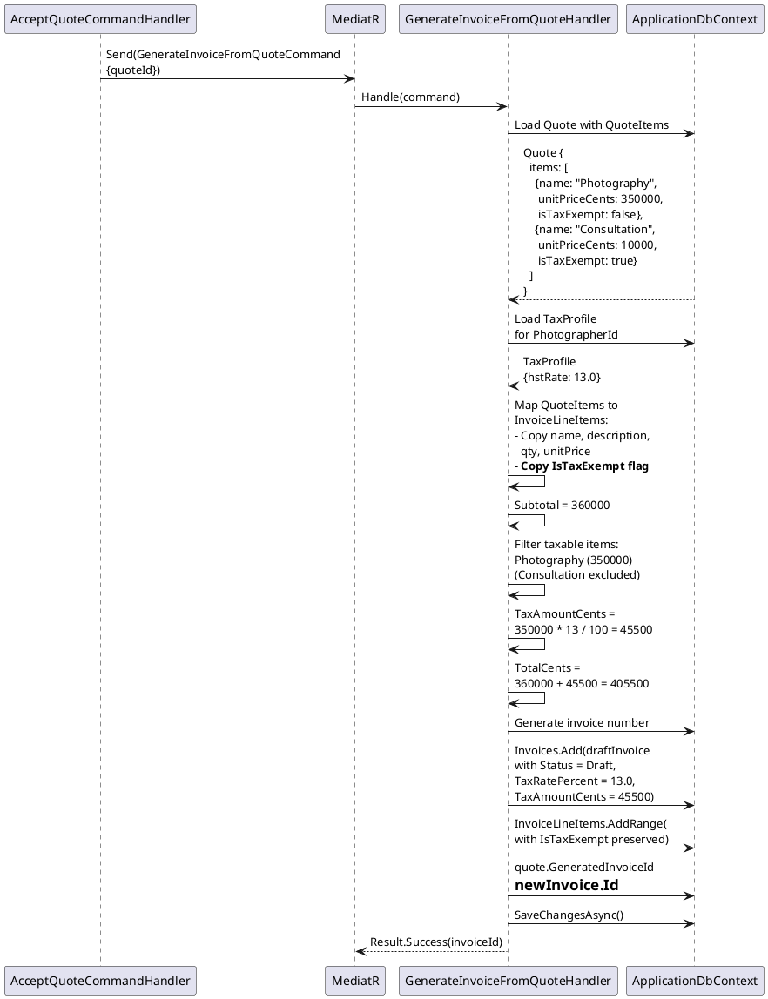

# F47 - HST Tax Configuration & Calculation

## Overview

This feature introduces Ontario Harmonized Sales Tax (HST) support tailored for Canadian photographers operating on the Anansi platform. Rather than the generic per-region tax rate configuration in F15 (Store Checkout), this feature provides a dedicated tax profile with HST-specific fields: the HST rate (defaulting to 13%), the CRA Business Number (HST registration number), and a registration status that reflects the photographer's GST/HST obligations (`NotRegistered`, `Voluntary`, `Mandatory`). The tax profile is a single record per photographer, managed through a dedicated settings endpoint.

When a photographer creates an invoice, the system automatically calculates HST on each taxable line item. The HST amount is computed as the sum of all taxable line item totals multiplied by the configured HST rate, and is displayed as a separate line on the invoice. Line items can be individually marked as tax-exempt (`isTaxExempt = true`), in which case they are excluded from the HST calculation. This ensures that services like consultation fees or digital-only deliverables can be billed without tax when appropriate.

The HST calculation also carries through from quotes to invoices. When a client accepts a quote (F28) and the system auto-generates an invoice draft via `GenerateInvoiceFromQuoteCommand`, the HST rate and tax-exempt flags from the quote items are preserved on the generated invoice. This ensures tax consistency from proposal through billing without requiring the photographer to reconfigure tax settings on the generated invoice.

**L2 Requirements:** TAX-21.1.1 (Tax Profile Configuration), TAX-21.1.2 (Tax Profile Retrieval), TAX-21.2.1 (HST Calculation on Invoices)

---

## Components

### Domain Layer

| Component | Type | Description |
|-----------|------|-------------|
| `TaxProfile` | Entity | Photographer's HST configuration: `HstRate` (decimal, default 13.0), `HstRegistrationNumber` (string, CRA Business Number), `RegistrationStatus`. One record per photographer. Implements `ITenantEntity`, `IAuditableEntity`. |
| `HstRegistrationStatus` | Enum | `NotRegistered`, `Voluntary`, `Mandatory`. Determines the photographer's GST/HST registration posture with CRA. |
| `InvoiceLineItem` | Entity (existing, extended) | Extended with `IsTaxExempt` (bool, default `false`). When `true`, the line item is excluded from HST calculation. |
| `QuoteItem` | Entity (existing, extended) | Extended with `IsTaxExempt` (bool, default `false`). Carries through to generated invoice line items. |

### Application Layer

| Component | Type | Description |
|-----------|------|-------------|
| `UpdateTaxProfileCommand` | Command | Upserts the photographer's `TaxProfile`. Accepts `HstRate`, `HstRegistrationNumber`, `RegistrationStatus`. Validates HST rate is between 0-100, registration number format is valid BN (9 digits + 2 letters + 4 digits). Returns 200 with updated profile (TAX-21.1.1). |
| `GetTaxProfileQuery` | Query | Returns the photographer's `TaxProfile` with all fields. If no profile exists, returns defaults (13%, no registration number, `NotRegistered`) (TAX-21.1.2). |
| `CreateInvoiceCommand` | Command (existing, extended) | Extended to load the photographer's `TaxProfile` when calculating tax. The `TaxRatePercent` on the invoice is populated from `TaxProfile.HstRate`. Tax calculation sums only non-exempt line items before applying the rate (TAX-21.2.1). |
| `RecalculateInvoiceTotalsCommand` | Command (existing, extended) | Updated to respect `IsTaxExempt` on line items. `TaxAmountCents = sum(taxable items' TotalCents) * HstRate / 100`. |
| `GenerateInvoiceFromQuoteCommand` | Command (existing, extended) | Extended to carry `IsTaxExempt` from `QuoteItem` to `InvoiceLineItem` during invoice generation from accepted quotes. |
| `TaxProfileDto` | DTO | Read model: `HstRate`, `HstRegistrationNumber`, `RegistrationStatus`. |
| `TaxProfileValidator` | Validator | FluentValidation: HST rate 0-100 range, optional BN format validation (regex for CRA Business Number format). |

### Infrastructure Layer

| Component | Type | Description |
|-----------|------|-------------|
| `UpdateTaxProfileHandler` | Handler | Loads or creates `TaxProfile` for the photographer. Validates and persists HST rate, registration number, and status. |
| `GetTaxProfileHandler` | Handler | Queries `TaxProfile` by `PhotographerId`. Returns default values if no record exists. |
| `CreateInvoiceCommandHandler` | Handler (existing, extended) | After building line items, loads `TaxProfile`, filters out tax-exempt items, calculates `TaxAmountCents = sum(taxableItemTotals) * hstRate / 100`, sets `TaxRatePercent` from profile. |
| `GenerateInvoiceFromQuoteHandler` | Handler (existing, extended) | Maps `QuoteItem.IsTaxExempt` to `InvoiceLineItem.IsTaxExempt` during the quote-to-invoice conversion. |

### API Layer

| Component | Type | Description |
|-----------|------|-------------|
| `TaxProfileController` | Controller | Authenticated endpoints: `PUT /api/tax-profile` (update tax profile), `GET /api/tax-profile` (retrieve tax profile). |
| `InvoicesController` | Controller (existing) | Existing `POST /api/invoices` endpoint now automatically applies HST from the tax profile during invoice creation. |

---

## Class Diagrams

### Domain Layer -- Tax Profile Entity

### Domain Layer -- Extended Invoice & Quote Line Items

### Application Layer -- Tax Profile Commands & Queries

### Application Layer -- Extended Invoice Creation

### API Layer -- Tax Profile Controller

---

## Sequence Diagrams

### Update Tax Profile

### Get Tax Profile

### Create Invoice with HST Calculation

### HST Carry-Through from Quote to Invoice

