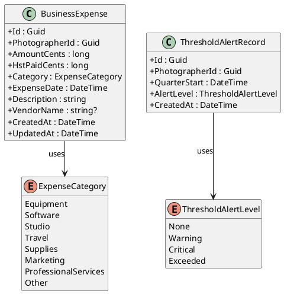
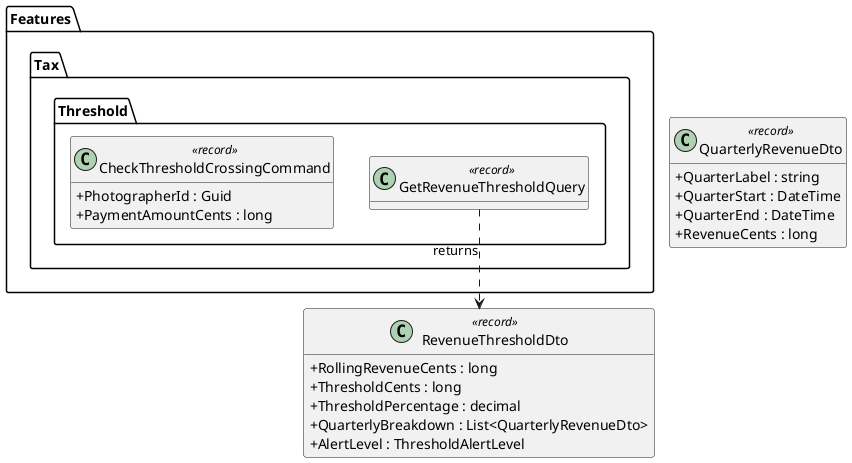
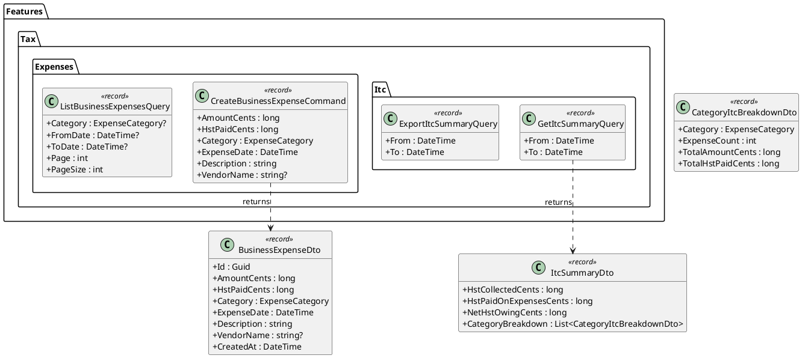
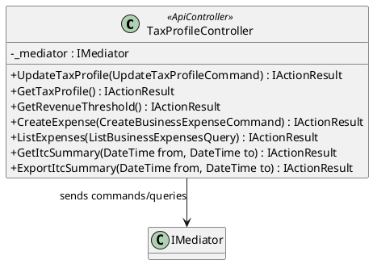
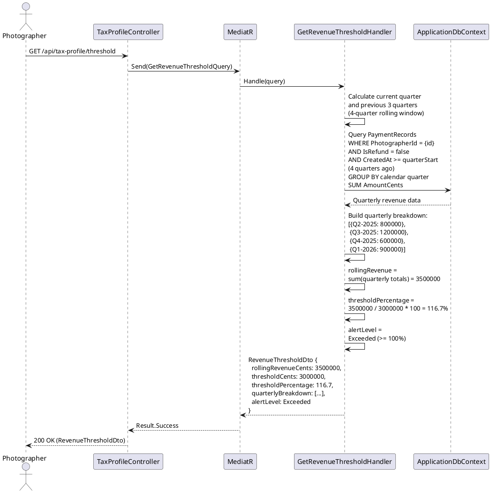
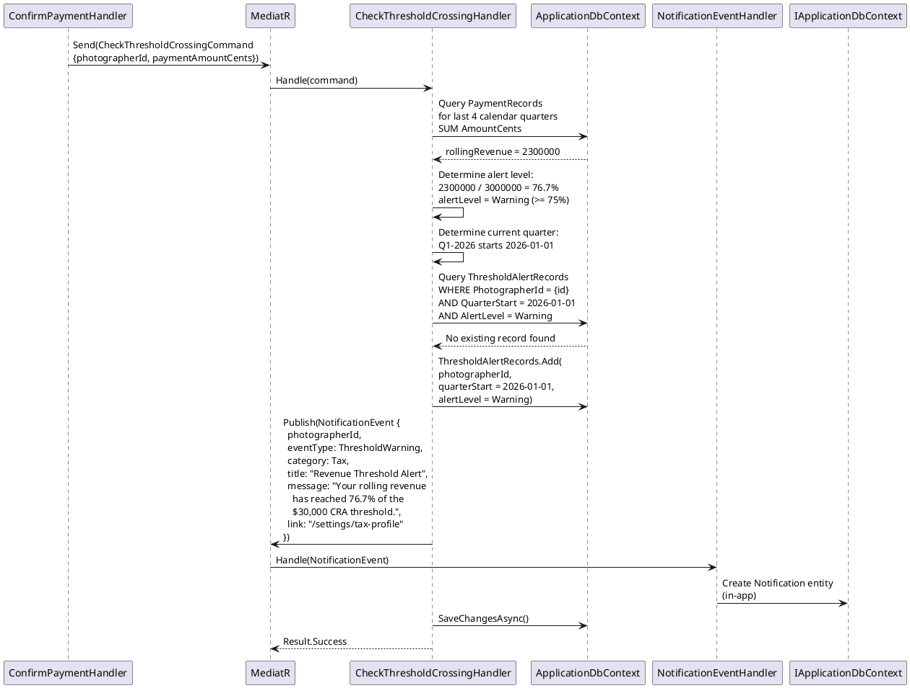
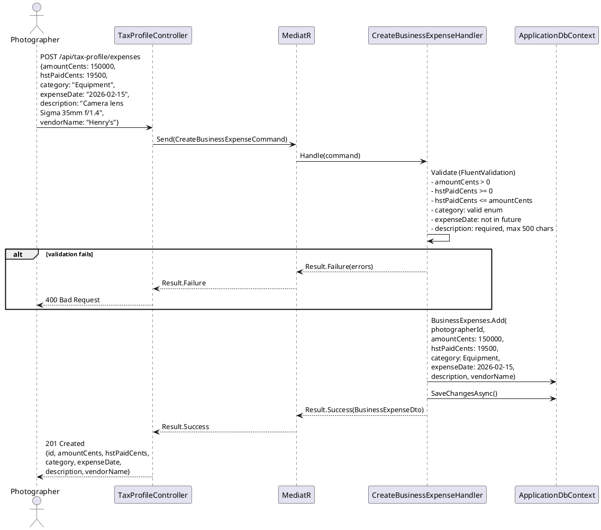
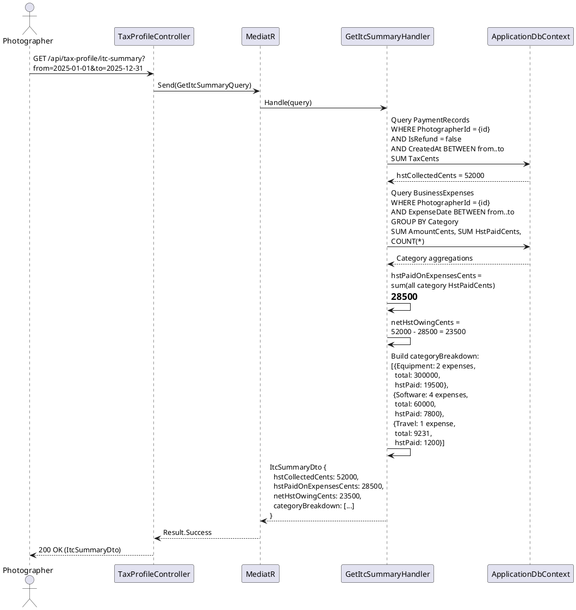
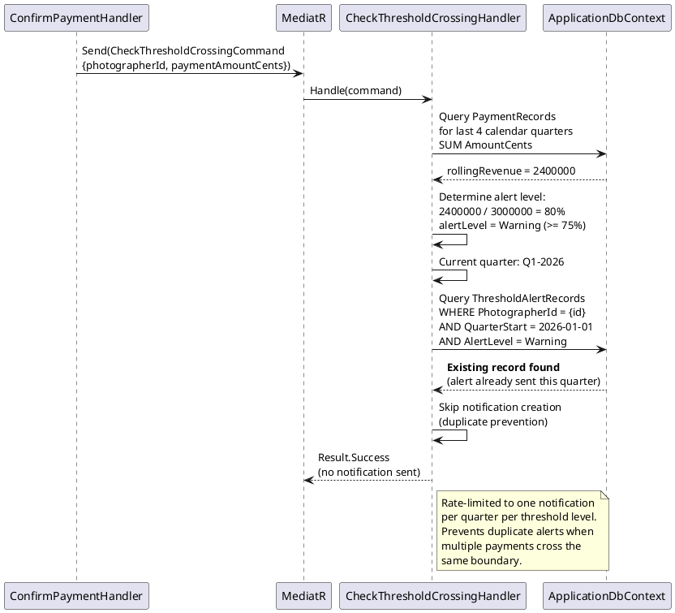

# F48 - Revenue Threshold & Input Tax Credits

## Overview

This feature provides Canadian photographers with tools to monitor their GST/HST registration obligations and manage Input Tax Credits (ITCs). The CRA requires businesses to register for GST/HST once their taxable revenue exceeds $30,000 over four consecutive calendar quarters. Anansi tracks rolling four-quarter revenue from `PaymentRecord` data and presents a threshold dashboard showing the rolling revenue total, percentage of threshold reached, a quarterly breakdown array, and an alert level that escalates through `None`, `Warning` (75%), `Critical` (90%), and `Exceeded` (100%).

When a payment is recorded and the rolling revenue crosses a threshold boundary (75% or 90%), the system generates an in-app notification with category "Tax" using the existing notification infrastructure (F40). Notifications are rate-limited to one per quarter per threshold level, preventing duplicate alerts when multiple payments push revenue above the same boundary within a single quarter. The `Exceeded` alert at 100% indicates the photographer has surpassed the $30,000 threshold and should register.

The expense tracking component allows photographers to record business expenses with HST paid, enabling ITC calculation. Each expense captures the total amount, HST paid in cents, a category (Equipment, Software, Studio, Travel, Supplies, Marketing, Professional Services, Other), date, and description. The ITC summary endpoint aggregates data for a date range: total HST collected (from invoice payments), total HST paid on expenses, net HST owing (collected minus paid), and a category-level breakdown. This data is formatted for CRA filing purposes and can be exported alongside the financial reporting CSV (F31).

**L2 Requirements:** TAX-21.3.1 (Revenue Threshold Tracking), TAX-21.3.2 (Threshold Alert Notifications), TAX-21.4.1 (Business Expense Tracking), TAX-21.4.2 (ITC Summary)

---

## Components

### Domain Layer

| Component | Type | Description |
|-----------|------|-------------|
| `BusinessExpense` | Entity | A business expense record: `AmountCents`, `HstPaidCents`, `Category`, `ExpenseDate`, `Description`, `VendorName`. Implements `ITenantEntity`, `IAuditableEntity`. |
| `ExpenseCategory` | Enum | `Equipment`, `Software`, `Studio`, `Travel`, `Supplies`, `Marketing`, `ProfessionalServices`, `Other`. |
| `ThresholdAlertRecord` | Entity | Tracks which threshold alerts have been sent per quarter to prevent duplicates. Contains `PhotographerId`, `QuarterStart` (DateTime), `AlertLevel`. Implements `ITenantEntity`. |
| `ThresholdAlertLevel` | Enum | `None`, `Warning`, `Critical`, `Exceeded`. Corresponds to 0%, 75%, 90%, and 100% of the $30,000 CRA threshold. |
| `PaymentRecord` | Entity (existing) | Used as the source of revenue data for threshold calculation. Aggregated by quarter. |
| `Notification` | Entity (existing) | Threshold crossing alerts create notifications with `Category = Tax`. |

### Application Layer

| Component | Type | Description |
|-----------|------|-------------|
| `GetRevenueThresholdQuery` | Query | Calculates rolling four-quarter revenue from `PaymentRecord` data. Returns `rollingRevenue`, `thresholdPercentage`, `quarterlyBreakdown[]`, and `alertLevel` (TAX-21.3.1). |
| `CheckThresholdCrossingCommand` | Command | Triggered after a payment is recorded. Calculates current rolling revenue, determines if a new threshold level has been crossed, and if so creates a notification via the existing notification system. Rate-limited to one notification per quarter per level (TAX-21.3.2). |
| `CreateBusinessExpenseCommand` | Command | Creates a `BusinessExpense` record with amount, HST paid, category, date, and description. Returns 201 with the expense record (TAX-21.4.1). |
| `ListBusinessExpensesQuery` | Query | Paginated list of expenses filterable by category and date range. |
| `GetItcSummaryQuery` | Query | Aggregates HST data for a date range. Returns `hstCollected` (from invoices), `hstPaidOnExpenses`, `netHstOwing`, and `categoryBreakdown[]` (TAX-21.4.2). |
| `ExportItcSummaryQuery` | Query | Produces a CSV export of ITC data for CRA filing purposes. |
| `RevenueThresholdDto` | DTO | Read model: `RollingRevenueCents`, `ThresholdCents` (3000000), `ThresholdPercentage`, `QuarterlyBreakdown[]`, `AlertLevel`. |
| `QuarterlyRevenueDto` | DTO | Per-quarter breakdown: `QuarterLabel` (e.g., "2026-Q1"), `QuarterStart`, `QuarterEnd`, `RevenueCents`. |
| `BusinessExpenseDto` | DTO | Read model: `Id`, `AmountCents`, `HstPaidCents`, `Category`, `ExpenseDate`, `Description`, `VendorName`, `CreatedAt`. |
| `ItcSummaryDto` | DTO | Read model: `HstCollectedCents`, `HstPaidOnExpensesCents`, `NetHstOwingCents`, `CategoryBreakdown[]`. |
| `CategoryItcBreakdownDto` | DTO | Per-category ITC: `Category`, `ExpenseCount`, `TotalAmountCents`, `TotalHstPaidCents`. |

### Infrastructure Layer

| Component | Type | Description |
|-----------|------|-------------|
| `GetRevenueThresholdHandler` | Handler | Queries `PaymentRecord` for last 4 calendar quarters (non-refund records), groups by quarter, sums amounts, calculates percentage and alert level. |
| `CheckThresholdCrossingHandler` | Handler | Calculates rolling revenue, determines current alert level, checks `ThresholdAlertRecord` for existing alert in current quarter at that level, creates notification if new crossing detected. |
| `CreateBusinessExpenseHandler` | Handler | Validates and persists the `BusinessExpense` entity. |
| `GetItcSummaryHandler` | Handler | Queries `PaymentRecord` for HST collected (sum of `TaxCents` in date range), queries `BusinessExpense` for HST paid (sum of `HstPaidCents`), calculates net, groups expenses by category. |
| `ExportItcSummaryHandler` | Handler | Builds CSV with HST collected, HST paid, net owing, and per-category detail rows. |
| `PaymentRecordedEventHandler` | Event Handler (extended) | Listens for payment recorded events and dispatches `CheckThresholdCrossingCommand` to evaluate threshold crossing. |

### API Layer

| Component | Type | Description |
|-----------|------|-------------|
| `TaxProfileController` | Controller (extended) | Extended with: `GET /api/tax-profile/threshold` (revenue threshold dashboard), `POST /api/tax-profile/expenses` (create expense), `GET /api/tax-profile/expenses` (list expenses), `GET /api/tax-profile/itc-summary` (ITC summary with date range). |

---

## Class Diagrams

### Domain Layer -- Business Expense & Threshold Entities

### Application Layer -- Revenue Threshold Commands & Queries

### Application Layer -- Expense Commands & ITC Queries

### API Layer -- Extended Tax Profile Controller

---

## Sequence Diagrams

### Get Revenue Threshold Dashboard

### Threshold Crossing Notification on Payment

### Create Business Expense

### Get ITC Summary

### Threshold Duplicate Prevention

