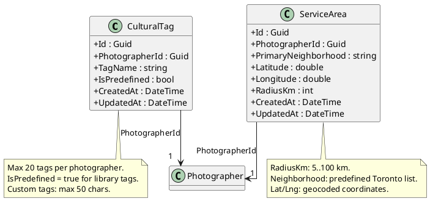
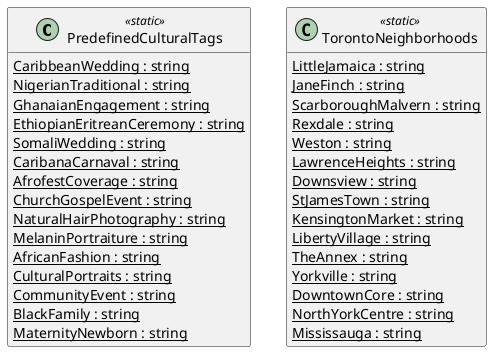
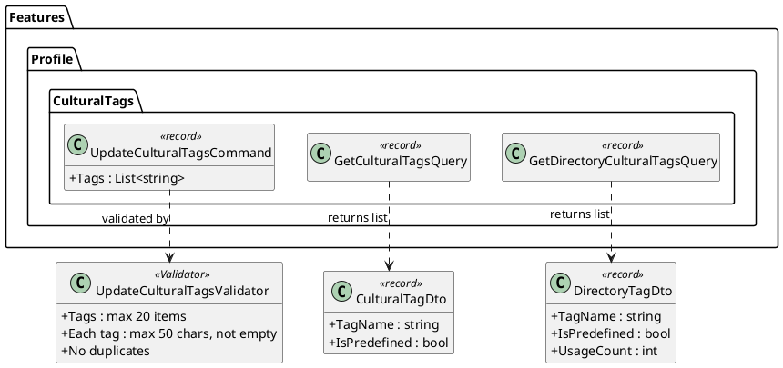
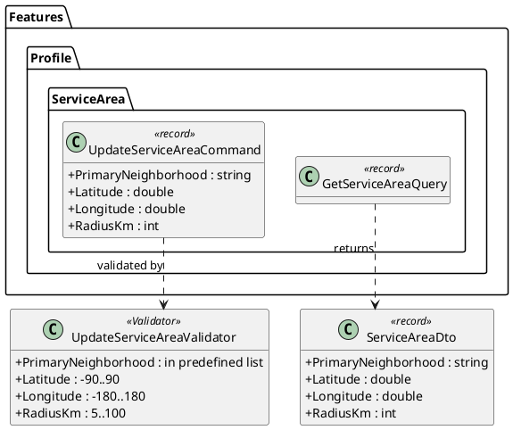
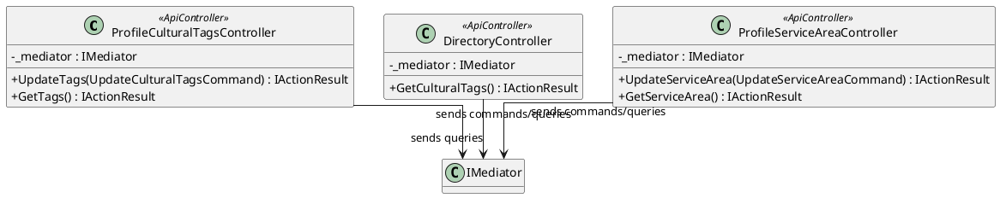
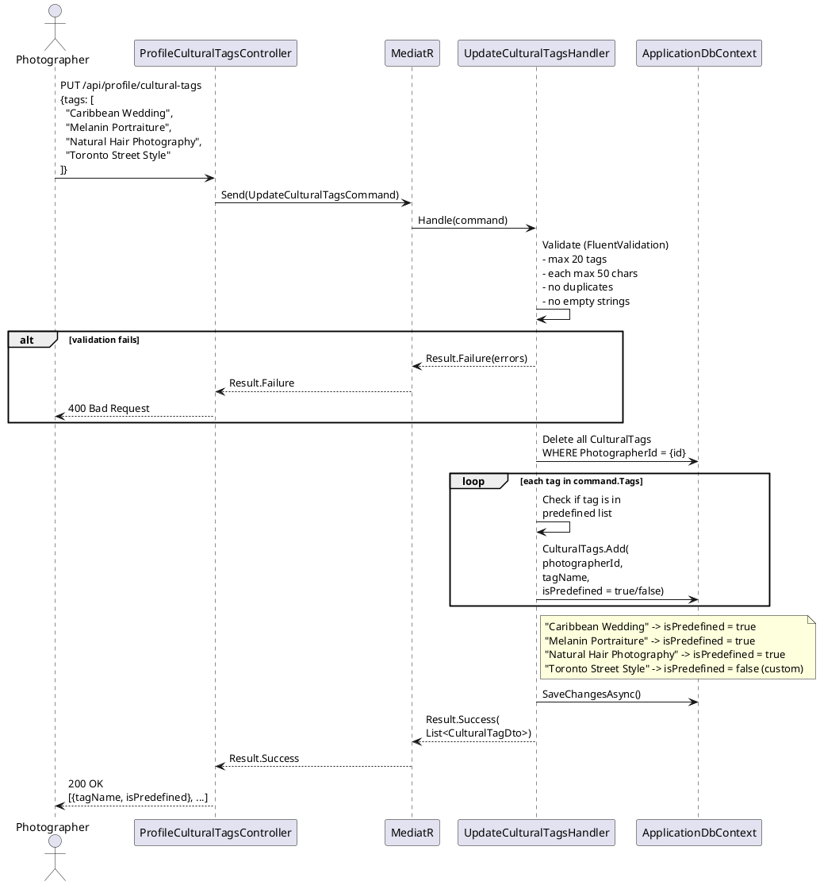
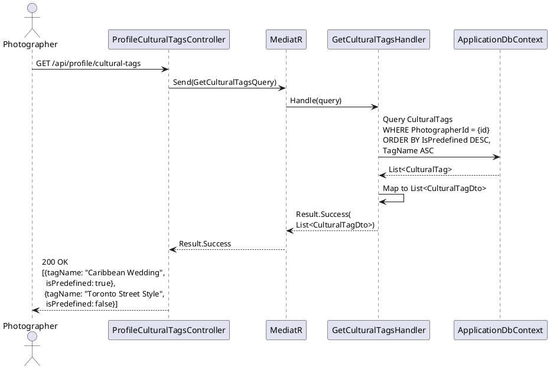
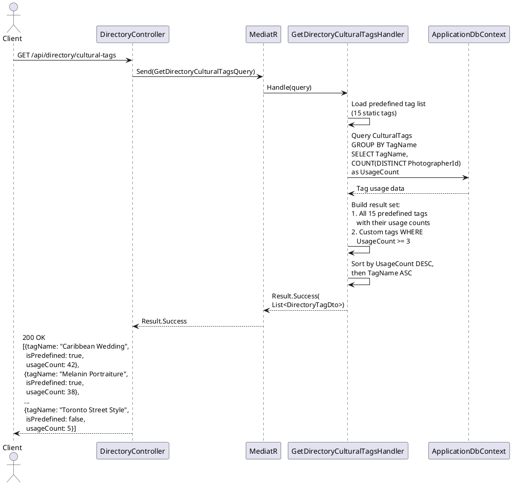
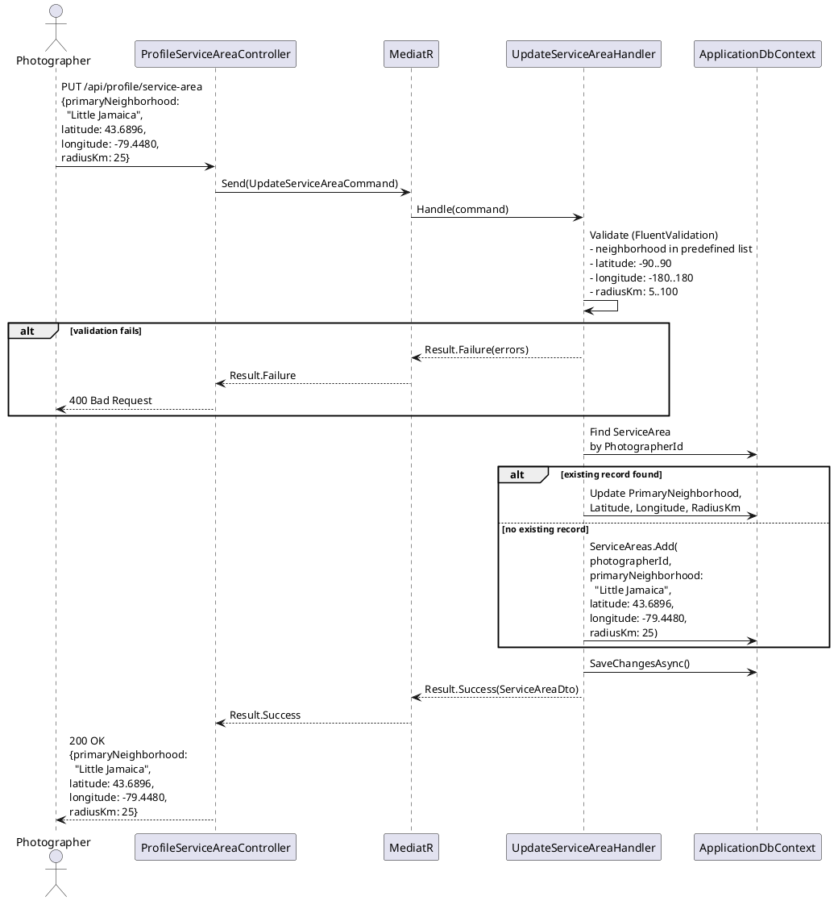
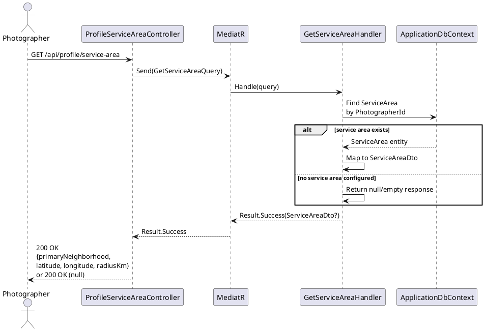

# F49 - Cultural Specialization Tags

## Overview

This feature enables photographers on the Anansi platform to express their cultural expertise and service areas through a tagging and geolocation system. Photographers select cultural specialization tags from a predefined library of 15 tags representing photography niches within Black and diasporic communities: Caribbean Wedding, Nigerian Traditional, Ghanaian Engagement, Ethiopian/Eritrean Ceremony, Somali Wedding, Caribana/Carnival, Afrofest Coverage, Church/Gospel Event, Natural Hair Photography, Melanin Portraiture, African Fashion, Cultural Portraits, Community Event, Black Family, and Maternity/Newborn. In addition to predefined tags, photographers can create custom free-text tags (max 50 characters each). A maximum of 20 tags (predefined + custom combined) can be associated with a single photographer profile. These tags are visible on the photographer's public profile.

The directory endpoint surfaces the full tag library for client-facing discovery. It returns all predefined tags alongside any custom tags that have been adopted by 3 or more photographers, each with a `usageCount` indicating how many photographers use that tag. This creates an organic, community-driven expansion of the tag vocabulary where popular custom tags gain visibility alongside the curated predefined set.

The neighborhood and service area component allows photographers to declare their primary neighborhood from a predefined list of Toronto neighborhoods (Little Jamaica, Jane-Finch, Scarborough/Malvern, Rexdale, Weston, Lawrence Heights, Downsview, St. James Town, Kensington Market, Liberty Village, The Annex, Yorkville, Downtown Core, North York Centre, Mississauga), set a service radius between 5 and 100 km, and store geocoded latitude/longitude coordinates. This data supports future proximity-based search and directory filtering, enabling clients to find photographers who specialize in their cultural traditions and serve their area.

**L2 Requirements:** TAG-22.1.1 (Cultural Tags), TAG-22.1.2 (Directory Tags), TAG-22.2.1 (Service Area)

---

## Components

### Domain Layer

| Component | Type | Description |
|-----------|------|-------------|
| `CulturalTag` | Entity | A tag associated with a photographer. Contains `TagName`, `IsPredefined` (bool, distinguishes library vs custom tags), and link to `PhotographerId`. Implements `ITenantEntity`, `IAuditableEntity`. |
| `PredefinedCulturalTag` | Seed Data | Static list of 15 predefined tag names seeded into the system. Not a separate entity -- used as reference data for validation and directory display. |
| `ServiceArea` | Entity | Photographer's geographic service configuration: `PrimaryNeighborhood`, `Latitude`, `Longitude`, `RadiusKm`. One record per photographer. Implements `ITenantEntity`, `IAuditableEntity`. |
| `TorontoNeighborhood` | Seed Data | Static list of 15 predefined Toronto neighborhoods with their names. Used for validation of the `PrimaryNeighborhood` field. |

### Application Layer

| Component | Type | Description |
|-----------|------|-------------|
| `UpdateCulturalTagsCommand` | Command | Replaces the photographer's full set of cultural tags. Accepts an array of tag names (predefined or custom). Validates max 20 tags, custom tags max 50 chars each. Returns 200 with stored tags (TAG-22.1.1). |
| `GetCulturalTagsQuery` | Query | Returns the photographer's current cultural tags (TAG-22.1.1). |
| `GetDirectoryCulturalTagsQuery` | Query | Returns all available tags for directory display: all 15 predefined tags plus custom tags used by 3+ photographers, each with `usageCount` (TAG-22.1.2). |
| `UpdateServiceAreaCommand` | Command | Upserts the photographer's service area: `PrimaryNeighborhood` (validated against predefined list), `Latitude`, `Longitude`, `RadiusKm` (5-100). Returns 200 (TAG-22.2.1). |
| `GetServiceAreaQuery` | Query | Returns the photographer's service area configuration (TAG-22.2.1). |
| `CulturalTagDto` | DTO | Read model: `TagName`, `IsPredefined`. |
| `DirectoryTagDto` | DTO | Directory read model: `TagName`, `IsPredefined`, `UsageCount`. |
| `ServiceAreaDto` | DTO | Read model: `PrimaryNeighborhood`, `Latitude`, `Longitude`, `RadiusKm`. |
| `UpdateCulturalTagsValidator` | Validator | FluentValidation: max 20 tags, each tag max 50 chars, no duplicates, no empty strings. |
| `UpdateServiceAreaValidator` | Validator | FluentValidation: `PrimaryNeighborhood` must be in predefined list, `RadiusKm` between 5-100, `Latitude` between -90..90, `Longitude` between -180..180. |

### Infrastructure Layer

| Component | Type | Description |
|-----------|------|-------------|
| `UpdateCulturalTagsHandler` | Handler | Deletes all existing `CulturalTag` records for the photographer, then inserts the new set. For each tag, determines `IsPredefined` by checking against the static predefined list. |
| `GetCulturalTagsHandler` | Handler | Queries `CulturalTags` by `PhotographerId`, returns as DTOs. |
| `GetDirectoryCulturalTagsHandler` | Handler | Returns all 15 predefined tags with usage counts, plus custom tags with `COUNT(PhotographerId) >= 3`. Groups by `TagName`, counts distinct photographers. |
| `UpdateServiceAreaHandler` | Handler | Upserts `ServiceArea` for the photographer. Validates neighborhood against predefined list. |
| `GetServiceAreaHandler` | Handler | Queries `ServiceArea` by `PhotographerId`. |
| `PredefinedCulturalTagSeed` | Seed Data | Database seeder that provides the static list of 15 predefined cultural tag names for validation and directory queries. |
| `TorontoNeighborhoodSeed` | Seed Data | Database seeder that provides the static list of 15 Toronto neighborhoods for service area validation. |

### API Layer

| Component | Type | Description |
|-----------|------|-------------|
| `ProfileCulturalTagsController` | Controller | Authenticated endpoints: `PUT /api/profile/cultural-tags` (update tags), `GET /api/profile/cultural-tags` (get photographer's tags). |
| `DirectoryController` | Controller | Public endpoint: `GET /api/directory/cultural-tags` (available tags with usage counts). |
| `ProfileServiceAreaController` | Controller | Authenticated endpoints: `PUT /api/profile/service-area` (update service area), `GET /api/profile/service-area` (get service area). |

---

## Class Diagrams

### Domain Layer -- Cultural Tag & Service Area Entities

### Domain Layer -- Predefined Reference Data

### Application Layer -- Cultural Tags Commands & Queries

### Application Layer -- Service Area Commands & Queries

### API Layer -- Profile & Directory Controllers

---

## Sequence Diagrams

### Update Cultural Tags

### Get Photographer's Cultural Tags

### Get Directory Cultural Tags

### Update Service Area

### Get Service Area

