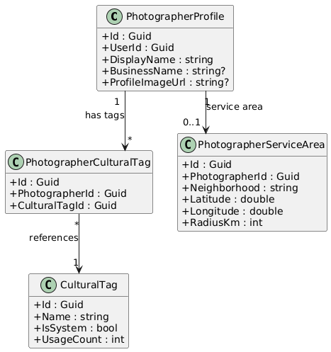
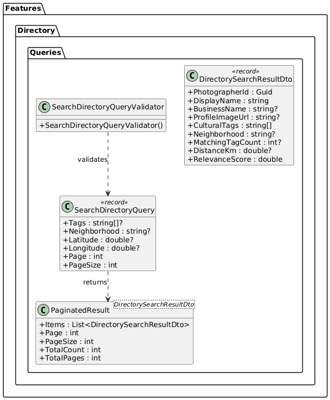
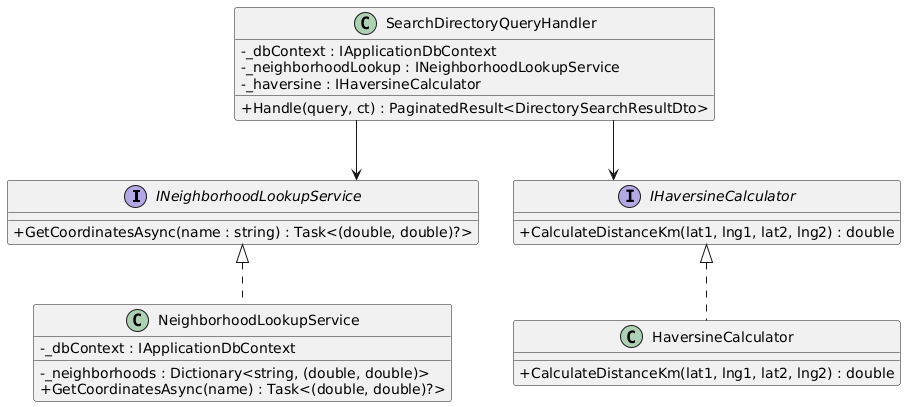
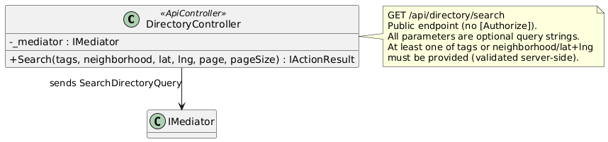
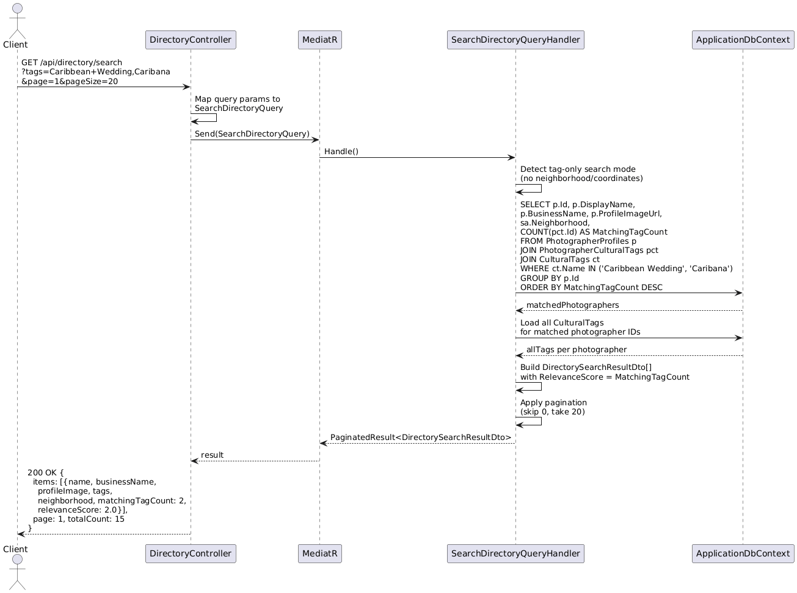
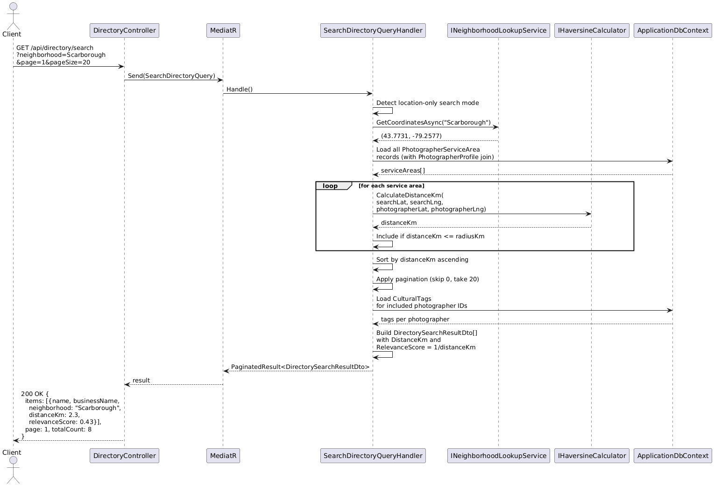
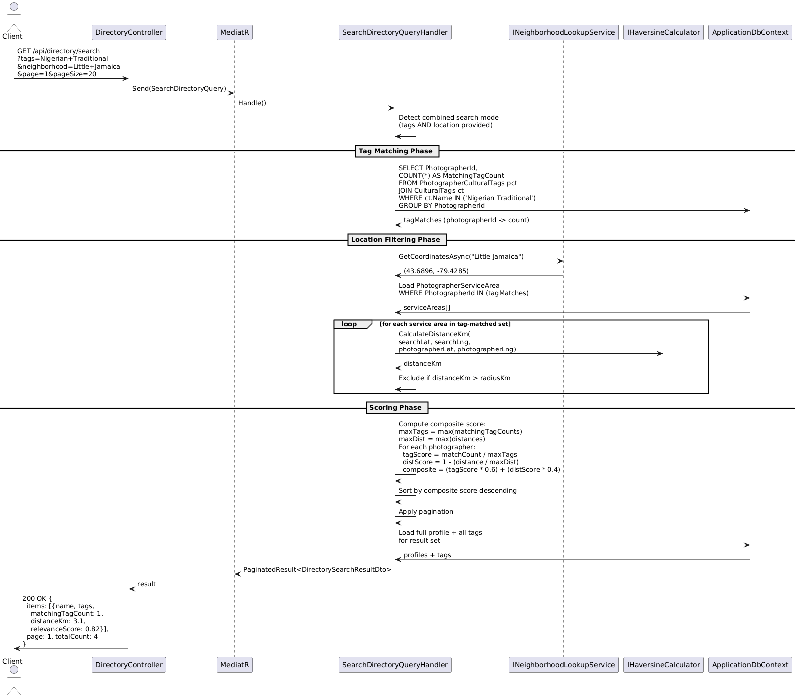

# F50 - Photographer Directory Search

## Overview

This feature delivers the public-facing photographer directory search API, enabling clients to discover photographers by cultural specialization, geographic proximity, or both. The search surface is entirely public -- no authentication is required -- and serves as the primary discovery mechanism for connecting clients with photographers who have cultural expertise relevant to their needs.

The directory search supports three modes. Tag-based search accepts one or more cultural specialization tag names and returns photographers who match ANY of the specified tags, ranked by the number of matching tags (relevance score). Location-based search accepts either a predefined neighborhood name or raw latitude/longitude coordinates and returns photographers whose configured service radius covers the search point, ranked by distance calculated via the Haversine formula. Combined search applies both tag and location filters simultaneously, returning only photographers who match at least one tag AND serve the specified area, ranked by a composite score that blends tag relevance with geographic proximity.

All search results are paginated (default 20 per page) and include photographer name, business name, profile image URL, cultural tags, neighborhood, and the computed relevance or distance score. The search leverages the cultural tags and service area data established by F49 (Cultural Specialization Tags), reading from `PhotographerCulturalTag`, `PhotographerServiceArea`, and related entities. Because these are read-only queries against public profile data, the feature has no write operations and no authorization requirements.

**L2 Requirements:** TAG-22.3.1 (Search by Cultural Tags), TAG-22.3.2 (Search by Neighborhood/Distance), TAG-22.3.3 (Combined Search)

---

## Components

### Domain Layer

| Component | Type | Description |
|-----------|------|-------------|
| `PhotographerCulturalTag` | Entity (existing, F49) | Join entity linking a photographer to a cultural tag. Fields: `PhotographerId`, `CulturalTagId`. Implements `ITenantEntity`. |
| `CulturalTag` | Entity (existing, F49) | A cultural specialization tag with `Name`, `IsSystem` (predefined vs. custom), `UsageCount`. |
| `PhotographerServiceArea` | Entity (existing, F49) | Stores photographer's `Neighborhood`, `Latitude`, `Longitude`, `RadiusKm`. Implements `ITenantEntity`. |
| `Neighborhood` | Value Object (existing, F49) | Predefined Toronto neighborhoods with `Name`, `Latitude`, `Longitude`. Used to resolve neighborhood name to coordinates in location search. |
| `PhotographerProfile` | Entity (existing, F01) | Contains `DisplayName`, `BusinessName`, `ProfileImageUrl`. Referenced to build search result DTOs. |

### Application Layer

| Component | Type | Description |
|-----------|------|-------------|
| `SearchDirectoryQuery` | Query | Unified search query accepting optional `Tags` (string array), optional `Neighborhood` (string), optional `Latitude`/`Longitude` (double?), `Page` (int, default 1), `PageSize` (int, default 20). Dispatched via MediatR. |
| `SearchDirectoryQueryHandler` | Handler | Core search logic. Branches on which filters are provided: tag-only, location-only, or combined. Builds the result set from joined queries against `PhotographerCulturalTag`, `PhotographerServiceArea`, and `PhotographerProfile`. Computes relevance scores and distances. Returns `PaginatedResult<DirectorySearchResultDto>`. |
| `DirectorySearchResultDto` | DTO | Result item: `PhotographerId`, `DisplayName`, `BusinessName`, `ProfileImageUrl`, `CulturalTags` (string[]), `Neighborhood`, `MatchingTagCount` (int?), `DistanceKm` (double?), `RelevanceScore` (double). |
| `PaginatedResult<T>` | DTO (existing) | Generic paginated wrapper: `Items`, `Page`, `PageSize`, `TotalCount`, `TotalPages`. |
| `SearchDirectoryQueryValidator` | Validator | FluentValidation rules: at least one of Tags or Neighborhood/Coordinates must be provided. PageSize max 100. Latitude range -90 to 90. Longitude range -180 to 180. |
| `INeighborhoodLookupService` | Interface | Resolves a neighborhood name to lat/lng coordinates. `GetCoordinatesAsync(string neighborhoodName)` returns `(double Latitude, double Longitude)?`. |
| `IHaversineCalculator` | Interface | Computes distance between two geographic points. `CalculateDistanceKm(double lat1, double lng1, double lat2, double lng2)` returns `double`. |

### Infrastructure Layer

| Component | Type | Description |
|-----------|------|-------------|
| `SearchDirectoryQueryHandler` | Handler | Implements the search logic. For tag search: joins `PhotographerCulturalTag` with `CulturalTag` filtering by tag names, groups by photographer, counts matches, orders by count descending. For location search: loads all `PhotographerServiceArea` records, computes Haversine distance, filters where distance <= radiusKm, orders by distance ascending. For combined: intersects both result sets, computes composite score (normalized tag count + inverse normalized distance). |
| `NeighborhoodLookupService` | Service | Implements `INeighborhoodLookupService`. Maintains an in-memory dictionary of predefined Toronto neighborhoods with their coordinates. Falls back to database lookup for custom neighborhoods. |
| `HaversineCalculator` | Service | Implements `IHaversineCalculator`. Pure math implementation of the Haversine formula: `a = sin^2(dlat/2) + cos(lat1) * cos(lat2) * sin^2(dlng/2)`, `c = 2 * atan2(sqrt(a), sqrt(1-a))`, `d = R * c` where R = 6371 km. |
| `PhotographerCulturalTagConfiguration` | EF Config (existing, F49) | Composite index on `(CulturalTagId, PhotographerId)` for efficient tag-based lookups. |
| `PhotographerServiceAreaConfiguration` | EF Config (existing, F49) | Index on `(Latitude, Longitude)` for spatial queries. |

### API Layer

| Component | Type | Description |
|-----------|------|-------------|
| `DirectoryController` | Controller | Single public endpoint: `GET /api/directory/search`. Accepts query parameters: `tags` (comma-separated), `neighborhood` (string), `lat` (double?), `lng` (double?), `page` (int), `pageSize` (int). No `[Authorize]` attribute. Maps query string to `SearchDirectoryQuery` and dispatches via MediatR. Returns `200 OK` with paginated results. |

---

## Class Diagrams

### Domain Layer -- Directory Search Entities (from F49)

### Application Layer -- Search Query & DTOs

### Infrastructure Layer -- Search Services

### API Layer -- Directory Controller

---

## Sequence Diagrams

### Search by Cultural Tags

### Search by Neighborhood / Distance

### Combined Search (Tags + Location)

